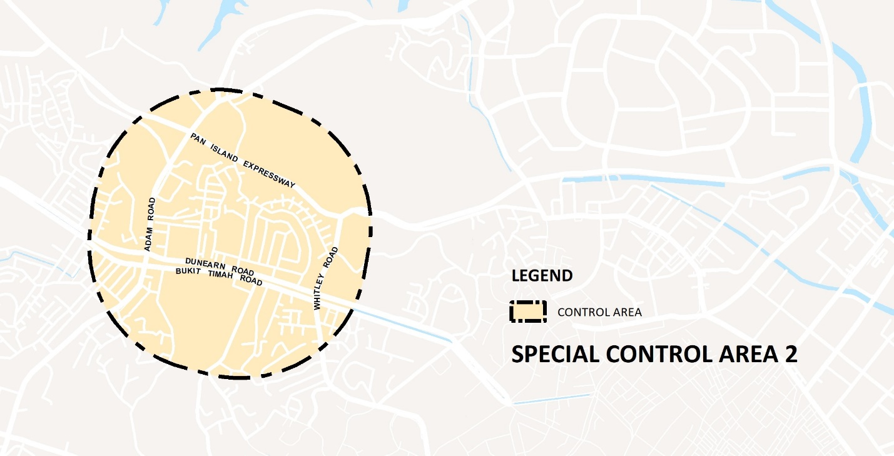
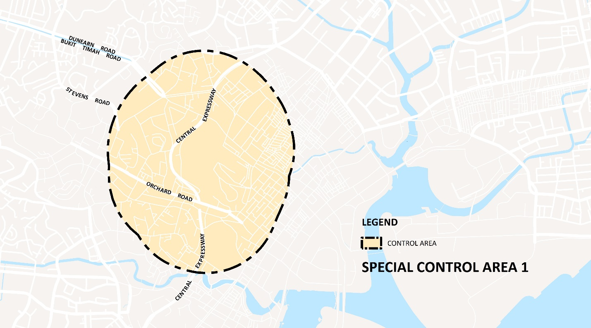
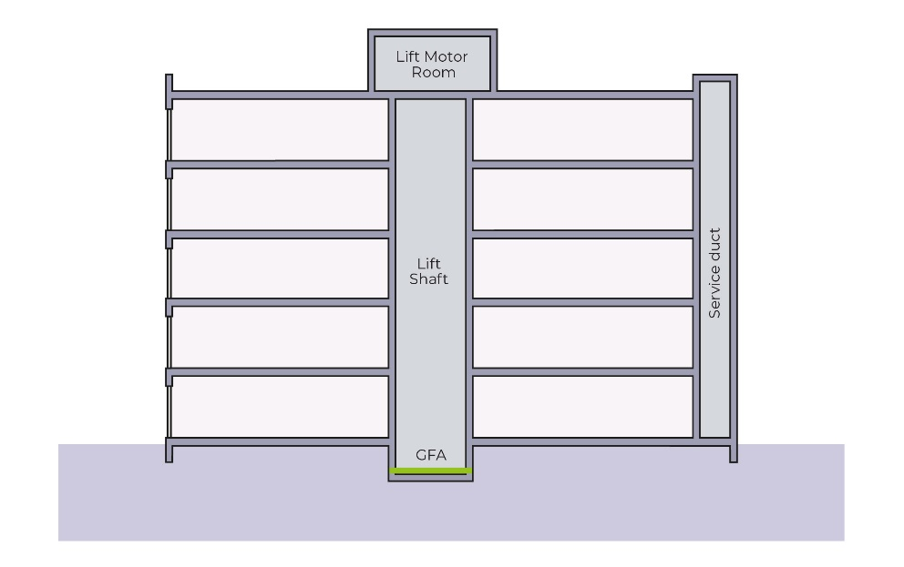
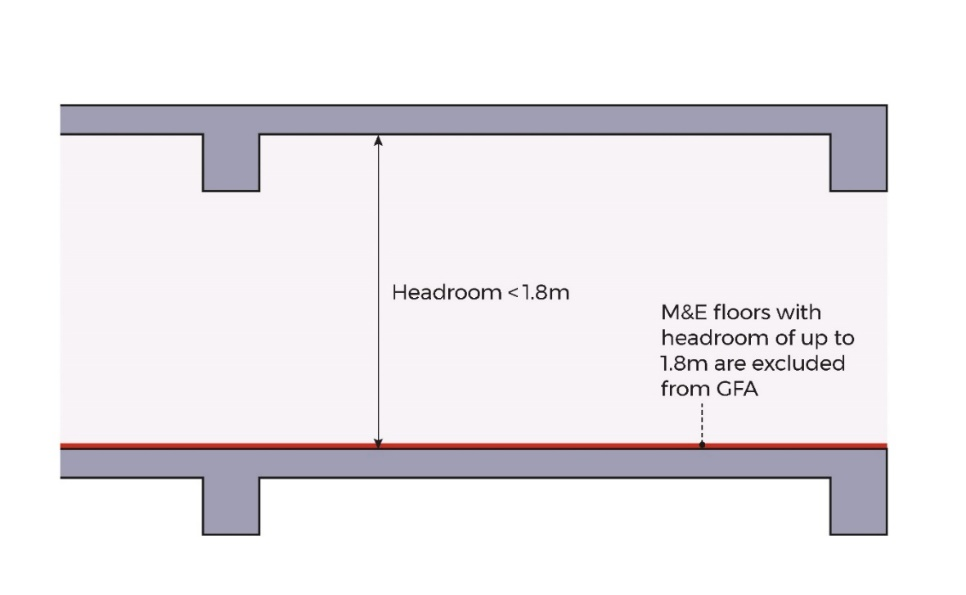

# Bungalows (or Detached Houses)

**Advisory Notes**

The guidelines set out in this handbook for the various development
control parameters will generally be applied by URA in the consideration
of a development application. However, if the circumstances of a case or
the planning considerations relevant to a case so warrant, URA may in
its discretion decide to depart from these general guidelines. Persons
intending to carry out a development are advised to take this into
consideration in the conduct of their affairs and check with URA through
enquiries or development applications to confirm if their proposals can
be allowed.

The guidelines, principles and illustrations found in the handbook
series are not exhaustive in covering all possible site conditions and
building designs. In evaluating the development applications, URA
reserves the right to evaluate and impose conditions not covered in the
handbook in respond to the specific design of the development proposal
depending on merits.

**Guidelines at a Glance: Bungalow (or Detached House)**

The table below is intended to provide an overview of the key guidelines
applicable for the development type. The full details of the guidelines
are stated in the relevant tabs of this handbook.

+----------------------+----------------------+----------------------+
| **PARAMETER**        | **WITHIN GCBA**      | **OUTSIDE GCBA**     |
+======================+======================+======================+
| Plot Size, Width and | Size: 1,400sqm       | Size: 400sqm         |
| Depth                |                      |                      |
|                      | Width: 18.5m         | Width: 10m           |
| (minimum)            |                      |                      |
|                      | Depth: 30m           | Depth: No minimum    |
+----------------------+----------------------+----------------------+
| Site Coverage        | 40% (maximum)        | 50% (maximum)        |
+----------------------+----------------------+----------------------+
| Access Point         | **Vehicular Access** |                      |
|                      |                      |                      |
|                      | Only one vehicular   |                      |
|                      | access point shall   |                      |
|                      | be allowed per plot. |                      |
|                      |                      |                      |
|                      | **Entrance to a      |                      |
|                      | Landed House**       |                      |
|                      |                      |                      |
|                      | Only one main        |                      |
|                      | entrance door for a  |                      |
|                      | single residential   |                      |
|                      | unit for family      |                      |
|                      | dwelling purposes    |                      |
|                      | shall be allowed in  |                      |
|                      | a landed house.      |                      |
+----------------------+----------------------+----------------------+
| Building Setback     | **Road Buffer/Green  |                      |
|                      | Buffer**             |                      |
+----------------------+----------------------+----------------------+
|                      | [Main building:      | [Main building:      |
|                      | ]{.ul}               | ]{.ul}               |
|                      |                      |                      |
|                      | Cat 1 Road: 24m      | Cat 1 Road: 24m      |
|                      | (incl. 5m green      | (incl. 5m green      |
|                      | buffer)              | buffer)              |
|                      |                      |                      |
|                      | Cat 2 Road: 12m      | Cat 2 Road: 12m      |
|                      | (incl. 5m green      | (incl. 5m green      |
|                      | buffer)              | buffer)              |
|                      |                      |                      |
|                      | Cat 3 & 4 Road: 7.5m | Cat 3 & 4 Road: 7.5m |
|                      | (incl. 3m green      | (incl. 3m green      |
|                      | buffer)              | buffer)              |
|                      |                      |                      |
|                      | Cat 5 Road: 7.5m (no | Cat 5 Road: 7.5m (no |
|                      | green buffer)        | green buffer)        |
|                      |                      |                      |
|                      | [Patio/Terrace]{.ul} | [Patio/Terrace, Car  |
|                      |                      | porch roof           |
|                      | Cat 1-2 Road:        | eaves]{.ul}:         |
|                      | Maximum depth of     |                      |
|                      | patio/terrace        | Cat 1-2 Road: Car    |
|                      | protrusion into the  | porch protrusion     |
|                      | road buffer not to   | into road buffer not |
|                      | exceed 5m            | to exceed 5m depth   |
|                      |                      |                      |
|                      | Cat 3-5 Road: 5.1m   | Cat 3-5 Road: 2.4m   |
|                      |                      |                      |
|                      | [Car porch roof      |                      |
|                      | eaves]{.ul}:         |                      |
|                      |                      |                      |
|                      | Cat 1-2 Road: Car    |                      |
|                      | porch protrusion     |                      |
|                      | into road buffer not |                      |
|                      | to exceed 5m depth   |                      |
|                      |                      |                      |
|                      | Cat 3-5 Road: 2.4m   |                      |
+----------------------+----------------------+----------------------+
|                      | **Setback from       |                      |
|                      | Common Boundaries**  |                      |
+----------------------+----------------------+----------------------+
|                      | [Main building, car  | [Main building, car  |
|                      | porch columns,       | porch columns,       |
|                      | patio/terrace]{.ul}: | patio/terrace:]{.ul} |
|                      | 3m                   | 2m\*                 |
|                      |                      |                      |
|                      | [Roof eaves, car     | [Roof eaves, car     |
|                      | porch eaves]{.ul}:   | porch eaves]{.ul}:   |
|                      | 1.6m                 | 1m\*                 |
|                      |                      |                      |
|                      |                      | \*The prevailing     |
|                      |                      | GCBA setback         |
|                      |                      | requirements (ie 3m  |
|                      |                      | and 1.6m) shall      |
|                      |                      | apply to a landed    |
|                      |                      | housing plot if it   |
|                      |                      | abuts a Good Class   |
|                      |                      | Bungalow Area.       |
+----------------------+----------------------+----------------------+
|                      | Also refer to        |                      |
|                      | *Building            |                      |
|                      | Appendages* and      |                      |
|                      | *Ancillary           |                      |
|                      | Structures*          |                      |
+----------------------+----------------------+----------------------+
| Building Appendages  | **Main roof eaves**  | **Main roof eaves**  |
| (maximum projection  |                      |                      |
| into setback areas)  | Into road buffer: 2m | Into road buffer: 2m |
|                      |                      |                      |
|                      | Into common boundary | Into common boundary |
|                      | setback: 1.4m        | setback: 1m          |
|                      |                      |                      |
|                      | **Cantilevered       | **Cantilevered       |
|                      | ledges/lightweight   | ledges/lightweight   |
|                      | awnings:**           | awnings:**           |
|                      |                      |                      |
|                      | Into road buffer:    | Into road buffer: 1m |
|                      | 1.4m                 |                      |
|                      |                      | Into common boundary |
|                      | Into common boundary | setback: 1m          |
|                      | setback: 1.4m        |                      |
|                      |                      | **Horizontal         |
|                      | **Horizontal         | sun-shading devices  |
|                      | sun-shading devices  | or vertical fins     |
|                      | or vertical fins     | (without             |
|                      | (without supports)** | supports),**         |
|                      |                      |                      |
|                      | **planter boxes:**   | **planter boxes:**   |
|                      |                      |                      |
|                      | Into road buffer:    | Into road buffer:    |
|                      | 0.5m                 | 0.5m                 |
|                      |                      |                      |
|                      | Into common boundary | Into common boundary |
|                      | setback: 0.5m        | setback: Not allowed |
|                      |                      |                      |
|                      | **Bay windows**      | **Bay windows**      |
|                      |                      |                      |
|                      | Into road buffer:    | Into road buffer:    |
|                      | Not allowed          | Not allowed          |
|                      |                      |                      |
|                      | Into common boundary | Into common boundary |
|                      | setback: Not allowed | setback: Not allowed |
|                      |                      |                      |
|                      | While the building   | The prevailing GCBA  |
|                      | appendages may be    | setback requirements |
|                      | within the           | (ie 3m and 1.6m)     |
|                      | permissible building | shall apply to a     |
|                      | envelope, such       | landed housing plot  |
|                      | features may require | if it abuts a Good   |
|                      | further evaluation   | Class Bungalow Area. |
|                      | depending on the     |                      |
|                      | site context.        | While the building   |
|                      |                      | appendages may be    |
|                      |                      | within the           |
|                      |                      | permissible building |
|                      |                      | envelope, such       |
|                      |                      | features may require |
|                      |                      | further evaluation   |
|                      |                      | depending on the     |
|                      |                      | site context.        |
+----------------------+----------------------+----------------------+
| RC Flat Roofs        | RC flat roofs shall  |                      |
|                      | remain inaccessible  |                      |
|                      | except for           |                      |
|                      | maintenance purposes |                      |
|                      | only. Activating the |                      |
|                      | rooftop for uses     |                      |
|                      | such as roof         |                      |
|                      | terraces may be      |                      |
|                      | allowed depending on |                      |
|                      | the merits of the    |                      |
|                      | proposal. No         |                      |
|                      | structures shall be  |                      |
|                      | allowed unless       |                      |
|                      | otherwise approved   |                      |
|                      | by URA. Where        |                      |
|                      | allowed, structures  |                      |
|                      | (including any       |                      |
|                      | safety barriers)     |                      |
|                      | shall comply with    |                      |
|                      | height controls and  |                      |
|                      | the following        |                      |
|                      | guidelines.          |                      |
|                      |                      |                      |
|                      | **Solar Panels**     |                      |
|                      |                      |                      |
|                      | Planning permission  |                      |
|                      | is not required      |                      |
|                      | except in the        |                      |
|                      | following locations  |                      |
|                      | and contexts:        |                      |
|                      |                      |                      |
|                      | -   Site is subject  |                      |
|                      |     to urban design  |                      |
|                      |     guidelines or    |                      |
|                      |     located within   |                      |
|                      |     Conservation     |                      |
|                      |     Areas;           |                      |
|                      |                      |                      |
|                      | -   Elevated solar   |                      |
|                      |     panels, ie       |                      |
|                      |     raised more than |                      |
|                      |     1m from the roof |                      |
|                      |     level;           |                      |
|                      |                      |                      |
|                      | -   Spaces under     |                      |
|                      |     solar panels are |                      |
|                      |     enclosed or put  |                      |
|                      |     to commercial    |                      |
|                      |     use.             |                      |
+----------------------+----------------------+----------------------+
| Envelope Control     | The permissible      |                      |
| Guidelines           | building envelope    |                      |
|                      | for a 2-storey or a  |                      |
|                      | 3-storey landed      |                      |
|                      | house is controlled  |                      |
|                      | by the envelope      |                      |
|                      | control guidelines.  |                      |
|                      | The guidelines       |                      |
|                      | define the allowable |                      |
|                      | building envelope    |                      |
|                      | based on the         |                      |
|                      | setbacks, storey     |                      |
|                      | height, and external |                      |
|                      | platform level.      |                      |
|                      |                      |                      |
|                      | The permissible      |                      |
|                      | building envelopes   |                      |
|                      | for 2 and 3-storey   |                      |
|                      | landed housing are   |                      |
|                      | shown below.         |                      |
|                      |                      |                      |
|                      | {width=" |                      |
|                      | 4.724409448818897in" |                      |
|                      | height="1.           |                      |
|                      | 9329975940507436in"} |                      |
|                      |                      |                      |
|                      | {width=" |                      |
|                      | 4.724409448818897in" |                      |
|                      | height="2.           |                      |
|                      | 2053510498687663in"} |                      |
+----------------------+----------------------+----------------------+
| Special and Detailed | [Special and         |                      |
| Control Plans        | Detailed Control     |                      |
|                      | Plans]{.ul}          |                      |
| ~~Control Areas~~    |                      |                      |
|                      | [Special Control     |                      |
|                      | Area                 |                      |
|                      | 1](https             |                      |
|                      | ://www.ura.gov.sg/-/ |                      |
|                      | media/Corporate/Guid |                      |
|                      | elines/Development-c |                      |
|                      | ontrol/Others/SCA_1) |                      |
|                      |                      |                      |
|                      | [Special Control     |                      |
|                      | Area                 |                      |
|                      | 2](https             |                      |
|                      | ://www.ura.gov.sg/-/ |                      |
|                      | media/Corporate/Guid |                      |
|                      | elines/Development-c |                      |
|                      | ontrol/Others/SCA_2) |                      |
|                      |                      |                      |
|                      | Developments within  |                      |
|                      | the special control  |                      |
|                      | areas may be subject |                      |
|                      | to screening         |                      |
|                      | requirements.        |                      |
+----------------------+----------------------+----------------------+
| Earthworks           | -   Earthworks       |                      |
|                      |     within the       |                      |
|                      |     build-able area  |                      |
|                      |     are subject to   |                      |
|                      |     evaluation. If   |                      |
|                      |     earthfill of     |                      |
|                      |     more than 1m is  |                      |
|                      |     allowed, the     |                      |
|                      |     overall          |                      |
|                      |     aggregate        |                      |
|                      |     building height  |                      |
|                      |     measured from    |                      |
|                      |     the allowable    |                      |
|                      |     platform level   |                      |
|                      |     shall comply     |                      |
|                      |     with the maximum |                      |
|                      |     allowable        |                      |
|                      |     building height  |                      |
|                      |     control.         |                      |
|                      |                      |                      |
|                      | -   Earthworks are   |                      |
|                      |     not allowed      |                      |
|                      |     within the       |                      |
|                      |     building setback |                      |
|                      |     area, except to: |                      |
|                      |                      |                      |
|                      |     -   Accommodate  |                      |
|                      |         a vehicular  |                      |
|                      |         access of    |                      |
|                      |         maximum      |                      |
|                      |         **4m** wide; |                      |
|                      |                      |                      |
|                      |     -   Match the    |                      |
|                      |         existing     |                      |
|                      |         platform     |                      |
|                      |         levels of    |                      |
|                      |         the          |                      |
|                      |         neighbouring |                      |
|                      |         sites.       |                      |
|                      |                      |                      |
|                      |     -   Create a     |                      |
|                      |         workable     |                      |
|                      |         platform     |                      |
|                      |         level to     |                      |
|                      |         mitigate     |                      |
|                      |         level        |                      |
|                      |         differences  |                      |
|                      |         within a     |                      |
|                      |         site, or     |                      |
|                      |         between the  |                      |
|                      |         site and     |                      |
|                      |         road.        |                      |
|                      |                      |                      |
|                      |     -   Facilitate   |                      |
|                      |         building of  |                      |
|                      |         a fully      |                      |
|                      |         submerged    |                      |
|                      |         basement.    |                      |
|                      |         The area     |                      |
|                      |         within the   |                      |
|                      |         building     |                      |
|                      |         setback      |                      |
|                      |         distance     |                      |
|                      |         shall be     |                      |
|                      |         reinstated   |                      |
|                      |         to the       |                      |
|                      |         original     |                      |
|                      |         platform     |                      |
|                      |         level upon   |                      |
|                      |         completion   |                      |
|                      |         of the       |                      |
|                      |         basement.    |                      |
+----------------------+----------------------+----------------------+
|                      | **[Low-lying areas   |                      |
|                      | that need to meet    |                      |
|                      | PUB's minimum        |                      |
|                      | platform level (MPL) |                      |
|                      | ]{.ul}**             |                      |
|                      |                      |                      |
|                      | Only the building    |                      |
|                      | structures or        |                      |
|                      | internal living      |                      |
|                      | areas and setback    |                      |
|                      | areas from common    |                      |
|                      | boundaries may be    |                      |
|                      | raised to meet the   |                      |
|                      | stipulated MPL.      |                      |
|                      |                      |                      |
|                      | The road buffer area |                      |
|                      | may be 300mm above   |                      |
|                      | the adjacent road    |                      |
|                      | level, or not lower  |                      |
|                      | than the existing    |                      |
|                      | ground level,        |                      |
|                      | whichever is higher. |                      |
|                      |                      |                      |
|                      | Refer to *Building   |                      |
|                      | Envelope --          |                      |
|                      | Basements* for more  |                      |
|                      | information on the   |                      |
|                      | treatment of         |                      |
|                      | internal areas below |                      |
|                      | the MPL.             |                      |
+----------------------+----------------------+----------------------+
| Retaining and        | **Retaining Walls**  |                      |
|                      |                      |                      |
| Boundary Walls       | Outward facing       |                      |
|                      | retaining walls are  |                      |
|                      | not encouraged. If   |                      |
|                      | allowed, they shall  |                      |
|                      | not be more than 1m  |                      |
|                      | high.                |                      |
|                      |                      |                      |
|                      | Retaining walls more |                      |
|                      | than 1m high may be  |                      |
|                      | considered if        |                      |
|                      | suitably tiered and  |                      |
|                      | planted.             |                      |
|                      |                      |                      |
|                      | **Boundary Walls**   |                      |
|                      |                      |                      |
|                      | Boundary walls shall |                      |
|                      | not be higher than   |                      |
|                      | 1.8m.                |                      |
|                      |                      |                      |
|                      | **Bo                 |                      |
|                      | undary-cum-retaining |                      |
|                      | Wall**               |                      |
|                      |                      |                      |
|                      | The combined height  |                      |
|                      | of                   |                      |
|                      | bo                   |                      |
|                      | undary-cum-retaining |                      |
|                      | wall shall not be    |                      |
|                      | higher than 2.8m, of |                      |
|                      | which the solid wall |                      |
|                      | shall not be higher  |                      |
|                      | than 1.8m.           |                      |
+----------------------+----------------------+----------------------+

**Introduction**

*Illustration of a Detached House*

A bungalow is a detached landed house with its own land title^1^. It may
be built in areas designated for landed housing developments or on land
zoned for residential use if the development site area meets the minimum
plot size, plot width and site coverage requirements for a bungalow
development.

Bungalows may be built in any designated landed housing area, including
semi-detached housing or mixed landed housing areas. In Good Class
Bungalow Areas (GCBA) or in other bungalow areas, only bungalow
developments are allowed.

At the individual plot level, a bungalow development shall adhere to the
envelope control guidelines. These guidelines set out the allowable
building envelope based on applicable storey height controls and
building setback requirements. The allowable Gross Floor Area (GFA) for
landed housing is resultant of the allowable building height and
envelope.

^1^ Bungalows may be strata-titled when approved as strata bungalows --
refer to [[Strata Landed Housing
handbook]{.ul}](https://intranet.ura.gov.sg/Corporate/Guidelines/Development-Control/Residential/Strata-Landed-Housing) for
guidelines and requirements.

### 

### Redeveloping to a Bungalow

Outside GCBA, the redevelopment of other housing forms to Bungalows may
be considered under the following conditions:

1.  **From a Semi-detached to a Bungalow**

> A semi-detached house may be redeveloped into a bungalow if:

-   It complies with the minimum plot size of 400sqm and plot width of
    > 10m, and

-   The left behind (or remaining) semi-detached unit is capable of
    > being redeveloped into a new bungalow in the future (minimum plot
    > size of 400sqm, plot width of 10m).

2.  **From a Terrace House to a Bungalow**

> An intermediate or corner terrace house may be redeveloped into a
> bungalow if:

-   It complies with the minimum plot width of 10m and plot size of
    > 400sqm, and

-   The adjoining terrace house qualifies to become a new corner terrace
    > unit in future (minimum plot size of 200sqm and plot width of 8m)

### Illustrated Examples

**Redevelopment of Good Class Bungalow Plot**

  -----------------------------------------------------------------------------------------------------------------------------------------------------------------------------------------------------------------------------------------------------------------------------------------------------------------------------------
     
  --------------------------------------------------------------------------------------------------------------------------------------------------------------------------------------------------------------------------- -------------------------------------------------------------------------------------------------------
  **Allowed**                                                                                                                                                                                                                 B is an existing infill bungalow plot that is deficient in plot size (less than 1,400sqm)\
                                                                                                                                                                                                                              \
                                                                                                                                                                                                                              B may redevelop into a good class bungalow subject to compliance with good class bungalow guidelines.

  -----------------------------------------------------------------------------------------------------------------------------------------------------------------------------------------------------------------------------------------------------------------------------------------------------------------------------------

     
  --------------------------------------------------------------------------------------------------------------------------------------------------------------------------------------------------------------------------- ---------------------------------------------------------------------------------------------------------------
  **Not Allowed**                                                                                                                                                                                                             The amalgamated plot area is 4,100sqm. One of the new bungalow plots is less than 1,400sqm after subdivision.

+----------------------------------+----------------------------------+
| {width="6.181102362204724in" |                                  |
| height="1.6881517935258092in"}   |                                  |
+==================================+==================================+
| **Allowed**                      | The proposed site area of each   |
|                                  | new bungalow plots A & B, is     |
|                                  | 1,400sqm. The site area of Plot  |
|                                  | C is less than 1,400sqm after    |
|                                  | vesting of land for road         |
|                                  | widening. Such land subdivision  |
|                                  | may be allowed provided that:    |
|                                  |                                  |
|                                  | -   not more than 1 newly        |
|                                  |     > created plot is deficient  |
|                                  |     > in plot size after vesting |
|                                  |     > of land; and               |
|                                  |                                  |
|                                  | -   the deviation from minimum   |
|                                  |     > plot size shall not be     |
|                                  |     > more than 10%.             |
+----------------------------------+----------------------------------+

**Redevelopment of Existing Semi-detached House to Bungalow or
Semi-detached House**

                  
  ---------------------------------------------------------------------------------------------------------------------------------------------------------------------------------------------------------------------------------------- ----------------------------------------------------------------------------------------------------------------------------------------------------
  **Not Allowed**                                                                                                                                                                                                                          The left-behind Plot A is not large enough for a standard bungalow. House B shall not be allowed to break away and be redeveloped into a bungalow.
     
  **Allowed**                                                                                                                                                                                                                              B may redevelop into a semi-detached house and a bungalow.

+----------------------------------+----------------------------------+
| {width="6.181102362204724in" |                                  |
| height="2.098057742782152in"}\   |                                  |
| \                                |                                  |
| {width="6.181102362204724in" |                                  |
| height="2.098057742782152in"}    |                                  |
+==================================+==================================+
| **Allowed**                      | The left-behind Plot A may       |
|                                  | redevelop into a bungalow. House |
|                                  | B may redevelop into a bungalow  |
|                                  | or a pair of semi-detached       |
|                                  | houses (in a semi-detached       |
|                                  | area). \                         |
|                                  | \                                |
|                                  | In a mixed landed area, House B  |
|                                  | may redevelop into a bungalow, a |
|                                  | pair of semi-detached houses or  |
|                                  | 3 terrace houses. \              |
|                                  | \                                |
|                                  | Owner of House B shall comply    |
|                                  | with the following conditions:   |
|                                  |                                  |
|                                  | 1.  Plaster and paint the        |
|                                  |     > exposed blank wall and     |
|                                  |     > neaten any exposed roof of |
|                                  |     > the remaining house as     |
|                                  |     > soon as the existing       |
|                                  |     > building(s) on the subject |
|                                  |     > site is demolished;        |
|                                  |                                  |
|                                  | 2.  Allow the owner of the       |
|                                  |     > adjacent house access to   |
|                                  |     > the subject site to        |
|                                  |     > maintain or repair the     |
|                                  |     > roof and the exposed blank |
|                                  |     > wall of the remaining      |
|                                  |     > house; and                 |
|                                  |                                  |
|                                  | 3.  Submit to BCA an engineer's  |
|                                  |     > certification of the       |
|                                  |     > structural stability of    |
|                                  |     > the remaining house.       |
+----------------------------------+----------------------------------+

     
  ---------------------------------------------------------------------------------------------------------------------------------------------------------------------------------------------------------------------------------------- -------------------------------------------------------------------------------------------------------------------------------------------------------------------------------------------------------------------------------------------------------------
  **Not Allowed**                                                                                                                                                                                                                          B shall not be allowed to redevelop into a semi-detached house and a bungalow because it would create a new blank wall at the common boundary with A.
     
  **Not Allowed**                                                                                                                                                                                                                          The left-behind Plot A may redevelop into a bungalow. B shall not be allowed to redevelop into a semi-detached house and a bungalow because it would create a new blank wall at the common boundary with A if A breaks away and redevelops into a bungalow.

     
  -------------------------------------------------------------------------------------------------------------------------------------------------------------------------------------------------------------------------- -----------------------------------------------------------------------------------------------
  **Not Allowed**                                                                                                                                                                                                            B shall not be allowed to redevelop into 2 terrace houses because A is a semi-detached house.
     
  **Allowed**                                                                                                                                                                                                                A joint redevelopment by both A and B into 4 terrace houses may be allowed.

**Redevelopment of Existing Intermediate Terrace House to Bungalow,
Semi-detached and Corner Terrace**

+----------------------------------+----------------------------------+
| {width="6.181102362204724in" |                                  |
| height="1.862924321959755in"}\   |                                  |
| \                                |                                  |
| {width="6.181102362204724in" |                                  |
| height="1.862924321959755in"}    |                                  |
+==================================+==================================+
| **Allowed**                      | The left-behind Plot D has       |
|                                  | sufficient plot size and plot    |
|                                  | width for a corner terrace       |
|                                  | house. House E can redevelop     |
|                                  | into a bungalow or a pair of     |
|                                  | semi-detached house. \           |
|                                  | \                                |
|                                  | Owner of House E shall comply    |
|                                  | with the following conditions:   |
|                                  |                                  |
|                                  | 1.  Plaster and paint the        |
|                                  |     > exposed blank wall and     |
|                                  |     > neaten any exposed roof of |
|                                  |     > the remaining house as     |
|                                  |     > soon as the existing       |
|                                  |     > building(s) on the subject |
|                                  |     > site is demolished;        |
|                                  |                                  |
|                                  | 2.  Allow the owner of the       |
|                                  |     > adjacent house access to   |
|                                  |     > the subject site to        |
|                                  |     > maintain or repair the     |
|                                  |     > roof and the exposed blank |
|                                  |     > wall of the remaining      |
|                                  |     > house; and                 |
|                                  |                                  |
|                                  | 3.  Submit to BCA an engineer's  |
|                                  |     > certification of the       |
|                                  |     > structural stability of    |
|                                  |     > the remaining house.       |
|                                  |                                  |
|                                  | House E may also redevelop into  |
|                                  | an intermediate terrace and      |
|                                  | corner terrace.                  |
+----------------------------------+----------------------------------+

     
  --------------------------------------------------------------------------------------------------------------------------------------------------------------------------------------------------------------------------- -----------------------------------------------------------------------------------------------------------------------------------------------------------------
  **Not Allowed**                                                                                                                                                                                                             The left-behind Plot D does not have sufficient plot size and plot width for a corner terrace house. House E shall not be allowed to redevelop into a bungalow.

+----------------------------------+----------------------------------+
| {width="6.181102362204724in" |                                  |
| height="1.862924321959755in"}    |                                  |
+==================================+==================================+
| **Allowed**                      | Plot D may redevelop into a      |
|                                  | corner terrace house as it has   |
|                                  | sufficient plot size and plot    |
|                                  | width and Plot E has sufficient  |
|                                  | plot size and plot width to      |
|                                  | redevelop into a bungalow or a   |
|                                  | pair of semi-detached houses. \  |
|                                  | \                                |
|                                  | Owner of House D shall comply    |
|                                  | with the following conditions:   |
|                                  |                                  |
|                                  | 1.  Plaster and paint the        |
|                                  |     > exposed blank wall and     |
|                                  |     > neaten any exposed roof of |
|                                  |     > the remaining house as     |
|                                  |     > soon as the existing       |
|                                  |     > building(s) on the subject |
|                                  |     > site is demolished;        |
|                                  |                                  |
|                                  | 2.  Allow the owner of the       |
|                                  |     > adjacent house access to   |
|                                  |     > the subject site to        |
|                                  |     > maintain or repair the     |
|                                  |     > roof and the exposed blank |
|                                  |     > wall of the remaining      |
|                                  |     > house; and                 |
|                                  |                                  |
|                                  | 3.  Submit to BCA an engineer's  |
|                                  |     > certification of the       |
|                                  |     > structural stability of    |
|                                  |     > the remaining house.       |
+----------------------------------+----------------------------------+

### 

### Additions and Alterations to Landed Housing

Proposals shall meet the following criteria to qualify as an Additions &
Alterations (A&A) proposal:

-   Proposed additional gross floor area shall not exceed 50% of the
    > approved gross floor area;

-   External walls that are to be removed and replaced with new walls
    > shall not exceed 50% of the approved external walls;

-   Structural changes to the existing landed dwelling house (eg
    > replacing or constructing new columns/beams and reconstructing
    > existing floor slabs) shall not exceed 50% of existing building;

-   Changes/replacement of entire roof (with/without resultant increase
    > in height) shall not involve an additional storey;

-   Addition of an attic, provided the increase in GFA shall be less
    > than 50%.

Proposals that do not comply with the criteria for Additions &
Alterations shall be considered as **Reconstruction **proposals. Works
resulting in the following outcomes shall also be deemed as
reconstruction, [regardless of whether the works exceed 50% of the
existing building GFA]{.ul}:

-   Increase in storey height (including changes/replacement of any part
    > of the roof involving an additional storey);   

-   Change in landed dwelling housing form (for example, from a
    > semi-detached house to a bungalow).

For existing landed housing approved under previous landed housing
guidelines, new Additions and Alterations works shall comply with the
permissible building envelope in the Envelope Control guidelines.

Where the existing building already exceeds the permissible building
envelope, the new Additions and Alterations shall not further increase
the building bulk. URA will assess such applications on the merits of
the proposal to ensure that the outcome is not worse off.

**Retaining Existing Non-Conforming Structures in Additions and
Alterations Proposals**

URA may consider allowing landed houses undergoing Additions &
Alterations (A&A) works or reconstruction to retain non-conforming
structures^1^, subject to the following requirements:

-   At least 25% of the existing floor plate shall be retained,
    > comprising an integrated wing of existing columns, beams, floor
    > slab and external walls that includes the non-conforming portion
    > of the house;

-   Submission of a Professional Engineer's (PE) certification to
    > confirm that structures to be retained are structurally sound, can
    > accommodate the new works proposed, and that appropriate
    > construction methods will be used to ensure that they will not be
    > damaged

-   If the existing front setback is deficient, there shall be a minimum
    > absolute 2.4m setback distance provided from the front boundary
    > line. The setback is measured from the boundary of the external
    > wall/glass of the bay window.

URA shall be notified immediately if any of the non-conforming
structures approved to be retained are demolished. The Qualified Person
appointed by the owner shall make an amendment application for the new
works to comply with prevailing DC guidelines, before any new works are
carried out on site.

^1^ **Non-conforming Structures**: Structures within the existing house
that were approved and built in the past, but do not comply with the
prevailing development control guidelines.

**Locational Criteria**

**Locational Criteria for Safeguarded Landed Housing Areas**

An island-wide map layer showing the [Designated Landed Housing Area
Plan]{.ul} is available on URA SPACE.

**Locational Criteria for Good Class Bungalow Areas**

The 39 Good Class Bungalow Areas (GCBA) in Singapore are listed in the
table below. Refer to the [[Designated Landed Housing Area
Plan]{.ul}](https://www.ura.gov.sg/maps/?service=LHA) for their
locations.

**List of Good Class Bungalow Areas**

  Belmont Park            Cornwall Gardens              Leedon Park
  ----------------------- ----------------------------- --------------------
  Bin Tong Park           Dalvey Estate                 Maryland Estate
  Binjai Park             Eng Neo Avenue                Nassim Road
  Brizay Park             Ewart Park                    Oei Tiong Ham Park
  Bukit Sedap             First/Third Avenue            Queen Astrid Park
  Bukit Tunggal           Ford Avenue                   Raffles Park
  Caldecott Hill Estate   Fourth/Sixth Avenue           Rebecca Park
  Camden Park             Gallop Road/Woollerton Park   Ridley Park
  Chatsworth Park         Garlick Avenue                Ridout Park
  Chee Hoon Avenue        Holland Park                  Swiss Club Road
  Chestnut Avenue         Holland Rise                  Victoria Park
  Cluny Hill              Kilburn Estate                Windsor Park
  Cluny Park              King Albert Park              White House Park

**Landed Housing guided by Street Block Plans**

Where there is a street block plan to guide landed housing development,
the planning guidelines and requirements stipulated in the street block
plan shall apply.

Conservation guidelines shall also apply for landed housing gazetted for
conservation, such as in the residential historic districts of Blair
Plain, Cairnhill and Emerald Hill; Good Class Bungalow Areas like White
House Park/Nassim Road, Chatsworth Park, and Holland Park/Ridout Park
Conservation Areas; and black and white bungalows.

  **Street Block Plans**
  -------------------------------------------------------------------------------------------------------------------------------------------------------------------------------------------------------------------------------------------------------------------------------------------------------------------------------------------------------
  [[Boon Teck Road/Jalan Kemamam (Novena Planning Area)]{.ul}](https://intranet.ura.gov.sg/Corporate/Guidelines/Development-Control/Residential/Bungalows/-/media/168D3AFE46D044D087B7354090ED021C.ashx)
  [[Cashew Terrace (Bukit Panjang Planning Area)]{.ul}](https://intranet.ura.gov.sg/Corporate/Guidelines/Development-Control/Residential/Bungalows/-/media/7CBC4F55A9B84097BBA4DC2535FA6940.ashx)
  [[Changi Heights (Pasir Ris Planning Area)]{.ul}](https://intranet.ura.gov.sg/Corporate/Guidelines/Development-Control/Residential/Bungalows/-/media/C3B4C4B75FF9444C915E197AE66FDAD0.ashx)
  [[Cheng Soon Garden \[no. 1 to 73 (odd numbers)\] / Kismis Avenue \[no. 2 to 68 (odd numbers)\] (Bukit Timah Planning Area)]{.ul}](https://intranet.ura.gov.sg/Corporate/Guidelines/Development-Control/Residential/Bungalows/-/media/2FA4FF644AAA4F12A42D687AA6C15F92.ashx)
  [[Clementi Green Estate (Bukit Timah Planning Area)]{.ul}](https://intranet.ura.gov.sg/Corporate/Guidelines/Development-Control/Residential/Bungalows/-/media/5F859AEA44104401ABF76DB33C4C0E92.ashx)
  [[Dido Street/ Dafne Street/ Aida Street (Bedok Planning Area)]{.ul}](https://intranet.ura.gov.sg/Corporate/Guidelines/Development-Control/Residential/Bungalows/-/media/41710949136143F6852415BB64E01B46.ashx)
  [[Emerald Hill Road \[no. 87 to 107\] / Saunders Road \[no. 32 to 56 (even numbers)\] (Emerald Hill Conservation Area / Newton Planning Area)]{.ul}](https://intranet.ura.gov.sg/Corporate/Guidelines/Development-Control/Residential/Bungalows/-/media/1817A65869764800A93A199124A6B369.ashx)
  [[Ernani Street \[no. 2 to 38 (even)\]/ Rienzi Street House \[no. 1 to 41 (odd & even)\] / Norma Terrace \[no. 1 to 41 (odd)\] (Bedok Planning Area)]{.ul}](https://intranet.ura.gov.sg/Corporate/Guidelines/Development-Control/Residential/Bungalows/-/media/E937B6DFA0BB4B93AE82673FFE3E437F.ashx)
  [[Everitt Road (Geylang Planning Area)]{.ul}](https://intranet.ura.gov.sg/Corporate/Guidelines/Development-Control/Residential/Bungalows/-/media/F673AE34EFAC4723859FFCF2C9231683.ashx)
  [[Ford Avenue (Bukit Timah Planning Area)]{.ul}](https://intranet.ura.gov.sg/Corporate/Guidelines/Development-Control/Residential/Bungalows/-/media/692C50C2F5D34ECD9ECE90FE7E7669AB.ashx)
  [[Greenridge Crescent \[no. 12 to 24, 42 to 48 (even numbers)\] (Bukit Timah Planning Area)]{.ul}](https://intranet.ura.gov.sg/Corporate/Guidelines/Development-Control/Residential/Bungalows/~/link.aspx?_id=ED3657EC28294105B6CEEC13B434D040&_z=z)
  [[Hillcrest Road \[no. 104 - 114 and 132 -- 190\] (Bukit Timah Planning Area)]{.ul}](https://intranet.ura.gov.sg/Corporate/Guidelines/Development-Control/Residential/Bungalows/-/media/B17EFB7E6D5E4A5E82CDECF6CE7AF156.ashx)
  [[Hong Leong Garden Estate (Clementi Planning Area)]{.ul}](https://intranet.ura.gov.sg/Corporate/Guidelines/Development-Control/Residential/Bungalows/-/media/9BB28810EF01492487E98CA5C53B5513.ashx)
  [[Jalan Jelita / Jalan Istimewa / Jalan Tenang / Holland Road \[no. 263 to 289 (odd numbers)\] (Bukit Timah Planning Area)]{.ul}](https://intranet.ura.gov.sg/Corporate/Guidelines/Development-Control/Residential/Bungalows/-/media/0A0FDECB7F4D4C4FBAF0B8A91DA1034B.ashx)
  [[Jalan Limbok (no. 1 to 35) / Yio Chu Kang Road (no. 183 to 205)(Hougang Planning Area)]{.ul}](https://intranet.ura.gov.sg/Corporate/Guidelines/Development-Control/Residential/Bungalows/-/media/F421A8946DD645FB9624D9942CF87D00.ashx)
  [[Jalan Salang \[no. 57 -- 87\] (Sembawang Planning Area)]{.ul}](https://intranet.ura.gov.sg/Corporate/Guidelines/Development-Control/Residential/Bungalows/-/media/FE616B9BEC044FE583587214FF86C7E4.ashx)
  [[Jalan Wangi \[no. 11 to 69 \[odd numbers)\] (Toa Payoh Planning Area)]{.ul}](https://intranet.ura.gov.sg/Corporate/Guidelines/Development-Control/Residential/Bungalows/-/media/40DE211062BC47CC8466A941ECE991AF.ashx)
  [[Jasmine Road \[no. 2 to 2P\] / Gardenia Road \[no. 2 to 30\] (Bishan Planning Area)]{.ul}](https://intranet.ura.gov.sg/Corporate/Guidelines/Development-Control/Residential/Bungalows/-/media/DF2FF075EB264A388477D7859C35014C.ashx)
  [[Jasmine Road (Bishan Planning Area)]{.ul}](https://intranet.ura.gov.sg/Corporate/Guidelines/Development-Control/Residential/Bungalows/-/media/EFAE68C36A0F4356905371D36488E790.ashx)
  [[Lasia Avenue (Bukit Timah Planning Area)]{.ul}](https://intranet.ura.gov.sg/Corporate/Guidelines/Development-Control/Residential/Bungalows/-/media/98FB0A64F2524DD29D73DA645D6A9EA4.ashx)
  [[Li Hwan Walk / Li Hwan Close / Li Hwan Terrace / Li Hwan Place / Li Hwan Drive (Serangoon Planning Area)]{.ul}](https://intranet.ura.gov.sg/Corporate/Guidelines/Development-Control/Residential/Bungalows/-/media/21D504F6FB194516AEB50E94D491B420.ashx)
  [[Lowland Road (Hougang Planning Area)]{.ul}](https://intranet.ura.gov.sg/Corporate/Guidelines/Development-Control/Residential/Bungalows/-/media/C9208BA95B584B06B1054D0A2DCF1202.ashx)
  [[Pang Seng Road / Wan Tho Avenue \[no. 27 to 27J\] (Toa Payoh Planning Area)]{.ul}](https://intranet.ura.gov.sg/Corporate/Guidelines/Development-Control/Residential/Bungalows/-/media/84079376B9A5493CBA53DB4D3111F7D4.ashx)
  [[Paya Lebar Gardens (Hougang Planning Area)]{.ul}](https://intranet.ura.gov.sg/Corporate/Guidelines/Development-Control/Residential/Bungalows/-/media/9CBF9BC9F6B64B06A1DCEBC91D53B4CA.ashx)
  [[Peach Garden (Marine Parade Planning Area)]{.ul}](https://intranet.ura.gov.sg/Corporate/Guidelines/Development-Control/Residential/Bungalows/-/media/EE6EA17F131E4E0C8E8E3ACA0087297E.ashx)
  [[Pheng Geck Avenue/Wan Tho Avenue/Puay Hee Avenue (Toa Payoh Planning Area)]{.ul}](https://intranet.ura.gov.sg/Corporate/Guidelines/Development-Control/Residential/Bungalows/-/media/B33AF76C33404CD7B74AA71E5B8E0BE7.ashx)
  [[Richards Place/Richards Avenue (Hougang Planning Area)]{.ul}](https://intranet.ura.gov.sg/Corporate/Guidelines/Development-Control/Residential/Bungalows/-/media/216E2367B87B4260B9C1A09023106858.ashx)
  [[Seletar Road from Jalan Lebat Daun/Jalan Joran to Seletar Close (Serangoon Planning Area)]{.ul}](https://intranet.ura.gov.sg/Corporate/Guidelines/Development-Control/Residential/Bungalows/-/media/BF1ECA8DCEF04ACBB335BDFEE9CEDD78.ashx)
  [[The Inglewood (Bishan Planning Area)]{.ul}](https://intranet.ura.gov.sg/Corporate/Guidelines/Development-Control/Residential/Bungalows/~/link.aspx?_id=FFCE8BA0C66C47F8B93DBD7443E6AD5F&_z=z)
  [[Watten Drive \[no. 1 to 73 (odd numbers) and no. 2 to 24 (even numbers)\] / Watten Close \[no. 2 to 28 (even numbers)\] / Watten Estate \[no. 49 to 61 (odd numbers)\] (Bukit Timah Planning Area)]{.ul}](https://intranet.ura.gov.sg/Corporate/Guidelines/Development-Control/Residential/Bungalows/-/media/4EE75EC1E0E94B39A347C69FB3263515.ashx)
  [[Watten Rise House \[no. 5 to 41 (odd numbers) and no. 2 to 18 (even numbers)\] / Watten Drive \[no. 26 to 60 (even numbers)\] (Bukit Timah Planning Area)]{.ul}](https://intranet.ura.gov.sg/Corporate/Guidelines/Development-Control/Residential/Bungalows/-/media/2764242C890A4170A72D5CFC1B0F276A.ashx)
  [[Yan Kit Road (Outram Planning Area)]{.ul}](https://intranet.ura.gov.sg/Corporate/Guidelines/Development-Control/Residential/Bungalows/-/media/DF790651DD8549D69DF07D2DCDB1B3B8.ashx)
  [[Yuk Tong Avenue \[no. 88, 88A, 90, 90A, 92 & 92A\] (Bukit Timah Planning Area)]{.ul}](https://intranet.ura.gov.sg/Corporate/Guidelines/Development-Control/Residential/Bungalows/-/media/27DC58D39AE94C18A1C679AE1791ABD5.ashx)

**Landed Housing In Other Areas**

Other sites zoned for residential use in the prevailing Master Plan may
be considered for landed housing developments, depending on site context
and conditions. Landed houses outside Designated Landed Housing Areas
and not guided by the street block plans are subject to a 3-storey
height control. The prevailing landed housing planning guidelines and
requirements shall also apply.

### 

### Special and Detailed Control Plans 

Special and Detailed Control Plans (SDCP) provide detailed guidelines
for specific areas. The SDCPs may be viewed [here]{.ul}.

**Special and Detailed Control Plans for Special Control Areas**

The following areas may be subject to security screening requirements.
URA will confirm this upon submission of a proposed development.

*Special Control Area 1*

*Special Control Area 2*

Qualified Persons (QPs) should consider the screening requirements in
the early stage of their planning and design to avoid abortive work
subsequently.

Where security screening is deemed necessary, it shall consist of
permanent fixtures that are difficult, if not impossible to remove. The
following screening measures may be considered:

#### **Visual Screening for Special Control Areas**

Residential units and common areas may be screened where necessary with
blank walls, external concrete/metal fins, or the building may be
re-orientated such that the windows^1^/openings/balconies do not have
direct view towards the protected area.

^1^ **Window**: Raised openings that are at least 0.9m above the floor
slab. They are intended to provide ventilation and lighting, and not for
access. Full height windows and windows that are lower than 0.9m that
can potentially be used as access points will need to be highlighted in
the submission plans for URA's evaluation and approval.

#### **Roof Screening for Special Control Areas**

The parapet wall at the rooftop shall be at least 3m high and access to
the rooftop from a public area shall be secured by a lockable
door/hatch. The door/hatch may be electronically linked to an alarm
system monitored by the building management.

### Open Space Provision

The National Parks Board (NParks) requires new landed housing
development clusters of a certain total Gross Floor Area (GFA) to set
aside an open space plot at a rate of 45sqm of open space for every
56sqm of gross floor area^1^. While the minimum open space plot size
required is 1,000sqm (ie a landed housing development with total gross
floor area of about 13,800sqm would be required to make such provision),
NParks may require a smaller open space plot based on the same
computation rate depending on the adequacy of open space in the nearby
area.

The open space plot shall be vested in the State before the Building &
Construction Authority (BCA) issues a Certificate of Statutory
Completion (CSC). The open space shall be free from encumbrances, unless
otherwise specified, before it can be vested in the State.

The open space provided shall be:

-   Suitably located within the proposed development, such that it is
    > conveniently accessible to the public;   

-   A single plot of a regular shape, and not fragmented (eg by road,
    > drain or other reserves); and   

-   Generally flat terrain that is neither low lying nor subject to
    > flooding.

Where the landed housing development cluster abuts an expressway or
major arterial road, part of the open space provision may double up as
part of the buffer zone provided the:

-   Depth of the open space plot is 3m (minimum); and

-   Configuration or the open space plot is reasonably regular.

^1^ The Open Space Provision requirements are not applicable for Strata
Landed Housing developments. See [Strata Landed
Housing](https://intranet.ura.gov.sg/Corporate/Guidelines/Development-Control/Residential/Strata-Landed-Housing/Site-Coverage) Communal
Open Space and greenery provision requirements.

### 

### Plot Size and Width for Bungalows

*Plot Size and Width*

**Guidelines for Plot Size and Width**

  ------------------------------------------------------------------------------------------------
  **Location**     **Plot Size (Minimum)**   **Plot Width (Minimum)**   **Plot Depth (Minimum)**
  ---------------- ------------------------- -------------------------- --------------------------
  Bungalows \      1,400sqm                  18.5m                      30m
  (Within GCBA)                                                         

  Bungalows \      400sqm                    10m                        No Minimum
  (Outside GCBA)                                                        
  ------------------------------------------------------------------------------------------------

**Bungalows (within GCBA) - Variations in plot dimensions**

Variations in plot width, depth and size may be considered under the
following circumstances.

-   The proposed development site is an in-fill plot among other
    > existing plots already deficient in plot size (ie less than
    > 1,400sqm).

-   The proposed development site area of less than 1,400sqm is due to
    > previous surrender of land required for a public purpose (eg
    > vesting of land for road widening) to the State.

-   For new land subdivisions, the original plot must have met the
    > minimum plot size of 1,400sqm. Any plot size deficiency shall be
    > limited to one new subdivided plot only, and the shortfall in that
    > plot size shall be less than 10%.

-   For proposals arising from amalgamation and subdivision of GCBA
    > lots, only one new residual plot with deficient plot size (ie less
    > than 1,400sqm) shall be allowed per amalgamation and subdivision
    > proposal. The shortfall in the deficient plot size shall be due to
    > vesting of land for public purpose, and the shortfall in that plot
    > size shall be less than 10%. All proposed new bungalows shall
    > comply with the requisite site coverage and building setback
    > requirements for GCBs.

-   For proposals arising from a subdivision of GCBA lots containing
    > conserved bungalows, the plot sizes of the new plot and the
    > conserved bungalow plot shall be at least 2,800sqm (after setting
    > aside for road widening/drainage reserve^1^, etc). Only one new
    > residual plot with deficient plot size (less than 1,400sqm) of not
    > less than 1,000sqm shall be allowed per conserved bungalow. This
    > deficient plot shall be contiguous with the conserved bungalow
    > plot. The proposed new bungalows and the conserved bungalows shall
    > comply with the requisite site coverage and building setback
    > requirements.

^1^ **Drainage Reserve (DR)**: An area safeguarded for purposes of
building or widening a public drain.

  -----------------------------------------------------------------------------------------------------------------------------------------------------------------------------------------------------------------------------------------------------------------------------------------------------------------------------------------------------------------------------------
     
  --------------------------------------------------------------------------------------------------------------------------------------------------------------------------------------------------------------------------- -------------------------------------------------------------------------------------------------------------------------------------------------------
  **Allowed**                                                                                                                                                                                                                 The proposed subdivision of land results in only one deficient plot, which is contiguous with Plot 1 (containing conserved bungalow). \
                                                                                                                                                                                                                              \
                                                                                                                                                                                                                              The other subdivided plots (Plot 3 to 6) comply with the minimum plot size of 1,400sqm and the total size of Plot 1 and Plot 2 is more than 2,800sqm.

  -----------------------------------------------------------------------------------------------------------------------------------------------------------------------------------------------------------------------------------------------------------------------------------------------------------------------------------------------------------------------------------

     
  --------------------------------------------------------------------------------------------------------------------------------------------------------------------------------------------------------------------------- --------------------------------------------------------------------------------------------------------------
  **Not Allowed**                                                                                                                                                                                                             The proposed subdivision of land results in more than one plot with deficient plot size (less than 1,400sqm)

**Bungalows (outside GCBA) - Variations in plot width**

For bungalow plots of irregular shape within existing landed housing
estates, slight deficiency in plot width may be considered provided:

-   The average width of the plot remains at least 10m so as to allow
    > for a meaningful building footprint and internal layout;

-   The absolute minimum plot width at its narrowest shall be 4m; and

-   The plot shall fully comply with the minimum plot size control and
    > all other development control guidelines (eg setback, road buffer,
    > etc).

*Examples of irregular-shaped plots allowed*

The deficiency in plot width, if allowed, is restricted to one new plot
per development provided it is a new residual plot (ie all other plots
within the same development shall comply fully with the minimum plot
width).

**Access Points**

**Vehicular Access to Bungalow Plot**

Only one vehicular access point shall be a llowed per bungalow plot.

*Positioning vehicular access points*

The position of vehicular access point for bungalows shall consider
roadside planting and kerbside parking space provision. Each plot\'s
vehicular access point shall have a separation space of at least 6m from
the neighbouring plot for a planting verge.

**Entrance to a Landed House**

Only one main entrance door for a single residential unit for family
dwelling purposes shall be allowed in a landed house.

**Site Coverage**

Site coverage is computed based on the footprint of the building and
coverage of all building features (raised 1m or more above ground level)
when viewed from above.

*Site Coverage Plan Example for a Detached House*

**Guidelines on Site Coverage for Bungalows**

  **Location**   **Site Coverage (Maximum)**
  -------------- -----------------------------
  Within GCBA    40%
  Outside GCBA   50%

### 

### Building Setback from Boundary

{width="6.496062992125984in"
height="4.388083989501312in"}

*Building Setback for bungalows within GCBA*

*Building Setback for bungalows outside GCBA*

The building setback requirements for bungalow developments are as
follows:

**Road Buffer and Green Buffer**

  -------------------------------------------------------------------------------------------------------------------------------------------------------------------------------------------------------------------------------------------------------------------------------------------------------------------------
  **Road Category**   **Road Buffer\                                                                                                                                     
                      (Inclusive of Green Buffer indicated in brackets)**                                                                                                
  ------------------- -------------------------------------------------------------------------------------------------------------------------------------------------- --------------------------------------------------------------------------------------------------------------------------------------------------
                      **GCBA**                                                                                                                                           **Other Bungalows**

  Category 1          Main building: 24m (incl. 5m green buffer)^@^\                                                                                                     Main building: 24m (incl. 5m green buffer)^@^\
                      \                                                                                                                                                  \
                      Terrace/Patio, Car Porch: Maximum depth of the terrace/patio or car porch \[to outermost roof eave line\] protruding into the road buffer is 5m.   Terrace/Patio, Car Porch: Maximum depth of the terrace/patio or car porch \[to outermost roof eave line\] protruding into the road buffer is 5m.

  Category 2          Main building: 12m (incl. 5m green buffer)^@^\                                                                                                     Main building: 12m (incl. 5m green buffer)^@^\
                      \                                                                                                                                                  \
                      Terrace/Patio, Car Porch: Maximum depth of the terrace/patio or car porch \[to outermost roof eave line\] protruding into the road buffer is 5m.   Terrace/Patio, Car Porch: Maximum depth of the terrace/patio or car porch \[to outermost roof eave line\] protruding into the road buffer is 5m.

  Categories 3 & 4    Main building: 7.5m (incl. 3m green buffer)^@^\                                                                                                    Main building: 7.5m (incl. 3m green buffer)^@^\
                      \                                                                                                                                                  \
                      Car Porch \[to outermost roof eave line\]: 2.4m^\#^\                                                                                               Car Porch \[to outermost roof eave line\]: 2.4m^\#^  \
                      \                                                                                                                                                  \
                      Terrace/Patio: 5.1m                                                                                                                                Terrace/Patio: 2.4m

  Category 5          Main building: 7.5m (no need for green buffer)^@^\                                                                                                 Main building: 7.5m (no need for green buffer)^@^\
                      \                                                                                                                                                  \
                      Car Porch \[to outermost roof eave line\]: 2.4m^\#^\                                                                                               Car Porch \[to outermost roof eave line\]: 2.4m^\#^\
                      \                                                                                                                                                  \
                      Terrace/Patio: 5.1m                                                                                                                                Terrace/Patio: 2.4m
  -------------------------------------------------------------------------------------------------------------------------------------------------------------------------------------------------------------------------------------------------------------------------------------------------------------------------

^@^ While the roof eaves may be within the permissible building
envelope, such features may require further evaluation depending on the
site context. Refer to [Building
Appendages](https://intranet.ura.gov.sg/Corporate/Guidelines/Development-Control/Residential/Bungalows/~/link.aspx?_id=524D2497E1B44F698584FEB20FE33327&_z=z) section.

^\#^ The 2.4m setback applies only to the 3m (maximum) car porch width
(measured column to column). Beyond this 3m, other car porch setbacks
shall follow the terrace/patio setback requirements. A wider car porch
may be considered on the merits of the proposal.

Refer to Ancillary Structures sub-section for the setback requirement
for minor
structures, [Basements](https://intranet.ura.gov.sg/Corporate/Guidelines/Development-Control/Residential/Bungalows/~/link.aspx?_id=83335A626E4647CD9E74D1548839950E&_z=z) section
for basement setbacks, and [Building
Appendages](https://intranet.ura.gov.sg/Corporate/Guidelines/Development-Control/Residential/Bungalows/~/link.aspx?_id=524D2497E1B44F698584FEB20FE33327&_z=z) section
for the allowable encroachment of minor building features into the
setback areas.

**Setbacks from Common Boundaries**

  ------------------------------------------------------------------------------------------------------------------------------------------------------------------
  **Structure**                                    **GCBA**   **Outside GCBA**
  ------------------------------------------------ ---------- ------------------------------------------------------------------------------------------------------
  Main Building\                                   3m         2m\
  \                                                           \
  Car Porch columns\                                          ***Note**: The 3m GCBA common boundary setback requirements shall apply if the plot abuts a GCBA.*
  \                                                           
  Terrace/Patio                                               

  Roof Eaves (including car porch roof eaves)^1^   1.6m       1m\
                                                              \
                                                              ***Note**: The 1.6m GCBA common boundary setback requirements shall apply if the plot abuts a GCBA.*
  ------------------------------------------------------------------------------------------------------------------------------------------------------------------

^1^ While the roof eaves may be within the permissible building
envelope, such features may require further evaluation depending on the
site context. Refer to [Building
Appendages](https://intranet.ura.gov.sg/Corporate/Guidelines/Development-Control/Residential/Bungalows/~/link.aspx?_id=524D2497E1B44F698584FEB20FE33327&_z=z) section.

Refer to Ancillary Structures sub-section for the setback requirement
for minor
structures, [Basements](https://intranet.ura.gov.sg/Corporate/Guidelines/Development-Control/Residential/Bungalows/~/link.aspx?_id=83335A626E4647CD9E74D1548839950E&_z=z) section
for basement setbacks, and [Building
Appendages](https://intranet.ura.gov.sg/Corporate/Guidelines/Development-Control/Residential/Bungalows/~/link.aspx?_id=524D2497E1B44F698584FEB20FE33327&_z=z) section
for allowable encroachment of minor building features into the setback
areas.

**Setbacks for an existing individual plot outside GCBA with more than
one road frontage**

For an individual plot with more than one road frontage, the building
setback requirements are shown in the figures below.

*Setbacks for a bungalow with more than 1 road frontage (Non-Cat 5
roads)*

*Setbacks for a bungalow with more than 1 road frontage (Cat 5 roads)*

**Setbacks for existing irregular or odd-shaped plots (excluding newly
created) outside GCBA**

For already existing irregular or odd-shaped plots (excluding newly
created ones) outside GCBA, the standard 7.5m building setback from a
road shall apply for a width of 8m, measured from the common boundary
line with the adjoining neighbour. Beyond the 8m width, a reduced 2m
building setback may be allowed, except for the car porch which requires
a 2.4m setback.

*Setbacks for irregular/odd-shaped plots outside GCBA*

A plot is deemed irregular or odd-shaped if:

-   It is an already [existing]{.ul} plot configuration; not newly
    > created through subdivision,

-   The an odd-shaped site is fronting a minor road (ie category 4 or
    > 5),

-   The resultant building footprint cannot achieve a meaningful layout
    > after complying with the standard 7.5m road buffer requirement.

**Examples where Reduced Setbacks do not apply**

  
  ---------------------------------------------------------------------------------------------------------------------------------------------------------------------------------------------------------------------------
  B1 & B2 are newly created constrained plots. Such new subdivisions are not eligible to apply the reduced front setback guideline.

  ---------------------------------------------------------------------------------------------------------------------------------------------------------------------------------------------------------------------------
  
  ---------------------------------------------------------------------------------------------------------------------------------------------------------------------------------------------------------------------------
  Plots C1, C2 and C3 are newly created plots and cannot apply the reduced front setback guideline. \
  \
  They are required to comply with the standard Road Buffer and Common Boundary Setbacks.

  ---------------------------------------------------------------------------------------------------------------------------------------------------------------------------------------------------------------------------

**Rear Garden Landed Housing**

"Rear garden" landed housing allows for a larger garden at the rear,
with a narrower setback from the road. This orientation is a reversal of
conventional guidelines which require landed housing developments to be
setback 7.5m from the road reserve^2^ line. Houses with rear gardens
shall be sited within their own enclave, and segregated from the rest of
the estate with their own access road.

Rear garden landed housing may be allowed within new landed housing
enclaves that are designated for such a layout. Otherwise, the
guidelines are generally applicable within the existing estates of [Hong
Leong
Garden](https://intranet.ura.gov.sg/Corporate/Guidelines/Development-Control/Residential/Bungalows/-/media/9BB28810EF01492487E98CA5C53B5513.ashx) (PDF,
1.22 MB), [Clementi Green
Estate](https://intranet.ura.gov.sg/Corporate/Guidelines/Development-Control/Residential/Bungalows/-/media/5F859AEA44104401ABF76DB33C4C0E92.ashx) (PDF,
1.05 MB), [Changi
Heights](https://intranet.ura.gov.sg/Corporate/Guidelines/Development-Control/Residential/Bungalows/-/media/C3B4C4B75FF9444C915E197AE66FDAD0.ashx) (PDF,
1.25 MB), Lasia Avenue (PDF, 1.15 MB), [Peach
Garden](https://intranet.ura.gov.sg/Corporate/Guidelines/Development-Control/Residential/Bungalows/-/media/EE6EA17F131E4E0C8E8E3ACA0087297E.ashx) (PDF,
1.18 MB), [The
Inglewood](https://intranet.ura.gov.sg/Corporate/Guidelines/Development-Control/Residential/Bungalows/-/media/D7523DAB6AF4493A88F64D3942365435.ashx) (part)
(PDF, 134 KB), [Ford
Avenue](https://intranet.ura.gov.sg/Corporate/Guidelines/Development-Control/Residential/Bungalows/-/media/692C50C2F5D34ECD9ECE90FE7E7669AB.ashx) (PDF,
1.11 MB) and [Yuk Tong
Avenue](https://intranet.ura.gov.sg/Corporate/Guidelines/Development-Control/Residential/Bungalows/-/media/27DC58D39AE94C18A1C679AE1791ABD5.ashx) (PDF,
1.04 MB). All other relevant landed housing guidelines (eg site
coverage, envelope control guidelines) shall apply. Refer to the
relevant street block plans for the existing estates above in
the [Locational
Criteria](https://intranet.ura.gov.sg/Corporate/Guidelines/Development-Control/Residential/Bungalows/~/link.aspx?_id=FEB91FFB82EA44218975FE8EF449E549&_z=z) section.

The setback controls for Rear Garden housing are as follows:

**Rear Garden Landed Housing Setbacks**

  ---------------------------------------------------------------------------------------------------------------------------
                              **From Road Reserve Line\                     **From Rear Boundary**   **From Side Boundary**
                              (Front Boundary)**                                                     
  --------------------------- --------------------------------------------- ------------------------ ------------------------
  **Main Building**           3m                                            7.5m                     2m

  **Car Porch**               3m                                            \-                       \-

  **Covered Terrace/Patio**   \-                                            5.1m                     \-

  **Roof Eaves**              1m (applies to roof eaves of the main roof)   \-                       \-
  ---------------------------------------------------------------------------------------------------------------------------

*Setback Requirements for Rear Garden Landed Housing*

All other relevant landed housing guidelines (eg site coverage, envelope
control height) shall apply.

^2^ **Road Reserve**: The plot of land to be vested in the State as
required under the Street Works Act. It is demarcated by the line of
Road Reserve in the Road Line Plan and the site boundary.

**Ancillary Structures**

Ancillary structures shall follow the required setbacks as shown in the
table below.

**Minimum Setback Requirements for Ancillary Structures**

  --------------------------------------------------------------------------------------------------------------------------------------------------------------------------------------------------------------------------------------------------------------------------------------------------------------------------
  **Ancillary Structures**                                                                                                          **Setback from Road Reserve Line**                      **Setback from Common Boundary**
  --------------------------------------------------------------------------------------------------------------------------------- ------------------------------------------------------- --------------------------------------------------------------------------------------------------------------------------------
  Raised Swimming Pool                                                                                                              Follow road buffer standards for main building          Outside GCBA: 2m\
                                                                                                                                                                                            Within GCBA: 3m

  Water Tank                                                                                                                                                                                Outside GCBA: 2m\
                                                                                                                                                                                            GCBA: 3m \
                                                                                                                                                                                            \
                                                                                                                                                                                            Water tanks without pump may abut the boundary wall, if its height does not exceed the boundary wall height of 1.8m (maximum).

  Water Pump                                                                                                                                                                                Outside GCBA: 2m\
                                                                                                                                                                                            GCBA: 3m

  Sunken Swimming Pool                                                                                                              Category 1 -- 4 road: Follow green buffer standards \   None
                                                                                                                                    Category 5 road: None                                   

  Letter boxes not more than 1.8m in height                                                                                         None                                                    

  Meter compartment not more than 1.8m in height                                                                                                                                            

  Bin point not more than 1.8m in height                                                                                                                                                    

  Guardhouse not more than 2.6m in height                                                                                                                                                   

  Setback requirement for other ancillary structures not mentioned in this table shall be assessed on the merits of the proposal.                                                           
  --------------------------------------------------------------------------------------------------------------------------------------------------------------------------------------------------------------------------------------------------------------------------------------------------------------------------

### 

### Building Appendages

-   All structures shall generally be confined within the envelope. The
    > car porch and patio/terrace area are subject to the setback
    > guidelines shown in the [Building
    > Setbacks](https://intranet.ura.gov.sg/Corporate/Guidelines/Development-Control/Residential/Bungalows/Setbacks-from-boundaries) section.

-   Minor building appendages that do not increase the building bulk may
    > be allowed to encroach slightly into the setback areas, as shown
    > in the table below. While the building appendages may be within
    > the permissible building envelope, such features may require
    > further evaluation depending on the site context, to ensure that
    > they do not substantially add to building bulk.

-   Allowable protrusion into the setbacks for other building appendages
    > not covered in the matrix shall be assessed based on the merits of
    > the proposal.

**Car Porch**

-   The height of the car porch shall not exceed 4.5m.

-   The car porch roof may be used as a balcony or garden, but it shall
    > remain open-to-sky and unenclosed area. Only the following may be
    > allowed on the car porch roof:

    a.  A maximum 1m high parapet wall around the perimeter of the car
        > porch roof, constructed of visually porous material (eg
        > tempered glass and railing);

    b.  A maximum 1m wide sun shading canopy, cantilevered from the
        > building wall to provide weather protection for the opening to
        > the car porch roof;

    c.  Planters for landscaping.

**Minor Building Appendages**

**Maximum allowable protrusion of minor building appendages into road
buffer and common boundary setbacks**

+----------------------+----------------------+----------------------+
| **Appendages**       | **GCBA**             | **Outside GCBA**     |
+======================+======================+======================+
| While the building   |                      |                      |
| appendages may be    |                      |                      |
| within the           |                      |                      |
| permissible building |                      |                      |
| envelope, such       |                      |                      |
| features may require |                      |                      |
| further evaluation   |                      |                      |
| depending on the     |                      |                      |
| site context, to     |                      |                      |
| ensure that they do  |                      |                      |
| not substantially    |                      |                      |
| add to building      |                      |                      |
| bulk.                |                      |                      |
+----------------------+----------------------+----------------------+
| **Main roof          | Into road buffer:    | Into road buffer:    |
| eaves^1^**\          | 2m \                 | 2m \                 |
| \                    | \                    | \                    |
| ^1^ Secondary roof   | Into common boundary | Into common boundary |
| eaves may only       | setback: 1.4m        | setback: 1m          |
| extend 1m beyond the |                      |                      |
| permissible building |                      |                      |
| envelope.            |                      |                      |
+----------------------+----------------------+----------------------+
| **Ledges or          | Into road buffer:    | Into road buffer:    |
| cantilevered         | 1.4m \               | 1m \                 |
| awnings^2^ (without  | \                    | \                    |
| vertical supports)** | Into common boundary | Into common boundary |
|                      | setback: 1.4m        | setback: 1m          |
| ^2^ The maximum      |                      |                      |
| projection (i.e. 1m  |                      |                      |
| or 1.4m) into the    |                      |                      |
| road buffer or into  |                      |                      |
| the common boundary  |                      |                      |
| setback applies to   |                      |                      |
| retractable awnings  |                      |                      |
| when they are fully  |                      |                      |
| stretched out (i.e.  |                      |                      |
| not when the awnings |                      |                      |
| are in their         |                      |                      |
| retracted positions) |                      |                      |
+----------------------+----------------------+----------------------+
| **Horizontal         | Into road buffer:    | Into road buffer:    |
| sun-shading devices, | 0.5m \               | 0.5m \               |
| vertical sun-shading | \                    | \                    |
| fins/ screens, other | Into common boundary | Not to encroach into |
| minor decorative     | setback: 0.5m        | common boundary      |
| features^3^, planter |                      | setback              |
| boxes^4^**\          |                      |                      |
| \                    |                      |                      |
| ^3^ includes light   |                      |                      |
| weight cantilevered  |                      |                      |
| screens spaced apart |                      |                      |
| for sun-shading      |                      |                      |
| purpose without      |                      |                      |
| vertical supports.   |                      |                      |
| All such structural  |                      |                      |
| projections shall    |                      |                      |
| not exceed 500mm in  |                      |                      |
| depth.\              |                      |                      |
| \                    |                      |                      |
| ^4^ **Planter        |                      |                      |
| Boxes**:             |                      |                      |
| cantilevered box     |                      |                      |
| structures for       |                      |                      |
| planting purposes.   |                      |                      |
+----------------------+----------------------+----------------------+
| **Bay windows^5^**\  | Not to encroach into |                      |
| \                    | road buffer or       |                      |
| ^5^ **Bay Window**:  | common boundary      |                      |
| Raised windows not   | setback              |                      |
| exceeding one        |                      |                      |
| structural bay width |                      |                      |
| and cantilevered at  |                      |                      |
| least 0.5m high from |                      |                      |
| the floor.           |                      |                      |
+----------------------+----------------------+----------------------+

***Note**:*

-   If the plot abuts a GCBA plot, the minimum setback is 3m.

-   These standards are based on Cat 3-5 roads. Setback requirement for
    > other building features not covered under the table shall be
    > assessed on the merits of the proposal.

### 

### RC Flat Roofs

RC flat roofs shall remain inaccessible except for maintenance purposes
only^1^. Activating the rooftop for uses such as roof terraces may be
allowed depending on the merits of the proposal. No structures shall be
allowed unless otherwise approved by URA. Where allowed, structures
(including any safety barriers) shall comply with height controls^2^ and
the following guidelines.

^1 ^RC flat roofs that are accessible via ladders for maintenance
purposes only are subject to agencies' requirements for safety barriers
to ensure the safety of maintenance personnel. Safety barriers shall not
exceed 1m in height and may be considered beyond the permissible
building envelope.

^2^ Height controls applicable, include:

-   Absolute technical height constraints^@^ (e.g. Aviation paths
    restrictions, military and telecommunications installations).

-   Conservation guidelines (available at [URA
    SPACE](https://www.ura.gov.sg/maps/?service=STB))

-   Urban design height controls (available at [URA
    SPACE](https://www.ura.gov.sg/maps/?service=STB))

^@^ The absolute technical height (Based on Singapore Height Datum
\[SHD\]) shall take precedence if it is stricter than any of the other
height controls.

**Solar Panels**

The installation of solar panels on RC flat roofs may be considered if
they meet the following criteria:

a.  Solar panels are installed between 10 to 15 degrees relative to the
    > horizontal plane to optimise the performance of solar panels and
    > minimise glare to the buildings in the vicinity.

Installation of solar panels and M&E equipment such as inverters for the
solar panel system does not require planning permission except in
locations and contexts described below.

**Planning Permission**

a.  **Areas subject to urban design guidelines and Conservation
    > Areas^1^ shall require planning permission due to their impact on
    > the roofscape.**

> ^1^ For Conservation Areas, installation of solar panels without any
> additional works are treated as localised works for the purpose of
> repair and maintenance and are considered Category 3 works for
> Conserved Buildings. Applications for such Category 3 works can be
> made by owners and contractors. Refer to the Conservation
> Guidelines [here](https://intranet.ura.gov.sg/Corporate/Guidelines/Development-Control/Residential/Bungalows/~/link.aspx?_id=6F28BA0B83114572ACA7DC1DFB84DBAC&_z=z) and
> information on submission
> procedure [here](https://intranet.ura.gov.sg/Corporate/Guidelines/Development-Control/Residential/Bungalows/~/link.aspx?_id=C2CDF8FDF76E401086C69F6F63B875B5&_z=z).

b.  **Elevated solar panels^2^ located in developments on the following
    > land use zones shall require planning permission:**

+----------------------------------+----------------------------------+
| -   Residential (landed housing, | -   White                        |
|     > flats and condominium      |                                  |
|     > housing developments)      | -   Residential / Institution    |
|                                  |                                  |
| -   Residential with Commercial  | -   Commercial / Institution     |
|     > at 1^st^Storey             |                                  |
|                                  | -   Educational Institution      |
| -   Mixed Commercial &           |                                  |
|     > Residential                | -   Place of Worship             |
|                                  |                                  |
| -   Commercial                   | -   Civic & Community            |
|                                  |     > Institution                |
| -   Hotel                        |                                  |
+----------------------------------+----------------------------------+

> ^2^ A solar panel is deemed to be elevated if it is raised more than
> 1m from the roof level for landed housing developments or 1.8m from
> the roof level for other developments.

c.  **Spaces under solar panels are enclosed or put to commercial use **

> Planning permission shall be required if the spaces under elevated or
> non-elevated solar panels are enclosed or put to commercial uses such
> as Outdoor Refreshment Areas. In such instances, the spaces shall be
> computed as GFA.

**Assessment of Storey Height**

Elevated solar panels that require planning permission may be assessed
as an additional storey for storey height control purposes unless they
comply with the guidelines below:

**Guidelines for Elevated Solar Panels**

  **Parameter**   **Guidelines**
  --------------- ---------------------------------------------------------------------
  Extent          Within the 45-degree line from the springing line of the roof level
  Height          Maximum 1m above roof level

*Extent and Height of Elevated Solar Panels*

### 

### Envelope Control Guidelines

{width="6.496062992125984in"
height="4.010148731408574in"}

*Envelope Control Guidelines*

From 11 May 2015, all landed housing shall follow the envelope control
guidelines which define an allowable building envelope based on storey
height and building setbacks. The development shall not exceed the
permissible building envelope as illustrated in the figure above.

For existing landed housing approved under previous conventional landed
housing guidelines, all new Additions and Alterations works shall comply
with the permissible building envelope in the Envelope Control
guidelines.

Where the existing building already exceeds the permissible building
envelope, the new Additions and Alterations shall not further increase
the building bulk. URA will assess such applications on the merits of
the proposal.

**Building Height**

Under the envelope control guidelines, the overall building height is
based on the allowable number of storeys and the floor-to-floor
height in metres. The figures above show the building envelope and the
relationship between storey height and allowable building height in
meters.

-   Landed housing shall not exceed the 2-storey or 3-storey height
    > control, or the prescribed storey height as shown in the
    > designated landed housing plan in the Master Plan, whichever is
    > lower. This is to ensure that the height of the development is
    > sympathetic to the existing character^1^ of landed housing in the
    > neighbourhood.

-   The allowable building height is measured from the external platform
    > level. If there is an existing level difference within the site,
    > the allowable building envelope height may be taken separately
    > from the two distinct platform levels.

-   Lift overrun and safety barriers at RC flat roofs may be considered
    > up to 1m beyond the allowable building height.

*2-storey Envelope Control landed housing*

*3-storey Envelope Control landed housing*

^1^ Other height controls may also be applicable, such as:

-   Absolute technical height constraints^@^ (eg Aviation paths
    > restrictions, military and telecommunications installations).

-   Conservation guidelines (available at [URA
    > SPACE](https://www.ura.gov.sg/maps/?service=STB))

-   Urban design height controls (available at [URA
    > SPACE](https://www.ura.gov.sg/maps/?service=STB))

^@^ The absolute technical height ~~in terms of metres AMSL~~ (based on
Singapore Height Datum \[SHD\]) shall take precedence if it is stricter
than any the other height controls.

**Mezzanine Floors**

Mezzanine floors are no longer required to be kept to below 50% of a
typical floor plate, and there are no restrictions on window openings on
the front façade of the mezzanine floors.

Landed houses with mezzanine floors shall be designed within the
permissible building envelope stipulated for the landed housing estate
it is located in (ie maximum 12 m overall height for a designated
two-storey landed housing estate and 15.5 m for a designated
three-storey landed housing estate). The headroom proposed for each
floor shall promote good internal spatial quality for residential
living.

*Guidelines for Mezzanine Floor*

**Attics**

An attic is an incidental space that may be allowed within the
permissible two-storey and three-storey envelopes respectively. Where
roof terraces are proposed on attic roofs, they shall be located at
least 3m below the top extent of the permissible building envelope to
ensure future coverings by homeowners remain within the overall building
envelope. Roofs with less than 3m below the top extent of the
permissible building envelope shall be proposed as RC flat roofs that
are non-accessible except for maintenance purposes.

*Attic Guidelines (view high-res
illustration [here](https://intranet.ura.gov.sg/Corporate/Guidelines/Development-Control/Residential/Bungalows/-/media/F44E85AD43544AF8995D6B7EE186A83B.ashx))*

**Basements**

Basements may be built up to the limits shown in the table below.

**Basement setbacks**

+----------------------+----------------------+----------------------+
| **Type of Basement** | **Setback from Road  | **Setback from Other |
|                      | Reserve^2^ Line**    | Boundaries**         |
+======================+======================+======================+
| Basement with        | Up to the road       | Up to the building   |
| protrusion           | buffer               | setback              |
+----------------------+----------------------+----------------------+
| Fully submerged      | Up to the road       | For plots outside    |
| basement             | reserve line,        | GCBA, up to the site |
|                      | provided the portion | lot boundary,        |
|                      | underneath the green | provided:            |
|                      | buffer is submerged  |                      |
|                      | at least 2m or more  | -   the portion      |
|                      | below the ground     |     > underneath the |
|                      | level                |     > 2m tree        |
|                      |                      |     > planting strip |
|                      |                      |     > is submerged   |
|                      |                      |     > at least 2m or |
|                      |                      |     > more below the |
|                      |                      |     > ground level;  |
|                      |                      |                      |
|                      |                      | -   there are no     |
|                      |                      |     > technical      |
|                      |                      |     > requirements   |
|                      |                      |     > (eg sewerage,  |
|                      |                      |     > drainage) and  |
|                      |                      |     > the basement   |
|                      |                      |     > does not cause |
|                      |                      |     > any adverse    |
|                      |                      |     > impact to the  |
|                      |                      |     > adjoining      |
|                      |                      |     > property;      |
|                      |                      |                      |
|                      |                      | -   the side of a    |
|                      |                      |     > basement wall  |
|                      |                      |     > abutting any   |
|                      |                      |     > site boundary  |
|                      |                      |     > shall not have |
|                      |                      |     > any openings   |
|                      |                      |     > into the       |
|                      |                      |     > adjoining      |
|                      |                      |     > site.          |
|                      |                      |                      |
|                      |                      | For plots within     |
|                      |                      | GCBA, fully          |
|                      |                      | submerged basements  |
|                      |                      | shall be setback 2m  |
|                      |                      | from the boundary    |
|                      |                      | lines.               |
+----------------------+----------------------+----------------------+

^2^ **Road Reserve**: The plot of land to be vested in the State as
required under the Street Works Act. It is demarcated by the line of
Road Reserve in the Road Line Plan and the site boundary.

**Basements in Low-lying Areas**

For sites in low lying landed housing areas, internal areas below the
Minimum Platform Level (MPL)^3^ shall be treated as a basement storey
and shall not count as an additional storey, subject to:

-   Any building structures or internal living areas proposed below the
    > MPL shall be fully sealed with no external openings^4^.

-   Overall allowable height (based on the envelope control guidelines
    > for landed houses) shall be measured from the MPL applicable for
    > the site. The car porch roof shall be kept to maximum of 4.5m
    > above the external ground level.

Where the MPL requirement is significantly higher than the existing
levels of adjacent sites or roads, and the existing ground levels shall
be retained, any building structures/internal spaces that are below the
MPL but above the existing ground levels shall comply fully with the
main building road buffer and setback requirements. They shall not be
built up to the site lot boundary.

*Basement guidelines for low-lying sites*

^3^ **Minimum Platform Level (MPL)**: The minimum 1^st^ storey level to
be provided within the site. The MPL is determined by the Public
Utilities Board (PUB).

^4^ If external openings are proposed, additional requirements from PUB
shall be complied with, as follows:

a.  The internal finished floor level shall be at least 300mm above the
    > adjacent road level; and

b.  Only entrance driveways, bin centres, turfed compound area, car
    > porches or any other areas as may be approved by PUB may be
    > permitted below the MPL. Bedrooms and M&E installations shall be
    > located above the MPL.

**Basements on Sloping Sites**

For plots with sloping ground, exposed basement protrusion above
existing ground level may be considered as shown in the figure below as
long as the allowable basement protrusion is kept within the permissible
Envelope Control building height.

*Basement on Sloping Sites*

[**~~Special Control Areas~~**](https://intranet.ura.gov.sg/Corporate/Guidelines/Development-Control/Residential/Bungalows/EC#SCA)

~~Subject to the proposed storey height, developments in the following
areas may be subject to security screening requirements. URA will
confirm this upon submission of a proposed development.~~

*~~Special Control Area 1~~*

*~~Special Control Area 2~~*

~~The general guidelines on screening within the special control areas
are shown below. Qualified Persons (QPs) are strongly advised to
consider the screening requirements in the early stage of their planning
and design to avoid abortive work subsequently.~~

### 

### Earthworks

Earthworks are defined as any operations or works in, on, or over land
which result in substantial modification to the existing ground terrain,
land form, or slope. These include excavation, formation of a new slope
or embankment, and cut and fill operations.

Earthworks involving earthcut or earthfill shall be minimised to avoid
excessive changes to the existing terrain. The scale of earthworks
allowed would depend on the location and purpose of the proposed
earthworks. All proposed earthworks shall be evaluated to ensure they
are sensitive to the wider site context and its impact to the
surrounding developments.

{width="6.496062992125984in"
height="2.920243875765529in"}

*Allowable Earthworks*

**Earthworks for the entire development site**

Earthworks to raise the existing platform level of the entire
development site are generally not allowed. This is to avoid creating
new retaining walls.

**Earthworks within the building setback area**

Earthworks are generally not allowed within the road buffer/building
setbacks. Any proposed earthworks shall be assessed based on site
context. Where allowed, they shall not exceed 1m.

Earthworks of more than 1m to meet PUB\'s minimum platform level
(MPL)^1^ shall be assessed on the merits of the proposal. Refer to
earthworks in low-lying areas sub-section.

Earthworks may be considered to:

-   Create a vehicular access of maximum **4m** wide.

-   Match the existing platform levels of the neighbouring sites.

-   Create a workable platform level to mitigate level differences
    > within an undulating or sloping site, or between the site and
    > road.

-   Facilitate building of a fully submerged basement. The area within
    > the building setback distances shall be reinstated to the original
    > platform level upon the completion of the basement.

^1^ **Minimum Platform Level (MPL)**: The minimum 1^st^ storey level to
be provided within the site. The MPL is determined by the Public
Utilities Board (PUB).

**Earthworks within the buildable area (ie outside the building setback
areas)**

The proposed earthworks shall be evaluated in relation to the
permissible building envelope under the [Envelope Control
guidelines](https://intranet.ura.gov.sg/Corporate/Guidelines/Development-Control/Residential/Bungalows/~/link.aspx?_id=83335A626E4647CD9E74D1548839950E&_z=z).

**Earthworks in low-lying areas**

For low-lying sites that need to meet PUB's minimum platform level
(MPL):

-   Only the building structures or internal living areas and setback
    > areas from common boundaries shall be raised to meet the
    > stipulated MPL.

-   The road buffer area of the development site need not be raised to
    > the required MPL. For flood protection purposes, the road buffer
    > area has to be 300mm above the adjacent road level, or not lower
    > than the existing ground level, whichever is higher.

-   Any common retaining-cum-boundary walls or fences shall be designed
    > sensitively, as these may be higher than the existing levels of
    > adjacent houses or land parcels.

-   The following condition shall be annotated on plans: "The
    > Developer/Owner is fully aware that he shall raise the
    > structures/areas built to lower platform levels, to or above the
    > recommended Minimum Platform Level as and when the adjacent
    > grounds/roads are raised in future and comply with any other
    > conditions deemed necessary by PUB."

Refer
to [Basements](https://intranet.ura.gov.sg/Corporate/Guidelines/Development-Control/Residential/Bungalows/~/link.aspx?_id=83335A626E4647CD9E74D1548839950E&_z=z) section
for more information on the treatment of internal areas below the MPL.

### 

### Retaining and Boundary Walls

*Height of Retaining and Boundary Walls*

**Retaining Walls**

Outward facing retaining walls are not encouraged as they tend to mar
the streetscape. If allowed, retaining walls shall:

-   Not be more than 1m high. Retaining walls more than 1m high may be
    > considered along the common boundaries and shall be suitably
    > tiered and planted with adequate greenery if alternative measures
    > are impractical.

-   Be terraced at minimum 300mm apart, and planted to give an adequate
    > greenery effect, if fronting a road or street.

**Boundary Walls**

Boundary walls shall not exceed 1.8m high.

The combined height of retaining and boundary wall shall not exceed
2.8m, of which solid wall shall not exceed 1.8m. Where a boundary wall
is proposed on top of the retaining wall, only porous material (eg
fencing) shall be used for the boundary wall.
