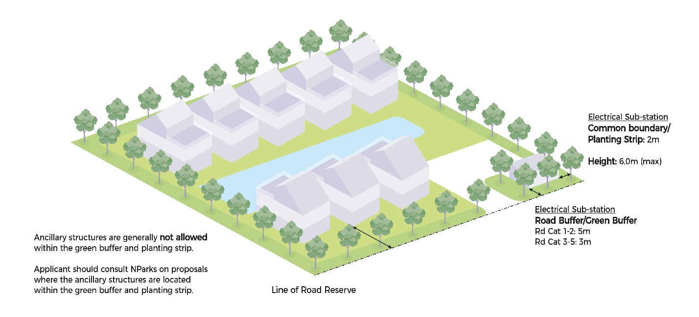

# Business 2

### **Advisory Notes**

The guidelines set out in this handbook for the various development
control parameters will generally be applied by URA in the consideration
of a development application. However, if the circumstances of a case or
the planning considerations relevant to a case so warrant, URA may in
its discretion decide to depart from these general guidelines. Persons
intending to carry out a development are advised to take this into
consideration in the conduct of their affairs and check with URA through
enquiries or development applications to confirm if their proposals can
be allowed.

The guidelines, principles and illustrations found in the handbook
series are not exhaustive in covering all possible site conditions and
building designs. In evaluating the development applications, URA
reserves the right to evaluate and impose conditions not covered in the
handbook in respond to the specific design of the development proposal
depending on merits.

**Guidelines at a Glance: Business 2 (Industrial)**

The table below is intended to provide an overview of the key guidelines
applicable for the development type. The full details of the guidelines
are stated in the relevant tabs of this handbook.

+----------------------+----------------------+----------------------+
| **Parameter**        | **Guideline**        |                      |
+----------------------+----------------------+----------------------+
| Gross Plot Ratio     | Varies from 0.6 to   |                      |
|                      | 4.0 as stipulated in |                      |
|                      | the prevailing       |                      |
|                      | Master Plan          |                      |
+----------------------+----------------------+----------------------+
| Bonus GFA            | Applicable Bonus     |                      |
|                      | Schemes:             |                      |
|                      |                      |                      |
|                      | -   Built            |                      |
|                      |     Environment      |                      |
|                      |     Transformation   |                      |
|                      |     Scheme           |                      |
|                      |                      |                      |
|                      | -   ORAs within      |                      |
|                      |     Privately-Owned  |                      |
|                      |     Public Spaces    |                      |
+----------------------+----------------------+----------------------+
| Road Buffer          | Category 1 --        | 15m (5m green        |
|                      | Expressway           | buffer)              |
+----------------------+----------------------+----------------------+
|                      | Category 2 -- Major  | 7.5m (3m green       |
|                      | Arterial A           | buffer)              |
+----------------------+----------------------+----------------------+
|                      | Category 3 -- Major  | 5m (3m green buffer) |
|                      | Arterial B           |                      |
+----------------------+----------------------+----------------------+
|                      | Category 4 & 5 --    | 5m (3m green buffer) |
|                      | Other Major Roads,   |                      |
|                      | Minor Roads & Slip   |                      |
|                      | Roads                |                      |
+----------------------+----------------------+----------------------+
| Building Setback     | Minimum 4.5m (no     |                      |
| from Boundary        | planting strip       |                      |
|                      | requirement) along   |                      |
|                      | boundaries with      |                      |
|                      | non-industrial       |                      |
|                      | development          |                      |
+----------------------+----------------------+----------------------+
|                      | No setback           |                      |
|                      | requirement along    |                      |
|                      | common boundary with |                      |
|                      | industrial           |                      |
|                      | development          |                      |
+----------------------+----------------------+----------------------+
| Building Height      | No storey-height     |                      |
|                      | control except sites |                      |
|                      | which:               |                      |
|                      |                      |                      |
|                      | a.  **have technical |                      |
|                      |     height           |                      |
|                      |     controls**       |                      |
|                      |                      |                      |
|                      | b.  **have           |                      |
|                      |     conservation or  |                      |
|                      |     urban design     |                      |
|                      |     requirements**   |                      |
|                      |                      |                      |
|                      | c.  **have security  |                      |
|                      |     considerations** |                      |
+----------------------+----------------------+----------------------+
| Floor-to-Floor       | Minimum 4.0m         |                      |
| Height               |                      |                      |
+----------------------+----------------------+----------------------+
| Basements            | Basements with       |                      |
|                      | protrusions of up to |                      |
|                      | 1.0m:                |                      |
|                      |                      |                      |
|                      | -   shall comply     |                      |
|                      |     with the road    |                      |
|                      |     buffer and       |                      |
|                      |     building         |                      |
|                      |     setback.         |                      |
|                      |                      |                      |
|                      | -   any basement     |                      |
|                      |     protrusions of   |                      |
|                      |     more than 1.0m   |                      |
|                      |     above the ground |                      |
|                      |     level are        |                      |
|                      |     treated as a     |                      |
|                      |     storey.          |                      |
|                      |                      |                      |
|                      | Sunken basements may |                      |
|                      | be built up to the   |                      |
|                      | road reserve line    |                      |
|                      | and lot boundary     |                      |
|                      | provided:            |                      |
|                      |                      |                      |
|                      | -   the portion      |                      |
|                      |     underneath the   |                      |
|                      |     green buffer is  |                      |
|                      |     submerged at     |                      |
|                      |     least 2m or more |                      |
|                      |     below the ground |                      |
|                      |     level.           |                      |
|                      |                      |                      |
|                      | -   there are no     |                      |
|                      |     technical        |                      |
|                      |     requirements.    |                      |
|                      |                      |                      |
|                      | -   it does not      |                      |
|                      |     cause any        |                      |
|                      |     adverse impact   |                      |
|                      |     to the adjoining |                      |
|                      |     property.        |                      |
+----------------------+----------------------+----------------------+
| Special and Detailed | [Special and         | Developments within  |
| Control Plans        | Detailed Control     | special control      |
|                      | Plans]{.ul}          | areas may be subject |
|                      |                      | to screening         |
|                      | [Special Control     | requirements (to be  |
|                      | Area                 | confirmed upon       |
|                      | 1](https             | submission of a      |
|                      | ://www.ura.gov.sg/-/ | proposed             |
|                      | media/Corporate/Guid | development)         |
|                      | elines/Development-c |                      |
|                      | ontrol/Others/SCA_1) |                      |
|                      |                      |                      |
|                      | [Special Control     |                      |
|                      | Area                 |                      |
|                      | 2](https             |                      |
|                      | ://www.ura.gov.sg/-/ |                      |
|                      | media/Corporate/Guid |                      |
|                      | elines/Development-c |                      |
|                      | ontrol/Others/SCA_2) |                      |
+----------------------+----------------------+----------------------+
| Developments         | Refer to section on  |                      |
| involving            | *Developments        |                      |
| Waterbodies          | involving            |                      |
|                      | Waterbodies*         |                      |
+----------------------+----------------------+----------------------+
| Ancillary Structures | Refer to section on  |                      |
|                      | *Ancillary           |                      |
|                      | Structures* for      |                      |
|                      | detailed setback     |                      |
|                      | requirements based   |                      |
|                      | on the type of       |                      |
|                      | ancillary structure  |                      |
+----------------------+----------------------+----------------------+
| Parking              | -   Parking          |                      |
|                      |     standards and    |                      |
|                      |     requirements are |                      |
|                      |     prescribed by    |                      |
|                      |     the Land         |                      |
|                      |     Transport        |                      |
|                      |     Authority (LTA). |                      |
|                      |                      |                      |
|                      | -   Strata units     |                      |
|                      |     within           |                      |
|                      |     multi-user B2    |                      |
|                      |     developments are |                      |
|                      |     allowed to have  |                      |
|                      |     their own        |                      |
|                      |     private car      |                      |
|                      |     parking lots     |                      |
|                      |     subject to       |                      |
|                      |     conditions       |                      |
|                      |     listed under the |                      |
|                      |     section on       |                      |
|                      |     Parking.         |                      |
|                      |                      |                      |
|                      | -   The conversion   |                      |
|                      |     of approved      |                      |
|                      |     private car      |                      |
|                      |     parking areas    |                      |
|                      |     previously not   |                      |
|                      |     computed as GFA  |                      |
|                      |     is allowed       |                      |
|                      |     subject to       |                      |
|                      |     conditions       |                      |
|                      |     listed under the |                      |
|                      |     section on       |                      |
|                      |     Parking.         |                      |
+----------------------+----------------------+----------------------+
| Unit Size            | Minimum 150sqm per   |                      |
|                      | unit                 |                      |
+----------------------+----------------------+----------------------+
| Use Quantum          | Minimum 60% of       |                      |
|                      | overall GFA for      |                      |
|                      | predominant uses     |                      |
|                      |                      |                      |
|                      | Maximum 40% of       |                      |
|                      | overall GFA for      |                      |
|                      | ancillary uses       |                      |
+----------------------+----------------------+----------------------+
|                      | [Additional          |                      |
|                      | requirement for      |                      |
|                      | multi-user           |                      |
|                      | developments:]{.ul}  |                      |
|                      |                      |                      |
|                      | Minimum 60% of unit  |                      |
|                      | GFA for predominant  |                      |
|                      | uses;                |                      |
|                      |                      |                      |
|                      | Maximum 40% of unit  |                      |
|                      | GFA ancillary uses   |                      |
|                      |                      |                      |
|                      | (ie within each      |                      |
|                      | strata-subdivided    |                      |
|                      | unit)                |                      |
+----------------------+----------------------+----------------------+
| Allowable Uses       | Refer to section on  |                      |
|                      | *Allowable Uses*     |                      |
+----------------------+----------------------+----------------------+
| Goods Lifts and      | **Maximum            | **Requirement**      |
| Loading Bays         | Permissible GFA**    |                      |
+----------------------+----------------------+----------------------+
|                      | Less than 10,000sqm  | Minimum 1 goods lift |
|                      |                      | and 1 loading bay    |
+----------------------+----------------------+----------------------+
|                      | 10,000 -- 30,000sqm  | Minimum 2 goods      |
|                      |                      | lifts and 2 loading  |
|                      |                      | bays                 |
+----------------------+----------------------+----------------------+
|                      | More than 30,000sqm  | Minimum 3 goods      |
|                      |                      | lifts and 3 loading  |
|                      |                      | bays                 |
+----------------------+----------------------+----------------------+
| Diesel and Petrol    | Diesel and petrol    |                      |
| Pump Points          | pump points are      |                      |
|                      | allowable subject to |                      |
|                      | conditions listed    |                      |
|                      | under the *Diesel    |                      |
|                      | and Petrol Pump      |                      |
|                      | Points* section.     |                      |
+----------------------+----------------------+----------------------+
| RC Flat Roofs        | RC flat roofs shall  |                      |
|                      | remain inaccessible  |                      |
|                      | except for           |                      |
|                      | maintenance purposes |                      |
|                      | only. Activating the |                      |
|                      | rooftop for uses     |                      |
|                      | such as roof         |                      |
|                      | terraces may be      |                      |
|                      | allowed depending on |                      |
|                      | the merits of the    |                      |
|                      | proposal. No         |                      |
|                      | structures shall be  |                      |
|                      | allowed unless       |                      |
|                      | otherwise approved   |                      |
|                      | by URA. Where        |                      |
|                      | allowed, structures  |                      |
|                      | (including any       |                      |
|                      | safety barriers)     |                      |
|                      | shall comply with    |                      |
|                      | height controls and  |                      |
|                      | the following        |                      |
|                      | guidelines.          |                      |
+----------------------+----------------------+----------------------+
|                      | **Communal           |                      |
|                      | Pavilions**          |                      |
|                      |                      |                      |
|                      | Communal pavilions   |                      |
|                      | shall be accessed    |                      |
|                      | from common areas    |                      |
|                      | only.                |                      |
|                      |                      |                      |
|                      | They shall be        |                      |
|                      | computed as GFA      |                      |
|                      | unless they meet the |                      |
|                      | following criteria:  |                      |
|                      |                      |                      |
|                      | -   Maximum 50sqm or |                      |
|                      |     50% of roof      |                      |
|                      |     coverage,        |                      |
|                      |     whichever is     |                      |
|                      |     lower;           |                      |
|                      |                      |                      |
|                      | -   For developments |                      |
|                      |     with storey      |                      |
|                      |     height control,  |                      |
|                      |     pavilions shall  |                      |
|                      |     be open-sided;   |                      |
|                      |                      |                      |
|                      | -   For developments |                      |
|                      |     without storey   |                      |
|                      |     height control,  |                      |
|                      |     maximum 50%      |                      |
|                      |     perimeter        |                      |
|                      |     enclosure of the |                      |
|                      |     pavilions may be |                      |
|                      |     allowed;         |                      |
|                      |                      |                      |
|                      | -   Communal         |                      |
|                      |     pavilions shall  |                      |
|                      |     be integrated    |                      |
|                      |     with lush        |                      |
|                      |     greenery. The    |                      |
|                      |     greenery on the  |                      |
|                      |     rooftop shall be |                      |
|                      |     both enjoyable   |                      |
|                      |     by the building  |                      |
|                      |     users and        |                      |
|                      |     visible from the |                      |
|                      |     surroundings;    |                      |
|                      |                      |                      |
|                      | -   Plants shall be  |                      |
|                      |     incorporated on  |                      |
|                      |     permanent and    |                      |
|                      |     preferably       |                      |
|                      |     sunken planting, |                      |
|                      |     planned with     |                      |
|                      |     sufficient soil  |                      |
|                      |     depth based on   |                      |
|                      |     the types of     |                      |
|                      |     plants proposed. |                      |
|                      |     Some space shall |                      |
|                      |     be set aside for |                      |
|                      |     the provision of |                      |
|                      |     communal         |                      |
|                      |     facilities and   |                      |
|                      |     furniture to     |                      |
|                      |     enhance the      |                      |
|                      |     rooftop.         |                      |
+----------------------+----------------------+----------------------+
|                      | **Solar Panels**     |                      |
|                      |                      |                      |
|                      | Planning permission  |                      |
|                      | is not required      |                      |
|                      | except in the        |                      |
|                      | following locations  |                      |
|                      | and contexts:        |                      |
|                      |                      |                      |
|                      | -   Site is subject  |                      |
|                      |     to urban design  |                      |
|                      |     guidelines or    |                      |
|                      |     located within   |                      |
|                      |     Conservation     |                      |
|                      |     Areas;           |                      |
|                      |                      |                      |
|                      | -   Spaces under     |                      |
|                      |     solar panels are |                      |
|                      |     enclosed or put  |                      |
|                      |     to commercial    |                      |
|                      |     use.             |                      |
+----------------------+----------------------+----------------------+
| Walking and Cycling  | Walking and Cycling  |                      |
| Plan                 | Plan submission may  |                      |
|                      | be required for B2   |                      |
|                      | industrial           |                      |
|                      | developments which   |                      |
|                      | meet the requisite   |                      |
|                      | criteria. Refer to   |                      |
|                      | section on *Walking  |                      |
|                      | and Cycling Plan*.   |                      |
+----------------------+----------------------+----------------------+
| Earthworks           | -   Earthworks are   |                      |
|                      |     not allowed      |                      |
|                      |     within the       |                      |
|                      |     building setback |                      |
|                      |     area.            |                      |
|                      |                      |                      |
|                      | -   Earthworks       |                      |
|                      |     within the       |                      |
|                      |     build-able area  |                      |
|                      |     are subject to   |                      |
|                      |     evaluation. If   |                      |
|                      |     earthfill of     |                      |
|                      |     more than 1m is  |                      |
|                      |     allowed, the     |                      |
|                      |     overall          |                      |
|                      |     aggregate        |                      |
|                      |     building height  |                      |
|                      |     measured from    |                      |
|                      |     the allowable    |                      |
|                      |     platform level   |                      |
|                      |     shall comply     |                      |
|                      |     with the maximum |                      |
|                      |     allowable        |                      |
|                      |     building height  |                      |
|                      |     control.         |                      |
|                      |                      |                      |
|                      | -   Earthfill        |                      |
|                      |     involving the    |                      |
|                      |     entire           |                      |
|                      |     development site |                      |
|                      |     may only be      |                      |
|                      |     considered if    |                      |
|                      |     the proposed     |                      |
|                      |     earthworks are   |                      |
|                      |     required to meet |                      |
|                      |     the Minimum      |                      |
|                      |     Platform Level   |                      |
|                      |     (MPL) stipulated |                      |
|                      |     by PUB.          |                      |
+----------------------+----------------------+----------------------+
| Retaining and        | Maximum allowable    |                      |
| Boundary Walls       | height for boundary  |                      |
|                      | walls is 1.8m.       |                      |
|                      |                      |                      |
|                      | Erection of          |                      |
|                      | retaining walls are  |                      |
|                      | subject to           |                      |
|                      | evaluation. If       |                      |
|                      | retaining walls are  |                      |
|                      | allowed:             |                      |
|                      |                      |                      |
|                      | -   the height shall |                      |
|                      |     be less than     |                      |
|                      |     1.5m;            |                      |
|                      |                      |                      |
|                      | -   retaining walls  |                      |
|                      |     higher than 1.5m |                      |
|                      |     may be           |                      |
|                      |     considered       |                      |
|                      |     depending on     |                      |
|                      |     site constraints |                      |
|                      |     and the need for |                      |
|                      |     extensive        |                      |
|                      |     excavation;      |                      |
|                      |                      |                      |
|                      | -   the total        |                      |
|                      |     visible height   |                      |
|                      |     of the solid     |                      |
|                      |     bo               |                      |
|                      | undary-cum-retaining |                      |
|                      |     wall shall not   |                      |
|                      |     exceed 2.8m, of  |                      |
|                      |     which the solid  |                      |
|                      |     boundary wall    |                      |
|                      |     shall not exceed |                      |
|                      |     1.8m.            |                      |
+----------------------+----------------------+----------------------+

### 

### **Introduction**

Industrial developments comprise factories, warehouses,
telecommunication and utility buildings. These developments may be
allowed on land zoned Business 1 (B1) or Business 2 (B2).

Depending on the nature of their activities, clean and light industries
are allowed in Business 1 (B1) zone. General and special industries are
to be located in Business 2 (B2) zone.

The National Environment Agency (NEA) would require a 100m nuisance
buffer from a B2 zone to the surrounding area. The allowable types of
industry or use within industrial developments in B2 zone, based on
NEA's nuisance buffer requirements, are
listed [here](https://e-services.nea.gov.sg/ias/PublicApplicant/Homepage.aspx).

### 

### **Gross Plot Ratio**

The Gross Plot Ratio (GPR) of a B2 development is guided by the GPR
specified in the Master Plan (MP). This upper bound GPR may not always
be achievable because of site limitations like plot size, shape of the
plot, site topography or ground conditions, building setbacks, building
height or technical requirements of other authorities that may affect
the site.

The area of the land required to be set aside for Drainage
Reserve^1^ (DR) and/or Road Reserve^2^ (RR) to be vested in the State
may be included in the site area to compute the gross floor area (GFA)
for a GPR -- see figure below.

^1^ **Drainage Reserve**: An area safeguarded for purposes of building
or widening a public drain.

^2^ **Road Reserve**: The plot of land to be vested in the State as
required under the Street Works Act. It is demarcated by the line of
Road Reserve in the Road Line Plan and the site boundary.


*GPR for sites where vesting is required*

B2-White

B2 sites located next to MRT stations may be zoned B2-W. The white
component is to provide flexibility for industrial companies in such
locations to accommodate synergistic White uses.

For such B2-W sites, a minimum GPR shall be achieved for the permissible
B2 uses first. This minimum GPR for B2 uses is indicated in the square
brackets on the Master Plan.

For example, in the map below, the site next to Joo Koon MRT Station is
zoned "**2.5 \[B-2.0\] W**". A B2-W site would have an overall allowable
GPR of 2.5. A minimum GPR of 2.0 must be achieved and used for
industrial purposes before the remaining GPR 0.5 may be unlocked for
White uses.

Refer to the section on [Allowable
Uses](https://intranet.ura.gov.sg/Corporate/Guidelines/Development-Control/Non-Residential/B2/~/link.aspx?_id=8800A2428CEB4E0DA4BEF750EA557AAD&_z=z) for
the list of allowable uses within the White component.


*B2-White site located next to Joo Koon MRT Station*

**Bonus GFA Incentive Schemes**

The Bonus GFA schemes applicable to Business 2 are:

**Built Environment Transformation Scheme**

The Built Environment (BE) Transformation GFA scheme aims to encourage
adoption of higher tier Construction Industry Transformation Map (ITM)
outcomes in areas of digitisation, productivity and sustainability. The
incentive scheme is jointly administered by BCA and URA. Applicants may
qualify for the scheme by adopting stipulated ITM outcomes as part of
the development proposal.

**Eligibility**

The incentive is applicable for new erection or major Addition &
Alterations to private sites of at least 5000sqm GFA[^1]. Sites launched
under the Government Land Sales (GLS) programme prior to 31 March 2022
may also be eligible for the incentive scheme.

The types of developments eligible for the incentive scheme are as
follows:

  Residential[^2]    Condominium and Flats development
  ------------------ ---------------------------------------------------------------------------------------------------------------------------------------------------------------
  Non- Residential   Commercial, Industrial and Institutional developments, such as office, retail, business parks, community building, hotel, hospital or white site developments
  Mixed use          Combination of the above

**Quantum of Bonus GFA Allowed**

Private sites may be granted up to 3% bonus GFA under the scheme[^3].
The scheme is applicable for new proposals till 23 November 2026.

GLS sites are eligible up to 2% bonus GFA. The scheme is applicable for
new GLS launched prior to 31 March 2022.

The cumulative bonus GFA shall be kept within the overall budget of 10%
above the Master Plan Gross Plot Ratio (GPR), or the maximum allowable
GFA of the development. It shall not form the future development
potential of the site upon redevelopment.

The quantum of allowable bonus GFA under the BE Transformation Scheme is
based on the proposed uses, use quantum that complies with the Master
Plan zoning, and any additional requirements imposed as part of the
endorsement for the bonus GFA.

Should development proposals fall within areas with specific planning
considerations (e.g. storey height controls) or are unable to fully
accommodate the additional intensity due to on-site conditions (e.g.
areas with traffic concerns), the bonus GFA under the BE Transformation
Scheme that can be approved may be lower than the endorsed quantum,
and/or the bonus GFA may be limited to a particular use or uses.

**Submission Requirements**

Applicants are to submit an application to BCA with supporting documents
on the proposed ITM outcome concept plan and detail the proposed ITM
outcome to be adopted for the development proposal. The submission can
be made at this [link](https://form.gov.sg/#!/610112199bdc0c00123abb25).

Following BCA's grant of letter of acceptance, applicants shall submit
the development proposal with the proposed quantum and use group of the
proposed bonus BE Transformation GFA to URA, for detailed assessment.
The development application shall be submitted within 6 months from
BCA's grant of Letter of Acceptance, and shall include a copy of the
Letter of Acceptance, and the [BE Transformation GFA computation
form](https://www.ura.gov.sg/Corporate/Guidelines/Development-Control/Residential/Flats-Condominiums/-/media/F51E44661B1449A49D9E68D665E65270.ashx).
The submission process and verification of ITM outcomes is summarised at
this
[link](https://www.ura.gov.sg/Corporate/Guidelines/Development-Control/Residential/Flats-Condominiums/-/media/4BB98E194AF3472EA42EA76CFD518D14.ashx).

**Requirements on ITM Outcomes for Bonus BE Transformation GFA**

Applicants are to comply with BE ITM outcomes for the bonus scheme based
on the [building
type](https://www.ura.gov.sg/Corporate/Guidelines/Development-Control/Residential/Flats-Condominiums/-/media/6612FA46B09440BA983DA2A5BD47F8A7.ashx).
The specific requirements for the development proposal will be shared in
detail as part of the application process to BCA for the Letter of
Acceptance.

**ORA within Privately-Owned Public Spaces (POPS)**

Refer to section on POPS.

### **Building Setback from Boundary**


*Setback Requirements*

All industrial developments shall be sufficiently set back from the road
and common boundary. The setback distance is measured from the road
reserve^1^ line or boundary line to the external wall of the building,
excluding land to be vested to the State for road and/or drainage
purpose.

All industrial developments fronting a public road shall provide a road
buffer, the width of which depends on the hierarchy of the road. A green
buffer shall be set aside in the road buffer depending on the width of
the road buffer.

The buffer requirements for the Road Categories 1 to 5 are in Table 1
below. The common boundary setback requirements are in Table 2 below.

^1^ **Road Reserve**: The plot of land to be vested in the State as
required under the Street Works Act. It is demarcated by the line of
Road Reserve in the Road Line Plan and the site boundary.

**Table 1: Road Buffer, Green Buffer**

  -------------------------------------------------------------------------
  **Road Category**   **Road Buffer\
                      (inclusive of Green Buffer indicated in brackets)**
  ------------------- -----------------------------------------------------
  Category 1          15m\
                      (5m)

  Category 2          7.5m\
                      (3m)

  Category 3          5m\
                      (3m)

  Category 4 & 5      5m\
                      (3m)
  -------------------------------------------------------------------------

**Table 2: Common Boundary Setback & Planting Strip**

+----------------------------------+----------------------------------+
| **Type of Boundary**             | **Building Setback               |
|                                  | Requirement**                    |
+==================================+==================================+
| Common boundary with             | Minimum 4.5m\                    |
| non-industrial development       | (No planting strip requirement)  |
+----------------------------------+----------------------------------+
| Common boundary with industrial  | -   No setback requirement (see  |
| development                      |     > note below).               |
|                                  |                                  |
|                                  | -   No openings along common     |
|                                  |     > boundary.                  |
+----------------------------------+----------------------------------+
| Common boundary with a Place of  | No setback (see note below) is   |
| Worship                          | required at the common boundary  |
|                                  | between an industrial            |
|                                  | development and a Place of       |
|                                  | Worship (PW) development subject |
|                                  | to the following conditions:     |
|                                  |                                  |
|                                  | -   The sites are located well   |
|                                  |     > within the industrial      |
|                                  |     > estate and not next to a   |
|                                  |     > Reserve site or other      |
|                                  |     > non-industrial             |
|                                  |     > developments;              |
|                                  |                                  |
|                                  | -   No openings along common     |
|                                  |     > boundary; and              |
|                                  |                                  |
|                                  | -   No adverse impact on the     |
|                                  |     > surrounding developments.  |
+----------------------------------+----------------------------------+

***Note**: Where a building is proposed to abut the common boundary,
measures shall be put in place to facilitate down-stream building
maintenance at the common boundary.*

**Table 3: Setback for Building-Appendages**

  **Building Feature**                             **Within Road Buffer**                                **Within Setback from Common Boundaries**
  ------------------------------------------------ ----------------------------------------------------- ------------------------------------------------------------
  Roof eaves                                       Allowed, provided it is not within the green buffer   Allowed, provided it is not within the 2.0m planting strip
  Sun-shading devices & RC ledges (cantilevered)                                                         

### **Building Height**

{width="6.496062992125984in"
height="4.166521216097988in"}

*Building Height*

**Overall Building Height**

Unless otherwise stated, the overall building height^1^ of industrial
developments is subject to compliance with the technical height
controls of the relevant agencies such as Civil Aviation Authority of
Singapore (CAAS) and the Defence Science and Technology Agency (DSTA).
~~These agencies require the building height to be given in m
AMSL (metres above Mean Sea Level).~~

^1^ ~~Submissions to other agencies may require the building height
based on the Singapore Height Datum (SHD). The SHD may be a positive or
negative value and it may be supplemented with a \"+\" or \"-\" sign for
clarity.~~ Building height is based on Singapore Height Datum (SHD).

**Floor-to-Floor Height**

The minimum floor-to-floor height of industrial buildings is 4.0m.

### 

### **Basements**

A basement storey refers to a storey of a building which may be
partially or wholly below the existing ground level. In so far as storey
height control is concerned, basement storeys that protrude more than
1.0m above ground level on any side shall be counted as a storey.


*Basement Setback and Vertical Openings*

The physical limit for which the basement may be built up to is shown in
the table below.

**Basement Setback**

+----------------------+----------------------+----------------------+
| **Type of Basement** | **Setback from the   | **Setback from Other |
|                      | Road Reserve Line**  | Boundaries**         |
+======================+======================+======================+
| Basement with        | Up to the road       | Up to the building   |
| protrusion           | buffer               | setback              |
+----------------------+----------------------+----------------------+
| Sunken basement      | Up to the road       | Up to the site lot   |
|                      | reserve^1^ line,     | boundary, provided:  |
|                      | provided the portion |                      |
|                      | underneath the green | -   the portion      |
|                      | buffer is submerged  |     > underneath the |
|                      | at least 2m or more  |     > 2m tree        |
|                      | below the ground     |     > planting strip |
|                      | level                |     > is submerged   |
|                      |                      |     > at least 2m or |
|                      |                      |     > more below the |
|                      |                      |     > ground level;  |
|                      |                      |                      |
|                      |                      | -   there are no     |
|                      |                      |     > technical      |
|                      |                      |     > requirements   |
|                      |                      |     > (eg sewerage,  |
|                      |                      |     > drainage) and  |
|                      |                      |     > the basement   |
|                      |                      |     > does not cause |
|                      |                      |     > any adverse    |
|                      |                      |     > impact to the  |
|                      |                      |     > adjoining      |
|                      |                      |     > property;      |
|                      |                      |                      |
|                      |                      | -   the side of a    |
|                      |                      |     > basement wall  |
|                      |                      |     > abutting any   |
|                      |                      |     > site boundary  |
|                      |                      |     > shall not have |
|                      |                      |     > any openings   |
|                      |                      |     > into the       |
|                      |                      |     > adjoining      |
|                      |                      |     > site.          |
+----------------------+----------------------+----------------------+

^1^ **Road Reserve**: The plot of land to be vested in the State as
required under the Street Works Act. It is demarcated by the line of
Road Reserve in the Road Line Plan and the site boundary.

Basements with vertical openings on the side walls may be allowed only
if they are required for natural ventilation and to meet the building
regulations. The guidelines are as follows:

-   While the protrusion measured from the level at the site boundary
    > shall not exceed 1.0m, basements may be exposed up to 2.0 m from
    > the point where the platform level meets the basement wall (ie the
    > earth around the basement wall may be cut to slope down to achieve
    > the 2.0m basement exposure with openings).

-   The extent of the slope within the green buffer or planting strip
    > shall have a gradient of 1:2.5.

-   Vertical cutting of the earth resulting in a trench around the
    > basement is not allowed.

-   The extent of the vertical openings or the types of cover over the
    > vertical openings shall be subject to the requirements of the
    > other technical departments.

-   Horizontal openings to the basement are allowed within the setback
    > distance outside the green buffer and planting strip, subject to
    > provision of effective screening to hide the view to the basement.


*Basement Horizontal Openings*

### 

**Special and Detailed Control Plans**

Special and Detailed Control Plans (SDCP) provide detailed guidelines
for specific areas. The SDCPs may be viewed here.

**Special Control Areas**

The following areas may be subject to security requirements. URA will
confirm this upon submission of a proposed development.

{width="6.496062992125984in"
height="3.606201881014873in"}

*Special Control Area 1*

{width="6.496062992125984in"
height="3.3150820209973753in"}

*Special Control Area 2*

Qualified Persons (QPs) should consider the screening requirements in
the early stage of their planning and design to avoid abortive work
subsequently.

Where security screening is deemed necessary, it shall consist of
permanent fixtures that are difficult, if not impossible to remove. The
following screening measures may be considered:

**Visual Screening**

Residential units and common areas may be screened where necessary with
blank walls, external concrete/metal fins, or the building may be
re-orientated such that the windows^1^/openings/balconies do not have
direct view towards the protected area.

^1^ **Window**: Raised openings that are at least 0.9m above the floor
slab. They are intended to provide ventilation and lighting, and not for
access. Full height windows and windows that are lower than 0.9m that
can potentially be used as access points will need to be highlighted in
the submission plans for URA's evaluation and approval.

#### **Roof Screening**

The parapet wall at the rooftop shall be at least 3m high and access to
the rooftop from a public area shall be secured by a lockable
door/hatch. The door/hatch may be electronically linked to an alarm
system monitored by the building management, if available.**\
**

### **Developments Involving Waterbodies**

To maintain the integrity and aesthetics of the waterfront areas so that
the public can have free and unrestricted access to enjoy these spaces,
developments at major waterbodies^1^ shall observe the design and
development application submission guidelines below.

^1^ Major waterbodies: rivers, canals of at least 17.5m width,
reservoirs, and seas.

{width="6.496062992125984in"
height="2.860952537182852in"}

{width="6.496062992125984in"
height="3.079022309711286in"}

*Developments at Major Waterbodies*

**Design Guidelines**

1.  **Retaining Walls**

> Retaining walls along the waterbodies may be allowed subject to the
> following criteria:

a.  Retaining walls are less than 1.5m in height;

b.  Retaining walls are set back at least 300mm from the boundary;

c.  Retaining walls are covered with creepers.

```{=html}
<!-- -->
```
2.  **Boundary Walls/Fences**

> For non-industrial developments, proposed boundary fences shall be
> porous (eg chained-link, metal-grille, or timber fence). 
>
> For industrial developments, the following may be allowed:

a.  Solid boundary walls not exceeding 1.8m in height. The walls shall
    > be aesthetically treated.

b.  Chain-linked fences not exceeding 1.8m in height with close planting
    > of shrubs/vegetation as screenings. A planting strip of 0.5m width
    > (minimum) shall be provided within the development.

```{=html}
<!-- -->
```
3.  **Slope**

> There shall be no abrupt change in slope gradient at the boundary
> between the development and the waterbody. The slope gradient shall
> not exceed 1:2.

4.  **Conservation of Vegetation**

> Mature vegetation along the waterbodies are to be saved and conserved,
> wherever possible.

**Development Application Submission Guidelines**

In all waterbodies-related development application submissions to URA,
the following shall be provided, where applicable:

-   Site/Location Plan showing the width and alignment of Drainage
    > Reserve^2^/Waterbody/Coastal Profile;

-   Layout plans and cross-sections showing the area between the site
    > and the Drainage Reserve/Waterbody/Coastal Area including existing
    > and proposed ground levels;

-   Design details of integration with waterbody including slope,
    > retaining wall, and boundary wall/fencing (Height, Type,
    > Screening);

-   Contour lines extending to 1m beyond the side of development
    > fronting the Drainage Reserve/Waterbody/Sea;

-   [Checklist](https://intranet.ura.gov.sg/Corporate/Guidelines/Development-Control/Non-Residential/B2/-/media/1A4AADDAB0B54182A8299F543A0F3C97.ashx) for
    > Waterbodies-related proposals.

^2^ **Drainage Reserve (DR)**: An area safeguarded for purposes of
building or widening a public drain

**Application of Guidelines**

The design guidelines listed above shall apply to all developments
adjacent to or with waterbodies except developments adjacent to or with
Drainage Reserves less than 17.5m.

All proposals involving waterbodies shall comply with the development
application submission guidelines listed above.

#### **Additional Guidelines for Use of Foreshore by Developments with a Frontage to the Sea**

For land use planning and development control purposes, the
foreshore^3^ and the area within 15m on both the landward and seaward
side of the foreshore line^4^ shall be kept free of structures. Some
structures such as ramps may be permitted if they are constructed in
connection with an approved development (eg marine industries,
refineries, and pleasure-boat storage complex). These structures are
subject to planning evaluation depending on merits.

^3^ The area between the high water mark of the Spring Tide or the top
of the seawall and the low water mark of the Spring Tide.


^4^ The high water mark of the Spring Tide; the top of the existing
seawall or revertment or river wall (where appropriate) for controlling
landward development.


### **Ancillary Structures**


*Setback Requirements for Ancillary Structures*

Ancillary structures are minor structures erected to support the main
use of the site. The building setback distance and height control for
ancillary structures are shown in the table below.

Ancillary structures located within the green buffer may be assessed in
accordance with NPARKS\' guidelines --
see [here](https://www.nparks.gov.sg/partner-us/development-plan-submission/guidelines-on-greenery-provision-and-tree-conservation-for-developments).

Ancillary structures located within the physical buffer and building
setback that exceed the requirements in the table below, but are below
6m in height, shall be evaluated depending on the merits of the design
and function.

**Setback and Height Control for Ancillary Structures**

  ----------------------------------------------------------------------------------------------------------------------------------------------------------------------------------------------------------------------
  **Type of Ancillary Structures**   **Required Setback from the Road**                                                                           **Required Setbacks from the Other Boundaries**   **Height Control**
  ---------------------------------- ------------------------------------------------------------------------------------------------------------ ------------------------------------------------- --------------------
  Electrical Substation              5m from Category 1 road\                                                                                     2m                                                6m
                                     \                                                                                                                                                              
                                     3m from Category 2 -- 5 roads                                                                                                                                  

  Sunken Swimming Pool                                                                                                                                                                              Not applicable

  Raised Swimming Pool               Follow road buffer standards                                                                                                                                   

  Water Tank & Pump                                                                                                                                                                                 

  Meter Compartment                  Subject to evaluation                                                                                        1.8m if located within the green buffer           

  Bin Point                                                                                                                                                                                         

  Guardhouse                                                                                                                                      2.6m if located within the green buffer           

  Generator Set                      Subject to evaluation\                                                                                                                                         
                                     Adequate setback may have to be provided to minimise glare and noise disturbance to adjoining developments                                                     

  Tennis Court                                                                                                                                                                                      
  ----------------------------------------------------------------------------------------------------------------------------------------------------------------------------------------------------------------------

### 

### **Parking**

LTA prescribes the parking provision standards and requirements for
motor vehicles and bicycles. The requirements are usually based on the
quantum of the gross floor area or the number of units of the
development uses.

**Car and Motor-Cycle Parking**

Under LTA's Range-based Parking Provision Standards (RPPS), developments
are subject to car and motor-cycle^1^ parking provision requirements.

Unless explicitly approved as private parking lots in the approved
plans, all car and motor-cycle parking lots shall be treated as common
property.

^1^ Motor-cycle parking provision is mandatory in all non-residential
developments.

#### **Range-based Car Parking Standards (RPPS)**

The RPPS allows developments to provide any level of car and motor-cycle
parking provision within a specified range, defined by a lower bound and
an upper bound -- see figure below. The range varies according to
location zones and land uses. Details may be found in [LTA's Code of
Practice for Vehicle Parking Provision in
Developments](https://www.lta.gov.sg/content/ltaweb/en/industry-matters/development-and-building-and-construction-and-utility-works/vehicle-parking.html).


*Range-based Parking Provision Standards*

New B2 developments shall be subject to a process of waiver evaluation
by LTA, if one wishes to provide surplus car and motor-cycle parking
lots, ie parking provision above the upper bound based on the new RPPS.

#### **Private Parking Lots**

Within multi-user developments, industrial [strata units]{.ul} may be
allowed to have their own private car/lorry parking lots subject to the
following:

-   The private parking lots are surplus parking lots over and above
    > LTA's minimum parking provision;

-   The floor area of the private parking lots shall be computed as GFA
    > under the 40% ancillary quantum of each strata-unit;

-   The private parking lots are physically contiguous to the industrial
    > strata unit.

For approved private car/lorry parking areas that were previously not
computed as GFA, they may be converted to other allowable useable area
subject to the following:

-   These areas are computed as GFA and the resultant GFA does not
    > exceed the current MP GPR Control for the development site;

-   The proposed conversion is authorised by the MCST via a 90%
    > resolution;

-   The remaining number of parking lots after conversion still meet
    > LTA's minimum parking provision;

-   SLA may levy Land Betterment Charge, where applicable.

**Bicycle Parking**

To promote a car-lite society, B2 developments may be required to
provide bicycle parking facilities within the developments. Refer to
LTA's Code of Practice for Vehicle Parking Provision in
Developments [here](https://www.lta.gov.sg/content/ltaweb/en/industry-matters/development-and-building-and-construction-and-utility-works/vehicle-parking.html) for
the list of requirements.

Unless explicitly approved as private parking lots in the approved
plans, all bicycle parking lots shall be treated as common property.

Bicycle parking lots provided according to LTA's new standards are
exempted from GFA computation. Surplus provision of bicycle parking lots
may be exempted from GFA computation depending on merits and context of
the development.

### **Minimum Unit Size**

{width="6.496062992125984in"
height="4.168707349081365in"}

*Minimum Unit Size*

The minimum size of an industrial unit is 150sqm. This is deemed a
meaningful space to meet the operational needs of industrial uses.

### 

### **Use Quantum**

At least 60% of the total B2 industrial GFA (ie minimum 60%) shall be
used for industrial purpose^1^. The remaining 40% may be used for
ancillary (or supporting) uses. Tables 1 and 2 below shows the
applicable use quantum control for a single-user or multi-user
industrial development respectively.

^1^ This is also applicable to to B2-White sites.

**Table 1: Single-User Development**


*Single-User Use Quantum*

**Table 1: Single User Development**

  **Predominant**   **Ancillary**
  ----------------- ---------------
  Minimum 60%       Maximum 40%

***Note**: For single-user developments, strata subdivision is not
allowed. Sub-leasing of space is allowed.*

Single-user/owner developments (i.e. not strata subdivided) that
sub-lease space to other tenants are subject to the same quantum
controls as multi-user developments (see Table 2 below).

**Table 2: Multi-User Development**


*Multi-User Development Overall Use Quantum*


*Use Quantum within each Strata Unit*

**Table 2: Multi-User Development**

  **Predominant**                   **Ancillary**
  --------------------------------- ---------------
  **Entire Development**            
  Minimum 60%                       Maximum 40%
  **Each Strata-subdivided Unit**   
  Minimum 60%                       Maximum 40%

### 

Up to 40% of the floor area of the development is for ancillary quantum
at the development level, which comprises all common areas outside the
units (such as common corridors, staircases, lifts, toilets, M&E spaces)
and all secondary uses (see the *'Guidelines for Allowable
Uses'* section [here](https://www.ura.gov.sg/Corporate/Guidelines/Development-Control/Non-Residential/B2/Allowable-Uses)).

Within each strata-subdivided industrial unit, at least 60% of the floor
area shall be used for industrial uses. Ancillary uses (e.g. ancillary
office, meeting rooms) shall not occupy more than 40% of the unit's
floor area.

### **Allowable Uses**

Examples of allowable uses on B2 sites under the predominant and
ancillary (or supporting) use categories are shown below. Uses not
indicated below shall be evaluated on the merits of the case.

**Allowable Predominant Uses**

  ---------------------------------------------------------------
  **Minimum 60% Predominant Use **   
  ---------------------------------- ----------------------------
  Manufacturing\                     Repair & Servicing
  (General Industry)                 

  Production                         Storage of chemicals, oils

  Assembly                           Knitting Mills

  Core Media^1^                      E-Business^2^

  Industrial Training                
  ---------------------------------------------------------------

**^1^ Core Media**

Core media activities, which are production services that require
technical facilities such as studios and high-tech production
software/hardware, are allowed as part of the 60% predominant use
quantum in Business 1, Business 2 and Business Park developments.

**Types of Core Media Activities**

  **Core Media Activity**               **Description**                                                                                                                                                                                                                                       **Examples**
  ------------------------------------- ----------------------------------------------------------------------------------------------------------------------------------------------------------------------------------------------------------------------------------------------------- ----------------------------
  Pre-production\*                      Provide creative conceptualisation, scripting, editorial editing, composing and text layout                                                                                                                                                           ESPN Star Sports, SPH
  Production\^                          Studio production (including dressing rooms), location production, audio recording, dubbing, media library services, printing press                                                                                                                   ESPN Star Sports, MTV Asia
  Network Programming^\#^               Scheduling, programme management, transmission services, origination playback                                                                                                                                                                         ESPN Star Sports, AXN
  Post-production and Distribution^@^   Video editing, digital authoring, audio engineering, format conversion, standard conversion, tape duplication, image and audio restoration, film printing, optical disk media (eg mastering and replication), sorting and packaging for print media   CNBC, Walt Disney TV, SPH

#### **\* Pre-production**

Pre-production activities provide creative conceptualisation, scripting,
editorial editing, composing and text layout.

#### **\^ Production**

Production activities may include studio production (including dressing
rooms), location production, audio recording, dubbing, media library
services, printing press.

#### **^\#^ Network Programming**

Network programming activities may include scheduling, programme
management, transmission services, origination playback.

#### **^@^ Post-production and Distribution**

Post-production and distribution activities may include video editing,
digital authoring, audio engineering, format conversion, standard
conversion, tape duplication, image and audio restoration, film
printing, optical disk media (e.g. mastering and replication), sorting
and packaging for print media.

**^2^ E-Business**

The e-business activities shown in the table below are regarded as
industrial uses allowed as part of the 60% predominant use quantum. Data
Farms/Data Centres would require prior planning permission for an
assessment to be made in consultation with the relevant technical
agencies on the suitability of the premises for such uses.

**E-Business Activities regarded as Industrial Uses**

  **E-Business Activity**     **Description**                                                                                                                                                                                                                                                        **Remarks**
  --------------------------- ---------------------------------------------------------------------------------------------------------------------------------------------------------------------------------------------------------------------------------------------------------------------- -------------------------------------------------------------------------------------
  Telecommunications          Provides voice/data communication services such as data/information transmission, electronic message sending, voice calls and broadcasting services.                                                                                                                   Can be located in Business Park, Business 1 and Business 2 developments.
  Data Farm/Data Centre       Requires the use of predominantly heavy equipment such as servers to process data. Excludes data processing that can be run on desktop computers or laptops.                                                                                                           
  Internet Service Provider   Provides access to Internet and other related services such as web hosting, web site building, etc.                                                                                                                                                                    
  Software Development        Provides software design, customisation and maintenance. Includes software application providers.                                                                                                                                                                      
  Call Centre                 Centralised backend support functions that handle a large volume of telephone services primarily targeted at providing information to meet callers' needs. Typically require large spaces for their operations, which comprise specialised technology and equipment.   Can be located in Business Park and Business 1, but not in Business 2 developments.

**Allowable Ancillary Uses**

  **Maximum 40% Ancillary Use**   
  ------------------------------- --------------------------
  Ancillary Office                Meeting Room
  Sick Room                       Diesel and Pump Point
  M&E Services                    Showroom
  Industrial Canteen              Selected Commercial Uses

**White Component -- Allowable Uses**

A list of allowable uses within the White component is shown in the
table below. The actual allowable uses shall be subject to planning
evaluation.

**List of uses which are allowed within White component**

  **Allowable**
  --------------------------------------------------
  Shop
  Restaurant
  Showroom
  Association, C&CI uses
  Office (includes bank), Commercial School
  Sports and Recreation facilities, Fitness Centre

The White component within industrial developments may be
strata-subdivided. The industrial and White uses within B2 developments
may be contained in separate buildings provided that there is no land
subdivision.

### **Guidelines for Allowable Uses**

**Guidelines on Showroom**

Showroom in industrial premises are meant primarily for the display of
two categories of products as follows:

-   Products that are not typically transacted or exchanged over the
    > counter (eg bulky items such as furniture, motor vehicle).

-   Products that are predominantly delivered and installed off-site (eg
    > floor tiles)

Incidental sales of small items or "cash-and-carry" products may be
considered only if the main activity of the showroom is for display of
the two categories of products listed above.

Showroom proposals will only be considered as part of a Change of Use
application, after the building has obtained a Temporary Occupation
Permit (TOP) and when the prospective end-user or business operator for
the showroom space is known.

Showroom may be considered subject to the following:

-   Showroom shall be confined to the 1^st^ storey of the development.

-   SLA may assess such showrooms based on Group A Commercial rate for
    > the purpose of computing Land Betterment Charge.

**Guidelines on Ancillary Display Area**

An ancillary display area is meant only for the display of products
related to the predominant industrial operations in the development.

Ancillary display area may be considered subject to the following
conditions:

-   Displayed products are purely for corporate or demonstration
    > purposes that serve corporate customers of the industrial
    > companies only and not open to public;

-   These products cannot be sold on-the-premises or on site;

-   There shall be no strata-subdivision or sub-leasing of these areas;
    > and

-   Endorsement from relevant agencies (eg HDB & JTC for leased
    > premises; EDB & ESGfor private premises) may be required.

SLA may assess such ancillary display areas based on Group D Industrial
rate for the purpose of computing Land Betterment Charge.

#### **Conversion of Previously-Approved Ancillary Showroom**

If an existing industrial development has a previously approved
ancillary showroom (now re-termed Display Area), the owner or operator
of such ancillary showroom may apply for planning permission to convert
it to a showroom in accordance with the showroom definition and
guideline stated above.

Alternatively, the previously approved ancillary showroom may be
expanded to function as an enlarged ancillary display area in accordance
with the current definition for ancillary display area and guideline
stated above.

The table below shows what can or cannot be done to a previously
approved ancillary showroom.

**Guidelines for Previously Approved Ancillary Showrooms**

+----------------------------------+----------------------------------+
| **Previously Approved Ancillary  | **What Can or Cannot Be Done**   |
| Showroom\                        |                                  |
| (now re-termed Display Area)**   |                                  |
+==================================+==================================+
| Complies with Display Area       | -   Can continue to use the      |
| definition and guidelines        |     > approved ancillary         |
|                                  |     > showroom as a Display      |
|                                  |     > Area. **No further         |
|                                  |     > planning permission is     |
|                                  |     > required.**                |
|                                  |                                  |
|                                  | -   May be enlarged subject to   |
|                                  |     > change of use approval.    |
+----------------------------------+----------------------------------+
| [Does not]{.ul} comply with      | -   Can remain as a previously   |
| Display Area definition and      |     > approved ancillary         |
| guidelines                       |     > showroom but **not allowed |
|                                  |     > to enlarge further**.      |
+----------------------------------+----------------------------------+
| Complies with Showroom           | -   Can convert the approved     |
| definition and guidelines        |     > ancillary showroom to      |
|                                  |     > Showroom subject to change |
|                                  |     > of use approval.           |
|                                  |                                  |
|                                  | -   Can enlarge only if the      |
|                                  |     > approved ancillary         |
|                                  |     > showroom is located on the |
|                                  |     > 1^st^ storey of the        |
|                                  |     > development.               |
|                                  |                                  |
|                                  | ***Note**: SLA may assess the    |
|                                  | total GFA of the new proposed    |
|                                  | Showroom based on Group A        |
|                                  | Commercial rate for the purpose  |
|                                  | of computing Land Betterment     |
|                                  | Charge.*                         |
+----------------------------------+----------------------------------+
| [Does not]{.ul} comply with      | -   Can remain as a previously   |
| Showroom definition and          |     > approved ancillary         |
| guidelines                       |     > showroom but **not allowed |
|                                  |     > to enlarge further**.      |
|                                  |                                  |
|                                  | -   Cannot convert approved      |
|                                  |     > ancillary showroom to      |
|                                  |     > Showroom.                  |
+----------------------------------+----------------------------------+

**Guidelines on Industrial Canteen**

Industrial canteens within industrial developments may include food
stalls, cafeteria, food court primarily to serve workers in the
industrial estate and may include members of the public.

These may be approved on Temporary Permission for up to 5 years subject
to the following:

-   The size of the industrial canteen is capped at 700sqm or 5% of the
    > total proposed GFA of the development, whichever is lower.

-   SLA may assess such industrial canteens based on Group D Industrial
    > rate for the purpose of computing Land Betterment Charge.

**Guidelines on Selected Commercial Uses**

To provide basic amenities to workers in industrial estates located away
from commercial centres, selected commercial uses namely; clinics,
banking halls/ATMS, mini marts, fitness centre/gyms, may be considered
on Temporary Permission for up to 3 years subject to the following:

-   The industrial development is located within one of the [outlying
    > industrial
    > estates](https://intranet.ura.gov.sg/Corporate/Guidelines/Development-Control/Non-Residential/B2/~/link.aspx?_id=74CA7A290E244E4FAC136498AF2AD55D&_z=z) (PDF,
    > 208 KB).

-   The commercial uses are located on the 1^st^ storey of the
    > development.

-   The total GFA of these commercial facilities shall not exceed 200sqm
    > or 10% of the total GFA of the development, whichever is lower.

-   SLA may assess such commercial uses based on Group A Commercial rate
    > for the purpose of computing Land Betterment Charge.

**Guidelines on Temporary Workers' Dormitory**

Workers' dormitories are premises used primarily as lodging for workers
unrelated by blood, marriage, or adoption or legal guardianship.
Dormitories may comprise new extensions to existing buildings or new
building blocks within an industrial development or may be converted
from existing spaces within an industrial development.

Workers' dormitories may be considered on Temporary Permission for up to
3 years subject to the dormitory use not causing any dis-amenities. The
temporary permissions may be renewed subject to compliance with
prevailing guidelines.

***Note**: The following guidelines are for [workers' dormitories
located within industrial developments]{.ul}. Independent workers'
dormitories located separately from the industrial development may be
allowed only on land zoned Civic and Community Institution.
Click [here](https://intranet.ura.gov.sg/Corporate/Guidelines/Development-Control/Non-Residential/B2/~/link.aspx?_id=60F697A5592C49059319D66CBCF95F1F&_z=z) for
Guidelines for independent workers' dormitories.*

#### **Types of Temporary Workers' Dormitories**

-   Ancillary dormitories may house only workers employed by the owner
    > or lessee of the industrial development and workers who work
    > on-site in the subject development.

-   Secondary dormitories may house workers not employed by the owner or
    > lessee of the industrial development as well as workers who work
    > on- and off-site.

#### **Location**

-   All new proposed workers' dormitories or increase in capacity within
    > industrial developments are assessed on the merits of the case.

-   They shall not fall within NEA and SCDF's health and safety buffer
    > zones.

-   Prior clearances from NEA, PUB, SCDF, LTA, and MOM shall be obtained
    > before a proposal is submitted to URA for evaluation as new
    > workers' dormitories may not be allowed in the [~~certain~~
    > industrial
    > estates](https://intranet.ura.gov.sg/Corporate/Guidelines/Development-Control/Non-Residential/B1/-/media/74CA7A290E244E4FAC136498AF2AD55D.ashx) listed
    > below ~~(PDF, 208 KB)~~ where an existing large number of
    > dormitories is already causing a significant strain on
    > infrastructures such as roads, sewer systems etc, or where
    > strategic industries are located in the vicinity.

**List of Industrial Areas where no new Workers' Dormitories are
allowed**

+---------+--------------------------+----------------------------+
| **No.** | **Area**                 | > **Plan**                 |
+=========+==========================+============================+
| 1       | Changi South Avenue 2/3  | > [A1](https:/             |
|         |                          | /intranet.ura.gov.sg/-/med |
|         |                          | ia/User%20Defined/URA%20On |
|         |                          | line/circulars/2016/Sep/dc |
|         |                          | 16-14/dc16-14-Plan-A1-Chan |
|         |                          | gi-South-Avenue.pdf?la=en) |
+---------+--------------------------+----------------------------+
| 2       | International Road       | > [A2](https:              |
|         |                          | //intranet.ura.gov.sg/-/me |
|         |                          | dia/User%20Defined/URA%20O |
|         |                          | nline/circulars/2016/Sep/d |
|         |                          | c16-14/dc16-14-Plan-A2-Int |
|         |                          | ernational-Road.pdf?la=en) |
+---------+--------------------------+----------------------------+
| 3       | Jurong Island            | > [A3](h                   |
|         |                          | ttps://intranet.ura.gov.sg |
|         |                          | /-/media/User%20Defined/UR |
|         |                          | A%20Online/circulars/2016/ |
|         |                          | Sep/dc16-14/dc16-14-Plan-A |
|         |                          | 3-Jurong-Island.pdf?la=en) |
+---------+--------------------------+----------------------------+
| 4       | Kaki Bukit               | > [A4                      |
|         |                          | ](https://intranet.ura.gov |
|         |                          | .sg/-/media/User%20Defined |
|         |                          | /URA%20Online/circulars/20 |
|         |                          | 16/Sep/dc16-14/dc16-14-Pla |
|         |                          | n-A4-Kaki-Bukit.pdf?la=en) |
+---------+--------------------------+----------------------------+
| 5       | Loyang                   | >                          |
|         |                          |  [A5](https://intranet.ura |
|         |                          | .gov.sg/-/media/User%20Def |
|         |                          | ined/URA%20Online/circular |
|         |                          | s/2016/Sep/dc16-14/dc16-14 |
|         |                          | -Plan-A5-Loyang.pdf?la=en) |
+---------+--------------------------+----------------------------+
| 6       | Pioneer                  | >                          |
|         |                          | [A6](https://intranet.ura. |
|         |                          | gov.sg/-/media/User%20Defi |
|         |                          | ned/URA%20Online/circulars |
|         |                          | /2016/Sep/dc16-14/dc16-14- |
|         |                          | Plan-A6-Pioneer.pdf?la=en) |
+---------+--------------------------+----------------------------+
| 7       | Senoko                   | >                          |
|         |                          |  [A7](https://intranet.ura |
|         |                          | .gov.sg/-/media/User%20Def |
|         |                          | ined/URA%20Online/circular |
|         |                          | s/2016/Sep/dc16-14/dc16-14 |
|         |                          | -Plan-A7-Senoko.pdf?la=en) |
+---------+--------------------------+----------------------------+
| 8       | Serangoon North Avenue 5 | > [A8](https://intr        |
|         |                          | anet.ura.gov.sg/-/media/Us |
|         |                          | er%20Defined/URA%20Online/ |
|         |                          | circulars/2016/Sep/dc16-14 |
|         |                          | /dc16-14-Plan-A8-Serangoon |
|         |                          | -North-Avenue-5.pdf?la=en) |
+---------+--------------------------+----------------------------+
| 9       | Shaw Road / Tai Seng     | > [A9](https:              |
|         |                          | //intranet.ura.gov.sg/-/me |
|         |                          | dia/User%20Defined/URA%20O |
|         |                          | nline/circulars/2016/Sep/d |
|         |                          | c16-14/dc16-14-Plan-A9-Sha |
|         |                          | w-Road_Tai-Seng.pdf?la=en) |
+---------+--------------------------+----------------------------+
| 10      | Sungei Kadut             | > [A10](h                  |
|         |                          | ttps://intranet.ura.gov.sg |
|         |                          | /-/media/User%20Defined/UR |
|         |                          | A%20Online/circulars/2016/ |
|         |                          | Sep/dc16-14/dc16-14-Plan-A |
|         |                          | 10-Sungei-Kadut.pdf?la=en) |
+---------+--------------------------+----------------------------+
| 11      | Tagore                   | > [                        |
|         |                          | A11](https://intranet.ura. |
|         |                          | gov.sg/-/media/User%20Defi |
|         |                          | ned/URA%20Online/circulars |
|         |                          | /2016/Sep/dc16-14/dc16-14- |
|         |                          | Plan-A11-Tagore.pdf?la=en) |
+---------+--------------------------+----------------------------+
| 12      | Tanglin Halt             | > [A                       |
|         |                          | 12](https://intranet.ura.g |
|         |                          | ov.sg/-/media/User%20Defin |
|         |                          | ed/URA%20Online/circulars/ |
|         |                          | 2016/Sep/dc16-14/dc16-14-P |
|         |                          | lan-A12-Tanglin.pdf?la=en) |
+---------+--------------------------+----------------------------+
| 13      | Toh Guan Road            | > [A13](ht                 |
|         |                          | tps://intranet.ura.gov.sg/ |
|         |                          | -/media/User%20Defined/URA |
|         |                          | %20Online/circulars/2016/S |
|         |                          | ep/dc16-14/dc16-14-Plan-A1 |
|         |                          | 3-Toh-Guan-Road.pdf?la=en) |
+---------+--------------------------+----------------------------+
| 14      | Tuas                     | >                          |
|         |                          |  [A14](https://intranet.ur |
|         |                          | a.gov.sg/-/media/User%20De |
|         |                          | fined/URA%20Online/circula |
|         |                          | rs/2016/Sep/dc16-14/dc16-1 |
|         |                          | 4-Plan-A14-Tuas.pdf?la=en) |
+---------+--------------------------+----------------------------+
| 15      | Ubi                      | > [A15](https://intranet.u |
|         |                          | ra.gov.sg/-/media/User%20D |
|         |                          | efined/URA%20Online/circul |
|         |                          | ars/2016/Sep/dc16-14/dc16- |
|         |                          | 14-Plan-A15-Ubi.pdf?la=en) |
+---------+--------------------------+----------------------------+

-   Workers' dormitories are not allowed within the Central Area and on
    > land zoned Business Park/Business Park-White.

-   For multi-user industrial developments, new workers' dormitories
    > shall be located within a separate building within the site.

#### **Building Setback**

-   Workers' dormitories converted from existing spaces within the
    > industrial development shall comply with existing industrial
    > building setback requirements.

-   New dormitory extensions or blocks shall comply with prevailing road
    > buffer requirements and provide a 3m (minimum) setback along
    > common boundaries.

#### **Use Quantum**

The use quantum of the workers' dormitories and other ancillary
amenities shall not exceed 40% of the overall GFA of the development.

#### **Floor-to-Floor Height**

A maximum 3.6m floor-to-floor height control shall apply to new
dormitory extensions or blocks on site. There are no height controls for
workers' dormitories converted from existing spaces within the
industrial development.

#### **Maximum Number of Workers**

The maximum number of workers allowed in a dormitory shall be determined
either by the requirements of technical agencies such as LTA, PUB, SCDF,
NEA, MOM, and SPF or computed based on the living space standard of
minimum 4.5sqm per worker, whichever is lower.

#### **Amenity Provision Guidelines**

To safeguard basic living standards for workers, adequate facilities and
amenities shall be provided as part of the workers' dormitory
development based on the requirements stated in the table below.

*Applications for workers' dormitory use are to comply with all the
requirements (e.g. liveable space per occupant, occupancy per bedroom
unit, etc) as stated in [press
release](https://www.mom.gov.sg/newsroom/press-releases/2020/0601-joint-mnd-mom-media-release-on-new-dormitories-with-improved-standards-for-migrant-workers)
issued by MOM and MND dated 1 Jun 2020. Details of the requirements are
in Annex A of the [declaration
form](https://www.mom.gov.sg/-/media/mom/documents/foreign-manpower/housing/declaration-for-new-fcd.docx)
to be submitted to MOM. You may refer to MOM's website
[here](https://www.mom.gov.sg/passes-and-permits/work-permit-for-foreign-worker/housing/various-types-of-housing)
for more information regarding various housing options for foreign
workers.*

**Amenity Provision**

+----------------------------+----------------------------------------+
| **Living Space Standards** | A minimum 4.5sqm GFA of living space   |
|                            | per worker shall be provided. This is  |
|                            | to ensure that sufficient basic living |
|                            | facilities such as living quarters,    |
|                            | kitchen, dining, and toilet areas are  |
|                            | provided. Recreational spaces and      |
|                            | staircase areas do not qualify as      |
|                            | living space areas for computation     |
|                            | purposes                               |
+============================+========================================+
| **Basic Facilities**       | Basic amenities such as living         |
|                            | quarters, common toilets, and dining   |
|                            | areas shall be provided. The design,   |
|                            | construction and provision of such     |
|                            | facilities shall meet the requirements |
|                            | of the relevant authorities such as    |
|                            | NEA, PUB, SCDF, and MOM. \             |
|                            | \                                      |
|                            | Other facilities like laundry,         |
|                            | washing, drying areas, sick bays are   |
|                            | strongly encouraged to be provided     |
|                            | within the development.                |
+----------------------------+----------------------------------------+
| **Recreational Amenities** | Recreational amenities shall be        |
|                            | provided within the development as     |
|                            | well. The minimum amount of GFA for    |
|                            | the recreational amenities is          |
|                            | dependent on the number of workers     |
|                            | within the dormitory. Refer to the     |
|                            | table below for the requirements: \    |
|                            | \                                      |
|                            | **Table 1: Guidelines for Recreational |
|                            | Amenities**                            |
|                            |                                        |
|                            |   ---                                  |
|                            | -------------------------------------- |
|                            | -------------------------------------- |
|                            | -------------------------------------- |
|                            | -------------------------------------- |
|                            | -------------------------------------- |
|                            |   **No. of Workers housed in a d       |
|                            | ormitory**   **Minimum GFA dedicated f |
|                            | or Indoor Recreational Amenities**     |
|                            |          **Minimum Land Area dedicated |
|                            |  for Outdoor Recreational Facilities** |
|                            |   ---                                  |
|                            | -------------------------------------- |
|                            | - ------------------------------------ |
|                            | ----------------------------------- -- |
|                            | -------------------------------------- |
|                            | -------------------------------------- |
|                            |   50 to 300                            |
|                            |                                 50sqm  |
|                            |                                        |
|                            |                             Encouraged |
|                            |                                        |
|                            |   301 to 500                           |
|                            |                                 75sqm  |
|                            |                                        |
|                            |                             Encouraged |
|                            |                                        |
|                            |   501 to 1000                          |
|                            |                                 100sqm |
|                            |                                        |
|                            |                             Encouraged |
|                            |                                        |
|                            |   1001 to 5000                         |
|                            |                        0.10sqm per wor |
|                            | ker\                                   |
|                            |                    0.30sqm per worker\ |
|                            |                                        |
|                            |                                        |
|                            |    \                                   |
|                            |                                      \ |
|                            |                                        |
|                            |                   (minimum of one 100s |
|                            | qm multi-purpose room for the first 10 |
|                            | 00 workers)   (minimum of one 240sqm h |
|                            | ard court for the first 1000 workers)\ |
|                            |                                        |
|                            |                                        |
|                            |                                        |
|                            |                                      \ |
|                            |                                        |
|                            |                                        |
|                            |                                        |
|                            |                                        |
|                            | Only recreational spaces shall be coun |
|                            | ted towards this provision requirement |
|                            |   ---                                  |
|                            | -------------------------------------- |
|                            | -------------------------------------- |
|                            | -------------------------------------- |
|                            | -------------------------------------- |
|                            | -------------------------------------- |
|                            |                                        |
|                            | ***Note**: Where the site is subject   |
|                            | to higher provision standards          |
|                            | stipulated under the site's tender     |
|                            | conditions, the higher standards shall |
|                            | apply. \                               |
|                            | *                                      |
|                            |                                        |
|                            | -   Examples of indoor recreational    |
|                            |     > amenities are multi-purpose      |
|                            |     > rooms, gymnasium, reading rooms, |
|                            |     > TV rooms, and basketball courts. |
|                            |     > The reasonable sizes of a TV     |
|                            |     > room and a gymnasium are 24 and  |
|                            |     > 40sqm respectively.              |
|                            |                                        |
|                            | -   Other amenities like outdoor games |
|                            |     > courts, recreation and           |
|                            |     > socializing areas are strongly   |
|                            |     > encouraged to be provided within |
|                            |     > the development.                 |
|                            |                                        |
|                            | -   The GFA from recreational          |
|                            |     > amenities shall form part of the |
|                            |     > 40% (maximum) ancillary quantum  |
|                            |     > control for industrial           |
|                            |     > developments.                    |
|                            |                                        |
|                            | -   SLA may assess such recreational   |
|                            |     > amenities based on Group D       |
|                            |     > Industrial rate for the purpose  |
|                            |     > of computing Land Betterment     |
|                            |     > Charge.                          |
+----------------------------+----------------------------------------+
| **Commercial Amenities**   | Commercial amenities such as           |
|                            | mini-marts, barber shops, bicycle      |
|                            | repair shops, telecommunications,      |
|                            | internet shops, remittance shop,       |
|                            | postal service shop and ATMs may be    |
|                            | allowed within the industrial          |
|                            | development to serve workers staying   |
|                            | in the dormitories. Refer to the table |
|                            | below for the allowable commercial GFA |
|                            | for workers' dormitories. \            |
|                            | \                                      |
|                            | **Table 2: Guidelines for Commercial   |
|                            | Amenities**                            |
|                            |                                        |
|                            |   **Number of Workers**                |
|                            |   **Amount of Commercial GFA Allowed** |
|                            |   ----------------------- ----------   |
|                            | -------------------------------------- |
|                            |   Up to 100                            |
|                            |              No commercial GFA allowed |
|                            |   101 - 50                             |
|                            | 0               Maximum 20sqm in total |
|                            |   501 - 5000              Minimum      |
|                            | 0.05sqm and maximum 0.10sqm per worker |
|                            |   More than 5000          C            |
|                            | ommercial GFA is subject to evaluation |
|                            |                                        |
|                            | The GFA from the commercial amenities  |
|                            | shall form part of 40% (maximum)       |
|                            | ancillary quantum control for          |
|                            | industrial developments. \             |
|                            | \                                      |
|                            | SLA may assess such commercial         |
|                            | amenities based on Group A Commercial  |
|                            | rate for the purposes of computing     |
|                            | Land Betterment Charge.                |
+----------------------------+----------------------------------------+

### **Goods Lifts and Loading Bays**

Industrial developments (excluding full ramp-up developments) shall have
a minimum provision of goods lifts and loading bays to support the needs
and operations of industries. The required number of good lifts and
loading bays is shown below:

**Goods Lifts and Loading Bays Requirements**

  **Maximum Permissible GFA of Development**   **Requirement**
  -------------------------------------------- ------------------------------------------
  Less than 10,000 sqm                         Minimum 1 goods lift and 1 loading bay
  10,000 -- 30,000 sqm                         Minimum 2 goods lifts and 2 loading bays
  More than 30,000 sqm                         Minimum 3 goods lifts and 3 loading bays

### **Diesel and Petrol Pump Points**

Transport-related companies or industries requiring diesel/petrol to
serve their own fleet of vehicles or industrial operations may set up
pump points within B2 industrial developments subject to the following:

-   The site on which the pump points are to be installed is zoned
    > either B2 or Transport Facilities in the Master Plan.

-   The pump points shall be ancillary to the predominant use such as
    > vehicle depots, transport bases, motor repair/service workshops
    > etc.

-   There shall be no retail of diesel and petrol to the general public
    > and other vehicles not owned by the company or its affiliated
    > companies.

-   If the development is open to and serves the general public (eg a
    > car repair workshop that serves the public), a prominent notice
    > shall be displayed at the pump point to indicate that the pump
    > points shall be reserved solely for the use by the company's own
    > fleet or the fleet of its affiliated companies.

-   The number of pump points shall be limited to 2.

-   Storage tanks shall generally be placed underground so that it shall
    > not be visually obtrusive.

-   Relevant clearances for the pump points shall be obtained from NEA
    > and FSSD.

>  

### **RC Flat Roofs**

RC flat roofs shall remain inaccessible except for maintenance purposes
only^1^. Activating the rooftop for uses such as roof terraces and
landscaped gardens may be allowed depending on the merits of the
proposal. No structures shall be allowed unless otherwise approved by
URA. Where allowed, structures (including any safety barriers) shall
comply with height controls^2^ and the following guidelines.

^1 ^RC flat roofs that are accessible via ladders for maintenance
purposes only are subject to agencies' requirements for safety barriers
to ensure the safety of maintenance personnel. Safety barriers shall not
exceed 1m in height.

^2^ Height controls applicable, include:

-   Absolute technical height constraints^@^ (e.g. Aviation paths
    restrictions, military and telecommunications installations).

-   Conservation guidelines (available at [URA
    SPACE](https://www.ura.gov.sg/maps/?service=STB))

-   Urban design height controls (available at [URA
    SPACE](https://www.ura.gov.sg/maps/?service=STB))

^@^ The absolute technical height (Based on Singapore Height Datum
\[SHD\]) shall take precedence if it is stricter than any of the other
height controls.

**Communal Pavilions**

Communal pavilions are small-scale, ancillary landscaping features that
function as sheltered, open-sided resting points. Access to communal
pavilions shall be from common areas only. The pavilions shall be
computed as GFA unless they meet the following criteria:

-   Maximum 50sqm^1^ or 50% of roof coverage, whichever is lower.

-   For developments which have reached the allowable storey height
    > control, the pavilions shall remain open-sided when viewed
    > externally. This is to ensure that the pavilions do not form an
    > additional storey.

-   For developments which have not reached the allowable storey height
    > or are not located within areas subject to storey height control,
    > maximum 50% perimeter enclosure of the rooftop pavilions may be
    > allowed.

-   Communal pavilions shall be integrated with lush greenery. The
    > greenery on the rooftop shall be both enjoyable by the building
    > users and visible from the surroundings.

-   Plants shall be incorporated on permanent and preferably sunken
    > planting, planned with sufficient soil depth based on the types of
    > plants proposed. Some space shall be set aside for the provision
    > of communal facilities and furniture to enhance the rooftop.

-   A Landscape Plan and relevant sections for ground/rooftop spaces
    > containing communal pavilions, showing the proposed landscaping
    > scheme, pavilion dimensions, planting palette, soil depth,
    > communal facilities, shall be submitted with the Development
    > Application.

^1^ The area is defined as the area of pavilion measured up to the roof
eaves line.

**Solar Panels**

The installation of solar panels on RC flat roofs may be considered if
they meet the following criteria:

a.  Solar panels are installed between 10 to 15 degrees relative to the
    > horizontal plane to optimise the performance of solar panels and
    > minimise glare to the buildings in the vicinity; and

b.  The installation of solar panels shall not result in the removal of
    > any greenery approved under the Landscaping for Urban Spaces and
    > High-Rises (LUSH) Programme.

Installation of solar panels and M&E equipment such as inverters for the
solar panel system does not require planning permission except in
locations and contexts described below.

#### **Planning Permission**

a.  **Areas subject to urban design guidelines and Conservation
    > Areas^2^ shall require planning permission due to their impact on
    > the roofscape.**

> ^2^ For Conservation Areas, installation of solar panels without any
> additional works are treated as localised works for the purpose of
> repair and maintenance and are considered Category 3 works for
> Conserved Buildings. Applications for such Category 3 works can be
> made by owners and contractors. Refer to the Conservation
> Guidelines [here](https://intranet.ura.gov.sg/Corporate/Guidelines/Development-Control/Non-Residential/B2/~/link.aspx?_id=6F28BA0B83114572ACA7DC1DFB84DBAC&_z=z) and
> information on submission
> procedure [here](https://intranet.ura.gov.sg/Corporate/Guidelines/Development-Control/Non-Residential/B2/~/link.aspx?_id=C2CDF8FDF76E401086C69F6F63B875B5&_z=z).

b.  **Elevated solar panels^3^ located in developments on the following
    > land use zones shall require planning permission:**

+----------------------------------+----------------------------------+
| -   Residential (landed housing, | -   White                        |
|     > flats and condominium      |                                  |
|     > housing developments)      | -   Residential / Institution    |
|                                  |                                  |
| -   Residential with Commercial  | -   Commercial / Institution     |
|     > at 1^st^Storey             |                                  |
|                                  | -   Educational Institution      |
| -   Mixed Commercial &           |                                  |
|     > Residential                | -   Place of Worship             |
|                                  |                                  |
| -   Commercial                   | -   Civic & Community            |
|                                  |     > Institution                |
| -   Hotel                        |                                  |
+----------------------------------+----------------------------------+

> ^3^ A solar panel is deemed to be elevated if it is raised more than
> 1m from the roof level for landed housing developments or 1.8m from
> the roof level for other developments.

c.  **Spaces under solar panels are enclosed or put to commercial use **

> Planning permission shall be required if the spaces under elevated or
> non-elevated solar panels are enclosed or put to commercial uses such
> as Outdoor Refreshment Areas. In such instances, the spaces shall be
> computed as GFA.

#### **Assessment of Storey Height**

Elevated solar panels that require planning permission may be assessed
as an additional storey for storey height control purposes unless they
comply with the guidelines below:

**Guidelines for Elevated Solar Panels**

  **Parameter**   **Guidelines**
  --------------- ---------------------------------------------------------------------
  Extent          Within the 45-degree line from the springing line of the roof level
  Height          Maximum 5m above roof level


*Extent and Height of Elevated Solar Panels*

### **Walking and Cycling Plan**

**Submission of WCP**

B2 Industrial developments with expected high pedestrian and cyclist
traffic are required to provide a WCP as part of the Development
Application. As a guide, development types listed in the table below are
subject to WCP requirement.

**Development Types that require WCP as part of TIA^1^**

+----------------------------------+----------------------------------+
| **Development Type**             | **Scale**                        |
+==================================+==================================+
| 1.  [Residential]{.ul}           | 1.1 ≥ 700 units\                 |
|                                  | 1.2 ≥ 1,000 units                |
| > 1.1 Landed properties/         |                                  |
| > Condominiums/Executive         |                                  |
| > Condominiums\                  |                                  |
| > 1.2 HDB housing^2^             |                                  |
+----------------------------------+----------------------------------+
| 2.  [Commercial]{.ul}            | 2.1 ≥ 10,000sqm GFA\             |
|                                  | 2.2 ≥ 20,000sqm GFA\             |
| > 2.1 Shopping centres/ Retail   | 2.3 ≥ 700 rooms                  |
| > uses\                          |                                  |
| > 2.2 Office development\        |                                  |
| > 2.3 Hotel                      |                                  |
+----------------------------------+----------------------------------+
| 3.  [Industrial]{.ul}            | 3.1 ≥ 60,000sqm GFA\             |
|                                  | 3.2 ≥ 50,000sqm GFA\             |
| > 3.1 Light/General Industry^3^\ | 3.3 ≥ 40,000sqm GFA              |
| > 3.2                            |                                  |
| > Warehousing/Distribution^3^\   |                                  |
| > 3.3 Science park/High tech     |                                  |
| > park/Business park             |                                  |
+----------------------------------+----------------------------------+
| 4.  [Educational]{.ul}           | 4.1 ≥ 1,500 students             |
|                                  | (single-session) or ≥ 2,000      |
| > 4.1 Primary school\            | students (double-session)\       |
| > 4.2 Secondary school\          | 4.2 ≥ 2,000 students\            |
| > 4.3 International school\      | 4.3 ≥ 2,000 students\            |
| > 4.4 Junior college\            | 4.4 ≥ 2,000 students\            |
| > 4.5 University, polytechnic,   | 4.5 TIA Required                 |
| > ITE campus                     |                                  |
+----------------------------------+----------------------------------+
| 5.  [Medical]{.ul}               | ≥ 40,000sqm GFA or ≥ 320 Beds    |
|                                  | (whichever is triggered first)   |
| > Hospital                       |                                  |
+----------------------------------+----------------------------------+
| 6.  [Recreational]{.ul}          | ≥ 30,000sqm GFA                  |
|                                  |                                  |
| > Exhibition centre & major      |                                  |
| > tourist attraction             |                                  |
+----------------------------------+----------------------------------+

Developments not listed in the table above may also be required to
submit a WCP if they fall under the following criteria:

-   Developments located in car-lite precincts^4^; or

-   Developments located within 400m of major transport nodes, ie within
    > Zone 2^5^; or

-   Retail, Office, Mixed Use developments.

Applicants of developments meeting the above criteria are strongly
encouraged to check in early with LTA for the requirement of a WCP. See
the diagram below for the submission flowchart to LTA and URA.

{width="6.496062992125984in"
height="3.9409087926509185in"}

*Submission Flowchart*

^1^ Developments that have a master developer, and consist of two or
more plots that staged at different time will also be required to submit
a WCP at the concept design stage.

^2^ LTA and URA will work with HDB on the WCP requirements.

^3^ Only industrial developments located within car-lite precincts or
400m of major transport nodes ie within Zone 2, will be required to
submit a WCP.

^4^ The five car-lite precincts are Bayshore, Jurong Lake District,
Kampong Bugis, Marina South and Woodlands North.

^5^ Zone 2 as defined in the Zonal Car Parking requirement in the Code
of Practice on Vehicle Parking Provision in Development proposals.
Please refer to [LTA\'s
website](https://www.lta.gov.sg/content/ltaweb/en/industry-matters/development-and-building-and-construction-and-utility-works/vehicle-parking.html) for
more details.

**Design of WCP**

The WCP shall consider the safety, convenience, and accessibility of
pedestrians and cyclists, and incorporate the following elements in the
design of the development:

-   Provision of convenient and direct access from nearby public
    > transport facilities and adjacent developments;

-   Provision of measures to minimise conflicts between pedestrians,
    > cyclists and motor vehicles at locations such as the vehicular
    > ingress/egress, car park entrances, and drop-off points;

-   Provision of sufficient and conveniently located bicycle parking
    > spaces and supporting amenities such as shower facilities and
    > lockers;

-   Provision of way-finding signage to public transport facilities and
    > amenities for cyclists; and

-   Provision of barrier-free access and routes for children, elderly
    > and the mobility challenged groups.

The detailed guidelines on WCP and submission requirements are
summarised in LTA's Code of Practice[ "Street Work Proposals Relating to
Development
Works"](https://www.lta.gov.sg/content/ltaweb/en/industry-matters/development-and-building-and-construction-and-utility-works/street-proposals.html).

To provide assistance on developing active mobility-related
infrastructure in a holistic manner, a Walking & Cycling Design Guide
has been produced as a supplement to the respective agencies' prevailing
COPs, engineering and development standards. The Guide can be
downloaded [here](https://www.lta.gov.sg/content/ltaweb/en/walk-cycle-ride/WCP.html).

### **Earthworks, Retaining Walls, and Boundary Walls**

**Earthworks**

Earthworks are defined as any operations or works in, on, or over land
which result in substantial modification to the existing ground terrain,
land form, or slope. These include excavation, formation of a new slope
or embankment, and cut and fill operations.

Extensive earthworks are discouraged as it may change the existing
terrain. Earthworks may also result in the building of high retaining
walls that mar the streetscape and have adverse impacts on the
surrounding areas. Earthworks on any development site, where necessary,
shall be minimised.

Planning permission is required if earthworks involve more than 2,000sqm
of land or change in the level of the land of more than 1.5m anywhere in
the development site or relative to the neighbouring land.

The guidelines for earthworks are dependent on where the earthworks are
carried out.


*Location of Allowable Earthworks*

#### **Earthworks within the building setback area**

Earthworks may not be allowed within the building setback area, except
in the following circumstances:

-   When the proposed earthworks are to match the existing platform
    > levels of the neighbouring sites;

-   When the sites are on undulating or sloping terrain, with large
    > differences in platform levels within the site, or between the
    > site and the road;

-   When the earthcut is necessary to build a fully submerged basement.
    > The area within the building setback shall be reinstated to the
    > original platform level upon the completion of the basement.

#### **Earthworks within the build-able area (ie outside the building setback area)**

Earthworks within the build-able area of more than 1m are subject to
evaluation depending on merits. If the earthfill of more than 1m is
allowed, the earthfilled area shall not be counted as an additional
storey provided the overall aggregate building height complies with the
maximum allowable building height measured from the allowable platform
level.

#### **Earthworks within the entire development site**

Earthfill involving the entire development site may only be considered
if the proposed earthworks are required to meet the technical
requirements of PUB. Such earthfill may be allowed up to the Minimum
Platform Level (MPL)^1^ stipulated by PUB.

^1^ **Minimum Platform Level (MPL)**: The minimum 1^st^ storey level to
be provided within the site. The MPL is determined by the Public
Utilities Board (PUB).

**Retaining & Boundary Walls**

{width="6.496062992125984in"
height="4.771681977252843in"}

*Allowable Height of Retaining and Boundary Walls*

The maximum allowable height for boundary walls is 1.8m.

High retaining walls shall be avoided wherever possible, particularly
for small in-fill plots. If they have to be built and can be allowed,
they shall meet the following requirements:

-   the height shall be less than 1.5m;

-   retaining walls higher than 1.5m may be considered due to site
    > constraints and the need for extensive excavation;

-   the total visible height of the solid boundary-cum-retaining wall
    > shall not exceed 2.8m, of which the solid boundary wall shall not
    > exceed 1.8m.

If the retaining walls are to meet the MPL requirement stipulated by PUB
for drainage purposes, the retaining walls along the site boundaries
(except along boundaries that abut foreshore, roads, or waterbodies with
drainage reserve equal to or more than 17.5m wide) need not be tiered as
these are transitory, pending the redevelopment of the neighbouring land
to the same MPL.

The above are general guidelines for earthworks and retaining walls. For
industrial developments, these guidelines will apply differently
depending on the type of development on the neighbouring parcels of
land.


*Earthworks for industrial scenarios where the guidelines apply (see
full illustration [here](https://intranet.ura.gov.sg/Corporate/Guidelines/Development-Control/Non-Residential/B2/-/media/52700266ABC24FD5A07E3FFA0FA3A7D0.ashx))*


*Earthworks for industrial scenarios where the guidelines do not apply
(see full illustration [here](https://intranet.ura.gov.sg/Corporate/Guidelines/Development-Control/Non-Residential/B2/-/media/2AE61DD2089741BCA6FF3F84120C3A2C.ashx))*

a.  Where the boundary is shared with an industrial development (B1/B2)
    > or a business park:

    -   The existing earthworks guidelines and controls on retaining and
        > boundary walls shall [not]{.ul} apply.

b.  Where the boundary is [not]{.ul} shared with an industrial
    > development (B1/B2) or a business park:

    -   The existing earthworks guidelines and controls on retaining and
        > boundary walls shall apply.

c.  Where the boundary abuts a public road:

    -   The existing controls on earthworks, retaining, and boundary
        > walls shall apply.

    -   Earthworks guidelines shall [not]{.ul} apply if the development
        > beyond the public road is an industrial development (B1/B2) or
        > a business park.

d.  Where the boundary abuts a drainage reserve^4^:

    -   The existing controls on retaining and boundary walls shall not
        > apply.

    -   Earthworks guidelines shall [not]{.ul} apply only if the
        > development beyond the drainage reserve is an industrial
        > development (B1/B2) or a business park. If the development
        > beyond the drainage reserve is not an industrial development
        > or business park, the earthworks guidelines shall apply.

[^1]: Smaller developments of less than 5,000 sqm GFA may be considered
    on a case-by-case basis if agencies determine that sizeable
    productivity and sustainability outcomes relative to the development
    proposal can be achieved based on BE ITM measures proposed by the
    developers.

[^2]: The maximum allowable number of dwelling units for residential
    developments located outside of Central Area is derived from the
    Master Plan permissible intensity, which excludes any bonus GFA the
    site is eligible for.

[^3]: Applications submitted under the Strategic Development Incentive
    (SDI) and Central Business District (CBD) incentive schemes will
    have to comply with stipulated outcomes in the areas of
    digitalisation, productivity and sustainability. The required ITM
    outcomes will be separately assessed in relation to the context of
    the proposal, upon submission of the outline application for the
    SDI/CBDI development proposal. ITM outcomes will be imposed as
    conditions for planning approval for redevelopment proposals via the
    SDI/CBD Incentive scheme. SDI/CBDI proposals will not qualify for
    the additional GFA under the BE Transformation Gross Floor Area
    Incentive Scheme.
