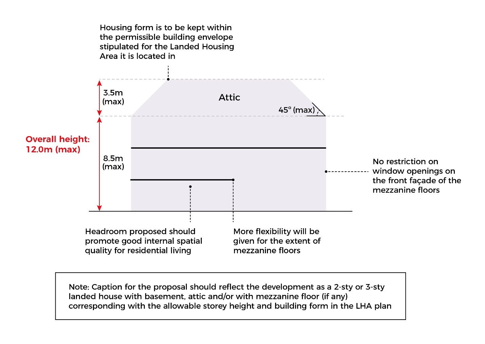
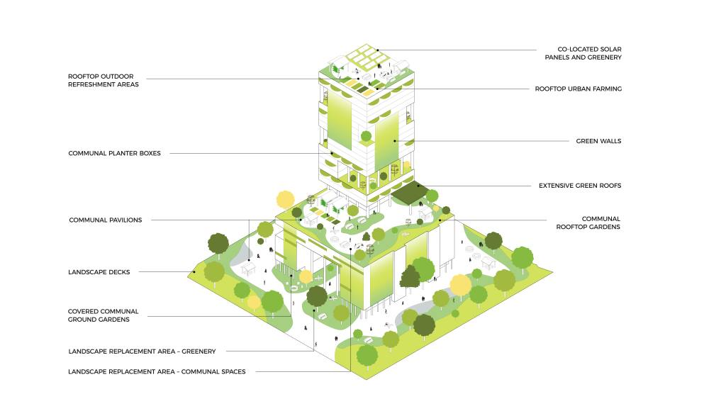
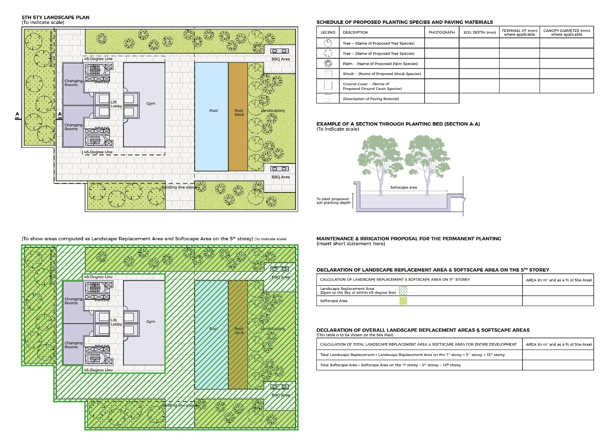
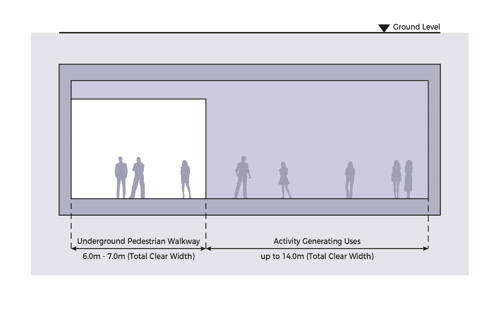
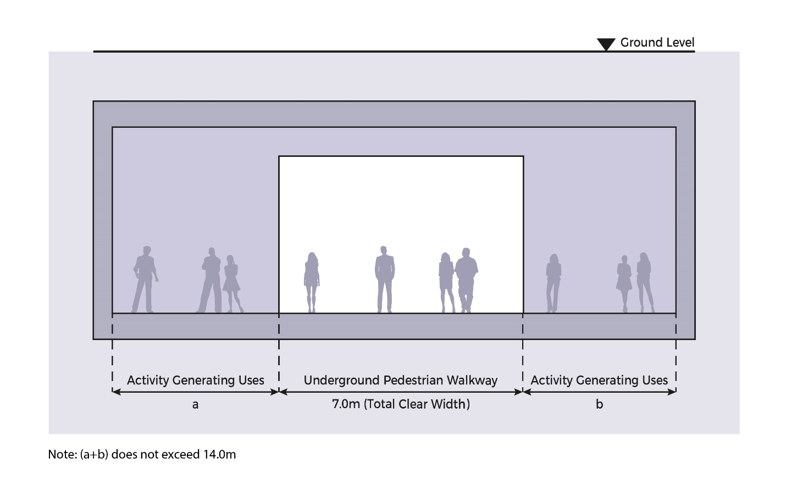

# Commercial

**Advisory Notes**

The guidelines set out in this handbook for the various development
control parameters will generally be applied by URA in the consideration
of a development application. However, if the circumstances of a case or
the planning considerations relevant to a case so warrant, URA may in
its discretion decide to depart from these general guidelines. Persons
intending to carry out a development are advised to take this into
consideration in the conduct of their affairs and check with URA through
enquiries or development applications to confirm if their proposals can
be allowed.

The guidelines, principles and illustrations found in the handbook
series are not exhaustive in covering all possible site conditions and
building designs. In evaluating the development applications, URA
reserves the right to evaluate and impose conditions not covered in the
handbook in respond to the specific design of the development proposal
depending on merits.

**Guidelines at a Glance: Commercial**

The table below is intended to provide an overview of the key guidelines
applicable for the development type. The full details of the guidelines
are stated in the relevant tabs of this handbook.

+----------------------+----------------------+----------------------+
| **Guidelines for all |                      |                      |
| Commercial           |                      |                      |
| Developments**       |                      |                      |
+======================+======================+======================+
| **Parameter**        | **Guideline**        |                      |
+----------------------+----------------------+----------------------+
| Gross Plot Ratio     | As stipulated in the |                      |
|                      | prevailing Master    |                      |
|                      | Plan                 |                      |
+----------------------+----------------------+----------------------+
| Bonus GFA            | Applicable Bonus GFA |                      |
|                      | schemes:             |                      |
|                      |                      |                      |
|                      | -   CBD Incentive    |                      |
|                      |     Scheme           |                      |
|                      |                      |                      |
|                      | -   Strategic        |                      |
|                      |     Development      |                      |
|                      |     Incentive Scheme |                      |
|                      |                      |                      |
|                      | -   Community and    |                      |
|                      |     Sports           |                      |
|                      |     Facilities       |                      |
|                      |     Scheme           |                      |
|                      |                      |                      |
|                      | -   Rooftop ORA on   |                      |
|                      |     Landscaped Roofs |                      |
|                      |                      |                      |
|                      | -   Built            |                      |
|                      |     Environment      |                      |
|                      |     Transformation   |                      |
|                      |     Scheme           |                      |
|                      |                      |                      |
|                      | -   [ORAs within     |                      |
|                      |     Privately-Owned  |                      |
|                      |     Public           |                      |
|                      |     Spaces]{.ul}     |                      |
+----------------------+----------------------+----------------------+
| Road Buffer          | Category 1 --        | 15m (5m green)       |
|                      | Expressway           |                      |
+----------------------+----------------------+----------------------+
|                      | Category 2 -- Major  | 7.5m (3m green)      |
|                      | Arterial             |                      |
+----------------------+----------------------+----------------------+
|                      | Category 3 -- Minor  | 5m (3m green)        |
|                      | Arterial             |                      |
+----------------------+----------------------+----------------------+
|                      | Category 4 & 5 --    | 5m (3m green)        |
|                      | Primary Access       |                      |
+----------------------+----------------------+----------------------+
| Building Setback     | -   Minimum 3m       |                      |
| from Boundary        |     (including 2m    |                      |
|                      |     planting strip)  |                      |
|                      |     along common     |                      |
|                      |     boundaries with  |                      |
|                      |     other            |                      |
|                      |     developments     |                      |
|                      |                      |                      |
|                      | -   Refer to section |                      |
|                      |     on *Building     |                      |
|                      |     Setback from     |                      |
|                      |     Boundary* for    |                      |
|                      |     detailed setback |                      |
|                      |     requirements for |                      |
|                      |     ancillary        |                      |
|                      |     structures       |                      |
+----------------------+----------------------+----------------------+
| Building Height      | No storey-height     |                      |
|                      | control except for   |                      |
|                      | sites which          |                      |
|                      |                      |                      |
|                      | a.  **have technical |                      |
|                      |     height           |                      |
|                      |     controls**       |                      |
|                      |                      |                      |
|                      | b.  **have           |                      |
|                      |     conservation or  |                      |
|                      |     urban design     |                      |
|                      |     requirements**   |                      |
+----------------------+----------------------+----------------------+
|                      | Resultant building   |                      |
|                      | height shall comply  |                      |
|                      | with technical       |                      |
|                      | height controls      |                      |
|                      | imposed by other     |                      |
|                      | authorities such as  |                      |
|                      | CAAS and DSTA        |                      |
+----------------------+----------------------+----------------------+
| Floor-to-Floor       | Maximum 5.0m         |                      |
| Height               |                      |                      |
+----------------------+----------------------+----------------------+
| Basements            | Basements with       |                      |
|                      | protrusions of up to |                      |
|                      | 1.0m:                |                      |
|                      |                      |                      |
|                      | -   shall comply     |                      |
|                      |     > with the road  |                      |
|                      |     > buffer and     |                      |
|                      |     > building       |                      |
|                      |     > setback.       |                      |
|                      |                      |                      |
|                      | -   any basement     |                      |
|                      |     > protrusions of |                      |
|                      |     > more than 1.0m |                      |
|                      |     > above the      |                      |
|                      |     > ground level   |                      |
|                      |     > are treated as |                      |
|                      |     > a storey.      |                      |
|                      |                      |                      |
|                      | Sunken basements may |                      |
|                      | be built up to the   |                      |
|                      | road reserve line    |                      |
|                      | and lot boundary     |                      |
|                      | provided:            |                      |
|                      |                      |                      |
|                      | -   the portion      |                      |
|                      |     > underneath the |                      |
|                      |     > green buffer   |                      |
|                      |     > is submerged   |                      |
|                      |     > at least 2m or |                      |
|                      |     > more below the |                      |
|                      |     > ground level.  |                      |
|                      |                      |                      |
|                      | -   there are no     |                      |
|                      |     > technical      |                      |
|                      |     > requirements.  |                      |
|                      |                      |                      |
|                      | -   it does not      |                      |
|                      |     > cause any      |                      |
|                      |     > adverse impact |                      |
|                      |     > to the         |                      |
|                      |     > adjoining      |                      |
|                      |     > property.      |                      |
+----------------------+----------------------+----------------------+
| Special and Detailed | -   [Special and     | Developments within  |
| Control Plans        |     Detailed Control | special control      |
|                      |     Plans]{.ul}      | areas may be subject |
|                      |                      | to screening         |
|                      | -   ~~Conservation   | requirements (to be  |
|                      |     Areas and        | confirmed upon       |
|                      |     Monument Plan~~  | submission of a      |
|                      |                      | proposed             |
|                      | -   ~~Envelop        | development)         |
|                      |     Control and      |                      |
|                      |     Street Block     |                      |
|                      |     Plan~~           |                      |
|                      |                      |                      |
|                      | -   ~~Parks and      |                      |
|                      |     Water Bodies     |                      |
|                      |     Plan~~           |                      |
|                      |                      |                      |
|                      | -   [Special Control |                      |
|                      |     Area             |                      |
|                      |     1](https         |                      |
|                      | ://www.ura.gov.sg/-/ |                      |
|                      | media/Corporate/Guid |                      |
|                      | elines/Development-c |                      |
|                      | ontrol/Others/SCA_1) |                      |
|                      |                      |                      |
|                      | -   [Special Control |                      |
|                      |     Area             |                      |
|                      |     2](https         |                      |
|                      | ://www.ura.gov.sg/-/ |                      |
|                      | media/Corporate/Guid |                      |
|                      | elines/Development-c |                      |
|                      | ontrol/Others/SCA_2) |                      |
+----------------------+----------------------+----------------------+
| Street Block Plans   | Refer to section on  |                      |
|                      | *Street Block Plans* |                      |
+----------------------+----------------------+----------------------+
| Urban Design         | Urban Design         |                      |
| Requirements         | Requirements         |                      |
|                      | including activity   |                      |
|                      | generating uses may  |                      |
|                      | apply to             |                      |
|                      | developments within  |                      |
|                      | the Central Area and |                      |
|                      | Key Growth           |                      |
|                      | areas(such as Jurong |                      |
|                      | Gateway, Paya Lebar  |                      |
|                      | Central, Punggol     |                      |
|                      | Digital District and |                      |
|                      | Woodlands Central).  |                      |
|                      |                      |                      |
|                      | Refer to URA's Urban |                      |
|                      | Design Website.      |                      |
+----------------------+----------------------+----------------------+
| Developments         | Refer to section on  |                      |
| involving            | *Developments        |                      |
| Waterbodies          | involving            |                      |
|                      | Waterbodies*         |                      |
+----------------------+----------------------+----------------------+
| Parking              | The Land Transport   |                      |
|                      | Authority (LTA)      |                      |
|                      | prescribes parking   |                      |
|                      | standards and        |                      |
|                      | requirements.        |                      |
+----------------------+----------------------+----------------------+
| Open-sided and       | All commercial       |                      |
| Covered Walkways     | developments and     |                      |
|                      | commercial buildings |                      |
|                      | in mixed             |                      |
|                      | developments shall   |                      |
|                      | provide covered      |                      |
|                      | walkways along the   |                      |
|                      | periphery of the     |                      |
|                      | building facing      |                      |
|                      | roads and pedestrian |                      |
|                      | routes. Refer to     |                      |
|                      | section on *Covered  |                      |
|                      | Walkways* for        |                      |
|                      | requirements.        |                      |
+----------------------+----------------------+----------------------+
| Average Retail Unit  | Minimum 50sqm        |                      |
| Size                 |                      |                      |
+----------------------+----------------------+----------------------+
| Internal Corridor    | [Corridor serving    |                      |
| Width                | single row of retail |                      |
|                      | units]{.ul}          |                      |
|                      |                      |                      |
|                      | Minimum 2m to 2.4m   |                      |
|                      |                      |                      |
|                      | [Corridor serving    |                      |
|                      | retail units on both |                      |
|                      | sides ]{.ul}         |                      |
|                      |                      |                      |
|                      | Minimum 2.4m to 3m   |                      |
+----------------------+----------------------+----------------------+
| RC Flat Roofs        | RC flat roofs shall  |                      |
|                      | remain inaccessible  |                      |
|                      | except for           |                      |
|                      | maintenance purposes |                      |
|                      | only. Activating the |                      |
|                      | rooftop for uses     |                      |
|                      | such as roof         |                      |
|                      | terraces may be      |                      |
|                      | allowed depending on |                      |
|                      | the merits of the    |                      |
|                      | proposal. No         |                      |
|                      | structures shall be  |                      |
|                      | allowed unless       |                      |
|                      | otherwise approved   |                      |
|                      | by URA. Where        |                      |
|                      | allowed, structures  |                      |
|                      | (including any       |                      |
|                      | safety barriers)     |                      |
|                      | shall comply with    |                      |
|                      | height controls and  |                      |
|                      | the following        |                      |
|                      | guidelines.          |                      |
+----------------------+----------------------+----------------------+
|                      | **Communal           |                      |
|                      | Pavilions**          |                      |
|                      |                      |                      |
|                      | Communal pavilions   |                      |
|                      | shall be accessed    |                      |
|                      | from common areas    |                      |
|                      | only.                |                      |
|                      |                      |                      |
|                      | They shall be        |                      |
|                      | computed as GFA      |                      |
|                      | unless they meet the |                      |
|                      | following criteria:  |                      |
|                      |                      |                      |
|                      | -   Maximum 50sqm or |                      |
|                      |     50% of roof      |                      |
|                      |     coverage,        |                      |
|                      |     whichever is     |                      |
|                      |     lower;           |                      |
|                      |                      |                      |
|                      | -   For developments |                      |
|                      |     with storey      |                      |
|                      |     height control,  |                      |
|                      |     pavilions shall  |                      |
|                      |     be open-sided;   |                      |
|                      |                      |                      |
|                      | -   For developments |                      |
|                      |     without storey   |                      |
|                      |     height control,  |                      |
|                      |     maximum 50%      |                      |
|                      |     perimeter        |                      |
|                      |     enclosure of the |                      |
|                      |     pavilions may be |                      |
|                      |     allowed;         |                      |
|                      |                      |                      |
|                      | -   Communal         |                      |
|                      |     pavilions shall  |                      |
|                      |     be integrated    |                      |
|                      |     with lush        |                      |
|                      |     greenery. The    |                      |
|                      |     greenery on the  |                      |
|                      |     rooftop shall be |                      |
|                      |     both enjoyable   |                      |
|                      |     by the building  |                      |
|                      |     users and        |                      |
|                      |     visible from the |                      |
|                      |     surroundings;    |                      |
|                      |                      |                      |
|                      | -   Plants shall be  |                      |
|                      |     incorporated on  |                      |
|                      |     permanent and    |                      |
|                      |     preferably       |                      |
|                      |     sunken planting, |                      |
|                      |     planned with     |                      |
|                      |     sufficient soil  |                      |
|                      |     depth based on   |                      |
|                      |     the types of     |                      |
|                      |     plants proposed. |                      |
|                      |     Some space shall |                      |
|                      |     be set aside for |                      |
|                      |     the provision of |                      |
|                      |     communal         |                      |
|                      |     facilities and   |                      |
|                      |     furniture to     |                      |
|                      |     enhance the      |                      |
|                      |     rooftop.         |                      |
+----------------------+----------------------+----------------------+
|                      | **Solar Panels**     |                      |
|                      |                      |                      |
|                      | Planning permission  |                      |
|                      | is not required      |                      |
|                      | except in the        |                      |
|                      | following locations  |                      |
|                      | and contexts:        |                      |
|                      |                      |                      |
|                      | -   Site is subject  |                      |
|                      |     to urban design  |                      |
|                      |     guidelines or    |                      |
|                      |     located within   |                      |
|                      |     Conservation     |                      |
|                      |     Areas;           |                      |
|                      |                      |                      |
|                      | -   Elevated^1^      |                      |
|                      |     solar panels;    |                      |
|                      |                      |                      |
|                      | -   Spaces under     |                      |
|                      |     solar panels are |                      |
|                      |     enclosed or put  |                      |
|                      |     to commercial    |                      |
|                      |     use.             |                      |
|                      |                      |                      |
|                      | ^1^ A solar panel is |                      |
|                      | deemed to be         |                      |
|                      | elevated if it is    |                      |
|                      | raised more than 1m  |                      |
|                      | from the roof level  |                      |
|                      | for landed housing   |                      |
|                      | developments or 1.8m |                      |
|                      | from the roof level  |                      |
|                      | for other            |                      |
|                      | developments.        |                      |
+----------------------+----------------------+----------------------+
| Greenery             | Refer to section on  |                      |
|                      | *Greenery*           |                      |
+----------------------+----------------------+----------------------+
| Walking and Cycling  | Walking and Cycling  |                      |
| Plan                 | Plan submission is   |                      |
|                      | required for retail  |                      |
|                      | developments with    |                      |
|                      | GFA of at least      |                      |
|                      | 10,000sqm and        |                      |
|                      | commercial           |                      |
|                      | developments (e.g.   |                      |
|                      | office) with GFA of  |                      |
|                      | at least 20,000sqm.  |                      |
|                      | Refer to section on  |                      |
|                      | Walking and Cycling  |                      |
|                      | Plan.                |                      |
+----------------------+----------------------+----------------------+
| Underground          | Refer to section on  |                      |
| Pedestrian Links to  | Underground          |                      |
| Rapid Transit System | Pedestrian Links to  |                      |
| (RTS) Stations       | RTS Stations         |                      |
+----------------------+----------------------+----------------------+
| Earthworks           | -   Earthworks are   |                      |
|                      |     not allowed      |                      |
|                      |     within the       |                      |
|                      |     building setback |                      |
|                      |     area.            |                      |
|                      |                      |                      |
|                      | -   Earthworks       |                      |
|                      |     within the       |                      |
|                      |     build-able area  |                      |
|                      |     are subject to   |                      |
|                      |     evaluation. If   |                      |
|                      |     earthfill of     |                      |
|                      |     more than 1m is  |                      |
|                      |     allowed, the     |                      |
|                      |     overall          |                      |
|                      |     aggregate        |                      |
|                      |     building height  |                      |
|                      |     measured from    |                      |
|                      |     the allowable    |                      |
|                      |     platform level   |                      |
|                      |     shall comply     |                      |
|                      |     with the maximum |                      |
|                      |     allowable        |                      |
|                      |     building height  |                      |
|                      |     control.         |                      |
|                      |                      |                      |
|                      | -   Earthfill        |                      |
|                      |     involving the    |                      |
|                      |     entire           |                      |
|                      |     development site |                      |
|                      |     may only be      |                      |
|                      |     considered if    |                      |
|                      |     the proposed     |                      |
|                      |     earthworks are   |                      |
|                      |     required to meet |                      |
|                      |     the Minimum      |                      |
|                      |     Platform Level   |                      |
|                      |     (MPL) stipulated |                      |
|                      |     by PUB           |                      |
+----------------------+----------------------+----------------------+
| Retaining and        | Maximum allowable    |                      |
| Boundary Walls       | height for boundary  |                      |
|                      | walls is 1.8m.       |                      |
|                      |                      |                      |
|                      | Erection of          |                      |
|                      | retaining walls are  |                      |
|                      | subject to           |                      |
|                      | evaluation. If       |                      |
|                      | retaining walls are  |                      |
|                      | allowed:             |                      |
|                      |                      |                      |
|                      | -   the height shall |                      |
|                      |     be less than     |                      |
|                      |     1.5m;            |                      |
|                      |                      |                      |
|                      | -   retaining walls  |                      |
|                      |     higher than 1.5m |                      |
|                      |     may be           |                      |
|                      |     considered       |                      |
|                      |     depending on     |                      |
|                      |     site constraints |                      |
|                      |     and the need for |                      |
|                      |     extensive        |                      |
|                      |     excavation;      |                      |
|                      |                      |                      |
|                      | -   the total        |                      |
|                      |     visible height   |                      |
|                      |     of the solid     |                      |
|                      |     bo               |                      |
|                      | undary-cum-retaining |                      |
|                      |     wall shall not   |                      |
|                      |     exceed 2.8m, of  |                      |
|                      |     which the solid  |                      |
|                      |     boundary wall    |                      |
|                      |     shall not exceed |                      |
|                      |     1.8m.            |                      |
+----------------------+----------------------+----------------------+

+----------------------+----------------------+----------------------+
| **Additional         |                      |                      |
| Guidelines for Mixed |                      |                      |
| Commercial and       |                      |                      |
| Residential          |                      |                      |
| Developments**       |                      |                      |
+======================+======================+======================+
| **Parameter**        | **Guideline**        |                      |
+----------------------+----------------------+----------------------+
| Location of          | Commercial uses      |                      |
| Commercial Uses      | shall be located on  |                      |
|                      | lower floors, below  |                      |
|                      | the residential      |                      |
|                      | uses.                |                      |
+----------------------+----------------------+----------------------+
| Use Quantum          | Land zoned           |                      |
|                      | Commercial           |                      |
|                      |                      |                      |
|                      | -   Minimum 60% of   |                      |
|                      |     overall GFA for  |                      |
|                      |     commercial uses  |                      |
|                      |                      |                      |
|                      | -   Use of remaining |                      |
|                      |     GFA to be        |                      |
|                      |     evaluated        |                      |
+----------------------+----------------------+----------------------+
|                      | Land zoned           |                      |
|                      | Commercial and       |                      |
|                      | Residential          |                      |
|                      |                      |                      |
|                      | -   Maximum 40% of   |                      |
|                      |     overall GFA for  |                      |
|                      |     commercial uses  |                      |
|                      |                      |                      |
|                      | -   Minimum 60% of   |                      |
|                      |     overall GFA for  |                      |
|                      |     residential uses |                      |
+----------------------+----------------------+----------------------+
| Building Setback     | Residential and      | -   Setback          |
|                      | Commercial Uses in   |     requirements for |
|                      | same building        |     commercial       |
|                      |                      |     developments     |
|                      |                      |     apply to         |
|                      |                      |     commercial       |
|                      |                      |     component.       |
|                      |                      |                      |
|                      |                      | -   Residential may  |
|                      |                      |     adopt setback    |
|                      |                      |     requirements for |
|                      |                      |     commercial       |
|                      |                      |     developments.    |
+----------------------+----------------------+----------------------+
|                      | Residential and      | -   Setback          |
|                      | Commercial Uses in   |     requirements for |
|                      | separate buildings   |     commercial       |
|                      |                      |     developments     |
|                      |                      |     apply to         |
|                      |                      |     commercial       |
|                      |                      |     component.       |
|                      |                      |                      |
|                      |                      | -   Setback          |
|                      |                      |     requirements for |
|                      |                      |     flat             |
|                      |                      |     developments     |
|                      |                      |     apply to         |
|                      |                      |     residential      |
|                      |                      |     component.       |
+----------------------+----------------------+----------------------+
|                      | Mixed Residential    |                      |
|                      | and Commercial       |                      |
|                      | development abuts    |                      |
|                      | land zoned           |                      |
|                      | Residential or       |                      |
|                      | Residential with     |                      |
|                      | Commercial at 1^st^  |                      |
|                      | Storey               |                      |
+----------------------+----------------------+----------------------+
| Floor-to-Floor       | Commercial Use       |                      |
| Height               |                      |                      |
|                      | -   5.0m (Maximum)   |                      |
+----------------------+----------------------+----------------------+
|                      | Residential Use      |                      |
|                      |                      |                      |
|                      | -   5.0m (Maximum)   |                      |
|                      |     for 1^st^ storey |                      |
|                      |                      |                      |
|                      | -   3.6m (Maximum)   |                      |
|                      |     for subsequent   |                      |
|                      |     storeys          |                      |
+----------------------+----------------------+----------------------+

+----------------------------------+----------------------------------+
| **Additional Guidelines for      |                                  |
| "Residential with Commercial at  |                                  |
| 1^st^ Storey" Developments**     |                                  |
+==================================+==================================+
| **Parameter**                    | **Guideline**                    |
+----------------------------------+----------------------------------+
| Location of Commercial Uses      | Typically confined to 1^st^      |
|                                  | storey but may be considered at  |
|                                  | the basement or upper storeys if |
|                                  | the development is located       |
|                                  | within the Central Area or if    |
|                                  | the development is within a      |
|                                  | mixed use area fronting major    |
|                                  | arterial routes outside the      |
|                                  | Central Area. Refer to section   |
|                                  | on Residential with Commercial   |
|                                  | at 1^st^ Storey for more         |
|                                  | details.                         |
+----------------------------------+----------------------------------+
| Use Quantum and Allowable Use    | -   The allowable commercial     |
|                                  |     quantum is determined by the |
|                                  |     1^st^ storey building        |
|                                  |     footprint.                   |
|                                  |                                  |
|                                  | -   Commercial uses that are     |
|                                  |     likely to cause disamenity   |
|                                  |     to the residents are not     |
|                                  |     allowed. Examples of such    |
|                                  |     commercial uses include      |
|                                  |     night clubs and karaoke      |
|                                  |     bars.                        |
+----------------------------------+----------------------------------+
| Building Setback                 | -   Setback requirements for     |
|                                  |     commercial developments      |
|                                  |     apply to commercial          |
|                                  |     component.                   |
|                                  |                                  |
|                                  | -   Setback requirements for     |
|                                  |     flat developments apply to   |
|                                  |     residential component.       |
+----------------------------------+----------------------------------+
| Floor-to-Floor Height            | [Commercial Use]{.ul}            |
|                                  |                                  |
|                                  | -   5.0m (Maximum)               |
+----------------------------------+----------------------------------+
|                                  | [Residential Use]{.ul}           |
|                                  |                                  |
|                                  | -   5.0m (Maximum) for 1^st^     |
|                                  |     storey                       |
|                                  |                                  |
|                                  | -   3.6m (Maximum) for           |
|                                  |     subsequent storeys           |
+----------------------------------+----------------------------------+
| Pure Residential Development     | [Outside Key Routes]{.ul}        |
| Proposals                        |                                  |
|                                  | -   Assessed depending on        |
|                                  |     merits, taking into account  |
|                                  |     the compatibility of the     |
|                                  |     proposal with the            |
|                                  |     surrounding land uses and    |
|                                  |     planning intention.          |
|                                  |                                  |
|                                  | [Along Key Routes in Central     |
|                                  | Area]{.ul}                       |
|                                  |                                  |
|                                  | -   Not supported if the         |
|                                  |     development does not provide |
|                                  |     activity-generating          |
|                                  |     commercial uses such as      |
|                                  |     retail, food and beverage,   |
|                                  |     and entertainment            |
+----------------------------------+----------------------------------+
| Shophouses and Shopflats         | -   Commercial uses are          |
|                                  |     restricted to the 1^st^      |
|                                  |     storey only. Basements are   |
|                                  |     not allowed for commercial   |
|                                  |     use.                         |
|                                  |                                  |
|                                  | -   Strata subdivision is        |
|                                  |     allowed for shophouses and   |
|                                  |     shopflats except for         |
|                                  |     conservation properties      |
|                                  |     within the Historic          |
|                                  |     Districts and Historic       |
|                                  |     Residential Districts.       |
+----------------------------------+----------------------------------+

### 

### **Introduction**

Commercial developments include office buildings, shopping malls,
convention/exhibition centres, commercial schools/banks, market and food
centres/restaurants, cinemas, entertainment and trade missions. Some
developments may contain a mix of commercial uses such as a shopping
podium with an office tower block above.

The form of a commercial development may vary from a free-standing,
podium/tower arrangement, to a party-wall development. The resultant
building form depends on the location and street block plans for the
site.

Commercial developments can be developed on land zoned:

-   Commercial;

-   Mixed Commercial and Residential; or

-   Residential with Commercial at 1^st^ Storey


### **Mixed Commercial & Residential**

Mixed commercial and residential developments include a combination of
commercial uses and residential flats and may be developed on land zoned
Commercial & Residential or Commercial.

Specific guidelines for mixed commercial and residential developments
are outlined in the following sections.

In addition to the guidelines for mixed commercial and residential
developments, the commercial component shall comply with the [guidelines
for commercial
developments](https://intranet.ura.gov.sg/Corporate/Guidelines/Development-Control/Non-Residential/Commercial) and
the residential component shall comply with the [guidelines for
residential
flats^1^ developments](https://intranet.ura.gov.sg/Corporate/Guidelines/Development-Control/Residential/Flats-Condominiums).

^1^ The residential component within a mixed commercial and residential
development will not be accorded condominium status as it is not
developed in accordance with condominium guidelines.

**Location of Commercial Uses**

The commercial uses shall be located on the lower floors, below the
residential areas.

**Use Quantum**

The use quantum controls for mixed commercial and residential
developments are detailed in the table below.

**Use Quantum for Mixed Commercial and Residential Developments**

  **Zoning**                                                                                **Residential Quantum**                                                             **Commercial Quantum**
  ----------------------------------------------------------------------------------------- ----------------------------------------------------------------------------------- ---------------------------------
  Mixed commercial and residential development on land zoned "Commercial and Residential"   Minimum 60% of the total GFA                                                        Maximum 40% of the total GFA
  Mixed commercial and residential development on land zoned "Commercial"                   Non-commercial uses will be determined by the Competent Authority upon submission   Minimum 60% of the total GFA^2^

^2^ Not applicable to land zoned Commercial within the 4 Historical
Conservation Districts of Kampong Glam, Chinatown, Little India, and
Boat Quay. Residential or institutional uses which are more than 40% of
the total GFA can be allowed in these 4 districts.

**Building Setback**


*Setback Requirements for Mixed Commercial and Residential Developments*

All buildings in mixed commercial and residential developments shall be
sufficiently set back from the road and common boundary. The setback
distance is measured from the road reserve line or boundary line to the
external wall of the buildings, excluding land to be vested to the State
for road and/or drainage purpose.

All buildings in mixed commercial and residential developments fronting
a public road shall provide a road buffer, the width of which depends on
the hierarchy of the road. A green buffer shall be set aside in the road
buffer depending on the width of the road buffer.

The road buffer and common boundary setback requirements for mixed
commercial and residential developments are determined by the building
form, and are detailed in the table below.

**Road Buffer and Common Boundary Setback**

  --------------------------------------------------------------------------------------------------------------------------------------------------------------------------------------------------------------------------------------------------------------------
  **Building Form/Location**                                                                                                           **Road Buffer & Common Boundary Setback Requirements**
  ------------------------------------------------------------------------------------------------------------------------------------ -------------------------------------------------------------------------------------------------------------------------------
  If residential and commercial uses are located in the same building                                                                  Commercial component shall comply with the road buffer and common boundary setback requirements for commercial development. \
                                                                                                                                       \
                                                                                                                                       Residential component may adopt the road buffer and common boundary setback requirements for commercial development.

  If residential and commercial uses are located in separate independent buildings                                                     Commercial component shall comply with the road buffer and common boundary setback requirements for commercial development. \
                                                                                                                                       \
                                                                                                                                       Residential component shall comply with the road buffer and common boundary setback requirements for flats development.

  If the mixed residential & commercial developments abuts land zoned "Residential" or "Residential with Commercial at 1^st^ storey"   
  --------------------------------------------------------------------------------------------------------------------------------------------------------------------------------------------------------------------------------------------------------------------

Mixed commercial and residential developments may abut the road reserve
at the front if:

-   The site is within the Central Area; and/or

-   The site is constrained or if there is an intention to retain the
    > existing streetscape which is abutting the road reserve line.

**Floor-to-Floor Height**

The floor-to-floor height control for the various uses in the mixed
commercial and residential development is shown in the table below.

**Floor-to-Floor Height**

  ---------------------------------------------------
  **Use**       **Floor-to-Floor Height (Maximum)**
  ------------- -------------------------------------
  Commercial    5.0m

  Residential   1^st^ storey: 5.0m\
                Subsequent storeys: 3.6m
  ---------------------------------------------------

**Parking**

The [parking guidelines for commercial
developments](https://intranet.ura.gov.sg/Corporate/Guidelines/Development-Control/Non-Residential/Commercial/~/link.aspx?_id=E7F09E4D86254DA2A85706FA59BCA7EC&_z=z) listed
in this handbook also apply to mixed-use developments where the
commercial and/or hotel components form more than 20% of the total GFA.

### 

### **Residential with Commercial at 1^st^ storey**

"Residential with Commercial at 1^st^ Storey" developments include a
combination of commercial uses and residential flats and may be
developed on land zoned Residential with Commercial at 1^st^ Storey or
Commercial/Residential.

Specific guidelines for residential with commercial at the 1^st^ storey
developments are outlined in the following sections.

In addition to the guidelines for residential with commercial at the
1^st^ storey developments, the commercial component shall comply with
the [guidelines for commercial
developments](https://intranet.ura.gov.sg/Corporate/Guidelines/Development-Control/Non-Residential/Commercial) and
the residential component shall comply with the [guidelines for
residential flats
developments](https://intranet.ura.gov.sg/Corporate/Guidelines/Development-Control/Residential/Flats-Condominiums).

**Location of Commercial Uses**

Commercial uses are confined to the 1^st^ storey.


*Allowable Location of Commercial Uses - Type A*


*Allowable Location of Commercial Uses - Type B*

Commercial uses at the basement and upper floors may be considered for
developments located within the Central Area or if the development is
within a mixed use area fronting major arterial routes outside the
Central Area. Proposals to transfer commercial uses to the other storeys
shall be evaluated depending on merits, taking into consideration the
location, site context, traffic, and impact on the surroundings.

If permitted, proposals to transfer commercial uses to the other storey
shall comply with the following guidelines:

-   Total commercial quantum shall not exceed the maximum commercial
    > quantum allowed at the 1^st^ storey;

-   There shall be commercial uses at the 1^st^ storey fronting the
    > street;

-   The commercial areas shall be contiguous;

-   There shall be a clear separation between the commercial and
    > residential uses;

-   The commercial uses shall be kept within the minimum height of the
    > building edge for the streetblock or 4-storeys, whichever is
    > applicable; and

-   The commercial uses shall not create disamenity to the adjoining
    > residential use

**Use Quantum and Allowable Uses**

The allowable commercial quantum is determined by the 1^st^ storey
building footprint.

Commercial uses that are likely to cause disamenity to the residents are
not allowed. Examples of such commercial uses include night clubs and
karaoke bars.

**Building Setback**


*Setback Requirements for Residential with 1^st^ Storey Commercial
Developments*

All buildings in "Residential with Commercial at 1^st^ Storey"
developments shall be sufficiently set back from the road and common
boundary. The setback distance is measured from the road reserve^1^ line
or boundary line to the external wall of the buildings, excluding land
to be vested to the State for road and/or drainage purpose.

All buildings in "Residential with Commercial at 1^st^ Storey"
developments fronting a public road shall provide a road buffer, the
width of which depends on the hierarchy of the road. A green buffer
shall be set aside in the road buffer depending on the width of the road
buffer.

The road buffer and common boundary setback requirements for
"Residential with Commercial at 1^st^ Storey" developments are
determined by the building form and are detailed in the table below.

**Road Buffer and Common Boundary Setback**

  **Use**       **Road Buffer & Common Boundary Setback Requirements**
  ------------- --------------------------------------------------------------------------------------------------------------------------------------------------------------------------------------------------------------------------------------------------------
  Commercial    Comply with [road buffer and common boundary setback requirements](https://intranet.ura.gov.sg/Corporate/Guidelines/Development-Control/Non-Residential/Commercial/~/link.aspx?_id=2150BF35FBDC441DAE6D50349A64F5A2&_z=z) for commercial developments.
  Residential   Comply with [road buffer and common boundary setback requirements](https://intranet.ura.gov.sg/Corporate/Guidelines/Development-Control/Non-Residential/Commercial/~/link.aspx?_id=26A8B5BCA6A140EEA8FFC4D4CB2469ED&_z=z) for flat developments.

"Residential with Commercial at 1^st^ Storey" developments may abut the
road reserve at the front if:

-   The site is within the [Central
    > Area](https://intranet.ura.gov.sg/Corporate/Guidelines/Development-Control/Non-Residential/Commercial/-/media/1A7FB24BBE13419790D886BD6EDC0031.ashx) (PDF,
    > 436 KB); and/or

-   The site is constrained or if there is an intention to retain the
    > existing streetscape which is abutting the road reserve line.

^1^ **Road Reserve**: The plot of land to be vested in the State as
required under the Street Works Act. It is demarcated by the line of
Road Reserve in the Road Line Plan and the site boundary.

**Floor-to-Floor Height**

The floor-to-floor height control for the various uses in the
"Residential with Commercial at 1^st^storey" development is shown in the
table below.

**Floor-to-Floor Height**

  ---------------------------------------------------
  **Use**       **Floor-to-floor Height (Maximum)**
  ------------- -------------------------------------
  Commercial    5.0m

  Residential   1^st^ storey: 5.0m\
                Subsequent storeys: 3.6m
  ---------------------------------------------------

**Pure Residential Developments on land zoned "Residential with
Commercial at 1st Storey"**

-   **Outside Key Routes**

> **\
> **Proposals for pure residential developments shall be assessed based
> on the compatibility of the proposal with the surrounding land uses
> and planning intention.

-   **Along Key Routes in Central Area **

> **\
> **Proposals for pure residential developments without
> activity-generating commercial uses such as retail, food and beverage,
> and entertainment shall not be supported.

\*Key routes are indicated in the Activity Generating Uses Control
Plan [here](https://intranet.ura.gov.sg/Corporate/Guidelines/Development-Control/Non-Residential/Commercial/~/link.aspx?_id=E20B309071124CA1819D850004EEC880&_z=z).

**Shophouses and Shopflats**

Shophouses and shopflats are developments with shops at the 1^st^ storey
and flats on the upper storeys. They are usually located on land zoned
Residential with Commercial at 1^st^ Storey but may be allowed on land
zoned Commercial & Residential.

#### **Location of Commercial Use**

Commercial uses are restricted to the 1^st^ storey only. Basements are
not allowed for commercial use.

#### **Strata Subdivision**

Strata subdivision is allowed for shophouses and shopflats except for
conservation properties within the Historic Districts and Historic
Residential Districts.

Only selected conservation buildings within Historic Residential
Districts shall be allowed to strata subdivide if they meet the
following criteria:

-   Original purpose-built compartmentalized common staircase designed
    > to serve different floors;

-   Staircase forms part of the external architectural expression; and

-   Original reinforced concrete floors and structures.

**Parking**

The [parking guidelines for commercial
developments](https://intranet.ura.gov.sg/Corporate/Guidelines/Development-Control/Non-Residential/Commercial/~/link.aspx?_id=E7F09E4D86254DA2A85706FA59BCA7EC&_z=z) listed
in this handbook shall apply to mixed-use developments where the
commercial and/or hotel components form more than 20% of the total GFA.

### 

### **Gross Plot Ratio**

The allowable Gross Plot Ratio (GPR) of a commercial development is
guided by the GPR specified in the Master Plan (MP). The MP plot ratio
is the upper bound as it may not always be achievable because of site
limitations like shape of the plot, site topography or ground
conditions, building setbacks, building height or technical requirements
of other authorities that may affect the site.

If the GPR is not specified in the Master Plan, the development
potential would be determined taking into consideration the location,
site context, traffic and impact of the commercial development on the
surroundings.

The area of the land required to be set aside for Drainage
Reserve^1^ (DR) and/or Road Reserve^2^ (RR) to be vested in the State
may be included in the site area to compute the gross floor area (GFA)
for a GPR -- see figure below.

^1^ **Drainage Reserve (DR)**: An area safeguarded for purposes of
building or widening a public drain

^2^ **Road Reserve**: The plot of land to be vested in the State as
required under the Street Works Act. It is demarcated by the line of
Road Reserve in the Road Line Plan and the site boundary.


*GPR for sites where vesting is required*

### 

### **Bonus GFA Incentive Schemes**

Commercial developments are eligible for the following bonus GFA
incentive schemes if they comply with the relevant guidelines:

Commercial developments may make use of any combination of the bonus GFA
incentive schemes (ie CSFS and Rooftop Greenery ORA), as long as the
cumulative bonus GFA does not exceed the overall cap of 10% above the MP
GPR.

**Community and Sports Facilities Scheme**

The Community and Sports Facilities Scheme (CSFS) facilitates the
co-location of compatible community and sports uses with highly
accessible commercial developments. Under the CSFS, bonus GFA for the
community and sports uses is subject to an overall cap of 10% of the
maximum permissible GFA for the site allowed under the prevailing Master
Plan or 2,000sqm (whichever is lower).

#### **Eligible Commercial Developments**

The co-location of community or sports uses under the CSFS is intended
primarily for commercial retail developments which are highly
accessible. The commercial development that may be considered for the
community and/or sports uses under the CSFS shall be in close proximity
to transport nodes or town centres/neighbourhood centres, and the
additional CSFS space may be supported from the land use and transport
planning points of view.

Community and sports uses under the CSFS would not be supported in hotel
developments as the resultant synergies are limited.

Community and sports uses under the CSFS in office developments shall
only be considered if it is clear that the use has clear synergies with
the office development and caters to the needs of the office workers.

[\
](https://intranet.ura.gov.sg/Corporate/Guidelines/Development-Control/Non-Residential/Commercial/GFA-Incentive-Schemes#Allowable-Uses)***Allowable
Community and Sports Uses***

The proposed community and sports uses shall primarily be intended or
public or community use and not profit-driven, with the exception of
commercial child care centres endorsed by the Early Development
Childhood Agency (ECDA). Refer to table below for a list of allowable
uses.

**Allowable Uses for CSFS Scheme**

+---------------------------------+-----------------------------------+
| **Community Uses**              | **Child Care Services**           |
|                                 |                                   |
|                                 | -   CSFS is applicable to child   |
|                                 |     > care services provided by   |
|                                 |                                   |
|                                 |     a.  non-profit or anchor      |
|                                 |         > operator child care     |
|                                 |         > centres endorsed by     |
|                                 |         > ECDA; and               |
|                                 |                                   |
|                                 |     b.  commercial child care     |
|                                 |         > centres endorsed by     |
|                                 |         > ECDA under their        |
|                                 |         > Support Scheme.         |
|                                 |                                   |
|                                 | -   Qualified commercial child    |
|                                 |     > care centres shall be       |
|                                 |     > approved on Temporary       |
|                                 |     > Permission (TP). URA's      |
|                                 |     > approval is required for a  |
|                                 |     > renewal of the TP. As part  |
|                                 |     > of the renewal, the         |
|                                 |     > operator shall fulfil       |
|                                 |     > ECDA's qualifying criteria  |
|                                 |     > under the Support Schemes   |
|                                 |     > and obtain ECDA's           |
|                                 |     > re-endorsement for the      |
|                                 |     > CSFS.                       |
|                                 |                                   |
|                                 | **Disability Services**           |
|                                 |                                   |
|                                 | -   Disability services, under    |
|                                 |     > the purview of the Ministry |
|                                 |     > of Social and Family        |
|                                 |     > Development (MSF), refer to |
|                                 |     > services and programmes in  |
|                                 |     > place for people with       |
|                                 |     > disabilities to help them   |
|                                 |     > integrate into society.     |
|                                 |     > Such services include day   |
|                                 |     > activity centres that       |
|                                 |     > provide training in daily   |
|                                 |     > living skills, social       |
|                                 |     > skills development, and     |
|                                 |     > vocational abilities        |
|                                 |     > development.                |
|                                 |                                   |
|                                 | -   The disability services       |
|                                 |     > operator shall be endorsed  |
|                                 |     > by MSF/National Council of  |
|                                 |     > Social Service (NCSS) to    |
|                                 |     > qualify for the CSFS.       |
|                                 |                                   |
|                                 | **Family Services**               |
|                                 |                                   |
|                                 | -   Family services, under the    |
|                                 |     > purview of the Ministry of  |
|                                 |     > Social and Family           |
|                                 |     > Development (MSF), refer to |
|                                 |     > services to the public on   |
|                                 |     > family matters. Such        |
|                                 |     > services include individual |
|                                 |     > and family counselling,     |
|                                 |     > family life education,      |
|                                 |     > parenting advice, talks, or |
|                                 |     > seminars, family finances   |
|                                 |     > or financial counselling,   |
|                                 |     > and marriage counselling    |
|                                 |     > (non-commercial).           |
|                                 |                                   |
|                                 | -   The family services operator  |
|                                 |     > shall be endorsed by        |
|                                 |     > MSF/NCSS to qualify for the |
|                                 |     > CSFS.                       |
|                                 |                                   |
|                                 | **Eldercare Services**            |
|                                 |                                   |
|                                 | -   Eldercare services refer to   |
|                                 |     > services that:              |
|                                 |                                   |
|                                 |     a.  Facilitate the elderly to |
|                                 |         > continue to live with   |
|                                 |         > their family in the     |
|                                 |         > community;              |
|                                 |                                   |
|                                 |     b.  Enrich their lives by     |
|                                 |         > engaging the elderly    |
|                                 |         > and promote their       |
|                                 |         > continued participation |
|                                 |         > in the community; and   |
|                                 |                                   |
|                                 |     c.  Provide support to the    |
|                                 |         > elderly, their family,  |
|                                 |         > and their caregiver.    |
|                                 |                                   |
|                                 | -   The services shall            |
|                                 |     > predominantly provide       |
|                                 |     > practical assistance,       |
|                                 |     > social engagement, and      |
|                                 |     > respite care, and not for   |
|                                 |     > primary health or medical   |
|                                 |     > care.                       |
|                                 |                                   |
|                                 | -   The eldercare services        |
|                                 |     > operator shall be endorsed  |
|                                 |     > by MSF/NCSS to qualify for  |
|                                 |     > CSFS.                       |
|                                 |                                   |
|                                 | **Volunteerism and                |
|                                 | Volunteer-based Programmes**      |
|                                 |                                   |
|                                 | -   These programmes refer to     |
|                                 |     > those which:                |
|                                 |                                   |
|                                 |     a.  Reach out, recruit,       |
|                                 |         > train, and/or deploy    |
|                                 |         > volunteers to serve the |
|                                 |         > social sector (ie       |
|                                 |         > volunteers in arts and  |
|                                 |         > sports, for example,    |
|                                 |         > shall not qualify); and |
|                                 |                                   |
|                                 |     b.  Provide services that are |
|                                 |         > long-term and/or        |
|                                 |         > on-going basis and not  |
|                                 |         > on a project basis.     |
|                                 |                                   |
|                                 | -   The need for the space for    |
|                                 |     > volunteer-based programmes  |
|                                 |     > shall be clearly justified. |
|                                 |     > The programmes shall be     |
|                                 |     > endorsed by MSF/NCSS to     |
|                                 |     > qualify for CSFS.           |
|                                 |                                   |
|                                 | **Community Libraries**           |
|                                 |                                   |
|                                 | -   Community libraries, under    |
|                                 |     > the purview of the National |
|                                 |     > Library Board (NLB),        |
|                                 |     > provide to the public easy  |
|                                 |     > access to information.      |
|                                 |                                   |
|                                 | **Community Clubs**               |
|                                 |                                   |
|                                 | -   Community clubs, under the    |
|                                 |     > purview of People's         |
|                                 |     > Association (PA), provide a |
|                                 |     > venue where citizens can    |
|                                 |     > connect for community       |
|                                 |     > bonding, carry out          |
|                                 |     > volunteer work, and promote |
|                                 |     > active citizenry and        |
|                                 |     > multiracial harmony.        |
|                                 |                                   |
|                                 | **Other Uses**                    |
|                                 |                                   |
|                                 | -   Other proposals may be        |
|                                 |     > considered by URA. These    |
|                                 |     > proposals shall be endorsed |
|                                 |     > by a suitable championing   |
|                                 |     > government agency           |
|                                 |     > acceptable to URA before an |
|                                 |     > application is submitted to |
|                                 |     > URA.                        |
+=================================+===================================+
| **Sports Uses**                 | -   Applicable to selected sports |
|                                 |     > facilities that are not     |
|                                 |     > provided for by the public  |
|                                 |     > or private sector (eg       |
|                                 |     > competition ice rink).      |
|                                 |                                   |
|                                 | -   Other types of sports         |
|                                 |     > facilities that are         |
|                                 |     > currently provided for (eg  |
|                                 |     > bowling alleys) shall not   |
|                                 |     > qualify.                    |
+---------------------------------+-----------------------------------+
| **Uses that are not supported** | Pure office, religious uses,      |
|                                 | recreational clubs                |
+---------------------------------+-----------------------------------+

For the purpose of computing Land Betterment Charge, SLA may assess such
additional CSFS space for community uses based on Group E Civic &
Community Institution rate, and assess such additional CSFS space for
sports uses based on Group A Sports/Recreational rate.

#### **Ancillary Uses**

Ancillary uses (eg supporting offices) shall be kept to a maximum of 40%
of total GFA of the CSFS space. Any commercial uses within the CSFS
space (eg cafés or gift shops), if permitted by URA, shall be computed
as part of the overall commercial quantum of the development.

#### **Ownership**

**Ownership of CSFS Space**

  --------------------------------------------------------------------------------------------------------------------------------------------------------------------------------------------------------------------------------------------------------------------------------------------
  **Community Uses**   Developers have the option of offering a government agency or the community user endorsed by the relevant championing agency either the strata-title of the CSFS spaces or a long lease with a minimum tenure of 10 years of the CSFS space with option of renewal. \
                       \
                       Direct transfer of ownership or leases to the community user using the CSFS space is allowed, subject to support from the relevant championing government agency.
  -------------------- -----------------------------------------------------------------------------------------------------------------------------------------------------------------------------------------------------------------------------------------------------------------------
  **Sports Uses**      Developers shall offer the Singapore Sports Council (SSC) the option to either take up ownership of the strata-title of the CSFS space or lease of the CSFS space, with a minimum tenure of 10 years with option of renewal by SSC. \
                       \
                       SSC shall take the lead in the operation and management of the sports facility and may appoint a suitable managing agent to operate the facility.

  --------------------------------------------------------------------------------------------------------------------------------------------------------------------------------------------------------------------------------------------------------------------------------------------

The party that holds the strata-title/lease of the approved CSFS space
shall ensure that the use of the CSFS space complies with the terms and
conditions of the CSFS guidelines.

In the event that there is a change in ownership arrangement of the CSFS
space, the seller or owner of the CSFS space shall inform the new buyer
or lessee on the obligation to ensure that the CSFS space shall at all
times be used for the approved purposes. The seller or owner of the CSFS
space shall also keep the championing agencies informed of any such
changes.

#### **Submission**

The following documents shall be submitted as part of a development
application to URA for evaluation.

a.  A letter of undertaking (LOU) from:

    -   The community service provider for community uses;

    -   The SSC for sports use;

    -   The child care centre operator endorsed by ECDA.

```{=html}
<!-- -->
```
b.  An endorsement letter from the relevant championing government
    > agency for the proposed use and/or ownership arrangement of CSFS
    > space.

**Rooftop ORA on Landscaped Roofs**

Refer to the section
on [[Greenery]{.ul}](https://intranet.ura.gov.sg/Corporate/Guidelines/Development-Control/Non-Residential/Commercial/~/link.aspx?_id=CA13EA4D0A60457B8845D7CD1A60BFD0&_z=z).

The bonus GFA allowed under the bonus incentive schemes is over and
above the MP GPR and is subject to a maximum of 10% of the MP GPR. When
the site is redeveloped in future, the additional GFA already used under
the bonus GFA incentive schemes cannot be carried over. In other words,
the GPR for the site shall revert to the GPR specified in the prevailing
MP.

**Other Incentive Schemes**

The CBD Incentive Scheme and the Strategic Development Incentive (SDI)
Scheme aim to encourage the rejuvenation of the CBD and other strategic
areas in Singapore. Sites that fall within the designated areas for the
CBD Incentive Scheme shall be guided by the CBD Incentive Scheme and
shall not be considered under the SDI Scheme.

Details of the two schemes are as follows:

**CBD Incentive Scheme**

*The CBD Incentive Scheme aims to encourage the conversion of existing,
older, office developments into mixed-use developments that will help
rejuvenate the CBD by:*

-   *Providing a wider diversity of uses, including more residences,
    hotels, and creative lifestyle possibilities;*

-   *Realising better connectivity to adjacent developments and
    transport nodes;*

-   *Creating a more intimate, people-friendly environment with walkable
    streets and public spaces that will provide an appealing address for
    people to live and work in.*

*The incentives are calibrated to encourage:*

-   *The creation of mixed-use neighbourhoods at the CBD fringe areas of
    Anson and Cecil Street, with greater extent of residential uses
    supported by a variety of social/community amenities;*

-   *A blend of mixed-uses within Robinson Road, Shenton Way and Tanjong
    Pagar, while retaining the predominantly commercial character of the
    core areas of our CBD in Raffles Place.*

#### **Eligibility**

*Existing predominantly office developments in selected areas where
mixed-use neighbourhoods are encouraged will be eligible for the
incentives if they meet the following eligibility requirements:*

**CBD Incentive Scheme Eligibility Requirements**

  ---------------------------------------------------------------------------------------------------------------------------------------------------------------------------------------------------------------------------------------------------------------------------------------------------------------------------
  **Age of Development**             At least 20 years old from date of last TOP^1^                                                                                                                                                                                                     
  ---------------------------------- -------------------------------------------------------------------------------------------------------------------------------------------------------------------------------------------------------------------------------------------------- -------------------------------------
  **Existing Land Use**              Predominantly Office developments only                                                                                                                                                                                                             

  **Location & Minimum Site Area**   [Anson](https://intranet.ura.gov.sg/Corporate/Guidelines/Development-Control/Non-Residential/Commercial/-/media/Corporate/Guidelines/Development-control/Circulars/2019/Mar/dc19-04/dc19-04-App1.pdf#page=1)                                       Minimum 1000sqm

                                     [Cecil Street](https://intranet.ura.gov.sg/Corporate/Guidelines/Development-Control/Non-Residential/Commercial/-/media/Corporate/Guidelines/Development-control/Circulars/2019/Mar/dc19-04/dc19-04-App1.pdf#page=2)                                Minimum 1000sqm for corner sites\
                                                                                                                                                                                                                                                                                        Minimum 2000sqm for all other sites

                                     [Robinson Road, Shenton Way, Tanjong Pagar](https://intranet.ura.gov.sg/Corporate/Guidelines/Development-Control/Non-Residential/Commercial/-/media/Corporate/Guidelines/Development-control/Circulars/2019/Mar/dc19-04/dc19-04-App1.pdf#page=3)   
  ---------------------------------------------------------------------------------------------------------------------------------------------------------------------------------------------------------------------------------------------------------------------------------------------------------------------------

^1^ Exemptions may be considered depending on the merits of the case.

#### **Allowable Land Uses and Maximum Allowable Increase in Development Intensity**

*Residential and Hotel uses are encouraged within mixed-use developments
to inject live-in population into the CBD.* The allowable land uses and
the corresponding maximum allowable increases in development intensity
are shown in the table below. Approval of the allowable uses shall be
subject to the statutory rezoning process and compliance with Rule 4 and
Rule 7 of the Planning (Master Plan) Rules.

**Allowable Land Uses and Maximum Allowable Increase in Development
Intensity**

  **Location**                                                                                                                                                                                                                                                                                                                                                                                                                         **Proposed Land Use**                                         **Maximum Allowable Intensification (%)^2\ 3^**
  ------------------------------------------------------------------------------------------------------------------------------------------------------------------------------------------------------------------------------------------------------------------------------------------------------------------------------------------------------------------------------------------------------------------------------------ ------------------------------------------------------------- -------------------------------------------------
  [Anson](https://intranet.ura.gov.sg/Corporate/Guidelines/Development-Control/Non-Residential/Commercial/-/media/Corporate/Guidelines/Development-control/Circulars/2019/Mar/dc19-04/dc19-04-App1.pdf#page=1) & [Cecil Street](https://intranet.ura.gov.sg/Corporate/Guidelines/Development-Control/Non-Residential/Commercial/-/media/Corporate/Guidelines/Development-control/Circulars/2019/Mar/dc19-04/dc19-04-App1.pdf#page=2)   Residential with Commercial at 1^st^storey                    30%
                                                                                                                                                                                                                                                                                                                                                                                                                                       Commercial & Residential                                      25%
                                                                                                                                                                                                                                                                                                                                                                                                                                       Hotel                                                         25%
  [Robinson Road, Shenton Way, Tanjong Pagar](https://intranet.ura.gov.sg/Corporate/Guidelines/Development-Control/Non-Residential/Commercial/-/media/Corporate/Guidelines/Development-control/Circulars/2019/Mar/dc19-04/dc19-04-App1.pdf#page=3)                                                                                                                                                                                     Commercial with 40% Non-Commercial Uses such as Residential   25%
                                                                                                                                                                                                                                                                                                                                                                                                                                       Commercial & Residential                                      25%
                                                                                                                                                                                                                                                                                                                                                                                                                                       Hotel                                                         25%

^2^ Based on GPR as stipulated on Master Plan 2019 or Approved GPR,
whichever is higher.

^3^ Bonus GFA approved under the CBD Incentive Scheme shall not form the
future development potential of the site upon redevelopment.

The proposed increase in development intensity shall be subject to:

-   Planning approval from URA;

-   SLA may levy Land Betterment Charge, where applicable;

-   Compliance with the prevailing Urban Design guidelines for Downtown
    > Core Planning Area;

-   *Adoption of the lower bound of the Range-Based Parking Provision
    > Standards as prescribed in LTA's prevailing Code of Practice for
    > Vehicle Parking Provision; and*

-   A minimum score of Green Mark Platinum for the resultant
    > development.

*The maximum development intensity shown in the table above shall be
assessed based on the detailed design, in relation to the site context
and other planning or urban design considerations. URA may refuse
planning approval, or grant planning approval with conditions if the
proposal is not aligned with the planning intention of the area, or if
the proposal is unable to comply with relevant technical and urban
design requirements.*

*Bonus Gross Floor Area (GFA) shall not apply for the Green Mark
requirements. Developments will still be eligible for Bonus GFA granted
under other applicable schemes such as balcony or indoor recreational
spaces, subject to the prevailing overall cap on Bonus GFA.*

*Lease renewals, where applicable, shall be subject to the approval of
SLA and assessed in line with the Government's prevailing lease renewal
policy.*

#### **Submission**

Proposals under the CBD Incentive Scheme shall be submitted as an
Outline Application to URA for consideration.

#### **Implementation**

*The CBD Incentive Scheme will be implemented for a period of five years
from the date of gazette for Master Plan 2019. URA will review the
effectiveness and relevance of the scheme at the end of this period. URA
reserves the right to vary or change the specific requirements outlined
in the scheme during this five-year period.*

**Strategic Development Incentive (SDI) Scheme**

~~The SDI Scheme is open to applications from~~ Building owners of
developments in strategic areas across Singapore may make use of the SDI
Scheme in their applications for re-development if it meets the
eligibility criteria.

The planning parameters for which deviations may be considered under the
SDI Scheme are:

-   GPR/GFA;

-   Land Use and Use Quantum;

-   Building Height

#### **Eligibility**

The SDI Scheme is open to applications from building owners for
developments in strategic areas across Singapore that meet the
eligibility criteria.

In particular, applications to redevelop existing developments in
Orchard Road, Central Business District (CBD) and Marina Centre areas
are encouraged, in line with the broader planning intention to
rejuvenate these areas. Sites that fall within the designated areas for
the CBD Incentive Scheme shall be guided by that scheme instead of being
considered under the SDI scheme.

Eligibility for consideration under the SDI Scheme is subject to the
criteria outlined in the table below:

**SDI Scheme Eligibility Requirements**

  ---------------------------------------------------------------------------------------------------------------------------------------------------------------------------------------------------------------------------------------------------------------------
  **Age of Development**        At least 20 years old from date of last TOP
  ----------------------------- ---------------------------------------------------------------------------------------------------------------------------------------------------------------------------------------------------------------------------------------
  **Existing Land Use**         Commercial or mixed-use developments with predominantly commercial uses. \
                                \
                                Developments with predominantly residential uses will not be eligible.

  **Transformational Impact**   The redevelopment proposal shall include a minimum of two adjacent sites, such that the amalgamated redevelopment can have a strong transformational impact on the surrounding environment that will enhance and rejuvenate the area.
  ---------------------------------------------------------------------------------------------------------------------------------------------------------------------------------------------------------------------------------------------------------------------

***Note**: Exemptions from the eligibility criteria above may be
considered where redevelopment has a positive impact beyond the confines
of a single site, to contribute to the rejuvenation of the larger street
block or precinct, for example:*

-   *The redevelopment helps to plug critical gaps in the planned
    pedestrian networks for the precinct;*

-   *The redevelopment helps to open up a view corridor or physical
    access to a key public asset e.g. waterfront, park or public space;
    or*

-   *If the redevelopment of a single site is large enough on its own to
    achieve the desired transformational impact.*

#### **Evaluation Criteria**

Redevelopment proposals submitted under the SDI scheme shall be
evaluated based on the following criteria:

**SDI Scheme Evaluation Criteria**

+----------------------------------+----------------------------------+
| **Urban Design and Architectural | The proposed project shall be a  |
| Design Concept**                 | quality development that defines |
|                                  | the site as a distinctive        |
|                                  | destination through its          |
|                                  | architectural design, scale,     |
|                                  | presence and setting in relation |
|                                  | to the surrounding developments, |
|                                  | pedestrian network, and the      |
|                                  | public realm.                    |
+==================================+==================================+
| **Environmental Improvement/     | The proposed project should      |
| Contribution to the Community**  | enhance the public environment   |
|                                  | in a significant way and benefit |
|                                  | the community at large, such as  |
|                                  | through:                         |
|                                  |                                  |
|                                  | -   Quality public spaces;       |
|                                  |                                  |
|                                  | -   Measures designed to         |
|                                  |     > encourage the use of       |
|                                  |     > public transport and to    |
|                                  |     > discourage private car     |
|                                  |     > use;                       |
|                                  |                                  |
|                                  | -   Enhanced pedestrian networks |
|                                  |     > and promotion of active    |
|                                  |     > mobility;                  |
|                                  |                                  |
|                                  | -   Public or cultural           |
|                                  |     > facilities (eg event and   |
|                                  |     > performance art venues,    |
|                                  |     > childcare facilities, and  |
|                                  |     > community services etc.);  |
|                                  |                                  |
|                                  | -   Enhancement to public        |
|                                  |     > infrastructure;            |
|                                  |                                  |
|                                  | -   Conservation and adaptive    |
|                                  |     > re-use of heritage         |
|                                  |     > buildings and structures,  |
|                                  |     > where applicable; and      |
|                                  |                                  |
|                                  | -   Contribution to              |
|                                  |     > environmental              |
|                                  |     > sustainability.            |
+----------------------------------+----------------------------------+
| **Use Mix**                      | The proposed project shall       |
|                                  | provide an appropriate mix of    |
|                                  | uses that complements existing   |
|                                  | businesses and injects new uses  |
|                                  | to help revitalise the precinct. |
|                                  | New, innovative uses and         |
|                                  | concepts that offer a            |
|                                  | differentiated user experience   |
|                                  | are encouraged.                  |
+----------------------------------+----------------------------------+

Relevant technical agencies such as LTA and PUB shall be consulted to
ensure that any proposed intensification can be supported from an
infrastructure planning perspective. URA will guide the proposals to
ensure that planning objectives are achieved.

Approval of the proposals shall be subject to the statutory rezoning
process and compliance with Rule 4 and Rule 7 of the Planning (Master
Plan) Rules.

#### **Submission**

Proposals under the SDI Scheme shall be submitted as an Outline
Application to URA for consideration.
Form [DC/SDI](https://intranet.ura.gov.sg/Corporate/Guidelines/Development-Control/Non-Residential/Commercial/-/media/32E3899590964954AAC176146BE8775A.ashx) shall
be completed and attached to the submission. The work flow for
processing an application is shown in here.

#### **Conditions**

The evaluation by URA under the SDI Scheme is proposal-specific. An
application that has been previously approved by the URA shall not be
used or taken as a precedent for any other proposals or development
applications seeking similar deviations from the planning parameters.

Any additional incentive GFA or development intensity granted under the
SDI Scheme may be subject to SLA levying Land Betterment Charge, where
applicable.

Any increase in development intensity approved by URA under this scheme
shall not count towards the future development potential of the subject
site.

Bonus GFA shall not apply for requirements mandated as part of the SDI
Scheme. For example, if a minimum Green Mark score is required, the
prevailing Green Mark Bonus GFA shall not apply. The developments will
still be eligible for Bonus GFA granted under other applicable schemes
such as balcony or indoor recreational spaces, subject to the prevailing
overall cap on Bonus GFA.

Lease renewals, where applicable, shall be subject to the approval of
SLA and assessed in line with the Government's prevailing lease renewal
policy.

#### **Implementation**

*The SDI Scheme, implemented from 27 March 2019, is for a period of five
years from the date of gazette for Master Plan 2019. URA will review the
effectiveness and relevance of the scheme at the end of this period.*

*URA reserves the right to vary or change the specific requirements
outlined in the scheme during this five-year period.*

**Built Environment Transformation Scheme**

The Built Environment (BE) Transformation GFA scheme aims to encourage
adoption of higher tier Construction Industry Transformation Map (ITM)
outcomes in areas of digitisation, productivity and sustainability. The
incentive scheme is jointly administered by BCA and URA. Applicants may
qualify for the scheme by adopting stipulated ITM outcomes as part of
the development proposal.

**Eligibility**

The incentive is applicable for new erection or major Addition &
Alterations to private sites of at least 5000sqm GFA[^1]. Sites launched
under the Government Land Sales (GLS) programme prior to 31 March 2022
may also be eligible for the incentive scheme.

The types of developments eligible for the incentive scheme are as
follows:

  Residential[^2]    Condominium and Flats development
  ------------------ ---------------------------------------------------------------------------------------------------------------------------------------------------------------
  Non- Residential   Commercial, Industrial and Institutional developments, such as office, retail, business parks, community building, hotel, hospital or white site developments
  Mixed use          Combination of the above

**Quantum of Bonus GFA Allowed**

Private sites may be granted up to 3% bonus GFA under the scheme[^3].
The scheme is applicable for new proposals till 23 November 2026.

GLS sites are eligible up to 2% bonus GFA. The scheme is applicable for
new GLS launched prior to 31 March 2022.

The cumulative bonus GFA shall be kept within the overall budget of 10%
above the Master Plan Gross Plot Ratio (GPR), or the maximum allowable
GFA of the development. It shall not form the future development
potential of the site upon redevelopment.

The quantum of allowable bonus GFA under the BE Transformation Scheme is
based on the proposed uses, use quantum that complies with the Master
Plan zoning, and any additional requirements imposed as part of the
endorsement for the bonus GFA.

Should development proposals fall within areas with specific planning
considerations (e.g. storey height controls) or are unable to fully
accommodate the additional intensity due to on-site conditions (e.g.
areas with traffic concerns), the bonus GFA under the BE Transformation
Scheme that can be approved may be lower than the endorsed quantum,
and/or the bonus GFA may be limited to a particular use or uses.

**Submission Requirements**

Applicants are to submit an application to BCA with supporting documents
on the proposed ITM outcome concept plan and detail the proposed ITM
outcome to be adopted for the development proposal. The submission can
be made at this [link](https://form.gov.sg/#!/610112199bdc0c00123abb25).

Following BCA's grant of letter of acceptance, applicants shall submit
the development proposal with the proposed quantum and use group of the
proposed bonus BE Transformation GFA to URA, for detailed assessment.
The development application shall be submitted within 6 months from
BCA's grant of Letter of Acceptance, and shall include a copy of the
Letter of Acceptance, and the [BE Transformation GFA computation
form](https://www.ura.gov.sg/Corporate/Guidelines/Development-Control/Residential/Flats-Condominiums/-/media/F51E44661B1449A49D9E68D665E65270.ashx).
The submission process and verification of ITM outcomes is summarised at
this
[link](https://www.ura.gov.sg/Corporate/Guidelines/Development-Control/Residential/Flats-Condominiums/-/media/4BB98E194AF3472EA42EA76CFD518D14.ashx).

**Requirements on ITM Outcomes for Bonus BE Transformation GFA**

Applicants are to comply with BE ITM outcomes for the bonus scheme based
on the [building
type](https://www.ura.gov.sg/Corporate/Guidelines/Development-Control/Residential/Flats-Condominiums/-/media/6612FA46B09440BA983DA2A5BD47F8A7.ashx).
The specific requirements for the development proposal will be shared in
detail as part of the application process to BCA for the Letter of
Acceptance.

**ORA within Privately-Owned Public Spaces (POPS)**

Refer to section on POPS.

### **Building Setback from Boundary**


*Setback Requirements*

All buildings in commercial developments shall be sufficiently set back
from the road and common boundary. The setback distance is measured from
the road reserve^1^ line or boundary line to the external wall of the
buildings, excluding land to be vested to the State for road and/or
drainage purpose.

All buildings in commercial developments fronting a public road shall
provide a road buffer, the width of which depends on the hierarchy of
the road. A green buffer shall be set aside in the road buffer depending
on the width of the road buffer.

The buffer requirements for the Road Categories 1 to 5 are in the tables
below.

^1^ **Road Reserve**: The plot of land to be vested in the State as
required under the Street Works Act. It is demarcated by the line of
Road Reserve in the Road Line Plan and the site boundary.

**Road Buffer and Green Buffer**

**Road Buffer and Green Buffer**

  -------------------------------------------------------------------------------------------------------
  **Road Category**   **Minimum Width of Buffer**   **Road Buffer\
                                                    (inclusive of Green Buffer indicated in brackets)**
  ------------------- ----------------------------- -----------------------------------------------------
  Category 1          15m                           10m\
                                                    (5m)

  Category 2          7.5m                          4.5m\
                                                    (3m)

  Category 3          5m                            2m\
                                                    (3m)

  Category 4 - 5      5m                            2m\
                                                    (3m)
  -------------------------------------------------------------------------------------------------------

Commercial developments in the [Central
Area](https://intranet.ura.gov.sg/Corporate/Guidelines/Development-Control/Non-Residential/Commercial/-/media/1A7FB24BBE13419790D886BD6EDC0031.ashx) are
guided by the urban design requirements, which may allow the development
to abut the road reserve at the front.

Commercial developments outside the Central Area may abut the road
reserve at the front, if there is site constraint or if there is an
intention to retain the existing streetscape which is abutting the road
reserve/road widening line.

**Common Boundary Setback & Planting Strip**

**Common Boundary Setback & Planting Strip**

  -------------------------------------------------------------------------
  **Type of Boundary**                      **Minimum Setback Distance**
  ----------------------------------------- -------------------------------
  Common boundary with other developments   3m\
                                            (including 2m planting strip)

  -------------------------------------------------------------------------

**Building Setback for Ancillary Structures**


*Setback Requirements for Ancillary Structures*

Ancillary structures are minor structures erected to support the main
use of the site. The building setback distance and height control for
ancillary structures are shown in the table below.

Ancillary structures located within the green buffer may be assessed in
accordance with NPARKS\' guidelines --
see [here](https://www.nparks.gov.sg/partner-us/development-plan-submission/guidelines-on-greenery-provision-and-tree-conservation-for-developments).

Ancillary structures located within the physical buffer and building
setback that exceed the requirements in the table below, but are below
6m in height, shall be evaluated depending on the merits of the design
and function.

**Setback and Height Control for Ancillary Structures**

  ---------------------------------------------------------------------------------------------------------------------------------------------------------------------------------------------------------------------
  **Type of Ancillary Structures**   **Required Setback from the Road**                                                                           **Required Setback from the Other Boundaries**   **Height Control**
  ---------------------------------- ------------------------------------------------------------------------------------------------------------ ------------------------------------------------ --------------------
  Electrical Substation              5m from Category 1 road\                                                                                     2m                                               6m
                                     \                                                                                                                                                             
                                     3m from Category 2 -- 5 roads                                                                                                                                 

  Sunken Swimming Pool                                                                                                                                                                             Not applicable

  Raised Swimming Pool               Follow road buffer standards                                                                                                                                  

  Water Tank & Pump                                                                                                                                                                                

  Meter Compartment                  Subject to evaluation                                                                                        1.8m if located within the green buffer          

  Bin Point                                                                                                                                                                                        

  Guardhouse                                                                                                                                      2.6m if located within the green buffer          

  Generator Set                      Subject to evaluation\                                                                                                                                        
                                     Adequate setback may have to be provided to minimise glare and noise disturbance to adjoining developments                                                    

  Tennis Court                                                                                                                                                                                     
  ---------------------------------------------------------------------------------------------------------------------------------------------------------------------------------------------------------------------

**Building Setback for Multi-Storey Car Parks**


*Setback Requirements for Multi-Storey Car Parks*

The building setback for multi-storey car parks (MSCP) is detailed
below.

**Building Setback for MSCP**

  **Multi-Storey Car Parks**                                                                **Setback from Road**                                   **Setback from Common Boundaries**
  ----------------------------------------------------------------------------------------- ------------------------------------------------------- ------------------------------------
  MSCP façade with openings                                                                 Follow road buffer standards for commercial buildings   6m (minimum)
  MSCP façade with no openings                                                                                                                      4.5m (minimum)
  MSCP facade fronting open areas (ie open space, drainage reserve more than 6m in width)                                                           

**Setback for Building Appendages**

**Setback for Building Appendages**

  **Building Feature**                             **Within Road Buffer**                                **Within Setback from Common Boundaries**
  ------------------------------------------------ ----------------------------------------------------- ------------------------------------------------------------
  Roof eaves                                       Allowed, provided it is not within the green buffer   Allowed, provided it is not within the 2.0m planting strip
  Sun-shading devices & RC ledges (cantilevered)                                                         

### 

### **Building Height**

{width="6.496062992125984in"
height="4.046211723534558in"}

*Building Height*

The overall building height for commercial developments are determined
by the number of storeys and the prescribed floor-to-floor height.

**Number of Storeys**

The number of storeys for commercial developments is guided by
the [building height plan](https://www.ura.gov.sg/maps/?service=BH).

If the storey height is not specified in the building height plan, the
number of storeys shall be evaluated by taking into consideration the
location, site context, site topography, and impact of the commercial
development on the surroundings. Basement storeys that protrude more
than 1.0m above ground level on any side shall be counted as a storey.

**Floor-to-Floor Height**


*Floor-to-floor Height*

The maximum floor-to-floor height for commercial developments is 5m,
including mezzanine floor.

Variations in floor-to-floor height are subject to evaluation depending
on the use and location of the floor. If permitted, the proposed
building height shall not exceed the maximum building height control
computed based on the permitted number of storeys.

**Overall Building Height Control**

Unless otherwise stated, the overall building height^1^ of commercial
developments is subject to compliance with the technical height
controls of the relevant agencies such as Civil Aviation Authority of
Singapore (CAAS) and the Defence Science and Technology Agency (DSTA).
~~These agencies require the building height to be given in m
AMSL (metres above Mean Sea Level).~~

^1^ ~~Submissions to other agencies may require the building height
based on the Singapore Height Datum (SHD). The SHD may be a positive or
negative value and it may be supplemented with a \"+\" or \"-\" sign for
clarity.~~ Building height is based on Singapore Height Datum (SHD).

**Additional Height for Predominant Sky Terrace Storey**


*Additional Height for Predominant Sky Terrace Storeys*

Predominant Sky Terrace Storeys (PSTS) are floors where the sky terrace
areas within the 45-degree line occupy at least 60% of the floor plate.

If the proposed number of storeys in the development is more than 7
storeys, commercial developments with PSTS may be allowed additional
building height depending on the number of storeys proposed as shown in
the table below:

**Additional Building Height based on Proposed Storey Height**

  **Proposed Storey Height of Development**   **Additional Building Height Allowed**
  ------------------------------------------- ----------------------------------------
  7 - 20                                      10.0m
  21 - 30                                     15.0m
  31 - 40                                     20.0m
  41 - 50                                     25.0m
  More than 50                                30.0m

The additional building height may only be distributed to the sky
terrace floors within the development. Spaces for M&E services located
directly beneath the sky terrace floor may be included in the additional
height.

The overall building height is subject to technical height controls.

The additional building height shall not apply to:

-   Developments within Conservation Areas and sites with National
    > Monuments;

-   Developments with height control of 6 storeys or less; or

-   Developments with special controls e.g. areas with street block
    > plans~~/security screening areas~~.

### 

In addition to (a) -- (c), any additional building height will be
subject to evaluation for developments adjacent to conserved buildings
or in [urban design
areas](https://www.ura.gov.sg/Corporate/Guidelines/Urban-Design) with
site-specific height considerations.

### **Basement**

A basement storey refers to a storey of a building which may be
partially or wholly below the existing ground level. In so far as storey
height control is concerned, basement storeys that protrude more than
1.0m above ground level on any side shall be counted as a storey.



*Basement Setback and Vertical Openings*

The physical limit which the basement may be built up to is shown in the
table below.

**Basement Setback**

+----------------------+----------------------+----------------------+
| **Type of Basement** | **Setback from Road  | **Setback from       |
|                      | Reserve Line**       | Common Boundary**    |
+======================+======================+======================+
| Basement with        | Up to the road       | Up to the building   |
| protrusion           | buffer               | setback              |
+----------------------+----------------------+----------------------+
| Sunken basement      | Up to the road       | Up to the site lot   |
|                      | reserve^1^ line,     | boundary, provided:  |
|                      | provided the portion |                      |
|                      | underneath the green | -   the portion      |
|                      | buffer is submerged  |     > underneath the |
|                      | at least 2m or more  |     > 2m tree        |
|                      | below the ground     |     > planting strip |
|                      | level                |     > is submerged   |
|                      |                      |     > at least 2m or |
|                      |                      |     > more below the |
|                      |                      |     > ground level;  |
|                      |                      |                      |
|                      |                      | -   there are no     |
|                      |                      |     > technical      |
|                      |                      |     > requirements   |
|                      |                      |     > (eg sewerage,  |
|                      |                      |     > drainage) and  |
|                      |                      |     > the basement   |
|                      |                      |     > does not cause |
|                      |                      |     > any adverse    |
|                      |                      |     > impact to the  |
|                      |                      |     > adjoining      |
|                      |                      |     > property;      |
|                      |                      |                      |
|                      |                      | -   the side of a    |
|                      |                      |     > basement wall  |
|                      |                      |     > abutting any   |
|                      |                      |     > site boundary  |
|                      |                      |     > shall not have |
|                      |                      |     > any openings   |
|                      |                      |     > into the       |
|                      |                      |     > adjoining      |
|                      |                      |     > site.          |
+----------------------+----------------------+----------------------+

^1^ **Road Reserve**: The plot of land to be vested in the State as
required under the Street Works Act. It is demarcated by the line of
Road Reserve in the Road Line Plan and the site boundary.

Basements with vertical openings on the side walls may be allowed only
if they are required for natural ventilation and to meet the building
regulations. The guidelines are as follows:

-   While the protrusion measured from the level at the site boundary
    > shall not exceed 1.0 m, basements may be exposed up to 2.0 m from
    > the point where the platform level meets the basement wall (ie the
    > earth around the basement wall may be cut to slope down to achieve
    > the 2.0 m basement exposure with openings).

-   The extent of the slope within the green buffer or planting strip
    > shall have a gradient of 1:2.5.

-   Vertical cutting of the earth resulting in a trench around the
    > basement is not allowed.

-   The extent of the vertical openings or the types of cover over the
    > vertical openings shall be subject to the requirements of the
    > other technical departments.

-   Horizontal openings to the basement are allowed within the setback
    > distance outside the green buffer and planting strip, subject to
    > provision of effective screening to hide the view to the basement.


*Basement Horizontal Openings*

### 

### **Special and Detailed Control Plans**

Special and Detailed Control Plans (SDCP) provide detailed guidelines
for specific areas. The SDCPs may be viewed here. ~~applicable to
commercial developments are shown below. Click on the following links to
view the control plans:~~

-   ~~[Conservation Areas and Monument
    > Plan](https://www.ura.gov.sg/maps2/?service=STB);~~

-   ~~[Envelop Control and Street Block
    > Plan](https://intranet.ura.gov.sg/Corporate/Planning/Master-Plan/Control-Plans/Street-Block-and-Envelope-Control-Plans/list-of-street-block-envelope-control-plans);~~

-   ~~[Parks and Water Bodies
    > Plan](https://www.ura.gov.sg/maps2/?service=PWB).~~

**Special Control Areas**

The following areas may be subject to security screening requirements.
URA will confirm this upon submission of a proposed development.


*Special Control Area 1*


*Special Control Area 2*

Qualified Persons (QPs) should consider the screening requirements in
the early stage of their planning and design to avoid abortive work
subsequently.

Where security screening is deemed necessary, it shall consist of
permanent fixtures that are difficult, if not impossible to remove. The
following screening measures may be considered:

#### **Visual Screening**

Residential units and common areas may be screened where necessary with
blank walls, external concrete/metal fins, or the building may be
re-orientated such that the windows^1^/openings/balconies do not have
direct view towards the protected area.

^1^ **Window**: Raised openings that are at least 0.9m above the floor
slab. They are intended to provide ventilation and lighting, and not for
access. Full height windows and windows that are lower than 0.9m that
can potentially be used as access points will need to be highlighted in
the submission plans for URA's evaluation and approval.

#### **Roof Screening**

The parapet wall at the rooftop shall be at least 3m high and access to
the rooftop from a public area shall be secured by a lockable
door/hatch. The door/hatch may be electronically linked to an alarm
system monitored by the building management.

### 

### **Street Block Plans**

Street block plans guide the detailed setback, storey height and
building height, for the following locations. Click on the reference
links to view the detailed street block plan.

  **Street Block**
  -------------------------------------------------------------------------------------------------------------------------------------------------------------------------------------------------------------------------------------------------------------------------------------------------------------------------------
  [Balestier Road Between Thomson Road and Moulmein Road](https://intranet.ura.gov.sg/-/media/Corporate/Guidelines/Development-control/Street-Block-Plans/Balestier%20Road%20Between%20Thomson%20Road%20and%20Moulmein%20Road.pdf?la=en)
  [Beach Road, Tan Quee Lan Street, North Bridge Road, ~~Middle Road~~ And Seah Street](https://intranet.ura.gov.sg/Corporate/Data/circulars/Archive/2008/dec/dc08-26)
  [Cheong Chin Nam Road](https://intranet.ura.gov.sg/-/media/Corporate/Guidelines/Development-control/Street-Block-Plans/Along%20Cheong%20Chin%20Nam%20Road.pdf)
  [Chun Tin Road](https://intranet.ura.gov.sg/-/media/Corporate/Guidelines/Development-control/Street-Block-Plans/Chun%20Tin%20Road.pdf)
  [Geylang Road, Sims Avenue, & Guillemard Road, bounded by Sims Way and Paya Lebar Road](https://intranet.ura.gov.sg/-/media/Corporate/Guidelines/Development-control/Street-Block-Plans/GUDG.pdf)
  [Holland Village Area at the Junction of Holland Road & Holland Avenue](https://intranet.ura.gov.sg/-/media/Corporate/Guidelines/Development-control/Street-Block-Plans/Holland%20Village.gif?la=en)
  [Jalan Ayer Nos. 2 to 12 (even numbers)](https://intranet.ura.gov.sg/-/media/Corporate/Guidelines/Development-control/Street-Block-Plans/Jalan%20Ayer.pdf?la=en)
  [Jalan Jurong Kechil](https://intranet.ura.gov.sg/-/media/Corporate/Guidelines/Development-control/Street-Block-Plans/Jalan%20Jurong%20Kechil.pdf?la=en)
  [Jalan Kayu (242 to 258 (Even) and 219 to 277 (Odd))](https://intranet.ura.gov.sg/Corporate/Data/circulars/Archive/2014/jun/dc14-09)
  [Jalan Leban/Jalan Kuras and Jalan Gelenggang](https://intranet.ura.gov.sg/-/media/Corporate/Guidelines/Development-control/Street-Block-Plans/Along%20Jalan%20Leban_Jalan%20Kuras%20and%20Jalan%20Gelenggang.pdf)
  [Jalan Legundi/Sembawang Road](https://intranet.ura.gov.sg/-/media/Corporate/Guidelines/Development-control/Street-Block-Plans/Jalan%20Legundi_Sembawang%20Road.pdf?la=en)
  [~~Killiney Road/ Devonshire Road~~](https://intranet.ura.gov.sg/-/media/Corporate/Guidelines/Development-control/Street-Block-Plans/Killiney%20Road_Devonshire%20Road.pdf?la=en)
  [Killiney Road No. 110 to 132 (Even Nos) and Devonshire Road No.6 to 20 (Even Nos)](https://intranet.ura.gov.sg/Corporate/Guidelines/Circulars/dc16-09)
  [Maju Avenue / Kensington Park Road / Serangoon Garden Way](https://intranet.ura.gov.sg/Corporate/Data/circulars/Archive/2014/jun/dc14-10)
  [Mackenzie Road Nos. 68 to 148](https://intranet.ura.gov.sg/Corporate/Data/circulars/Archive/2015/Mar/dc15-13)[ and Bukit Timah Road (Nos. 73 to 99)]{.ul}
  [Mohamed Sultan Road Nos. 65, 69 & 70, Martin Road Nos. 20, 22, 38 & 50, Arnasalam Chetty Road No. 11 and Muthuraman Chetty Road No. 9](https://intranet.ura.gov.sg/-/media/Corporate/Guidelines/Development-control/Street-Block-Plans/Mohamed%20Sultan%20Road-Martin%20Road-Arnasalam%20Chetty%20Road-Muthuraman.pdf?la=en)
  [Mount Sophia Conservation Area](https://intranet.ura.gov.sg/Corporate/Data/circulars/Archive/2015/dec/dc15-10)
  [Race Course Road / Birch Road / Serangoon Road / Chander Road](https://intranet.ura.gov.sg/Corporate/Data/circulars/2016/Jun/dc16-02)
  [River Valley Road Nos. 219 to 233 (Odd Nos)](https://intranet.ura.gov.sg/Corporate/Data/circulars/Archive/2008/jun/dc08-12)
  [River Valley Road Nos. 222 to 308 (Even) and Tank Road Nos. 1 to 5 (Odd)](https://intranet.ura.gov.sg/Corporate/Data/circulars/Archive/2008/dec/dc08-22)
  [Sembawang Road](https://intranet.ura.gov.sg/-/media/Corporate/Guidelines/Development-control/Street-Block-Plans/Sembawang%20Road.pdf?la=en)
  [Telok Blangah Road (Lots 561)](https://intranet.ura.gov.sg/-/media/Corporate/Guidelines/Development-control/Street-Block-Plans/Along%20Telok%20Blangah%20Road%20Lots%20561.pdf)
  [Telok Blangah Road/Wirshart Road](https://intranet.ura.gov.sg/-/media/Corporate/Guidelines/Development-control/Street-Block-Plans/Along%20Telok%20Blangah%20Road_Wirshart%20Road.pdf?la=en)
  [Telok Blangah Road (226-184, 471, 126-183, 468 & 469)](https://intranet.ura.gov.sg/-/media/Corporate/Guidelines/Development-control/Street-Block-Plans/Along%20Telok%20Blangah%20Road%20226184%20471%20126183%20468%20%20469.pdf)
  [Telok Blangah Road (Lots 2592)](https://intranet.ura.gov.sg/-/media/Corporate/Guidelines/Development-control/Street-Block-Plans/Along%20Telok%20Blangah%20Road%20Lots%202592.pdf)
  [Upper Bukit Timah Road](https://intranet.ura.gov.sg/-/media/Corporate/Guidelines/Development-control/Street-Block-Plans/Upper%20Bukit%20Timah%20Road.pdf)
  [Upper Circular Road Conservation Area](https://intranet.ura.gov.sg/Corporate/Data/circulars/2016/jan/dc16-01)
  [Upper Thomson Road/Jalan Keli/Jalan Todak/Sin Ming Road/Lorong Mega/Soo Chow Walk](https://intranet.ura.gov.sg/-/media/Corporate/Guidelines/Development-control/Street-Block-Plans/Along%20Upper%20Thomson%20Road_Jalan%20Keli_Jalan%20Todak_Sin%20Ming%20Road_Lorong%20Mega_Soo%20Chow%20Walk.pdf)
  [Upper Thomson Road/Thomson Ridge/Jalan Pelatina](https://intranet.ura.gov.sg/-/media/Corporate/Guidelines/Development-control/Street-Block-Plans/Along%20Upper%20Thomson%20Road_Thomson%20Ridge_Jalan%20Pelatina.pdf)
  [Upper Thomson Road/Casuarina Road](https://intranet.ura.gov.sg/-/media/Corporate/Guidelines/Development-control/Street-Block-Plans/Along%20Upper%20Thomson%20Road_Casuarina%20Road.pdf)
  [Upper Thomson Road](https://intranet.ura.gov.sg/-/media/Corporate/Guidelines/Development-control/Street-Block-Plans/Upper%20Thomson%20Road.gif?la=en)
  [Yan Kit Road](https://intranet.ura.gov.sg/-/media/Corporate/Guidelines/Development-control/Street-Block-Plans/Yan%20Kit%20Road.gif?la=en)

### 

### **Urban Design Requirements**

Guidelines on Urban Design (UD) intentions are to preserve and enhance
the urban character of the different planning areas. They help to ensure
that developments integrate well with their surrounding urban
environment.

Developments in the Central Area and Key Growth areas (such as Jurong
Gateway, Paya Lebar Central, Punggol Digital District and Woodlands
Central), may be guided by specific [urban design
requirements](https://www.ura.gov.sg/Corporate/Guidelines/Urban-Design),
where the planning intention is to introduce activity generating uses.
These urban design requirements shall take precedence over the standard
development control parameters.

Refer to [URA SPACE](http://www.ura.gov.sg/maps/) for the Urban Design
Guidelines Plan and designated AGU areas.

**Activity Generating Uses (AGUs)**

AGUs help to activate and enliven streets; contributing to its vibrancy,
providing key basic amenities, and attracting visitor-ship to the
precincts. The following situations may require AGUs:

a.  Urban Design Areas shown in the Special and Detailed Control Plan
    (SDCP) Street Block and Urban Design Plan;

b.  Government Land Sale (GLS) sites where AGUs are required as part of
    the Technical Conditions of Tender;

c.  Sites that undergo redevelopment or major A&A works and where AGUs
    are required as part of the planning conditions issued for these
    works;

d.  Other areas as directed and specified by the Competent Authority.

AGUs may be required to be provided in the following typical locations:

a.  1^st^ storey of developments fronting key streets, pedestrian malls,
    through block links, and public spaces;

b.  Alongside underground pedestrian links (UPLs) at the basement levels
    of the developments;

c.  Alongside elevated pedestrian links (EPLs) at the 2nd storey of the
    developments.

The proposed AGUs in the above locations are to be assessed
contextually, taking into account the planning intention for the area
and potential amenity problems that will impact on the surrounding
developments. Uses not allowed are those that do not directly contribute
to street vibrancy and/or can potentially cause amenity problems to
neighbours.

[Example of uses that may be considered as Activity Generating Uses
(AGUs) are: ]{.ul}

-   Shop

-   Showroom/ galleries

-   Restaurant

-   Restaurant and Bar\* \[\*The restaurant shall operate throughout the
    day till reasonable mealtimes at night\]

-   Pet shop/pet grooming

-   Banks, adjoining or independent ATM clusters

-   Commercial school

-   Childcare centre/kindergarten

-   Gym/fitness centre

-   Visitor Centre/ museum

-   Hotel/ Backpackers' hostel

[The following uses are not AGUs:]{.ul}

-   Office

-   Bar

-   Nightclub

-   Massage establishment

-   LAN gaming centre

### **Developments Involving Waterbodies**

To maintain the integrity and aesthetics of the waterfront areas so that
the public can have free and unrestricted access to enjoy these spaces,
developments at major waterbodies^1^ shall observe the design and
development application submission guidelines below.

^1^ Major waterbodies: rivers, canals of at least 17.5m width,
reservoirs, and seas.




*Developments at Major Waterbodies*

**Design Guidelines**

1.  **Retaining Walls**

> Retaining walls along the waterbodies may be allowed subject to the
> following criteria:

a.  Retaining walls are less than 1.5m in height;

b.  Retaining walls are set back at least 300mm from the boundary;

c.  Retaining walls are covered with creepers.

```{=html}
<!-- -->
```
2.  **Boundary Walls/Fences**

> For non-industrial developments, proposed boundary fences shall be
> porous (eg chained-link, metal-grille, or timber fence).
>
> For industrial developments, the following may be allowed:

a.  Solid boundary walls not exceeding 1.8m in height. The walls shall
    > be aesthetically treated.

b.  Chain-linked fences not exceeding 1.8m in height with close planting
    > of shrubs/vegetation as screenings. A planting strip of 0.5m width
    > (minimum) shall be provided within the development.

```{=html}
<!-- -->
```
3.  **Slope**

> There shall be no abrupt change in slope gradient at the boundary
> between the development and the waterbody. The slope gradient shall
> not exceed 1:2.

4.  **Conservation of Vegetation**

> Mature vegetation along the waterbodies are to be saved and conserved,
> wherever possible.

**Development Application Submission Guidelines**

In all waterbodies-related development application submissions to URA,
the following shall be provided, where applicable:

-   Site/Location Plan showing the width and alignment of Drainage
    > Reserve^2^/Waterbody/Coastal Profile;

-   Layout plans and cross-sections showing the area between the site
    > and the Drainage Reserve/Waterbody/Coastal Area including existing
    > and proposed ground levels;

-   Design details of integration with waterbody including slope,
    > retaining wall, and boundary wall/fencing (Height, Type,
    > Screening);

-   Contour lines extending to 1m beyond the side of development
    > fronting the Drainage Reserve/Waterbody/Sea;

-   [Checklist](https://intranet.ura.gov.sg/Corporate/Guidelines/Development-Control/Non-Residential/Commercial/-/media/1A4AADDAB0B54182A8299F543A0F3C97.ashx) for
    > Waterbodies-related proposals.

^2^ **Drainage Reserve (DR)**: An area safeguarded for purposes of
building or widening a public drain

**Application of Guidelines**

The design guidelines listed above shall apply to all developments
adjacent to or with waterbodies except developments adjacent to or with
Drainage Reserves less than 17.5m.

All proposals involving waterbodies shall comply with the development
application submission guidelines listed above.

#### **Additional Guidelines for Use of Foreshore by Developments with a Frontage to the Sea**

For land use planning and development control purposes, the
foreshore^3^ and the area within 15m on both the landward and seaward
side of the foreshore line^4^ shall be kept free of structures. Some
structures such as ramps may be permitted if they are constructed in
connection with an approved development (eg marine industries,
refineries, and pleasure-boat storage complex). These structures are
subject to planning evaluation depending on merits.

^3^ The area between the high water mark of the Spring Tide or the top
of the seawall and the low water mark of the Spring Tide.




^4^ The high water mark of the Spring Tide; the top of the existing
seawall or revertment or river wall (where appropriate) for controlling
landward development.


### 

### **Parking**

LTA prescribes the parking provision standards and requirements for
motor vehicles and bicycles. The requirements are usually based on the
quantum of the gross floor area or the number of units of the
development uses.

**Car and Motor-Cycle Parking**

Under LTA's Range-based Parking Provision Standards (RPPS), developments
are subject to car and motor-cycle^1^ parking provision requirements.

Unless explicitly approved as private parking lots in the approved
plans, all car and motor-cycle parking lots shall be treated as common
property.

^1^ Motor-cycle parking provision is mandatory in all non-residential
developments.

#### **Range-based Parking Provision Standards (RPPS)**

The RPPS allows developments to provide any level of car and motor-cycle
parking provision within a specified range, defined by a lower bound and
an upper bound -- see figure below. The range varies according to
location zones and land uses. Details may be found in [LTA's Code of
Practice for Vehicle Parking Provision in
Developments](https://www.lta.gov.sg/content/ltaweb/en/industry-matters/development-and-building-and-construction-and-utility-works/vehicle-parking.html).


*Range-based Parking Provision Standards*

[\ ](https://intranet.ura.gov.sg/Corporate/Guidelines/Development-Control/Non-Residential/Commercial/Parking#Surplus)

#### **Provision of Surplus Parking in New Developments**

New commercial and mixed use^2^ developments shall be subject to a
process of waiver evaluation by LTA, if one wishes to provide surplus
car and motor-cycle parking lots, ie parking provision above the upper
bound based on the new RPPS.

If LTA approves the waiver, each surplus car parking lot shall be
computed as 35sqm GFA, that being the average area of a car parking lot
inclusive of circulation space. Each surplus motor-cycle parking lot
shall be computed as 12sqm GFA.

Additional GFA arising from the surplus car and motor-cycle parking lots
may be subject to SLA levying Land Betterment Charge, where applicable.

^2^ Developments with commercial and/or hotel components that form more
than 20% of the total GFA

#### **Conversion of Surplus Car Parking in Existing Developments**

Existing commercial developments **within the [Central
Area](https://intranet.ura.gov.sg/Corporate/Guidelines/Development-Control/Non-Residential/Commercial/~/link.aspx?_id=1A7FB24BBE13419790D886BD6EDC0031&_z=z) (PDF,
436 KB) or within 400m of MRT and LRT stations** may be allowed to
permanently convert their surplus car parking lots^3^ to other uses.

LTA may consider conversion of car parks up to the lower bound as
stipulated in the RPPS. Interested building owners are to arrange for a
pre-application consultation with LTA before submitting a development
application to URA.

The conversion of surplus car park may be allowed subject to compliance
with all of the following:

-   The proposed uses shall be in line with the Master Plan zoning for
    > the site and the planning intention for the surrounding area. The
    > detailed uses and any changes to the building form and design
    > shall be subject to evaluation by URA and the relevant agencies.

-   The existing infrastructure and traffic network shall be able to
    > support the increase in GFA and uses, and take into consideration
    > proposed measures to mitigate traffic generation.

-   The resultant car parking provision shall be able to support the
    > additional GFA and proposed uses.

-   Additional GFA arising from the conversion may be subject to SLA
    > levying Land Betterment Charge, where applicable. The additional
    > GFA arising from the conversion of surplus car parking, detailed
    > uses and any changes to the building form and design shall be
    > subject to evaluation by URA and the relevant agencies.

-   Requests for conversion of surplus car parks may not be supported
    > for sites where there are specific conditions imposed in planning
    > approval or the government land sale that restrict the conversion
    > of the surplus car parking spaces, or sites located within or
    > adjacent to Conservation Areas where additional car parking spaces
    > are needed to support the uses within the conserved buildings.

^3^ With the RPPS, surplus car parking lots in existing developments may
arise if the upper bound for the development type is revised downward
and/or if developments choose to reduce car parking provision to the
lower bound set out by the RPPS.

**Bicycle Parking**

To promote a car-lite society, commercial and mixed use developments
shall provide bicycle parking facilities within the developments. Refer
to LTA's Code of Practice for Vehicle Parking Provision in
Developments [here](https://www.lta.gov.sg/content/ltaweb/en/industry-matters/development-and-building-and-construction-and-utility-works/vehicle-parking.html) for
the list of requirements.

Unless explicitly approved as private parking lots in the approved
plans, all bicycle parking lots shall be treated as common property.

Bicycle parking lots provided according to LTA's new standards are
exempted from GFA computation. Surplus provision of bicycle parking lots
may be exempted from GFA computation depending on merits and context of
the development.

  -----------------
  **Loading Bay**
  -----------------

We advise all building owners, developers and QPs to refer to the
Loading Bay Design and Operations Best Practice Guide (link to pdf
document) when developing new commercial buildings or when redeveloping
existing commercial buildings, especially for buildings with large
retail components.

This guide provides information, best practices and recommendations
regarding the design and operation of the loading bays within commercial
buildings, to achieve the following objectives:

•             Efficient loading/ unloading turnaround time

•             Improve traffic safety and goods flow

•             Adapt to changing delivery trends

In cases where it is difficult to adhere to the good practice for the
design and operation of the loading bays, we encourage buildings owners
to explore other means to achieve the same design and operation
principles.

The Best Practice Guide supplements the technical agencies' prevailing
Code of Practices, requirements or design standards, which should take
precedence.

As part of Enterprise Singapore's mandate to help retail buildings grow
through capability upgrading and business transformation, grant support
scheme is in place for building owners to adopt the use of dock
scheduling/ booking and queue management system to manage the loading
bays, subject to its approval. These grants are subject to reviews by
the overseeing agencies and may undergo changes without prior notice.
Applicants can write in to Enterprise Singapore (provide link to email:
Jolene_NG\@enterprisesg.gov.sg) to enquire.

### **Provision of Open and Covered Public Walkways**

All commercial developments and commercial buildings of mixed commercial
and residential developments shall provide covered walkways along the
periphery of the building facing roads and pedestrian routes.

Covered walkways for commercial developments in the Central Area may be
guided by urban design requirements. These urban design requirements
shall take precedence over the standard development control parameters.

The specific urban design requirements for each planning area within the
Central Area can be found on our [Urban
Design](https://intranet.ura.gov.sg/Corporate/Guidelines/Urban-Design) Website.

**Height of Covered Walkways**

The soffit height of covered walkways is 3.6m.

Where higher ceiling height is desired, glass or other cladding may be
provided at the edge of the covered walkway to achieve the 3.6m height.

A higher soffit height may be allowed in independent developments
provided the walkway width is increased correspondingly to maintain the
45-degree angle, at main entrances to facilitate articulation, and on
urban design grounds.

**Width of Covered Walkways**

The minimum width for covered walkways varies depending on the location
of the site and proximity to transport nodes. These are subject to urban
design guidelines for selected locations with higher footfall eg Central
Area, Regional Centres and Key Growth Areas. For walkways wider than the
minimum requirement, GFA exemption may be considered depending on merits
of the proposal.

**Covered Walkway Width Requirements**

  **Types of Linkages**                                                        **Minimum Overall Width**   **Minimum Clear Width**
  ---------------------------------------------------------------------------- --------------------------- -------------------------
  Walkways within Central Area or 200m of MRT stations/major transport nodes   3.6m                        3m
  Walkways between 200 -- 400m of MRT stations/major transport nodes           3m                          2.4m
  All other walkways                                                           2.4m                        2m


*Width of Covered Walkways*

**Location & Design of Covered Walkways**

Covered walkways shall be provided at the periphery of the buildings
next to or facing public roads.

The walkways shall be continuous, providing connections into the
interior of the building, open space or open walkway. All ramps leading
into the interior of the building shall begin outside the covered
walkway.

Covered walkways shall be seamlessly connected to adjoining
developments. Covered linkways shall be provided between non-party wall
developments.

All level differences within the covered walkways shall be mitigated
with ramps and not steps. For covered linkways between developments,
steps are only allowed for steep gradient where ramping is not possible.
All ramps leading into the interior of the building shall begin outside
the covered walkway.

Covered walkways shall be kept free from all obstructions. All building
services and services which may cause obstruction when maintenance works
are being carried out shall be located within the building.

**Platform Level of Covered Walkways**

The platform level of covered walkways shall match the platform level of
the open walkways.

-   **For open walkways that are at or to be raised to the Minimum
    > Platform Level^1^**


*Open walkways to be raised to, or are at the Minimum Platform Level*

> The covered walkways shall be built to the minimum platform level or
> other level stipulated by PUB so that they match the existing or
> proposed platform level of the open walkways. \
> \
> Steps or ramps shall be provided to link to covered walkways in
> adjacent buildings which are not raised. The steps or ramps shall be
> levelled when the adjacent buildings are raised.

-   **For open walkways that are below the Minimum Platform Level**


*Open walkways below the Minimum Platform Level*

> The covered walkways may be allowed below the minimum platform level
> or other level stipulated by PUB so that they match the existing
> platform level of the open walkways.\
> \
> The first storey of the building shall be raised to the minimum
> platform level, with provision of steps or ramps for access.

^1^ **Minimum Platform Level (MPL)**: The minimum 1st storey level to be
provided within the site. The MPL is determined by the Public Utilities
Board (PUB).

### 

### **Retail Unit Size and Internal Corridor Width**

**Retail Unit Size**

The average retail unit size shall not be less than 50sqm. Average
retail unit size is determined using the following formula:

{width="6.496062992125984in"
height="1.376796806649169in"}

The width requirements for internal corridor are dependent on the number
of commercial units it serves, and are detailed in the table below.

**Internal Corridor Width**

+----------------------+----------------------+----------------------+
| **Type of Corridor** | **Primary            | **Secondary          |
|                      | Corridor^1^\         | Corridor^2^**        |
|                      | (with expected high  |                      |
|                      | footfall)**          |                      |
+======================+======================+======================+
| Single Loaded\       | Minimum 2.4m         | Minimum 2.0m         |
| (single row of       |                      |                      |
| retail units)        |                      |                      |
+----------------------+----------------------+----------------------+
| Double Loaded\       | Minimum 3.0m         | Minimum 2.4m         |
| (retail units on     |                      |                      |
| both sides)          |                      |                      |
+----------------------+----------------------+----------------------+
| 1.  [Primary         |                      |                      |
|     > corridors are  |                      |                      |
|     > thoroughfares  |                      |                      |
|     > where high     |                      |                      |
|     > foot traffic   |                      |                      |
|     > is expected.   |                      |                      |
|     > These are      |                      |                      |
|     > typically the  |                      |                      |
|     > routes between |                      |                      |
|     > the main       |                      |                      |
|     > entrances and  |                      |                      |
|     > exits of the   |                      |                      |
|     > development.   |                      |                      |
|     > Each           |                      |                      |
|     > commercial     |                      |                      |
|     > development    |                      |                      |
|     > shall provide  |                      |                      |
|     > at least 1     |                      |                      |
|     > primary        |                      |                      |
|     > corridor and   |                      |                      |
|     > indicate this  |                      |                      |
|     > on plan.       |                      |                      |
|     > ]{.ul}         |                      |                      |
|                      |                      |                      |
| 2.  [Secondary       |                      |                      |
|     > corridors      |                      |                      |
|     > refer to all   |                      |                      |
|     > other          |                      |                      |
|                      |                      |                      |
|   > corridors.]{.ul} |                      |                      |
|                      |                      |                      |
| [For other types of  |                      |                      |
| corridor width       |                      |                      |
| requirements, refer  |                      |                      |
| to relevant          |                      |                      |
| guidelines (eg. BCA  |                      |                      |
| Approved Document    |                      |                      |
| and SCDF Fire Code). |                      |                      |
| Where a corridor is  |                      |                      |
| required to fulfil   |                      |                      |
| other functions (eg. |                      |                      |
| Accessible           |                      |                      |
| Corridor), the       |                      |                      |
| minimum corridor     |                      |                      |
| width shall take     |                      |                      |
| reference from       |                      |                      |
| whichever corridor   |                      |                      |
| width requirement    |                      |                      |
| that is              |                      |                      |
| greater.]{.ul}       |                      |                      |
+----------------------+----------------------+----------------------+

Note: A wider corridor width may be required for corridors with expected
heavy pedestrian traffic.

### 

### **RC Flat Roofs**

RC flat roofs shall remain inaccessible except for maintenance purposes
only^1^. Activating the rooftop for uses such as roof terraces and
landscaped gardens may be allowed depending on the merits of the
proposal. No structures shall be allowed unless otherwise approved by
URA. Where allowed, structures (including any safety barriers) shall
comply with height controls^2^ and the following guidelines.

^1 ^RC flat roofs that are accessible via ladders for maintenance
purposes only are subject to agencies' requirements for safety barriers
to ensure the safety of maintenance personnel. Safety barriers shall not
exceed 1m in height.

^2^ Height controls applicable, include:

-   Absolute technical height constraints^@^ (e.g. Aviation paths
    restrictions, military and telecommunications installations).

-   Conservation guidelines (available at [URA
    SPACE](https://www.ura.gov.sg/maps/?service=STB))

-   Urban design height controls (available at [URA
    SPACE](https://www.ura.gov.sg/maps/?service=STB))

^@^ The absolute technical height (Based on Singapore Height Datum
\[SHD\]) shall take precedence if it is stricter than any of the other
height controls.

**Communal Pavilions**

Communal pavilions are small-scale, ancillary landscaping features that
function as sheltered, open-sided resting points. Access to communal
pavilions shall be from common areas only. The pavilions shall be
computed as GFA unless they meet the following criteria:

-   Maximum 50sqm^1^ or 50% of roof coverage, whichever is lower.

-   For developments which have reached the allowable storey height
    > control, the pavilions shall remain open-sided when viewed
    > externally. This is to ensure that the pavilions do not form an
    > additional storey.

-   For developments which have not reached the allowable storey height
    > or are not located within areas subject to storey height control,
    > maximum 50% perimeter enclosure of the rooftop pavilions may be
    > allowed.

-   Communal pavilions shall be integrated with lush greenery. The
    > greenery on the rooftop shall be both enjoyable by the building
    > users and [visible]{.ul} from the surroundings.

-   Plants shall be incorporated on permanent and preferably sunken
    > planting, planned with sufficient soil depth based on the types of
    > plants proposed. Some space shall be set aside for the provision
    > of communal facilities and furniture to enhance the rooftop.

-   A Landscape Plan and relevant sections for ground/rooftop spaces
    > containing communal pavilions, showing the proposed landscaping
    > scheme, pavilion dimensions, planting palette, soil depth,
    > communal facilities, shall be submitted with the Development
    > Application.

^1^ The area is defined as the area of pavilion measured up to the roof
eaves line.

**Solar Panels**

The installation of solar panels on RC flat roofs may be considered if
they meet the following criteria:

a.  Solar panels are installed between 10 to 15 degrees relative to the
    > horizontal plane to optimise the performance of solar panels and
    > minimise glare to the buildings in the vicinity; and

b.  The installation of solar panels shall not result in the removal of
    > any greenery approved under the Landscaping for Urban Spaces and
    > High-Rises (LUSH) Programme.

Installation of solar panels and M&E equipment such as inverters for the
solar panel system does not require planning permission except in
locations and contexts described below.

#### **Planning Permission**

a.  **Areas subject to urban design guidelines and Conservation
    > Areas^2^ shall require planning permission due to their impact on
    > the roofscape.**

> **\
> **^2^ For Conservation Areas, installation of solar panels without any
> additional works are treated as localised works for the purpose of
> repair and maintenance and are considered Category 3 works for
> Conserved Buildings. Applications for such Category 3 works can be
> made by owners and contractors. Refer to the Conservation
> Guidelines [here](https://intranet.ura.gov.sg/Corporate/Guidelines/Development-Control/Non-Residential/Commercial/~/link.aspx?_id=6F28BA0B83114572ACA7DC1DFB84DBAC&_z=z) and
> information on submission
> procedure [here](https://intranet.ura.gov.sg/Corporate/Guidelines/Development-Control/Non-Residential/Commercial/~/link.aspx?_id=C2CDF8FDF76E401086C69F6F63B875B5&_z=z).

b.  **Elevated solar panels^3^ located in developments on the following
    > land use zones shall require planning permission:**

+----------------------------------+----------------------------------+
| -   Residential (landed housing, | -   White                        |
|     > flats and condominium      |                                  |
|     > housing developments)      | -   Residential / Institution    |
|                                  |                                  |
| -   Residential with Commercial  | -   Commercial / Institution     |
|     > at 1^st^Storey             |                                  |
|                                  | -   Educational Institution      |
| -   Mixed Commercial &           |                                  |
|     > Residential                | -   Place of Worship             |
|                                  |                                  |
| -   Commercial                   | -   Civic & Community            |
|                                  |     > Institution                |
| -   Hotel                        |                                  |
+----------------------------------+----------------------------------+

> ^3^ A solar panel is deemed to be elevated if it is raised more than
> 1m from the roof level for landed housing developments or 1.8m from
> the roof level for other developments.

c.  **Spaces under solar panels are enclosed or put to commercial use **

> Planning permission shall be required if the spaces under elevated or
> non-elevated solar panels are enclosed or put to commercial uses such
> as Outdoor Refreshment Areas. In such instances, the spaces shall be
> computed as GFA.

#### **Assessment of Storey Height**

Elevated solar panels that require planning permission may be assessed
as an additional storey for storey height control purposes unless they
comply with the guidelines below:

**Guidelines for Elevated Solar Panels**

  **Parameter**   **Guidelines**
  --------------- ---------------------------------------------------------------------
  Extent          Within the 45-degree line from the springing line of the roof level
  Height          Maximum 5m above roof level


> *Extent and Height of Elevated Solar Panels*

### 

### **Greenery**

**Landscaping for Urban Spaces and High-Rises (LUSH)**

LUSH is a comprehensive urban and skyrise greening programme comprising
both Landscape Replacement Areas (LRA) requirements and incentives to
provide greenery and communal spaces.

The LRA requirements are calibrated by location, GPR and development
type. A development may count Sky Terraces, Communal Planter Boxes and
Covered Communal Ground Gardens (see Greenery sub-tabs) amongst other
features, towards meeting the LRA requirement.

{width="6.496062992125984in"
height="3.767716535433071in"}

*Landscape Replacement Areas (View high-res illustration [here](https://intranet.ura.gov.sg/Corporate/Guidelines/Development-Control/Non-Residential/Commercial/-/media/7903FD6591D648699A84200153F7765F.ashx))*

#### **Landscape Replacement Areas (LRA) Guidelines in Strategic Areas**

Developments in identified **Strategic Areas** shall provide LRA that is
minimally equivalent to the development's gross site area, as shown in
the table and diagram below. At least 40% of the LRA requirement shall
be reserved for softscape (permanent planting) areas. The remaining LRA
requirement may be provided as hardscape.

The Green Plot Ratio (GnPR) provides an objective measure of the density
of greenery within a site. The formula for computing GnPR and the
minimum GnPR requirement is as follows:


The Total Leaf Area shall be computed based on the Leaf Area Index (LAI)
for each plant species, canopy area (for trees and palms) and the
quantity planted. The plant species sub-categories and LAI values may be
obtained online from NParks' [Flora Fauna Web](http://florafaunaweb.nparks.gov.sg/) by searching the common or scientific names of plants.

**LRA Requirements for Developments in Strategic Areas**

+----------------------+----------------------+----------------------+
| **Location**         | **Developments in    | **Developments in    |
|                      | Strategic Areas**    | Strategic Areas      |
|                      |                      | Outside Central      |
|                      |                      | Area, with Height    |
|                      |                      | Control ≤80m^1^**    |
|                      |                      |                      |
|                      |                      | **~~Above Mean Sea   |
|                      |                      | Level~~**            |
+======================+======================+======================+
| LRA (as a % of Site  | 100%                 | 70%                  |
| Area)                |                      |                      |
+----------------------+----------------------+----------------------+
| Minimum softscape    | 40%                  | 40%                  |
| requirement\         |                      |                      |
| (as a % of Site      |                      |                      |
| Area)                |                      |                      |
+----------------------+----------------------+----------------------+
| Minimum GnPR         | 4.0                  | 4.0                  |
| requirement\         |                      |                      |
| (Total Leaf          |                      |                      |
| Area/Site Area)      |                      |                      |
+----------------------+----------------------+----------------------+

*^1^Building height is based on Singapore Height Datum (SHD).*

The **Strategic Areas** are as follows:

-   Within Central Area: Downtown Core (part), Straits View (part),
    > Marina South, and Orchard (part) Planning Areas, as well as 2
    > mixed-use parcels along Orchard Boulevard in Paterson Hill Subzone
    > (see Plan 1-1);

-   Outside of Central Area: Regional Centres and Growth Areas including
    > the Jurong Lake District, Kallang Riverside, Woodlands Regional
    > Centre, Punggol Creative Cluster, Tampines Regional Centre and
    > Paya Lebar Central as well as commercial and
    > commercial/residential developments within Town Centres (see Plans
    > 1-2 to 1-26).

**List of Strategic Areas**

  **Plan**   **Location**
  ---------- ------------------------------------------------------------------------------------------------------------------------------------------------------------------------------------------------------------------------------------------------------------------------------------------------------------------------------
  1-1        [Downtown Core (part), Straits View (part), Marina South, and Orchard (part) Planning Areas, as well as 2 mixed-use parcels along Orchard Boulevard in Paterson Hill Subzone](https://intranet.ura.gov.sg/Corporate/Guidelines/Development-Control/Non-Residential/Commercial/-/media/2523451BD66A47068D6B58D1F2366169.ashx)
  1-2        [Ang Mo Kio Planning Area](https://intranet.ura.gov.sg/Corporate/Guidelines/Development-Control/Non-Residential/Commercial/-/media/06634A93B9EE4051A4A63D29EFF5F492.ashx)
  1-3        [Bedok Planning Area](https://intranet.ura.gov.sg/Corporate/Guidelines/Development-Control/Non-Residential/Commercial/-/media/AD1120BE93E54061954BA70EF0088D3C.ashx)
  1-4        [Bishan Planning Area](https://intranet.ura.gov.sg/Corporate/Guidelines/Development-Control/Non-Residential/Commercial/-/media/7A011FF4D75B44D58936C3CE705C35CD.ashx)
  1-5        [Boon Lay Planning Area](https://intranet.ura.gov.sg/Corporate/Guidelines/Development-Control/Non-Residential/Commercial/-/media/2F78B03B426243C3BF18E3973C729427.ashx)
  1-6        [Bukit Batok Planning Area](https://intranet.ura.gov.sg/Corporate/Guidelines/Development-Control/Non-Residential/Commercial/-/media/AC7D475CF0CB4E858F8D2E042532D01F.ashx)
  1-7        [Bukit Merah Planning Area](https://intranet.ura.gov.sg/Corporate/Guidelines/Development-Control/Non-Residential/Commercial/-/media/D8264EA2FDDB414DB150BD0F67D69394.ashx)
  1-8        [Bukit Timah Planning Area](https://intranet.ura.gov.sg/Corporate/Guidelines/Development-Control/Non-Residential/Commercial/-/media/67A9768F608E42C08B4D48EEE2A38A90.ashx)
  1-9        [Choa Chu Kang Planning Area](https://intranet.ura.gov.sg/Corporate/Guidelines/Development-Control/Non-Residential/Commercial/-/media/667D94F2072D47E68DA8FCA0368C5E35.ashx)
  1-10       [Clementi Planning Area](https://intranet.ura.gov.sg/Corporate/Guidelines/Development-Control/Non-Residential/Commercial/-/media/31C250BFFBB948FF8F635B208B507CC6.ashx)
  1-11       [Geylang Planning Area (Paya Lebar Central)](https://intranet.ura.gov.sg/Corporate/Guidelines/Development-Control/Non-Residential/Commercial/-/media/AEA4921C94334E98865001B81AFF875C.ashx)
  1-12       [Hougang Planning Area](https://intranet.ura.gov.sg/Corporate/Guidelines/Development-Control/Non-Residential/Commercial/-/media/9C4E9001FEBE4FE19EB33D121574637C.ashx)
  1-13       [Jurong East Planning Area](https://intranet.ura.gov.sg/Corporate/Guidelines/Development-Control/Non-Residential/Commercial/-/media/9FB9A103865C4109B76C25B258CA7E85.ashx)
  1-14       [Kallang Riverside](https://intranet.ura.gov.sg/Corporate/Guidelines/Development-Control/Non-Residential/Commercial/-/media/2523451BD66A47068D6B58D1F2366169.ashx)
  1-15       [Marine Parade Planning Area](https://intranet.ura.gov.sg/Corporate/Guidelines/Development-Control/Non-Residential/Commercial/-/media/15D467A3489C4BCA97981DD6182477B1.ashx)
  1-16       [Novena Planning Area](https://intranet.ura.gov.sg/Corporate/Guidelines/Development-Control/Non-Residential/Commercial/-/media/41DD75D33117405F9A11A3CE34F0B47A.ashx)
  1-17       [Pasir Ris Planning Area](https://intranet.ura.gov.sg/Corporate/Guidelines/Development-Control/Non-Residential/Commercial/-/media/42C3D6D0243647EAB61C232A4770F788.ashx)
  1-18       [Punggol Planning Area (Punggol Creative Cluster & Learning Corridor)](https://intranet.ura.gov.sg/Corporate/Guidelines/Development-Control/Non-Residential/Commercial/-/media/4F40E0AFA53C4F32910AC0A79F1CD541.ashx)
  1-19       [Punggol Planning Area](https://intranet.ura.gov.sg/Corporate/Guidelines/Development-Control/Non-Residential/Commercial/-/media/9BE629C4D780472ABFC8694F6D89AE65.ashx)
  1-20       [Sembawang Planning Area](https://intranet.ura.gov.sg/Corporate/Guidelines/Development-Control/Non-Residential/Commercial/-/media/3660A4E3F02F4200974CAAAEAEF2441A.ashx)
  1-21       [Sengkang Planning Area](https://intranet.ura.gov.sg/Corporate/Guidelines/Development-Control/Non-Residential/Commercial/-/media/3BC253B9FBB743118A83015C13B02DC9.ashx)
  1-22       [Serangoon Planning Area](https://intranet.ura.gov.sg/Corporate/Guidelines/Development-Control/Non-Residential/Commercial/-/media/AE3F64913C8A41A48B979431676BB1DE.ashx)
  1-23       [Tampines Planning Area](https://intranet.ura.gov.sg/Corporate/Guidelines/Development-Control/Non-Residential/Commercial/-/media/0743AB76F41A4E87B0A04A755010512E.ashx)
  1-24       [Toa Payoh Planning Area](https://intranet.ura.gov.sg/Corporate/Guidelines/Development-Control/Non-Residential/Commercial/-/media/DA673FD129B446668EC692A2312AAF41.ashx)
  1-25       [Woodlands Planning Area](https://intranet.ura.gov.sg/Corporate/Guidelines/Development-Control/Non-Residential/Commercial/-/media/6C7C6F8C4F624C6BBF84A462D8AD1C02.ashx)
  1-26       [Yishun Planning Area](https://intranet.ura.gov.sg/Corporate/Guidelines/Development-Control/Non-Residential/Commercial/-/media/6D12D4EE0E1841C3980836A4DFD50526.ashx)

 

The LRA requirement is not applicable to conserved buildings in historic
conservation areas. URA may exercise flexibility on LRA requirements
when evaluating individual developments affected by specific
constraints.

The table below shows the guidelines for computation of LRAs in
Strategic Areas. LRA in Strategic Areas is the sum of:

-   Horizontal surface area of the softscape eg permanent planting beds;

-   Horizontal surface area of the hardscape eg communal facilities,
    > urban farm; and

-   Vertical surface area of green walls and extensive green roofs (if
    > any).

**Guidelines for LRAs in Strategic Areas**

+----------------------------------+----------------------------------+
| **LRA in Strategic Areas**       | **Definition/Guidelines**        |
+==================================+==================================+
| General Guidelines               | To qualify as LRA, all           |
|                                  | horizontal areas shall be:       |
|                                  |                                  |
|                                  | -   unenclosed and open-to-sky,  |
|                                  |     > or                         |
|                                  |                                  |
|                                  | -   If covered, open sided,      |
|                                  |     > naturally ventilated, and  |
|                                  |     > qualify for GFA exemption  |
|                                  |     > under a LUSH incentive     |
|                                  |     > scheme (eg Communal        |
|                                  |     > Planter Boxes, Covered     |
|                                  |     > Communal Ground Gardens    |
|                                  |     > and/or, Sky Terraces).     |
|                                  |                                  |
|                                  | -   Rooftop urban farms counted  |
|                                  |     > as GFA may be counted as   |
|                                  |     > LRA subject to the         |
|                                  |     > guidelines under the       |
|                                  |     > Hardscape Area section     |
|                                  |     > below.                     |
|                                  |                                  |
|                                  | All LRA shall be designed taking |
|                                  | into account safety and          |
|                                  | maintenance considerations.      |
+----------------------------------+----------------------------------+
| Softscape Areas                  | These are permanent, sunken      |
|                                  | planting areas which shall be    |
|                                  | designed with sufficient soil    |
|                                  | depth to accommodate a variety   |
|                                  | of plant types. \                |
|                                  | \                                |
|                                  | A minimum soil depth of 1000mm   |
|                                  | shall be provided for trees and  |
|                                  | palms, 500mm for shrubs and      |
|                                  | climbers, and 300mm for ground   |
|                                  | covers.\* \                      |
|                                  | \                                |
|                                  | Potted plants do not count as    |
|                                  | softscape. \                     |
|                                  | \                                |
|                                  | *\*As an alternative to          |
|                                  | providing sunken planting beds,  |
|                                  | building owners can provide      |
|                                  | well-landscaped, raised planting |
|                                  | beds at maximum 300mm high,      |
|                                  | planted with trees or shrubs (ie |
|                                  | no turfing allowed). This        |
|                                  | facilitates compliance with      |
|                                  | FSSD's fire safety requirements  |
|                                  | on habitable space.*             |
+----------------------------------+----------------------------------+
| Hardscape Areas                  | These are communal facilities    |
|                                  | (eg event plazas, playgrounds    |
|                                  | and water features), surrounded  |
|                                  | by lush landscaping. Fire engine |
|                                  | accessways may be considered as  |
|                                  | hardscape areas if they are      |
|                                  | communally accessible in times   |
|                                  | of non-emergency and are         |
|                                  | surrounded by lush landscaping.\ |
|                                  | \                                |
|                                  | [Covered Rooftop Urban           |
|                                  | Farms]{.ul} may count towards    |
|                                  | hardscape under the LRA          |
|                                  | requirement, up to 10% of site   |
|                                  | area and subject to the merits   |
|                                  | of the proposal.                 |
|                                  |                                  |
|                                  | -   For crop protection, covers  |
|                                  |     > over rooftop urban farms   |
|                                  |     > may be allowed.            |
|                                  |                                  |
|                                  | -   Such covered urban farm area |
|                                  |     > may be allowed on          |
|                                  |     > Temporary Permission and   |
|                                  |     > counted as Gross Floor     |
|                                  |     > Area, subject to SLA       |
|                                  |     > levying Land Betterment    |
|                                  |     > Charge, where applicable.  |
|                                  |     > URA may consider allowing  |
|                                  |     > additional GFA for farms   |
|                                  |     > over and above the maximum |
|                                  |     > permissible GFA under the  |
|                                  |     > Master Plan.               |
|                                  |                                  |
|                                  | -   Prevailing building height   |
|                                  |     > controls shall continue to |
|                                  |     > apply to any structures    |
|                                  |     > and equipment proposed at  |
|                                  |     > the roofs. Proposals       |
|                                  |     > within areas subject to    |
|                                  |     > Urban Design guidelines or |
|                                  |     > Conservation requirements  |
|                                  |     > shall be evaluated         |
|                                  |     > according to prevailing    |
|                                  |     > controls.                  |
+----------------------------------+----------------------------------+
| Vertical Greenery & Extensive    | May be counted towards either    |
| Green Roofs                      | softscape or hardscape under the |
|                                  | LRA requirement, up to 10% of    |
|                                  | site area.\                      |
|                                  | \                                |
|                                  | The following guidelines shall   |
|                                  | apply:                           |
|                                  |                                  |
|                                  | -   Vertical greenery shall be   |
|                                  |     > publicly visible, eg       |
|                                  |     > placed at external         |
|                                  |     > building facade fronting   |
|                                  |     > key pedestrian             |
|                                  |     > thoroughfares, major       |
|                                  |     > public spaces, and main    |
|                                  |     > entrance areas, etc.       |
|                                  |     > Vertical greenery for      |
|                                  |     > sites in Urban Design      |
|                                  |     > areas eg Central Area and  |
|                                  |     > Key Growth areas (see the  |
|                                  |     > Urban Design Guidelines on |
|                                  |     > URA SPACE) may be subject  |
|                                  |     > to additional urban design |
|                                  |     > requirements.\*\*          |
|                                  |                                  |
|                                  | -   Extensive green roofs shall  |
|                                  |     > be of a substantial size   |
|                                  |     > to contribute to green     |
|                                  |     > cover and support          |
|                                  |     > biodiversity. Apart from   |
|                                  |     > maintenance purposes,      |
|                                  |     > extensive green roofs      |
|                                  |     > shall not be accessible    |
|                                  |     > for other users.           |
|                                  |     > Horizontal trellis-based   |
|                                  |     > greenery shall not qualify |
|                                  |     > as extensive green roofs.  |
|                                  |                                  |
|                                  | *\*\*For vertical green          |
|                                  | proposing support systems,       |
|                                  | planter boxes of minimum 500mm   |
|                                  | depth are encouraged to be       |
|                                  | provided at every storey for     |
|                                  | dense plant growth.*             |
+----------------------------------+----------------------------------+
| Areas that do not qualify as LRA | Service facilities, eg vehicular |
|                                  | drop-offs, drive ways, etc. and  |
|                                  | its ancillary greenery. \        |
|                                  | \                                |
|                                  | Circulation areas, eg stairs,    |
|                                  | ramps, walkways, etc. and its    |
|                                  | ancillary greenery.              |
+----------------------------------+----------------------------------+
| Ownership                        | In strata subdivided             |
|                                  | developments, the LRAs shall be  |
|                                  | part of common property. \       |
|                                  | \                                |
|                                  | Building owners shall retain the |
|                                  | required LRAs.                   |
+----------------------------------+----------------------------------+
| Clearance Process and            | URA's clearance of the completed |
| Requirements                     | Landscape Replacement Areas      |
|                                  | provided by developments within  |
|                                  | Strategic Areas is required      |
|                                  | before the Commissioner of       |
|                                  | Building Control issues the      |
|                                  | Temporary Occupation Permit      |
|                                  | (TOP), or Certificate of         |
|                                  | Statutory Completion (CSC) (when |
|                                  | TOP is not required). \          |
|                                  | \                                |
|                                  | In your submission, please       |
|                                  | include accurately labelled      |
|                                  | photographs (in pdf file format) |
|                                  | showing the completed Landscape  |
|                                  | Replacement Areas. URA will      |
|                                  | evaluate the photographs         |
|                                  | submitted and, if necessary,     |
|                                  | arrange for a site inspection    |
|                                  | before issuing the Clearance for |
|                                  | the completed works. \           |
|                                  | \                                |
|                                  | Applicants are also required to  |
|                                  | declare upfront to the           |
|                                  | Commissioner of Building Control |
|                                  | at the point of application for  |
|                                  | TOP or CSC (when TOP is not      |
|                                  | required), that URA's Clearance  |
|                                  | is required for Landscape        |
|                                  | Replacement Areas before         |
|                                  | issuance of TOP, or CSC (when    |
|                                  | TOP is not required).            |
+----------------------------------+----------------------------------+

#### **LRA Guidelines outside the Strategic Areas**

Outside of the Strategic Areas, all sites zoned Commercial, Residential
with Commercial at 1st storey, Commercial and Residential, Hotel and
White shall be required to meet minimum greening standards, tiered
according to the development's GPR as shown in the table below.

**LRA Requirements for Developments Outside Strategic Areas**

  -------------------------------------------------------------------------------------
  **LRA Requirements**          **GPR ≤ 1.4**   **1.4 \< GPR \< 2.8**   **GPR ≥ 2.8**
  ----------------------------- --------------- ----------------------- ---------------
  Overall Greenery Provision\   30              35                      40
  (as % of Site Area)                                                   

  Green Plot Ratio\             3               3.5                     4 
  (Total Leaf Area/Site Area)                                           
  -------------------------------------------------------------------------------------

The Green Plot Ratio provides an objective measure of the density of
greenery within a site. The formula for computing GnPR and the minimum
GnPR requirement is as follows:


The Total Leaf Area shall be computed based on the Leaf Area Index (LAI)
for each plant species, canopy area (for trees and palms) and the
quantity planted. The plant species sub-categories and LAI values may be
obtained online from NParks' [Flora Fauna Web](http://florafaunaweb.nparks.gov.sg/) by searching the common or scientific names of plants.

The general guidelines of LRA are shown in the table below. The
computation of the LRAs outside the Strategic Areas is the sum of:

-   Horizontal surface area of the softscape eg permanent planting beds;
    > and

-   Vertical surface area of green walls (if any).

**Guidelines for LRAs in Outside Strategic Areas**

+----------------------------------+----------------------------------+
| **LRA Outside Strategic Areas**  | **Definition/Guidelines**        |
+==================================+==================================+
| General Guidelines               | To qualify as LRA, all           |
|                                  | horizontal areas shall be:       |
|                                  |                                  |
|                                  | -   unenclosed and open-to-sky,  |
|                                  |     > or                         |
|                                  |                                  |
|                                  | -   If covered, open sided,      |
|                                  |     > naturally ventilated, and  |
|                                  |     > qualify for GFA exemption  |
|                                  |     > under a LUSH incentive     |
|                                  |     > scheme (eg Communal        |
|                                  |     > Planter Boxes, Covered     |
|                                  |     > Communal Ground Gardens    |
|                                  |     > and/or, Sky Terraces).     |
|                                  |                                  |
|                                  | The LRA may be located on any    |
|                                  | storey of the development, and   |
|                                  | shall be accessible to the       |
|                                  | public and building occupants    |
|                                  | during normal operating hours. \ |
|                                  | \                                |
|                                  | All LRA shall be designed taking |
|                                  | into account safety and          |
|                                  | maintenance considerations.      |
+----------------------------------+----------------------------------+
| Softscape Areas                  | These are permanent, sunken      |
|                                  | planting areas which shall be    |
|                                  | designed with sufficient soil    |
|                                  | depth to accommodate a variety   |
|                                  | of plant types. \                |
|                                  | \                                |
|                                  | A minimum soil depth of 1000mm   |
|                                  | shall be provided for trees and  |
|                                  | palms, 500mm for shrubs and      |
|                                  | climbers, and 300mm for ground   |
|                                  | covers.\*\                       |
|                                  | \                                |
|                                  | Potted plants do not count as    |
|                                  | softscape.\                      |
|                                  | \                                |
|                                  | *\*As an alternative to          |
|                                  | providing sunken planting beds,  |
|                                  | building owners can provide      |
|                                  | well-landscaped, raised planting |
|                                  | beds at maximum 300mm high,      |
|                                  | planted with trees or shrubs (ie |
|                                  | no turfing allowed). This        |
|                                  | facilitates compliance with      |
|                                  | FSSD's fire safety requirements  |
|                                  | on habitable space.*             |
+----------------------------------+----------------------------------+
| Vertical Greenery & Extensive    | May be counted towards either    |
| Green Roofs                      | softscape or hardscape under the |
|                                  | LRA requirement, up to 10% of    |
|                                  | site area.\                      |
|                                  | \                                |
|                                  | The following guidelines shall   |
|                                  | apply:                           |
|                                  |                                  |
|                                  | -   Vertical greenery shall be   |
|                                  |     > publicly visible, eg       |
|                                  |     > placed at external         |
|                                  |     > building facade fronting   |
|                                  |     > key pedestrian             |
|                                  |     > thoroughfares, major       |
|                                  |     > public spaces, and main    |
|                                  |     > entrance areas, etc.       |
|                                  |     > Vertical greenery for      |
|                                  |     > sites in Urban Design      |
|                                  |     > areas eg Central Area and  |
|                                  |     > Key Growth areas (see the  |
|                                  |     > Urban Design Guidelines on |
|                                  |     > URA SPACE) may be subject  |
|                                  |     > to additional urban design |
|                                  |     > requirements.\*\*          |
|                                  |                                  |
|                                  | -   Extensive green roofs shall  |
|                                  |     > be of a substantial size   |
|                                  |     > to contribute to green     |
|                                  |     > cover and support          |
|                                  |     > biodiversity. Apart from   |
|                                  |     > maintenance purposes,      |
|                                  |     > extensive green roofs      |
|                                  |     > shall not be accessible    |
|                                  |     > for other users.           |
|                                  |     > Horizontal trellis-based   |
|                                  |     > greenery shall not qualify |
|                                  |     > as extensive green roofs.  |
|                                  |                                  |
|                                  | *\*\*For vertical green          |
|                                  | proposing support systems,       |
|                                  | planter boxes of minimum 500mm   |
|                                  | depth are encouraged to be       |
|                                  | provided at every storey for     |
|                                  | dense plant growth.*             |
+----------------------------------+----------------------------------+
| Areas that do not qualify as LRA | Service facilities, eg vehicular |
|                                  | drop-offs, drive ways, etc. and  |
|                                  | its ancillary greenery. \        |
|                                  | \                                |
|                                  | Circulation areas, eg stairs,    |
|                                  | ramps, walkways, etc. and its    |
|                                  | ancillary greenery.              |
+----------------------------------+----------------------------------+
| Ownership                        | In strata subdivided             |
|                                  | developments, the LRAs shall be  |
|                                  | part of common property. LRAs    |
|                                  | for hotels within mixed-use      |
|                                  | developments, however, may be    |
|                                  | attributed to the hotel strata   |
|                                  | should they be contiguous to     |
|                                  | other hotel uses and be          |
|                                  | adequately segregated from other |
|                                  | uses. \                          |
|                                  | \                                |
|                                  | Building owners shall retain the |
|                                  | required LRAs.                   |
+----------------------------------+----------------------------------+

#### **Plan Presentation Requirements for Landscape Replacement Areas**

A Landscape Plan for all Landscape Replacement Areas shall be submitted
together with the Development Application, as illustrated below.



*Landscape Plan template (view high-res illustration [here](https://intranet.ura.gov.sg/Corporate/Guidelines/Development-Control/Non-Residential/Commercial/-/media/BB7463BC571947D1A508FD6D2C69010A.ashx))*

The plans shall include:

-   Relevant plans, cross sections and perspectives with layouts of the
    > softscape and hardscape areas. The softscape and hardscape areas
    > shall be visually differentiated on plans with the following
    > details:

    -   Computations of the overall LRA, softscape areas and Green Plot
        > Ratio;

    -   Proposed schedule and annotation of plant species and paving
        > materials;

    -   Where relevant, annotations of ancillary uses eg Swimming Pool,
        > BBQ Area, etc.;

    -   Where relevant, annotations of the 45-degree line;

    -   Short statement on the proposed maintenance and irrigation
        > methods for the planting.

Label and package the landscape plans and sections separately from the
rest of the floor plans, and separate the softscape and hardscape areas
into different layers.

URA's approval is required if there are changes to the softscape areas
(eg planting and structure of the planting beds) and hardscape areas
that result in an overall reduction in area for the required LRAs.

URA's approval is not required for changes to the planting species as
long as the softscape and Green Plot Ratio requirements are complied
with.

The following table for GnPR computation shall be filled in and
submitted together with the landscape plans.

**Green Plot Ratio Computation Template**

  **DECLARATION OF GREEN PLOT RATIO**                                                                                                              
  ------------------------------------- ---------- ---------------------------------- --------------- --------------------- ---------------------- ---------------------
  **Category**                          **Unit**   **Sub category**                   **LAI Value**   **Canopy Area/sqm**   **Qty/Planted Area**   **Leaf Area**
                                                                                      **(A)**         **(B)**               **(C)**                **(A) × (B) × (C)**
  Trees                                 no         Open canopy                        2.5             60                    No                     
                                        no         Intermediate canopy                3.0             60                    No                     
                                        no         Dense canopy                       4.0             60                    No                     
                                        no         Intermediate columnar canopy       3.0             12                    No                      
   Trees                                sqm        Planted at ≤ 2.0m trunk to trunk   (as above)      NA                    sqm                     
  Palms                                 no         Solitary                           2.5             20                    No                      
                                        no         Cluster                            4.0             17                    No                      
  Palms                                 sqm        Solitary (trunk to trunk ≤ 2m)     2.5             NA                    sqm                     
  Shrubs                                sqm        Monocot                            3.5             NA                    sqm                     
                                        sqm        Dicot                              4.5             NA                    sqm                     
  Turf                                  sqm        Turf                               2.0             NA                    sqm                     
  Vertical Greenery                     sqm                                           2.0             NA                    sqm                     
  **(X) Total Leaf Area (sqm)**                                                                                                                    
  **(Y) Site Area**                                                                                                                                
  **(X/Y) Green Plot Ratio**                                                                                                                       

**LUSH Incentives**

The following incentive schemes can be used throughout the development
to provide greenery and communal spaces.

#### **Sky Terraces**

Sky terraces are communal garden spaces provided at the intermediate
storeys of a building.

To qualify for GFA exemption, sky terraces shall comply with the
criteria in the following table.

+----------------------+----------------------+----------------------+
| **Item**             | **Sky Terrace**      | **Predominant Sky    |
|                      |                      | Terrace**            |
+======================+======================+======================+
| Sky terrace area as  | Not applicable       | The sky terrace area |
| % of floor plate     |                      | within the 45-degree |
|                      |                      | line occupies equal  |
|                      |                      | to or more than 60%  |
|                      |                      | of the floor plate.  |
+----------------------+----------------------+----------------------+
| Perimeter openness   | At least 40% of the  | At least 60% of the  |
|                      | perimeter of the sky | perimeter of the sky |
|                      | terrace is to remain | terrace is           |
|                      | open^1^and           | open^1^ and          |
|                      | unenclosed.          | unenclosed.          |
+----------------------+----------------------+----------------------+
|                      | ^1^ Parapet walls    |                      |
|                      | shall not exceed     |                      |
|                      | 1.3m in height to be |                      |
|                      | considered open.     |                      |
+----------------------+----------------------+----------------------+
| Depth of sky terrace | The proposed depth   |                      |
|                      | of the sky terrace   |                      |
|                      | shall be minimally   |                      |
|                      | 5.0m throughout.     |                      |
+----------------------+----------------------+----------------------+
| Landscaping          | Plants shall be      |                      |
|                      | incorporated on      |                      |
|                      | permanent and        |                      |
|                      | preferably sunken    |                      |
|                      | planting, planned    |                      |
|                      | with sufficient soil |                      |
|                      | depth based on the   |                      |
|                      | types of plants      |                      |
|                      | proposed.\           |                      |
|                      | \                    |                      |
|                      | The planting shall   |                      |
|                      | be well              |                      |
|                      | externalized.\       |                      |
|                      | \                    |                      |
|                      | Some space shall be  |                      |
|                      | set aside for the    |                      |
|                      | provision of         |                      |
|                      | communal facilities  |                      |
|                      | and furniture to     |                      |
|                      | enhance the usage of |                      |
|                      | the sky terrace.\    |                      |
|                      | \                    |                      |
|                      | As an alternative to |                      |
|                      | providing sunken     |                      |
|                      | planting beds,       |                      |
|                      | building owners can  |                      |
|                      | provide              |                      |
|                      | well-landscaped,     |                      |
|                      | raised planting beds |                      |
|                      | up to 300mm high,    |                      |
|                      | planted with trees   |                      |
|                      | or shrubs. This      |                      |
|                      | facilitates          |                      |
|                      | compliance with      |                      |
|                      | FSSD's fire safety   |                      |
|                      | requirements on      |                      |
|                      | habitable space.\    |                      |
|                      | \                    |                      |
|                      | The sky terraces     |                      |
|                      | shall be designed    |                      |
|                      | with safety and      |                      |
|                      | maintainability      |                      |
|                      | provisions in mind.  |                      |
+----------------------+----------------------+----------------------+
| Accessibility and    | The sky terrace      |                      |
| ownership            | shall be accessible  |                      |
|                      | to all occupants of  |                      |
|                      | the building and     |                      |
|                      | there shall be at    |                      |
|                      | least one set of     |                      |
|                      | communal access via  |                      |
|                      | a lift or staircase  |                      |
|                      | serving the sky      |                      |
|                      | terrace. Secondary   |                      |
|                      | access to the sky    |                      |
|                      | terrace from strata  |                      |
|                      | units can be         |                      |
|                      | supported.\          |                      |
|                      | \                    |                      |
|                      | The layout of sky    |                      |
|                      | terrace floors shall |                      |
|                      | be subject to        |                      |
|                      | evaluation to ensure |                      |
|                      | that the sky terrace |                      |
|                      | space is meant for   |                      |
|                      | communal use and is  |                      |
|                      | not treated as a     |                      |
|                      | privatised space.    |                      |
|                      | For sky terraces     |                      |
|                      | that occupy less     |                      |
|                      | than 60% of the      |                      |
|                      | floor plates, the    |                      |
|                      | sky terraces shall   |                      |
|                      | serve a minimum of 2 |                      |
|                      | strata units to      |                      |
|                      | ensure that they     |                      |
|                      | remain as communal   |                      |
|                      | space. They shall    |                      |
|                      | remain as common     |                      |
|                      | property in strata   |                      |
|                      | subdivided           |                      |
|                      | developments.        |                      |
+----------------------+----------------------+----------------------+
| Drop panels          | Where proposed, drop |                      |
|                      | panels at the        |                      |
|                      | perimeter shall be   |                      |
|                      | visually transparent |                      |
|                      | and may be in the    |                      |
|                      | form of louvers,     |                      |
|                      | fins, transparent    |                      |
|                      | glass, or other sun  |                      |
|                      | shading/weather      |                      |
|                      | protective devices.  |                      |
|                      | The panel shall not  |                      |
|                      | exceed one third of  |                      |
|                      | the height of the    |                      |
|                      | external opening.    |                      |
|                      | The area of GFA      |                      |
|                      | exemption^2^ as      |                      |
|                      | defined by a         |                      |
|                      | 45-degree line shall |                      |
|                      | be taken from the    |                      |
|                      | underside of any     |                      |
|                      | permanent or opaque  |                      |
|                      | structure, and not   |                      |
|                      | from the underside   |                      |
|                      | of a drop panel.\    |                      |
|                      | \                    |                      |
|                      | ^2^ The 45-degree    |                      |
|                      | GFA exemption area   |                      |
|                      | may be taken from    |                      |
|                      | all external parapet |                      |
|                      | walls (including     |                      |
|                      | recessed external    |                      |
|                      | parapet walls)       |                      |
|                      | surrounding the sky  |                      |
|                      | terrace.             |                      |
+----------------------+----------------------+----------------------+
| Additional height    | Not eligible         | Refer to Additional  |
|                      |                      | Height for           |
|                      |                      | Predominant Sky      |
|                      |                      | Terrace Storey       |
|                      |                      | sub-section.         |
+----------------------+----------------------+----------------------+
| GFA exemption        | For sky terraces     | URA may grant        |
|                      | occupying less than  | additional GFA       |
|                      | 60% of the floor     | exemption for        |
|                      | plate, the maximum   | residual areas       |
|                      | area for GFA         | beyond the 45-degree |
|                      | exemption of sky is  | line (capped at 20%  |
|                      | defined by the area  | of the floor plate   |
|                      | covered by a         | area), if such areas |
|                      | 45-degree line taken | form an integral     |
|                      | from the edge of the | part of the sky      |
|                      | overhead projection. | terrace or are part  |
|                      |                      | of the               |
|                      |                      | barrier-free/fire    |
|                      |                      | escape corridors.    |
+----------------------+----------------------+----------------------+
|                      | Unenclosed BFA and   |                      |
|                      | fire escape          |                      |
|                      | corridors may be     |                      |
|                      | exempted from GFA    |                      |
|                      | computation for all  |                      |
|                      | sky terraces         |                      |
|                      | regardless of size   |                      |
|                      | subject to the       |                      |
|                      | following criteria:  |                      |
|                      |                      |                      |
|                      | -   The corridor     |                      |
|                      |     > lies within    |                      |
|                      |     > the 45-degree  |                      |
|                      |     > exemption      |                      |
|                      |     > area;          |                      |
|                      |                      |                      |
|                      | -   The corridor     |                      |
|                      |     > serves the sky |                      |
|                      |     > terrace; and   |                      |
|                      |                      |                      |
|                      | -   At least 40% of  |                      |
|                      |     > the perimeter  |                      |
|                      |     > of the sky     |                      |
|                      |     > terrace is to  |                      |
|                      |     > remain         |                      |
|                      |     > open^1^ and    |                      |
|                      |     > unenclosed.    |                      |
|                      |                      |                      |
|                      | ^1^ Parapet walls    |                      |
|                      | shall not exceed     |                      |
|                      | 1.3m in height to be |                      |
|                      | considered open.     |                      |
+----------------------+----------------------+----------------------+
| Submission           | A Landscape Plan and |                      |
| requirements         | relevant sections    |                      |
|                      | for the sky terrace  |                      |
|                      | showing the proposed |                      |
|                      | landscaping scheme,  |                      |
|                      | planting palette,    |                      |
|                      | soil depth and       |                      |
|                      | communal facilities  |                      |
|                      | shall be submitted   |                      |
|                      | as part of the       |                      |
|                      | Development          |                      |
|                      | Application (see     |                      |
|                      | example below).      |                      |
+----------------------+----------------------+----------------------+


*Typical Landscape Plan (view high-res illustration [here](https://intranet.ura.gov.sg/Corporate/Guidelines/Development-Control/Non-Residential/Commercial/-/media/BB7463BC571947D1A508FD6D2C69010A.ashx))*

#### **Communal Planter Boxes**

To qualify for GFA exemption, communal planter boxes shall comply with
the following criteria:

-   Maximum width of 1m;

-   Maximum depth of 500mm (for planting purpose);

-   To be sufficiently externalized.

Communal planter boxes which are more than 1.0m wide may be allowed if
the wider planter boxes are part of an overall scheme with design merit.

Details of the communal planter boxes, including planting palette, spot
sections showing soil depth, and dimensions shall be provided as part of
the storey plans.

Communal planter boxes shall be designed with safety and maintainability
provisions in mind.

#### **Covered Communal Ground Gardens**

Covered Communal Ground Gardens (C2G2) are on-ground greenery spaces at
the 1^st^ storey. The garden should flow seamlessly between the covered
and uncovered spaces of the 1^st^ storey and designed to be bright and
airy with quality landscaping. There are two types of C2G2:

a.  Predominant C2G2s shall occupy at least 50% of the first storey
    > building footprint. Within the covered garden area, a minimum of
    > 60% shall be lushly landscaped, while the remaining 40% can be set
    > aside for meaningful communal gathering and activity spaces, and
    > unenclosed communal facilities. These spaces may include garden
    > paths, playgrounds, and covered pools. Covered drop-off points may
    > be considered as part of the C2G2 if well-integrated, paved with
    > appropriate material and integrated with lush landscaping.

b.  Secondary C2G2 are communal landscaped areas on the 1^st^ storey
    > which are shaded by a structure or a floor or overhang above.
    > These may be exempted from GFA computation up to a maximum area
    > defined by a 45-degree line taken from the edge of the overhead
    > projection. The GFA-exempted communal areas within the 45-degree
    > line shall contain quality lush landscaping with a variety of
    > vegetation.

All areas of C2G2 spaces shall be easily accessible to the public and/or
building users during normal opening hours for the development. The
communal ground garden shall not be easily enclosed and converted to any
other uses in the future.

For GFA exemption for C2G2, refer to the [GFA
handbook](https://intranet.ura.gov.sg/Corporate/Guidelines/Development-Control/Non-Residential/Commercial/~/link.aspx?_id=9E8E167B3680447CBAF72CDB36942D15&_z=z).
URA will assess the C2G2's design, spatial quality and overall
integration with the wider landscaping scheme in considering the
proposal's eligibility for GFA exemption.

A landscape plan shall be submitted as part of the Development
Application for the predominant covered ground garden proposal, showing
the proposed landscaping scheme.

#### **Communal Pavilions**

Communal pavilions are small-scale, ancillary landscaping features that
function as sheltered, open-sided resting points. Access to the
pavilions shall be from the common areas only.

In addition to being sited within lushly landscaped areas, they shall
satisfy the criteria below to qualify for GFA exemption:

**Guidelines for Communal Pavilions**

+----------------------------------+----------------------------------+
| **Location**                     | **Guidelines**                   |
+==================================+==================================+
| Ground Level                     | -   Maximum 50sqm per            |
|                                  |     > pavilion\*.                |
|                                  |                                  |
|                                  | -   The pavilion coverage shall  |
|                                  |     > be counted towards the 40% |
|                                  |     > (maximum) overall site     |
|                                  |     > coverage control.          |
+----------------------------------+----------------------------------+
| Rooftop                          | Rooftops shall remain            |
|                                  | open-to-sky unless otherwise     |
|                                  | approved by URA.\                |
|                                  | \                                |
|                                  | Where rooftop pavilions are      |
|                                  | allowed, they shall comply with  |
|                                  | the following requirements:      |
|                                  |                                  |
|                                  | -   Maximum 500sqm\* or 50% of   |
|                                  |     > roof coverage, whichever   |
|                                  |     > is lower.                  |
|                                  |                                  |
|                                  | -   For developments which have  |
|                                  |     > reached the allowable      |
|                                  |     > storey height control, the |
|                                  |     > pavilions shall remain     |
|                                  |     > open-sided when viewed     |
|                                  |     > externally. This is to     |
|                                  |     > ensure that the pavilions  |
|                                  |     > do not form an additional  |
|                                  |     > storey.                    |
|                                  |                                  |
|                                  | -   For developments which have  |
|                                  |     > not reached the allowable  |
|                                  |     > storey height or are not   |
|                                  |     > located within areas       |
|                                  |     > subject to storey height   |
|                                  |     > control, maximum 50%       |
|                                  |     > perimeter enclosure of the |
|                                  |     > rooftop pavilions may be   |
|                                  |     > allowed.                   |
|                                  |                                  |
|                                  | -   Greenery on the rooftop      |
|                                  |     > shall be both enjoyable by |
|                                  |     > the building users and     |
|                                  |     > visible from the           |
|                                  |     > surroundings.              |
|                                  |                                  |
|                                  | -   Plants shall be incorporated |
|                                  |     > on permanent and           |
|                                  |     > preferably sunken          |
|                                  |     > planting, planned with     |
|                                  |     > sufficient soil depth      |
|                                  |     > based on the types of      |
|                                  |     > plants proposed. Some      |
|                                  |     > space shall be set aside   |
|                                  |     > for the provision of       |
|                                  |     > communal facilities and    |
|                                  |     > furniture to enhance the   |
|                                  |     > rooftop.                   |
+----------------------------------+----------------------------------+
| \*The area is defined as the     |                                  |
| area of pavilion measured up to  |                                  |
| the roof eaves line.             |                                  |
+----------------------------------+----------------------------------+

A Landscape Plan and relevant sections for ground/rooftop spaces
containing communal pavilions, showing the proposed landscaping scheme,
pavilion dimensions, planting palette, soil depth, communal facilities,
shall be submitted with the Development Application.

#### **Bonus GFA for Rooftop ORA on Landscaped Roofs**

+----------------------------------+----------------------------------+
| **Eligible Developments**        | Applicable to existing as well   |
|                                  | as new developments and          |
|                                  | redevelopment proposals approved |
|                                  | for commercial and mixed use.    |
+==================================+==================================+
| **Locational Criteria**          | Applies to developments in       |
|                                  | Downtown Core, as well as parts  |
|                                  | of Orchard and Singapore River   |
|                                  | Planning Areas as                |
|                                  | s                                |
|                                  | hown [here](https://intranet.ura |
|                                  | .gov.sg/Corporate/Guidelines/Dev |
|                                  | elopment-Control/Non-Residential |
|                                  | /Commercial/-/media/985CA1DB1BD8 |
|                                  | 471FADB73607D977A463.ashx) (PDF, |
|                                  | 962 KB). \                       |
|                                  | \                                |
|                                  | Applications from developments   |
|                                  | in commercial nodes outside the  |
|                                  | above areas shall be assessed    |
|                                  | depending on merits, in view of  |
|                                  | potential amenity concerns.      |
+----------------------------------+----------------------------------+
| **Landscaping Provision and      | The rooftop garden shall occupy  |
| Extent of ORA**                  | a significant portion of the     |
|                                  | roof space, supported by small   |
|                                  | scale ORA activities. \          |
|                                  | \                                |
|                                  | Physical demarcation for the ORA |
|                                  | spaces (eg in the form of        |
|                                  | planting beds, differences in    |
|                                  | levels, etc) is required to      |
|                                  | ensure that the ORA uses are     |
|                                  | kept within approved areas.      |
+----------------------------------+----------------------------------+
| **Bonus GFA for ORAs allowed     | Rooftop ORAs shall not take up   |
| over and above Master Plan Gross | more than 50% of the overall     |
| Plot Ratio**                     | roof space or 200sqm, whichever  |
|                                  | is lower. \                      |
|                                  | \                                |
|                                  | The ORA may be allowed on a per  |
|                                  | roof basis where all the         |
|                                  | available roof space in a        |
|                                  | development that are designed as |
|                                  | roof gardens can include ORAs    |
|                                  | (eg podium roof and tower        |
|                                  | roof). \                         |
|                                  | \                                |
|                                  | The cumulative bonus GFA shall   |
|                                  | be kept within the overall       |
|                                  | budget of 10% above the Master   |
|                                  | Plan Gross Plot Ratio (GPR). The |
|                                  | bonus GFA for ORA use only and   |
|                                  | allowed over and above the MP    |
|                                  | permissible GPR shall be placed  |
|                                  | on Temporary Permission (TP).    |
|                                  | It  shall not form the future    |
|                                  | development potential of the     |
|                                  | site upon redevelopment.         |
+----------------------------------+----------------------------------+
| **Allowable Structures and       | Not more than 50% of the bonus   |
| Extent of Enclosure**            | GFA shall be enclosed (eg        |
|                                  | kitchen, serving areas) while    |
|                                  | the remaining bonus GFA areas    |
|                                  | shall be retained for ORA. \     |
|                                  | \                                |
|                                  | These enclosed structures shall  |
|                                  | be set back from the edge of the |
|                                  | building following the 45-degree |
|                                  | line taken from the edge of the  |
|                                  | roof and kept to a height of not |
|                                  | more than 5 m. \                 |
|                                  | \                                |
|                                  | If ORAs are proposed on multiple |
|                                  | roofs, the extent of enclosed    |
|                                  | spaces shall be kept to 50% of   |
|                                  | the bonus GFA for each rooftop   |
|                                  | ORA.                             |
+----------------------------------+----------------------------------+
| **Submission Requirements**      | A Landscape Plan and relevant    |
|                                  | sections showing the proposed    |
|                                  | landscaping scheme, pavilion     |
|                                  | dimensions, planting palette,    |
|                                  | and soil depth shall be          |
|                                  | submitted with the Development   |
|                                  | Application. The plan shall also |
|                                  | include:                         |
|                                  |                                  |
|                                  | -   The defined area of the      |
|                                  |     > landscaped areas and the   |
|                                  |     > outdoor refreshment areas  |
|                                  |     > (ORA) proposed on the roof |
|                                  |     > top.                       |
|                                  |                                  |
|                                  | -   Layout of the permanent      |
|                                  |     > planting areas and plant   |
|                                  |     > species, and the uses      |
|                                  |     > within the landscaped      |
|                                  |     > areas eg seating, water    |
|                                  |     > feature, planting trough   |
|                                  |     > etc to give an indication  |
|                                  |     > of how the landscaped area |
|                                  |     > is planned as an area      |
|                                  |     > serving the public or      |
|                                  |     > building occupants.        |
|                                  |                                  |
|                                  | Refer to the Landscape Plan      |
|                                  | example in the Sky Terrace       |
|                                  | section.                         |
+----------------------------------+----------------------------------+

### 

### **Walking and Cycling Plan (WCP)**

**Submission of WCP**

Commercial developments with expected high pedestrian and cyclist
traffic are required to provide a WCP as part of the Development
Application. As a guide, development types listed in the table below are
subject to WCP requirement.

**Development Types that require WCP as part of TIA^1^**

+----------------------------------+----------------------------------+
| **Development Type**             | **Scale**                        |
+==================================+==================================+
| 1.  [Residential]{.ul}           | 1.1 ≥ 700 units\                 |
|                                  | 1.2 ≥ 1,000 units                |
| > 1.1 Landed properties/         |                                  |
| > Condominiums/Executive         |                                  |
| > Condominiums\                  |                                  |
| > 1.2 HDB housing^2^             |                                  |
+----------------------------------+----------------------------------+
| 2.  [Commercial]{.ul}            | 2.1 ≥ 10,000sqm GFA\             |
|                                  | 2.2 ≥ 20,000sqm GFA\             |
| > 2.1 Shopping centres/ Retail   | 2.3 ≥ 700 rooms                  |
| > uses\                          |                                  |
| > 2.2 Office development\        |                                  |
| > 2.3 Hotel                      |                                  |
+----------------------------------+----------------------------------+
| 3.  [Industrial]{.ul}            | 3.1 ≥ 60,000sqm GFA\             |
|                                  | 3.2 ≥ 50,000sqm GFA\             |
| > 3.1 Light/General Industry^3^\ | 3.3 ≥ 40,000sqm GFA              |
| > 3.2                            |                                  |
| > Warehousing/Distribution^3^\   |                                  |
| > 3.3 Science park/High tech     |                                  |
| > park/Business park             |                                  |
+----------------------------------+----------------------------------+
| 4.  [Educational]{.ul}           | 4.1 ≥ 1,500 students             |
|                                  | (single-session) or ≥ 2,000      |
| > 4.1 Primary school\            | students (double-session)\       |
| > 4.2 Secondary school\          | 4.2 ≥ 2,000 students\            |
| > 4.3 International school\      | 4.3 ≥ 2,000 students\            |
| > 4.4 Junior college\            | 4.4 ≥ 2,000 students\            |
| > 4.5 University, polytechnic,   | 4.5 TIA Required                 |
| > ITE campus                     |                                  |
+----------------------------------+----------------------------------+
| 5.  [Medical]{.ul}               | ≥ 40,000sqm GFA or ≥ 320 Beds    |
|                                  | (whichever is triggered first)   |
| > Hospital                       |                                  |
+----------------------------------+----------------------------------+
| 6.  [Recreational]{.ul}          | ≥ 30,000sqm GFA                  |
|                                  |                                  |
| > Exhibition centre & major      |                                  |
| > tourist attraction             |                                  |
+----------------------------------+----------------------------------+

Developments not listed in the table above may also be required to
submit a WCP if they fall under the following criteria:

-   Developments located in car-lite precincts^4^; or

-   Developments located within 400m of major transport nodes, ie within
    > Zone 2^5^; or

-   Retail, Office, Mixed Use developments.

Applicants of developments meeting the above criteria are strongly
encouraged to check in early with LTA for the requirement of a WCP. See
the diagram below for the submission flowchart to LTA and URA.

{width="6.496062992125984in"
height="3.9437642169728786in"}

*Submission Flowchart*

^1^ Developments that have a master developer, and consist of two or
more plots that staged at different time will also be required to submit
a WCP at the concept design stage.

^2^ LTA and URA will work with HDB on the WCP requirements.

^3^ Only industrial developments located within car-lite precincts or
400m of major transport nodes ie within Zone 2, will be required to
submit a WCP.

^4^ The five car-lite precincts are Bayshore, Jurong Lake District,
Kampong Bugis, Marina South and Woodlands North.

^5^ Zone 2 as defined in the Zonal Car Parking requirement in the Code
of Practice on Vehicle Parking Provision in Development proposals.
Please refer to [LTA\'s
website](https://www.lta.gov.sg/content/ltaweb/en/industry-matters/development-and-building-and-construction-and-utility-works/vehicle-parking.html) for
more details.

**Design of WCP**

The WCP shall consider the safety, convenience, and accessibility of
pedestrians and cyclists, and incorporate the following elements in the
design of the development:

-   Provision of convenient and direct access from nearby public
    > transport facilities and adjacent developments;

-   Provision of measures to minimise conflicts between pedestrians,
    > cyclists and motor vehicles at locations such as the vehicular
    > ingress/egress, car park entrances, and drop-off points;

-   Provision of sufficient and conveniently located bicycle parking
    > spaces and supporting amenities such as shower facilities and
    > lockers;

-   Provision of way-finding signage to public transport facilities and
    > amenities for cyclists; and

-   Provision of barrier-free access and routes for children, elderly
    > and the mobility challenged groups.

The detailed guidelines on WCP and submission requirements are
summarised in [LTA's Code of Practice "Street Work Proposals Relating to
Development
Works"](https://www.lta.gov.sg/content/ltaweb/en/industry-matters/development-and-building-and-construction-and-utility-works/street-proposals.html).

To provide assistance on developing active mobility-related
infrastructure in a holistic manner, a Walking & Cycling Design Guide
has been produced as a supplement to the respective agencies' prevailing
COPs, engineering and development standards. The Guide can be
downloaded [here](https://www.lta.gov.sg/content/ltaweb/en/walk-cycle-ride/WCP.html).

### 

### **Strata Subdivision**

Areas where strata subdivision of the commercial component of commercial
and mixed-use developments may not be allowed are as follows:

  **Plan**   **Location**
  ---------- --------------------------------------------------------------------------------------------------------------------------------------
  1-1        Along Orchard Road, Tanglin Road and Scotts Road (Orchard Road corridor)
  1-2        Along Shenton Way, Robinson Road, Anson Road, Raffles Quay, facing Raffles Place Park, and along the Singapore River (CBD corridor) 
  1-3        In close proximity to key landmarks of national significance

URA may also impose strata subdivision restrictions on other sites of
strategic importance in Central Area and Outside Central Area based on
the context and significance of each site.

Restrictions on strata subdivision will also be imposed on developments
that are approved under the CBD Incentive Scheme or Strategic
Development Incentive (SDI) Scheme.

As the intention of the guidelines is to limit the number of strata lots
within a development to avoid fragmented ownership, strata subdivision
for the purpose of delineating boundaries between different uses within
mixed-use developments will continue to be permitted. For example,
office and retail uses within a development can each form a strata lot.

### **Underground Pedestrian Links (UPL) to Rapid Transit System (RTS) Stations**

To improve the overall connectivity network, building owners/developers
are encouraged to construct direct subterranean connections from nearby
developments to existing and future RTS stations. The UPL shall form
part of the public circulation network, designed to be barrier-free, and
be directly accessible from common public areas during the operating
hours of the RTS.

**Use**

Activity-generating uses such as shops and eating establishments shall
be incorporated along one or both sides of the UPL linking to the RTS
station.

**Opening Hours**

The UPL shall be open during operating hours of the RTS station/normal
business operation hours for public use. Signage indicating opening
hours shall be provided at the entrances of the link.

**Size**

-   The UPL shall provide a clear walkway width of:

    -   6 -- 7m for UPLs without shops or with single-loaded uses


*Width of underground pedestrian walkway with single-loaded uses*

-   7m for a UPLs with double-loaded uses


*Width of underground pedestrian walkway with double-loaded uses*

-   The UPL shall provide a clear minimum ceiling height of 4m.

-   The activity-generating uses may be allowed a maximum total depth of
    > 14m.

**GFA**

-   Given its function as a public thoroughfare, the walkway of the UPL
    > may be exempted from GFA computation subject to the compliance
    > with the criteria above. For walkways more than 7m wide, GFA
    > exemption may be considered depending on the merits of the
    > proposal.

-   The activity-generating use shall be computed as GFA and may be
    > computed over and above the allowable GPR as stipulated in the
    > prevailing Master Plan or permissible GFA for the development.

-   The GFA for this additional commercial space is not transferrable
    > and shall not form the future development potential of the site
    > upon redevelopment.

-   Additional GFA from activity-generating use may be subject to SLA
    > levying Land Betterment Charge, where applicable.

**Submission Plans**

-   Properly annotated plans and sections showing the proposed UPL in
    > relation to the adjoining developments and nearby RTS station
    > shall be submitted for evaluation by URA.

-   Since a UPL will occupy State land, the developer/owner shall obtain
    > SLA's endorsement for the submitted plans.

### 

### **Earthworks, Retaining Walls, and Boundary Walls**

**Earthworks**

Earthworks are defined as any operations or works in, on, or over land
which result in substantial modification to the existing ground terrain,
land form, or slope. These include excavation, formation of a new slope
or embankment, and cut and fill operations.

Extensive earthworks are discouraged as it may change the existing
terrain. Earthworks may also result in the building of high retaining
walls that mar the streetscape and have adverse impacts on the
surrounding areas. Earthworks on any development site, where necessary,
shall be minimised.

Planning permission is required if earthworks involve more than 2,000sqm
of land or change in the level of the land of more than 1.5m anywhere in
the development site or relative to the neighbouring land.

The guidelines for earthworks are dependent on where the earthworks are
carried out.


*Location of Allowable Earthworks*

#### **Earthworks within the building setback area**

Earthworks may not be allowed within the building setback area, except
in the following circumstances:

-   When the proposed earthworks are to match the existing platform
    > levels of the neighbouring sites;

-   When the sites are on undulating or sloping terrain, with large
    > differences in platform levels within the site, or between the
    > site and the road;

-   When the earthcut is necessary to build a fully submerged basement.
    > The area within the building setback shall be reinstated to the
    > original platform level upon the completion of the basement.

#### **Earthworks within the build-able area (ie outside the building setback area)**

Earthworks within the build-able area of more than 1m are subject to
evaluation depending on merits. If the earthfill of more than 1m is
allowed, the earthfilled area shall not be counted as an additional
storey provided the overall aggregate building height complies with the
maximum allowable building height measured from the allowable platform
level.

#### **Earthworks within the entire development site**

Earthfill involving the entire development site may only be considered
if the proposed earthworks are required to meet the technical
requirements of PUB. Such earthfill may be allowed up to the Minimum
Platform Level (MPL)^1^ stipulated by PUB.

^1^ **Minimum Platform Level (MPL)**: The minimum 1^st^ storey level to
be provided within the site. The MPL is determined by the Public
Utilities Board (PUB).

**Retaining & Boundary Walls**


*Allowable Height of Retaining and Boundary Walls*

The maximum allowable height for boundary walls is 1.8m.

High retaining walls shall be avoided wherever possible, particularly
for small in-fill plots. If they have to be built and can be allowed,
they shall meet the following requirements:

-   the height shall be less than 1.5m;

-   retaining walls higher than 1.5m may be considered due to site
    > constraints and the need for extensive excavation;

-   the total visible height of the solid boundary-cum-retaining wall
    > shall not exceed 2.8m, of which the solid boundary wall shall not
    > exceed 1.8m.

If the retaining walls are to meet the MPL requirement stipulated by PUB
for drainage purposes, the retaining walls along the site boundaries
(except along boundaries that abut foreshore, roads, or waterbodies with
drainage reserve equal to or more than 17.5m wide) need not be tiered as
these are transitory, pending the redevelopment of the neighbouring land
to the same MPL.

[^1]: Smaller developments of less than 5,000 sqm GFA may be considered
    on a case-by-case basis if agencies determine that sizeable
    productivity and sustainability outcomes relative to the development
    proposal can be achieved based on BE ITM measures proposed by the
    developers.

[^2]: The maximum allowable number of dwelling units for residential
    developments located outside of Central Area is derived from the
    Master Plan permissible intensity, which excludes any bonus GFA the
    site is eligible for.

[^3]: Applications submitted under the Strategic Development Incentive
    (SDI) and Central Business District (CBD) incentive schemes will
    have to comply with stipulated outcomes in the areas of
    digitalisation, productivity and sustainability. The required ITM
    outcomes will be separately assessed in relation to the context of
    the proposal, upon submission of the outline application for the
    SDI/CBDI development proposal. ITM outcomes will be imposed as
    conditions for planning approval for redevelopment proposals via the
    SDI/CBD Incentive scheme. SDI/CBDI proposals will not qualify for
    the additional GFA under the BE Transformation Gross Floor Area
    Incentive Scheme.
