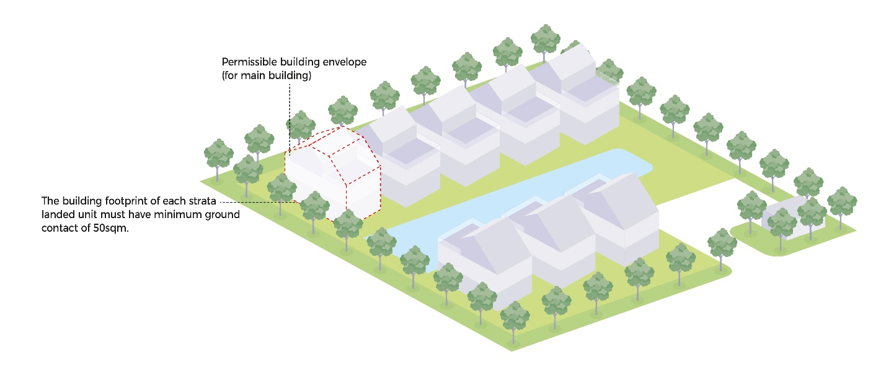

# Educational Institution

## **Advisory Notes**

The guidelines set out in this handbook for the various development
control parameters will generally be applied by URA in the consideration
of a development application. However, if the circumstances of a case or
the planning considerations relevant to a case so warrant, URA may in
its discretion decide to depart from these general guidelines. Persons
intending to carry out a development are advised to take this into
consideration in the conduct of their affairs and check with URA through
enquiries or development applications to confirm if their proposals can
be allowed.

The guidelines, principles and illustrations found in the handbook
series are not exhaustive in covering all possible site conditions and
building designs. In evaluating the development applications, URA
reserves the right to evaluate and impose conditions not covered in the
handbook in respond to the specific design of the development proposal
depending on merits.


## **Guidelines at a Glance: Educational Institution**

The table below is intended to provide an overview of the key guidelines
applicable for the development type. The full details of the guidelines
are stated in the relevant tabs of this handbook.

+----------------------+----------------------+----------------------+
| **All EI             |                      |                      |
| Developments**       |                      |                      |
+----------------------+----------------------+----------------------+
| **Parameter**        | **Guideline**        |                      |
+----------------------+----------------------+----------------------+
| Gross Plot Ratio     | **Location**         | **GPR**              |
+----------------------+----------------------+----------------------+
|                      | Within landed and    | Up to 1.0            |
|                      | low-density housing  |                      |
|                      | areas with GPR less  |                      |
|                      | than or equal to 1.4 |                      |
+----------------------+----------------------+----------------------+
|                      | At the fringe of     |                      |
|                      | landed and           |                      |
|                      | low-density housing  |                      |
|                      | areas with GPR less  |                      |
|                      | than or equal to 1.4 |                      |
+----------------------+----------------------+----------------------+
|                      | Within HDB estates   | Up to 1.4            |
|                      | and in areas with    |                      |
|                      | GPR more than 1.4    |                      |
+----------------------+----------------------+----------------------+
|                      | Within or at the     |                      |
|                      | fringe of industrial |                      |
|                      | estates              |                      |
+----------------------+----------------------+----------------------+
|                      | Within Central Area  | Subject to           |
|                      | and within other     | evaluation and       |
|                      | commercial centres,  | localised urban      |
|                      | including party-wall | design guidelines    |
|                      | developments such as |                      |
|                      | in Geylang area      |                      |
+----------------------+----------------------+----------------------+
| Bonus GFA            | Applicable Bonus GFA |                      |
|                      | scheme:              |                      |
|                      |                      |                      |
|                      | [ORAs within         |                      |
|                      | Privately-Owned      |                      |
|                      | Public Spaces]{.ul}  |                      |
+----------------------+----------------------+----------------------+
| Building Height      | **Location**         | **Storey Height**    |
+----------------------+----------------------+----------------------+
|                      | Within landed and    | Up to 2 or 3 storeys |
|                      | low-density housing  | based on the storey  |
|                      | areas with GPR less  | height control of    |
|                      | than or equal to 1.4 | the landed housing   |
|                      |                      | estate               |
+----------------------+----------------------+----------------------+
|                      | At the fringe of     | Up to 3 storeys      |
|                      | landed and           |                      |
|                      | low-density housing  |                      |
|                      | areas with GPR less  |                      |
|                      | than or equal to 1.4 |                      |
+----------------------+----------------------+----------------------+
|                      | Within HDB estates   | Up to 4 storeys      |
|                      | and in areas with    |                      |
|                      | GPR more than 1.4    |                      |
+----------------------+----------------------+----------------------+
|                      | Within or at the     |                      |
|                      | fringe of industrial |                      |
|                      | estates              |                      |
+----------------------+----------------------+----------------------+
|                      | Within Central Area  | Subject to           |
|                      | and within other     | evaluation and       |
|                      | commercial centres,  | localised urban      |
|                      | including party-wall | design guidelines    |
|                      | developments such as |                      |
|                      | in Geylang area      |                      |
+----------------------+----------------------+----------------------+
| Floor-to-Floor       | Maximum 5.0m         |                      |
| Height               |                      |                      |
+----------------------+----------------------+----------------------+
| Road Buffer          | Category 1 --        | 15m (5m green        |
|                      | Expressway           | buffer)              |
+----------------------+----------------------+----------------------+
|                      | Category 2 -- Major  | 7.5m (5m green       |
|                      | Arterial A           | buffer)              |
+----------------------+----------------------+----------------------+
|                      | Category 3 -- Major  | 5m (3m green buffer) |
|                      | Arterial B           |                      |
+----------------------+----------------------+----------------------+
|                      | Category 4 & 5 --    | 5m (3m green buffer) |
|                      | Other Major Roads,   |                      |
|                      | Minor Roads & Slip   |                      |
|                      | Roads                |                      |
+----------------------+----------------------+----------------------+
| Building Setback     | Minimum 4.5m         |                      |
|                      | (including 2m        |                      |
| from Boundary        | planting strip)      |                      |
|                      | along common         |                      |
|                      | boundaries with      |                      |
|                      | other developments   |                      |
+----------------------+----------------------+----------------------+
| Basements            | Basements with       |                      |
|                      | protrusions of up to |                      |
|                      | 1.0m:                |                      |
|                      |                      |                      |
|                      | -   shall comply     |                      |
|                      |     with the road    |                      |
|                      |     buffer and       |                      |
|                      |     building         |                      |
|                      |     setback.         |                      |
|                      |                      |                      |
|                      | -   any basement     |                      |
|                      |     protrusions of   |                      |
|                      |     more than 1.0m   |                      |
|                      |     above the ground |                      |
|                      |     level are        |                      |
|                      |     treated as a     |                      |
|                      |     storey.          |                      |
|                      |                      |                      |
|                      | Sunken basements may |                      |
|                      | be built up to the   |                      |
|                      | road reserve line    |                      |
|                      | and lot boundary     |                      |
|                      | provided:            |                      |
|                      |                      |                      |
|                      | -   the portion      |                      |
|                      |     underneath the   |                      |
|                      |     green buffer is  |                      |
|                      |     submerged at     |                      |
|                      |     least 2m or more |                      |
|                      |     below the ground |                      |
|                      |     level.           |                      |
|                      |                      |                      |
|                      | -   there are no     |                      |
|                      |     technical        |                      |
|                      |     requirements.    |                      |
|                      |                      |                      |
|                      | -   it does not      |                      |
|                      |     cause any        |                      |
|                      |     adverse impact   |                      |
|                      |     to the adjoining |                      |
|                      |     property.        |                      |
+----------------------+----------------------+----------------------+
| Special and Detailed | [Special and         | Developments within  |
| Control Plans        | Detailed Control     | special control      |
| ~~Control Areas~~    | Plans]{.ul}          | areas may be subject |
|                      |                      | to screening         |
|                      | [Special Control     | requirements (to be  |
|                      | Area                 | confirmed upon       |
|                      | 1](https             | submission of a      |
|                      | ://www.ura.gov.sg/-/ | proposed             |
|                      | media/Corporate/Guid | development)         |
|                      | elines/Development-c |                      |
|                      | ontrol/Others/SCA_1) |                      |
|                      |                      |                      |
|                      | [Special Control     |                      |
|                      | Area                 |                      |
|                      | 2](https             |                      |
|                      | ://www.ura.gov.sg/-/ |                      |
|                      | media/Corporate/Guid |                      |
|                      | elines/Development-c |                      |
|                      | ontrol/Others/SCA_2) |                      |
+----------------------+----------------------+----------------------+
| Street Block Plans   | Refer to section on  |                      |
|                      | *Street Block Plans* |                      |
+----------------------+----------------------+----------------------+
| Urban Design         | Urban Design         |                      |
| Requirements         | Requirements         |                      |
|                      | including activity   |                      |
|                      | generating uses may  |                      |
|                      | apply to             |                      |
|                      | developments within  |                      |
|                      | the Central Area and |                      |
|                      | Key Growth areas     |                      |
|                      | (such as Jurong      |                      |
|                      | Gateway, Paya Lebar  |                      |
|                      | Central, Punggol     |                      |
|                      | Digital District and |                      |
|                      | Woodlands Central).  |                      |
|                      |                      |                      |
|                      | Refer to URA's Urban |                      |
|                      | Design Website.      |                      |
+----------------------+----------------------+----------------------+
| Developments         | Refer to section on  |                      |
| involving            | *Developments        |                      |
| Waterbodies          | involving            |                      |
|                      | Waterbodies*         |                      |
+----------------------+----------------------+----------------------+
| Ancillary Structures | Refer to section on  |                      |
|                      | *Ancillary           |                      |
|                      | Structures* for      |                      |
|                      | detailed setback     |                      |
|                      | requirements based   |                      |
|                      | on the type of       |                      |
|                      | ancillary structure  |                      |
+----------------------+----------------------+----------------------+
| Parking              | The Land Transport   |                      |
|                      | Authority (LTA)      |                      |
|                      | prescribes parking   |                      |
|                      | standards and        |                      |
|                      | requirements.        |                      |
+----------------------+----------------------+----------------------+
| School Field &       | Primary/Secondary    |                      |
| Indoor Sports Hall   | Schools shall share  |                      |
| (ISH)                | their school fields  |                      |
|                      | and ISHs with the    |                      |
|                      | wider community. The |                      |
|                      | fields and ISHs      |                      |
|                      | shall meet the       |                      |
|                      | following            |                      |
|                      | requirements:        |                      |
|                      |                      |                      |
|                      | -   Separate and     |                      |
|                      |     independent      |                      |
|                      |     pedestrian       |                      |
|                      |     access to the    |                      |
|                      |     school field and |                      |
|                      |     ISHs shall be    |                      |
|                      |     provided.        |                      |
|                      |                      |                      |
|                      | -   Fields shall be  |                      |
|                      |     clearly          |                      |
|                      |     demarcated from  |                      |
|                      |     the main school  |                      |
|                      |     buildings so     |                      |
|                      |     that the field   |                      |
|                      |     could be fenced  |                      |
|                      |     up and opened to |                      |
|                      |     the community    |                      |
|                      |     outside of       |                      |
|                      |     school hours.    |                      |
|                      |                      |                      |
|                      | -   The field and    |                      |
|                      |     the ISH shall    |                      |
|                      |     both be          |                      |
|                      |     maintained by    |                      |
|                      |     the school.      |                      |
|                      |                      |                      |
|                      | The design and       |                      |
|                      | location of fields   |                      |
|                      | and ISHs shall       |                      |
|                      | minimise dis-amenity |                      |
|                      | arising from         |                      |
|                      | activities to the    |                      |
|                      | surrounding          |                      |
|                      | environment.         |                      |
+----------------------+----------------------+----------------------+
| Commercial Quantum   | For institutions of  |                      |
|                      | higher learning      |                      |
|                      | (universities,       |                      |
|                      | polytechnics), the   |                      |
|                      | maximum (upper       |                      |
|                      | bound) allowable     |                      |
|                      | commercial use is 5% |                      |
|                      | of the total         |                      |
|                      | proposed GFA or      |                      |
|                      | 30,000sqm, whichever |                      |
|                      | is lower.            |                      |
+----------------------+----------------------+----------------------+
| RC Flat Roofs        | RC flat roofs shall  |                      |
|                      | remain inaccessible  |                      |
|                      | except for           |                      |
|                      | maintenance purposes |                      |
|                      | only. Activating the |                      |
|                      | rooftop for uses     |                      |
|                      | such as roof         |                      |
|                      | terraces may be      |                      |
|                      | allowed depending on |                      |
|                      | the merits of the    |                      |
|                      | proposal. No         |                      |
|                      | structures shall be  |                      |
|                      | allowed unless       |                      |
|                      | otherwise approved   |                      |
|                      | by URA. Where        |                      |
|                      | allowed, structures  |                      |
|                      | (including any       |                      |
|                      | safety barriers)     |                      |
|                      | shall comply with    |                      |
|                      | height controls and  |                      |
|                      | the following        |                      |
|                      | guidelines.          |                      |
+----------------------+----------------------+----------------------+
|                      | **Communal           |                      |
|                      | Pavilions**          |                      |
|                      |                      |                      |
|                      | Communal pavilions   |                      |
|                      | shall be accessed    |                      |
|                      | from common areas    |                      |
|                      | only.                |                      |
|                      |                      |                      |
|                      | They shall be        |                      |
|                      | computed as GFA      |                      |
|                      | unless they meet the |                      |
|                      | following criteria:  |                      |
|                      |                      |                      |
|                      | -   Maximum 50sqm or |                      |
|                      |     50% of roof      |                      |
|                      |     coverage,        |                      |
|                      |     whichever is     |                      |
|                      |     lower;           |                      |
|                      |                      |                      |
|                      | -   For developments |                      |
|                      |     with storey      |                      |
|                      |     height control,  |                      |
|                      |     pavilions shall  |                      |
|                      |     be open-sided;   |                      |
|                      |                      |                      |
|                      | -   For developments |                      |
|                      |     without storey   |                      |
|                      |     height control,  |                      |
|                      |     maximum 50%      |                      |
|                      |     perimeter        |                      |
|                      |     enclosure of the |                      |
|                      |     pavilions may be |                      |
|                      |     allowed;         |                      |
|                      |                      |                      |
|                      | -   Communal         |                      |
|                      |     pavilions shall  |                      |
|                      |     be integrated    |                      |
|                      |     with lush        |                      |
|                      |     greenery. The    |                      |
|                      |     greenery on the  |                      |
|                      |     rooftop shall be |                      |
|                      |     both enjoyable   |                      |
|                      |     by the building  |                      |
|                      |     users and        |                      |
|                      |     visible from the |                      |
|                      |     surroundings;    |                      |
|                      |                      |                      |
|                      | -   Plants shall be  |                      |
|                      |     incorporated on  |                      |
|                      |     permanent and    |                      |
|                      |     preferably       |                      |
|                      |     sunken planting, |                      |
|                      |     planned with     |                      |
|                      |     sufficient soil  |                      |
|                      |     depth based on   |                      |
|                      |     the types of     |                      |
|                      |     plants proposed. |                      |
|                      |     Some space shall |                      |
|                      |     be set aside for |                      |
|                      |     the provision of |                      |
|                      |     communal         |                      |
|                      |     facilities and   |                      |
|                      |     furniture to     |                      |
|                      |     enhance the      |                      |
|                      |     rooftop.         |                      |
+----------------------+----------------------+----------------------+
|                      | **Solar Panels**     |                      |
|                      |                      |                      |
|                      | Planning permission  |                      |
|                      | is not required      |                      |
|                      | except in the        |                      |
|                      | following locations  |                      |
|                      | and contexts:        |                      |
|                      |                      |                      |
|                      | -   Site is subject  |                      |
|                      |     to urban design  |                      |
|                      |     guidelines or    |                      |
|                      |     located within   |                      |
|                      |     Conservation     |                      |
|                      |     Areas;           |                      |
|                      |                      |                      |
|                      | -   Elevated^1^      |                      |
|                      |     solar panels;    |                      |
|                      |                      |                      |
|                      | -   Spaces under     |                      |
|                      |     solar panels are |                      |
|                      |     enclosed or put  |                      |
|                      |     to commercial    |                      |
|                      |     use.             |                      |
|                      |                      |                      |
|                      | ^1^ A solar panel is |                      |
|                      | deemed to be         |                      |
|                      | elevated if it is    |                      |
|                      | raised more than 1m  |                      |
|                      | from the roof level  |                      |
|                      | for landed housing   |                      |
|                      | developments or 1.8m |                      |
|                      | from the roof level  |                      |
|                      | for other            |                      |
|                      | developments.        |                      |
+----------------------+----------------------+----------------------+
| Greenery             | Refer to section on  |                      |
|                      | *Greenery*           |                      |
+----------------------+----------------------+----------------------+
| Walking and Cycling  | Walking and Cycling  |                      |
| Plan                 | Plan submission is   |                      |
|                      | generally required   |                      |
|                      | for the following EI |                      |
|                      | developments. Refer  |                      |
|                      | to section on        |                      |
|                      | *Walking and Cycling |                      |
|                      | Plan*.               |                      |
+----------------------+----------------------+----------------------+
|                      | **Type of School**   | **Enrolment Size**   |
+----------------------+----------------------+----------------------+
|                      | Primary              | ≥ 1,500 students     |
|                      |                      | (single-session) or  |
|                      |                      |                      |
|                      |                      | ≥ 2,000 students     |
|                      |                      | (double-session)     |
+----------------------+----------------------+----------------------+
|                      | Secondary,           | ≥ 2,000 students     |
|                      | International &      |                      |
|                      | Junior College       |                      |
+----------------------+----------------------+----------------------+
|                      | ITE Campus,          | TIA Required         |
|                      | Polytechnic,         |                      |
|                      | University           |                      |
+----------------------+----------------------+----------------------+
| Earthworks           | -   Earthworks are   |                      |
|                      |     not allowed      |                      |
|                      |     within the       |                      |
|                      |     building setback |                      |
|                      |     area.            |                      |
|                      |                      |                      |
|                      | -   Earthworks       |                      |
|                      |     within the       |                      |
|                      |     build-able area  |                      |
|                      |     are subject to   |                      |
|                      |     evaluation. If   |                      |
|                      |     earthfill of     |                      |
|                      |     more than 1m is  |                      |
|                      |     allowed, the     |                      |
|                      |     overall          |                      |
|                      |     aggregate        |                      |
|                      |     building height  |                      |
|                      |     measured from    |                      |
|                      |     the allowable    |                      |
|                      |     platform level   |                      |
|                      |     shall comply     |                      |
|                      |     with the maximum |                      |
|                      |     allowable        |                      |
|                      |     building height  |                      |
|                      |     control.         |                      |
|                      |                      |                      |
|                      | ```{=html}           |                      |
|                      | <!-- -->             |                      |
|                      | ```                  |                      |
|                      | -   Earthfill        |                      |
|                      |     involving the    |                      |
|                      |     entire           |                      |
|                      |     development site |                      |
|                      |     may only be      |                      |
|                      |     considered if    |                      |
|                      |     the proposed     |                      |
|                      |     earthworks are   |                      |
|                      |     required to meet |                      |
|                      |     the Minimum      |                      |
|                      |     Platform Level   |                      |
|                      |     (MPL) stipulated |                      |
|                      |     by PUB.          |                      |
+----------------------+----------------------+----------------------+
| Retaining and        | Maximum allowable    |                      |
| Boundary Walls       | height for boundary  |                      |
|                      | walls is 1.8m.       |                      |
|                      |                      |                      |
|                      | Erection of          |                      |
|                      | retaining walls are  |                      |
|                      | subject to           |                      |
|                      | evaluation. If       |                      |
|                      | retaining walls are  |                      |
|                      | allowed:             |                      |
|                      |                      |                      |
|                      | -   the height shall |                      |
|                      |     be less than     |                      |
|                      |     1.5m;            |                      |
|                      |                      |                      |
|                      | -   retaining walls  |                      |
|                      |     higher than 1.5m |                      |
|                      |     may be           |                      |
|                      |     considered       |                      |
|                      |     depending on     |                      |
|                      |     site constraints |                      |
|                      |     and the need for |                      |
|                      |     extensive        |                      |
|                      |     excavation;      |                      |
|                      |                      |                      |
|                      | -   the total        |                      |
|                      |     visible height   |                      |
|                      |     of the solid     |                      |
|                      |     bo               |                      |
|                      | undary-cum-retaining |                      |
|                      |     wall shall not   |                      |
|                      |     exceed 2.8m, of  |                      |
|                      |     which the solid  |                      |
|                      |     boundary wall    |                      |
|                      |     shall not exceed |                      |
|                      |     1.8m.            |                      |
+----------------------+----------------------+----------------------+

  ------------------------------- ---------------------------------------------------------------------------------------------- -------------------
  **Special Education Schools**                                                                                                  
  **Parameter**                   **Guideline**                                                                                  
  Location                        Purpose-built special education schools are allowed on land zoned "Educational Institution".   
  Conversions                     Subject to evaluation depending on merits                                                      
  GPR                             Minimum 0.5                                                                                    
  Storey Height                   **Ambulatory Schools**                                                                         Maximum 4 storeys
                                  **Non-ambulatory Schools**                                                                     Maximum 2 storeys
  Floor-to-Floor Height           Maximum 5.0m                                                                                   
  ------------------------------- ---------------------------------------------------------------------------------------------- -------------------

+-----------------------+---------------------------------------------+
| **Students' Hostels** |                                             |
+-----------------------+---------------------------------------------+
| **Parameter**         | **Guideline**                               |
+-----------------------+---------------------------------------------+
| Location              | -   May be allowed on sites zoned           |
|                       |     Educational Institution,                |
|                       |     Commercial/Residential, and Residential |
|                       |     with 1^st^ Storey Commercial            |
|                       |                                             |
|                       | -   May either be ancillary to the          |
|                       |     educational institution development,    |
|                       |     for eg as a separate dormitory building |
|                       |     that serves students/staff of the       |
|                       |     school or independent developments      |
|                       |                                             |
|                       | -   May be allowed on land zoned            |
|                       |     Residential provided:                   |
|                       |                                             |
|                       | ```{=html}                                  |
|                       | <!-- -->                                    |
|                       | ```                                         |
|                       | -   The site shall not be located in        |
|                       |     estates safeguarded for landed housing  |
|                       |     only (eg Good Class Bungalow Areas);    |
|                       |                                             |
|                       | -   The site shall be located at the fringe |
|                       |     of non-landed residential estates and   |
|                       |     in street blocks which already have     |
|                       |     non-residential uses;                   |
|                       |                                             |
|                       | -   The site shall be fronting a category 2 |
|                       |     or 3 road; and                          |
|                       |                                             |
|                       | -   The amenity of the surrounding areas    |
|                       |     shall not adversely affected.           |
+-----------------------+---------------------------------------------+
| Conversions           | -   May be allowed on an en-bloc or         |
|                       |     'per-floor' basis                       |
|                       |                                             |
|                       | -   Conversions on a per-floor basis:       |
|                       |                                             |
|                       | ```{=html}                                  |
|                       | <!-- -->                                    |
|                       | ```                                         |
|                       | -   May be considered only under a single   |
|                       |     Temporary Permission (TP)               |
|                       |                                             |
|                       | -   Shall be located below existing         |
|                       |     residential floors                      |
|                       |                                             |
|                       | ```{=html}                                  |
|                       | <!-- -->                                    |
|                       | ```                                         |
|                       | -   All owners shall sign a Letter of       |
|                       |     Undertaking (LOU), indicating that the  |
|                       |     hostel will be run by a single          |
|                       |     operator.                               |
+-----------------------+---------------------------------------------+

**\
**

## **Introduction**

Educational Institutions comprise educational facilities like
kindergartens, primary/secondary schools, polytechnics, junior colleges,
institutes of technical education, training institutes, universities,
foreign and special schools (eg school for the disabled). They are
primarily for educational purposes and are zoned "Educational
Institution" (EI) in the Master Plan.

For planning purposes, dancing schools, computer schools, tuition
centres are treated as commercial schools. As such, they are zoned
"Commercial" in the Master Plan. Commercial schools and tuition centres
are therefore not allowed in EI zone.

The planning parameters and guidelines here are applicable to all EI
developments except for special education schools which have different
requirements given the nature of the use. The detailed parameters for
special schools are under the tab [Special Education
Schools](https://intranet.ura.gov.sg/Corporate/Guidelines/Development-Control/Non-Residential/EI/Special-Education-Schools).


## **Special Education Schools**

Special education schools provide training for the disabled aged 1 -- 18
years old. Special education schools may be classified as:

-   **Ambulatory**: these schools are for the mentally challenged,
    > visually handicapped, and the hearing impaired.

-   **Non-ambulatory**: these schools are for the orthopaedic impaired
    > or multi-handicaps.

## **Conversions to Special Education Schools**

Conversions of properties to special education schools are evaluated
depending on merits. Purpose-built special education schools are allowed
on land zoned "Educational Institution".

All parameters and considerations applicable to other EI developments
shall apply to special education schools except for those listed below.

## **Gross Plot Ratio & Building Height**


*Building Height*

The allowable GPR for special education schools is 0.5 (minimum).

The allowable number of storeys for ambulatory schools is 4 (maximum).
The allowable number of storeys for non-ambulatory schools is 2
(maximum).

The actual number of storeys allowed may vary, depending on the site
topography and the context of the surrounding area.

The allowable floor-to-floor height for special education schools is
5.0m (maximum).

For mixed ambulatory and non-ambulatory school, the non-ambulatory
facilities shall be sited on the lower floors to facilitate easier
movements for the students.


## **Students' Hostels**

A students' hostel or dormitory is used for lodging by students
unrelated by blood, marriage, adoption or legal guardianship. The
premises are considered as students' hostel if:

-   The total number of students staying in the premises exceed 6
    > students; and

-   The premises is for accommodation facilities for full time students
    > studying in the local primary schools, secondary schools, junior
    > colleges and tertiary institutions.

Students' hostels may either be ancillary to the EI development, for eg
as a separate dormitory building that serves students/staff of the
school or independent developments.

## **Location**

Students' hostel developments may be allowed on sites zoned Educational
Institution, Commercial/Residential and Residential with 1^st^ storey
Commercial.

Independent students' hostel developments may also be allowed on sites
zoned Residential provided that:

-   The site shall not be located in estates safeguarded for landed
    > housing only (eg Good Class Bungalow Areas);

-   The site shall be located at the fringe of non-landed residential
    > estates and in street blocks which already have non-residential
    > uses;

-   The site shall be fronting a category 2 or 3 road; and

-   The amenity of the surrounding areas shall not adversely affected.

## **Conversions of Existing Flats to Students' Hostel**

Conversion of existing flats to students' hostel may be either on an
en-bloc or a 'per floor' basis. Conversion on a 'per floor' basis (ie
all the flat units on the same floor sharing a common staircase or lift
access) may be considered only under a single Temporary Permission (TP)
regardless of the number of owners involved, provided that it does not
result in dis-amenity to other residents.

The students' hostel shall be located below existing residential floors
to minimize potential inconveniences and disturbances to the residents.

All owners shall submit a Letter of Undertaking (LOU) that the students'
hostel will be run by a single operator. For conversions on a per floor
basis, all owners on the floor are to sign the LOU. A fresh LOU shall be
submitted for subsequent renewals of the TP.


## **Gross Plot Ratio & Building Height**


*Building Height*

## **Gross Plot Ratio and Storey Height**

The allowable Gross Plot Ratio (GPR) and number of storeys for the EI
shall take into account the character of the surrounding area. As a
guide, depending on the allowable GPR, the corresponding number of
storeys are shown in the table below. The actual number of storeys
allowed may vary, or be higher, depending on the site topography, site
condition and the context of the surrounding area. The allowable
parameters for the different EI locations are shown in the table below.
Basement storeys that protrude more than 1.0m above ground level on any
side shall be counted as a storey.

For redevelopment of an existing approved EI or to carry out major
extensions to it, the proposed increase in GPR or GFA is subject to
planning consideration taking into account the location of the EI,
context of the surrounding area and requirements of other government
agencies. Planning approval from URA shall be obtained first before
commencement of works.

## **Allowable Gross Plot Ratio and Storey Height**

  **Location**                                                                                                         **Gross Plot Ratio Control**                                  **Guide for Storey Height**
  -------------------------------------------------------------------------------------------------------------------- ------------------------------------------------------------- --------------------------------------------------------------------------------------
  Within landed and low-density housing areas with GPR less than or equal to 1.4                                       Up to 1.0                                                     Up to 2 or 3 storeys based on the storey-height control of the landed housing estate
  At the fringe of landed and low-density housing areas with GPR less than or equal to 1.4                                                                                           Up to 3 storeys
  Within HDB estates and in areas with GPR more than 1.4                                                               Up to 1.4                                                     Up to 4 storeys
  Within or at the fringe of industrial estates                                                                                                                                      
  Within Central Area and within other commercial centres, including party-wall developments such as in Geylang area   Subject to evaluation and localised urban design guidelines   

## **Overall Building Height**

Unless otherwise stated, the overall building height^1^ of EI
developments is subject to compliance with the technical height
controls of the relevant agencies such as Civil Aviation Authority of
Singapore (CAAS) and the Defence Science and Technology Agency (DSTA).
~~These agencies require the building height to be given in m
AMSL (metres above Mean Sea Level).~~

^1^ ~~Submissions to other agencies may require the building height
based on the Singapore Height Datum (SHD). The SHD may be a positive or
negative value and it may be supplemented with a \"+\" or \"-\" sign for
clarity.~~ Building height is based on Singapore Height Datum (SHD).

## **Floor-to-Floor Height**

The maximum floor-to-floor height of EI developments is 5.0m.

## **Additional Height for Predominant Sky Terrace Storey**


*Additional Height for Predominant Sky Terrace Storeys*

Predominant Sky Terrace Storeys (PSTS) are floors where the sky terrace
areas within the 45-degree line occupy at least 60% of the floor plate.

If the proposed number of storeys in the development is more than 7
storeys, EI developments with PSTS may be allowed additional building
height depending on the number of storeys proposed as shown in the table
below:

## **Additional Building Height based on Proposed Storey Height**

  **Proposed Storey Height of Development**   **Additional Building Height Allowed**
  ------------------------------------------- ----------------------------------------
  7 - 20                                      10.0m
  21 - 30                                     15.0m
  31 - 40                                     20.0m
  41 - 50                                     25.0m
  More than 50                                30.0m

The additional building height may only be distributed to the sky
terrace floors within the development. Spaces for M&E services located
directly beneath the sky terrace floor may be included in the additional
height.

The overall building height is subject to technical height controls.

The additional building height shall not apply to:

-   Developments within Conservation Areas and sites with National
    > Monuments;

-   Developments with height control of 6 storeys or less; or

-   Developments with special controls e.g. areas with street block
    > plans~~/security screening areas~~.


In addition to (a) -- (c), any additional building height will be
subject to evaluation for developments adjacent to conserved buildings
or in [urban design
areas](https://www.ura.gov.sg/Corporate/Guidelines/Urban-Design) with
site-specific height considerations.

## **Bonus GFA Incentive Schemes**

The Bonus GFA scheme applicable to Educational Institution is:

## **ORA within Privately-Owned Public Spaces (POPS)**

Refer to section on POPS.

## **Building Setback from Boundary**


*Setback Requirements*

All EI developments shall be sufficiently set back from the road and
common boundary. The setback distance is measured from the road
reserve^1^ line or boundary line to the external wall of the buildings,
excluding land to be vested to the State for road or drainage or public
purpose.

All EI developments fronting a public road shall provide a road buffer,
the width of which depends on the hierarchy of the road. A green buffer
shall be set aside in the road buffer depending on the width of the road
buffer.

The buffer requirements for the Road Categories 1 to 5 are in Table 1
below. The common boundary setback requirements are in Table 2 below.
Different setback requirements may apply for sites within the Geylang
area or the Central Area, both of which are guided by Urban Design
guidelines.

^1^ **Road Reserve**: The plot of land to be vested in the State as
required under the Street Works Act. It is demarcated by the line of
Road Reserve in the Road Line Plan and the site boundary.

## **Table 1: Road Buffer, Green Buffer**

  -----------------------------------------------------------------------------------------------
  **Road Category**   **Storey Height**     **Road Buffer\
                                            (inclusive of Green Buffer indicated in brackets)**
  ------------------- --------------------- -----------------------------------------------------
  Category 1          6 storeys and above   30m\
                                            (5m)

                      Up to 5 storeys       24m\
                                            (5m)

  Category 2          6 storeys and above   15m\
                                            (5m)

                      Up to 5 storeys       12m\
                                            (5m)

  Category 3          6 storeys and above   10m\
                                            (3m)

                      Up to 5 storeys       7.5m\
                                            (3m)

  Category 4 & 5      \-                    7.5m\
                                            (3m)
  -----------------------------------------------------------------------------------------------

## **Table 2: Common Boundary Setback & Planting Strip**

  ----------------------------------------------------------------------------
  **Type of Boundary**                      **Building Setback Requirement**
  ----------------------------------------- ----------------------------------
  Common boundary with other developments   Minimum 4.5m\
                                            (including 2m planting strip)

  ----------------------------------------------------------------------------

## **Table 3: Setback for Building Appendages**

  **Building Feature**                             **Within Road Buffer**                                **Within Setback from Common Boundaries**
  ------------------------------------------------ ----------------------------------------------------- ------------------------------------------------------------
  Roof eaves                                       Allowed, provided it is not within the green buffer   Allowed, provided it is not within the 2.0m planting strip
  Sun-shading devices & RC ledges (cantilevered)                                                         


## **Basements**

A basement storey refers to a storey of a building which may be
partially or wholly below the existing ground level. In so far as storey
height control is concerned, basement storeys that protrude more than
1.0m above ground level on any side shall be counted as a storey.


*Basement Setback and Vertical Openings*

The physical limit for which the basement may be built up to is shown in
the table below.

## **Basement Setback**

+----------------------+----------------------+----------------------+
| **Type of Basement** | **Setback from Road  | **Setback from Other |
|                      | Reserve Line**       | Boundaries**         |
+======================+======================+======================+
| Basement with        | Up to the road       | Up to the building   |
| protrusion           | buffer               | setback              |
+----------------------+----------------------+----------------------+
| Sunken basement      | Up to the road       | Up to the site lot   |
|                      | reserve^1^ line,     | boundary, provided:  |
|                      | provided the portion |                      |
|                      | underneath the green | -   the portion      |
|                      | buffer is submerged  |     > underneath the |
|                      | at least 2m or more  |     > 2m tree        |
|                      | below the ground     |     > planting strip |
|                      | level                |     > is submerged   |
|                      |                      |     > at least 2m or |
|                      |                      |     > more below the |
|                      |                      |     > ground level;  |
|                      |                      |                      |
|                      |                      | -   there are no     |
|                      |                      |     > technical      |
|                      |                      |     > requirements   |
|                      |                      |     > (eg sewerage,  |
|                      |                      |     > drainage) and  |
|                      |                      |     > the basement   |
|                      |                      |     > does not cause |
|                      |                      |     > any adverse    |
|                      |                      |     > impact to the  |
|                      |                      |     > adjoining      |
|                      |                      |     > property;      |
|                      |                      |                      |
|                      |                      | -   the side of a    |
|                      |                      |     > basement wall  |
|                      |                      |     > abutting any   |
|                      |                      |     > site boundary  |
|                      |                      |     > shall not have |
|                      |                      |     > any openings   |
|                      |                      |     > into the       |
|                      |                      |     > adjoining      |
|                      |                      |     > site.          |
+----------------------+----------------------+----------------------+

^1^ **Road Reserve**: The plot of land to be vested in the State as
required under the Street Works Act. It is demarcated by the line of
Road Reserve in the Road Line Plan and the site boundary.

Basements with vertical openings on the side walls may be allowed only
if they are required for natural ventilation and to meet the building
regulations. The guidelines are as follows:

-   While the protrusion measured from the level at the site boundary
    > shall not exceed 1.0m, basements may be exposed up to 2.0 m from
    > the point where the platform level meets the basement wall (ie the
    > earth around the basement wall may be cut to slope down to achieve
    > the 2.0m basement exposure with openings).

-   The extent of the slope within the green buffer or planting strip
    > shall have a gradient of 1:2.5.

-   Vertical cutting of the earth resulting in a trench around the
    > basement is not allowed.

-   The extent of the vertical openings or the types of cover over the
    > vertical openings shall be subject to the requirements of the
    > other technical departments.

-   Horizontal openings to the basement are allowed within the setback
    > distance outside the green buffer and planting strip, subject to
    > provision of effective screening to hide the view to the basement.


*Basement Horizontal Openings*


## **Special and Detailed Control Plans ~~Control Areas~~**

Special and Detailed Control Plans (SDCP) provide detailed guidelines
for specific areas. The SDCPs may be viewed here.

## **Special Control Areas**

The following areas may be subject to security requirements. URA will
confirm this upon submission of a proposed development.


*Special Control Area 1*


*Special Control Area 2*

Qualified Persons (QPs) should consider the screening requirements in
the early stage of their planning and design to avoid abortive work
subsequently.

Where security screening is deemed necessary, it shall consist of
permanent fixtures that are difficult, if not impossible to remove. The
following screening measures may be considered:

## **Visual Screening**

Residential units and common areas may be screened where necessary with
blank walls, external concrete/metal fins, or the building may be
re-orientated such that the windows^1^/openings/balconies do not have
direct view towards the protected area.

^1^ **Window**: Raised openings that are at least 0.9m above the floor
slab. They are intended to provide ventilation and lighting, and not for
access. Full height windows and windows that are lower than 0.9m that
can potentially be used as access points will need to be highlighted in
the submission plans for URA's evaluation and approval.

## **Roof Screening**

The parapet wall at the rooftop shall be at least 3m high and access to
the rooftop from a public area shall be secured by a lockable
door/hatch. The door/hatch may be electronically linked to an alarm
system monitored by the building management, if available.


## **Street Block Plans**

Street block plans guide the detailed setback, storey height and
building height, for the following locations. Click on the reference
links to view the detailed street block plan.

  **Street Block**
  ---------------------------------------------------------------------------------------------------------------------------------------------------------------------------------------------------
  [Geylang Road, Sims Avenue, & Guillemard Road, bounded by Sims Way and Paya Lebar Road](https://intranet.ura.gov.sg/-/media/Corporate/Guidelines/Development-control/Street-Block-Plans/GUDG.pdf)


## **Urban Design Requirements**

Guidelines on Urban Design (UD) intentions are to preserve and enhance
the urban character of the different planning areas. They help to ensure
that developments integrate well with their surrounding urban
environment.

Developments in Central Area and Key Growth areas (such as Jurong
Gateway, Paya Lebar Central, Punggol Digital District and Woodlands
Central), may be guided by specific [urban design
requirements](https://www.ura.gov.sg/Corporate/Guidelines/Urban-Design),
where the planning intention is to introduce activity generating uses.
These urban design requirements shall take precedence over the standard
development control parameters.

Refer to [URA SPACE](http://www.ura.gov.sg/maps/) for the Urban Design
Guidelines Plan and designated AGU areas.

## **Activity Generating Uses (AGUs)**

AGUs help to activate and enliven streets; contributing to its vibrancy,
providing key basic amenities, and attracting visitor-ship to the
precincts. The following situations may require AGUs:

a.  Urban Design Areas shown in the Special and Detailed Control Plan
    (SDCP) Street Block and Urban Design Plan;

b.  Government Land Sale (GLS) sites where AGUs are required as part of
    the Technical Conditions of Tender;

c.  Sites that undergo redevelopment or major A&A works and where AGUs
    are required as part of the planning conditions issued for these
    works;

d.  Other areas as directed and specified by the Competent Authority.

AGUs may be required to be provided in the following typical locations:

a.  1^st^ storey of developments fronting key streets, pedestrian malls,
    through block links, and public spaces;

b.  Alongside underground pedestrian links (UPLs) at the basement levels
    of the developments;

c.  Alongside elevated pedestrian links (EPLs) at the 2^nd^ storey of
    the developments.

The proposed AGUs in the above locations are to be assessed
contextually, taking into account the planning intention for the area
and potential amenity problems that will impact on the surrounding
developments. Uses not allowed are those that do not directly contribute
to street vibrancy and/or can potentially cause amenity problems to
neighbours.

[Example of uses that may be considered as Activity Generating Uses
(AGUs) are:]{.ul}

-   Shop

-   Showroom/ galleries

-   Restaurant

-   Restaurant and Bar\* \[\*The restaurant shall operate throughout the
    > day till reasonable mealtimes at night\]

-   Pet shop/pet grooming

-   Banks, adjoining or independent ATM clusters

-   Commercial school

-   Childcare centre/kindergarten

-   Gym/fitness centre

-   Visitor Centre/ museum

-   Hotel/ Backpackers' hostel

[The following uses are not AGUs:]{.ul}

-   Office

-   Bar

-   Nightclub

-   Massage establishment

-   LAN gaming centre

**\
**

## **Developments Involving Waterbodies**

To maintain the integrity and aesthetics of the waterfront areas so that
the public can have free and unrestricted access to enjoy these spaces,
developments at major waterbodies^1^ shall observe the design and
development application submission guidelines below.

^1^ Major waterbodies: rivers, canals of at least 17.5m width,
reservoirs, and seas.




*Developments at Major Waterbodies*

## **Design Guidelines**

1.  **Retaining Walls**

> Retaining walls along the waterbodies may be allowed subject to the
> following criteria:

a.  Retaining walls are less than 1.5m in height;

b.  Retaining walls are set back at least 300mm from the boundary;

c.  Retaining walls are covered with creepers.

```{=html}
<!-- -->
```
2.  **Boundary Walls/Fences**

> For non-industrial developments, proposed boundary fences shall be
> porous (eg chained-link, metal-grille, or timber fence).
>
> For industrial developments, the following may be allowed:

a.  Solid boundary walls not exceeding 1.8m in height. The walls shall
    > be aesthetically treated.

b.  Chain-linked fences not exceeding 1.8m in height with close planting
    > of shrubs/vegetation as screenings. A planting strip of 0.5m width
    > (minimum) shall be provided within the development.

```{=html}
<!-- -->
```
3.  **Slope**

> There shall be no abrupt change in slope gradient at the boundary
> between the development and the waterbody. The slope gradient shall
> not exceed 1:2.

4.  **Conservation of Vegetation**

> Mature vegetation along the waterbodies are to be saved and conserved,
> wherever possible.

## **Development Application Submission Guidelines**

In all waterbodies-related development application submissions to URA,
the following shall be provided, where applicable:

-   Site/Location Plan showing the width and alignment of Drainage
    > Reserve^2^/Waterbody/Coastal Profile;

-   Layout plans and cross-sections showing the area between the site
    > and the Drainage Reserve/Waterbody/Coastal Area including existing
    > and proposed ground levels;

-   Design details of integration with waterbody including slope,
    > retaining wall, and boundary wall/fencing (Height, Type,
    > Screening);

-   Contour lines extending to 1m beyond the side of development
    > fronting the Drainage Reserve/Waterbody/Sea;

-   [Checklist](https://intranet.ura.gov.sg/Corporate/Guidelines/Development-Control/Non-Residential/EI/-/media/1A4AADDAB0B54182A8299F543A0F3C97.ashx) for
    > Waterbodies-related proposals.

^2^ **Drainage Reserve (DR)**: An area safeguarded for purposes of
building or widening a public drain

## **Application of Guidelines**

The design guidelines listed above shall apply to all developments
adjacent to or with waterbodies except developments adjacent to or with
Drainage Reserves less than 17.5m.

All proposals involving waterbodies shall comply with the development
application submission guidelines listed above.

**Additional Guidelines for Use of Foreshore by Developments with a
Frontage to the Sea**

For land use planning and development control purposes, the
foreshore^3^ and the area within 15m on both the landward and seaward
side of the foreshore line^4^ shall be kept free of structures. Some
structures such as ramps may be permitted if they are constructed in
connection with an approved development (eg marine industries,
refineries, and pleasure-boat storage complex). These structures are
subject to planning evaluation depending on merits.

^3^ The area between the high water mark of the Spring Tide or the top
of the seawall and the low water mark of the Spring Tide.


^4^ The high water mark of the Spring Tide; the top of the existing
seawall or revertment or river wall (where appropriate) for controlling
landward development.


## **Ancillary Structures**


*Setback Requirements for Ancillary Structures*

Ancillary structures are minor structures erected to support the main
use of the site. The building setback distance and height control for
ancillary structures are shown in the table below.

Ancillary structures located within the green buffer may be assessed in
accordance with NPARKS\' guidelines --
see [here](https://www.nparks.gov.sg/partner-us/development-plan-submission/guidelines-on-greenery-provision-and-tree-conservation-for-developments).

Ancillary structures located within the physical buffer and building
setback that exceed the requirements in the table below, but are below
6m in height, shall be evaluated depending on the merits of the design
and function.

## **Setback and Height Control for Ancillary Structures**

  ---------------------------------------------------------------------------------------------------------------------------------------------------------------------------------------------------------------------
  **Type of Ancillary Structures**   **Required Setback from the Road**                                                                           **Required Setback from the Other Boundaries**   **Height Control**
  ---------------------------------- ------------------------------------------------------------------------------------------------------------ ------------------------------------------------ --------------------
  Electrical Substation              5m from Category 1 and 2 roads\                                                                              2m                                               6m
                                     \                                                                                                                                                             
                                     3m from Category 3 -- 5 roads                                                                                                                                 

  Sunken Swimming Pool                                                                                                                                                                             Not applicable

  Raised Swimming Pool               Follow road buffer standards                                                                                                                                  

  Water Tank & Pump                                                                                                                                                                                

  Meter Compartment                  Subject to evaluation                                                                                        1.8m if located within the green buffer          

  Bin Point                                                                                                                                                                                        

  Guardhouse                                                                                                                                      2.6m if located within the green buffer          

  Generator Set                      Subject to evaluation\                                                                                                                                        
                                     Adequate setback may have to be provided to minimise glare and noise disturbance to adjoining developments                                                    

  Tennis Court                                                                                                                                                                                     
  ---------------------------------------------------------------------------------------------------------------------------------------------------------------------------------------------------------------------


## **Parking**

LTA prescribes the parking provision standards and requirements for
motor vehicles and bicycles. The requirements are usually based on the
quantum of the gross floor area or the number of units of the
development uses.

## **Car and Motor-Cycle Parking**

Under LTA's Range-based Parking Provision Standards (RPPS), developments
are subject to car and motor-cycle^1^ parking provision requirements.

Unless explicitly approved as private parking lots in the approved
plans, all car and motor-cycle parking lots shall be treated as common
property.

^1^ Motor-cycle parking provision is mandatory in all non-residential
developments.

## **Range-based Car Parking Standards (RPPS)**

The RPPS allows developments to provide any level of car and motor-cycle
parking provision within a specified range, defined by a lower bound and
an upper bound -- see figure below. The range varies according to
location zones and land uses. Details may be found in [LTA's Code of
Practice for Vehicle Parking Provision in
Developments](https://www.lta.gov.sg/content/ltaweb/en/industry-matters/development-and-building-and-construction-and-utility-works/vehicle-parking.html).


*Range-based Parking Provision Standards*

New EI developments shall be subject to a process of waiver evaluation
by LTA, if one wishes to provide surplus car and motor-cycle parking
lots, ie parking provision above the upper bound based on the new RPPS.


## **School Field / Indoor Sports Hall (ISH)**


*School Field and Indoor Sports Hall*

Primary/Secondary Schools shall share their school fields and ISHs with
the wider community. Separate and independent pedestrian access to the
school field and ISHs shall be provided in addition to the normal
vehicular and pedestrian access for the school.

For fields, there shall be a clear demarcation from the main school
buildings so that the field could be fenced up and opened to the
community outside of school hours. The field and the ISH shall both be
maintained by the school.

In the design and location of fields and ISHs, the surrounding
environment shall be taken into consideration to minimize dis-amenity
arising from activities.


## **Commercial Quantum**

For institutions of higher learning (universities, polytechnics) such as
SIM, NAFA, LASALLE and INSEAD, the maximum (upper bound) allowable
commercial use is 5% of the total proposed GFA or 30,000sqm, whichever
is lower.

Examples of commercial uses within EI developments include food courts,
restaurants, cafes, book & stationery shops, hair salons, minimarts,
banks, travel agencies, medical clinics, student-run businesses.


## **RC Flat Roofs**

RC flat roofs shall remain inaccessible except for maintenance purposes
only^1^. Activating the rooftop for uses such as roof terraces and
landscaped gardens may be allowed depending on the merits of the
proposal. No structures shall be allowed unless otherwise approved by
URA. Where allowed, structures (including any safety barriers) shall
comply with height controls^2^ and the following guidelines.

^1 ^RC flat roofs that are accessible via ladders for maintenance
purposes only are subject to agencies' requirements for safety barriers
to ensure the safety of maintenance personnel. Safety barriers shall not
exceed 1m in height.

^2^ Height controls applicable, include:

-   Absolute technical height constraints^@^ (e.g. Aviation paths
    restrictions, military and telecommunications installations).

-   Conservation guidelines (available at [URA
    SPACE](https://www.ura.gov.sg/maps/?service=STB))

-   Urban design height controls (available at [URA
    SPACE](https://www.ura.gov.sg/maps/?service=STB))

^@^ The absolute technical height (Based on Singapore Height Datum
\[SHD\]) shall take precedence if it is stricter than any of the other
height controls.

## **Communal Pavilions**

Communal pavilions are small-scale, ancillary landscaping features that
function as sheltered, open-sided resting points. Access to communal
pavilions shall be from common areas only. The pavilions shall be
computed as GFA unless they meet the following criteria:

-   Maximum 50sqm^1^ or 50% of roof coverage, whichever is lower.

-   For developments which have reached the allowable storey height
    > control, the pavilions shall remain open-sided when viewed
    > externally. This is to ensure that the pavilions do not form an
    > additional storey.

-   For developments which have not reached the allowable storey height
    > or are not located within areas subject to storey height control,
    > maximum 50% perimeter enclosure of the rooftop pavilions may be
    > allowed.

-   Communal pavilions shall be integrated with lush greenery. The
    > greenery on the rooftop shall be both enjoyable by the building
    > users and visible from the surroundings.

-   Plants shall be incorporated on permanent and preferably sunken
    > planting, planned with sufficient soil depth based on the types of
    > plants proposed. Some space shall be set aside for the provision
    > of communal facilities and furniture to enhance the rooftop.

-   A Landscape Plan and relevant sections for ground/rooftop spaces
    > containing communal pavilions, showing the proposed landscaping
    > scheme, pavilion dimensions, planting palette, soil depth,
    > communal facilities, shall be submitted with the Development
    > Application.

^1^ The area is defined as the area of pavilion measured up to the roof
eaves line.

## **Solar Panels**

The installation of solar panels on RC flat roofs may be considered if
they meet the following criteria:

a.  Solar panels are installed between 10 to 15 degrees relative to the
    > horizontal plane to optimise the performance of solar panels and
    > minimise glare to the buildings in the vicinity; and

b.  The installation of solar panels shall not result in the removal of
    > any greenery approved under the Landscaping for Urban Spaces and
    > High-Rises (LUSH) Programme.

Installation of solar panels and M&E equipment such as inverters for the
solar panel system does not require planning permission except in
locations and contexts described below.

## **Planning Permission**

a.  **Areas subject to urban design guidelines and Conservation
    > Areas^2^ shall require planning permission due to their impact on
    > the roofscape. **

> ^2^ For Conservation Areas, installation of solar panels without any
> additional works are treated as localised works for the purpose of
> repair and maintenance and are considered Category 3 works for
> Conserved Buildings. Applications for such Category 3 works can be
> made by owners and contractors. Refer to the Conservation
> Guidelines [here](https://intranet.ura.gov.sg/Corporate/Guidelines/Development-Control/Non-Residential/EI/~/link.aspx?_id=6F28BA0B83114572ACA7DC1DFB84DBAC&_z=z) and
> information on submission
> procedure [here](https://intranet.ura.gov.sg/Corporate/Guidelines/Development-Control/Non-Residential/EI/~/link.aspx?_id=C2CDF8FDF76E401086C69F6F63B875B5&_z=z).

b.  **Elevated solar panels^3^ located in developments on the following
    > land use zones shall require planning permission:**

+----------------------------------+----------------------------------+
| -   Residential (landed housing, | -   White                        |
|     > flats and condominium      |                                  |
|     > housing developments)      | -   Residential / Institution    |
|                                  |                                  |
| -   Residential with Commercial  | -   Commercial / Institution     |
|     > at 1^st^Storey             |                                  |
|                                  | -   Educational Institution      |
| -   Mixed Commercial &           |                                  |
|     > Residential                | -   Place of Worship             |
|                                  |                                  |
| -   Commercial                   | -   Civic & Community            |
|                                  |     > Institution                |
| -   Hotel                        |                                  |
+----------------------------------+----------------------------------+

> ^3^ A solar panel is deemed to be elevated if it is raised more than
> 1m from the roof level for landed housing developments or 1.8m from
> the roof level for other developments.

c.  **Spaces under solar panels are enclosed or put to commercial use **

> Planning permission shall be required if the spaces under elevated or
> non-elevated solar panels are enclosed or put to commercial uses such
> as Outdoor Refreshment Areas. In such instances, the spaces shall be
> computed as GFA.

## **Assessment of Storey Height**

Elevated solar panels that require planning permission may be assessed
as an additional storey for storey height control purposes unless they
comply with the guidelines below:

## **Guidelines for Elevated Solar Panels**

  **Parameter**   **Guidelines**
  --------------- ---------------------------------------------------------------------
  Extent          Within the 45-degree line from the springing line of the roof level
  Height          Maximum 5m above roof level


*Extent and Height of Elevated Solar Panels*


## **Greenery**

## **Landscaping for Urban Spaces and High-Rises (LUSH)**

LUSH is a comprehensive urban and skyrise greening programme comprising
both Landscape Replacement Areas (LRA) requirements and incentives to
provide greenery and communal spaces.

The LRA requirements are calibrated by location, GPR and development
type. A development may count Sky Terraces, Communal Planter Boxes and
Covered Communal Ground Gardens (see Greenery sub-tabs) amongst other
features, towards meeting the LRA requirement.

{width="6.496062992125984in"
height="3.766053149606299in"}

*Landscape Replacement Areas (View high-res illustration [here](https://intranet.ura.gov.sg/Corporate/Guidelines/Development-Control/Non-Residential/EI/-/media/7903FD6591D648699A84200153F7765F.ashx))*

## **Landscape Replacement Areas (LRA) Guidelines in Strategic Areas**

Developments in identified **Strategic Areas** shall provide LRA that is
minimally equivalent to the development's gross site area, as shown in
the table and diagram below. At least 40% of the LRA requirement shall
be reserved for softscape (permanent planting) areas. The remaining LRA
requirement may be provided as hardscape.

The Green Plot Ratio (GnPR) provides an objective measure of the density
of greenery within a site. The formula for computing GnPR and the
minimum GnPR requirement is as follows:


The Total Leaf Area shall be computed based on the Leaf Area Index (LAI)
for each plant species, canopy area (for trees and palms) and the
quantity planted. The plant species sub-categories and LAI values may be
obtained online from NParks' [Flora Fauna Web](http://florafaunaweb.nparks.gov.sg/) by searching the common or scientific names of plants.

## **LRA Requirements for Developments in Strategic Areas**

+----------------------+----------------------+----------------------+
| **Location**         | **Developments in    | **Developments in    |
|                      | Strategic Areas**    | Strategic Areas      |
|                      |                      | Outside Central      |
|                      |                      | Area, with Height    |
|                      |                      | Control ≤80m^1^**    |
|                      |                      |                      |
|                      |                      | **~~Above Mean Sea   |
|                      |                      | Level~~**            |
+======================+======================+======================+
| LRA (as a % of Site  | 100%                 | 70%                  |
| Area)                |                      |                      |
+----------------------+----------------------+----------------------+
| Minimum softscape    | 40%                  | 40%                  |
| requirement\         |                      |                      |
| (as a % of Site      |                      |                      |
| Area)                |                      |                      |
+----------------------+----------------------+----------------------+
| Minimum GnPR         | 4.0                  | 4.0                  |
| requirement\         |                      |                      |
| (Total Leaf          |                      |                      |
| Area/Site Area)      |                      |                      |
+----------------------+----------------------+----------------------+

*^1^Building height is based on Singapore Height Datum (SHD).*

The **Strategic Areas** are as follows:

-   Within Central Area: Downtown Core (part), Straits View (part),
    > Marina South, and Orchard (part) Planning Areas, as well as 2
    > mixed-use parcels along Orchard Boulevard in Paterson Hill Subzone
    > (see Plan 1-1);

-   Outside of Central Area: Regional Centres and Growth Areas including
    > the Jurong Lake District, Kallang Riverside, Woodlands Regional
    > Centre, Punggol Creative Cluster, Tampines Regional Centre and
    > Paya Lebar Central as well as commercial and
    > commercial/residential developments within Town Centres (see Plans
    > 1-2 to 1-26).

## **List of Strategic Areas**

  **Plan**   **Location**
  ---------- ----------------------------------------------------------------------------------------------------------------------------------------------------------------------------------------------------------------------------------------------------------------------------------------------------------------------
  1-1        [Downtown Core (part), Straits View (part), Marina South, and Orchard (part) Planning Areas, as well as 2 mixed-use parcels along Orchard Boulevard in Paterson Hill Subzone](https://intranet.ura.gov.sg/Corporate/Guidelines/Development-Control/Non-Residential/EI/-/media/2523451BD66A47068D6B58D1F2366169.ashx)
  1-2        [Ang Mo Kio Planning Area](https://intranet.ura.gov.sg/Corporate/Guidelines/Development-Control/Non-Residential/EI/-/media/06634A93B9EE4051A4A63D29EFF5F492.ashx)
  1-3        [Bedok Planning Area](https://intranet.ura.gov.sg/Corporate/Guidelines/Development-Control/Non-Residential/EI/-/media/AD1120BE93E54061954BA70EF0088D3C.ashx)
  1-4        [Bishan Planning Area](https://intranet.ura.gov.sg/Corporate/Guidelines/Development-Control/Non-Residential/EI/-/media/7A011FF4D75B44D58936C3CE705C35CD.ashx)
  1-5        [Boon Lay Planning Area](https://intranet.ura.gov.sg/Corporate/Guidelines/Development-Control/Non-Residential/EI/-/media/2F78B03B426243C3BF18E3973C729427.ashx)
  1-6        [Bukit Batok Planning Area](https://intranet.ura.gov.sg/Corporate/Guidelines/Development-Control/Non-Residential/EI/-/media/AC7D475CF0CB4E858F8D2E042532D01F.ashx)
  1-7        [Bukit Merah Planning Area](https://intranet.ura.gov.sg/Corporate/Guidelines/Development-Control/Non-Residential/EI/-/media/D8264EA2FDDB414DB150BD0F67D69394.ashx)
  1-8        [Bukit Timah Planning Area](https://intranet.ura.gov.sg/Corporate/Guidelines/Development-Control/Non-Residential/EI/-/media/67A9768F608E42C08B4D48EEE2A38A90.ashx)
  1-9        [Choa Chu Kang Planning Area](https://intranet.ura.gov.sg/Corporate/Guidelines/Development-Control/Non-Residential/EI/-/media/667D94F2072D47E68DA8FCA0368C5E35.ashx)
  1-10       [Clementi Planning Area](https://intranet.ura.gov.sg/Corporate/Guidelines/Development-Control/Non-Residential/EI/-/media/31C250BFFBB948FF8F635B208B507CC6.ashx)
  1-11       [Geylang Planning Area (Paya Lebar Central)](https://intranet.ura.gov.sg/Corporate/Guidelines/Development-Control/Non-Residential/EI/-/media/AEA4921C94334E98865001B81AFF875C.ashx)
  1-12       [Hougang Planning Area](https://intranet.ura.gov.sg/Corporate/Guidelines/Development-Control/Non-Residential/EI/-/media/9C4E9001FEBE4FE19EB33D121574637C.ashx)
  1-13       [Jurong East Planning Area](https://intranet.ura.gov.sg/Corporate/Guidelines/Development-Control/Non-Residential/EI/-/media/9FB9A103865C4109B76C25B258CA7E85.ashx)
  1-14       [Kallang Riverside](https://intranet.ura.gov.sg/Corporate/Guidelines/Development-Control/Non-Residential/EI/-/media/2523451BD66A47068D6B58D1F2366169.ashx)
  1-15       [Marine Parade Planning Area](https://intranet.ura.gov.sg/Corporate/Guidelines/Development-Control/Non-Residential/EI/-/media/15D467A3489C4BCA97981DD6182477B1.ashx)
  1-16       [Novena Planning Area](https://intranet.ura.gov.sg/Corporate/Guidelines/Development-Control/Non-Residential/EI/-/media/41DD75D33117405F9A11A3CE34F0B47A.ashx)
  1-17       [Pasir Ris Planning Area](https://intranet.ura.gov.sg/Corporate/Guidelines/Development-Control/Non-Residential/EI/-/media/42C3D6D0243647EAB61C232A4770F788.ashx)
  1-18       [Punggol Planning Area (Punggol Creative Cluster & Learning Corridor)](https://intranet.ura.gov.sg/Corporate/Guidelines/Development-Control/Non-Residential/EI/-/media/4F40E0AFA53C4F32910AC0A79F1CD541.ashx)
  1-19       [Punggol Planning Area](https://intranet.ura.gov.sg/Corporate/Guidelines/Development-Control/Non-Residential/EI/-/media/9BE629C4D780472ABFC8694F6D89AE65.ashx)
  1-20       [Sembawang Planning Area](https://intranet.ura.gov.sg/Corporate/Guidelines/Development-Control/Non-Residential/EI/-/media/3660A4E3F02F4200974CAAAEAEF2441A.ashx)
  1-21       [Sengkang Planning Area](https://intranet.ura.gov.sg/Corporate/Guidelines/Development-Control/Non-Residential/EI/-/media/3BC253B9FBB743118A83015C13B02DC9.ashx)
  1-22       [Serangoon Planning Area](https://intranet.ura.gov.sg/Corporate/Guidelines/Development-Control/Non-Residential/EI/-/media/AE3F64913C8A41A48B979431676BB1DE.ashx)
  1-23       [Tampines Planning Area](https://intranet.ura.gov.sg/Corporate/Guidelines/Development-Control/Non-Residential/EI/-/media/0743AB76F41A4E87B0A04A755010512E.ashx)
  1-24       [Toa Payoh Planning Area](https://intranet.ura.gov.sg/Corporate/Guidelines/Development-Control/Non-Residential/EI/-/media/DA673FD129B446668EC692A2312AAF41.ashx)
  1-25       [Woodlands Planning Area](https://intranet.ura.gov.sg/Corporate/Guidelines/Development-Control/Non-Residential/EI/-/media/6C7C6F8C4F624C6BBF84A462D8AD1C02.ashx)
  1-26       [Yishun Planning Area](https://intranet.ura.gov.sg/Corporate/Guidelines/Development-Control/Non-Residential/EI/-/media/6D12D4EE0E1841C3980836A4DFD50526.ashx)

 

The LRA requirement is not applicable to conserved buildings in historic
conservation areas. URA may exercise flexibility on LRA requirements
when evaluating individual developments affected by specific
constraints.

The table below shows the guidelines for computation of LRAs in
Strategic Areas. LRA in Strategic Areas is the sum of:

-   Horizontal surface area of the softscape eg permanent planting beds;

-   Horizontal surface area of the hardscape eg communal facilities,
    > urban farm; and

-   Vertical surface area of green walls and extensive green roofs (if
    > any).

## **Guidelines for LRAs in Strategic Areas**

+----------------------------------+----------------------------------+
| **LRA in Strategic Areas**       | **Definition/Guidelines**        |
+==================================+==================================+
| General Guidelines               | To qualify as LRA, all           |
|                                  | horizontal areas shall be:       |
|                                  |                                  |
|                                  | -   unenclosed and open-to-sky,  |
|                                  |     > or                         |
|                                  |                                  |
|                                  | -   If covered, open sided,      |
|                                  |     > naturally ventilated, and  |
|                                  |     > qualify for GFA exemption  |
|                                  |     > under a LUSH incentive     |
|                                  |     > scheme (eg Communal        |
|                                  |     > Planter Boxes, Covered     |
|                                  |     > Communal Ground Gardens    |
|                                  |     > and/or, Sky Terraces).     |
|                                  |                                  |
|                                  | -   Rooftop urban farms counted  |
|                                  |     > as GFA may be counted as   |
|                                  |     > LRA subject to the         |
|                                  |     > guidelines under the       |
|                                  |     > Hardscape Area section     |
|                                  |     > below.                     |
|                                  |                                  |
|                                  | All LRA shall be designed taking |
|                                  | into account safety and          |
|                                  | maintenance considerations.      |
+----------------------------------+----------------------------------+
| Softscape Areas                  | These are permanent, sunken      |
|                                  | planting areas which shall be    |
|                                  | designed with sufficient soil    |
|                                  | depth to accommodate a variety   |
|                                  | of plant types. \                |
|                                  | \                                |
|                                  | A minimum soil depth of 1000mm   |
|                                  | shall be provided for trees and  |
|                                  | palms, 500mm for shrubs and      |
|                                  | climbers, and 300mm for ground   |
|                                  | covers.\* \                      |
|                                  | \                                |
|                                  | Potted plants do not count as    |
|                                  | softscape. \                     |
|                                  | \                                |
|                                  | *\*As an alternative to          |
|                                  | providing sunken planting beds,  |
|                                  | building owners can provide      |
|                                  | well-landscaped, raised planting |
|                                  | beds at maximum 300mm high,      |
|                                  | planted with trees or shrubs (ie |
|                                  | no turfing allowed). This        |
|                                  | facilitates compliance with      |
|                                  | FSSD's fire safety requirements  |
|                                  | on habitable space.*             |
+----------------------------------+----------------------------------+
| Hardscape Areas                  | These are communal facilities    |
|                                  | (eg event plazas, playgrounds    |
|                                  | and water features), surrounded  |
|                                  | by lush landscaping. Fire engine |
|                                  | accessways may be considered as  |
|                                  | hardscape areas if they are      |
|                                  | communally accessible in times   |
|                                  | of non-emergency and are         |
|                                  | surrounded by lush landscaping.  |
|                                  |                                  |
|                                  | [Covered Rooftop Urban           |
|                                  | Farms]{.ul} may count towards    |
|                                  | hardscape under the LRA          |
|                                  | requirement, up to 10% of site   |
|                                  | area and subject to the merits   |
|                                  | of the proposal.                 |
|                                  |                                  |
|                                  | -   For crop protection, covers  |
|                                  |     > over rooftop urban farms   |
|                                  |     > may be allowed.            |
|                                  |                                  |
|                                  | -   Such covered urban farm area |
|                                  |     > may be allowed on          |
|                                  |     > Temporary Permission and   |
|                                  |     > counted as Gross Floor     |
|                                  |     > Area, subject to SLA       |
|                                  |     > levying Land Betterment    |
|                                  |     > Charge, where applicable.  |
|                                  |     > URA may consider allowing  |
|                                  |     > additional GFA for farms   |
|                                  |     > over and above the maximum |
|                                  |     > permissible GFA under the  |
|                                  |     > Master Plan.               |
|                                  |                                  |
|                                  | -   Prevailing building height   |
|                                  |     > controls shall continue to |
|                                  |     > apply to any structures    |
|                                  |     > and equipment proposed at  |
|                                  |     > the roofs. Proposals       |
|                                  |     > within areas subject to    |
|                                  |     > Urban Design guidelines or |
|                                  |     > Conservation requirements  |
|                                  |     > shall be evaluated         |
|                                  |     > according to prevailing    |
|                                  |     > controls.                  |
+----------------------------------+----------------------------------+
| Vertical Greenery & Extensive    | May be counted towards either    |
| Green Roofs                      | softscape or hardscape under the |
|                                  | LRA requirement, up to 10% of    |
|                                  | site area.\                      |
|                                  | \                                |
|                                  | The following guidelines shall   |
|                                  | apply:                           |
|                                  |                                  |
|                                  | -   Vertical greenery shall be   |
|                                  |     > publicly visible, eg       |
|                                  |     > placed at external         |
|                                  |     > building facade fronting   |
|                                  |     > key pedestrian             |
|                                  |     > thoroughfares, major       |
|                                  |     > public spaces, and main    |
|                                  |     > entrance areas, etc        |
|                                  |     > Vertical greenery for      |
|                                  |     > sites in Urban Design      |
|                                  |     > areas eg Central Area and  |
|                                  |     > Key Growth areas (see the  |
|                                  |     > Urban Design Guidelines on |
|                                  |     > URA SPACE) may be subject  |
|                                  |     > to additional urban design |
|                                  |     > requirements.\*\*          |
|                                  |                                  |
|                                  | -   Extensive green roofs shall  |
|                                  |     > be of a substantial size   |
|                                  |     > to contribute to green     |
|                                  |     > cover and support          |
|                                  |     > biodiversity. Apart from   |
|                                  |     > maintenance purposes,      |
|                                  |     > extensive green roofs      |
|                                  |     > shall not be accessible    |
|                                  |     > for other users.           |
|                                  |     > Horizontal trellis-based   |
|                                  |     > greenery shall not qualify |
|                                  |     > as extensive green roofs.  |
|                                  |                                  |
|                                  | *\*\*For vertical green          |
|                                  | proposing support systems,       |
|                                  | planter boxes of minimum 500mm   |
|                                  | depth are encouraged to be       |
|                                  | provided at every storey for     |
|                                  | dense plant growth.*             |
+----------------------------------+----------------------------------+
| Areas that do not qualify as LRA | Service facilities, eg vehicular |
|                                  | drop-offs, drive ways, etc and   |
|                                  | its ancillary greenery. \        |
|                                  | \                                |
|                                  | Circulation areas, eg stairs,    |
|                                  | ramps, walkways, etc and its     |
|                                  | ancillary greenery.              |
+----------------------------------+----------------------------------+
| Ownership                        | In strata subdivided             |
|                                  | developments, the LRAs shall be  |
|                                  | part of common property. \       |
|                                  | \                                |
|                                  | Building owners shall retain the |
|                                  | required LRAs                    |
+----------------------------------+----------------------------------+
| Clearance Process and            | URA's clearance of the completed |
| Requirements                     | Landscape Replacement Areas      |
|                                  | provided by developments within  |
|                                  | Strategic Areas is required      |
|                                  | before the Commissioner of       |
|                                  | Building Control issues the      |
|                                  | Temporary Occupation Permit      |
|                                  | (TOP), or Certificate of         |
|                                  | Statutory Completion (CSC) (when |
|                                  | TOP is not required). \          |
|                                  | \                                |
|                                  | In your submission, please       |
|                                  | include accurately labelled      |
|                                  | photographs (in pdf file format) |
|                                  | showing the completed Landscape  |
|                                  | Replacement Areas. URA will      |
|                                  | evaluate the photographs         |
|                                  | submitted and, if necessary,     |
|                                  | arrange for a site inspection    |
|                                  | before issuing the Clearance for |
|                                  | the completed works. \           |
|                                  | \                                |
|                                  | Applicants are also required to  |
|                                  | declare upfront to the           |
|                                  | Commissioner of Building Control |
|                                  | at the point of application for  |
|                                  | TOP or CSC (when TOP is not      |
|                                  | required), that URA's Clearance  |
|                                  | is required for Landscape        |
|                                  | Replacement Areas before         |
|                                  | issuance of TOP, or CSC (when    |
|                                  | TOP is not required).            |
+----------------------------------+----------------------------------+

## **Plan Presentation Requirements for Landscape Replacement Areas**

A Landscape Plan for all Landscape Replacement Areas shall be submitted
together with the Development Application, as illustrated below.


*Landscape Plan template (view high-res illustration [here](https://intranet.ura.gov.sg/Corporate/Guidelines/Development-Control/Non-Residential/EI/-/media/BB7463BC571947D1A508FD6D2C69010A.ashx))*

The plans shall include:

-   Relevant plans, cross sections and perspectives with layouts of the
    > softscape and hardscape areas. The softscape and hardscape areas
    > shall be visually differentiated on plans with the following
    > details:

    -   Computations of the overall LRA, softscape areas and Green Plot
        > Ratio;

    -   Proposed schedule and annotation of plant species and paving
        > materials;

    -   Where relevant, annotations of ancillary uses eg Swimming Pool,
        > BBQ Area, etc.;

    -   Where relevant, annotations of the 45-degree line;

    -   Short statement on the proposed maintenance and irrigation
        > methods for the planting.

Label and package the landscape plans and sections separately from the
rest of the floor plans, and separate the softscape and hardscape areas
into different layers.

URA's approval is required if there are changes to the softscape areas
(eg planting and structure of the planting beds) and hardscape areas
that result in an overall reduction in area for the required LRAs.

URA's approval is not required for changes to the planting species as
long as the softscape and Green Plot Ratio requirements are complied
with.

The following table for GnPR computation shall be filled in and
submitted together with the landscape plans.

## **Green Plot Ratio Computation Template**

  **DECLARATION OF GREEN PLOT RATIO**                                                                                                              
  ------------------------------------- ---------- ---------------------------------- --------------- --------------------- ---------------------- ---------------------
  **Category**                          **Unit**   **Sub category**                   **LAI Value**   **Canopy Area/sqm**   **Qty/Planted Area**   **Leaf Area**
                                                                                      **(A)**         **(B)**               **(C)**                **(A) × (B) × (C)**
  Trees                                 no         Open canopy                        2.5             60                    No                     
                                        no         Intermediate canopy                3.0             60                    No                     
                                        no         Dense canopy                       4.0             60                    No                     
                                        no         Intermediate columnar canopy       3.0             12                    No                      
   Trees                                sqm        Planted at ≤ 2.0m trunk to trunk   (as above)      NA                    sqm                     
  Palms                                 no         Solitary                           2.5             20                    No                      
                                        no         Cluster                            4.0             17                    No                      
  Palms                                 sqm        Solitary (trunk to trunk ≤ 2m)     2.5             NA                    sqm                     
  Shrubs                                sqm        Monocot                            3.5             NA                    sqm                     
                                        sqm        Dicot                              4.5             NA                    sqm                     
  Turf                                  sqm        Turf                               2.0             NA                    sqm                     
  Vertical Greenery                     sqm                                           2.0             NA                    sqm                     
  **(X) Total Leaf Area (sqm)**                                                                                                                    
  **(Y) Site Area**                                                                                                                                
  **(X/Y) Green Plot Ratio**                                                                                                                       

## **LUSH Incentives**

The following incentive schemes can be used throughout the development
to provide greenery and communal spaces.

## **Sky Terraces**

Sky terraces are communal garden spaces provided at the intermediate
storeys of a building.

To qualify for GFA exemption, sky terraces shall comply with the
criteria in the following table.

+----------------------+----------------------+----------------------+
| **Item**             | **Sky Terrace**      | **Predominant Sky    |
|                      |                      | Terrace**            |
+======================+======================+======================+
| Sky terrace area as  | Not applicable       | The sky terrace area |
| % of floor plate     |                      | within the 45-degree |
|                      |                      | line occupies equal  |
|                      |                      | to or more than 60%  |
|                      |                      | of the floor plate.  |
+----------------------+----------------------+----------------------+
| Perimeter openness   | At least 40% of the  | At least 60% of the  |
|                      | perimeter of the sky | perimeter of the sky |
|                      | terrace is to remain | terrace is           |
|                      | open^1^and           | open^1^ and          |
|                      | unenclosed.          | unenclosed.          |
+----------------------+----------------------+----------------------+
|                      | ^1^ Parapet walls    |                      |
|                      | shall not exceed     |                      |
|                      | 1.3m in height to be |                      |
|                      | considered open.     |                      |
+----------------------+----------------------+----------------------+
| Depth of sky terrace | The proposed depth   |                      |
|                      | of the sky terrace   |                      |
|                      | shall be minimally   |                      |
|                      | 5.0m throughout.     |                      |
+----------------------+----------------------+----------------------+
| Landscaping          | Plants shall be      |                      |
|                      | incorporated on      |                      |
|                      | permanent and        |                      |
|                      | preferably sunken    |                      |
|                      | planting, planned    |                      |
|                      | with sufficient soil |                      |
|                      | depth based on the   |                      |
|                      | types of plants      |                      |
|                      | proposed.\           |                      |
|                      | \                    |                      |
|                      | The planting shall   |                      |
|                      | be well              |                      |
|                      | externalized.\       |                      |
|                      | \                    |                      |
|                      | Some space shall be  |                      |
|                      | set aside for the    |                      |
|                      | provision of         |                      |
|                      | communal facilities  |                      |
|                      | and furniture to     |                      |
|                      | enhance the usage of |                      |
|                      | the sky terrace.\    |                      |
|                      | \                    |                      |
|                      | As an alternative to |                      |
|                      | providing sunken     |                      |
|                      | planting beds,       |                      |
|                      | building owners can  |                      |
|                      | provide              |                      |
|                      | well-landscaped,     |                      |
|                      | raised planting beds |                      |
|                      | up to 300mm high,    |                      |
|                      | planted with trees   |                      |
|                      | or shrubs. This      |                      |
|                      | facilitates          |                      |
|                      | compliance with      |                      |
|                      | FSSD's fire safety   |                      |
|                      | requirements on      |                      |
|                      | habitable space.\    |                      |
|                      | \                    |                      |
|                      | The sky terraces     |                      |
|                      | shall be designed    |                      |
|                      | with safety and      |                      |
|                      | maintainability      |                      |
|                      | provisions in mind.  |                      |
+----------------------+----------------------+----------------------+
| Accessibility and    | The sky terrace      |                      |
| ownership            | shall be accessible  |                      |
|                      | to all occupants of  |                      |
|                      | the building and     |                      |
|                      | there shall be at    |                      |
|                      | least one set of     |                      |
|                      | communal access via  |                      |
|                      | a lift or staircase  |                      |
|                      | serving the sky      |                      |
|                      | terrace. Secondary   |                      |
|                      | access to the sky    |                      |
|                      | terrace from strata  |                      |
|                      | units can be         |                      |
|                      | supported.\          |                      |
|                      | \                    |                      |
|                      | The layout of sky    |                      |
|                      | terrace floors shall |                      |
|                      | be subject to        |                      |
|                      | evaluation to ensure |                      |
|                      | that the sky terrace |                      |
|                      | space is meant for   |                      |
|                      | communal use and is  |                      |
|                      | not treated as a     |                      |
|                      | privatised space.    |                      |
|                      | For sky terraces     |                      |
|                      | that occupy less     |                      |
|                      | than 60% of the      |                      |
|                      | floor plates, the    |                      |
|                      | sky terraces shall   |                      |
|                      | serve a minimum of 2 |                      |
|                      | strata units to      |                      |
|                      | ensure that they     |                      |
|                      | remain as communal   |                      |
|                      | space. They shall    |                      |
|                      | remain as common     |                      |
|                      | property in strata   |                      |
|                      | subdivided           |                      |
|                      | developments.        |                      |
+----------------------+----------------------+----------------------+
| Drop panels          | Where proposed, drop |                      |
|                      | panels at the        |                      |
|                      | perimeter shall be   |                      |
|                      | visually transparent |                      |
|                      | and may be in the    |                      |
|                      | form of louvers,     |                      |
|                      | fins, transparent    |                      |
|                      | glass, or other sun  |                      |
|                      | shading/weather      |                      |
|                      | protective devices.  |                      |
|                      | The panel shall not  |                      |
|                      | exceed one third of  |                      |
|                      | the height of the    |                      |
|                      | external opening.    |                      |
|                      | The area of GFA      |                      |
|                      | exemption^2^ as      |                      |
|                      | defined by a         |                      |
|                      | 45-degree line shall |                      |
|                      | be taken from the    |                      |
|                      | underside of any     |                      |
|                      | permanent or opaque  |                      |
|                      | structure, and not   |                      |
|                      | from the underside   |                      |
|                      | of a drop panel.\    |                      |
|                      | \                    |                      |
|                      | ^2^ The 45-degree    |                      |
|                      | GFA exemption area   |                      |
|                      | may be taken from    |                      |
|                      | all external parapet |                      |
|                      | walls (including     |                      |
|                      | recessed external    |                      |
|                      | parapet walls)       |                      |
|                      | surrounding the sky  |                      |
|                      | terrace.             |                      |
+----------------------+----------------------+----------------------+
| Additional height    | Not eligible         | Refer to Additional  |
|                      |                      | Height for           |
|                      |                      | Predominant Sky      |
|                      |                      | Terrace Storey       |
|                      |                      | sub-section.         |
+----------------------+----------------------+----------------------+
| GFA exemption        | For sky terraces     | URA may grant        |
|                      | occupying less than  | additional GFA       |
|                      | 60% of the floor     | exemption for        |
|                      | plate, the maximum   | residual areas       |
|                      | area for GFA         | beyond the 45-degree |
|                      | exemption of sky is  | line (capped at 20%  |
|                      | defined by the area  | of the floor plate   |
|                      | covered by a         | area), if such areas |
|                      | 45-degree line taken | form an integral     |
|                      | from the edge of the | part of the sky      |
|                      | overhead projection. | terrace or are part  |
|                      |                      | of the               |
|                      |                      | barrier-free/fire    |
|                      |                      | escape corridors.    |
+----------------------+----------------------+----------------------+
|                      | Unenclosed BFA and   |                      |
|                      | fire escape          |                      |
|                      | corridors may be     |                      |
|                      | exempted from GFA    |                      |
|                      | computation for all  |                      |
|                      | sky terraces         |                      |
|                      | regardless of size   |                      |
|                      | subject to the       |                      |
|                      | following criteria:  |                      |
|                      |                      |                      |
|                      | -   The corridor     |                      |
|                      |     > lies within    |                      |
|                      |     > the 45-degree  |                      |
|                      |     > exemption      |                      |
|                      |     > area;          |                      |
|                      |                      |                      |
|                      | -   The corridor     |                      |
|                      |     > serves the sky |                      |
|                      |     > terrace; and   |                      |
|                      |                      |                      |
|                      | -   At least 40% of  |                      |
|                      |     > the perimeter  |                      |
|                      |     > of the sky     |                      |
|                      |     > terrace is to  |                      |
|                      |     > remain         |                      |
|                      |     > open^1^ and    |                      |
|                      |     > unenclosed.    |                      |
|                      |                      |                      |
|                      | ^1^ Parapet walls    |                      |
|                      | shall not exceed     |                      |
|                      | 1.3m in height to be |                      |
|                      | considered open.     |                      |
+----------------------+----------------------+----------------------+
| Submission           | A Landscape Plan and |                      |
| requirements         | relevant sections    |                      |
|                      | for the sky terrace  |                      |
|                      | showing the proposed |                      |
|                      | landscaping scheme,  |                      |
|                      | planting palette,    |                      |
|                      | soil depth and       |                      |
|                      | communal facilities  |                      |
|                      | shall be submitted   |                      |
|                      | as part of the       |                      |
|                      | Development          |                      |
|                      | Application (see     |                      |
|                      | example below).      |                      |
+----------------------+----------------------+----------------------+


*Typical Landscape Plan (view high-res illustration [here](https://intranet.ura.gov.sg/Corporate/Guidelines/Development-Control/Non-Residential/EI/-/media/BB7463BC571947D1A508FD6D2C69010A.ashx))*

## **Communal Planter Boxes**

Communal planter boxes shall comply with the following criteria:

-   Maximum width of 1m;

-   Maximum depth of 500mm (for planting purpose);

-   To be sufficiently externalized.

Communal planter boxes which are more than 1.0m wide may be allowed if
the wider planter boxes are part of an overall scheme with design merit.

Details of the communal planter boxes, including planting palette, spot
sections showing soil depth, and dimensions shall be provided as part of
the storey plans.

Communal planter boxes shall be designed with safety and maintainability
provisions in mind.

## **Covered Communal Ground Gardens**

Covered Communal Ground Gardens (C2G2) are on-ground greenery spaces at
the 1^st^ storey. The garden should flow seamlessly between the covered
and uncovered spaces of the 1^st^ storey and designed to be bright and
airy with quality landscaping. There are two types of C2G2:

a.  Predominant C2G2s shall occupy at least 50% of the first storey
    > building footprint. Within the covered garden area, a minimum of
    > 60% shall be lushly landscaped, while the remaining 40% can be set
    > aside for meaningful communal gathering and activity spaces, and
    > unenclosed communal facilities. These spaces may include garden
    > paths, playgrounds, and covered pools. Covered drop-off points may
    > be considered as part of the C2G2 if well-integrated, paved with
    > appropriate material and integrated with lush landscaping.

b.  Secondary C2G2 are communal landscaped areas on the 1^st^ storey
    > which are shaded by a structure or a floor or overhang above.
    > These may be exempted from GFA computation up to a maximum area
    > defined by a 45-degree line taken from the edge of the overhead
    > projection. The GFA-exempted communal areas within the 45-degree
    > line shall contain quality lush landscaping with a variety of
    > vegetation.

All areas of C2G2 spaces shall be easily accessible to the public and/or
building users during normal opening hours for the development. The
communal ground garden shall not be easily enclosed and converted to any
other uses in the future.

For GFA exemption for C2G2, refer to the [GFA
handbook](https://intranet.ura.gov.sg/Corporate/Guidelines/Development-Control/Non-Residential/EI/~/link.aspx?_id=9E8E167B3680447CBAF72CDB36942D15&_z=z).
URA will assess the C2G2's design, spatial quality and overall
integration with the wider landscaping scheme in considering the
proposal's eligibility for GFA exemption.

A landscape plan shall be submitted as part of the Development
Application for the predominant covered ground garden proposal, showing
the proposed landscaping scheme.

## **Communal Pavilions**

Communal pavilions are small-scale, ancillary landscaping features that
function as sheltered, open-sided resting points. Access to the
pavilions shall be from the common areas only.

In addition to being sited within lushly landscaped areas, they shall
satisfy the criteria below to qualify for GFA exemption:

## **Guidelines for Communal Pavilions**

+----------------------------------+----------------------------------+
| **Location**                     | **Guidelines**                   |
+==================================+==================================+
| Ground Level                     | -   Maximum 50sqm per            |
|                                  |     > pavilion\*.                |
|                                  |                                  |
|                                  | -   The pavilion coverage shall  |
|                                  |     > be counted towards the 40% |
|                                  |     > (maximum) overall site     |
|                                  |     > coverage control.          |
+----------------------------------+----------------------------------+
| Rooftop                          | Rooftops shall remain            |
|                                  | open-to-sky unless otherwise     |
|                                  | approved by URA.\                |
|                                  | \                                |
|                                  | Where rooftop pavilions are      |
|                                  | allowed, they shall comply with  |
|                                  | the following requirements:      |
|                                  |                                  |
|                                  | -   Maximum 500sqm\* or 50% of   |
|                                  |     > roof coverage, whichever   |
|                                  |     > is lower.                  |
|                                  |                                  |
|                                  | -   For developments which have  |
|                                  |     > reached the allowable      |
|                                  |     > storey height control, the |
|                                  |     > pavilions shall remain     |
|                                  |     > open-sided when viewed     |
|                                  |     > externally. This is to     |
|                                  |     > ensure that the pavilions  |
|                                  |     > do not form an additional  |
|                                  |     > storey.                    |
|                                  |                                  |
|                                  | -   For developments which have  |
|                                  |     > not reached the allowable  |
|                                  |     > storey height or are not   |
|                                  |     > located within areas       |
|                                  |     > subject to storey height   |
|                                  |     > control, maximum 50%       |
|                                  |     > perimeter enclosure of the |
|                                  |     > rooftop pavilions may be   |
|                                  |     > allowed.                   |
|                                  |                                  |
|                                  | -   Greenery on the rooftop      |
|                                  |     > shall be both enjoyable by |
|                                  |     > the building users and     |
|                                  |     > visible from the           |
|                                  |     > surroundings.              |
|                                  |                                  |
|                                  | -   Plants shall be incorporated |
|                                  |     > on permanent and           |
|                                  |     > preferably sunken          |
|                                  |     > planting, planned with     |
|                                  |     > sufficient soil depth      |
|                                  |     > based on the types of      |
|                                  |     > plants proposed. Some      |
|                                  |     > space shall be set aside   |
|                                  |     > for the provision of       |
|                                  |     > communal facilities and    |
|                                  |     > furniture to enhance the   |
|                                  |     > rooftop.                   |
+----------------------------------+----------------------------------+
| \*The area is defined as the     |                                  |
| area of pavilion measured up to  |                                  |
| the roof eaves line.             |                                  |
+----------------------------------+----------------------------------+

A Landscape Plan and relevant sections for ground/rooftop spaces
containing communal pavilions, showing the proposed landscaping scheme,
pavilion dimensions, planting palette, soil depth, communal facilities,
shall be submitted with the Development Application.


## **Walking and Cycling Plan (WCP)**

## **Submission of WCP**

EI developments with expected high pedestrian and cyclist traffic are
required to provide a WCP as part of the Development Application. As a
guide, development types listed in the table below are subject to WCP
requirement.

## **Development Types that require WCP as part of TIA^1^**

+----------------------------------+----------------------------------+
| **Development Type**             | **Scale**                        |
+==================================+==================================+
| 1.  [Residential]{.ul}           | 1.1 ≥ 700 units\                 |
|                                  | 1.2 ≥ 1,000 units                |
| > 1.1 Landed properties/         |                                  |
| > Condominiums/Executive         |                                  |
| > Condominiums\                  |                                  |
| > 1.2 HDB housing^2^             |                                  |
+----------------------------------+----------------------------------+
| 2.  [Commercial]{.ul}            | 2.1 ≥ 10,000sqm GFA\             |
|                                  | 2.2 ≥ 20,000sqm GFA\             |
| > 2.1 Shopping centres/ Retail   | 2.3 ≥ 700 rooms                  |
| > uses\                          |                                  |
| > 2.2 Office development\        |                                  |
| > 2.3 Hotel                      |                                  |
+----------------------------------+----------------------------------+
| 3.  [Industrial]{.ul}            | 3.1 ≥ 60,000sqm GFA\             |
|                                  | 3.2 ≥ 50,000sqm GFA\             |
| > 3.1 Light/General Industry^3^\ | 3.3 ≥ 40,000sqm GFA              |
| > 3.2                            |                                  |
| > Warehousing/Distribution^3^\   |                                  |
| > 3.3 Science park/High tech     |                                  |
| > park/Business park             |                                  |
+----------------------------------+----------------------------------+
| 4.  [Educational]{.ul}           | 4.1 ≥ 1,500 students             |
|                                  | (single-session) or ≥ 2,000      |
| > 4.1 Primary school\            | students (double-session)\       |
| > 4.2 Secondary school\          | 4.2 ≥ 2,000 students\            |
| > 4.3 International school\      | 4.3 ≥ 2,000 students\            |
| > 4.4 Junior college\            | 4.4 ≥ 2,000 students\            |
| > 4.5 University, polytechnic,   | 4.5 TIA Required                 |
| > ITE campus                     |                                  |
+----------------------------------+----------------------------------+
| 5.  [Medical]{.ul}               | ≥ 40,000sqm GFA or ≥ 320 Beds    |
|                                  | (whichever is triggered first)   |
| > Hospital                       |                                  |
+----------------------------------+----------------------------------+
| 6.  [Recreational]{.ul}          | ≥ 30,000sqm GFA                  |
|                                  |                                  |
| > Exhibition centre & major      |                                  |
| > tourist attraction             |                                  |
+----------------------------------+----------------------------------+

Developments not listed in the table above may also be required to
submit a WCP if they fall under the following criteria:

-   Developments located in car-lite precincts^4^; or

-   Developments located within 400m of major transport nodes, ie within
    > Zone 2^5^; or

-   Retail, Office, Mixed Use developments.

Applicants for developments meeting the above criteria are strongly
encouraged to check in early with LTA for the requirement of a WCP. See
the diagram below for the submission flowchart to LTA and URA.

{width="6.496062992125984in"
height="3.941910542432196in"}

*Submission Flowchart*

^1^ Developments that have a master developer, and consist of two or
more plots that staged at different time will also be required to submit
a WCP at the concept design stage.

^2^ LTA and URA will work with HDB on the WCP requirements.

^3^ Only industrial developments located within car-lite precincts or
400m of major transport nodes ie within Zone 2, will be required to
submit a WCP.

^4^ The five car-lite precincts are Bayshore, Jurong Lake District,
Kampong Bugis, Marina South and Woodlands North.

^5^ Zone 2 as defined in the Zonal Car Parking requirement in the Code
of Practice on Vehicle Parking Provision in Development proposals.
Please refer to [LTA\'s
website](https://www.lta.gov.sg/content/ltaweb/en/industry-matters/development-and-building-and-construction-and-utility-works/vehicle-parking.html) for
more details.

## **Design of WCP**

The WCP shall consider the safety, convenience, and accessibility of
pedestrians and cyclists, and incorporate the following elements in the
design of the development:

-   Provision of convenient and direct access from nearby public
    > transport facilities and adjacent developments;

-   Provision of measures to minimise conflicts between pedestrians,
    > cyclists and motor vehicles at locations such as the vehicular
    > ingress/egress, car park entrances, and drop-off points;

-   Provision of sufficient and conveniently located bicycle parking
    > spaces and supporting amenities such as shower facilities and
    > lockers;

-   Provision of way-finding signage to public transport facilities and
    > amenities for cyclists; and

-   Provision of barrier-free access and routes for children, elderly
    > and the mobility challenged groups.

The detailed guidelines on WCP and submission requirements are
summarised in [LTA's Code of Practice "Street Work Proposals Relating to
Development
Works"](https://www.lta.gov.sg/content/ltaweb/en/industry-matters/development-and-building-and-construction-and-utility-works/street-proposals.html).

To provide assistance on developing active mobility-related
infrastructure in a holistic manner, a Walking & Cycling Design Guide
has been produced as a supplement to the respective agencies' prevailing
COPs, engineering and development standards. The Guide can be
downloaded [here](https://www.lta.gov.sg/content/ltaweb/en/walk-cycle-ride/WCP.html).


## **Earthworks, Retaining Walls, and Boundary Walls**

## **Earthworks**

Earthworks are defined as any operations or works in, on, or over land
which result in substantial modification to the existing ground terrain,
land form, or slope. These include excavation, formation of a new slope
or embankment, and cut and fill operations.

Extensive earthworks are discouraged as it may change the existing
terrain. Earthworks may also result in the building of high retaining
walls that mar the streetscape and have adverse impacts on the
surrounding areas. Earthworks on any development site, where necessary,
shall be minimised.

Planning permission is required if earthworks involve more than 2,000sqm
of land or change in the level of the land of more than 1.5m anywhere in
the development site or relative to the neighbouring land.

The guidelines for earthworks are dependent on where the earthworks are
carried out.

{width="6.496062992125984in"
height="4.160438538932634in"}

*Location of Allowable Earthworks*

## **Earthworks within the building setback area**

Earthworks may not be allowed within the building setback area, except
in the following circumstances:

-   When the proposed earthworks are to match the existing platform
    > levels of the neighbouring sites;

-   When the sites are on undulating or sloping terrain, with large
    > differences in platform levels within the site, or between the
    > site and the road;

-   When the earthcut is necessary to build a fully submerged basement.
    > The area within the building setback shall be reinstated to the
    > original platform level upon the completion of the basement.

## **Earthworks within the build-able area (ie outside the building setback area)**

Earthworks within the build-able area of more than 1m are subject to
evaluation depending on merits. If the earthfill of more than 1m is
allowed, the earthfilled area shall not be counted as an additional
storey provided the overall aggregate building height complies with the
maximum allowable building height measured from the allowable platform
level.

## **Earthworks within the entire development site**

Earthfill involving the entire development site may only be considered
if the proposed earthworks are required to meet the technical
requirements of PUB. Such earthfill may be allowed up to the Minimum
Platform Level (MPL)^1^ stipulated by PUB.

^1^ **Minimum Platform Level (MPL)**: The minimum 1^st^ storey level to
be provided within the site. The MPL is determined by the Public
Utilities Board (PUB).

## **Retaining & Boundary Walls**


*Allowable Height of Retaining and Boundary Walls*

The maximum allowable height for boundary walls is 1.8m.

High retaining walls shall be avoided wherever possible, particularly
for small in-fill plots. If they have to be built and can be allowed,
they shall meet the following requirements:

-   the height shall be less than 1.5m;

-   retaining walls higher than 1.5m may be considered due to site
    > constraints and the need for extensive excavation;

-   the total visible height of the solid boundary-cum-retaining wall
    > shall not exceed 2.8m, of which the solid boundary wall shall not
    > exceed 1.8m.

If the retaining walls are to meet the MPL requirement stipulated by PUB
for drainage purposes, the retaining walls along the site boundaries
(except along boundaries that abut foreshore, roads, or waterbodies with
drainage reserve equal to or more than 17.5m wide) need not be tiered as
these are transitory, pending the redevelopment of the neighbouring land
to the same MPL.
