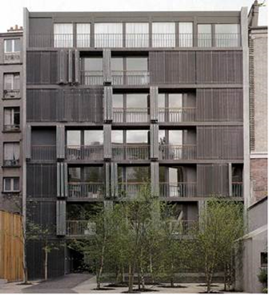
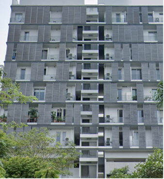
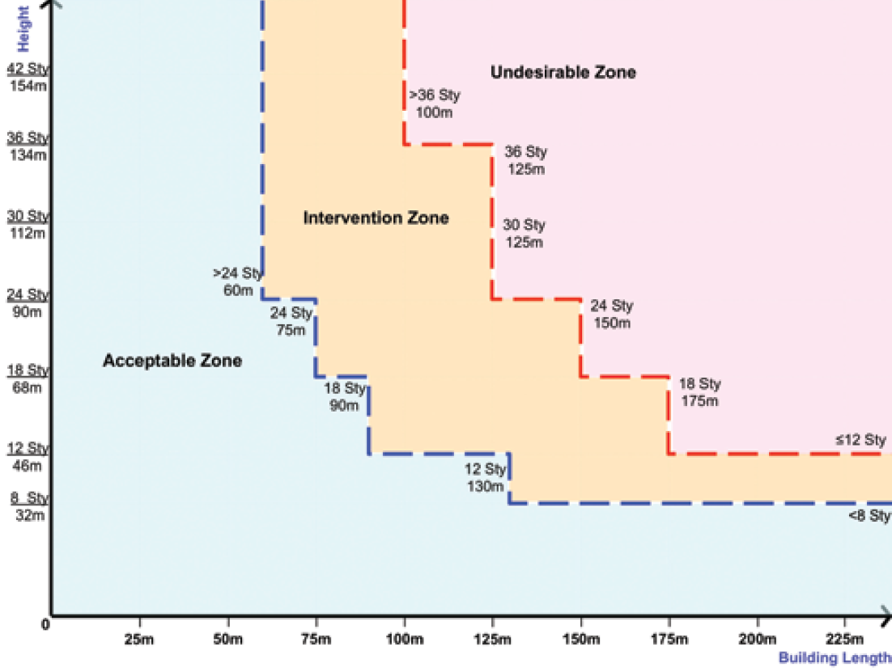
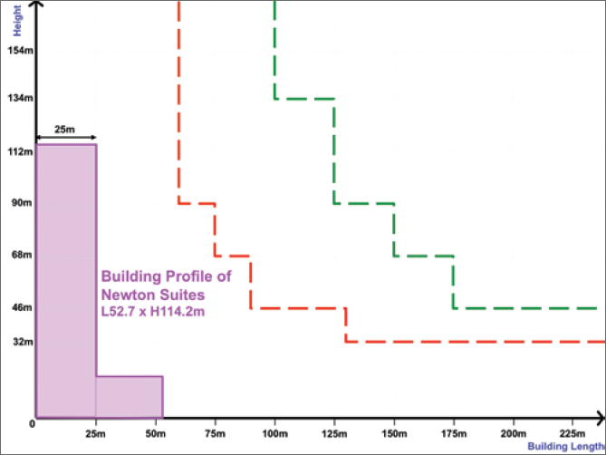
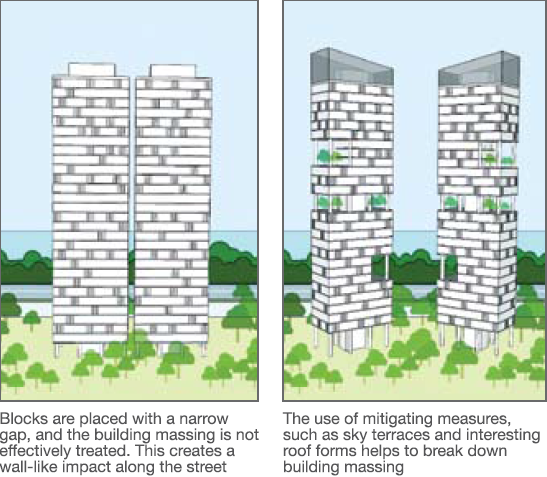
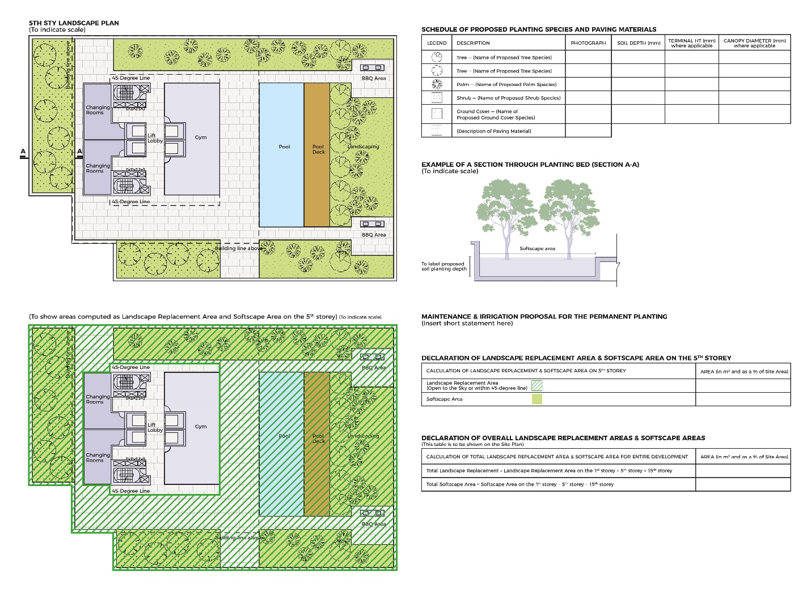
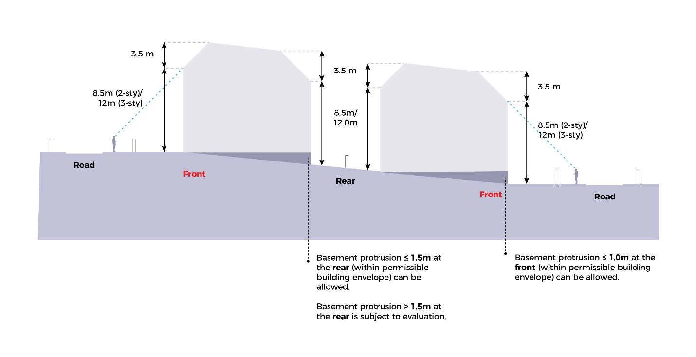
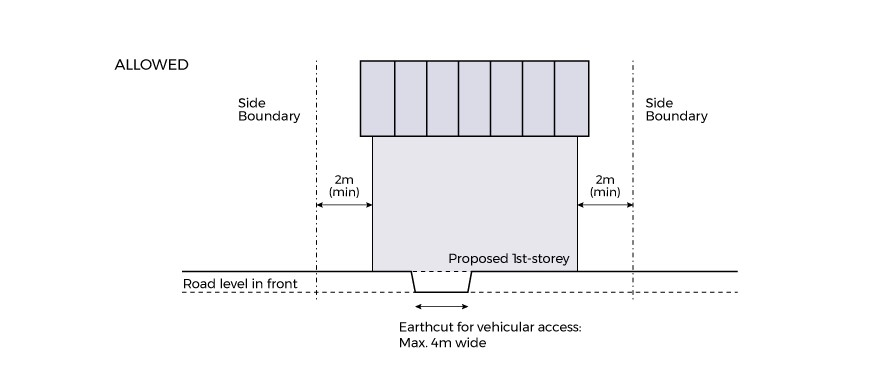
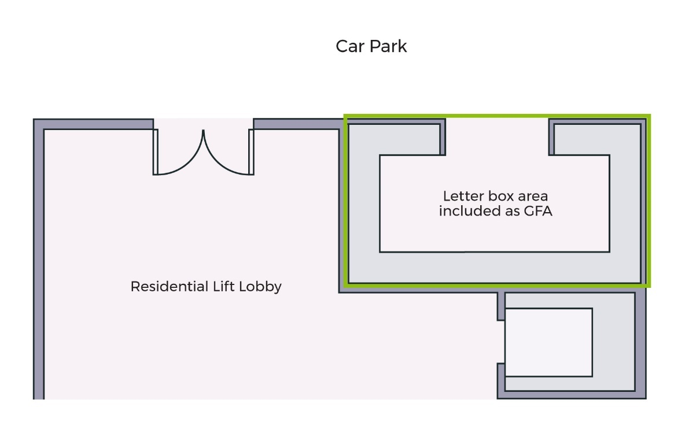
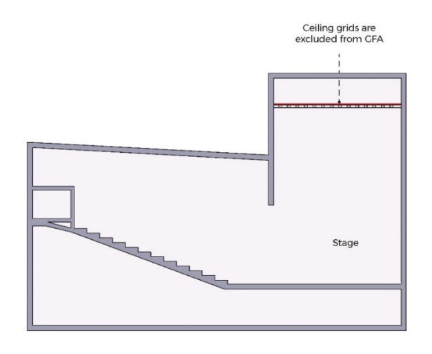

# Flats and Condominiums

**Advisory Notes**

The guidelines set out in this handbook for the various development
control parameters will generally be applied by URA in the consideration
of a development application. However, if the circumstances of a case or
the planning considerations relevant to a case so warrant, URA may in
its discretion decide to depart from these general guidelines. Persons
intending to carry out a development are advised to take this into
consideration in the conduct of their affairs and check with URA through
enquiries or development applications to confirm if their proposals can
be allowed.

The guidelines, principles and illustrations found in the handbook
series are not exhaustive in covering all possible site conditions and
building designs. In evaluating the development applications, URA
reserves the right to evaluate and impose conditions not covered in the
handbook in respond to the specific design of the development proposal
depending on merits.

**Guidelines at a Glance: Flats and Condominiums**

The table below is intended to provide an overview of the key guidelines
applicable for the development type. The full details of the guidelines
are stated in the relevant tabs of this handbook.

+-------------+-------------+-------------+-------------+-------------+
| **          | **          |             |             |             |
| Parameter** | Guideline** |             |             |             |
+-------------+-------------+-------------+-------------+-------------+
| Serviced    | -   SAs may |             |             |             |
| Apartments  |     be      |             |             |             |
| (SA)        |     allowed |             |             |             |
|             |     in      |             |             |             |
|             |     sites   |             |             |             |
|             |     zoned   |             |             |             |
|             |             |             |             |             |
|             | Residential |             |             |             |
|             |     and may |             |             |             |
|             |     be      |             |             |             |
|             |             |             |             |             |
|             |  considered |             |             |             |
|             |     on      |             |             |             |
|             |             |             |             |             |
|             |   mixed-use |             |             |             |
|             |     sites   |             |             |             |
|             |     where a |             |             |             |
|             |             |             |             |             |
|             | residential |             |             |             |
|             |     use may |             |             |             |
|             |     be      |             |             |             |
|             |             |             |             |             |
|             |    allowed. |             |             |             |
|             |     Refer   |             |             |             |
|             |     to      |             |             |             |
|             |     section |             |             |             |
|             |     on      |             |             |             |
|             |             |             |             |             |
|             |   *Serviced |             |             |             |
|             |             |             |             |             |
|             | Apartments* |             |             |             |
|             |     for     |             |             |             |
|             |     more    |             |             |             |
|             |     details |             |             |             |
|             |     on      |             |             |             |
|             |             |             |             |             |
|             |  locational |             |             |             |
|             |             |             |             |             |
|             |   criteria. |             |             |             |
|             |             |             |             |             |
|             | -   SAs     |             |             |             |
|             |     shall   |             |             |             |
|             |     be      |             |             |             |
|             |     rented  |             |             |             |
|             |     out for |             |             |             |
|             |     a min.  |             |             |             |
|             |     period  |             |             |             |
|             |     of 7    |             |             |             |
|             |     days    |             |             |             |
|             |     and     |             |             |             |
|             |             |             |             |             |
|             |   developed |             |             |             |
|             |     and/or  |             |             |             |
|             |     managed |             |             |             |
|             |     under   |             |             |             |
|             |     one     |             |             |             |
|             |             |             |             |             |
|             |  ownership. |             |             |             |
|             |     Strata  |             |             |             |
|             |             |             |             |             |
|             | subdivision |             |             |             |
|             |     of SAs  |             |             |             |
|             |     is      |             |             |             |
|             |             |             |             |             |
|             |    strictly |             |             |             |
|             |     not     |             |             |             |
|             |             |             |             |             |
|             |    allowed. |             |             |             |
|             |             |             |             |             |
|             | -           |             |             |             |
|             | Restaurants |             |             |             |
|             |     and     |             |             |             |
|             |             |             |             |             |
|             |  bar/lounge |             |             |             |
|             |             |             |             |             |
|             |  facilities |             |             |             |
|             |     are     |             |             |             |
|             |     capped  |             |             |             |
|             |     at 0.3% |             |             |             |
|             |     of the  |             |             |             |
|             |     total   |             |             |             |
|             |             |             |             |             |
|             | residential |             |             |             |
|             |     GFA.    |             |             |             |
|             |             |             |             |             |
|             | -   Support |             |             |             |
|             |             |             |             |             |
|             |    services |             |             |             |
|             |     such as |             |             |             |
|             |             |             |             |             |
|             |  concierge, |             |             |             |
|             |     h       |             |             |             |
|             | ousekeeping |             |             |             |
|             |     and/or  |             |             |             |
|             |     laundry |             |             |             |
|             |             |             |             |             |
|             |    provided |             |             |             |
|             |     for the |             |             |             |
|             |             |             |             |             |
|             |   residents |             |             |             |
|             |     of SAs  |             |             |             |
|             |     may be  |             |             |             |
|             |             |             |             |             |
|             |    allowed. |             |             |             |
+-------------+-------------+-------------+-------------+-------------+
| Gross Plot  | Varies from |             |             |             |
| Ratio       | 1.4, 1.6,   |             |             |             |
|             | 2.1, 2.8 or |             |             |             |
|             | more than   |             |             |             |
|             | 2.8 as      |             |             |             |
|             | stipulated  |             |             |             |
|             | in the      |             |             |             |
|             | prevailing  |             |             |             |
|             | Master Plan |             |             |             |
+-------------+-------------+-------------+-------------+-------------+
| Bonus GFA   | Applicable  |             |             |             |
|             | Bonus       |             |             |             |
|             | Scheme      |             |             |             |
|             | (with a     |             |             |             |
|             | cumulative  |             |             |             |
|             | maximum of  |             |             |             |
|             | 10%):       |             |             |             |
|             |             |             |             |             |
|             | -   Balcony |             |             |             |
|             |             |             |             |             |
|             |   Incentive |             |             |             |
|             |     Scheme  |             |             |             |
|             |             |             |             |             |
|             | -           |             |             |             |
|             |   Conserved |             |             |             |
|             |             |             |             |             |
|             |   Bungalows |             |             |             |
|             |     Scheme  |             |             |             |
|             |             |             |             |             |
|             | -   Indoor  |             |             |             |
|             |             |             |             |             |
|             |  Recreation |             |             |             |
|             |     Spaces  |             |             |             |
|             |     Scheme  |             |             |             |
|             |             |             |             |             |
|             | -   Built   |             |             |             |
|             |             |             |             |             |
|             | Environment |             |             |             |
|             |     Tra     |             |             |             |
|             | nsformation |             |             |             |
|             |     Scheme  |             |             |             |
+-------------+-------------+-------------+-------------+-------------+
| Balconies,  | All         |             |             |             |
| Private     | balconies,  |             |             |             |
| Roof        | PRTs, and   |             |             |             |
| Terraces    | PESs        |             |             |             |
| (PRT),      | proposed on |             |             |             |
| Private     | or after 12 |             |             |             |
| Enclosed    | January     |             |             |             |
| Spaces      | 2013 shall  |             |             |             |
| (PES)       | be counted  |             |             |             |
|             | as GFA      |             |             |             |
|             | under the   |             |             |             |
|             | 10% maximum |             |             |             |
|             | bonus GFA   |             |             |             |
|             | allowed     |             |             |             |
|             | beyond the  |             |             |             |
|             | Master Plan |             |             |             |
|             | (MP)        |             |             |             |
|             | stipulated  |             |             |             |
|             | GPR, and    |             |             |             |
|             | may be      |             |             |             |
|             | subject to  |             |             |             |
|             | SLA levying |             |             |             |
|             | Land        |             |             |             |
|             | Betterment  |             |             |             |
|             | Charge,     |             |             |             |
|             | where       |             |             |             |
|             | applicable. |             |             |             |
|             |             |             |             |             |
|             | To qualify  |             |             |             |
|             | for the     |             |             |             |
|             | bonus GFA   |             |             |             |
|             | scheme,     |             |             |             |
|             | balconies,  |             |             |             |
|             | PRTs, and   |             |             |             |
|             | PESs shall  |             |             |             |
|             | retain a    |             |             |             |
|             | s           |             |             |             |
|             | emi-outdoor |             |             |             |
|             | character.  |             |             |             |
+-------------+-------------+-------------+-------------+-------------+
| Maximum No. | -   The DU  |             |             |             |
| of Dwelling |     size    |             |             |             |
| Units (DU)  |     control |             |             |             |
|             |     shall   |             |             |             |
|             |     not     |             |             |             |
|             |     apply   |             |             |             |
|             |     to      |             |             |             |
|             |     d       |             |             |             |
|             | evelopments |             |             |             |
|             |     within  |             |             |             |
|             |     the     |             |             |             |
|             |     Central |             |             |             |
|             |     Area.   |             |             |             |
|             |             |             |             |             |
|             | -   For     |             |             |             |
|             |     flats   |             |             |             |
|             |     outside |             |             |             |
|             |     the     |             |             |             |
|             |     Central |             |             |             |
|             |     Area,   |             |             |             |
|             |             |             |             |             |
|             |   excluding |             |             |             |
|             |     the     |             |             |             |
|             |     estates |             |             |             |
|             |     in      |             |             |             |
|             |     [Maps   |             |             |             |
|             |     2-10]   |             |             |             |
|             | (https://ww |             |             |             |
|             | w.ura.gov.s |             |             |             |
|             | g/Corporate |             |             |             |
|             | /Guidelines |             |             |             |
|             | /Developmen |             |             |             |
|             | t-Control/R |             |             |             |
|             | esidential/ |             |             |             |
|             | Flats-Condo |             |             |             |
|             | miniums/-/m |             |             |             |
|             | edia/0AA5A8 |             |             |             |
|             | 2E18664E1AB |             |             |             |
|             | 35880B4BCBF |             |             |             |
|             | E8CD.ashx): |             |             |             |
|             |     Maximum |             |             |             |
|             |     no. of  |             |             |             |
|             |     DUs =   |             |             |             |
|             |     MP      |             |             |             |
|             |             |             |             |             |
|             |   allowable |             |             |             |
|             |     GPR x   |             |             |             |
|             |     Site    |             |             |             |
|             |     Area /  |             |             |             |
|             |     85sqm.  |             |             |             |
|             |             |             |             |             |
|             | -   For     |             |             |             |
|             |     flats   |             |             |             |
|             |     within  |             |             |             |
|             |     the     |             |             |             |
|             |     estates |             |             |             |
|             |     in      |             |             |             |
|             |     [Maps   |             |             |             |
|             |     2-10]   |             |             |             |
|             | (https://ww |             |             |             |
|             | w.ura.gov.s |             |             |             |
|             | g/Corporate |             |             |             |
|             | /Guidelines |             |             |             |
|             | /Developmen |             |             |             |
|             | t-Control/R |             |             |             |
|             | esidential/ |             |             |             |
|             | Flats-Condo |             |             |             |
|             | miniums/-/m |             |             |             |
|             | edia/0AA5A8 |             |             |             |
|             | 2E18664E1AB |             |             |             |
|             | 35880B4BCBF |             |             |             |
|             | E8CD.ashx): |             |             |             |
|             |     Maximum |             |             |             |
|             |     no. of  |             |             |             |
|             |     DUs =   |             |             |             |
|             |     MP      |             |             |             |
|             |             |             |             |             |
|             |   allowable |             |             |             |
|             |     GPR x   |             |             |             |
|             |     Site    |             |             |             |
|             |     Area /  |             |             |             |
|             |     100sqm. |             |             |             |
|             |             |             |             |             |
|             | -   As a    |             |             |             |
|             |     guide,  |             |             |             |
|             |     all     |             |             |             |
|             |     sel     |             |             |             |
|             | f-contained |             |             |             |
|             |             |             |             |             |
|             |    dwelling |             |             |             |
|             |     units   |             |             |             |
|             |             |             |             |             |
|             | island-wide |             |             |             |
|             |     shall   |             |             |             |
|             |     be more |             |             |             |
|             |     than    |             |             |             |
|             |     35sqm   |             |             |             |
|             |     nett in |             |             |             |
|             |             |             |             |             |
|             |    internal |             |             |             |
|             |     area.   |             |             |             |
|             |             |             |             |             |
|             | -   For     |             |             |             |
|             |             |             |             |             |
|             | computation |             |             |             |
|             |             |             |             |             |
|             |   purposes, |             |             |             |
|             |     the     |             |             |             |
|             |     formula |             |             |             |
|             |     shall   |             |             |             |
|             |     exclude |             |             |             |
|             |     bonus   |             |             |             |
|             |     GFA     |             |             |             |
|             |     schemes |             |             |             |
|             |     and the |             |             |             |
|             |     GFA of  |             |             |             |
|             |     any     |             |             |             |
|             |     strata  |             |             |             |
|             |     landed  |             |             |             |
|             |     units.  |             |             |             |
|             |             |             |             |             |
|             | -   The     |             |             |             |
|             |     maximum |             |             |             |
|             |     number  |             |             |             |
|             |     of      |             |             |             |
|             |             |             |             |             |
|             |    dwelling |             |             |             |
|             |     units   |             |             |             |
|             |     derived |             |             |             |
|             |     from    |             |             |             |
|             |     the     |             |             |             |
|             |     formula |             |             |             |
|             |     may not |             |             |             |
|             |     be      |             |             |             |
|             |             |             |             |             |
|             |  attainable |             |             |             |
|             |             |             |             |             |
|             |   depending |             |             |             |
|             |     on the  |             |             |             |
|             |     site    |             |             |             |
|             |             |             |             |             |
|             |    context, |             |             |             |
|             |     site    |             |             |             |
|             |             |             |             |             |
|             |  conditions |             |             |             |
|             |     and the |             |             |             |
|             |     traffic |             |             |             |
|             |     impact  |             |             |             |
|             |     that    |             |             |             |
|             |     the     |             |             |             |
|             |             |             |             |             |
|             |    proposed |             |             |             |
|             |             |             |             |             |
|             | development |             |             |             |
|             |     may     |             |             |             |
|             |     have in |             |             |             |
|             |     the     |             |             |             |
|             |     area.   |             |             |             |
+-------------+-------------+-------------+-------------+-------------+
| Site Area   | Flats:      |             |             |             |
|             | Minimum     |             |             |             |
|             | 1,000sqm    |             |             |             |
|             |             |             |             |             |
|             | Co          |             |             |             |
|             | ndominiums: |             |             |             |
|             | Minimum     |             |             |             |
|             | 4,000sqm    |             |             |             |
+-------------+-------------+-------------+-------------+-------------+
| Site        | Maximum     |             |             |             |
| Coverage    | 50%. It has |             |             |             |
|             | been        |             |             |             |
|             | simplified  |             |             |             |
|             | to include  |             |             |             |
|             | all         |             |             |             |
|             | building    |             |             |             |
|             | structures  |             |             |             |
|             | that        |             |             |             |
|             | protrude    |             |             |             |
|             | more than   |             |             |             |
|             | 1m from the |             |             |             |
|             | ground as   |             |             |             |
|             | seen from   |             |             |             |
|             | the         |             |             |             |
|             | top-down    |             |             |             |
|             | 'Site Plan' |             |             |             |
|             | view.       |             |             |             |
+-------------+-------------+-------------+-------------+-------------+
| Building    | Varies from |             |             |             |
| Setback     | 3.0m to     |             |             |             |
| from        | 30.0m       |             |             |             |
| Boundary    | depending   |             |             |             |
|             | on road     |             |             |             |
|             | category    |             |             |             |
|             | and         |             |             |             |
|             | proposed    |             |             |             |
|             | storey      |             |             |             |
|             | height      |             |             |             |
|             |             |             |             |             |
|             | Refer to    |             |             |             |
|             | section on  |             |             |             |
|             | *Building   |             |             |             |
|             | Setback     |             |             |             |
|             | from        |             |             |             |
|             | Boundary*   |             |             |             |
+-------------+-------------+-------------+-------------+-------------+
| Building    | **GPR /     | Except the  |             |             |
| Height      | Maximum no. | following   |             |             |
|             | of          | sites       |             |             |
|             | storeys**   | which:      |             |             |
|             |             |             |             |             |
|             |             | -           |             |             |
|             |             |    **have** |             |             |
|             |             |     Street  |             |             |
|             |             |     Block   |             |             |
|             |             |     Plans   |             |             |
|             |             |             |             |             |
|             |             | -   **have  |             |             |
|             |             |             |             |             |
|             |             |   technical |             |             |
|             |             |     height  |             |             |
|             |             |             |             |             |
|             |             |    controls |             |             |
|             |             |     (refer  |             |             |
|             |             |     to      |             |             |
|             |             |             |             |             |
|             |             |    Building |             |             |
|             |             |     Height  |             |             |
|             |             |     Plan in |             |             |
|             |             |     URA     |             |             |
|             |             |             |             |             |
|             |             |    SPACE)** |             |             |
|             |             |             |             |             |
|             |             | -   **have  |             |             |
|             |             |     c       |             |             |
|             |             | onservation |             |             |
|             |             |     or      |             |             |
|             |             |     urban   |             |             |
|             |             |     design  |             |             |
|             |             |     req     |             |             |
|             |             | uirements** |             |             |
|             |             |             |             |             |
|             |             | -   **have  |             |             |
|             |             |             |             |             |
|             |             |    security |             |             |
|             |             |     consi   |             |             |
|             |             | derations** |             |             |
|             |             |             |             |             |
|             |             | -   **do    |             |             |
|             |             |     not     |             |             |
|             |             |     conform |             |             |
|             |             |     to the  |             |             |
|             |             |     GPRs    |             |             |
|             |             |     shown   |             |             |
|             |             |     on the  |             |             |
|             |             |     left,   |             |             |
|             |             |     eg GPR  |             |             |
|             |             |     2.9,    |             |             |
|             |             |     GPR     |             |             |
|             |             |     1.7**   |             |             |
+-------------+-------------+-------------+-------------+-------------+
|             | 1.4 / 5     |             |             |             |
|             | storeys     |             |             |             |
+-------------+-------------+-------------+-------------+-------------+
|             | 1.6 / 12    |             |             |             |
|             | storeys     |             |             |             |
+-------------+-------------+-------------+-------------+-------------+
|             | 2.1 / 24    |             |             |             |
|             | storeys     |             |             |             |
+-------------+-------------+-------------+-------------+-------------+
|             | 2.8 / 36    |             |             |             |
|             | storeys     |             |             |             |
+-------------+-------------+-------------+-------------+-------------+
|             | More than   |             |             |             |
|             | 2.8 / more  |             |             |             |
|             | than 36     |             |             |             |
|             | storeys     |             |             |             |
+-------------+-------------+-------------+-------------+-------------+
| [Flo        | **TYPE**    | **GPR 1.4** | **More than | \*          |
| or-to-Floor |             |             | GPR 1.6**   | Predominant |
| H           |             |             |             | Sky Terrace |
| eight](#_Fl |             |             |             | Storeys     |
| oor-to-Floo |             |             |             | (PSTS) are  |
| r_Height_&) |             |             |             | floors      |
|             |             |             |             | where the   |
|             |             |             |             | sky terrace |
|             |             |             |             | occupies    |
|             |             |             |             | equal to or |
|             |             |             |             | more than   |
|             |             |             |             | 60% of the  |
|             |             |             |             | floor       |
|             |             |             |             | plate.      |
|             |             |             |             | Floors with |
|             |             |             |             | less than   |
|             |             |             |             | 40% of sky  |
|             |             |             |             | terrace are |
|             |             |             |             | considered  |
|             |             |             |             | 'other      |
|             |             |             |             | storeys'    |
+-------------+-------------+-------------+-------------+-------------+
|             | 1^st^       | 5.0m        | 5.0m        |             |
|             | storey      |             |             |             |
+-------------+-------------+-------------+-------------+-------------+
|             | Top storey  | 3.6m        | 5.0m        |             |
+-------------+-------------+-------------+-------------+-------------+
|             | Other       | 3.6m        | 3.6m        |             |
|             | storeys     |             |             |             |
+-------------+-------------+-------------+-------------+-------------+
|             | PSTS\*      | 5.0m        | 5.0m        |             |
+-------------+-------------+-------------+-------------+-------------+
| Building    | Refer to    |             |             |             |
| Length      | the         |             |             |             |
|             | *           |             |             |             |
|             | 'Acceptable |             |             |             |
|             | Zone'* as   |             |             |             |
|             | shown in    |             |             |             |
|             | the section |             |             |             |
|             | on          |             |             |             |
|             | *Building   |             |             |             |
|             | Length*     |             |             |             |
+-------------+-------------+-------------+-------------+-------------+
| Landscape   | Refer to    |             |             |             |
| Deck        | the section |             |             |             |
|             | on          |             |             |             |
|             | *Landscape  |             |             |             |
|             | Deck*       |             |             |             |
+-------------+-------------+-------------+-------------+-------------+
| Basements   | Basements   |             |             |             |
|             | with        |             |             |             |
|             | protrusions |             |             |             |
|             | of up to    |             |             |             |
|             | 1.0m:       |             |             |             |
|             |             |             |             |             |
|             | -   shall   |             |             |             |
|             |     comply  |             |             |             |
|             |     with    |             |             |             |
|             |     the     |             |             |             |
|             |     road    |             |             |             |
|             |     buffer  |             |             |             |
|             |     and     |             |             |             |
|             |             |             |             |             |
|             |    building |             |             |             |
|             |             |             |             |             |
|             |    setback. |             |             |             |
|             |             |             |             |             |
|             | -   any     |             |             |             |
|             |             |             |             |             |
|             |    basement |             |             |             |
|             |             |             |             |             |
|             | protrusions |             |             |             |
|             |     of more |             |             |             |
|             |     than    |             |             |             |
|             |     1.0m    |             |             |             |
|             |     above   |             |             |             |
|             |     the     |             |             |             |
|             |     ground  |             |             |             |
|             |     level   |             |             |             |
|             |     are     |             |             |             |
|             |     treated |             |             |             |
|             |     as a    |             |             |             |
|             |     storey. |             |             |             |
|             |             |             |             |             |
|             | Sunken      |             |             |             |
|             | basements   |             |             |             |
|             | may be      |             |             |             |
|             | built up to |             |             |             |
|             | the street  |             |             |             |
|             | reserve     |             |             |             |
|             | line and    |             |             |             |
|             | lot         |             |             |             |
|             | boundary    |             |             |             |
|             | provided:   |             |             |             |
|             |             |             |             |             |
|             | -   the     |             |             |             |
|             |     portion |             |             |             |
|             |             |             |             |             |
|             |  underneath |             |             |             |
|             |     the     |             |             |             |
|             |     green   |             |             |             |
|             |     buffer  |             |             |             |
|             |     is      |             |             |             |
|             |             |             |             |             |
|             |   submerged |             |             |             |
|             |     at      |             |             |             |
|             |     least   |             |             |             |
|             |     2m or   |             |             |             |
|             |     more    |             |             |             |
|             |     below   |             |             |             |
|             |     the     |             |             |             |
|             |     ground  |             |             |             |
|             |     level.  |             |             |             |
|             |             |             |             |             |
|             | -   there   |             |             |             |
|             |     are no  |             |             |             |
|             |             |             |             |             |
|             |   technical |             |             |             |
|             |     re      |             |             |             |
|             | quirements. |             |             |             |
|             |             |             |             |             |
|             | -   it does |             |             |             |
|             |     not     |             |             |             |
|             |     cause   |             |             |             |
|             |     any     |             |             |             |
|             |     adverse |             |             |             |
|             |     impact  |             |             |             |
|             |     to the  |             |             |             |
|             |             |             |             |             |
|             |   adjoining |             |             |             |
|             |             |             |             |             |
|             |   property. |             |             |             |
+-------------+-------------+-------------+-------------+-------------+
| Special and | [Special    | D           |             |             |
| Detailed    | and         | evelopments |             |             |
| Control     | Detailed    | within      |             |             |
| Plans       | Control     | special     |             |             |
| ~~Control   | Plans]{.ul} | control     |             |             |
| Areas~~     |             | areas may   |             |             |
|             | [Special    | be subject  |             |             |
|             | Control     | to          |             |             |
|             | Area        | screening   |             |             |
|             | 1](https:// | r           |             |             |
|             | www.ura.gov | equirements |             |             |
|             | .sg/-/media | (to be      |             |             |
|             | /Corporate/ | confirmed   |             |             |
|             | Guidelines/ | upon        |             |             |
|             | Development | submission  |             |             |
|             | -control/Ot | of a        |             |             |
|             | hers/SCA_1) | proposed    |             |             |
|             |             | d           |             |             |
|             | [Special    | evelopment) |             |             |
|             | Control     |             |             |             |
|             | Area        |             |             |             |
|             | 2](https:// |             |             |             |
|             | www.ura.gov |             |             |             |
|             | .sg/-/media |             |             |             |
|             | /Corporate/ |             |             |             |
|             | Guidelines/ |             |             |             |
|             | Development |             |             |             |
|             | -control/Ot |             |             |             |
|             | hers/SCA_2) |             |             |             |
+-------------+-------------+-------------+-------------+-------------+
| Street      | Refer to    |             |             |             |
| Block Plans | section on  |             |             |             |
|             | *Street     |             |             |             |
|             | Block       |             |             |             |
|             | Plans*      |             |             |             |
+-------------+-------------+-------------+-------------+-------------+
| D           | Refer to    |             |             |             |
| evelopments | section on  |             |             |             |
| involving   | *D          |             |             |             |
| Waterbodies | evelopments |             |             |             |
|             | involving   |             |             |             |
|             | W           |             |             |             |
|             | aterbodies* |             |             |             |
+-------------+-------------+-------------+-------------+-------------+
| Attic       | -   Maximum |             |             |             |
|             |     height: |             |             |             |
|             |     5m      |             |             |             |
|             |             |             |             |             |
|             | -   Maximum |             |             |             |
|             |     pitch:  |             |             |             |
|             |     45      |             |             |             |
|             |     degrees |             |             |             |
|             |     from    |             |             |             |
|             |     the     |             |             |             |
|             |             |             |             |             |
|             |   springing |             |             |             |
|             |     line    |             |             |             |
|             |             |             |             |             |
|             | -   Attic   |             |             |             |
|             |     and the |             |             |             |
|             |     unit    |             |             |             |
|             |     below   |             |             |             |
|             |     cannot  |             |             |             |
|             |     be      |             |             |             |
|             |     strata  |             |             |             |
|             |             |             |             |             |
|             |  subdivided |             |             |             |
|             |             |             |             |             |
|             | -   Primary |             |             |             |
|             |     access  |             |             |             |
|             |     to the  |             |             |             |
|             |     attic   |             |             |             |
|             |     is from |             |             |             |
|             |     the     |             |             |             |
|             |             |             |             |             |
|             |    internal |             |             |             |
|             |             |             |             |             |
|             |   staircase |             |             |             |
|             |     to the  |             |             |             |
|             |     unit    |             |             |             |
|             |     below   |             |             |             |
+-------------+-------------+-------------+-------------+-------------+
| Shops       | Up to 0.3%  |             |             |             |
|             | of the      |             |             |             |
|             | proposed    |             |             |             |
|             | GFA         |             |             |             |
|             | (excluding  |             |             |             |
|             | bonus       |             |             |             |
|             | balcony     |             |             |             |
|             | GFA, if     |             |             |             |
|             | any) may be |             |             |             |
|             | proposed    |             |             |             |
|             | for shops   |             |             |             |
|             | providing   |             |             |             |
|             | personal    |             |             |             |
|             | services,   |             |             |             |
|             | subject to  |             |             |             |
|             | the         |             |             |             |
|             | following   |             |             |             |
|             | criteria:   |             |             |             |
|             |             |             |             |             |
|             | -   scale   |             |             |             |
|             |     of the  |             |             |             |
|             |             |             |             |             |
|             | development |             |             |             |
|             |     in      |             |             |             |
|             |     terms   |             |             |             |
|             |     of      |             |             |             |
|             |     gross   |             |             |             |
|             |     floor   |             |             |             |
|             |     area;   |             |             |             |
|             |             |             |             |             |
|             | -           |             |             |             |
|             |    location |             |             |             |
|             |     of the  |             |             |             |
|             |     site in |             |             |             |
|             |             |             |             |             |
|             |    relation |             |             |             |
|             |     to the  |             |             |             |
|             |     main    |             |             |             |
|             |     road;   |             |             |             |
|             |             |             |             |             |
|             | -           |             |             |             |
|             |   character |             |             |             |
|             |     of the  |             |             |             |
|             |             |             |             |             |
|             | surrounding |             |             |             |
|             |     de      |             |             |             |
|             | velopments; |             |             |             |
|             |     and     |             |             |             |
|             |             |             |             |             |
|             | -           |             |             |             |
|             |    planning |             |             |             |
|             |             |             |             |             |
|             |   intention |             |             |             |
|             |     of the  |             |             |             |
|             |             |             |             |             |
|             | surrounding |             |             |             |
|             |     area.   |             |             |             |
|             |             |             |             |             |
|             | The total   |             |             |             |
|             | permissible |             |             |             |
|             | GPR and GFA |             |             |             |
|             | shall       |             |             |             |
|             | include the |             |             |             |
|             | shopping    |             |             |             |
|             | GFA.        |             |             |             |
|             |             |             |             |             |
|             | Only        |             |             |             |
|             | personal    |             |             |             |
|             | service     |             |             |             |
|             | trades are  |             |             |             |
|             | allowed (eg |             |             |             |
|             | mi          |             |             |             |
|             | ni-marts/la |             |             |             |
|             | undromats). |             |             |             |
|             | Independent |             |             |             |
|             | offices are |             |             |             |
|             | not allowed |             |             |             |
+-------------+-------------+-------------+-------------+-------------+
| Ancillary   | Refer to    |             |             |             |
| Structures  | section on  |             |             |             |
|             | *Ancillary  |             |             |             |
|             | Structures* |             |             |             |
|             | for         |             |             |             |
|             | detailed    |             |             |             |
|             | setback     |             |             |             |
|             | r           |             |             |             |
|             | equirements |             |             |             |
|             | depending   |             |             |             |
|             | on the type |             |             |             |
|             | of          |             |             |             |
|             | ancillary   |             |             |             |
|             | structure.  |             |             |             |
|             |             |             |             |             |
|             | Other       |             |             |             |
|             | ancillary   |             |             |             |
|             | structures  |             |             |             |
|             | located     |             |             |             |
|             | within the  |             |             |             |
|             | physical    |             |             |             |
|             | buffer and  |             |             |             |
|             | building    |             |             |             |
|             | setback     |             |             |             |
|             | that exceed |             |             |             |
|             | the         |             |             |             |
|             | guidelines  |             |             |             |
|             | but are     |             |             |             |
|             | less than   |             |             |             |
|             | 6m in       |             |             |             |
|             | height will |             |             |             |
|             | be          |             |             |             |
|             | evaluated   |             |             |             |
|             | depending   |             |             |             |
|             | on merits.  |             |             |             |
+-------------+-------------+-------------+-------------+-------------+
| Parking     | -   Parking |             |             |             |
|             |             |             |             |             |
|             |   standards |             |             |             |
|             |     and     |             |             |             |
|             |     r       |             |             |             |
|             | equirements |             |             |             |
|             |     are     |             |             |             |
|             |             |             |             |             |
|             |  prescribed |             |             |             |
|             |     by the  |             |             |             |
|             |     Land    |             |             |             |
|             |             |             |             |             |
|             |   Transport |             |             |             |
|             |             |             |             |             |
|             |   Authority |             |             |             |
|             |     (LTA).  |             |             |             |
|             |             |             |             |             |
|             | -           |             |             |             |
|             | Residential |             |             |             |
|             |     strata  |             |             |             |
|             |     titled  |             |             |             |
|             |     units   |             |             |             |
|             |     may     |             |             |             |
|             |     have a  |             |             |             |
|             |     maximum |             |             |             |
|             |     of 2    |             |             |             |
|             |     private |             |             |             |
|             |     car     |             |             |             |
|             |     parking |             |             |             |
|             |     lots,   |             |             |             |
|             |     which   |             |             |             |
|             |     have to |             |             |             |
|             |     be      |             |             |             |
|             |             |             |             |             |
|             |  physically |             |             |             |
|             |             |             |             |             |
|             |  integrated |             |             |             |
|             |     to the  |             |             |             |
|             |             |             |             |             |
|             |  respective |             |             |             |
|             |             |             |             |             |
|             | residential |             |             |             |
|             |     strata  |             |             |             |
|             |     lots    |             |             |             |
|             |     and     |             |             |             |
|             |     capable |             |             |             |
|             |     of      |             |             |             |
|             |     being   |             |             |             |
|             |     formed  |             |             |             |
|             |     into    |             |             |             |
|             |     single  |             |             |             |
|             |     strata  |             |             |             |
|             |     lots.   |             |             |             |
+-------------+-------------+-------------+-------------+-------------+
| RC Flat     | RC flat     |             |             |             |
| Roofs       | roofs shall |             |             |             |
|             | remain      |             |             |             |
|             | i           |             |             |             |
|             | naccessible |             |             |             |
|             | except for  |             |             |             |
|             | maintenance |             |             |             |
|             | purposes    |             |             |             |
|             | only.       |             |             |             |
|             | Activating  |             |             |             |
|             | the rooftop |             |             |             |
|             | for uses    |             |             |             |
|             | such as     |             |             |             |
|             | roof        |             |             |             |
|             | terraces    |             |             |             |
|             | may be      |             |             |             |
|             | allowed     |             |             |             |
|             | depending   |             |             |             |
|             | on the      |             |             |             |
|             | merits of   |             |             |             |
|             | the         |             |             |             |
|             | proposal.   |             |             |             |
|             | No          |             |             |             |
|             | structures  |             |             |             |
|             | shall be    |             |             |             |
|             | allowed     |             |             |             |
|             | unless      |             |             |             |
|             | otherwise   |             |             |             |
|             | approved by |             |             |             |
|             | URA. Where  |             |             |             |
|             | allowed,    |             |             |             |
|             | structures  |             |             |             |
|             | (including  |             |             |             |
|             | any safety  |             |             |             |
|             | barriers)   |             |             |             |
|             | shall       |             |             |             |
|             | comply with |             |             |             |
|             | height      |             |             |             |
|             | controls    |             |             |             |
|             | and the     |             |             |             |
|             | following   |             |             |             |
|             | guidelines. |             |             |             |
+-------------+-------------+-------------+-------------+-------------+
|             | **Communal  |             |             |             |
|             | Pavilions** |             |             |             |
|             |             |             |             |             |
|             | Communal    |             |             |             |
|             | pavilions   |             |             |             |
|             | shall be    |             |             |             |
|             | accessed    |             |             |             |
|             | from common |             |             |             |
|             | areas only. |             |             |             |
|             |             |             |             |             |
|             | They shall  |             |             |             |
|             | be computed |             |             |             |
|             | as GFA      |             |             |             |
|             | unless they |             |             |             |
|             | meet the    |             |             |             |
|             | following   |             |             |             |
|             | criteria:   |             |             |             |
|             |             |             |             |             |
|             | -   Maximum |             |             |             |
|             |     50sqm   |             |             |             |
|             |     or 50%  |             |             |             |
|             |     of roof |             |             |             |
|             |             |             |             |             |
|             |   coverage, |             |             |             |
|             |             |             |             |             |
|             |   whichever |             |             |             |
|             |     is      |             |             |             |
|             |     lower;  |             |             |             |
|             |             |             |             |             |
|             | -   For     |             |             |             |
|             |     d       |             |             |             |
|             | evelopments |             |             |             |
|             |     with    |             |             |             |
|             |     storey  |             |             |             |
|             |     height  |             |             |             |
|             |             |             |             |             |
|             |    control, |             |             |             |
|             |             |             |             |             |
|             |   pavilions |             |             |             |
|             |     shall   |             |             |             |
|             |     be      |             |             |             |
|             |             |             |             |             |
|             | open-sided; |             |             |             |
|             |             |             |             |             |
|             | -   For     |             |             |             |
|             |     d       |             |             |             |
|             | evelopments |             |             |             |
|             |     without |             |             |             |
|             |     storey  |             |             |             |
|             |     height  |             |             |             |
|             |             |             |             |             |
|             |    control, |             |             |             |
|             |     maximum |             |             |             |
|             |     50%     |             |             |             |
|             |             |             |             |             |
|             |   perimeter |             |             |             |
|             |             |             |             |             |
|             |   enclosure |             |             |             |
|             |     of the  |             |             |             |
|             |             |             |             |             |
|             |   pavilions |             |             |             |
|             |     may be  |             |             |             |
|             |             |             |             |             |
|             |    allowed; |             |             |             |
|             |             |             |             |             |
|             | -           |             |             |             |
|             |    Communal |             |             |             |
|             |             |             |             |             |
|             |   pavilions |             |             |             |
|             |     shall   |             |             |             |
|             |     be      |             |             |             |
|             |             |             |             |             |
|             |  integrated |             |             |             |
|             |     with    |             |             |             |
|             |     lush    |             |             |             |
|             |             |             |             |             |
|             |   greenery. |             |             |             |
|             |     The     |             |             |             |
|             |             |             |             |             |
|             |    greenery |             |             |             |
|             |     on the  |             |             |             |
|             |     rooftop |             |             |             |
|             |     shall   |             |             |             |
|             |     be both |             |             |             |
|             |             |             |             |             |
|             |   enjoyable |             |             |             |
|             |     by the  |             |             |             |
|             |             |             |             |             |
|             |    building |             |             |             |
|             |     users   |             |             |             |
|             |     and     |             |             |             |
|             |     visible |             |             |             |
|             |     from    |             |             |             |
|             |     the     |             |             |             |
|             |     su      |             |             |             |
|             | rroundings; |             |             |             |
|             |             |             |             |             |
|             | -   Plants  |             |             |             |
|             |     shall   |             |             |             |
|             |     be      |             |             |             |
|             |     i       |             |             |             |
|             | ncorporated |             |             |             |
|             |     on      |             |             |             |
|             |             |             |             |             |
|             |   permanent |             |             |             |
|             |     and     |             |             |             |
|             |             |             |             |             |
|             |  preferably |             |             |             |
|             |     sunken  |             |             |             |
|             |             |             |             |             |
|             |   planting, |             |             |             |
|             |     planned |             |             |             |
|             |     with    |             |             |             |
|             |             |             |             |             |
|             |  sufficient |             |             |             |
|             |     soil    |             |             |             |
|             |     depth   |             |             |             |
|             |     based   |             |             |             |
|             |     on the  |             |             |             |
|             |     types   |             |             |             |
|             |     of      |             |             |             |
|             |     plants  |             |             |             |
|             |             |             |             |             |
|             |   proposed. |             |             |             |
|             |     Some    |             |             |             |
|             |     space   |             |             |             |
|             |     shall   |             |             |             |
|             |     be set  |             |             |             |
|             |     aside   |             |             |             |
|             |     for the |             |             |             |
|             |             |             |             |             |
|             |   provision |             |             |             |
|             |     of      |             |             |             |
|             |             |             |             |             |
|             |    communal |             |             |             |
|             |             |             |             |             |
|             |  facilities |             |             |             |
|             |     and     |             |             |             |
|             |             |             |             |             |
|             |   furniture |             |             |             |
|             |     to      |             |             |             |
|             |     enhance |             |             |             |
|             |     the     |             |             |             |
|             |             |             |             |             |
|             |    rooftop. |             |             |             |
+-------------+-------------+-------------+-------------+-------------+
|             | **Solar     |             |             |             |
|             | Panels**    |             |             |             |
|             |             |             |             |             |
|             | Planning    |             |             |             |
|             | permission  |             |             |             |
|             | is not      |             |             |             |
|             | required    |             |             |             |
|             | except in   |             |             |             |
|             | the         |             |             |             |
|             | following   |             |             |             |
|             | locations   |             |             |             |
|             | and         |             |             |             |
|             | contexts:   |             |             |             |
|             |             |             |             |             |
|             | -   Site is |             |             |             |
|             |     subject |             |             |             |
|             |     to      |             |             |             |
|             |     urban   |             |             |             |
|             |     design  |             |             |             |
|             |             |             |             |             |
|             |  guidelines |             |             |             |
|             |     or      |             |             |             |
|             |     located |             |             |             |
|             |     within  |             |             |             |
|             |     C       |             |             |             |
|             | onservation |             |             |             |
|             |     Areas;  |             |             |             |
|             |             |             |             |             |
|             | -           |             |             |             |
|             | Elevated^1^ |             |             |             |
|             |     solar   |             |             |             |
|             |     panels; |             |             |             |
|             |             |             |             |             |
|             | -   Spaces  |             |             |             |
|             |     under   |             |             |             |
|             |     solar   |             |             |             |
|             |     panels  |             |             |             |
|             |     are     |             |             |             |
|             |             |             |             |             |
|             |    enclosed |             |             |             |
|             |     or put  |             |             |             |
|             |     to      |             |             |             |
|             |             |             |             |             |
|             |  commercial |             |             |             |
|             |     use.    |             |             |             |
|             |             |             |             |             |
|             | ^1^ A solar |             |             |             |
|             | panel is    |             |             |             |
|             | deemed to   |             |             |             |
|             | be elevated |             |             |             |
|             | if it is    |             |             |             |
|             | raised more |             |             |             |
|             | than 1m     |             |             |             |
|             | from the    |             |             |             |
|             | roof level  |             |             |             |
|             | for landed  |             |             |             |
|             | housing     |             |             |             |
|             | d           |             |             |             |
|             | evelopments |             |             |             |
|             | or 1.8m     |             |             |             |
|             | from the    |             |             |             |
|             | roof level  |             |             |             |
|             | for other   |             |             |             |
|             | de          |             |             |             |
|             | velopments. |             |             |             |
+-------------+-------------+-------------+-------------+-------------+
| Greenery    | Refer to    |             |             |             |
|             | section on  |             |             |             |
|             | *Greenery*  |             |             |             |
+-------------+-------------+-------------+-------------+-------------+
| Walking and | Flats and   |             |             |             |
| Cycling     | c           |             |             |             |
| Plan        | ondominiums |             |             |             |
|             | with more   |             |             |             |
|             | than 700    |             |             |             |
|             | DUs shall   |             |             |             |
|             | provide a   |             |             |             |
|             | Walking and |             |             |             |
|             | Cycling     |             |             |             |
|             | Plan (WCP)  |             |             |             |
|             | as part of  |             |             |             |
|             | their       |             |             |             |
|             | Development |             |             |             |
|             | A           |             |             |             |
|             | pplication. |             |             |             |
|             | Refer to    |             |             |             |
|             | section on  |             |             |             |
|             | *Walking    |             |             |             |
|             | and Cycling |             |             |             |
|             | Plan*       |             |             |             |
+-------------+-------------+-------------+-------------+-------------+
| Strata      | Only        |             |             |             |
| Subdivision | residential |             |             |             |
|             | units and   |             |             |             |
|             | shop units, |             |             |             |
|             | if any, may |             |             |             |
|             | be strata   |             |             |             |
|             | s           |             |             |             |
|             | ub-divided. |             |             |             |
|             | Common      |             |             |             |
|             | areas shall |             |             |             |
|             | not be      |             |             |             |
|             | strata      |             |             |             |
|             | subdivided  |             |             |             |
|             | into a      |             |             |             |
|             | separate    |             |             |             |
|             | strata      |             |             |             |
|             | unit.       |             |             |             |
+-------------+-------------+-------------+-------------+-------------+
| Earthworks  | -           |             |             |             |
|             |  Earthworks |             |             |             |
|             |     are not |             |             |             |
|             |     allowed |             |             |             |
|             |     within  |             |             |             |
|             |     the     |             |             |             |
|             |             |             |             |             |
|             |    building |             |             |             |
|             |     setback |             |             |             |
|             |     area.   |             |             |             |
|             |             |             |             |             |
|             | -           |             |             |             |
|             |  Earthworks |             |             |             |
|             |     within  |             |             |             |
|             |     the     |             |             |             |
|             |             |             |             |             |
|             |  build-able |             |             |             |
|             |     area    |             |             |             |
|             |     are     |             |             |             |
|             |     subject |             |             |             |
|             |     to      |             |             |             |
|             |             |             |             |             |
|             | evaluation. |             |             |             |
|             |     If      |             |             |             |
|             |             |             |             |             |
|             |   earthfill |             |             |             |
|             |     of more |             |             |             |
|             |     than 1m |             |             |             |
|             |     is      |             |             |             |
|             |             |             |             |             |
|             |    allowed, |             |             |             |
|             |     the     |             |             |             |
|             |     overall |             |             |             |
|             |             |             |             |             |
|             |   aggregate |             |             |             |
|             |             |             |             |             |
|             |    building |             |             |             |
|             |     height  |             |             |             |
|             |             |             |             |             |
|             |    measured |             |             |             |
|             |     from    |             |             |             |
|             |     the     |             |             |             |
|             |             |             |             |             |
|             |   allowable |             |             |             |
|             |             |             |             |             |
|             |    platform |             |             |             |
|             |     level   |             |             |             |
|             |     shall   |             |             |             |
|             |     comply  |             |             |             |
|             |     with    |             |             |             |
|             |     the     |             |             |             |
|             |     maximum |             |             |             |
|             |             |             |             |             |
|             |   allowable |             |             |             |
|             |             |             |             |             |
|             |    building |             |             |             |
|             |     height  |             |             |             |
|             |             |             |             |             |
|             |    control. |             |             |             |
|             |             |             |             |             |
|             | -           |             |             |             |
|             |   Earthfill |             |             |             |
|             |             |             |             |             |
|             |   involving |             |             |             |
|             |     the     |             |             |             |
|             |     entire  |             |             |             |
|             |             |             |             |             |
|             | development |             |             |             |
|             |     site    |             |             |             |
|             |     may     |             |             |             |
|             |     only be |             |             |             |
|             |             |             |             |             |
|             |  considered |             |             |             |
|             |     if the  |             |             |             |
|             |             |             |             |             |
|             |    proposed |             |             |             |
|             |             |             |             |             |
|             |  earthworks |             |             |             |
|             |     are     |             |             |             |
|             |             |             |             |             |
|             |    required |             |             |             |
|             |     to meet |             |             |             |
|             |     the     |             |             |             |
|             |     Minimum |             |             |             |
|             |             |             |             |             |
|             |    Platform |             |             |             |
|             |     Level   |             |             |             |
|             |     (MPL)   |             |             |             |
|             |             |             |             |             |
|             |  stipulated |             |             |             |
|             |     by PUB. |             |             |             |
+-------------+-------------+-------------+-------------+-------------+
| Boundary    | Maximum     |             |             |             |
| and         | allowable   |             |             |             |
| Retaining   | height for  |             |             |             |
| Walls       | boundary    |             |             |             |
|             | walls is    |             |             |             |
|             | 1.8m.       |             |             |             |
|             |             |             |             |             |
|             | Erection of |             |             |             |
|             | retaining   |             |             |             |
|             | walls are   |             |             |             |
|             | subject to  |             |             |             |
|             | evaluation. |             |             |             |
|             | If          |             |             |             |
|             | retaining   |             |             |             |
|             | walls are   |             |             |             |
|             | allowed:    |             |             |             |
|             |             |             |             |             |
|             | -   the     |             |             |             |
|             |     height  |             |             |             |
|             |     shall   |             |             |             |
|             |     be less |             |             |             |
|             |     than    |             |             |             |
|             |     1.5m;   |             |             |             |
|             |             |             |             |             |
|             | -           |             |             |             |
|             |   retaining |             |             |             |
|             |     walls   |             |             |             |
|             |     higher  |             |             |             |
|             |     than    |             |             |             |
|             |     1.5m    |             |             |             |
|             |     may be  |             |             |             |
|             |             |             |             |             |
|             |  considered |             |             |             |
|             |             |             |             |             |
|             |   depending |             |             |             |
|             |     on site |             |             |             |
|             |             |             |             |             |
|             | constraints |             |             |             |
|             |     and the |             |             |             |
|             |     need    |             |             |             |
|             |     for     |             |             |             |
|             |             |             |             |             |
|             |   extensive |             |             |             |
|             |             |             |             |             |
|             | excavation; |             |             |             |
|             |             |             |             |             |
|             | -   the     |             |             |             |
|             |     total   |             |             |             |
|             |     visible |             |             |             |
|             |     height  |             |             |             |
|             |     of the  |             |             |             |
|             |     solid   |             |             |             |
|             |             |             |             |             |
|             | boundary-cu |             |             |             |
|             | m-retaining |             |             |             |
|             |     wall    |             |             |             |
|             |     shall   |             |             |             |
|             |     not     |             |             |             |
|             |     exceed  |             |             |             |
|             |     2.8m,   |             |             |             |
|             |     of      |             |             |             |
|             |     which   |             |             |             |
|             |     the     |             |             |             |
|             |     solid   |             |             |             |
|             |             |             |             |             |
|             |    boundary |             |             |             |
|             |     wall    |             |             |             |
|             |     shall   |             |             |             |
|             |     not     |             |             |             |
|             |     exceed  |             |             |             |
|             |     1.8m.   |             |             |             |
+-------------+-------------+-------------+-------------+-------------+

**Introduction**

Flats and condominiums are non-landed residential developments approved
for dwelling purpose. Each residential unit shall have a satisfactory
layout for residential purpose comprising bedrooms, a living room, a
dining room, a kitchen and toilets.

Flats and condominiums are allowed in areas zoned Residential,
Commercial & Residential, Residential with Commercial at 1^st^Storey,
White, and Residential/Institution (in the Geylang Planning Area) in the
Master Plan. They are not allowed in areas designated only for landed
housing developments, except for existing flats and condominiums
previously approved in such areas.

Condominiums typically offer more generous provision of communal and
recreational facilities than flats developments, and have larger[[Site
Area]{.ul}](https://intranet.ura.gov.sg/Corporate/Guidelines/Development-Control/Residential/Flats-Condominiums/Site-Area)and
more[[Common Boundary
Setback]{.ul}](https://intranet.ura.gov.sg/Corporate/Guidelines/Development-Control/Residential/Flats-Condominiums/Setback).

For sites zoned Commercial/Residential or Residential with Commercial at
1^st^Storey, refer to the[[Commercial
Handbook]{.ul}](https://intranet.ura.gov.sg/Corporate/Guidelines/Development-Control/Non-Residential/Commercial)for
the relevant guidelines.

**Serviced Apartments**

Serviced Apartments (SA) may be allowed in Residential zone and may also
be considered on mixed-use sites where residential use may be allowed.
SAs are self-contained apartments with kitchenettes/kitchens, and
provide support services such as concierge, common dining areas,
housekeeping and/or laundry for the residents.

SAs shall be rented out for lodging purposes for a minimum period of 7
days or longer, and shall be developed and/or managed under one
ownership. Strata subdivision of SAs is strictly not allowed.

Support services such as concierge, housekeeping and/or laundry provided
for the residents of Serviced Apartments may be allowed. In addition,
limited bar/lounge facilities may be permitted, subject to a maximum of
0.3% of the total residential GFA.

**SAs within Residential zones (incl. mixed use sites with a residential
component)**

Applicants may submit an Outline Application to URA to determine the
suitability of the location, the Gross Plot Ratio (GPR)control and the
storey heightfor a proposed SA development.

SAs may be allowed where the site fronts a major or arterial road (ie
Category 1, 2, 3 roads or equivalent) at the fringe of a residential
area; or the site is located in a mixed-use area (eg commercial centres,
business parks, or abutting medical hubs).

SAs shall not be allowed within the designated Landed Housing Areas;
areas where SAs may potentially cause dis-amenities to the neighbouring
residents; and areas where there are already dis-amenities in the
surroundings (examples of such areas can be found under the[[Hotels
Handbook]{.ul}](https://intranet.ura.gov.sg/Corporate/Guidelines/Development-Control/Residential/Flats-Condominiums/~/link.aspx?_id=D6552D95F1DE4CE3ABB700371F96772E&_z=z)).

**SAs within mixed-use areas**

SAs may be considered in mixed-use areas and are not restricted by the
category of roads fronting the site.

### 

### Gross Plot Ratio

The development potential of a residential development is guided by the
Gross Plot Ratio (GPR)specified in the Master Plan (MP). The MP plot
ratio is the upper bound as it may not always be achievable because of
site limitations like shape of the plot, site topography or ground
conditions, building setbacks, building height or technical requirements
of other authorities that may affect the site.

The area of the land required to be set aside for drainage
reserve^1^(DR)and/or road reserve^2^(RR)to be vested in the State may
be included in the site area to compute the Gross Floor Area (GFA) for a
GPR.

^1^**Drainage Reserve**: An area safeguarded for purposes of building
or widening a public drain.

^2^**Street/Road Reserve**: The plot of land to be vested in the State
as required under the Street Works Act. It is demarcated by the line of
Road Reserve in the Road Line Plan and the site boundary.


*GPR for sites where vesting is required*

**Bonus GFA Incentive Schemes**

The Bonus GFA schemes applicable to flats and condominiums are:

**Balcony Incentive Scheme**

Refer to section on[[Balconies, Private Enclosed Spaces, Private Roof
Terraces, & Indoor Recreation
Spaces]{.ul}](https://intranet.ura.gov.sg/Corporate/Guidelines/Development-Control/Residential/Flats-Condominiums/~/link.aspx?_id=073E26836E5A406892CF59BA9A501130&_z=z).

**Conserved Bungalows Scheme**

The GFA of conserved bungalows may be computed as additional GFA over
and above the GPR stipulated in the prevailing Master Plan.

**Eligibility**

The incentive is applicable to all bungalows meeting the following
criteria:

-   Volunteered for conservation or designated for conservation by URA;
    > and

-   Located on a site with GPR control.

**Submission**

Submissions of Development Applications involving conserved bungalows
shall be made only by a Qualified Person (QP), who is registered as an
Architect under the Architects Act and who has in force a practising
certificate issued under the Act.

The QP shall demarcate the area of the conserved bungalow in the
submission and declare the additional GFA from the conserved bungalow in
the application form.

**Indoor Recreation Spaces Scheme**

Refer to section on[[Balconies, Private Enclosed Spaces, Private Roof Terraces, & Indoor Recreation
Spaces]{.ul}](https://intranet.ura.gov.sg/Corporate/Guidelines/Development-Control/Residential/Flats-Condominiums/~/link.aspx?_id=073E26836E5A406892CF59BA9A501130&_z=z).

The Bonus GFA is allowed over and above the MP GPR subject to a maximum
of 10% of the MP GPR. When the site is redeveloped in future, the
additional GFA already used under the bonus GFA incentive schemes shall
not be carried over. In other words, the GPR for the site shall revert
to the GPR specified in the prevailing MP.

Although a site may make use of multiple bonus GFA incentive schemes,
the total bonus GFA shall not exceed the overall cap of 10% above the MP
GPR.

**Built Environment Transformation Scheme**

The Built Environment (BE) Transformation GFA scheme aims to encourage
adoption of higher tier Construction Industry Transformation Map (ITM)
outcomes in areas of digitisation, productivity and sustainability. The
incentive scheme is jointly administered by BCA and URA. Applicants may
qualify for the scheme by adopting stipulated ITM outcomes as part of
the development proposal.

**Eligibility**

The incentive is applicable for new erection or major Addition &
Alterations to private sites of at least 5000sqm GFA[^1]. Sites launched
under the Government Land Sales (GLS) programme prior to 31 March 2022
may also be eligible for the incentive scheme.

The types of developments eligible for the incentive scheme are as
follows:

  Residential[^2]    Condominium and Flats development
  ------------------ ---------------------------------------------------------------------------------------------------------------------------------------------------------------
  Non- Residential   Commercial, Industrial and Institutional developments, such as office, retail, business parks, community building, hotel, hospital or white site developments
  Mixed use          Combination of the above

**Quantum of Bonus GFA Allowed**

Private sites may be granted up to 3% bonus GFA under the scheme[^3].
The scheme is applicable for new proposals till 23 November 2026.

GLS sites are eligible up to 2% bonus GFA. The scheme is applicable for
new GLS launched prior to 31 March 2022.

The cumulative bonus GFA shall be kept within the overall budget of 10%
above the Master Plan Gross Plot Ratio (GPR), or the maximum allowable
GFA of the development. It shall not form the future development
potential of the site upon redevelopment.

### 

### Balconies, Private Enclosed Spaces,Private Roof Terraces and Indoor Recreation Spaces

**Balconies**

The GFA of balconiesin flats and condominium developments may be
computed over and above the Master Plan (MP) allowable GPR, subject to a
cap of 7% inclusive of planter boxes, if any. The additional GPR may
only be used for balcony GFA and shall not form the future development
potential of the site upon redevelopment. The additional balcony GFA may
be subject to SLA levying Land Betterment Charge, where applicable. When
submitting development proposals with balconies, the QP is required to
demarcate the balcony area clearly on the Calculation Plan and declare
the total balcony area that exceeds the MP allowable GPR.

Existing developments whose GPR have exceeded the Master Plan intensity
may qualify for the additional balcony GFA, subject to a cap of 7% of
the existing and approved GPR inclusive of planter boxes, if any. This
does not apply to existing developments whose building form, height or
use are not in accordance with the planning intention of the Master
Plan, Building Height Plan or Special and Detailed Control Plan. For
instance, a flats development within a designated landed housing area
shall not qualify for the bonus balcony GFA.

Balcony designs shall adhere to the following guidelines and submission
requirements:

+--------------+------------------------------------------------------+
| **Location** | Balconies shall be located away from M&E areas to    |
|              | safeguard the quality and usability of these spaces. |
+==============+======================================================+
| **Openness** | Balconies shall have a continuous perimeter opening  |
|              | of at least 40%.\                                   |
|              | \                                                    |
|              |                   |
|              | *Balcony Perimeter Opening*\                         |
|              | \                                                    |
|              | The portions of a balcony that face a parapet wall   |
|              | (eg a wall between the balconies of two adjoining    |
|              | units) not exceeding 1.3m in height are considered   |
|              | "open".\                                            |
|              | \                                                    |
|              | The QP shall show the computation of perimeter       |
|              | opening for the proposed balconies on the floor      |
|              | plans.                                               |
+--------------+------------------------------------------------------+
| **Size**     | Total balcony size for each dwelling unit is capped  |
|              | at 15% of the internal nett unit size.\             |
|              | \                                                    |
|              | This excludes voids, balconies, air-conditioner      |
|              | ledges and other external areas. The intention is to |
|              | ensure that the balconies are not disproportionately |
|              | large relative to the main unit.                     |
+--------------+------------------------------------------------------+
| **Width**    | Balconies shall have a minimum width of 1.5m as      |
|              | measured from the external building wall. Exceptions |
|              | to the width requirement may be considered arising   |
|              | from the design merit of the proposal, such as a     |
|              | curved or odd-shaped balcony but the balcony shall   |
|              | be reasonably sized.                                 |
+--------------+------------------------------------------------------+
| **Access**   | Balconies with exclusive access from the             |
|              | kitchen/yard/utility space are treated as service    |
|              | balconies and do not qualify for bonus GFA.\        |
|              | \                                                    |
|              | Balconies which serve as the only access into a      |
|              | dwelling unit do not qualify for bonus GFA.          |
+--------------+------------------------------------------------------+
| **Screen**   | -   Balconies shall not be enclosed with walls or    |
|              |     glass panels as balconies are meant to be        |
|              |     semi-outdoor spaces. Blinds are akin to          |
|              |     furnishing and can be allowed at balconies       |
|              |     without planning permission from URA.            |
|              |                                                      |
|              | -   Balcony screens may be allowed provided:         |
|              |                                                      |
|              |     -   The balcony screens can be drawn open or     |
|              |         > retracted fully; and                       |
|              |                                                      |
|              |     -   The balcony screens allow for natural        |
|              |         > ventilation/air flow within the balcony at |
|              |         > all times, even when the screens are fully |
|              |         > drawn.                                     |
|              |                                                      |
|              | -   See diagrams below for some possible designs of  |
|              |     balcony                                          |
|              |     screens.{width="2.8in"      |
|              |     height="3.066666666666667i                       |
|              | n"}{width="2.816666666666667in" |
|              |     height="3.066666666666667in"}                    |
|              |                                                      |
|              | -   Balcony screens shall be designed upfront and    |
|              |     > approved as part of the Development            |
|              |     > Application process for all new residential    |
|              |     > developments with proposed balconies           |
|              |     > (including the residential component of        |
|              |     > mixed-use developments). Developers may        |
|              |     > propose a single screen design or a few        |
|              |     > designs for the end-users to choose from.      |
|              |                                                      |
|              | -   Developers shall provide a Letter of Undertaking |
|              |     > to be submitted at the Development Application |
|              |     > Stage, downloadable via the                    |
|              |     > followi                                        |
|              | ng[link](https://intranet.ura.gov.sg/Corporate/Guid |
|              | elines/Development-Control/Residential/Flats-Condomi |
|              | niums/-/media/401541F1D8464D3EBA207DDA3F58A472.ashx) |
|              |     > (PDF, 351 KB).                                 |
|              |                                                      |
|              | -   The plans shall show the balcony screens in      |
|              |     > elevation view; one view fully retracted and   |
|              |     > another view fully closed with a fully         |
|              |     > retracted view in a plan view. The porosity of |
|              |     > the balcony screen shall be annotated, and if  |
|              |     > the screening is louvred, the individual slats |
|              |     > shall be fixed (ie not adjustable). Section    |
|              |     > cuts of the louvres shall be provided to show  |
|              |     > that the screening is naturally ventilated at  |
|              |     > all times, even when closed.                   |
|              |                                                      |
|              | -   If sales gallery and/or show unit(s) is/are      |
|              |     > erected for the development, developers shall  |
|              |     > be required to install the approved balcony    |
|              |     > screen in its actual scale in the show unit of |
|              |     > the development.                               |
|              |                                                      |
|              |     -   If the balcony screens are not erected       |
|              |         > within the show unit as it may block the   |
|              |         > entrance, the developer shall erect a      |
|              |         > mock-up of the full approved balcony       |
|              |         > screen elsewhere within the show gallery   |
|              |         > premises.                                  |
|              |                                                      |
|              |     -   Mock-ups showing only parts of the approved  |
|              |         > balcony screen or scaled down versions of  |
|              |         > the balcony screens installed at the       |
|              |         > balcony are not allowed.                   |
|              |                                                      |
|              |     -   For developments with multiple approved      |
|              |         > balcony screen designs, mock-ups of all    |
|              |         > the balcony screen designs shall be        |
|              |         > installed at the show gallery of the       |
|              |         > development.                               |
|              |                                                      |
|              |     -   A written notice and a detailed drawing of   |
|              |         > the approved balcony screen showing the    |
|              |         > overall specifications shall be displayed  |
|              |         > next to the mock-up balcony screen. The    |
|              |         > written notice shall include the           |
|              |         > following:                                 |
|              |                                                      |
|              |         -   Explicitly state that '*The balcony      |
|              |             > shall not be enclosed except with the  |
|              |             > approved balcony screen*'.             |
|              |                                                      |
|              |         -   For balconies where the screen is not    |
|              |             > installed within the balcony of the    |
|              |             > show unit itself, the notice shall     |
|              |             > refer to the mock up balcony screen    |
|              |             > installed in the other show unit or    |
|              |             > sales gallery.                         |
|              |                                                      |
|              |         -   State that the purchasers shall have the |
|              |             > option to have the balcony screen      |
|              |             > pre-installed in the units and make    |
|              |             > clear if the purchasers have to bear   |
|              |             > separate costs for its installation.   |
|              |                                                      |
|              | -   Under rule 10(4) of Housing Developer Rules,     |
|              |     > developers shall explicitly state in the unit  |
|              |     > floor plan in Form 3 that "*Balconies shall    |
|              |     > not to be enclosed except with a balcony       |
|              |     > screen which has been approved and complies    |
|              |     > with the Competent Authority's guidelines*".   |
|              |                                                      |
|              | -   Developers shall provide purchasers the option   |
|              |     > to have the approved screening pre-installed   |
|              |     > at their balconies. This option shall be       |
|              |     > offered via a side letter at the point of      |
|              |     > issuance of the Option to Purchase. This is    |
|              |     > not applicable for developers who choose to    |
|              |     > pre-install approved screens for all balconies |
|              |     > in the development.                            |
|              |                                                      |
|              | -   For existing developments without balcony        |
|              |     > screens, screens may be installed provided     |
|              |     > they fulfil the performance criteria above.    |
|              |     > Subsidiary proprietors who wish to propose     |
|              |     > balcony screens should adhere to any           |
|              |     > prevailing design guidelines set out by their  |
|              |     > MCST. Safety grilles are not considered        |
|              |     > balcony screens and do not require URA's       |
|              |     > approval.                                      |
+--------------+------------------------------------------------------+

**Private Enclosed Spaces (PES)**

A Private Enclosed Space refers to a semi-outdoor area adjacent to a
strata unit. It forms part of the private strata area of units which are
sold to homeowners.

All PESin non-landed residential developments submitted on or after 12
January 2013 shall be counted as GFA under the 7% maximum bonus GFA
allowed beyond the Master Plan (MP) stipulated GPR. PES approved before
12 January 2013 may not be counted towards the development's GFA.

To qualify for the bonus GFA scheme, PES shall comply with the
guidelines to retain a semi-outdoor character. The structures shall
comply with the relevant requirements from technical agencies.

The guidelines for PES are in the table below.

**Guidelines on PES**

+-----------------+---------------------------------------------------+
| **Covers**      | -   Full covers (subject to compliance with       |
|                 |     > SCDF's requirements) over the entire PES    |
|                 |     > may be allowed provided they comply with    |
|                 |     > development control parameters such as      |
|                 |     > building setback and site coverage. PES     |
|                 |     > covers shall be approved upfront as part of |
|                 |     > the Development Application process.        |
|                 |     > Developers may propose a single cover       |
|                 |     > design, or a few designs for the homeowners |
|                 |     > to choose from.                             |
|                 |                                                   |
|                 | -   Developers shall install a 2m wide (minimum)  |
|                 |     > cover from the external wall. Homeowners    |
|                 |     > shall be given the flexibility and choice   |
|                 |     > over the remaining cover for the rest of    |
|                 |     > the PES beyond 2m, as long as it is one of  |
|                 |     > the approved designs and provided they      |
|                 |     > obtain MCST clearance prior to              |
|                 |     > installation. MCSTs may use these           |
|                 |     > pre-approved designs to guide homeowners    |
|                 |     > who wish to extend their cover beyond 2m.   |
+=================+===================================================+
| **Setback**     | The PES cover shall be located outside the        |
|                 | setback line, as the covers would add to the bulk |
|                 | and massing of the building.                      |
+-----------------+---------------------------------------------------+
| **PES Fencing** | Any PES fencing that defines the extent of the    |
|                 | PES shall not exceed 1m in height. This is to     |
|                 | ensure the open and semi-outdoor nature of the    |
|                 | PES. A 1.8m screening wall may be proposed        |
|                 | between PES adjoining each other for privacy      |
|                 | purposes. Full height separating walls between    |
|                 | adjoining PES may be allowed if they are to meet  |
|                 | FSSD's requirements.                              |
+-----------------+---------------------------------------------------+

**Private Roof Terraces (PRT)**

A Private Roof Terrace refers to a semi-outdoor area located at the roof
level of a strata unit. It forms part of the private strata area of
units which are sold to homeowners. To avoid complications at the
strata-subdivision stage, these should be clearly annotated as 'Private
Roof Terraces'.

All PRTof developments approved on or after 12 January 2013 shall be
counted as GFA under the 7% maximum bonus GFA allowed beyond the Master
Plan (MP) stipulated GPR. PRT approved before 12 January 2013 may not be
counted towards the development's GFA.

To qualify for the bonus GFA scheme, PRT shall comply with the
guidelines to retain a semi-outdoor character. The structures shall
comply with the relevant requirements from technical agencies.

The guidelines for PRT are in the table below.

**Guidelines for Roof Terraces**

+----------------------+----------------------+----------------------+
| **Location**         | Private roof         |                      |
|                      | terraces may be      |                      |
|                      | allowed on the flat  |                      |
|                      | roof of a building.  |                      |
|                      | Private roof         |                      |
|                      | terraces shall not   |                      |
|                      | be allowed on top of |                      |
|                      | the attic level.     |                      |
+======================+======================+======================+
| **Covers**           | -   Coverings        |                      |
|                      |     > (subject to    |                      |
|                      |     > compliance     |                      |
|                      |     > with SCDF's    |                      |
|                      |     > requirements)  |                      |
|                      |     > may be allowed |                      |
|                      |     > on PRT         |                      |
|                      |     > provided the   |                      |
|                      |     > development    |                      |
|                      |     > complies with  |                      |
|                      |     > the applicable |                      |
|                      |     > storey         |                      |
|                      |                      |                      |
|                      |   > heightcontrols. |                      |
|                      |     > Such covers    |                      |
|                      |     > shall be       |                      |
|                      |     > approved       |                      |
|                      |     > upfront as     |                      |
|                      |     > part of the    |                      |
|                      |     > development    |                      |
|                      |     > application    |                      |
|                      |     > process.       |                      |
|                      |     > Developers may |                      |
|                      |     > propose a      |                      |
|                      |     > single cover   |                      |
|                      |     > design, or a   |                      |
|                      |     > few designs    |                      |
|                      |     > for the        |                      |
|                      |     > homeowners to  |                      |
|                      |     > choose from.   |                      |
|                      |                      |                      |
|                      | -   Installation of  |                      |
|                      |     > the covers is  |                      |
|                      |     > optional.      |                      |
|                      |     > Homeowners may |                      |
|                      |     > choose from    |                      |
|                      |     > one of the     |                      |
|                      |     > approved       |                      |
|                      |     > designs,       |                      |
|                      |     > should they    |                      |
|                      |     > wish to cover  |                      |
|                      |     > the PRT        |                      |
|                      |     > subsequently.  |                      |
|                      |     > Homeowners     |                      |
|                      |     > shall obtain   |                      |
|                      |     > MCST clearance |                      |
|                      |     > prior to       |                      |
|                      |     > installation.  |                      |
|                      |     > MCSTs may use  |                      |
|                      |     > the            |                      |
|                      |     > pre-approved   |                      |
|                      |     > designs to     |                      |
|                      |     > guide          |                      |
|                      |     > homeowners who |                      |
|                      |     > wish to        |                      |
|                      |     > install        |                      |
|                      |     > covers.        |                      |
+----------------------+----------------------+----------------------+
| **Height Control**   | [If the storey       | [If the storey       |
|                      | height control has   | height control has   |
|                      | been maxed           | not been maxed       |
|                      | out]{.ul}\          | out]{.ul}\           |
|                      | \                    | \                    |
|                      | Any covers on roof   | The roof terrace     |
|                      | terrace floor shall  | shall be taken to be |
|                      | be setback according | an additional        |
|                      | to the 45-degree     | storey. Covers may   |
|                      | envelope taken from  | be allowed over the  |
|                      | the springing        | entire roof terrace  |
|                      | line^1^. The         | floor. The overall   |
|                      | structures shall not | height of the        |
|                      | exceed 5m at any     | development shall    |
|                      | point, subject to    | comply with the      |
|                      | the technical height | technical height     |
|                      | controls, where      | controls, where      |
|                      | applicable.          | applicable.          |
+----------------------+----------------------+----------------------+
| **Structures within  | To retain the open   |                      |
| Private Roof         | and semi-outdoor     |                      |
| Terraces**           | nature of the RT,    |                      |
|                      | any structures shall |                      |
|                      | remain open-sided as |                      |
|                      | viewed from the      |                      |
|                      | external faade.     |                      |
+----------------------+----------------------+----------------------+

Communal roof terraces are open to sky areas managed by the MCST which
serve to provide landscaping and communal facilities for residents in
the development. They shall not be counted as GFA. Covered or enclosed
features within these areas shall be counted as GFA.

^1^**Springing Line**: The line joining the points on which the roof
rests.

**Indoor Recreation Spaces**

Private non-landed residential developments and the residential
component of mixed-use developments may apply for the communal indoor
recreation spaces to be counted as bonus GFA, provided such spaces are
more than 0.6% of the total GFA of the development or 10sqm (whichever
is higher). The bonus GFA shall be capped at 1% of total GFA, or the GFA
of the residential component for mixed-use developments.


*Bonus GFA for Indoor Recreational Space*

If the proposed communal indoor recreation spaces are less than 0.6% of
the total GFA of the development or 10sqm (whichever is higher), these
spaces shall be counted under the main building GFA instead of bonus
GFA.

Examples of communal indoor recreation spaces that may qualify for this
scheme include gyms, function rooms, libraries, game rooms and reading
rooms. Developers may propose other forms of communal indoor recreation
spaces for URA's evaluation. These spaces shall be retained as common
propertyand kept accessible to residents of the development. They shall
only be used for non-commercial purposes.

The indoor recreation space bonus GFA scheme shall apply to all
development applications for new erection, amendments to approved
developments or additions and alterations (A&A) of existing private
non-landed residential developments or mixed-use developments with a
residential component.

All additional GFA granted under the indoor recreation space bonus GFA
scheme shall not form the future development potential of the site.

**Maximum Number of Dwelling Units**

The formulae to determine the maximum number of dwelling units shall not
apply to HDB flats and Serviced Apartments, and developments within
the[[Central
Area]{.ul}](https://intranet.ura.gov.sg/-/media/Corporate/Guidelines/Development-control/Flats-Condominiums/Central_Area_Map.pdf?la=en)(PDF,
436 KB).

As a guide, all self-contained DUs island-wide shall be more than 35sqm
nett in internal area.

The formulae in the following tabs for calculating the maximum allowable
number of DUs are intended to derive an upper bound figure^1^. The
actual number of DUs that may be supported in any development shall be
assessed based on the site context, existing site conditions and the
impact on the local infrastructure. URA shall assess the overall layout,
design and unit sizes of the residential development proposals, and may
add other requirements where necessary to protect the quality of the
living environment.

There shall be provision of a good mix of unit sizes including larger
DUs that can cater to the needs of larger families. An example is a
development where about 20% of the DUs have a nett internal area of at
least 100sqm, excluding voids, balconies, air-conditioner ledges and
other external areas, and units of nett internal area less than 50sqm
shall not exceed about 20% of the proposed DUs^1^.

^1^These guidelines shall apply to the residential component of
mixed-use developments (e.g. Residential with Commercial at 1^st^Storey
or Mixed Commercial and Residential developments)

**For flats and condominiums outside the Central Area**

For all flats and condominium developments outside the Central Area,
excluding the estates shown in[[Maps 2-10]{.ul}](https://intranet.ura.gov.sg/Corporate/Guidelines/Development-Control/Residential/Flats-Condominiums/-/media/0AA5A82E18664E1AB35880B4BCBFE8CD.ashx)(PDF, 1.93 MB), the maximum number of allowable DUs per residential development shall be determined based on the following formula:


^2^Excludes bonus GFA (ie if the proposal is a mixed development, only
the proposed GFA for the residential component shall be used in the
calculation, excluding bonus GFA).

^3^The GFA of any proposed strata landed units shall be excluded from
the calculation in the formula.

**For flats and condominiums within the estates in Maps 2-10**

For all flats and condominium developmentsin the estates outlined
in[[Maps 2-10]{.ul}](https://intranet.ura.gov.sg/Corporate/Guidelines/Development-Control/Residential/Flats-Condominiums/-/media/0AA5A82E18664E1AB35880B4BCBFE8CD.ashx)(PDF, 1.93 MB) a more stringent DU guide shall be used. The maximum number of allowable DUsper residential development within these estates shall be determined based on the following formula:


^2^Excludes bonus GFA (ie if the proposal is a mixed development, only
the proposed GFA for the residential component shall be used in the
calculation, excluding bonus GFA).

^3^The GFA of any proposed strata landed units shall be excluded from
the calculation in the formula.

**Site Area**

The minimum site area for a flats and condominium development is
1,000sqm and 4,000sqm respectively. Condominiums require larger site
area to ensure that there is sufficient space for more communal and
recreational facilities.

For proposals where terrace or semi-detached houses breakaway for
redevelopment into flats & condominiums, the remaining adjacent lots
shall be capable of redevelopment into flats & condominiums. The
remaining adjacent lots are known as left-behind lots, and shall fulfil
the minimum site area of 1,000sqm.


*Minimum Site Area for Left-Behind Plots*

**Conditions under which the minimum site area of 1000 sqm may be
waived**

The owner(s) of the left-behind lot(s) do not wish to participate in the
redevelopment despite being informed of the limited development
potential of his/their land after it is left out of the redevelopment;
and

An agreement cannot be reached between the owner(s) of the left-behind
lot(s) and the owner of the redevelopment proposal after extensive
discussion. There shall be clear documentary evidence of prior
negotiation with the owner(s) of the left-behind lot(s).

### 

### Site Coverage

Site coverage ensures that there are adequate areas set aside for
greenery and landscaping within the development.

The computation of site coverage has been simplified to include all
building structures that protrude more than 1m from the ground as seen
from the top-down 'Site Plan' view, and is expressed as a percentage of
the net site area. The net site area refers to the area of the site
excluding areas to be vested to the State for public roads, public road
widening reserves^1^, and drainage reserves^2^.

The maximum site coverage for flats and condominiums is 50%.

In the Development Application, the Site Plan shall include a separate
site coverage layer for computation purposes. An example is shown below.


*Example of a Site Coverage Plan for Flats or Condominum Developments*

^1^**Road Reserve**: The plot of land to be vested in the State as
required under the Street Works Act. It is demarcated by the line of
Road Reserve in the Road Line Plan and the site boundary.

### ^2^**Drainage Reserve (DR)**: An area safeguarded for purposes of building or widening a public drain.Building Setback from Boundary


*Illustration of Setback and Buffer*

Flats and condominiums shall be sufficiently set back from the road and
common boundary. The setback distance is measured from the road
reserve^1^line or boundary line to the external wall of the flats,
excluding land to be vested to the State for road or drainage or public
purpose.

The setback for flats and condominiums from public roads are determined
by the road buffer, which is dependent on the category of the road that
the site fronts and the height of development. For roads that are not
categorised, the minimum road buffer of 7.5m applies. A green buffer
shall also be set aside within the road buffer. The classification of
the road category may be obtained from LTA's Road Interpretation Plan
(RIP).

The type of road buffer & setback are shown in the diagram above, and
are detailed in Tables 1 & 2.

Bay windows, ledges, roof eaves and other minor building features may
encroach into the setback distance up to the extent shown in Table 3
below.

Exceptions to the setback and buffer requirements are listed below:

-   Sites with street block controls (refer to the[Street Block
    > Plans](https://intranet.ura.gov.sg/Corporate/Guidelines/Development-Control/Residential/Flats-Condominiums/Street-Block-Plans)
    > section);

-   Party-wall^3^developments (to be assessed upon formal submission of
    > a proposed development);

-   Flats and condominium developments within the River Valley, Newton
    > and Orchard Planning Areas. The standard road buffer for these
    > shall be 7.5m (of which 3m is green buffer);

-   Flats and condominium developments in the[Central
    > Area](https://intranet.ura.gov.sg/-/media/Corporate/Guidelines/Development-control/Flats-Condominiums/Central_Area_Map.pdf?la=en)
    > (PDF, 436 KB) other than those in the River Valley, Newton and
    > Orchard Planning Areas. The required road buffer shall be based on
    > urban design considerations.

^1^**Road Reserve**: The plot of land to be vested in the State as
required under the Street Works Act. It is demarcated by the line of
Road Reserve in the Road Line Plan and the site boundary.

**Table 1: Road Buffer and Green Buffer**

  ----------------------------------------------------------------------------------------------------------------------
  **Road Category**              **Type of Development**           **Road Buffer\
                                                                   (inclusive of Green Buffer indicated in brackets)**
  ------------------------------ --------------------------------- -----------------------------------------------------
  Category 1                     Residential 6 storeys and above   30m\
                                                                   (5m)

                                 Residential up to 5 storeys       24m\
                                                                   (5m)

  Category 2                     Residential 6 storeys and above   15m\
                                                                   (5m)

                                 Residential up to 5 storeys       12m\
                                                                   (5m)

  Category 3                     Residential 6 storeys and above   10m\
                                                                   (3m)

                                 Residential up to 5 storeys       7.5m\
                                                                   (3m)

  Category 4 - 5 and slip road   Residential                       7.5m\
                                                                   (3m)
  ----------------------------------------------------------------------------------------------------------------------

**Table 2: Common Boundary Setback & Planting Strip**

  **Storey Height**                                                                                                       **Common Boundary Setback for Flats**   **Common Boundary Setback for Condominiums**
  ----------------------------------------------------------------------------------------------------------------------- --------------------------------------- ----------------------------------------------
  1                                                                                                                       3.0m                                    3.0m
  2                                                                                                                                                               
  3                                                                                                                                                               3.4m
  4                                                                                                                                                               3.8m
  5                                                                                                                       3.3m                                    4.7m
  6                                                                                                                       3.6m                                    5.5m
  7                                                                                                                       3.9m                                    6.4m
  8                                                                                                                       4.2m                                    7.2m
  9                                                                                                                       4.5m                                    8.0m
  10                                                                                                                      4.8m                                    8.7m
  11                                                                                                                      5.1m                                    9.0m
  12                                                                                                                      5.4m                                    9.2m
  13                                                                                                                      5.7m                                    9.5m
  14                                                                                                                      6.0m                                    9.8m
  15                                                                                                                      6.3m                                    10.1m
  16                                                                                                                      6.6m                                    10.3m
  17                                                                                                                      6.9m                                    10.6m
  18                                                                                                                      7.2m                                    10.8m
  19                                                                                                                      7.5m                                    11.1m
  20                                                                                                                      7.8m                                    11.3m
  21                                                                                                                      8.1m                                    11.6m
  22                                                                                                                      8.4m                                    11.8m
  23                                                                                                                      8.7m                                    12.1m
  24                                                                                                                      9.0m                                    12.4m
  25                                                                                                                      9.3m                                    12.7m
  26                                                                                                                      9.6m                                    12.9m
  27                                                                                                                      9.9m                                    13.2m
  28                                                                                                                      10.2m                                   13.4m
  29                                                                                                                      10.5m                                   13.7m
  30                                                                                                                      10.8m                                   14.0m
  31                                                                                                                      11.1m                                   14.2m
  32                                                                                                                      11.4m                                   14.5m
  33                                                                                                                      11.7m                                   14.7m
  34                                                                                                                      12.0m                                   15.0m
  35                                                                                                                      12.3m                                   15.2m
  36 and above                                                                                                            12.6m                                   15.5m
  ***Note**: A 2m-wide (minimum) planting strip is to be provided along all common boundaries of the development site.*                                           

**Table 3: Setback of Flats and Condominiums from Good Class Bungalow
Areas (GCBA)**

+----------------------------------+----------------------------------+
| **Storey Height**                | **Minimum Setback from GCBA      |
|                                  | Boundary**                       |
+==================================+==================================+
| 1-2 storeys\*                    | 3m or Road buffer requirement    |
|                                  | (if fronting road)               |
+----------------------------------+----------------------------------+
| 3-5 storeys                      | 25m                              |
+----------------------------------+----------------------------------+
| 6-35 storeys                     | Setback is increased by 1m       |
|                                  | beyond 25m for each storey       |
|                                  | height. For example:             |
|                                  |                                  |
|                                  | a 6 storey flat shall set back   |
|                                  | 26m;                             |
|                                  |                                  |
|                                  | a 7 storey flat shall be set     |
|                                  | back 27m;                        |
|                                  |                                  |
|                                  | and so on                        |
+----------------------------------+----------------------------------+
| 36 storeys and above             | 56m                              |
+----------------------------------+----------------------------------+
| ***Note**: A 2m-wide (minimum)   |                                  |
| planting strip is to be provided |                                  |
| along all common boundaries of   |                                  |
| the development site.*           |                                  |
+----------------------------------+----------------------------------+

**\*Roof terrace(s), if proposed, shall be orientated to face away from
the GCBA.**

**Table 4: Setback for Multi-Storey Car Parks (MSCP)**

**Setback from Road**

  -----------------------------------------------------------------------------------------------------------------------------------------------------------------------------------------------------------------------------------------------------------------
  **Road Category**                                                                                                                                                                                           **Setback from Road for all MSCPs\
                                                                                                                                                                                                              (inclusive of Green Buffer indicated in brackets)**
  ----------------------------------------------------------------------------------------------------------------------------------------------------------------------------------------------------------- -----------------------------------------------------
  Category 1                                                                                                                                                                                                  15m\
                                                                                                                                                                                                              (5m)

  Category 2                                                                                                                                                                                                  7.5m\
                                                                                                                                                                                                              (5m)

  Category 3 -- 5 and Slip Road                                                                                                                                                                               Refer to note below\
                                                                                                                                                                                                              (3m)

  ***Note**: The road buffer for MSCPs facing a Category 3-5 road and slip road is based on the predominant use of the development. This is to achieve a consistent streetscape along these smaller roads.*   
  -----------------------------------------------------------------------------------------------------------------------------------------------------------------------------------------------------------------------------------------------------------------

**Setback from Common Boundaries**

  **Multi-Storey Car Parks**                                                                **Setback from Common Boundaries**
  ----------------------------------------------------------------------------------------- ------------------------------------
  MSCP faade with openings                                                                 6m (minimum)
  MSCP faade with no openings                                                              4.5m (minimum)
  MSCP facade fronting open areas (ie open space, drainage reserve more than 6m in width)   

**Table 5: Setback for Building Appendages**

  -----------------------------------------------------------------------------------------------------------------------------------------------------------------------------------------------------------------------------
  **Building Feature**                                                                                          **Within Road Buffer**                            **Within Setback from Common Boundaries**
  ------------------------------------------------------------------------------------------------------------- ------------------------------------------------- -------------------------------------------------------------
  Main building roof eaves                                                                                      Allowed, provided it is not within green buffer   Allowed, provided it is not within the 2.0m planting strip\
                                                                                                                                                                  (to allow sunlight and rain to reach the plants)

  Secondary building roof eaves & RC ledges\                                                                                                                      
  (cantilevered)                                                                                                                                                  

  Bay windows\                                                                                                  Allowed to protrude 0.5m into road buffer         Allowed to protrude 0.5m into setback from common boundary
  (raised windows, not exceeding one structural bay width and cantilevered at least 0.5m high from the floor)                                                     

  Planters\                                                                                                                                                       
  (cantilevered box structures for planting purposes)                                                                                                             

  Air-conditioner ledges                                                                                                                                          

  Other horizontal sun-shading devices, fins or any other decorative features\                                                                                    
  (includes light weight cantilevered screens spaced apart for sun-shading purpose without vertical supports)                                                     
  -----------------------------------------------------------------------------------------------------------------------------------------------------------------------------------------------------------------------------

### Building Height


*Building Height*

The overall building height for flats and condominiums shall be
determined by the number of storeys and the prescribed floor-to-floor
height.

**Number of Storeys**

For sites zoned Residential only, the number of storeys for flats and
condominium developments shall be guided by the GPR as shown in the
following table:

  **GPR**         **Maximum Number of Storeys**
  --------------- -------------------------------
  1.4             5
  1.6             12
  2.1             24
  2.8             36
  More than 2.8   More than 36


Basement storeys that protrude more than 1.0m above ground level on any
side shall be counted as a storey.

The maximum no. of storeys may differ for the areas which:

a.  Have street block controls (refer to[Street Block
    > Plans](https://intranet.ura.gov.sg/Corporate/Guidelines/Development-Control/Residential/Flats-Condominiums/~/link.aspx?_id=DD645EF2026F41B0B7FC321ADEAC3F11&_z=z)
    > section);

b.  Have technical height controls(refer to[Building Height
    > Plan](https://www.ura.gov.sg/maps2/?service=BH)in URA SPACE);

c.  Have conservation or urban design requirements;

d.  Have security considerations;

e.  Do not conform to the typical GPRsshown above, eg GPR 2.9, GPR 1.7;

f.  Are located in the vicinity of the Singapore Botanic Gardens (see
    > map below), where there are current height restrictions to protect
    > the visual amenity of the Singapore Botanic Gardens.


*Height Control Area for Singapore Botanic Gardens*

For (c) to (e), and for sites zoned Commercial/Residential and
Residential with Commercial at 1^st^Storey, the maximum number of
storeys shall be subject to further evaluation at the formal Development
Application stage.

For (f), the allowable number of storeys shall be guided by the
following table:

  **GPR**         **Maximum Number of Storeys**
  --------------- -------------------------------
  1.4             4
  1.6             10
  2.1             20
  2.8             30
  More than 2.8   More than 30

**Floor-to-Floor Height & Aggregate Building Height**


*Floor-to-Floor Height & Aggregate Building Height*

In addition to the number of storeys control, the individual storeys
shall be guided by the prescribed floor-to-floor height as shown in the
table below.

  **Type**        **GPR 1.4**   **GPR 1.6 and above**
  --------------- ------------- -----------------------
  1^st^storey    5.0m          5.0m
  Top storey      3.6m          5.0m
  Other storeys   3.6m          3.6m

Variations to the floor-to-floor height of each storey may be allowed,
provided the total building height is the sum of the prescribed
floor-to-floor height control.

**Additional Height for Predominant Sky Terrace Storey**


*Additional Height for Predominant Sky Terrace Storeys*

Predominant Sky Terrace Storeys (PSTS) are floors where the sky terrace
areas within the 45-degree line occupy at least 60% of the floor plate.
Such floors may be allowed a floor-to-floor height of 5.0m. If the sky
terrace occupies less than 60% of the floor plate, the floor-to-floor
height shall comply with a 3.6m floor-to-floor height.

If the proposed number of storeys in the development is more than 7
storeys, flats and condominiums with PSTS may be allowed additional
building height depending on the number of storeys proposed as shown in
the table below:

  **Proposed Storey Heightof Development**   **Additional Building Height Allowed**
  ------------------------------------------- ----------------------------------------
  7 - 20                                      10.0m
  21 - 30                                     15.0m
  31 - 40                                     20.0m
  41 - 50                                     25.0m
  More than 50                                30.0m


Both the 5.0m floor-to-floor height for PSTS and the additional building
height may only be distributed to the sky terrace floors within the
development. Spaces for M&E services located directly beneath the sky
terrace floor may be included in the additional height.

The overall building height is subject to technical height controls.

The additional building height shall not apply to:

-   Developments within Conservation Areas and sites with National
    > Monuments;

-   Developments with height control of 6 storeys or less; or

-   Developments with special controls e.g. areas with street block
    > plans~~/security areas~~.

### 

### In addition to (a) -- (c), any additional building height will be subject to evaluation for developments adjacent to conserved buildings or in [urban design areas](https://www.ura.gov.sg/Corporate/Guidelines/Urban-Design) with site-specific height considerations. 

### Building Length

The chart below illustrates the acceptable building height and building
length of flats and condominium developments of at least 8 storeys. The
objective is to minimise the creation of wall-like developments which
would adversely affect the quality of our built environment. Each
residential block shall be guided by the height and length ratio shown
under the 'Acceptable Zone':



*Framework for Building Height and Building Length*

Where there are multiple building blocks, there shall be a minimum
spacing between each block to visually break the massing of the
development. The minimum spacing standard is shown in the table below:

  **Number of Storeys**   **Building Height**   **Minimum Building Spacing**
  ----------------------- --------------------- ------------------------------
  1 - 18                   68m                 10m
  19 - 24                 \> 68m - 90m          12m
  \>24                    \> 90m                15m

-   If 2 or more blocks fall within different height bands, the height
    > of the taller block shall be used to determine the minimum
    > building spacing.

-   If 2 or more blocks are unable to meet the minimum building spacing,
    > the blocks shall be treated as a single block.

The zones illustrated in the graph above are:

a.  Acceptable Zone

    -   Flats and condominium developments complying with the height and
        > length ratio in an Acceptable Zone are unlikely to have an
        > adverse impact on the surrounding environment.



> *An example of a building height and length profile in the Acceptable
> Zone*

b.  Intervention Zone

    -   Flats and condominium developments with the height and length
        > ratio shown below may or may not pose severe impact on the
        > surrounding environment, depending on the site context and the
        > design measures adopted by the designers.


>
> *An example of a building height and length profile in the
> Intervention Zone*

c.  Undesirable Zone

    -   Flats and condominium developments with the height and length
        > ratio shown below are considered to be too massive in scale,
        > and may adversely impact the surrounding environment. Apart
        > from impeding wind flow, such buildings will block off views
        > of the surrounding development and result in a congested
        > skyline. Such developments are not likely to be supported.

> 

> *An example of a building height and length profile in the Undesirable
> Zone*

Flats and condominium developments within the Intervention Zone shall be
subject to detailed evaluation. For developments falling within the
Intervention Zone, the following 3 performance criteria \[refer to (a)
to (c) below\] shall be met. This may be achieved through the suggested
measures listed below, or other alternatives that the QP may propose:

a.  Whether the development enhances the streetscape

    -   Blocks fronting roads shall be staggered at the foreground and
        > background so that pockets of greenery are created along the
        > street.


> *Positioning of blocks along the streetscape*

b.  Whether the surrounding developments can also view major green and
    > blue public spaces

    -   The placement and design of the blocks shall minimise blocking
        > of views towards public assets such as waterbodies, parks,
        > etc.

    -   The design of the blocks shall provide permeability in the form
        > of sky terrace floors or fenceless boundaries so as to promote
        > visual relief and wind movement.


        >*Spacing between blocks*

c.  Whether effective mitigating measures have been adopted to break
    > down building massing

    -   Building heights may be varied.

    -   More interesting building 'crowns' may be proposed as opposed to
        > flat roofs.

    -   Landmark blocks may be strategically located within the
        > development to provide a focal point.

    -   The faade shall be well articulated with visually interesting
        > patterns.

> 

> *Facade articulation*

For further information on Building Height and Building Length, refer to
the following[link](https://intranet.ura.gov.sg/Corporate/Guidelines/Development-Control/Residential/Flats-Condominiums/Building-Height).

### 

### Landscape Deck

To encourage greenery and to conceal car park spaces, developments may
provide landscape decks that double up as car parks. These may be ground
level, or partially sunken car parks which are decked over with greenery
and communal facilities and partially covered with earthfill.


*Deck Treatment for Landscape Deck*

A landscape deck may be provided if the site meets the following
parameters:

-   Minimum site area of 4,000sqm;

-   ~~Minimum~~ GPR above 1.4 in the Master Plan;

-   Not within existing landed housing areas or abutting landed housing
    > areas.

The above parameters are to ensure that the site is sufficiently large
for a landscape deck without affecting the amenity of the neighbouring
developments, and to safeguard the low-rise character of landed housing
areas.

As landscape decks with parking provisions are better alternatives to
multi-storey car parks, flats developments with landscape decks may not
be allowed to provide multi-storey car parks.

The following are the detailed guidelines for landscape deck:

**Guidelines for Landscape Deck**

+----------------------------------+----------------------------------+
| **Envelope**                     | -   No deck structures within    |
|                                  |     > the planting strips/green  |
|                                  |     > buffers.                   |
|                                  |                                  |
|                                  | -   Deck structures shall be     |
|                                  |     > contained within a 1:2.5   |
|                                  |     > gradient envelope.         |
+==================================+==================================+
| **Height Cap**                   | If the landscape deck exceeds 5m |
|                                  | in height as measured from the   |
|                                  | platform level, it shall be      |
|                                  | counted as an additional storey  |
|                                  | and subject to site coverage     |
|                                  | control.                         |
+----------------------------------+----------------------------------+
| **Storey Height Definition/      | -   At least 50% of each faade  |
| Basement Protrusion**            |     > of the basement wall area  |
|                                  |     > may be covered either by:  |
|                                  |                                  |
|                                  |     -   Earth-berms/earthfills.  |
|                                  |         > The gradient of the    |
|                                  |         > earth-berms/earthfills |
|                                  |         > shall be less than or  |
|                                  |         > equal to 1:2.5 and     |
|                                  |         > lushly landscaped (not |
|                                  |         > just turfed only).\   |
|                                  |         > **OR**                 |
|                                  |                                  |
|                                  |     -   Vertical greening on the |
|                                  |         > exposed blank wall.    |
|                                  |         > The greenery shall be  |
|                                  |         > well distributed, and  |
|                                  |         > the 50% shall be       |
|                                  |         > computed based on the  |
|                                  |         > elevation plan.        |
|                                  |                                  |
|                                  | -   Earthfill may be allowed     |
|                                  |     > within the planting        |
|                                  |     > strip/green buffers to     |
|                                  |     > raise the landscape deck   |
|                                  |     > height, up to a height of  |
|                                  |     > 5m from the platform       |
|                                  |     > level.                     |
|                                  |                                  |
|                                  | -   Openings (basement access    |
|                                  |     > points/ventilation         |
|                                  |     > openings) and/or hard      |
|                                  |     > surfaces of the basement   |
|                                  |     > wall (either treated or    |
|                                  |     > untreated with vertical    |
|                                  |     > green) shall not exceed    |
|                                  |     > 50% (maximum) of the       |
|                                  |     > basement wall area.        |
+----------------------------------+----------------------------------+
| **Greenery Provision**           | -   At least 30% (minimum) of    |
|                                  |     > the deck surfaces shall be |
|                                  |     > provided with greenery.    |
|                                  |                                  |
|                                  | -   The soil depth shall be at   |
|                                  |     > least 500mm for planting   |
|                                  |     > purposes.                  |
|                                  |                                  |
|                                  | -   Artificial turf, water       |
|                                  |     > features, including water  |
|                                  |     > bodies with water plants   |
|                                  |     > shall be excluded from the |
|                                  |     > 30% greenery provision.    |
+----------------------------------+----------------------------------+
| **Boundary Wall**                | The boundary abutting the        |
|                                  | Landscape Deck shall have porous |
|                                  | fencing, as opposed to full      |
|                                  | height solid boundary walls.     |
|                                  | Where it is necessary to comply  |
|                                  | with PUB surface water drainage  |
|                                  | purposes, the boundary wall may  |
|                                  | consist of a solid 0.6m high     |
|                                  | wall followed by a porous 1.2m   |
|                                  | high fencing. This is to ensure  |
|                                  | that the landscaping is visible  |
|                                  | on all facades from the street   |
|                                  | level.                           |
+----------------------------------+----------------------------------+

### 

### Basements

A basement storey refers to a storey of a building which may be
partially or wholly below the existing ground level. In so far as storey
height control is concerned, basement storeys that protrude more than
1.0m above ground level on any side shall be counted as a storey.


*Basement Setback and Vertical Openings*

The physical limit for which the basement may be built up to is shown in
the table below.

**Basement Setback**

+----------------------+----------------------+----------------------+
| **Type of Basement** | **Setback from Road  | **Setback from the   |
|                      | Reserve^1^Line**    | Other Boundaries**   |
+======================+======================+======================+
| Basement with        | Up to the road       | Up to the building   |
| protrusion           | buffer               | setback              |
+----------------------+----------------------+----------------------+
| Sunken basement      | Up to the road       | Up to the site lot   |
|                      | reserve line,        | boundary, provided:  |
|                      | provided the portion |                      |
|                      | underneath the green | -   the portion      |
|                      | buffer is submerged  |     > underneath the |
|                      | at least 2m or more  |     > 2m tree        |
|                      | below the ground     |     > planting strip |
|                      | level                |     > is submerged   |
|                      |                      |     > at least 2m or |
|                      |                      |     > more below the |
|                      |                      |     > ground level;  |
|                      |                      |                      |
|                      |                      | -   there are no     |
|                      |                      |     > technical      |
|                      |                      |     > requirements   |
|                      |                      |     > (eg sewerage,  |
|                      |                      |     > drainage) and  |
|                      |                      |     > the basement   |
|                      |                      |     > does not cause |
|                      |                      |     > any adverse    |
|                      |                      |     > impact to the  |
|                      |                      |     > adjoining      |
|                      |                      |     > property;      |
|                      |                      |                      |
|                      |                      | -   the side of a    |
|                      |                      |     > basement wall  |
|                      |                      |     > abutting any   |
|                      |                      |     > site boundary  |
|                      |                      |     > shall not have |
|                      |                      |     > any openings   |
|                      |                      |     > into the       |
|                      |                      |     > adjoining      |
|                      |                      |     > site.          |
+----------------------+----------------------+----------------------+

^1^**Road Reserve**: The plot of land to be vested in the State as
required under the Street Works Act. It is demarcated by the line of
Road Reserve in the Road Line Plan and the site boundary.

Basements with vertical openings on the side walls may be allowed only
if they are required for natural ventilation and to meet the building
regulations. The guidelines are as follows:

-   While the protrusion measured from the level at the site boundary
    > shall not exceed 1.0m, basements may be exposed up to 2.0m from
    > the point where the platform level meets the basement wall (ie the
    > earth around the basement wall can be cut to slope down to achieve
    > the 2.0m basement exposure with openings).

-   The extent of the slope within the green buffer or planting strip
    > shall have a gradient of 1:2.5.

-   Vertical cutting of the earth resulting in a trench around the
    > basement shall not be allowed.

-   The extent of the vertical openings or the types of cover over the
    > vertical openings is subject to the requirements of the other
    > technical departments.

-   Horizontal openings to the basement may be allowed within the
    > setback distance outside the green buffer and planting strip,
    > subject to provision of effective screening to hide the view to
    > the basement.


*Basement Horizontal Openings*

**Special and Detailed Control Plans ~~Control Areas~~**

Special and Detailed Control Plans (SDCP) provide detailed guidelines
for specific areas. The SDCPs may be viewed here.

**Special Control Areas**

The following areas may be subject to security requirements. URA will
confirm this upon submission of a proposed development.



*Special Control Area 1*


*Special Control Area 2*

Qualified Persons (QPs) should consider the screening requirements in
the early stage of their planning and design to avoid abortive work
subsequently.

Where security screening is deemed necessary, it shall consist of
permanent fixtures that are difficult, if not impossible to remove. The
following screening measures may be considered:

**Visual Screening**

Residential units and common areas may be screened where necessary with
blank walls, external concrete/metal fins, or the building may be
re-orientated such that the windows^1^/openings/balconies do not have
direct view towards the protected area.

^1^**Window**: Raised openings that are at least 0.9m above the floor
slab. They are intended to provide ventilation and lighting, and not for
access. Full height windows and windows that are lower than 0.9m that
can potentially be used as access points will need to be highlighted in
the submission plans for URA's evaluation and approval.

#### **Roof Screening**

The parapet wall at the rooftop shall be at least 3m high and access to
the rooftop from a public area shall be secured by a lockable
door/hatch. The door/hatch may be electronically linked to an alarm
system monitored by the building management, if available.

**Street Block Plans**

Street block plans guide the detailed setback, storey heightand
building height, for the following locations. Click on the reference
links to view the detailed street block plan.

  **Street Block**
  --------------------------------------------------------------------------------------------------------------------------------------------------------------------------------------------------------------------------------------------------------------------------------------------------------------------------------------
  [[Balestier Road Between Thomson Road and Moulmein Road]{.ul}](https://intranet.ura.gov.sg/-/media/Corporate/Guidelines/Development-control/Street-Block-Plans/Balestier%20Road%20Between%20Thomson%20Road%20and%20Moulmein%20Road.pdf?la=en)
  [[Cantonment Road]{.ul}](https://intranet.ura.gov.sg/-/media/Corporate/Guidelines/Development-control/Street-Block-Plans/Cantonment%20Road.pdf?la=en)[ Conservation Area]{.ul}
  [[Devonshire Road]{.ul}](https://intranet.ura.gov.sg/-/media/Corporate/Guidelines/Development-control/Street-Block-Plans/Devonshire%20Road.gif?la=en)
  [[Emerald Hill Road Nos. 87 to 107 and Saunders Road Nos. 32 to 56 (Even Nos) (Emerald Hill Conservation Area)]{.ul}](https://intranet.ura.gov.sg/-/media/Corporate/Guidelines/Development-control/Street-Block-Plans/Emerald%20Hill%20Road-Saunders%20Road.pdf?la=en)
  [[Faber Avenue/ Faber Crescent/ Faber Terrace/Ayer Rajah Expressway]{.ul}](https://intranet.ura.gov.sg/-/media/Corporate/Guidelines/Development-control/Street-Block-Plans/Faber%20Avenue_Faber%20Crescent_Faber%20Terrace_Ayer%20Rajah%20Expressway.pdf?la=en)
  [[Geylang Road, Sims Avenue, & Guillemard Road, bounded by Sims Way and Paya Lebar Road]{.ul}](https://intranet.ura.gov.sg/-/media/Corporate/Guidelines/Development-control/Street-Block-Plans/GUDG.pdf?la=en)
  [[Hillview Terrace]{.ul}](https://intranet.ura.gov.sg/-/media/Corporate/Guidelines/Development-control/Street-Block-Plans/Hillview%20Terrace%20Area.gif?la=en)
  [[Jalan Ayer Nos. 2 to 12 (even numbers)]{.ul}](https://intranet.ura.gov.sg/-/media/Corporate/Guidelines/Development-control/Street-Block-Plans/Jalan%20Ayer.pdf?la=en)
  [[Jalan Jurong Kechil]{.ul}](https://intranet.ura.gov.sg/-/media/Corporate/Guidelines/Development-control/Street-Block-Plans/Jalan%20Jurong%20Kechil.pdf?la=en)
  [~~[Killiney Road/ Devonshire Road]{.ul}~~](https://intranet.ura.gov.sg/-/media/Corporate/Guidelines/Development-control/Street-Block-Plans/Killiney%20Road_Devonshire%20Road.pdf?la=en)
  [[Mackenzie Road Nos. 68 to 148]{.ul}](https://intranet.ura.gov.sg/Corporate/Data/circulars/Archive/2015/Mar/dc15-13)[ and Bukit Timah Road (Nos. 73 to 99)]{.ul}
  [[Makepeace Road]{.ul}](https://intranet.ura.gov.sg/Corporate/Data/circulars/Archive/1993/aug/dc93-23)
  [[Mohamed Sultan Road Nos. 65, 69 & 70, Martin Road Nos. 20, 22, 38 & 50, Arnasalam Chetty Road No. 11 and Muthuraman Chetty Road No. 9]{.ul}](https://intranet.ura.gov.sg/-/media/Corporate/Guidelines/Development-control/Street-Block-Plans/Mohamed%20Sultan%20Road-Martin%20Road-Arnasalam%20Chetty%20Road-Muthuraman.pdf?la=en)
  [[Mount Sophia, Adis Road, Sophia Road, Wilkie Terrrace, Wilkie Road, and Upper Wilkie Road]{.ul}](https://intranet.ura.gov.sg/Corporate/Data/circulars/Archive/2008/mar/dc08-05)
  [[River Valley Road Nos. 219 to 233 (Odd Nos)]{.ul}](https://intranet.ura.gov.sg/Corporate/Data/circulars/Archive/2008/jun/dc08-12)
  [[River Valley Road Nos. 222 to 308 (Even) and Tank Road Nos. 1 to 5 (Odd)]{.ul}](https://intranet.ura.gov.sg/Corporate/Data/circulars/Archive/2008/dec/dc08-22)
  [[Sembawang Road]{.ul}](https://intranet.ura.gov.sg/-/media/Corporate/Guidelines/Development-control/Street-Block-Plans/Sembawang%20Road.pdf?la=en)
  [[Upper Circular Road Conservation Area]{.ul}](https://intranet.ura.gov.sg/Corporate/Data/circulars/2016/jan/dc16-01)
  [[Upper Bukit Timah Road]{.ul}](https://intranet.ura.gov.sg/-/media/Corporate/Guidelines/Development-control/Street-Block-Plans/Upper%20Bukit%20Timah%20Road.pdf?la=en)
  [[Upper Thomson Road]{.ul}](https://intranet.ura.gov.sg/-/media/Corporate/Guidelines/Development-control/Street-Block-Plans/Upper%20Thomson%20Road.gif?la=en)
  [[Yan Kit Road]{.ul}](https://intranet.ura.gov.sg/-/media/Corporate/Guidelines/Development-control/Street-Block-Plans/Yan%20Kit%20Road.gif?la=en)

**Developments Involving Waterbodies**

To maintain the integrity and aesthetics of the waterfront areas so that
the public can have free and unrestricted access to enjoy these spaces,
developments at major waterbodies^1^shall observe the design and
development application submission guidelines below.

^1^Major waterbodies: rivers, canals of at least 17.5m width,
reservoirs, and seas.


{width="6.496062992125984in"
height="3.080457130358705in"}

*Developments at Major Waterbodies*[\](https://intranet.ura.gov.sg/Corporate/Guidelines/Development-Control/Residential/Flats-Condominiums/Waterbodies#Design-Guidelines)

**Design Guidelines**

1.  **Retaining Walls**

> Retaining walls along the waterbodies may be allowed subject to the
> following criteria:

a.  Retaining walls are less than 1.5m in height;

b.  Retaining walls are set back at least 300mm from the boundary;

c.  Retaining walls are covered with creepers.

```{=html}
<!-- -->
```
2.  **Boundary Walls/Fences**

> For non-industrial developments, proposed boundary fences shall be
> porous (eg chained-link, metal-grille, or timber fence).
>
> For industrial developments, the following may be allowed:

a.  Solid boundary walls not exceeding 1.8m in height. The walls shall
    > be aesthetically treated.

b.  Chain-linked fences not exceeding 1.8m in height with close planting
    > of shrubs/vegetation as screenings. A planting strip of 0.5m width
    > (minimum) shall be provided within the development.

```{=html}
<!-- -->
```
3.  **Slope**

> There shall be no abrupt change in slope gradient at the boundary
> between the development and the waterbody. The slope gradient shall
> not exceed 1:2.

4.  **Conservation of Vegetation**

> Mature vegetation along the waterbodies are to be saved and conserved,
> wherever possible.

**Development Application Submission Guidelines**

In all waterbodies-related development application submissions to URA,
the following shall be provided, where applicable:

-   Site/Location Plan showing the width and alignment of Drainage
    > Reserve^2^/Waterbody/Coastal Profile;

-   Layout plans and cross-sections showing the area between the site
    > and the Drainage Reserve/Waterbody/Coastal Area including existing
    > and proposed ground levels;

-   Design details of integration with waterbody including slope,
    > retaining wall, and boundary wall/fencing (Height, Type,
    > Screening);

-   Contour lines extending to 1m beyond the side of development
    > fronting the Drainage Reserve/Waterbody/Sea;

-   [Checklist](https://intranet.ura.gov.sg/Corporate/Guidelines/Development-Control/Residential/Flats-Condominiums/-/media/1A4AADDAB0B54182A8299F543A0F3C97.ashx)for
    > Waterbodies-related proposals.

^2^**Drainage Reserve (DR)**: An area safeguarded for purposes of
building or widening a public drain.

**Application of Guidelines**

The design guidelines listed above shall apply to all developments
adjacent to or with waterbodies except developments adjacent to or with
Drainage Reserves less than 17.5m.

All proposals involving waterbodies shall comply with the development
application submission guidelines listed above.

**Additional Guidelines for Use of Foreshore by Developments with a
Frontage to the Sea**

For land use planning and development control purposes, the
foreshore^3^and the area within 15m on both the landward and seaward
side of the foreshore line^4^shall be kept free of structures. Some
structures such as ramps may be permitted if they are constructed in
connection with an approved development (eg marine industries,
refineries, and pleasure-boat storage complex). These structures are
subject to planning evaluation depending on merits.

^3^The area between the high water mark of the Spring Tide or the top
of the seawall and the low water mark of the Spring Tide.


^4^The high water mark of the Spring Tide; the top of the existing
seawall or revertment or river wall (where appropriate) for controlling
landward development.



### 

### Attic


*Illustration of Attic guidelines*

An attic is an incidental space under a sloping roof that functions as
an extension of the unit below. As it is not meant to be an additional
storey, a separate exit at the attic level may only be allowed under the
following circumstances:

-   The attic and the unit below shall not be strata subdivided; and

-   The primary access to the attic shall be from the internal staircase
    > to the unit below.

All attic spaces shall adhere to the following requirements:

-   The maximum floor to roof height shall be 5m.

-   The floor of the attic shall be level with the springing line^1^,
    > and at least one side of the sloping roof shall rest on the
    > springing line (only small openings in the form of dormer windows
    > may be allowed on the side of the sloping roof resting on the
    > springing line). The Competent Authority may determine where the
    > springing line is to be taken from.

-   The maximum allowable pitch of the main roof shall be 45-degrees.
    > All roof features, with the exception of dormer windows and 1.0m
    > high parapet wall or railings, shall be kept within the 45-degree
    > attic roof pitch.

^1^**Springing Line**: The line joining the points on which the roof
rests.

### 

### Ancillary Shops

A limited number of units for shops to provide personal services may be
allowed in flats and condominium developments subject to evaluation
taking into account the following considerations:

-   the scale of the development as reflected in the total gross floor
    > area;

-   the location of the site in relation to the main road;

-   the character of the surrounding developments; and

-   the planning intention of the surrounding area.

Up to 0.3% of the proposed residential gross floor area (excluding bonus
balcony GFA, if any) may be proposed for shops. For example, flats and
condominium developments with a proposed residential GFA of 20,000sqm
may have up to 60sqm of shop GFA subject to the following conditions:

-   The total permissible GPR and GFA shall include the above-mentioned
    > shop GFA.

-   Only personal service trades may be allowed (eg
    > mini-marts/laundromats). Independent offices are not allowed.

**Ancillary Structures**



*Setback Requirements for Ancillary Structures*

Ancillary structures are minor structures erected to support the main
use of the site. The building setback distance and height control for
ancillary structures are shown in the table below.

Ancillary structures located within the green buffer may be assessed in
accordance with NPARKS\' guidelines --
see[[here]{.ul}](https://www.nparks.gov.sg/partner-us/development-plan-submission/guidelines-on-greenery-provision-and-tree-conservation-for-developments).

Ancillary structures located within the physical buffer and building
setback that exceed the requirements in the table below, but are below
6m in height, shall be evaluated depending on the merits of the design
and function.

**Setback and Height Control for Ancillary Structures**

  ---------------------------------------------------------------------------------------------------------------------------------------------------------------------------------------------------------------------
  **Type of Ancillary Structures**   **Required Setback from the Road**                                                                           **Required Setback from the Other Boundaries**   **Height Control**
  ---------------------------------- ------------------------------------------------------------------------------------------------------------ ------------------------------------------------ --------------------
  Raised Swimming Pool               Follow road buffer standards                                                                                 2m                                               Not applicable

  Water Tank & Pump                                                                                                                                                                                

  Sunken Swimming Pool               5m from Category 1 & 2 roads\                                                                                                                                 
                                     \                                                                                                                                                             
                                     3m from Category 3 -- 5 roads                                                                                                                                 

  Electrical Substation                                                                                                                                                                            6m

  Bin Centre                                                                                                                                      Subject to evaluation                            

  Bin Point                          Subject to evaluation                                                                                        1.8m if located within the green buffer          

  Meter Compartment                                                                                                                                                                                

  Guardhouse                                                                                                                                      2.6m if located within the green buffer          

  Generator Set                      Subject to evaluation\                                                                                                                                        
                                     Adequate setback may have to be provided to minimise glare and noise disturbance to adjoining developments                                                    

  Tennis Court                                                                                                                                                                                     
  ---------------------------------------------------------------------------------------------------------------------------------------------------------------------------------------------------------------------

### 

### Parking

LTA prescribes the parking provision standards and requirements for
motor vehicles and bicycles. The requirements are usually based on the
quantum of the gross floor area or the number of units of the
development uses.

**Car and Motor-Cycle Parking**

Under LTA's Range-based Parking Provision Standards (RPPS), developments
are subject to car and motor-cycle parking provision requirements.

For residential strata-titled units, a maximum of 2 private car parking
lots may be allowed to be provided within each unit, excluding open
surface car parks. These private car parking lots shall be physically
integrated/contiguous to the respective residential strata lots and
capable of being formed into single strata lots. Planning permission may
be required for any proposed conversion of these car parking lots to
other uses.

Unless explicitly approved as private parking lots in the approved
plans, all car and motor-cycle parking lots shall be treated as common
property.

**Range-based Car Parking Standards (RPPS)**

The RPPS allows developments to provide any level of car and motor-cycle
parking provision within a specified range, defined by a lower bound and
an upper bound -- see figure below. The range varies according to
location zones and land uses. Details may be found in[LTA's Code of
Practice for Vehicle Parking Provision in
Developments](https://www.lta.gov.sg/content/ltaweb/en/industry-matters/development-and-building-and-construction-and-utility-works/vehicle-parking.html).


*Range-based Parking Provision Standards*

**Provision of Surplus Parking in New Developments**

New residential and mixed use developments shall be subject to a process
of waiver evaluation by LTA, if one wishes to provide surplus car and
motor-cycle parking lots, ie parking provision above the upper bound
based on the new RPPS.

If LTA approves the waiver, each surplus car parking lot shall be
computed as 35sqm GFA, that being the average area of a car parking lot
inclusive of circulation space. Each surplus motor-cycle parking lot
shall be computed as 12sqm GFA.

Additional GFA arising from the surplus car and motor-cycle parking lots
may be subject to SLA levying Land Betterment Charge, where applicable.

***Note**: Mixed use developments are developments with commercial
and/or hotel components that form more than 20% of the total GFA. The
above guidelines shall apply to mixed use developments within the
Central Area or within 400m of MRT and LRT stations.*

**Conversion of Surplus Car Parking in Existing Developments**

Existing residential developments**within the[Central
Area](https://intranet.ura.gov.sg/Corporate/Guidelines/Development-Control/Residential/Flats-Condominiums/~/link.aspx?_id=1A7FB24BBE13419790D886BD6EDC0031&_z=z)(PDF,
436 KB) or within 400m of MRT and LRT stations**may be allowed to
permanently convert their surplus car parking lots^1^to other uses.

^1^With the RPPS, surplus car parking lots in existing developments may
arise if the upper bound for the development type is revised downward
and/or if developments choose to reduce car parking provision to the
lower bound set out by the RPPS.

LTA may consider conversion of car parks up to the lower bound as
stipulated in the RPPS. Interested building owners are to arrange for a
pre-application consultation with LTA before submitting a development
application to URA.

The conversion of surplus car park may be allowed subject to compliance
with all of the following:

-   The proposed uses shall be in line with the Master Plan zoning for
    > the site and the planning intention for the surrounding area. The
    > detailed uses and any changes to the building form and design
    > shall be subject to evaluation by URA and the relevant agencies.

-   The existing infrastructure and traffic network shall be able to
    > support the increase in GFA and uses, and take into consideration
    > proposed measures to mitigate traffic generation.

-   The resultant car parking provision shall be able to support the
    > additional GFA and proposed uses.

-   Additional GFA arising from the conversion may be subject to SLA
    > levying Land Betterment Charge, where applicable. The additional
    > GFA arising from the conversion of surplus car parking, detailed
    > uses and any changes to the building form and design shall be
    > subject to evaluation by URA and the relevant agencies.

-   Requests for conversion of surplus car parks may not be supported
    > for sites where there are specific conditions imposed in planning
    > approval or the government land sale that restrict the conversion
    > of the surplus car parking spaces, or sites located within or
    > adjacent to Conservation Areas where additional car parking spaces
    > are needed to support the uses within the conserved buildings.

**Bicycle Parking**

To promote a car-lite society, residential developments shall provide
bicycle parking facilities within the developments. Refer to LTA's Code
of Practice for Vehicle Parking Provision in
Developments[here](https://www.lta.gov.sg/content/ltaweb/en/industry-matters/development-and-building-and-construction-and-utility-works/vehicle-parking.html)for
the list of requirements.

Unless explicitly approved as private parking lots in the approved
plans, all bicycle parking lots shall be treated as common property.

Bicycle parking lots provided according to LTA's new standards are
exempted from GFA computation. Surplus provision of bicycle parking lots
may be exempted from GFA computation depending on merits and context of
the development.

### 

### RC Flat Roofs

RC flat roofs shall remain inaccessible except for maintenance purposes
only^1^. Activating the rooftop for uses such as roof terraces and
landscaped gardens may be allowed depending on the merits of the
proposal. No structures shall be allowed unless otherwise approved by
URA. Where allowed, structures (including any safety barriers) shall
comply with height controls^2^ and the following guidelines.

^1^RC flat roofs that are accessible via ladders for maintenance
purposes only are subject to agencies' requirements for safety barriers
to ensure the safety of maintenance personnel. Safety barriers shall not
exceed 1m in height.

^2^ Height controls applicable, include:

-   Absolute technical height constraints^@^(e.g. Aviation paths
    restrictions, military and telecommunications installations).

-   Conservation guidelines (available at[URA
    SPACE](https://www.ura.gov.sg/maps/?service=STB))

-   Urban design height controls (available at[URA
    SPACE](https://www.ura.gov.sg/maps/?service=STB))

^@^The absolute technical height (Based on Singapore Height Datum
\[SHD\]) shall take precedence if it is stricter than any of the other
height controls.

**Communal Pavilions**

Communal pavilions are small-scale, ancillary landscaping features that
function as sheltered, open-sided resting points. Access to communal
pavilions shall be from common areas only. The pavilions shall be
computed as GFA unless they meet the following criteria:

-   Maximum 50sqm^1^or 50% of roof coverage, whichever is lower.

-   For developments which have reached the allowable storey height
    > control, the pavilions shall remain open-sided when viewed
    > externally. This is to ensure that the pavilions do not form an
    > additional storey.

-   For developments which have not reached the allowable storey height
    > or are not located within areas subject to storey height control,
    > maximum 50% perimeter enclosure of the rooftop pavilions may be
    > allowed.

-   Communal pavilions shall be integrated with lush greenery. The
    > greenery on the rooftop shall be both enjoyable by the building
    > users and visible from the surroundings.

-   Plants shall be incorporated on permanent and preferably sunken
    > planting, planned with sufficient soil depth based on the types of
    > plants proposed. Some space shall be set aside for the provision
    > of communal facilities and furniture to enhance the rooftop.

-   A Landscape Plan and relevant sections for ground/rooftop spaces
    > containing communal pavilions, showing the proposed landscaping
    > scheme, pavilion dimensions, planting palette, soil depth,
    > communal facilities, shall be submitted with the Development
    > Application.

^1^The area is defined as the area of pavilion measured up to the roof
eaves line.

[**Solar
Panels**](https://intranet.ura.gov.sg/Corporate/Guidelines/Development-Control/Residential/Flats-Condominiums/RC-Flat-Roofs#Solar-Panels)

The installation of solar panels on RC flat roofs may be considered if
they meet the following criteria:

a.  Solar panels are installed between 10 to 15 degrees relative to the
    > horizontal plane to optimise the performance of solar panels and
    > minimise glare to the buildings in the vicinity; and

b.  The installation of solar panels shall not result in the removal of
    > any greenery approved under the Landscaping for Urban Spaces and
    > High-Rises (LUSH) Programme.

Installation of solar panels and M&E equipment such as inverters for the
solar panel system does not require planning permission except in
locations and contexts described below.

**Planning Permission**

a.  **Areas subject to urban design guidelines and Conservation
    > Areas^2^shall require planning permission due to their impact on
    > the roofscape.**

> ^2^For Conservation Areas, installation of solar panels without any
> additional works are treated as localised works for the purpose of
> repair and maintenance and are considered Category 3 works for
> Conserved Buildings. Applications for such Category 3 works can be
> made by owners and contractors. Refer to the Conservation
> Guidelines[here](https://intranet.ura.gov.sg/Corporate/Guidelines/Development-Control/Residential/Flats-Condominiums/~/link.aspx?_id=6F28BA0B83114572ACA7DC1DFB84DBAC&_z=z)and
> information on submission
> procedure[here](https://intranet.ura.gov.sg/Corporate/Guidelines/Development-Control/Residential/Flats-Condominiums/~/link.aspx?_id=C2CDF8FDF76E401086C69F6F63B875B5&_z=z).

b.  **Elevated solar panels^3^located in developments on the following
    > land use zones shall require planning permission:**

+----------------------------------+----------------------------------+
| -   Residential (landed housing, | -   White                        |
|     > flats and condominium      |                                  |
|     > housing developments)      | -   Residential / Institution    |
|                                  |                                  |
| -   Residential with Commercial  | -   Commercial / Institution     |
|     > at 1^st^Storey             |                                  |
|                                  | -   Educational Institution      |
| -   Mixed Commercial &           |                                  |
|     > Residential                | -   Place of Worship             |
|                                  |                                  |
| -   Commercial                   | -   Civic & Community            |
|                                  |     > Institution                |
| -   Hotel                        |                                  |
+----------------------------------+----------------------------------+

> ^3^A solar panel is deemed to be elevated if it is raised more than
> 1m from the roof level for landed housing developments or 1.8m from
> the roof level for other developments.

c.  **Spaces under solar panels are enclosed or put to commercial use**

> Planning permission shall be required if the spaces under elevated or
> non-elevated solar panels are enclosed or put to commercial uses such
> as Outdoor Refreshment Areas. In such instances, the spaces shall be
> computed as GFA.

**Assessment of Storey Height**

Elevated solar panels that require planning permission may be assessed
as an additional storey for storey height control purposes unless they
comply with the guidelines below:

**Guidelines for Elevated Solar Panels**

  **Parameter**   **Guidelines**
  --------------- ---------------------------------------------------------------------
  Extent          Within the 45-degree line from the springing line of the roof level
  Height          Maximum 5m above roof level



> *Extent and Height of Elevated Solar Panels*

### 

### Greenery

**Landscaping for Urban Spaces and High-Rises (LUSH)**

LUSH is a comprehensive urban and skyrise greening programme comprising
both Landscape Replacement Areas (LRA) requirements and incentives to
provide greenery and communal spaces.

The LRA requirements are calibrated by location, GPRand development
type. A development may count Sky Terraces, Communal Planter Boxes and
Covered Communal Ground Gardens (see Greenery sub-tabs) amongst other
features, towards meeting the LRA requirement.


*Landscape Replacement Areas (View high-res illustration[here](https://intranet.ura.gov.sg/Corporate/Guidelines/Development-Control/Residential/Flats-Condominiums/-/media/7903FD6591D648699A84200153F7765F.ashx))*[\
](https://intranet.ura.gov.sg/Corporate/Guidelines/Development-Control/Residential/Flats-Condominiums/Greenery#LRA-Outside-Strategic-Areas)

**Landscape Replacement Areas (LRA) guidelines in Strategic Areas**

Developments in identified**Strategic Areas**shall provide LRA that is
minimally equivalent to the development's gross site area, as shown in
the table and diagram below. At least 40% of the LRA requirement shall
be reserved for softscape (permanent planting) areas. The remaining LRA
requirement may be provided as hardscape.

The Green Plot Ratio (GnPR)provides an objective measure of the density
of greenery within a site. The formula for computing GnPR and the
minimum GnPR requirement is as follows:


The Total Leaf Area shall be computed based on the Leaf Area Index (LAI)
for each plant species, canopy area (for trees and palms) and the
quantity planted. The plant species sub-categories and LAI values may be
obtained online from NParks'[Flora Fauna Web](http://florafaunaweb.nparks.gov.sg/)by searching the common or scientific names of plants.

**LRA Requirements for Developments in Strategic Areas**

  ---------------------------------------------------------------------------------------------------------------------------------------------------------------------------------------
  **Location**                     **Developments in Strategic Areas**   **Developments in Strategic Areas Outside Central Area, with Height Control 80m^1^ ~~Above Mean Sea Level~~**
  -------------------------------- ------------------------------------- ----------------------------------------------------------------------------------------------------------------
  LRA (as a % of Site Area)        100%                                  70%

  Minimum softscape requirement\   40%                                   40%
  (as a % of Site Area)                                                  

  Minimum GnPR requirement\        4.0                                   4.0
  (Total Leaf Area/Site Area)                                            
  ---------------------------------------------------------------------------------------------------------------------------------------------------------------------------------------

*^1^Building height is based on Singapore Height Datum (SHD).*

The**Strategic Areas**are as follows:

-   Within Central Area: Downtown Core (part), Straits View (part),
    > Marina South, and Orchard (part) Planning Areas, as well as 2
    > mixed-use parcels along Orchard Boulevard in Paterson Hill Subzone
    > (see Plan 1-1);

-   Outside of Central Area: Regional Centres and Growth Areas including
    > the Jurong Lake District, Kallang Riverside, Woodlands Regional
    > Centre, Punggol Creative Cluster, Tampines Regional Centre and
    > Paya Lebar Central as well as commercial and
    > commercial/residential developments within Town Centres (see Plans
    > 1-2 to 1-26).

**List of Strategic Areas**

  **Plan**   **Location**
  ---------- ----------------------------------------------------------------------------------------------------------------------------------------------------------------------------------------------------------------------------------------------------------------------------------------------------------------------------------
  1-1        [Downtown Core (part), Straits View (part), Marina South, and Orchard (part) Planning Areas, as well as 2 mixed-use parcels along Orchard Boulevard in Paterson Hill Subzone](https://intranet.ura.gov.sg/Corporate/Guidelines/Development-Control/Residential/Flats-Condominiums/-/media/2523451BD66A47068D6B58D1F2366169.ashx)
  1-2        [Ang Mo Kio Planning Area](https://intranet.ura.gov.sg/Corporate/Guidelines/Development-Control/Residential/Flats-Condominiums/-/media/06634A93B9EE4051A4A63D29EFF5F492.ashx)
  1-3        [Bedok Planning Area](https://intranet.ura.gov.sg/Corporate/Guidelines/Development-Control/Residential/Flats-Condominiums/-/media/AD1120BE93E54061954BA70EF0088D3C.ashx)
  1-4        [Bishan Planning Area](https://intranet.ura.gov.sg/Corporate/Guidelines/Development-Control/Residential/Flats-Condominiums/-/media/7A011FF4D75B44D58936C3CE705C35CD.ashx)
  1-5        [Boon Lay Planning Area](https://intranet.ura.gov.sg/Corporate/Guidelines/Development-Control/Residential/Flats-Condominiums/-/media/2F78B03B426243C3BF18E3973C729427.ashx)
  1-6        [Bukit Batok Planning Area](https://intranet.ura.gov.sg/Corporate/Guidelines/Development-Control/Residential/Flats-Condominiums/-/media/AC7D475CF0CB4E858F8D2E042532D01F.ashx)
  1-7        [Bukit Merah Planning Area](https://intranet.ura.gov.sg/Corporate/Guidelines/Development-Control/Residential/Flats-Condominiums/-/media/D8264EA2FDDB414DB150BD0F67D69394.ashx)
  1-8        [Bukit Timah Planning Area](https://intranet.ura.gov.sg/Corporate/Guidelines/Development-Control/Residential/Flats-Condominiums/-/media/67A9768F608E42C08B4D48EEE2A38A90.ashx)
  1-9        [Choa Chu Kang Planning Area](https://intranet.ura.gov.sg/Corporate/Guidelines/Development-Control/Residential/Flats-Condominiums/-/media/667D94F2072D47E68DA8FCA0368C5E35.ashx)
  1-10       [Clementi Planning Area](https://intranet.ura.gov.sg/Corporate/Guidelines/Development-Control/Residential/Flats-Condominiums/-/media/31C250BFFBB948FF8F635B208B507CC6.ashx)
  1-11       [Geylang Planning Area (Paya Lebar Central)](https://intranet.ura.gov.sg/Corporate/Guidelines/Development-Control/Residential/Flats-Condominiums/-/media/AEA4921C94334E98865001B81AFF875C.ashx)
  1-12       [Hougang Planning Area](https://intranet.ura.gov.sg/Corporate/Guidelines/Development-Control/Residential/Flats-Condominiums/-/media/9C4E9001FEBE4FE19EB33D121574637C.ashx)
  1-13       [Jurong East Planning Area](https://intranet.ura.gov.sg/Corporate/Guidelines/Development-Control/Residential/Flats-Condominiums/-/media/9FB9A103865C4109B76C25B258CA7E85.ashx)
  1-14       [Kallang Riverside](https://intranet.ura.gov.sg/Corporate/Guidelines/Development-Control/Residential/Flats-Condominiums/-/media/2523451BD66A47068D6B58D1F2366169.ashx)
  1-15       [Marine Parade Planning Area](https://intranet.ura.gov.sg/Corporate/Guidelines/Development-Control/Residential/Flats-Condominiums/-/media/15D467A3489C4BCA97981DD6182477B1.ashx)
  1-16       [Novena Planning Area](https://intranet.ura.gov.sg/Corporate/Guidelines/Development-Control/Residential/Flats-Condominiums/-/media/41DD75D33117405F9A11A3CE34F0B47A.ashx)
  1-17       [Pasir Ris Planning Area](https://intranet.ura.gov.sg/Corporate/Guidelines/Development-Control/Residential/Flats-Condominiums/-/media/42C3D6D0243647EAB61C232A4770F788.ashx)
  1-18       [Punggol Planning Area (Punggol Creative Cluster &Learning Corridor)](https://intranet.ura.gov.sg/Corporate/Guidelines/Development-Control/Residential/Flats-Condominiums/-/media/4F40E0AFA53C4F32910AC0A79F1CD541.ashx)
  1-19       [Punggol Planning Area](https://intranet.ura.gov.sg/Corporate/Guidelines/Development-Control/Residential/Flats-Condominiums/-/media/9BE629C4D780472ABFC8694F6D89AE65.ashx)
  1-20       [Sembawang Planning Area](https://intranet.ura.gov.sg/Corporate/Guidelines/Development-Control/Residential/Flats-Condominiums/-/media/3660A4E3F02F4200974CAAAEAEF2441A.ashx)
  1-21       [Sengkang Planning Area](https://intranet.ura.gov.sg/Corporate/Guidelines/Development-Control/Residential/Flats-Condominiums/-/media/3BC253B9FBB743118A83015C13B02DC9.ashx)
  1-22       [Serangoon Planning Area](https://intranet.ura.gov.sg/Corporate/Guidelines/Development-Control/Residential/Flats-Condominiums/-/media/AE3F64913C8A41A48B979431676BB1DE.ashx)
  1-23       [Tampines Planning Area](https://intranet.ura.gov.sg/Corporate/Guidelines/Development-Control/Residential/Flats-Condominiums/-/media/0743AB76F41A4E87B0A04A755010512E.ashx)
  1-24       [Toa Payoh Planning Area](https://intranet.ura.gov.sg/Corporate/Guidelines/Development-Control/Residential/Flats-Condominiums/-/media/DA673FD129B446668EC692A2312AAF41.ashx)
  1-25       [Woodlands Planning Area](https://intranet.ura.gov.sg/Corporate/Guidelines/Development-Control/Residential/Flats-Condominiums/-/media/6C7C6F8C4F624C6BBF84A462D8AD1C02.ashx)
  1-26       [Yishun Planning Area](https://intranet.ura.gov.sg/Corporate/Guidelines/Development-Control/Residential/Flats-Condominiums/-/media/6D12D4EE0E1841C3980836A4DFD50526.ashx)


The LRA requirement is not applicable to conserved buildings in historic
conservation areas. URA may exercise flexibility on LRA requirements
when evaluating individual developments affected by specific
constraints.

The table below shows the guidelines for computation of LRAs in
Strategic Areas. LRA in Strategic Areas is the sum of:

-   Horizontal surface area of the softscape eg permanent planting beds;

-   Horizontal surface area of the hardscape eg communal facilities,
    > urban farm; and

-   Vertical surface area of green walls and extensive green roofs (if
    > any).

**Guidelines for LRAs in Strategic Areas**

+----------------------------------+----------------------------------+
| **LRA in Strategic Areas**       | **Definition/Guidelines**        |
+==================================+==================================+
| General Guidelines               | To qualify as LRA, all           |
|                                  | horizontal areas shall be:      |
|                                  |                                  |
|                                  | -   unenclosed and open-to-sky,  |
|                                  |     > or                         |
|                                  |                                  |
|                                  | -   If covered, open sided,      |
|                                  |     > naturally ventilated, and  |
|                                  |     > qualify for GFA exemption  |
|                                  |     > under a LUSH incentive     |
|                                  |     > scheme (eg Communal        |
|                                  |     > Planter Boxes, Covered     |
|                                  |     > Communal Ground Gardens    |
|                                  |     > and/or, Sky Terraces).     |
|                                  |                                  |
|                                  | -   Rooftop urban farms counted  |
|                                  |     > as GFA may be counted as   |
|                                  |     > LRA subject to the         |
|                                  |     > guidelines under the       |
|                                  |     > Hardscape Area section     |
|                                  |     > below.                     |
|                                  |                                  |
|                                  | All LRA shall be designed taking |
|                                  | into account safety and          |
|                                  | maintenance considerations.      |
+----------------------------------+----------------------------------+
| Softscape Areas                  | These are permanent, sunken      |
|                                  | planting areas which shall be    |
|                                  | designed with sufficient soil    |
|                                  | depth to accommodate a variety   |
|                                  | of plant types.\                |
|                                  | \                                |
|                                  | A minimum soil depth of 1000mm   |
|                                  | shall be provided for trees and  |
|                                  | palms, 500mm for shrubs and      |
|                                  | climbers, and 300mm for ground   |
|                                  | covers.\*\                      |
|                                  | \                                |
|                                  | Potted plants do not count as    |
|                                  | softscape.\                     |
|                                  | \                                |
|                                  | *\*As an alternative to          |
|                                  | providing sunken planting beds,  |
|                                  | building owners can provide      |
|                                  | well-landscaped, raised planting |
|                                  | beds at maximum 300mm high,      |
|                                  | planted with trees or shrubs (ie |
|                                  | no turfing allowed). This        |
|                                  | facilitates compliance with      |
|                                  | FSSD's fire safety requirements  |
|                                  | on habitable space.*             |
+----------------------------------+----------------------------------+
| Hardscape Areas                  | These are communal facilities    |
|                                  | (eg event plazas, playgrounds    |
|                                  | and water features), surrounded  |
|                                  | by lush landscaping.Fire engine |
|                                  | accessways may be considered as  |
|                                  | hardscape areas if they are      |
|                                  | communally accessible in times   |
|                                  | of non-emergency and are         |
|                                  | surrounded by lush landscaping.\ |
|                                  | \                                |
|                                  | [Covered Rooftop Urban           |
|                                  | Farms]{.ul}may count towards    |
|                                  | hardscape under the LRA          |
|                                  | requirement, up to 10% of site   |
|                                  | area and subject to the merits   |
|                                  | of the proposal.                 |
|                                  |                                  |
|                                  | -   For crop protection, covers  |
|                                  |     > over rooftop urban farms   |
|                                  |     > may be allowed.            |
|                                  |                                  |
|                                  | -   Such covered urban farm area |
|                                  |     > may be allowed on          |
|                                  |     > Temporary Permission and   |
|                                  |     > counted as Gross Floor     |
|                                  |     > Area, subject to SLA       |
|                                  |     > levying Land Betterment    |
|                                  |     > Charge, where applicable.  |
|                                  |     > URA may consider allowing  |
|                                  |     > additional GFA for farms   |
|                                  |     > over and above the maximum |
|                                  |     > permissible GFA under the  |
|                                  |     > Master Plan.               |
|                                  |                                  |
|                                  | -   Prevailing building height   |
|                                  |     > controls shall continue to |
|                                  |     > apply to any structures    |
|                                  |     > and equipment proposed at  |
|                                  |     > the roofs. Proposals       |
|                                  |     > within areas subject to    |
|                                  |     > Urban Design guidelines or |
|                                  |     > Conservation requirements  |
|                                  |     > shall be evaluated         |
|                                  |     > according to prevailing    |
|                                  |     > controls.                  |
+----------------------------------+----------------------------------+
| Vertical Greenery & Extensive    | May be counted towards either    |
| Green Roofs                      | softscape or hardscape under the |
|                                  | LRA requirement, up to 10% of    |
|                                  | site area.\                      |
|                                  | \                                |
|                                  | The following guidelines shall   |
|                                  | apply:                          |
|                                  |                                  |
|                                  | -   Vertical greenery shall be   |
|                                  |     > publicly visible, eg       |
|                                  |     > placed at external         |
|                                  |     > building facade fronting   |
|                                  |     > key pedestrian             |
|                                  |     > thoroughfares, major       |
|                                  |     > public spaces, and main    |
|                                  |     > entrance areas, etc.       |
|                                  |     > Vertical greenery for      |
|                                  |     > sites in Urban Design      |
|                                  |     > areas eg Central Area and  |
|                                  |     > Key Growth areas (see the  |
|                                  |     > Urban Design Guidelines on |
|                                  |     > URA SPACE) may be subject  |
|                                  |     > to additional urban design |
|                                  |     > requirements.\*\*          |
|                                  |                                  |
|                                  | -   Extensive green roofs shall  |
|                                  |     > be of a substantial size   |
|                                  |     > to contribute to green     |
|                                  |     > cover and support          |
|                                  |     > biodiversity. Apart from   |
|                                  |     > maintenance purposes,      |
|                                  |     > extensive green roofs      |
|                                  |     > shall not be accessible    |
|                                  |     > for other users.           |
|                                  |     > Horizontal trellis-based   |
|                                  |     > greenery shall not qualify |
|                                  |     > as extensive green roofs.  |
|                                  |                                  |
|                                  | *\*\*For vertical green          |
|                                  | proposing support systems,       |
|                                  | planter boxes of minimum 500mm   |
|                                  | depth are encouraged to be       |
|                                  | provided at every storey for     |
|                                  | dense plant growth.*             |
+----------------------------------+----------------------------------+
| Areas that do not qualify as LRA | Service facilities, eg vehicular |
|                                  | drop-offs, drive ways, etc and   |
|                                  | its ancillary greenery.\        |
|                                  | \                                |
|                                  | Circulation areas, eg stairs,    |
|                                  | ramps, walkways, etc and its     |
|                                  | ancillary greenery.              |
+----------------------------------+----------------------------------+
| Ownership                        | In strata subdivided             |
|                                  | developments, the LRAs shall be  |
|                                  | part of common property.\        |
|                                  | \                                |
|                                  | Building owners shall retain the |
|                                  | required LRAs.                   |
+----------------------------------+----------------------------------+
| Clearance Process and            | URA's clearance of the completed |
| Requirements                     | Landscape Replacement Areas      |
|                                  | provided by developments within  |
|                                  | Strategic Areas is required      |
|                                  | before the Commissioner of       |
|                                  | Building Control issues the      |
|                                  | Temporary Occupation Permit      |
|                                  | (TOP), or Certificate of         |
|                                  | Statutory Completion (CSC) (when |
|                                  | TOP is not required).\          |
|                                  | \                                |
|                                  | In your submission, please       |
|                                  | include accurately labelled      |
|                                  | photographs (in PDF file format) |
|                                  | showing the completed Landscape  |
|                                  | Replacement Areas. URA will      |
|                                  | evaluate the photographs         |
|                                  | submitted and, if necessary,     |
|                                  | arrange for a site inspection    |
|                                  | before issuing the Clearance for |
|                                  | the completed works.\           |
|                                  | \                                |
|                                  | Applicants are also required to  |
|                                  | declare upfront to the           |
|                                  | Commissioner of Building Control |
|                                  | at the point of application for  |
|                                  | TOP or CSC (when TOP is not      |
|                                  | required), that URA's Clearance  |
|                                  | is required for Landscape        |
|                                  | Replacement Areas before         |
|                                  | issuance of TOP, or CSC (when    |
|                                  | TOP is not required).            |
+----------------------------------+----------------------------------+

**LRA guidelines outside the Strategic Areas**

Outside of the Strategic Areas, all flats and condominiums developments
islandwide shall be required to meet minimum greening standards, tiered
according to the development's GPR as shown in the table below. For
developments on sites zoned 'Residential with Commercial at 1^st^
Storey' or 'Commercial and Residential', please refer to the relevant
LRA guidelines
[here](https://www.ura.gov.sg/Corporate/Guidelines/Development-Control/Non-Residential/Commercial/Greenery)
(under the "LRA Guidelines outside the Strategic Areas" subsection).

**LRA Requirements for Developments Outside Strategic Areas**

  ---------------------------------------------------------------------------------------
  **LRA Requirements**            **GPR  1.4**   **1.4 \< GPR \< 2.8**   **GPR  2.8**
  ------------------------------- --------------- ----------------------- ---------------
  Overall Greenery Provision\     30              35                      40
  (as % of Site Area)                                                     

  On-ground Greenery Provision\   20              30                      35
  (as % of Site Area)                                                     

  Green Plot Ratio\               3               3.5                     4
  (Total Leaf Area/Site Area)                                             
  ---------------------------------------------------------------------------------------


The Green Plot Ratio provides an objective measure of the density of
greenery within a site. The formula for computing GnPR and the minimum
GnPR requirement is as follows:


The Total Leaf Area shall be computed based on the Leaf Area Index (LAI)
for each plant species, canopy area (for trees and palms) and the
quantity planted. The plant species sub-categories and LAI values may be
obtained online from NParks'[Flora Fauna Web](http://florafaunaweb.nparks.gov.sg/)by searching the common or scientific names of plants.

The LRA may be located on any storey of the development, and shall be
communally-accessible to the public and building occupants during normal
operating hours. The LRAs shall form part of the common property.

The general guidelines of LRA are shown in the table below. The
computation of the LRAs outside the Strategic Areas is the sum of:

-   Horizontal surface area of the softscape eg permanent planting beds;
    > and

-   Vertical surface area of green walls (if any).

**Guidelines for LRAs in Outside Strategic Areas**

+----------------------------------+----------------------------------+
| **LRA Outside Strategic Areas**  | **Definition/Guidelines**        |
+==================================+==================================+
| General Guidelines               | To qualify as LRA, all           |
|                                  | horizontal areas shall be:      |
|                                  |                                  |
|                                  | -   unenclosed and open-to-sky,  |
|                                  |     > or                         |
|                                  |                                  |
|                                  | -   If covered, open sided,      |
|                                  |     > naturally ventilated, and  |
|                                  |     > qualify for GFA exemption  |
|                                  |     > under a LUSH incentive     |
|                                  |     > scheme (eg Communal        |
|                                  |     > Planter Boxes, Covered     |
|                                  |     > Communal Ground Gardens    |
|                                  |     > and/or, Sky Terraces).     |
|                                  |                                  |
|                                  | All LRA shall be designed taking |
|                                  | into account safety and          |
|                                  | maintenance considerations.      |
+----------------------------------+----------------------------------+
| Softscape Areas                  | These are permanent, sunken      |
|                                  | planting areas which should be   |
|                                  | designed with sufficient soil    |
|                                  | depth to accommodate a variety   |
|                                  | of plant types.\                |
|                                  | \                                |
|                                  | A minimum soil depth of 1000mm   |
|                                  | shall be provided for trees and  |
|                                  | palms, 500mm for shrubs and      |
|                                  | climbers, and 300mm for ground   |
|                                  | covers.\*\                       |
|                                  | \                                |
|                                  | Potted plants do not count as    |
|                                  | softscape.\                     |
|                                  | \                                |
|                                  | \*As an alternative to providing |
|                                  | sunken planting beds, building   |
|                                  | owners can provide               |
|                                  | well-landscaped, raised planting |
|                                  | beds at maximum 300mm high,      |
|                                  | planted with trees or shrubs (ie |
|                                  | no turfing allowed). This        |
|                                  | facilitates compliance with      |
|                                  | FSSD's fire safety requirements  |
|                                  | on habitable space.              |
+----------------------------------+----------------------------------+
| Vertical Greenery & Extensive    | May be counted towards either    |
| Green Roofs                      | softscape or hardscape under the |
|                                  | LRA requirement, up to 10% of    |
|                                  | site area.\                      |
|                                  | \                                |
|                                  | The following guidelines shall   |
|                                  | apply:                           |
|                                  |                                  |
|                                  | -   Vertical greenery shall be   |
|                                  |     > publicly visible, eg       |
|                                  |     > placed at external         |
|                                  |     > building facade fronting   |
|                                  |     > key pedestrian             |
|                                  |     > thoroughfares, major       |
|                                  |     > public spaces, and main    |
|                                  |     > entrance areas, etc.       |
|                                  |     > Vertical greenery for      |
|                                  |     > sites in Urban Design      |
|                                  |     > areas eg Central Area and  |
|                                  |     > Key Growth areas (see the  |
|                                  |     > Urban Design Guidelines on |
|                                  |     > URA SPACE) may be subject  |
|                                  |     > to additional urban design |
|                                  |     > requirements\*\*.          |
|                                  |                                  |
|                                  | -   Extensive green roofs shall  |
|                                  |     > be of a substantial size   |
|                                  |     > to contribute to green     |
|                                  |     > cover and support          |
|                                  |     > biodiversity. Apart from   |
|                                  |     > maintenance purposes,      |
|                                  |     > extensive green roofs      |
|                                  |     > shall not be accessible    |
|                                  |     > for other users.           |
|                                  |     > Horizontal trellis-based   |
|                                  |     > greenery shall not qualify |
|                                  |     > as extensive green roofs.  |
|                                  |                                  |
|                                  | *\*\*For vertical green          |
|                                  | proposing support systems,       |
|                                  | planter boxes of minimum 500mm   |
|                                  | depth are encouraged to be       |
|                                  | provided at every storey for     |
|                                  | dense plant growth.*             |
+----------------------------------+----------------------------------+
| Areas that do not qualify as LRA | Service facilities, eg vehicular |
|                                  | drop-offs, drive ways, etc and   |
|                                  | its ancillary greenery.\        |
|                                  | \                                |
|                                  | Circulation areas, eg stairs,    |
|                                  | ramps, walkways, etc and its     |
|                                  | ancillary greenery.              |
+----------------------------------+----------------------------------+
| Ownership                        | In strata subdivided             |
|                                  | developments, the LRAs shall be  |
|                                  | part of common property.\       |
|                                  | \                                |
|                                  | Building owners shall retain the |
|                                  | required LRAs.                   |
+----------------------------------+----------------------------------+

**Plan Presentation Requirements for Landscape Replacement Areas**

A Landscape Plan for all Landscape Replacement Areas shall be submitted
together with the Development Application, as illustrated below.


*Landscape Plan template (view high-res illustration[here](https://intranet.ura.gov.sg/Corporate/Guidelines/Development-Control/Residential/Flats-Condominiums/-/media/BB7463BC571947D1A508FD6D2C69010A.ashx))*

The plans shall include:

-   Relevant plans, cross sections and perspectives with layouts of the
    > softscape and hardscape areas. The softscape and hardscape areas
    > shall be visually differentiated on plans with the following
    > details:

    -   Computations of the overall LRA, softscape areas and Green Plot
        > Ratio;

    -   Proposed schedule and annotation of plant species and paving
        > materials;

    -   Where relevant, annotations of ancillary uses eg Swimming Pool,
        > BBQ Area, etc;

    -   Where relevant, annotations of the 45-degree line;

    -   Short statement on the proposed maintenance and irrigation
        > methods for the planting.

Label and package the landscape plans and sections separately from the
rest of the floor plans, and separate the softscape and hardscape areas
into different layers.

URA's approval is required if there are changes to the softscape areas
(eg planting and structure of the planting beds) and hardscape areas
that result in an overall reduction in area for the required LRAs.

URA's approval is not required for changes to the planting species as
long as the softscape and Green Plot Ratio requirements are complied
with.

The following table for GnPR computation shall be filled in and
submitted together with the landscape plans.

**Green Plot Ratio Computation Template**

  **DECLARATION OF GREEN PLOT RATIO**                                                                                                              
  ------------------------------------- ---------- ---------------------------------- --------------- --------------------- ---------------------- ---------------------
  **Category**                          **Unit**   **Sub Category**                   **LAI Value**   **Canopy Area/sqm**   **Qty/Planted Area**   **Leaf Area**
                                                                                      **(A)**         **(B)**               **(C)**                **(A)  (B)  (C)**
  Trees                                 no         Open canopy                        2.5             60                    No                     
                                        no         Intermediate canopy                3.0             60                    No                     
                                        no         Dense canopy                       4.0             60                    No                     
                                        no         Intermediate columnar canopy       3.0             12                    No                     
  Trees                                sqm        Planted at  2.0m trunk to trunk   (as above)      NA                    sqm                    
  Palms                                 no         Solitary                           2.5             20                    No                     
                                        no         Cluster                            4.0             17                    No                     
  Palms                                 sqm        Solitary (trunk to trunk  2m)     2.5             NA                    sqm                    
  Shrubs                                sqm        Monocot                            3.5             NA                    sqm                    
                                        sqm        Dicot                              4.5             NA                    sqm                    
  Turf                                  sqm        Turf                               2.0             NA                    sqm                    
  Vertical greenery                     sqm                                           2.0             NA                    sqm                    
  **(X) Total Leaf Area (sqm)**                                                                                                                   
  **(Y) Site Area**                                                                                                                                
  **(X/Y) Green Plot Ratio**                                                                                                                       

**LUSH Incentives**

The following incentive schemes can be used throughout the development
to provide greenery and communal spaces.

**Sky Terraces**

Sky terraces are communal garden spaces provided at the intermediate
storeys of a building.

To qualify for GFA exemption, sky terraces shall comply with the
criteria in the following table.

+----------------------+----------------------+----------------------+
| **Item**             | **Sky Terrace**      | **Predominant Sky    |
|                      |                      | Terrace**            |
+======================+======================+======================+
| Sky terrace area as  | Not applicable       | The sky terrace area |
| % of floor plate     |                      | within the 45-degree |
|                      |                      | line occupies equal  |
|                      |                      | to or more than 60%  |
|                      |                      | of the floor plate.  |
+----------------------+----------------------+----------------------+
| Perimeter openness   | At least 40% of the  | At least 60% of the  |
|                      | perimeter of the sky | perimeter of the sky |
|                      | terrace is to remain | terrace is           |
|                      | open^1^and          | open^1^and           |
|                      | unenclosed.          | unenclosed.          |
+----------------------+----------------------+----------------------+
|                      | ^1^Parapet walls    |                      |
|                      | shall not exceed     |                      |
|                      | 1.3m in height to be |                      |
|                      | considered open.     |                      |
+----------------------+----------------------+----------------------+
| Depth of sky terrace | The proposed depth   |                      |
|                      | of the sky terrace   |                      |
|                      | shall be minimally   |                      |
|                      | 5.0m throughout.     |                      |
+----------------------+----------------------+----------------------+
| Landscaping          | Plants shall be      |                      |
|                      | incorporated on      |                      |
|                      | permanent and        |                      |
|                      | preferably sunken    |                      |
|                      | planting, planned    |                      |
|                      | with sufficient soil |                      |
|                      | depth based on the   |                      |
|                      | types of plants      |                      |
|                      | proposed.\           |                      |
|                      | \                    |                      |
|                      | The planting shall   |                      |
|                      | be well              |                      |
|                      | externalized.\       |                      |
|                      | \                    |                      |
|                      | Some space shall be  |                      |
|                      | set aside for the    |                      |
|                      | provision of         |                      |
|                      | communal facilities  |                      |
|                      | and furniture to     |                      |
|                      | enhance the usage of |                      |
|                      | the sky terrace.\    |                      |
|                      | \                    |                      |
|                      | As an alternative to |                      |
|                      | providing sunken     |                      |
|                      | planting beds,       |                      |
|                      | building owners can  |                      |
|                      | provide              |                      |
|                      | well-landscaped,     |                      |
|                      | raised planting beds |                      |
|                      | up to 300mm high,    |                      |
|                      | planted with trees   |                      |
|                      | or shrubs. This      |                      |
|                      | facilitates          |                      |
|                      | compliance with      |                      |
|                      | FSSD's fire safety   |                      |
|                      | requirements on      |                      |
|                      | habitable space.\    |                      |
|                      | \                    |                      |
|                      | The sky terraces     |                      |
|                      | shall be designed    |                      |
|                      | with safety and      |                      |
|                      | maintainability      |                      |
|                      | provisions in mind.  |                      |
+----------------------+----------------------+----------------------+
| Accessibility and    | The sky terrace      |                      |
| ownership            | shall be accessible  |                      |
|                      | to all occupants of  |                      |
|                      | the building and     |                      |
|                      | there shall be at    |                      |
|                      | least one set of     |                      |
|                      | communal access via  |                      |
|                      | a lift or staircase  |                      |
|                      | serving the sky      |                      |
|                      | terrace. Secondary   |                      |
|                      | access to the sky    |                      |
|                      | terrace from strata  |                      |
|                      | units can be         |                      |
|                      | supported.\          |                      |
|                      | \                    |                      |
|                      | The layout of sky    |                      |
|                      | terrace floors shall |                      |
|                      | be subject to        |                      |
|                      | evaluation to ensure |                      |
|                      | that the sky terrace |                      |
|                      | space is meant for   |                      |
|                      | communal use and is  |                      |
|                      | not treated as a     |                      |
|                      | privatised space.    |                      |
|                      | For sky terraces in  |                      |
|                      | residential          |                      |
|                      | developments that    |                      |
|                      | occupy less than 60% |                      |
|                      | of the floor plates, |                      |
|                      | the sky terraces     |                      |
|                      | shall serve a        |                      |
|                      | minimum of 2 strata  |                      |
|                      | units to ensure that |                      |
|                      | they remain as       |                      |
|                      | communal space. They |                      |
|                      | shall remain as      |                      |
|                      | common property in   |                      |
|                      | strata subdivided    |                      |
|                      | developments.       |                      |
+----------------------+----------------------+----------------------+
| Drop panels          | Where proposed, drop |                      |
|                      | panels at the        |                      |
|                      | perimeter shall be   |                      |
|                      | visually transparent |                      |
|                      | and may be in the    |                      |
|                      | form of louvers,     |                      |
|                      | fins, transparent    |                      |
|                      | glass, or other sun  |                      |
|                      | shading/weather      |                      |
|                      | protective devices.  |                      |
|                      | The panel shall not  |                      |
|                      | exceed one third of  |                      |
|                      | the height of the    |                      |
|                      | external opening.    |                      |
|                      | The area of GFA      |                      |
|                      | exemption^2^as      |                      |
|                      | defined by a         |                      |
|                      | 45-degree line shall |                      |
|                      | be taken from the    |                      |
|                      | underside of any     |                      |
|                      | permanent or opaque  |                      |
|                      | structure, and not   |                      |
|                      | from the underside   |                      |
|                      | of a drop panel.\    |                      |
|                      | \                    |                      |
|                      | ^2^The 45-degree    |                      |
|                      | GFA exemption area   |                      |
|                      | may be taken from    |                      |
|                      | all external parapet |                      |
|                      | walls (including     |                      |
|                      | recessed external    |                      |
|                      | parapet walls)       |                      |
|                      | surrounding the sky  |                      |
|                      | terrace.             |                      |
+----------------------+----------------------+----------------------+
| Additional height    | Not eligible         | Refer to Additional  |
|                      |                      | Height for           |
|                      |                      | Predominant Sky      |
|                      |                      | Terrace Storey       |
|                      |                      | sub-section.         |
+----------------------+----------------------+----------------------+
| GFA exemption        | For sky terraces     | URA may grant        |
|                      | occupying less than  | additional GFA       |
|                      | 60% of the floor     | exemption for        |
|                      | plate, the maximum   | residual areas       |
|                      | area for GFA         | beyond the 45-degree |
|                      | exemption of sky is  | line (capped at 20%  |
|                      | defined by the area  | of the floor plate   |
|                      | covered by a         | area), if such areas |
|                      | 45-degree line taken | form an integral     |
|                      | from the edge of the | part of the sky      |
|                      | overhead projection. | terrace or are part  |
|                      |                      | of the               |
|                      |                      | barrier-free/fire    |
|                      |                      | escape corridors.    |
+----------------------+----------------------+----------------------+
|                      | Unenclosed BFA and   |                      |
|                      | fire escape          |                      |
|                      | corridors may be     |                      |
|                      | exempted from GFA    |                      |
|                      | computation for all  |                      |
|                      | sky terraces         |                      |
|                      | regardless of size   |                      |
|                      | subject to the       |                      |
|                      | following criteria:  |                      |
|                      |                      |                      |
|                      | -   The corridor     |                      |
|                      |     > lies within    |                      |
|                      |     > the 45-degree  |                      |
|                      |     > exemption      |                      |
|                      |     > area;          |                      |
|                      |                      |                      |
|                      | -   The corridor     |                      |
|                      |     > serves the sky |                      |
|                      |     > terrace; and   |                      |
|                      |                      |                      |
|                      | -   At least 40% of  |                      |
|                      |     > the perimeter  |                      |
|                      |     > of the sky     |                      |
|                      |     > terrace is to  |                      |
|                      |     > remain         |                      |
|                      |     > open^1^and    |                      |
|                      |     > unenclosed.    |                      |
|                      |                      |                      |
|                      | ^1^Parapet walls    |                      |
|                      | shall not exceed     |                      |
|                      | 1.3m in height to be |                      |
|                      | considered open.     |                      |
+----------------------+----------------------+----------------------+
| Submission           | A Landscape Plan and |                      |
| requirements         | relevant sections    |                      |
|                      | for the sky terrace  |                      |
|                      | showing the proposed |                      |
|                      | landscaping scheme,  |                      |
|                      | planting palette,    |                      |
|                      | soil depth and       |                      |
|                      | communal facilities  |                      |
|                      | shall be submitted   |                      |
|                      | as part of the       |                      |
|                      | Development          |                      |
|                      | Application (see     |                      |
|                      | example below).      |                      |
+----------------------+----------------------+----------------------+


*Typical Landscape Plan (view high-res illustration[here](https://intranet.ura.gov.sg/Corporate/Guidelines/Development-Control/Residential/Flats-Condominiums/-/media/BB7463BC571947D1A508FD6D2C69010A.ashx))*

**Communal Planter Boxes**

Communal planter boxes shall comply with the following criteria:

-   Maximum width of 1m;

-   Maximum depth of 500mm (for planting purpose);

-   To be sufficiently externalized.

Communal planter boxes which are more than 1.0m wide may be allowed if
the wider planter boxes are part of an overall scheme with design merit.

Details of the communal planter boxes, including planting palette, spot
sections showing soil depth, and dimensions shall be provided as part of
the storey plans.

Communal planter boxes shall be designed with safety and maintainability
provisions in mind.

**Covered Communal Ground Gardens**

Covered Communal Ground Gardens (C2G2) are on-ground greenery spaces at
the 1^st^storey. The garden should flow seamlessly between the covered
and uncovered spaces of the 1^st^storey and designed to be bright and
airy with quality landscaping. There are two types of C2G2:

1.  Predominant C2G2s shall occupy at least 50% of the first storey
    > building footprint. Within the covered garden area, a minimum of
    > 60% shall be lushly landscaped, while the remaining 40% can be set
    > aside for meaningful communal gathering and activity spaces, and
    > unenclosed communal facilities. These spaces may include garden
    > paths, playgrounds, and covered pools. Covered drop-off points may
    > be considered as part of the C2G2 if well-integrated, paved with
    > appropriate material and integrated with lush landscaping.

2.  Secondary C2G2 are communal landscaped areas on the 1^st^storey
    > which are shaded by a structure or a floor or overhang above.
    > These may be exempted from GFA computation up to a maximum area
    > defined by a 45-degree line taken from the edge of the overhead
    > projection. The GFA-exempted communal areas within the 45-degree
    > line shall contain quality lush landscaping with a variety of
    > vegetation.

All areas of C2G2 spaces shall be easily accessible to the public and/or
building users during normal opening hours for the development. The
communal ground garden shall not be easily enclosed and converted to any
other uses in the future.

For GFA exemption for C2G2, refer to the[GFA
handbook](https://intranet.ura.gov.sg/Corporate/Guidelines/Development-Control/Residential/Flats-Condominiums/~/link.aspx?_id=9E8E167B3680447CBAF72CDB36942D15&_z=z).
URA will assess the C2G2's design, spatial quality and overall
integration with the wider landscaping scheme in considering the
proposal's eligibility for GFA exemption.

A landscape plan shall be submitted as part of the Development
Application for the predominant covered ground garden proposal, showing
the proposed landscaping scheme.

**Communal Pavilions**

Communal pavilions are small-scale, ancillary landscaping features that
function as sheltered, open-sidedresting points. Access to the
pavilions shall be from the common areas only.

In addition to being sited within lushly landscaped areas, they shall
satisfy the criteria below to qualify for GFA exemption:

**Guidelines for Communal Pavilions**

+----------------------------------+----------------------------------+
| **Location**                     | **Guidelines**                   |
+==================================+==================================+
| Ground Level                     | -   Maximum 50sqm per            |
|                                  |     > pavilion\*;                |
|                                  |                                  |
|                                  | -   The pavilion coverage shall  |
|                                  |     > be counted towards the 50% |
|                                  |     > (max) overall site         |
|                                  |     > coveragecontrol.          |
+----------------------------------+----------------------------------+
| Rooftop                          | Rooftops shall remain            |
|                                  | open-to-sky unless otherwise     |
|                                  | approved by URA.\               |
|                                  | \                                |
|                                  | Where rooftop pavilions are      |
|                                  | allowed, they shall comply with  |
|                                  | the following requirements:      |
|                                  |                                  |
|                                  | -   Maximum 50sqm\* or 50% of    |
|                                  |     > roof coverage, whichever   |
|                                  |     > is lower.                  |
|                                  |                                  |
|                                  | -   For developments which have  |
|                                  |     > reached the allowable      |
|                                  |     > storey heightcontrol, the |
|                                  |     > pavilions shall remain     |
|                                  |     > open-sided when viewed     |
|                                  |     > externally. This is to     |
|                                  |     > ensure that the pavilions  |
|                                  |     > do not form an additional  |
|                                  |     > storey.                    |
|                                  |                                  |
|                                  | -   For developments which have  |
|                                  |     > not reached the allowable  |
|                                  |     > storey height or are not   |
|                                  |     > located within areas       |
|                                  |     > subject to storey height   |
|                                  |     > control, maximum 50%       |
|                                  |     > perimeter enclosure of the |
|                                  |     > rooftop pavilions may be   |
|                                  |     > allowed.                   |
|                                  |                                  |
|                                  | -   Greenery on the rooftop      |
|                                  |     > shall be both enjoyable by |
|                                  |     > the building users and     |
|                                  |     > visible from the           |
|                                  |     > surroundings.              |
|                                  |                                  |
|                                  | -   Plants shall be incorporated |
|                                  |     > on permanent and           |
|                                  |     > preferably sunken          |
|                                  |     > planting, planned with     |
|                                  |     > sufficient soil depth      |
|                                  |     > based on the types of      |
|                                  |     > plants proposed. Some      |
|                                  |     > space shall be set aside   |
|                                  |     > for the provision of       |
|                                  |     > communal facilities and    |
|                                  |     > furniture to enhance the   |
|                                  |     > rooftop.                   |
+----------------------------------+----------------------------------+
| \*The area is defined as the     |                                  |
| area of pavilion measured up to  |                                  |
| the roof eaves line.             |                                  |
+----------------------------------+----------------------------------+

A Landscape Plan and relevant sections for ground/rooftop spaces
containing communal pavilions, showing the proposed landscaping scheme,
pavilion dimensions, planting palette, soil depth, communal facilities,
shall be submitted with the Development Application.

### 

### Walking and Cycling Plan (WCP)

Submission of WCP

Flats and condominiums with more than 700 DUs are required to provide a
WCP as part of their Development Application. For HDB housing
developments with more than 1,000 DUs, LTA and URA will work with HDB on
the WCP requirements.

**Development Types that require WCP as part of TIA^1^**

+----------------------------------+----------------------------------+
| **Development Type**             | **Scale**                        |
+==================================+==================================+
| 1.  [Residential]{.ul}           | 1.1  700 units\                 |
|                                  | 1.2  1,000 units                |
| > 1.1 Landed properties/         |                                  |
| > Condominiums/Executive         |                                  |
| > Condominiums\                  |                                  |
| > 1.2 HDB housing^2^             |                                  |
+----------------------------------+----------------------------------+
| 2.  [Commercial]{.ul}            | 2.1  10,000sqm GFA\             |
|                                  | 2.2  20,000sqm GFA\             |
| > 2.1 Shopping centres/ Retail   | 2.3  700 rooms                  |
| > uses\                          |                                  |
| > 2.2 Office development\        |                                  |
| > 2.3 Hotel                      |                                  |
+----------------------------------+----------------------------------+
| 3.  [Industrial]{.ul}            | 3.1  60,000sqm GFA\             |
|                                  | 3.2  50,000sqm GFA\             |
| > 3.1 Light/General Industry^3^\ | 3.3  40,000sqm GFA              |
| > 3.2                            |                                  |
| > Warehousing/Distribution^3^\   |                                  |
| > 3.3 Science park/High tech     |                                  |
| > park/Business park             |                                  |
+----------------------------------+----------------------------------+
| 4.  [Educational]{.ul}           | 4.1  1,500 students             |
|                                  | (single-session) or  2,000      |
| > 4.1 Primary school\            | students (double-session)\       |
| > 4.2 Secondary school\          | 4.2  2,000 students\            |
| > 4.3 International school\      | 4.3  2,000 students\            |
| > 4.4 Junior college\            | 4.4  2,000 students\            |
| > 4.5 University, polytechnic,   | 4.5 TIA Required                 |
| > ITE campus                     |                                  |
+----------------------------------+----------------------------------+
| 5.  [Medical]{.ul}               |  40,000sqm GFA or  320 Beds    |
|                                  | (whichever is triggered first)   |
| > Hospital                       |                                  |
+----------------------------------+----------------------------------+
| 6.  [Recreational]{.ul}          |  30,000sqm GFA                  |
|                                  |                                  |
| > Exhibition centre & major      |                                  |
| > tourist attraction             |                                  |
+----------------------------------+----------------------------------+

Developments not listed in the table above may also be required to
submit a WCP if they fall under the following criteria:

-   Developments located in car-lite precincts^4^; or

-   Developments located within 400m of major transport nodes, ie within
    > Zone 2^5^; or

-   Retail, Office, Mixed Use developments.

Applicants of developments meeting the above criteria are strongly
encouraged to check in early with LTA for the requirement of a WCP. See
the diagram below for the submission flowchart to LTA and URA.


*Submission Flowchart*

^1^Developments that have a master developer, and consist of two or
more plots that staged at different time will also be required to submit
a WCP at the concept design stage.

^2^LTA and URA will work with HDB on the WCP requirements.

^3^Only industrial developments located within car-lite precincts or
400m of major transport nodes ie within Zone 2, will be required to
submit a WCP.

^4^The five car-lite precincts are Bayshore, Jurong Lake District,
Kampong Bugis, Marina South and Woodlands North.

^5^Zone 2 as defined in the Zonal Car Parking requirement in the Code
of Practice on Vehicle Parking Provision in Development proposals.
Please refer to[LTA\'s
website](https://www.lta.gov.sg/content/ltaweb/en/industry-matters/development-and-building-and-construction-and-utility-works/vehicle-parking.html)for
more details.

Design of WCP

The WCP shall consider the safety, convenience, and accessibility of
pedestrians and cyclists, and incorporate the following elements in the
design of the development:

-   Provision of convenient and direct access from nearby public
    > transport facilities and adjacent developments;

-   Provision of measures to minimise conflicts between pedestrians,
    > cyclists and motor vehicles at locations such as the vehicular
    > ingress/egress, car park entrances, and drop-off points;

-   Provision of sufficient and conveniently located bicycle parking
    > spaces and supporting amenities such as shower facilities and
    > lockers;

-   Provision of way-finding signage to public transport facilities and
    > amenities for cyclists; and

-   Provision of barrier-free access and routes for children, elderly
    > and the mobility challenged groups.

The detailed guidelines on WCP and submission requirements are
summarised in[LTA's Code of Practice "Street Work Proposals Relating to
Development
Works"](https://www.lta.gov.sg/content/ltaweb/en/industry-matters/development-and-building-and-construction-and-utility-works/street-proposals.html).

To provide assistance on developing active mobility-related
infrastructure in a holistic manner, a Walking & Cycling Design Guide
has been produced as a supplement to the respective agencies' prevailing
COPs, engineering and development standards. The Guide can be
downloaded[here](https://www.lta.gov.sg/content/ltaweb/en/walk-cycle-ride/WCP.html).

### 

### Strata Subdivision

Only residential units may be strata sub-divided. Common areas
(including the management corporation office, if applicable) shall not
be strata subdivided into a separate strata unit.

Strata subdivision of Serviced Apartments is not allowed.

**Earthworks, Retaining Walls, and Boundary Walls**

**Earthworks**

Earthworks are defined as any operations or works in, on, or over land
which result in substantial modification to the existing ground terrain,
land form, or slope. These include excavation, formation of a new slope
or embankment, and cut and fill operations.

Extensive earthworks are discouraged as it may change the existing
terrain. Earthworks may also result in the building of high retaining
walls that mar the streetscape and have adverse impacts on the
surrounding areas. Earthworks on any development site, where necessary,
shall be minimised.

Planning permission is required if earthworks involve more than 2,000sqm
of land or change in the level of the land of more than 1.5m anywhere in
the development site or relative to the neighbouring land.

The guidelines for earthworks are dependent on where the earthworks are
carried out.


*Location of Allowable Earthworks*

**Earthworks within the building setback area**

Earthworks may not be allowed within the building setback area, except
in the following circumstances:

-   When the proposed earthworks are to match the existing platform
    > levels of the neighbouring sites;

-   When the sites are on undulating or sloping terrain, with large
    > differences in platform levels within the site, or between the
    > site and the road;

-   When the earthcutis necessary to build a fully submerged basement.
    > The area within the building setback shall be reinstated to the
    > original platform level upon the completion of the basement.

**Earthworks within the build-able area (ie outside the building setback
area)**

Earthworks within the build-able area of more than 1m are subject to
evaluation depending on merits. If the earthfillof more than 1m is
allowed, the earthfilled area shall not be counted as an additional
storey provided the overall aggregate building height complies with the
maximum allowable building height measured from the allowable platform
level.

**Earthworks within the entire development site**

Earthfill involving the entire development site may only be considered
if the proposed earthworks are required to meet the technical
requirements of PUB. Such earthfill may be allowed up to the Minimum
Platform Level (MPL)^1^stipulated by PUB.

^1^**Minimum Platform Level (MPL)**: The minimum 1^st^storey level to be provided within the site. The MPL is determined by the Public Utilities Board (PUB).

**Retaining & Boundary Walls**



*Allowable Height of Retaining and Boundary Walls*

The maximum allowable height for boundary walls is 1.8m.

High retaining walls shall be avoided wherever possible, particularly
for small in-fill plots. If they have to be built and can be allowed,
they shall meet the following requirements:

-   the height shall be less than 1.5m;

-   retaining walls higher than 1.5m may be considered because of site
    > constraints and the need for extensive excavation;

-   the total visible height of the solid boundary-cum-retaining wall
    > shall not exceed 2.8m, of which the solid boundary wall shall not
    > exceed 1.8m.

If the retaining walls are to meet the MPL requirement stipulated by PUB
for drainage purposes, the retaining walls along the site boundaries
(except along boundaries that abut foreshore, roads, or waterbodies with
drainage reserve equal to or more than 17.5m wide) need not be tiered as
these are transitory measures, pending the redevelopment of the
neighbouring land to the same MPL.

[^1]: Smaller developments of less than 5,000 sqm GFA may be considered
    on a case-by-case basis if agencies determine that sizeable
    productivity and sustainability outcomes relative to the development
    proposal can be achieved based on BE ITM measures proposed by the
    developers.

[^2]: The maximum allowable number of dwelling units for residential
    developments located outside of Central Area is derived from the
    Master Plan permissible intensity, which excludes any bonus GFA the
    site is eligible for.

[^3]: Applications submitted under the Strategic Development Incentive
    (SDI) and Central Business District (CBD) incentive schemes will
    have to comply with stipulated outcomes in the areas of
    digitalisation, productivity and sustainability. The required ITM
    outcomes will be separately assessed in relation to the context of
    the proposal, upon submission of the outline application for the
    SDI/CBDI development proposal. ITM outcomes will be imposed as
    conditions for planning approval for redevelopment proposals via the
    SDI/CBD Incentive scheme. SDI/CBDI proposals will not qualify for
    the additional GFA under the BE Transformation Gross Floor Area
    Incentive Scheme.
