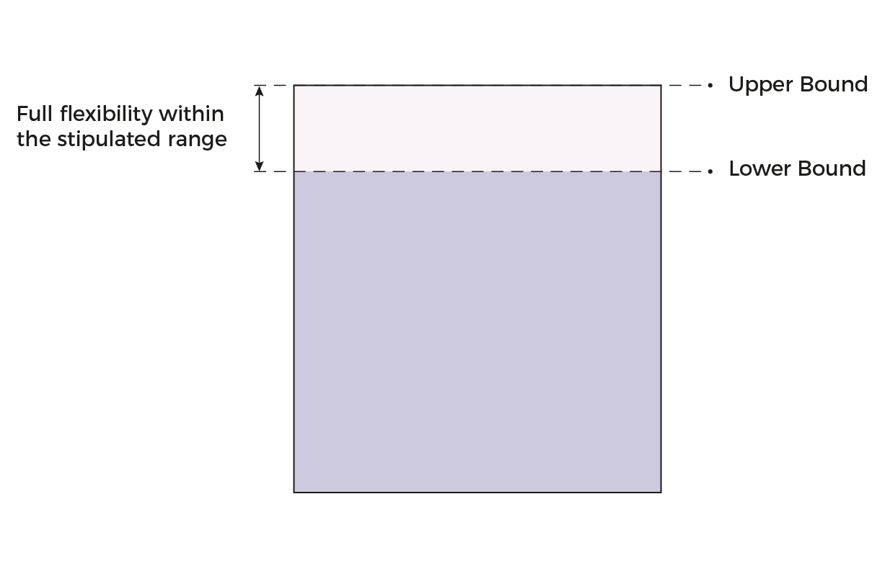

# GFA Handbook

**ADVISORY NOTE**

The principles and illustrations used in this Gross Floor Area (GFA)
handbook is not exhaustive in covering all building designs. URA
reserves the right to interpret GFA matters based on the specific design
of a development proposal, depending on the merits of the proposal.

*The contents of this handbook was last updated on 28 Sep 2020.*

**GUIDELINES AT A GLANCE**

+-------------+-------------+-------------+-------------+-------------+
| > **Items** | >           | >           | >           | > **GFA**   |
|             |  **Excluded | **Partially |  **Included | >           |
|             | > from      | > Excluded  | > as GFA**  | > **Over    |
|             | > GFA\***   | > as        |             | > and Above |
|             |             | > GFA\***   |             | > Master    |
|             |             |             |             | > Plan      |
|             |             |             |             | >           |
|             |             |             |             | Control\*** |
+=============+=============+=============+=============+=============+
| >           |             |             |             |             |
|  [Automated |             |             |             |             |
| > Teller    |             |             |             |             |
| > Machine   |             |             |             |             |
| > and       |             |             |             |             |
| > Vending   |             |             |             |             |
| > Machine   |             |             |             |             |
| > Kiosk](h  |             |             |             |             |
| ttps://cms. |             |             |             |             |
| ura.gov.sg/ |             |             |             |             |
| Corporate/G |             |             |             |             |
| uidelines/D |             |             |             |             |
| evelopment- |             |             |             |             |
| Control/gro |             |             |             |             |
| ss-floor-ar |             |             |             |             |
| ea/GFA/Open |             |             |             |             |
| Courtyardsa |             |             |             |             |
| ndAirWells) |             |             |             |             |
+-------------+-------------+-------------+-------------+-------------+
| > [Balconi  |             |             |             |             |
| es](https:/ |             |             |             |             |
| /cms.ura.go |             |             |             |             |
| v.sg/Corpor |             |             |             |             |
| ate/Guideli |             |             |             |             |
| nes/Develop |             |             |             |             |
| ment-Contro |             |             |             |             |
| l/gross-flo |             |             |             |             |
| or-area/GFA |             |             |             |             |
| /Balconies) |             |             |             |             |
+-------------+-------------+-------------+-------------+-------------+
| > [Basement |             |             |             |             |
| > Diaphragm |             |             |             |             |
| > Wall      |             |             |             |             |
| ](https://c |             |             |             |             |
| ms.ura.gov. |             |             |             |             |
| sg/Corporat |             |             |             |             |
| e/Guideline |             |             |             |             |
| s/Developme |             |             |             |             |
| nt-Control/ |             |             |             |             |
| gross-floor |             |             |             |             |
| -area/GFA/B |             |             |             |             |
| asementDiap |             |             |             |             |
| hragmWalls) |             |             |             |             |
+-------------+-------------+-------------+-------------+-------------+
| > [Bay      |             |             |             |             |
| > Window    |             |             |             |             |
| s](https:// |             |             |             |             |
| cms.ura.gov |             |             |             |             |
| .sg/Corpora |             |             |             |             |
| te/Guidelin |             |             |             |             |
| es/Developm |             |             |             |             |
| ent-Control |             |             |             |             |
| /gross-floo |             |             |             |             |
| r-area/GFA/ |             |             |             |             |
| BayWindows) |             |             |             |             |
+-------------+-------------+-------------+-------------+-------------+
| > [Bicycle  |             |             |             |             |
| > Parking   |             |             |             |             |
| > Space     |             |             |             |             |
| ](https://c |             |             |             |             |
| ms.ura.gov. |             |             |             |             |
| sg/Corporat |             |             |             |             |
| e/Guideline |             |             |             |             |
| s/Developme |             |             |             |             |
| nt-Control/ |             |             |             |             |
| gross-floor |             |             |             |             |
| -area/GFA/B |             |             |             |             |
| icycleParki |             |             |             |             |
| ngSpacesand |             |             |             |             |
| End-of-Trip |             |             |             |             |
| Facilities) |             |             |             |             |
+-------------+-------------+-------------+-------------+-------------+
| > [Cable    |             |             |             |             |
| > Chamber]( |             |             |             |             |
| https://cms |             |             |             |             |
| .ura.gov.sg |             |             |             |             |
| /Corporate/ |             |             |             |             |
| Guidelines/ |             |             |             |             |
| Development |             |             |             |             |
| -Control/gr |             |             |             |             |
| oss-floor-a |             |             |             |             |
| rea/GFA/Cab |             |             |             |             |
| leChambers) |             |             |             |             |
+-------------+-------------+-------------+-------------+-------------+
| > [Car      |             |             |             |             |
| > Parking   |             |             |             |             |
| > L         |             |             |             |             |
| ot](https:/ |             |             |             |             |
| /cms.ura.go |             |             |             |             |
| v.sg/Corpor |             |             |             |             |
| ate/Guideli |             |             |             |             |
| nes/Develop |             |             |             |             |
| ment-Contro |             |             |             |             |
| l/gross-flo |             |             |             |             |
| or-area/GFA |             |             |             |             |
| /CarParkMot |             |             |             |             |
| orcyclePark |             |             |             |             |
| sandRelated |             |             |             |             |
| Facilities) |             |             |             |             |
+-------------+-------------+-------------+-------------+-------------+
| > [Catw     |             |             |             |             |
| alk](https: |             |             |             |             |
| //cms.ura.g |             |             |             |             |
| ov.sg/Corpo |             |             |             |             |
| rate/Guidel |             |             |             |             |
| ines/Develo |             |             |             |             |
| pment-Contr |             |             |             |             |
| ol/gross-fl |             |             |             |             |
| oor-area/GF |             |             |             |             |
| A/Catwalks) |             |             |             |             |
+-------------+-------------+-------------+-------------+-------------+
| > [Communal |             |             |             |             |
| > Roof      |             |             |             |             |
| > Terr      |             |             |             |             |
| ace](https: |             |             |             |             |
| //cms.ura.g |             |             |             |             |
| ov.sg/Corpo |             |             |             |             |
| rate/Guidel |             |             |             |             |
| ines/Develo |             |             |             |             |
| pment-Contr |             |             |             |             |
| ol/gross-fl |             |             |             |             |
| oor-area/GF |             |             |             |             |
| A/CommunalR |             |             |             |             |
| oofTerrace) |             |             |             |             |
+-------------+-------------+-------------+-------------+-------------+
| > [Covered  |             |             |             |             |
| > Communal  |             |             |             |             |
| > Ground    |             |             |             |             |
| > Ga        |             |             |             |             |
| rdens](http |             |             |             |             |
| s://cms.ura |             |             |             |             |
| .gov.sg/Cor |             |             |             |             |
| porate/Guid |             |             |             |             |
| elines/Deve |             |             |             |             |
| lopment-Con |             |             |             |             |
| trol/gross- |             |             |             |             |
| floor-area/ |             |             |             |             |
| GFA/Covered |             |             |             |             |
| CommunalGro |             |             |             |             |
| undGardens) |             |             |             |             |
+-------------+-------------+-------------+-------------+-------------+
| > [Covered  |             |             |             |             |
| > Enclosed  |             |             |             |             |
| > Spa       |             |             |             |             |
| ce](https:/ |             |             |             |             |
| /cms.ura.go |             |             |             |             |
| v.sg/Corpor |             |             |             |             |
| ate/Guideli |             |             |             |             |
| nes/Develop |             |             |             |             |
| ment-Contro |             |             |             |             |
| l/gross-flo |             |             |             |             |
| or-area/GFA |             |             |             |             |
| /CoveredEnc |             |             |             |             |
| losedSpace) |             |             |             |             |
+-------------+-------------+-------------+-------------+-------------+
| > Covered   |             |             |             |             |
| >           |             |             |             |             |
| Greenhouses |             |             |             |             |
| > / Farms   |             |             |             |             |
+-------------+-------------+-------------+-------------+-------------+
| > [Covered  |             |             |             |             |
| > Swimming  |             |             |             |             |
| > Pool]     |             |             |             |             |
| (https://cm |             |             |             |             |
| s.ura.gov.s |             |             |             |             |
| g/Corporate |             |             |             |             |
| /Guidelines |             |             |             |             |
| /Developmen |             |             |             |             |
| t-Control/g |             |             |             |             |
| ross-floor- |             |             |             |             |
| area/GFA/Sw |             |             |             |             |
| immingPool) |             |             |             |             |
+-------------+-------------+-------------+-------------+-------------+
| > [Covered  |             |             |             |             |
| > Water     |             |             |             |             |
| > Featu     |             |             |             |             |
| re](https:/ |             |             |             |             |
| /cms.ura.go |             |             |             |             |
| v.sg/Corpor |             |             |             |             |
| ate/Guideli |             |             |             |             |
| nes/Develop |             |             |             |             |
| ment-Contro |             |             |             |             |
| l/gross-flo |             |             |             |             |
| or-area/GFA |             |             |             |             |
| /CoveredWat |             |             |             |             |
| erFeatures) |             |             |             |             |
+-------------+-------------+-------------+-------------+-------------+
| > Covered   |             |             |             |             |
| > Walkway   |             |             |             |             |
+-------------+-------------+-------------+-------------+-------------+
| > [Curtain  |             |             |             |             |
| > Wall~~s~~ |             |             |             |             |
| ](https://c |             |             |             |             |
| ms.ura.gov. |             |             |             |             |
| sg/Corporat |             |             |             |             |
| e/Guideline |             |             |             |             |
| s/Developme |             |             |             |             |
| nt-Control/ |             |             |             |             |
| gross-floor |             |             |             |             |
| -area/GFA/C |             |             |             |             |
| urtainWalla |             |             |             |             |
| ndWallCladd |             |             |             |             |
| ingSystems) |             |             |             |             |
+-------------+-------------+-------------+-------------+-------------+
| > [Drivewa  |             |             |             |             |
| ys](https:/ |             |             |             |             |
| /cms.ura.go |             |             |             |             |
| v.sg/Corpor |             |             |             |             |
| ate/Guideli |             |             |             |             |
| nes/Develop |             |             |             |             |
| ment-Contro |             |             |             |             |
| l/gross-flo |             |             |             |             |
| or-area/GFA |             |             |             |             |
| /CarParkMot |             |             |             |             |
| orcyclePark |             |             |             |             |
| sandRelated |             |             |             |             |
| Facilities) |             |             |             |             |
+-------------+-------------+-------------+-------------+-------------+
| > [End of   |             |             |             |             |
| > Trip      |             |             |             |             |
| >           |             |             |             |             |
|  Facilities |             |             |             |             |
| ](https://c |             |             |             |             |
| ms.ura.gov. |             |             |             |             |
| sg/Corporat |             |             |             |             |
| e/Guideline |             |             |             |             |
| s/Developme |             |             |             |             |
| nt-Control/ |             |             |             |             |
| gross-floor |             |             |             |             |
| -area/GFA/B |             |             |             |             |
| icycleParki |             |             |             |             |
| ngSpacesand |             |             |             |             |
| End-of-Trip |             |             |             |             |
| Facilities) |             |             |             |             |
+-------------+-------------+-------------+-------------+-------------+
| > [Entrance |             |             |             |             |
| > Canopy](h |             |             |             |             |
| ttps://cms. |             |             |             |             |
| ura.gov.sg/ |             |             |             |             |
| Corporate/G |             |             |             |             |
| uidelines/D |             |             |             |             |
| evelopment- |             |             |             |             |
| Control/gro |             |             |             |             |
| ss-floor-ar |             |             |             |             |
| ea/GFA/Entr |             |             |             |             |
| anceCanopy) |             |             |             |             |
+-------------+-------------+-------------+-------------+-------------+
| > [Floors   |             |             |             |             |
| > -- Under  |             |             |             |             |
| > a Pitch   |             |             |             |             |
| >           |             |             |             |             |
|  Roof](http |             |             |             |             |
| s://cms.ura |             |             |             |             |
| .gov.sg/Cor |             |             |             |             |
| porate/Guid |             |             |             |             |
| elines/Deve |             |             |             |             |
| lopment-Con |             |             |             |             |
| trol/gross- |             |             |             |             |
| floor-area/ |             |             |             |             |
| GFA/Floors) |             |             |             |             |
+-------------+-------------+-------------+-------------+-------------+
| > [Floors   |             |             |             |             |
| > -- Under  |             |             |             |             |
| > a         |             |             |             |             |
| > Pla       |             |             |             |             |
| tform](http |             |             |             |             |
| s://cms.ura |             |             |             |             |
| .gov.sg/Cor |             |             |             |             |
| porate/Guid |             |             |             |             |
| elines/Deve |             |             |             |             |
| lopment-Con |             |             |             |             |
| trol/gross- |             |             |             |             |
| floor-area/ |             |             |             |             |
| GFA/Floors) |             |             |             |             |
+-------------+-------------+-------------+-------------+-------------+
| > [Floors   |             |             |             |             |
| > --        |             |             |             |             |
| > Interme   |             |             |             |             |
| diate](http |             |             |             |             |
| s://cms.ura |             |             |             |             |
| .gov.sg/Cor |             |             |             |             |
| porate/Guid |             |             |             |             |
| elines/Deve |             |             |             |             |
| lopment-Con |             |             |             |             |
| trol/gross- |             |             |             |             |
| floor-area/ |             |             |             |             |
| GFA/Floors) |             |             |             |             |
+-------------+-------------+-------------+-------------+-------------+
| > [Floors   |             |             |             |             |
| > --        |             |             |             |             |
| > Perfo     |             |             |             |             |
| rated](http |             |             |             |             |
| s://cms.ura |             |             |             |             |
| .gov.sg/Cor |             |             |             |             |
| porate/Guid |             |             |             |             |
| elines/Deve |             |             |             |             |
| lopment-Con |             |             |             |             |
| trol/gross- |             |             |             |             |
| floor-area/ |             |             |             |             |
| GFA/Floors) |             |             |             |             |
+-------------+-------------+-------------+-------------+-------------+
| >           |             |             |             |             |
| [Guardhouse |             |             |             |             |
| > and       |             |             |             |             |
| > Sentry    |             |             |             |             |
| > Post](    |             |             |             |             |
| https://cms |             |             |             |             |
| .ura.gov.sg |             |             |             |             |
| /Corporate/ |             |             |             |             |
| Guidelines/ |             |             |             |             |
| Development |             |             |             |             |
| -Control/gr |             |             |             |             |
| oss-floor-a |             |             |             |             |
| rea/GFA/Gua |             |             |             |             |
| rdhouseandS |             |             |             |             |
| entryPosts) |             |             |             |             |
+-------------+-------------+-------------+-------------+-------------+
| >           |             |             |             |             |
|  [Household |             |             |             |             |
| > Sh        |             |             |             |             |
| elter](http |             |             |             |             |
| s://cms.ura |             |             |             |             |
| .gov.sg/Cor |             |             |             |             |
| porate/Guid |             |             |             |             |
| elines/Deve |             |             |             |             |
| lopment-Con |             |             |             |             |
| trol/gross- |             |             |             |             |
| floor-area/ |             |             |             |             |
| GFA/Househo |             |             |             |             |
| ldShelters) |             |             |             |             |
+-------------+-------------+-------------+-------------+-------------+
| > [Indoor   |             |             |             |             |
| >           |             |             |             |             |
|  Recreation |             |             |             |             |
| > Space     |             |             |             |             |
| ](https://c |             |             |             |             |
| ms.ura.gov. |             |             |             |             |
| sg/Corporat |             |             |             |             |
| e/Guideline |             |             |             |             |
| s/Developme |             |             |             |             |
| nt-Control/ |             |             |             |             |
| gross-floor |             |             |             |             |
| -area/GFA/I |             |             |             |             |
| ndoorRecrea |             |             |             |             |
| tionSpaces) |             |             |             |             |
+-------------+-------------+-------------+-------------+-------------+
| > [Ledge -- |             |             |             |             |
| >           |             |             |             |             |
|  Air-Condit |             |             |             |             |
| ioner](http |             |             |             |             |
| s://cms.ura |             |             |             |             |
| .gov.sg/Cor |             |             |             |             |
| porate/Guid |             |             |             |             |
| elines/Deve |             |             |             |             |
| lopment-Con |             |             |             |             |
| trol/gross- |             |             |             |             |
| floor-area/ |             |             |             |             |
| GFA/Ledges) |             |             |             |             |
+-------------+-------------+-------------+-------------+-------------+
| > [Ledge -- |             |             |             |             |
| > Fire      |             |             |             |             |
| men's](http |             |             |             |             |
| s://cms.ura |             |             |             |             |
| .gov.sg/Cor |             |             |             |             |
| porate/Guid |             |             |             |             |
| elines/Deve |             |             |             |             |
| lopment-Con |             |             |             |             |
| trol/gross- |             |             |             |             |
| floor-area/ |             |             |             |             |
| GFA/Ledges) |             |             |             |             |
+-------------+-------------+-------------+-------------+-------------+
| > [Ledge -- |             |             |             |             |
| > Sun       |             |             |             |             |
| > Shading   |             |             |             |             |
| > Pu        |             |             |             |             |
| rpose](http |             |             |             |             |
| s://cms.ura |             |             |             |             |
| .gov.sg/Cor |             |             |             |             |
| porate/Guid |             |             |             |             |
| elines/Deve |             |             |             |             |
| lopment-Con |             |             |             |             |
| trol/gross- |             |             |             |             |
| floor-area/ |             |             |             |             |
| GFA/Ledges) |             |             |             |             |
+-------------+-------------+-------------+-------------+-------------+
| > [Letter   |             |             |             |             |
| > Boxes     |             |             |             |             |
| ](https://c |             |             |             |             |
| ms.ura.gov. |             |             |             |             |
| sg/Corporat |             |             |             |             |
| e/Guideline |             |             |             |             |
| s/Developme |             |             |             |             |
| nt-Control/ |             |             |             |             |
| gross-floor |             |             |             |             |
| -area/GFA/L |             |             |             |             |
| etterBoxes) |             |             |             |             |
+-------------+-------------+-------------+-------------+-------------+
| > [Lift     |             |             |             |             |
| > Lobbies   |             |             |             |             |
| > within    |             |             |             |             |
| > Car Park  |             |             |             |             |
| > Flo       |             |             |             |             |
| or](https:/ |             |             |             |             |
| /cms.ura.go |             |             |             |             |
| v.sg/Corpor |             |             |             |             |
| ate/Guideli |             |             |             |             |
| nes/Develop |             |             |             |             |
| ment-Contro |             |             |             |             |
| l/gross-flo |             |             |             |             |
| or-area/GFA |             |             |             |             |
| /CarParkMot |             |             |             |             |
| orcyclePark |             |             |             |             |
| sandRelated |             |             |             |             |
| Facilities) |             |             |             |             |
+-------------+-------------+-------------+-------------+-------------+
| > [Lift     |             |             |             |             |
| > Motor     |             |             |             |             |
| > Room](    |             |             |             |             |
| https://cms |             |             |             |             |
| .ura.gov.sg |             |             |             |             |
| /Corporate/ |             |             |             |             |
| Guidelines/ |             |             |             |             |
| Development |             |             |             |             |
| -Control/gr |             |             |             |             |
| oss-floor-a |             |             |             |             |
| rea/GFA/Lif |             |             |             |             |
| tMotorRoom) |             |             |             |             |
+-------------+-------------+-------------+-------------+-------------+
| > [Lift     |             |             |             |             |
| > Sha       |             |             |             |             |
| ft](https:/ |             |             |             |             |
| /cms.ura.go |             |             |             |             |
| v.sg/Corpor |             |             |             |             |
| ate/Guideli |             |             |             |             |
| nes/Develop |             |             |             |             |
| ment-Contro |             |             |             |             |
| l/gross-flo |             |             |             |             |
| or-area/GFA |             |             |             |             |
| /LiftShaft) |             |             |             |             |
+-------------+-------------+-------------+-------------+-------------+
| > [Linka    |             |             |             |             |
| ges](https: |             |             |             |             |
| //cms.ura.g |             |             |             |             |
| ov.sg/Corpo |             |             |             |             |
| rate/Guidel |             |             |             |             |
| ines/Develo |             |             |             |             |
| pment-Contr |             |             |             |             |
| ol/gross-fl |             |             |             |             |
| oor-area/GF |             |             |             |             |
| A/Linkages) |             |             |             |             |
+-------------+-------------+-------------+-------------+-------------+
| > Loading   |             |             |             |             |
| > and       |             |             |             |             |
| > Unloading |             |             |             |             |
| > Bay       |             |             |             |             |
+-------------+-------------+-------------+-------------+-------------+
| > Loading   |             |             |             |             |
| > and       |             |             |             |             |
| > Unloading |             |             |             |             |
| > Platforms |             |             |             |             |
+-------------+-------------+-------------+-------------+-------------+
| > [Metal    |             |             |             |             |
| > Ceiling   |             |             |             |             |
| > Grid]     |             |             |             |             |
| (https://cm |             |             |             |             |
| s.ura.gov.s |             |             |             |             |
| g/Corporate |             |             |             |             |
| /Guidelines |             |             |             |             |
| /Developmen |             |             |             |             |
| t-Control/g |             |             |             |             |
| ross-floor- |             |             |             |             |
| area/GFA/Me |             |             |             |             |
| talCeilingG |             |             |             |             |
| ridswithinI |             |             |             |             |
| ndoorPerfor |             |             |             |             |
| manceVenue) |             |             |             |             |
+-------------+-------------+-------------+-------------+-------------+
| > [Meter    |             |             |             |             |
| > Compar    |             |             |             |             |
| tment](http |             |             |             |             |
| s://cms.ura |             |             |             |             |
| .gov.sg/Cor |             |             |             |             |
| porate/Guid |             |             |             |             |
| elines/Deve |             |             |             |             |
| lopment-Con |             |             |             |             |
| trol/gross- |             |             |             |             |
| floor-area/ |             |             |             |             |
| GFA/MeterCo |             |             |             |             |
| mpartments) |             |             |             |             |
+-------------+-------------+-------------+-------------+-------------+
| > [M&E      |             |             |             |             |
| > Space --  |             |             |             |             |
| > With      |             |             |             |             |
| > Limited   |             |             |             |             |
| > Headro    |             |             |             |             |
| om](https:/ |             |             |             |             |
| /cms.ura.go |             |             |             |             |
| v.sg/Corpor |             |             |             |             |
| ate/Guideli |             |             |             |             |
| nes/Develop |             |             |             |             |
| ment-Contro |             |             |             |             |
| l/gross-flo |             |             |             |             |
| or-area/GFA |             |             |             |             |
| /Mechanical |             |             |             |             |
| andElectric |             |             |             |             |
| alMESpaces) |             |             |             |             |
+-------------+-------------+-------------+-------------+-------------+
| > [M&E      |             |             |             |             |
| > Space --  |             |             |             |             |
| > Within    |             |             |             |             |
| > Basement  |             |             |             |             |
| > Car Park  |             |             |             |             |
| > Flo       |             |             |             |             |
| or](https:/ |             |             |             |             |
| /cms.ura.go |             |             |             |             |
| v.sg/Corpor |             |             |             |             |
| ate/Guideli |             |             |             |             |
| nes/Develop |             |             |             |             |
| ment-Contro |             |             |             |             |
| l/gross-flo |             |             |             |             |
| or-area/GFA |             |             |             |             |
| /Mechanical |             |             |             |             |
| andElectric |             |             |             |             |
| alMESpaces) |             |             |             |             |
+-------------+-------------+-------------+-------------+-------------+
| > [M&E      |             |             |             |             |
| > Space --  |             |             |             |             |
| > Enclosed  |             |             |             |             |
| > by Chain  |             |             |             |             |
| > Link      |             |             |             |             |
| > Fence on  |             |             |             |             |
| > Car Park  |             |             |             |             |
| > Flo       |             |             |             |             |
| or](https:/ |             |             |             |             |
| /cms.ura.go |             |             |             |             |
| v.sg/Corpor |             |             |             |             |
| ate/Guideli |             |             |             |             |
| nes/Develop |             |             |             |             |
| ment-Contro |             |             |             |             |
| l/gross-flo |             |             |             |             |
| or-area/GFA |             |             |             |             |
| /Mechanical |             |             |             |             |
| andElectric |             |             |             |             |
| alMESpaces) |             |             |             |             |
+-------------+-------------+-------------+-------------+-------------+
| >           |             |             |             |             |
| [Motorcycle |             |             |             |             |
| > Parking   |             |             |             |             |
| > L         |             |             |             |             |
| ot](https:/ |             |             |             |             |
| /cms.ura.go |             |             |             |             |
| v.sg/Corpor |             |             |             |             |
| ate/Guideli |             |             |             |             |
| nes/Develop |             |             |             |             |
| ment-Contro |             |             |             |             |
| l/gross-flo |             |             |             |             |
| or-area/GFA |             |             |             |             |
| /CarParkMot |             |             |             |             |
| orcyclePark |             |             |             |             |
| sandRelated |             |             |             |             |
| Facilities) |             |             |             |             |
+-------------+-------------+-------------+-------------+-------------+
| > Open      |             |             |             |             |
| >           |             |             |             |             |
|  Courtyards |             |             |             |             |
| > and Air   |             |             |             |             |
| > Wells     |             |             |             |             |
| >           |             |             |             |             |
|  (Pre-1960) |             |             |             |             |
+-------------+-------------+-------------+-------------+-------------+
| > [Outdoor  |             |             |             |             |
| >           |             |             |             |             |
| Refreshment |             |             |             |             |
| > Area]     |             |             |             |             |
| (https://cm |             |             |             |             |
| s.ura.gov.s |             |             |             |             |
| g/Corporate |             |             |             |             |
| /Guidelines |             |             |             |             |
| /Developmen |             |             |             |             |
| t-Control/g |             |             |             |             |
| ross-floor- |             |             |             |             |
| area/GFA/Ou |             |             |             |             |
| tdoorRefres |             |             |             |             |
| hmentAreas) |             |             |             |             |
+-------------+-------------+-------------+-------------+-------------+
| > [Outdoor  |             |             |             |             |
| >           |             |             |             |             |
| Refreshment |             |             |             |             |
| > Kiosk](   |             |             |             |             |
| https://cms |             |             |             |             |
| .ura.gov.sg |             |             |             |             |
| /Corporate/ |             |             |             |             |
| Guidelines/ |             |             |             |             |
| Development |             |             |             |             |
| -Control/gr |             |             |             |             |
| oss-floor-a |             |             |             |             |
| rea/GFA/Out |             |             |             |             |
| doorRefresh |             |             |             |             |
| mentKiosks) |             |             |             |             |
+-------------+-------------+-------------+-------------+-------------+
| > [Pavilio  |             |             |             |             |
| ns](https:/ |             |             |             |             |
| /cms.ura.go |             |             |             |             |
| v.sg/Corpor |             |             |             |             |
| ate/Guideli |             |             |             |             |
| nes/Develop |             |             |             |             |
| ment-Contro |             |             |             |             |
| l/gross-flo |             |             |             |             |
| or-area/GFA |             |             |             |             |
| /Pavilions) |             |             |             |             |
+-------------+-------------+-------------+-------------+-------------+
| > [Pick-up/ |             |             |             |             |
| > Drop-off  |             |             |             |             |
| > Poi       |             |             |             |             |
| nt](https:/ |             |             |             |             |
| /cms.ura.go |             |             |             |             |
| v.sg/Corpor |             |             |             |             |
| ate/Guideli |             |             |             |             |
| nes/Develop |             |             |             |             |
| ment-Contro |             |             |             |             |
| l/gross-flo |             |             |             |             |
| or-area/GFA |             |             |             |             |
| /CarParkMot |             |             |             |             |
| orcyclePark |             |             |             |             |
| sandRelated |             |             |             |             |
| Facilities) |             |             |             |             |
+-------------+-------------+-------------+-------------+-------------+
| > [Planter  |             |             |             |             |
| > Boxes -   |             |             |             |             |
| > Communal] |             |             |             |             |
| (https://cm |             |             |             |             |
| s.ura.gov.s |             |             |             |             |
| g/Corporate |             |             |             |             |
| /Guidelines |             |             |             |             |
| /Developmen |             |             |             |             |
| t-Control/g |             |             |             |             |
| ross-floor- |             |             |             |             |
| area/GFA/Pl |             |             |             |             |
| anterBoxes) |             |             |             |             |
+-------------+-------------+-------------+-------------+-------------+
| > [Planter  |             |             |             |             |
| > Boxes -   |             |             |             |             |
| > Private]  |             |             |             |             |
| (https://cm |             |             |             |             |
| s.ura.gov.s |             |             |             |             |
| g/Corporate |             |             |             |             |
| /Guidelines |             |             |             |             |
| /Developmen |             |             |             |             |
| t-Control/g |             |             |             |             |
| ross-floor- |             |             |             |             |
| area/GFA/Pl |             |             |             |             |
| anterBoxes) |             |             |             |             |
+-------------+-------------+-------------+-------------+-------------+
| > [Private  |             |             |             |             |
| > Enclosed  |             |             |             |             |
| > Space](   |             |             |             |             |
| https://cms |             |             |             |             |
| .ura.gov.sg |             |             |             |             |
| /Corporate/ |             |             |             |             |
| Guidelines/ |             |             |             |             |
| Development |             |             |             |             |
| -Control/gr |             |             |             |             |
| oss-floor-a |             |             |             |             |
| rea/GFA/Pri |             |             |             |             |
| vateEnclose |             |             |             |             |
| dSpacesPES) |             |             |             |             |
+-------------+-------------+-------------+-------------+-------------+
| > [Private  |             |             |             |             |
| > Roof      |             |             |             |             |
| > Terr      |             |             |             |             |
| ace](https: |             |             |             |             |
| //cms.ura.g |             |             |             |             |
| ov.sg/Corpo |             |             |             |             |
| rate/Guidel |             |             |             |             |
| ines/Develo |             |             |             |             |
| pment-Contr |             |             |             |             |
| ol/gross-fl |             |             |             |             |
| oor-area/GF |             |             |             |             |
| A/PrivateRo |             |             |             |             |
| ofTerraces) |             |             |             |             |
+-------------+-------------+-------------+-------------+-------------+
| >           |             |             |             |             |
|  [Privately |             |             |             |             |
| > Owned     |             |             |             |             |
| > Public    |             |             |             |             |
| > Spa       |             |             |             |             |
| ce](https:/ |             |             |             |             |
| /cms.ura.go |             |             |             |             |
| v.sg/Corpor |             |             |             |             |
| ate/Guideli |             |             |             |             |
| nes/Develop |             |             |             |             |
| ment-Contro |             |             |             |             |
| l/gross-flo |             |             |             |             |
| or-area/GFA |             |             |             |             |
| /Privately- |             |             |             |             |
| OwnedPublic |             |             |             |             |
| SpacesPOPS) |             |             |             |             |
+-------------+-------------+-------------+-------------+-------------+
| > [Racking  |             |             |             |             |
| > Syste     |             |             |             |             |
| m](https:// |             |             |             |             |
| cms.ura.gov |             |             |             |             |
| .sg/Corpora |             |             |             |             |
| te/Guidelin |             |             |             |             |
| es/Developm |             |             |             |             |
| ent-Control |             |             |             |             |
| /gross-floo |             |             |             |             |
| r-area/GFA/ |             |             |             |             |
| RackingSyst |             |             |             |             |
| emsforStora |             |             |             |             |
| gePurposes) |             |             |             |             |
| > for       |             |             |             |             |
| > Storage   |             |             |             |             |
| > Purpose   |             |             |             |             |
+-------------+-------------+-------------+-------------+-------------+
| > [Recessed |             |             |             |             |
| >           |             |             |             |             |
|  Window](ht |             |             |             |             |
| tps://cms.u |             |             |             |             |
| ra.gov.sg/C |             |             |             |             |
| orporate/Gu |             |             |             |             |
| idelines/De |             |             |             |             |
| velopment-C |             |             |             |             |
| ontrol/gros |             |             |             |             |
| s-floor-are |             |             |             |             |
| a/GFA/Reces |             |             |             |             |
| sedWindows) |             |             |             |             |
+-------------+-------------+-------------+-------------+-------------+
| > [Refuse   |             |             |             |             |
| >           |             |             |             |             |
|  Chamber](h |             |             |             |             |
| ttps://cms. |             |             |             |             |
| ura.gov.sg/ |             |             |             |             |
| Corporate/G |             |             |             |             |
| uidelines/D |             |             |             |             |
| evelopment- |             |             |             |             |
| Control/gro |             |             |             |             |
| ss-floor-ar |             |             |             |             |
| ea/GFA/Refu |             |             |             |             |
| seChambers) |             |             |             |             |
+-------------+-------------+-------------+-------------+-------------+
| > [Refuse   |             |             |             |             |
| > Chute](h  |             |             |             |             |
| ttps://cms. |             |             |             |             |
| ura.gov.sg/ |             |             |             |             |
| Corporate/G |             |             |             |             |
| uidelines/D |             |             |             |             |
| evelopment- |             |             |             |             |
| Control/gro |             |             |             |             |
| ss-floor-ar |             |             |             |             |
| ea/GFA/Refu |             |             |             |             |
| seChambers) |             |             |             |             |
+-------------+-------------+-------------+-------------+-------------+
| >           |             |             |             |             |
| [Reinforced |             |             |             |             |
| > Concrete  |             |             |             |             |
| > Slabs     |             |             |             |             |
| > Within    |             |             |             |             |
| > Voids](h  |             |             |             |             |
| ttps://cms. |             |             |             |             |
| ura.gov.sg/ |             |             |             |             |
| Corporate/G |             |             |             |             |
| uidelines/D |             |             |             |             |
| evelopment- |             |             |             |             |
| Control/gro |             |             |             |             |
| ss-floor-ar |             |             |             |             |
| ea/GFA/Rein |             |             |             |             |
| forcedConcr |             |             |             |             |
| eteRCSlabsw |             |             |             |             |
| ithinVoids) |             |             |             |             |
+-------------+-------------+-------------+-------------+-------------+
| > [Roof     |             |             |             |             |
| > Cove      |             |             |             |             |
| r](https:// |             |             |             |             |
| cms.ura.gov |             |             |             |             |
| .sg/Corpora |             |             |             |             |
| te/Guidelin |             |             |             |             |
| es/Developm |             |             |             |             |
| ent-Control |             |             |             |             |
| /gross-floo |             |             |             |             |
| r-area/GFA/ |             |             |             |             |
| RoofCovers) |             |             |             |             |
+-------------+-------------+-------------+-------------+-------------+
| > [Roof     |             |             |             |             |
| > Eaves and |             |             |             |             |
| > Building  |             |             |             |             |
| >           |             |             |             |             |
| Projections |             |             |             |             |
| > -- Below  |             |             |             |             |
| > 6^th^     |             |             |             |             |
| > Stor      |             |             |             |             |
| ey](https:/ |             |             |             |             |
| /cms.ura.go |             |             |             |             |
| v.sg/Corpor |             |             |             |             |
| ate/Guideli |             |             |             |             |
| nes/Develop |             |             |             |             |
| ment-Contro |             |             |             |             |
| l/gross-flo |             |             |             |             |
| or-area/GFA |             |             |             |             |
| /RoofEavesa |             |             |             |             |
| ndBuildingP |             |             |             |             |
| rojections) |             |             |             |             |
+-------------+-------------+-------------+-------------+-------------+
| > [Roof     |             |             |             |             |
| > Eaves and |             |             |             |             |
| > Building  |             |             |             |             |
| >           |             |             |             |             |
| Projections |             |             |             |             |
| > -- At and |             |             |             |             |
| > Above     |             |             |             |             |
| > 6^th^     |             |             |             |             |
| > Stor      |             |             |             |             |
| ey](https:/ |             |             |             |             |
| /cms.ura.go |             |             |             |             |
| v.sg/Corpor |             |             |             |             |
| ate/Guideli |             |             |             |             |
| nes/Develop |             |             |             |             |
| ment-Contro |             |             |             |             |
| l/gross-flo |             |             |             |             |
| or-area/GFA |             |             |             |             |
| /RoofEavesa |             |             |             |             |
| ndBuildingP |             |             |             |             |
| rojections) |             |             |             |             |
+-------------+-------------+-------------+-------------+-------------+
| > [Shadow   |             |             |             |             |
| > Area --   |             |             |             |             |
| > Elevated  |             |             |             |             |
| > Linkw     |             |             |             |             |
| ay](https:/ |             |             |             |             |
| /cms.ura.go |             |             |             |             |
| v.sg/Corpor |             |             |             |             |
| ate/Guideli |             |             |             |             |
| nes/Develop |             |             |             |             |
| ment-Contro |             |             |             |             |
| l/gross-flo |             |             |             |             |
| or-area/GFA |             |             |             |             |
| /RoofEavesa |             |             |             |             |
| ndBuildingP |             |             |             |             |
| rojections) |             |             |             |             |
+-------------+-------------+-------------+-------------+-------------+
| > Shadow    |             |             |             |             |
| > Area --   |             |             |             |             |
| > Solar     |             |             |             |             |
| > Panel     |             |             |             |             |
+-------------+-------------+-------------+-------------+-------------+
| > [Service  |             |             |             |             |
| > Duct]     |             |             |             |             |
| (https://cm |             |             |             |             |
| s.ura.gov.s |             |             |             |             |
| g/Corporate |             |             |             |             |
| /Guidelines |             |             |             |             |
| /Developmen |             |             |             |             |
| t-Control/g |             |             |             |             |
| ross-floor- |             |             |             |             |
| area/GFA/Se |             |             |             |             |
| rviceDucts) |             |             |             |             |
+-------------+-------------+-------------+-------------+-------------+
| > [Sky      |             |             |             |             |
| > Terrace   |             |             |             |             |
| ](https://c |             |             |             |             |
| ms.ura.gov. |             |             |             |             |
| sg/Corporat |             |             |             |             |
| e/Guideline |             |             |             |             |
| s/Developme |             |             |             |             |
| nt-Control/ |             |             |             |             |
| gross-floor |             |             |             |             |
| -area/GFA/S |             |             |             |             |
| kyTerraces) |             |             |             |             |
+-------------+-------------+-------------+-------------+-------------+
| > [Staircas |             |             |             |             |
| e](https:// |             |             |             |             |
| cms.ura.gov |             |             |             |             |
| .sg/Corpora |             |             |             |             |
| te/Guidelin |             |             |             |             |
| es/Developm |             |             |             |             |
| ent-Control |             |             |             |             |
| /gross-floo |             |             |             |             |
| r-area/GFA/ |             |             |             |             |
| Staircases) |             |             |             |             |
+-------------+-------------+-------------+-------------+-------------+
| >           |             |             |             |             |
|  [Staircase |             |             |             |             |
| > --        |             |             |             |             |
| >           |             |             |             |             |
| Intermediat |             |             |             |             |
| e](https:// |             |             |             |             |
| cms.ura.gov |             |             |             |             |
| .sg/Corpora |             |             |             |             |
| te/Guidelin |             |             |             |             |
| es/Developm |             |             |             |             |
| ent-Control |             |             |             |             |
| /gross-floo |             |             |             |             |
| r-area/GFA/ |             |             |             |             |
| Staircases) |             |             |             |             |
+-------------+-------------+-------------+-------------+-------------+
| >           |             |             |             |             |
|  [Staircase |             |             |             |             |
| > -         |             |             |             |             |
| > Scissor   |             |             |             |             |
| s](https:// |             |             |             |             |
| cms.ura.gov |             |             |             |             |
| .sg/Corpora |             |             |             |             |
| te/Guidelin |             |             |             |             |
| es/Developm |             |             |             |             |
| ent-Control |             |             |             |             |
| /gross-floo |             |             |             |             |
| r-area/GFA/ |             |             |             |             |
| Staircases) |             |             |             |             |
+-------------+-------------+-------------+-------------+-------------+
| >           |             |             |             |             |
|  [Staircase |             |             |             |             |
| > --        |             |             |             |             |
| >           |             |             |             |             |
|  Connecting |             |             |             |             |
| > Virtual   |             |             |             |             |
| > Floor     |             |             |             |             |
| s](https:// |             |             |             |             |
| cms.ura.gov |             |             |             |             |
| .sg/Corpora |             |             |             |             |
| te/Guidelin |             |             |             |             |
| es/Developm |             |             |             |             |
| ent-Control |             |             |             |             |
| /gross-floo |             |             |             |             |
| r-area/GFA/ |             |             |             |             |
| Staircases) |             |             |             |             |
+-------------+-------------+-------------+-------------+-------------+
| >           |             |             |             |             |
|  [Staircase |             |             |             |             |
| > --        |             |             |             |             |
| > Uncovered |             |             |             |             |
| > External  |             |             |             |             |
| >           |             |             |             |             |
|  Perforated |             |             |             |             |
| > Staircas  |             |             |             |             |
| e](https:// |             |             |             |             |
| cms.ura.gov |             |             |             |             |
| .sg/Corpora |             |             |             |             |
| te/Guidelin |             |             |             |             |
| es/Developm |             |             |             |             |
| ent-Control |             |             |             |             |
| /gross-floo |             |             |             |             |
| r-area/GFA/ |             |             |             |             |
| Staircases) |             |             |             |             |
+-------------+-------------+-------------+-------------+-------------+
| >           |             |             |             |             |
|  [Staircase |             |             |             |             |
| > --        |             |             |             |             |
| > Uncovered |             |             |             |             |
| > Staircase |             |             |             |             |
| > to        |             |             |             |             |
| > ES        |             |             |             |             |
| S](https:// |             |             |             |             |
| cms.ura.gov |             |             |             |             |
| .sg/Corpora |             |             |             |             |
| te/Guidelin |             |             |             |             |
| es/Developm |             |             |             |             |
| ent-Control |             |             |             |             |
| /gross-floo |             |             |             |             |
| r-area/GFA/ |             |             |             |             |
| Staircases) |             |             |             |             |
+-------------+-------------+-------------+-------------+-------------+
| >           |             |             |             |             |
| [Unenclosed |             |             |             |             |
| > Faade    |             |             |             |             |
| > Articul   |             |             |             |             |
| ation](http |             |             |             |             |
| s://cms.ura |             |             |             |             |
| .gov.sg/Cor |             |             |             |             |
| porate/Guid |             |             |             |             |
| elines/Deve |             |             |             |             |
| lopment-Con |             |             |             |             |
| trol/gross- |             |             |             |             |
| floor-area/ |             |             |             |             |
| GFA/Unenclo |             |             |             |             |
| sedFacadeAr |             |             |             |             |
| ticulation) |             |             |             |             |
+-------------+-------------+-------------+-------------+-------------+
| > [Void     |             |             |             |             |
| > De        |             |             |             |             |
| ck](https:/ |             |             |             |             |
| /cms.ura.go |             |             |             |             |
| v.sg/Corpor |             |             |             |             |
| ate/Guideli |             |             |             |             |
| nes/Develop |             |             |             |             |
| ment-Contro |             |             |             |             |
| l/gross-flo |             |             |             |             |
| or-area/GFA |             |             |             |             |
| /VoidDecks) |             |             |             |             |
+-------------+-------------+-------------+-------------+-------------+
| > [Walls    |             |             |             |             |
| > and       |             |             |             |             |
| >           |             |             |             |             |
| Columns](ht |             |             |             |             |
| tps://cms.u |             |             |             |             |
| ra.gov.sg/C |             |             |             |             |
| orporate/Gu |             |             |             |             |
| idelines/De |             |             |             |             |
| velopment-C |             |             |             |             |
| ontrol/gros |             |             |             |             |
| s-floor-are |             |             |             |             |
| a/GFA/Walls |             |             |             |             |
| andColumns) |             |             |             |             |
+-------------+-------------+-------------+-------------+-------------+
| > Water     |             |             |             |             |
| > Tanks     |             |             |             |             |
+-------------+-------------+-------------+-------------+-------------+

\*Subject to compliance with requirements and conditions.

**INTRODUCTION**

For development control purpose, Singapore uses a Gross Floor Area (GFA)
system to work out the bulk and intensity of a development. The Gross
Plot Ratio (GPR) for a specific development site is defined as the ratio
of the GFA of a building to its site or plot area^1^. The allowable GPR
of a development is guided by the GPR specified in the Master Plan (MP).

This GFA handbook explains which area or space of a development is
included or excluded from GFA for development control purpose. As a
general principle, all covered floor area of a development and all
uncovered area used for commercial purposes are included as GFA, unless
otherwise exempted. This is regardless of whether the spaces are
accessible or usable.

GFA is the total area of covered floor space measured between the centre
line of party walls, including the thickness of external walls but
excluding voids.

The area of a site/plot measured between the survey boundary lines. If
there are area(s) of the land required to be set aside for Drainage
Reserve or Street/Road Reserve to be vested to the State, these areas
may be included in the site area for GPR calculation. Once these areas
are vested to the State, they cannot be used for GPR calculation
subsequently.

**BONUS GROSS FLOOR AREA ABOVE MP ALLOWABLE INTENSITY**

Bonus GFA is allowed over and above the MP GPR subject to a maximum of
10% of the MP GPR. When the site is redeveloped in future, the
additional GFA already used under the GFA incentive schemes shall not be
carried over. In other words, the GPR for the site shall revert to the
GPR specified in the prevailing MP.

Although a site may make use of multiple GFA incentive schemes, the
total GFA shall not exceed the overall cap of 10% above the MP GPR.
Developments are eligible for the following bonus GFA incentive schemes
if they comply with the relevant guidelines:

  **Bonus GFA Incentive Schemes**                                                                                                                                         
  ----------------------------------------------------------------------------------------------------------------------------------------------------------------------- -------------------------------------------------------
  [**Residential Developments(Flats and Condominiums)**](https://intranet.ura.gov.sg/Corporate/Guidelines/Development-Control/Residential/Flats-Condominiums/Bonus-GFA)   Balcony Incentive Scheme
                                                                                                                                                                          Conserved Bungalow Scheme
                                                                                                                                                                          Indoor Recreation Spaces Scheme
  [**Non-Residential Development(Commercial)**](https://intranet.ura.gov.sg/Corporate/Guidelines/Development-Control/Non-Residential/Commercial/GFA-Incentive-Schemes)    Community and Sports Facilities Scheme
                                                                                                                                                                          Rooftop Outdoor Refreshment Areas on Landscaped Roofs
  [**Non-Residential Development(Hotel)**](https://intranet.ura.gov.sg/Corporate/Guidelines/Development-Control/Non-Residential/Hotel/GFA-Incentive-Schemes)              Balcony Incentive Scheme
                                                                                                                                                                          Rooftop Outdoor Refreshment Areas on Landscaped Roofs

**GFA RELATED MATTERS**

**GFA Apportionment**

If the approved development comprises more than one use, the following
rules shall apply in the calculation of common areas. Such a mixed
development may also arise due to the land use zone, for example the
Commercial & Residential zone.

i.  **Attributable space:** Where a common area is exclusively used for
    a specific purpose, it will be apportioned to the specific use. See
    example below.[ ]{.ul}

> {width="4.408290682414698in"
> height="2.52380905511811in"}

ii. **Non-attributable space**: Where the common area is used for two or
    more purposes, it will be apportioned based on the weighted average,
    pegged to the prescribed use quantum mix in the Master Plan zoning
    of the development. See example below.

> 

The prescribed use quantum mix in the Master Plan zoning is detailed
below:

+-----------------------+-----------------------+--------------------+
| **Master Plan         | **Apportionment of    |                    |
| Zoning**              | Non-Attributable      |                    |
|                       | Space**               |                    |
+=======================+=======================+====================+
| Residential with      | 80% for Residential   | 20% for Commercial |
| Commercial at 1st     |                       |                    |
| storey                |                       |                    |
+-----------------------+-----------------------+--------------------+
| Commercial &          | 60% for Residential   | 40% for Commercial |
| Residential           |                       |                    |
+-----------------------+-----------------------+--------------------+
| Hotel                 | 60% for Hotel         | 40% for Commercial |
+-----------------------+-----------------------+--------------------+
| White                 | 100% for White^\*^    |                    |
+-----------------------+-----------------------+--------------------+
| Business Park         | 85% for Business Park | 15% for White^\*^  |
+-----------------------+-----------------------+--------------------+
| Business Park --      | (100 -- X)% for       |                    |
| White (X)             | Business Park\        |                    |
|                       | (X)% for White^\*^    |                    |
| E.g. Business Park -- |                       |                    |
| White (40)            | 60% for Business      |                    |
|                       | Park\                 |                    |
|                       | 40% for White^\*^     |                    |
+-----------------------+-----------------------+--------------------+
| Business 1 -- White\  | ([Z]{.ul}) x 100% for |                    |
| Y\[B1-Z \]W           | Business 1\           |                    |
|                       | Y                     |                    |
| E.g. Business 1 --    |                       |                    |
| White\                | ([Y - Z ]{.ul}) x     |                    |
| 3.0\[B1-2.5\]W        | 100% for White^\*^\   |                    |
|                       | Y                     |                    |
| Similar apportionment |                       |                    |
| formula applies to    | 83.3% for Business 1\ |                    |
| Business 2 -- White   | 16.7% for White^\*^   |                    |
| developments          |                       |                    |
+-----------------------+-----------------------+--------------------+
| \*Common areas in     |                       |                    |
| White sites with a    |                       |                    |
| single use will be    |                       |                    |
| apportioned to that   |                       |                    |
| proposed use. For     |                       |                    |
| White sites with      |                       |                    |
| multiple uses,        |                       |                    |
| non-attributable      |                       |                    |
| common areas will be  |                       |                    |
| apportioned based on  |                       |                    |
| simple average of the |                       |                    |
| uses. The simple      |                       |                    |
| average apportionment |                       |                    |
| of common area GFA on |                       |                    |
| "white use" floors    |                       |                    |
| will similarly apply  |                       |                    |
| to the White          |                       |                    |
| components of         |                       |                    |
| Business Park,        |                       |                    |
| Business Park-White   |                       |                    |
| and Business-White    |                       |                    |
| zones.                |                       |                    |
+-----------------------+-----------------------+--------------------+

The new apportionment rules will be applied on a per floor basis. If a
floor is occupied by a single use (e.g. Commercial), any vertical
circulation GFA areas like staircases on that floor will be apportioned
to Commercial use, though they may also be used by other users (e.g.
Residential) above for escape purposes. However, if the floor is
occupied by two or more uses^1^ for which the staircase GFA on that
floor cannot be exclusively attributed, they will be regarded as
non-attributable space and apportioned based on weighted average, pegged
to the prescribed use quantum in the Master Plan zoning.

The illustrations above are not exhaustive in covering all possible
building or layout designs. In evaluating the development applications,
URA may, if the circumstances of a case or the planning considerations
relevant to a case so warrant, depart from these rules. Persons
intending to carry out a development are advised to take this into
consideration and check with URA through enquiries or development
applications to confirm the application of the rules on their proposals.

These should comprise actual uses and not common areas. For example, on
full Commercial floors with lift lobbies that serve Hotel uses, vertical
circulation areas like staircases on that floor will be apportioned to
Commercial use. However, on mixed floors with both Hotel and Shop uses,
vertical circulation areas will be apportioned based on weighted
average.

**GFA Apportionment for Sites with Specific Use Quantum Mix in Tender/
Lease Conditions**

For sites where the tender or lease conditions state that the land is to
be developed for a certain use quantum mix, non-attributable common
areas will be apportioned based on the specific use quantum mix stated
in the tender or lease conditions, rather than the Master Plan zoning.
For example, if the lease conditions for a site zoned Commercial require
that the site is to be developed for a use quantum mix of 65% Commercial
and 35% Civic & Community Institution, the non-attributable spaces will
be apportioned based on 65% Commercial and 35% Civic & Community
Institution, rather than 100% Commercial.

For White sites where the tender or lease conditions stipulate a minimum
quantum control on a particular use (e.g. minimum 30% Service
Apartment), this will be taken into account when apportioning the
non-attributable common areas with the balance 70% distributed to the
other uses in the development on a simple average basis. For example, if
the White site has a requirement of minimum 30% Service Apartment use
and the development also has Commercial and Hotel uses, the
apportionment of the non-attributable common areas will be based on 30%
Service Apartment, 35% Commercial and 35% Hotel.

In evaluating the development applications, URA may, if the
circumstances of a case or the planning considerations relevant to a
case so warrant, depart from these rules. Persons intending to carry out
a development are advised to take this into consideration and check with
URA through enquiries or development applications to confirm the
application of the rules on their proposals.

**Re-computation of GFA for Existing Developments**

Prior to 1 Sep 1989, the intensity of residential developments was
determined using the population density (i.e. persons per hectare)
method while that for commercial developments was based on the nett
floor area method (i.e. excluding neutral areas). With effect from 1 Sep
1989, the different methods of determining development intensity for
different types of development were standardised by the current Gross
Floor Area (GFA) method. The GFA was re-defined by counting all covered
floor space within a development (unless specifically exempted) and
including open areas used for commercial purposes.\
\
To determine the intensity of such developments approved before 1 Sep
1989, there is a need to convert the approved GFA of the developments to
the standardised current GFA definition. For such developments, the
approved building would need to be recomputed based on the prevailing
GFA definition.

**Automated Teller Machine and Vending Machine Kiosks**

Kiosk-type structures containing Automated Teller Machines (ATMs) and
vending machines are included as GFA. Standalone ATMs and vending
machine are equipment and they are excluded from GFA.

**Balconies**

Balconies are included as GFA.

{width="3.5319444444444446in"
height="2.4479166666666665in"}

*Balconies*

[Balcony Incentive Scheme -- Bonus GFA]{.ul}

Under the Balcony Incentive Scheme (BIS), balconies may be included as
bonus GFA if they adhere to the BIS guidelines and submission
requirements stated in the Development Control Handbooks. Refer to the
links below for more information on the specific guidelines.

  **Residential Handbook**       [Balcony Incentive Scheme (Flats and Condominium)](https://cms.ura.gov.sg/Corporate/Guidelines/Development-Control/Residential/Flats-Condominiums/Bonus-GFA)
  ------------------------------ --------------------------------------------------------------------------------------------------------------------------------------------------------------
  **Non-Residential Handbook**   [Balcony Incentive Scheme (Hotel)](https://cms.ura.gov.sg/Corporate/Guidelines/Development-Control/Non-Residential/Hotel/GFA-Incentive-Schemes)

**Basement Diaphragm Walls**

Basement diaphragm walls located along the periphery of the basement
structure are excluded from GFA.

**Bay Windows**

Bay windows refer to raised windows not exceeding one structural bay
width and cantilevered at least 0.5m high from the floor. Bay windows,
except those approved before 1^st^ January 2009, are included as GFA.

{width="5.8277777777777775in"
height="4.139583333333333in"}

*Bay Window (Section)*

**Bicycle Parking Spaces and End-of-Trip Facilities**

**Bicycle Parking Spaces**

Bicycle parking spaces provided in accordance with LTA's prevailing
parking provision standards^1^ are excluded from GFA. Bicycle parking
spaces provided over and above LTA's minimum requirements may be
excluded from GFA if assessed by LTA and URA to be reasonable, given the
context of the development.

Such bicycle parking spaces shall be located at a convenient location
for cyclists, taking into consideration the alignment of adjacent
cycling paths/ shared paths, public transportation nodes and amenities.

^1^ Effective date: 8 May 2019. Refer to Circular No.:
URA/PB/2018/03-DCG (Annex A)

**End of Trip Facilities**

Provision of End-of-Trip facilities listed in the table below may be
excluded from GFA.

URA shall consider whether the size of the facility is appropriate,
taking reference from LTA's guidelines on such facilities^1^. The
End-of-Trip facilities shall be located near the bicycle parking spaces
for the convenience of cyclists.

+----------------------+----------------------+----------------------+
| **Development Type** | **Eligible or Not    |                      |
|                      | Eligible**           |                      |
|                      |                      |                      |
|                      | **to be Excluded     |                      |
|                      | from GFA**           |                      |
+======================+======================+======================+
| **Commercial**       | Cinema, Theatre and  | Bicycle supporting   |
|                      | Concert Hall         | facilities are       |
|                      |                      | eligible for         |
|                      |                      | exclusion from GFA,  |
|                      |                      | subject to:          |
|                      |                      |                      |
|                      |                      | -   1 shower stall   |
|                      |                      |     per 10 bicycle   |
|                      |                      |     parking spaces   |
|                      |                      |     (about 1.35sqm   |
|                      |                      |     per shower       |
|                      |                      |     stall)           |
|                      |                      |                      |
|                      |                      | -   Provision and    |
|                      |                      |     size of lockers  |
|                      |                      |     and PMD lockers  |
|                      |                      |     is subject to    |
|                      |                      |     evaluation       |
|                      |                      |                      |
|                      |                      | -   1 toilet per     |
|                      |                      |     cluster of       |
|                      |                      |     facilities       |
|                      |                      |                      |
|                      |                      | -   Facilities       |
|                      |                      |     should be        |
|                      |                      |     located near the |
|                      |                      |     bicycle parking  |
|                      |                      |     spaces for the   |
|                      |                      |     convenience of   |
|                      |                      |     cyclists         |
+----------------------+----------------------+----------------------+
|                      | Shops and            |                      |
|                      | Departmental Stores  |                      |
+----------------------+----------------------+----------------------+
|                      | Offices              |                      |
+----------------------+----------------------+----------------------+
|                      | Restaurants,         |                      |
|                      | Night-clubs,         |                      |
|                      | Coffeehouses, Bars,  |                      |
|                      | Cafeterias,          |                      |
|                      | Eating-houses and    |                      |
|                      | Canteens             |                      |
+----------------------+----------------------+----------------------+
|                      | Convention and       |                      |
|                      | Exhibition Halls     |                      |
+----------------------+----------------------+----------------------+
| **Hotel**            | Hotel                |                      |
+----------------------+----------------------+----------------------+
|                      | Boarding Houses and  |                      |
|                      | Hostels^2^           |                      |
+----------------------+----------------------+----------------------+
| **Industrial**       | Factories            |                      |
+----------------------+----------------------+----------------------+
|                      | Business Park,       |                      |
|                      | Science Park,        |                      |
|                      | Computer Software    |                      |
|                      | Development,         |                      |
|                      | Distribution         |                      |
|                      | Services, Printing,  |                      |
|                      | Publishing and       |                      |
|                      | Allied Industries    |                      |
|                      | and other Business 1 |                      |
|                      | Developments         |                      |
+----------------------+----------------------+----------------------+
|                      | Petroleum,           |                      |
|                      | Petrochemical,       |                      |
|                      | Chemical and related |                      |
|                      | industries on Jurong |                      |
|                      | Island               |                      |
+----------------------+----------------------+----------------------+
| > **Health and       | Nursing Homes        |                      |
| > Medical Care**     |                      |                      |
+----------------------+----------------------+----------------------+
|                      | Clinic, Pharmacies,  |                      |
|                      | Hospitals and Other  |                      |
|                      | Healthcare           |                      |
|                      | Institutions         |                      |
+----------------------+----------------------+----------------------+
| > **Civic and        | Community Centres,   |                      |
| > Community          | Community Clubs,     |                      |
| > Institution**      | Welfare Houses and   |                      |
|                      | other Cultural and   |                      |
|                      | Social Welfare       |                      |
|                      | Institutions         |                      |
+----------------------+----------------------+----------------------+
| > **Place of         | Churches, Mosques,   |                      |
| > Worship**          | Temples, any place   |                      |
|                      | of worship and other |                      |
|                      | religious and        |                      |
|                      | related institutions |                      |
+----------------------+----------------------+----------------------+
| **Residential**      | Residential          | Bicycle supporting   |
|                      | Development          | facilities are not   |
|                      |                      | eligible for         |
|                      |                      | exclusion from GFA   |
|                      |                      | because facilities   |
|                      |                      | like shower/         |
|                      |                      | changing rooms are   |
|                      |                      | provided as          |
|                      |                      | essential or basic   |
|                      |                      | amenities within a   |
|                      |                      | home or clubhouse.   |
+----------------------+----------------------+----------------------+
|                      | Retirement Housing   |                      |
+----------------------+----------------------+----------------------+
| **Civic and**        | Foreign Workers'     |                      |
|                      | Dormitories^3^       |                      |
| **Community**        |                      |                      |
|                      |                      |                      |
| **Institution**      |                      |                      |
+----------------------+----------------------+----------------------+
| > **Sports and       | Sports Complex,      | Bicycle supporting   |
| > Recreation**       | Tennis, Squash,      | facilities are not   |
|                      | Badminton, Sepak     | eligible for         |
|                      | Takraw Courts,       | exclusion from GFA   |
|                      | Soccer, Baseball     | because facilities   |
|                      | Pitches, Bowling     | like shower/         |
|                      | Alley, Swimming      | changing rooms/      |
|                      | Pool, Ice/Roller     | lockers are provided |
|                      | Skating Rink,        | as essential or      |
|                      | Recreational Clubs,  | basic amenities of   |
|                      | Golf Range and other | the development.     |
|                      | Sports and           |                      |
|                      | Recreation           |                      |
|                      | Facilities           |                      |
+----------------------+----------------------+----------------------+

^1^ Refer to the Code of Practice (COP) on Street Work Proposals
relating to development works and COP on vehicle parking provision in
development proposals for guidelines on the End-of-Trip facilities.

^2^ This guideline only applies to Backpackers' Hostel. End-of-Trip
facilities provided within Student Hostels, which are akin to
Residential use will not be excluded from GFA.

^3^ The guideline also applies to Foreign Workers' Dormitories located
on Industrial sites.

**Cable Chambers**

**Cable Chambers Integrated with the Main Building**

Cable chambers integrated within the main building are excluded from GFA
if it does not exceed 2.5m in height^1^.

{width="4.888888888888889in"
height="3.4562915573053368in"}

*Cable Chambers Integrated Within Main Building*

^1^ The structural beams shall also be included in the height
computation.

**Standalone Cable Chambers**

Standalone cable chambers that fulfil either criteria below are excluded
from GFA:

-   The height^1^ of the cable chamber, measured from the floor to the
    underside of the upper floor shall not exceed 2.0m; or

-   The combined height^1^ (a + b) shall not exceed 4.5m for Residential
    developments, 5.0m for Commercial developments or 6.0m for
    Industrial or Warehouse developments.

{width="4.162790901137358in"
height="2.6393208661417322in"}

*Example of Standalone Cable Chamber Excluded from GFA*

{width="4.802325021872266in"
height="3.1999267279090113in"}

*Example of Standalone Cable Chamber Excluded from GFA*

^1^ The structural beams shall also be included in the height
computation.

**Car Parks, Motorcycle Parks and Related Facilities**

Vehicle parking related areas on car park floors are excluded from GFA.
This includes car parking lots, driveways, residual areas^1^ and
corridors^2^ leading to a car park lift lobby.

Residual areas incapable of accommodating an additional car park lot.

^2^ Can only be enclosed on up to 3 sides.

**Car Parking Lots**

Car parking lots are excluded from GFA except under the following
circumstances:

-   Private car parking lots that form part of a residential
    strata-titled unit. Such lots are exclusively accessible by a
    residential strata-titled unit and not sited on a common car park
    floor, as illustrated below.

{width="4.2615244969378825in"
height="2.9342104111986003in"}

*Private Car Parking Lot of Strata-Titled Unit*

> For strata landed residential developments, private car park lots may
> be excluded from GFA provided not more than 2 private car park lots
> are proposed per residential unit. The car parking lots shall be
> contiguous to the residential units.

-   Car parking lots provided above the upper bound^1^ for:

    -   Commercial, Hotel and Mixed-use developments;

    -   Residential developments within Central Area; and

    -   Business Parks within 400m of MRT or LRT stations.

-   All private car and lorry parking lots in strata-titled commercial
    and industrial developments. Such lots shall be physically
    contiguous to the strata unit.

With effect from 1 February 2019, under the Range-based Parking
Provision Standards (RPPS), developments can provide any level of
parking provision within the specified range, defined by a lower bound
and an upper bound, without the need for additional approval from LTA.

**Car Porch and Garages in Landed Housing**

Car parking space within a car porch or garage of landed housing is
excluded from GFA.

{width="5.59584208223972in"
height="3.3057852143482065in"}

*Car Parking Space in Landed Housing*

**Driveways**

Driveways are part of the vehicular circulation area. These are excluded
from GFA.

{width="4.903245844269466in"
height="3.8181824146981627in"}

*Covered Driveway*

**Lift Lobbies within Car Park Floors**

Lift lobbies in car park floors are included as GFA. The GFA is limited
to an area equivalent to the size of the lift shaft (including the
thickness of the shaft) or to the actual size of the lift lobby,
whichever is smaller.

**Mechanised Car Parking System**

Car parking lots that form part of a mechanised car parking system
adjacent to residential units are excluded from GFA if they meet the
following requirements:

-   There are no fixed concrete or metal floor slabs or platforms where
    the cars are parked;

-   The car parking spaces are accessed through common areas (e.g.
    staircase landing) as private car parking lots accessible via
    private strata area are included as GFA;

-   The car parking spaces are common property managed by the MCST and
    are not be strata-subdivided; and

-   The car parking spaces are used solely for car parking purposes and
    are annotated on plans as such.

**Motorcycle Parking Lots**

Motorcycle parking lots are excluded from GFA except when they are in
excess of LTA's mandatory requirements (upper bound^1^) for new erection
applications submitted on or after 1 February 2019 for the following new
development types:

-   Commercial, Mixed-use and Hotel developments;

```{=html}
<!-- -->
```
-   Residential development within Central Area; and

-   Business Parks within 400m of MRT or LRT stations.

^1^ With effect from 1 February 2019, under the Range-based Parking
Provision Standards (RPPS), developments can provide any level of
parking provision within the specified range, defined by a lower bound
and an upper bound, without the need for additional approval from LTA.

**Non-Car Parking Areas within a Car Park Floor**

Non-car parking areas and all enclosed areas on car park floors, except
M&E rooms within basement car park floors, are included as GFA.

Examples of such areas include staircases, storage rooms, toilets and
corridors leading to non-car parking uses (e.g. shops on the car park
floor).

{width="6.5in"
height="4.595767716535433in"}

*Non-Car Parking Areas on Car Park Floors*


*Non-Car Parking Areas on Car Park Floors*

**Pick-up/ Drop-off Points**

Pick-up/drop-off points are excluded from GFA.

**Residual Areas on Car Park Floor**

Residual areas incapable of accommodating an additional car park lot and
corridors leading to car park lifts are excluded from GFA.

{width="4.430894575678041in"
height="3.1325885826771653in"}

*Example of Residual Areas on Car Park Floor*

{width="4.839080271216098in"
height="2.61202646544182in"}

*Example of Residual Areas on Car Park Floor*

**Catwalks**

Unenclosed metal perforated catwalk meant for maintenance purposes and
not exceeding 1.0m in width are excluded from GFA.

**Communal Roof Terrace**

Open to sky communal roof terraces managed by the MCST which serve to
provide landscaping and communal facilities for residents in the
development are excluded from GFA.

Covered or enclosed features within these communal roof terraces are
included as GFA.

**Covered Communal Ground Gardens**

Covered Communal Ground Gardens (C2G2) are on-ground greenery spaces at
the 1^st^ storey. Such garden should flow seamlessly between the covered
and uncovered spaces of the 1^st^ storey and designed to be bright and
airy with quality landscaping. There are two types of C2G2:

-   Secondary C2G2

-   Predominant C2G2

All areas of the C2G2 shall be easily accessible to the public and/or
building users during normal opening hours for the development. The
communal ground garden shall not be enclosed and converted to any other
uses in the future. Covered ornamental pond/ reflective pool that forms
part of the communal landscape areas may also be considered as part of
the C2G2.

A landscape plan showing the proposed landscaping scheme and areas
within/beyond the 45-degree line shall be submitted as part of the
development application for assessment of the proposed C2G2.

**Secondary Covered Communal Ground Garden**

Secondary C2G2 are communal landscaped areas on the 1st storey which are
shaded by a structure or a floor or overhang above. These may be
excluded from GFA up to a maximum area defined by a 45-degree line taken
from the edge of the overhead projection. The communal landscaped areas
excluded from GFA within the 45-degree line must be unenclosed,
accessible and contain quality lush landscaping with a variety of
vegetation.

{width="5.991870078740157in"
height="8.263963254593175in"}

*Secondary C2G2 (view high-res illustration here)*

{width="5.880454943132109in"
height="5.121951006124235in"}

*Secondary C2G2 (Section)*

**Predominant C2G2**

For Predominant C2G2, the additional covered areas beyond the 45-degree
line may be considered for exclusion from GFA if the spaces provide
substantial ground greenery with good spatial quality.

For on-ground greenery to qualify as a Predominant C2G2, it shall comply
with the following requirements:

-   The covered garden area should occupy at least 50% of the 1^st^
    storey building footprint;

-   Within the covered garden area, a minimum of 60% shall be lushly
    landscaped while the remaining 40% shall be set aside for meaningful
    communal gathering and activity spaces and unenclosed communal
    facilities. These spaces may include garden paths, playgrounds and
    covered ornamental pools.

-   Covered drop-off points may be considered as part of the C2G2 if
    well-integrated, paved with appropriate material and integrated with
    lush landscaping;

-   Both the covered and uncovered landscaped area shall include
    suitable varieties of plants which are planted in permanent and
    preferably sunken planting beds to enhance the spatial and visual
    quality of the space.

-   As the communal landscaped areas are intended to serve the public
    and/or building users, they shall be easily accessible to the public
    and/or building users during normal opening hours for the
    development^1^. They should also not be tucked away in dark/obscure
    corners which will not be conducive for landscaping as well as
    public use.

While uses like ORA may be proposed within the C2G2, the ORA areas would
be included as GFA. Appropriate design interventions shall be adopted to
minimize easy conversion of areas excluded as GFA to usable commercial
spaces subsequently. The C2G2 should not be easily enclosed and
converted to any other uses in the future.

For example, the communal landscaped areas in a shopping mall shall be
open and accessible to the public during the mall's normal operating
hours.

{width="6.111318897637795in"
height="8.512194881889764in"}

*Predominant C2G2 (view high-res illustration here)*

{width="4.796455599300088in"
height="4.172839020122485in"}

*Predominant C2G2 (Section)*

**Covered Enclosed Space**

Covered enclosed spaces regardless of accessibility, use or height are
included as GFA.


*Covered Enclosed Space (Section)*

**Covered Greenhouses / Farms**

Covered greenhouse / farm spaces (including rooftop urban farms) shall
be computed as GFA. Netting over plants will not constitute covered
areas, and will not be computed as GFA.

**Covered Walkway and Linkages**

1^st^ storey, upper levels and underground pedestrian linkages are
excluded from GFA if they satisfy the following specific requirements
applicable pedestrian linkages.

**Communal** {width="6.488194444444445in"
height="3.714583333333333in"}**s between Buildings (Within a Single
Development)**

Communal sky bridges between buildings within a single development are
excluded from GFA if they comply with the following requirements:

-   The sky bridge shall connect two communal areas within the
    development;

-   The sky bridge shall form part of the communal circulation network
    within the development; and

-   No part of the sky bridge shall be rented out or form part of any
    strata unit.

{width="3.3675207786526684in"
height="5.337814960629921in"}

*Upper Level Pedestrian Linkage (Within a Single Development)*

**Covered Linkways**

Covered linkways are excluded from GFA if they comply with the following
requirements:

-   The covered link way shall be open sided and incorporated as part of
    a landscaping area; and

-   The covered linkway should connect one building to another and it
    shall not form part of the main building.

**Covered Public Walkways**

Covered public walkways are excluded from GFA if they comply with the
following requirements:

-   The covered walkway shall abut an existing/ proposed road at the
    1^st^ storey or face a public pedestrian mall, public open space/
    landscaped area or link two public areas;

-   The covered walkway shall be kept open at all times for public use
    as part of the public pedestrian network; and

-   The covered walkway shall adhere to the respective width
    requirements depending on its location:

  **Types of Covered Walkways**                                                                                                                                                               M**inimum Overall Width\***   **Minimum Clear Width\***
  ------------------------------------------------------------------------------------------------------------------------------------------------------------------------------------------- ----------------------------- ---------------------------
  Walkways within 200m of MRT stations / major transport nodes & Central Area                                                                                                                 3.6                           3.0m
  Walkways between 200 --400m of MRT stations / major transport nodes                                                                                                                         3.0m                          2.4m
  All other walkways                                                                                                                                                                          2.4m                          2.0m
  \*Places with high footfall (e.g. Central Areas, Regional Centres and Key Growth Areas) may have higher width requirements, as stipulated in urban design guidelines or otherwise stated.                                 

{width="6.0172156605424325in"
height="8.230088582677165in"}

*Width of Covered Walkways*

**Elevated Linkways Connecting to Pedestrian Overhead Bridges**

Elevated linkways connecting to pedestrian overhead bridges are excluded
from GFA if they are at least 2.5m in width.

**Jurong Gateway Elevated Pedestrian Network**

Elevated pedestrian linkages within developments that are identified as
key connections under the Jurong Gateway Elevated Pedestrian Network
Plan (JGEPN) are excluded from GFA if they comply with the following
requirements:

-   The clear width of the walkways shall be a minimum of either 5.0m or
    6.0m, as shown in the
    [[JGEPN]{.ul}](http://www.ura.gov.sg/uol/~/media/User%20Defined/URA%20Online/circulars/2015/Mar/dc15-03app2.ashx).
    Elevated walkways exceeding the required width may be excluded from
    GFA depending on merits of the proposal;

-   Vertical circulation points that connect the Elevated Pedestrian
    Network (EPN) with the at-grade pedestrian network shall be provided
    along the EPN at locations shown in the
    [[JGEPN]{.ul}](http://www.ura.gov.sg/uol/~/media/User%20Defined/URA%20Online/circulars/2015/Mar/dc15-03app2.ashx)
    via stairs, lifts and/or escalators;

-   The walkway shall be open and accessible to the public during the
    opening hours of the MRT. Portions of the EPN that also function as
    public pedestrian overhead bridges (POB) across public roads shall
    always be accessible to the public;

-   The internal walkway route within the building that links the
    connection points with adjacent buildings shall be as direct as
    possible. A winding internal walkway route provided with the
    intention of maximising pedestrian flow to retail or other
    commercial uses for commercial considerations shall be deemed an
    internal corridor space and included as GFA;

-   The walkway shall be used strictly for pedestrian movements only.
    Commercial uses are not allowed within the walkway; and

-   Way-finding signages within the elevated walkway shall comply with
    the guidelines stated in the J-Walk Signage Guidelines. Generally,
    clear and prominently displayed signage shall be provided at the
    entrances of the elevated walkways within a development to inform
    pedestrians that they are accessible for public use. Adequate
    signage along the EPN shall be provided to guide pedestrians to the
    MRT Station and other key developments along the EPN.

**Through-Block Links**

Through-block pedestrian links are excluded from GFA if they comply with
the following requirements:

-   The pedestrian link shall run through a building block and connect
    two parcels of public areas (ie main road (excluding service road
    and back lane), public pedestrian promenade /mall and public open
    space/landscaped area);

-   The internal clear width of the pedestrian link shall be at least
    4.0m but no more than 7.0m;

-   Changes in the floor levels of the linkage shall be accommodated by
    ramps; and

-   The pedestrian link shall always be kept open for public use. Clear
    and prominent signages with minimum size of 4.0m^2^ shall be
    displayed above the entrances to inform the public that the linkage
    is open 24 hours for pedestrian use.

{width="6.036549650043744in"
height="4.6548676727909015in"}

*Through-Block Link (Plan)*

{width="5.840707567804024in"
height="3.2306846019247595in"}

*Through-Block Link (Elevation)*

**Underground Pedestrian Links to Rapid Transit Stations**

Underground pedestrian links are excluded from GFA if they have a clear
pedestrian walkway width of:

-   Between 6.0 -- 7.0m for walkway without shops or with shops on only
    one side; or

```{=html}
<!-- -->
```
-   Minimum width of 7.0m for walkway with double-loaded uses.

Walkways greater than 7.0m wide may be excluded from GFA depending on
the merits of the proposal.

{width="4.555157480314961in"
height="2.858406605424322in"}

*Single Loaded Underground Pedestrian Walkway*

{width="4.667982283464567in"
height="2.92920384951881in"}

*Double Loaded Underground Pedestrian Walkway*

**Upper Level Pedestrian Linkways (Across Different Developments)**

Upper level pedestrian links between different developments are excluded
from GFA if they comply with the following requirements:

-   The link shall connect two common public areas at upper floors and
    be used for circulation only;

-   The link shall span across a minor road. However, links that span
    across the development boundary may be considered;

-   The internal clear width of the link shall be at least 4.0m and up
    to 7.0m. If the connection is to a pedestrian overhead bridge, the
    minimum width shall be 2.5m; and

-   The link shall remain open during normal business operation hours
    for public use. The link shall be directly accessible via lifts or
    staircases from the 1st storey public lobby.

{width="4.098584864391951in"
height="5.835821303587052in"}

*Upper Level Pedestrian Linkways (Across Different Developments)*

**Covered Water Features**

Covered ornamental pond/ reflective pool that forms part of the communal
landscape deck at the 1^st^ storey is excluded from GFA. Such area is
delineated by the 45-degree line taken from the edge of the floor or
overhang above the landscaped deck.

**Curtain Wall and Wall Cladding Systems**

For buildings with curtain walls or wall cladding systems fixed onto the
main structure, the GFA is measured up to the edge of the main
structural floor slab.

If there are external walls, the GFA is measured up to the thickness of
the external walls excluding the curtain wall or wall cladding system.

{width="3.6354166666666665in"
height="3.11411198600175in"}

*Curtain Wall (Section)*

{width="3.8183737970253717in"
height="3.2708333333333335in"}

*Wall Cladding System (Section)*

**Entrance Canopy**

For every development, only one entrance canopy is excluded from GFA.

**Floors**

**Floor Under a Pitch Roof**

If the height of the roof measured from the springing line to the ridge
is equal to or greater than 1.5m, the floor under the roof is included
as GFA.

{width="6.636711504811898in"
height="3.6041666666666665in"}

*Floor under a Pitch Roof*

**Floor under a Raised Platform**

If the height of the raised platform measured from the floor to the
underside of the raised platform is greater than 1.5m, the area under
such raised platform is included as GFA.

{width="5.465117016622922in"
height="2.552727471566054in"}

*Floor under a Raised Platform (Section)*

**Intermediate Floors**

Intermediate load-bearing floors are included as GFA.

{width="4.453488626421697in"
height="3.899604111986002in"}

*Intermediate Load-bearing Floors*

**Perforated Floors**

Covered perforated floors are included as GFA regardless of the type of
material used for the floor.

{width="5.027777777777778in"
height="2.5746806649168854in"}

*Covered Perforated Floors*

**\
**

**Guardhouse and Sentry Posts**

Guardhouse and sentry posts, regardless of size, are included as GFA.

**Household Shelters**

Household shelters are included GFA.

Specific areas created as a result of a household shelter may be
excluded from GFA:

-   The part of the household shelter core that extends into the
    building foundation.

-   If the reinforced concrete (RC) slab is located at an intermediate
    level between floors.

-   If the reinforced concrete (RC) slab is located at the roof level.

{width="5.008264435695538in"
height="3.0299431321084866in"}

*Household Shelters*

**Indoor Recreation Spaces**

Indoor recreation spaces are included as GFA.

[Indoor Recreation Space Incentive Scheme -- Bonus GFA]{.ul}

Under the Indoor Recreation Space Incentive Scheme (IRSIS), indoor
recreation spaces for private non-landed residential developments and
the residential component of mixed-use developments may be included as
bonus GFA if they adhere to the IRSIS guidelines and submission
requirements stated in the Development Control Handbook. Refer to the
link below for more information on the specific guidelines.

  -------------------------- -------------------------------------------------------------------------------------------------------------------------------------------------------------------
  **Residential Handbook**   [Indoor Recreation Space Incentive Scheme](https://intranet.ura.gov.sg/Corporate/Guidelines/Development-Control/Residential/Flats-Condominiums/Balconies-PES-PRT)
  -------------------------- -------------------------------------------------------------------------------------------------------------------------------------------------------------------

**Ledges**

**Air-Conditioner Ledges**

Air-conditioner (A/C) ledges not exceeding 1.0m in width, as measured
perpendicularly from the external wall are excluded from GFA. For AC
ledges exceeding 1.0m in width, the entire ledge is included as GFA.

{width="5.419419291338583in"
height="3.9391305774278216in"}

*Air-Conditioner Ledges*

**Firemen's Ledges**

Firemen's ledges are excluded from GFA if they comply with the following
requirements:

-   Does not exceed 1.0m in width for non-residential developments and
    1.4m in width for residential developments;

-   No railing or parapet wall; and

-   Located at the external faade.

For firemen's ledge exceeding 1.0m in width for non-residential
developments and 1.4m in width for residential development, the
additional area is included as GFA.

**Reinforced Concrete Ledge for Sun Shading Purposes**

Reinforced Concrete (RC) ledges meant for sun-shading purposes are
excluded from GFA if they comply with the following requirements:

-   Does not exceed 2.0m in width;

-   No railing or parapet wall; and

-   Located at the external faade.

For RC ledges exceeding 2.0m in width, the area to be excluded from GFA
is only up to 2.0m in width.

**Letter Boxes**

Letter boxes located within car park floors are excluded from GFA except
when they form an enclosed area. The enclosed area, including the letter
boxes will be included as GFA.

{width="5.359064960629921in"
height="3.346153762029746in"}

*Letter Boxes Included as GFA*

{width="4.912478127734033in"
height="3.0673075240594927in"}

*Letter Boxes Excluded from GFA*

**Lift Motor Room**

Lift motor rooms with headroom exceeding 1.8m are included as GFA.

{width="4.563351924759405in"
height="2.8645833333333335in"}

*Lift Motor Room*

**Lift Shaft**

Lift shafts, including the thickness of the walls, are included as GFA
at the lowest floor.


*Lift Shaft*

**Loading and Unloading Bays**

Loading and unloading bays on the same level as a driveway are excluded
from GFA.

**Loading and Unloading Platforms**

Raised loading and unloading platforms, which are not on the same level
as a driveway, are included as GFA.

**Mechanical and Electrical (M&E) Spaces**

**Mechanical and Electrical Floor with Limited Headroom**

M&E floors with headroom of up to 1.8m are excluded from GFA. The height
of the M&E floor is measured from the floor to the underside of the
upper floor. As suspended or false ceiling is not a floor per se, such
ceiling is not considered an upper floor.

For M&E floors with varying headroom (i.e. the height of the headroom
varies from below 1.8m to exceeding 1.8m), the entire floor is included
as GFA.

{width="4.35042760279965in"
height="2.6849496937882766in"}

*M&E Floor with Limited Headroom*

**Mechanical and Electrical Rooms within Basement Car Park**

M&E rooms (including bin centres and substations) within fully sunken
common basement carparks are excluded from GFA.

**Mechanical and Electrical Floors for Hotel and Commercial
Developments**

Under the Landscaping for Urban Spaces and High-Rises (LUSH) scheme,
activity-generating and sustainability-related uses are encouraged on
the rooftop of either new commercial and hotel developments or
commercial and hotel developments undergoing major additions and
alterations / re-development.

Activity-generating uses include F&B and sustainability-related uses
include urban farms^1^, communal roof gardens, greenery and solar
panels.

Rooftop M&E services may be transferred from the roof to **[one of the
top three floors]{.ul}** directly below the roof and **[only one such
floor]{.ul}** may be excluded from GFA provided the use of the freed-up
roof space adhere to the following requirements:

-   The urban farm area, solar panels and communal roof gardens shall
    take up a meaningful part of the roof. Any M&E services such as lift
    motor rooms or staircase cores that need to remain on the rooftop
    shall be clustered and neatly integrated with the roof design.
    Applicants shall consider the site context in deciding the most
    appropriate use for the rooftop.

-   URA will take into consideration whether the proposed use on the
    roof top would pose dis-amenity concerns to neighbouring
    developments (e.g. noise, glare). For example, F&B uses are not
    allowed on the rooftops of commercial and hotel developments that
    share common boundaries with residential developments.

Applicants are to take note of the following considerations:

-   F&B uses, whether covered or open-to-sky, are to be included as GFA.

-   For crop protection, covers over rooftop urban farms may be allowed.
    Such covered areas are included as GFA;

-   Covered spaces under solar panels used for landscaping purpose are
    excluded from GFA.

Note: Proposal for activity-generating and sustainability-related uses
on the roof and the associated GFA exclusion for the M&E services
transfer shall be considered based on the merits of the proposal and
subject to URA's evaluation at the development application stage.

^1^ Rooftop urban farms come in various forms, ranging from smaller
scale community-based farming activity and edible gardens, to
larger-scale, highly intensive farming activities conducted on a
commercial basis.

{width="4.7008552055993in"
height="2.6806036745406825in"}

*Transfer of M&E Floor for Hotel and Commercial Developments*

**Mechanical and Electrical Spaces Enclosed by Chain Link Fence on Car
Park Floors**

M&E spaces enclosed by chain-link fencing or low parapet wall on common
car park floors (e.g. above basements) are excluded from GFA.

**Metal Ceiling Grids within Indoor Performance Venue**

Ceiling grids located directly above a stage area within an indoor
performance venue are excluded from GFA.

{width="2.8290594925634296in"
height="2.312211286089239in"}

*Metal Ceiling Grids within Indoor Performance Venue*

**Meter Compartments**

Meter compartments incorporated inside gatepost are excluded from GFA.

**Open Courtyards and Air Wells**

Open courtyards and air wells are recognised as existing GFA only for
developments that existed before or in 1960. For post-1960 developments,
the covering up of such areas are included as GFA.

From 2013 onwards, courtyards and air wells located within strata areas
are to be included as GFA whether they are open or covered, whereas open
courtyards and air wells located in the common areas, are excluded from
GFA.

**\
**

**Outdoor Refreshment Areas**

Outdoor refreshment areas (ORAs) are included as GFA.

[Landscaping for Urban Spaces and High-Rises Scheme -- Bonus GFA]{.ul}

Under the Landscaping for Urban Spaces and High-Rises (LUSH) scheme,
rooftop ORAs may be included as bonus GFA if they adhere to the LUSH
guidelines and submission requirements stated in the Development Control
Handbooks. Refer to the links below for more information on the specific
guidelines.

  **Non-Residential Handbooks**   [LUSH Scheme (Commercial)](https://intranet.ura.gov.sg/Corporate/Guidelines/Development-Control/Non-Residential/Commercial/~/link.aspx?_id=CA13EA4D0A60457B8845D7CD1A60BFD0&_z=z)
  ------------------------------- -----------------------------------------------------------------------------------------------------------------------------------------------------------------------------------
                                  [LUSH Scheme (Hotel)](https://intranet.ura.gov.sg/Corporate/Guidelines/Development-Control/Non-Residential/Hotel/~/link.aspx?_id=B5E7984A24A141379D1642844B912D3C&_z=z)

[Orchard Planning Area -- Bonus GFA]{.ul}

Under prevailing guidelines for Orchard Planning Area, ORAs located next
to the Orchard Pedestrian Mall belt may be included as bonus GFA if they
adhere to the guidelines and submission requirements stated in the
Orchard Planning Area Urban Design Guidelines and Plan. Refer to the
link below for more information on the guidelines.

  ----------------------------- --------------------------------------------------------------------------------------------------------------------------------------------------------
  **Urban Design Guidelines**   [Outdoor Refreshment Area within Orchard](https://intranet.ura.gov.sg/Corporate/Guidelines/Urban-Design/-/media/8DE1AE58FC744E97B787E05D2237D3C4.ashx)
  ----------------------------- --------------------------------------------------------------------------------------------------------------------------------------------------------

[Singapore River Promenade]{.ul}

ORA located along Singapore River Promenade is computed as GFA. This ORA
shall be confined to the boundary of the subject development and defined
by markers, e.g. planters or flower pots. Only retractable awnings,
mounted on the development facades are allowed for the ORA to add more
interest and diversity to the streetscape.

The full frontage of the development along the promenade and pedestrian
mall can be considered for ORA uses, subject to detailed evaluation on
the maximum allowable extent based on the existing site conditions and
compliance with technical requirements. As the proposals sit on state
land, applicants will have to obtain the Temporary Occupational License
(TOL) from SLA or its appointed agent.

  ----------------------------- -------------------------------------------------------------------------------------------------------------------------------------------
  **Urban Design Guidelines**   [Outdoor Refreshment Area along Singapore](https://intranet.ura.gov.sg/Corporate/Guidelines/Urban-Design/Singapore-River) River Promenade
  ----------------------------- -------------------------------------------------------------------------------------------------------------------------------------------

[Within Privately-Owned Public Spaces (POPS) -- Bonus GFA]{.ul}

ORAs within POPs are computed as commercial GFA.

ORAs within POPS may be included as bonus GFA if they adhere to the POPS
guidelines and submission requirements. Refer to the link below for more
information on the guidelines.

+---------------------+-----------------------------------------------+
| **POPS Guidelines** | [Outdoor Refreshment Area within              |
|                     | POPS](https://intranet.uraaz.gov.sg/Corp      |
|                     | orate/Guidelines/Development-Control/gross-fl |
|                     | oor-area/GFA/Privately-OwnedPublicSpacesPOPS) |
|                     |                                               |
|                     |                                              |
+---------------------+-----------------------------------------------+

**Outdoor Refreshment Kiosks\
**\
Outdoor refreshment kiosks (ORKs) are included as GFA.

[Orchard Planning Area -- Bonus GFA]{.ul}

Under prevailing guidelines for Orchard Planning Area, ORKs located next
to the Orchard Pedestrian Mall belt may be included as bonus GFA if they
adhere to the guidelines and submission requirements stated in the
Orchard Planning Area Urban Design Guidelines and Plan. Refer to the
link below for more information on the guidelines.

  ----------------------------- ---------------------------------------------------------------------------------------------------------------------------------------------------------
  **Urban Design Guidelines**   [Outdoor Refreshment Kiosk within Orchard](https://intranet.ura.gov.sg/Corporate/Guidelines/Urban-Design/-/media/8DE1AE58FC744E97B787E05D2237D3C4.ashx)
  ----------------------------- ---------------------------------------------------------------------------------------------------------------------------------------------------------

**Pavilions**

Communal pavilions accessed from common areas and sited within lushly
landscape areas at the 1^st^ storey and rooftop are excluded from GFA if
they meet the requirements listed below:

{width="6.15452646544182in"
height="3.6052635608048993in"}

*Rooftop Communal Pavilion (Section)*

{width="6.549665354330709in"
height="3.5526312335958004in"}

*Rooftop Communal Pavilion (Plan)*

**Pavilions within Residential Developments**

+----------------------------------+----------------------------------+
| **Location**                     | **Requirements & Conditions**    |
+==================================+==================================+
| 1^st^ Storey                     | -   Maximum 50sqm per            |
|                                  |     > pavilion\*.                |
|                                  |                                  |
|                                  | -   The pavilion coverage shall  |
|                                  |     > be counted towards the 50% |
|                                  |     > (max) overall site         |
|                                  |     > coveragecontrol.          |
+----------------------------------+----------------------------------+
| Rooftop                          | Rooftops shall remain            |
|                                  | open-to-sky unless otherwise     |
|                                  | approved by URA.\               |
|                                  | \                                |
|                                  | Where rooftop pavilions are      |
|                                  | allowed, they shall comply with  |
|                                  | the following requirements:      |
|                                  |                                  |
|                                  | -   Maximum 50sqm\* or 50% of    |
|                                  |     > roof coverage, whichever   |
|                                  |     > is lower.                  |
|                                  |                                  |
|                                  | -   For developments which have  |
|                                  |     > reached the allowable      |
|                                  |     > storey heightcontrol, the |
|                                  |     > pavilions shall remain     |
|                                  |     > open-sided when viewed     |
|                                  |     > externally. This is to     |
|                                  |     > ensure that the pavilions  |
|                                  |     > do not form an additional  |
|                                  |     > storey.                    |
|                                  |                                  |
|                                  | -   For developments which have  |
|                                  |     > not reached the allowable  |
|                                  |     > storey height or are not   |
|                                  |     > located within areas       |
|                                  |     > subject to storey height   |
|                                  |     > control, maximum 50%       |
|                                  |     > perimeter enclosure of the |
|                                  |     > rooftop pavilions may be   |
|                                  |     > allowed.                   |
|                                  |                                  |
|                                  | -   Greenery on the rooftop      |
|                                  |     > shall be both enjoyable by |
|                                  |     > the building users and     |
|                                  |     > visible from the           |
|                                  |     > surroundings.              |
|                                  |                                  |
|                                  | -   Plants shall be incorporated |
|                                  |     > on permanent and           |
|                                  |     > preferably sunken          |
|                                  |     > planting, planned with     |
|                                  |     > sufficient soil depth      |
|                                  |     > based on the types of      |
|                                  |     > plants proposed. Some      |
|                                  |     > space shall be set aside   |
|                                  |     > for the provision of       |
|                                  |     > communal facilities and    |
|                                  |     > furniture to enhance the   |
|                                  |     > rooftop.                   |
+----------------------------------+----------------------------------+
| \*The area is defined as the     |                                  |
| area of pavilion measured up to  |                                  |
| the roof eaves line.             |                                  |
+----------------------------------+----------------------------------+

**Pavilions within Non-Residential Developments**

+----------------------------------+----------------------------------+
| **Location**                     | **Requirements & Conditions**    |
+==================================+==================================+
| 1^st^ Storey                     | -   Maximum 50sqm per            |
|                                  |     pavilion\*.                  |
+----------------------------------+----------------------------------+
| Rooftop                          | Rooftops shall remain            |
|                                  | open-to-sky unless otherwise     |
|                                  | approved by URA.                 |
|                                  |                                  |
|                                  | Where rooftop pavilions are      |
|                                  | allowed, they shall comply with  |
|                                  | the following requirements:      |
|                                  |                                  |
|                                  | -   Maximum 500sqm\* or 50% of   |
|                                  |     roof coverage, whichever is  |
|                                  |     lower.                       |
|                                  |                                  |
|                                  | -   For developments which have  |
|                                  |     reached the allowable storey |
|                                  |     height control, the          |
|                                  |     pavilions shall remain       |
|                                  |     open-sided when viewed       |
|                                  |     externally. This is to       |
|                                  |     ensure that the pavilions do |
|                                  |     not form an additional       |
|                                  |     storey.                      |
|                                  |                                  |
|                                  | -   For developments which have  |
|                                  |     not reached the allowable    |
|                                  |     storey height or are not     |
|                                  |     located within areas subject |
|                                  |     to storey height control,    |
|                                  |     maximum 50% perimeter        |
|                                  |     enclosure of the rooftop     |
|                                  |     pavilions may be allowed.    |
|                                  |                                  |
|                                  | -   Greenery on the rooftop      |
|                                  |     shall be both enjoyable by   |
|                                  |     the building users and       |
|                                  |     visible from the             |
|                                  |     surroundings.                |
|                                  |                                  |
|                                  | -   Plants shall be incorporated |
|                                  |     on permanent and preferably  |
|                                  |     sunken planting, planned     |
|                                  |     with sufficient soil depth   |
|                                  |     based on the types of plants |
|                                  |     proposed. Some space shall   |
|                                  |     be set aside for the         |
|                                  |     provision of communal        |
|                                  |     facilities and furniture to  |
|                                  |     enhance the rooftop.         |
+----------------------------------+----------------------------------+
| \*The area is defined as the     |                                  |
| area of pavilion measured up to  |                                  |
| the roof eaves line.             |                                  |
+----------------------------------+----------------------------------+

**Planter Boxes**

**Communal Planter Boxes**

Communal planter boxes are excluded from GFA if they comply with the
following requirements:

-   Maximum width of 1.0m^1^;

-   Minimum depth of 500mm (for planting purposes);

-   To be sufficiently externalised;

Communal planters shall be designed with safety and maintainability
provisions in mind. Low height railings can be provided for safety
purposes.

{width="6.5in"
height="4.759160104986877in"}

*Examples of Communal Planter Boxes Excluded from GFA (Section)*

Planter boxes provided behind full height screening and internalized
planter boxes are included as GFA.
{width="4.854166666666667in"
height="5.541666666666667in"}

*Example of Communal Planter Boxes Included as GFA (Section)*

> {width="5.170786307961505in"
> height="3.650485564304462in"}

*Example of Internalised Communal Planter Boxes (Plan)*

> {width="5.06739501312336in"
> height="3.6899693788276466in"}

*Example of Internalised Communal Planter Boxes (Plan)*

For planter boxes that do not satisfy the abovementioned requirements,
the entire planter box is included as GFA. There is no partial
exclusion.

{width="4.859646762904637in"
height="3.2216491688538933in"}

*Example of Communal Planter Boxes Included as GFA (Plan)*

Communal planter boxes of more than 1.0m wide may be allowed if the
wider planter boxes are part of an overall scheme with design merit.

**Private Planter Boxes**

Private planter boxes located within strata units of both residential
and non-residential developments are included as GFA.

**Private Enclosed Spaces (PES)**

Private enclosed spaces (PES) approved on or after 12^th^ January 2013
are included as GFA.

{width="6.141560586176728in"
height="4.258823272090988in"}

*Private Enclosed Spaces*

[Balcony Incentive Scheme -- Bonus GFA]{.ul}

Under the Balcony Incentive Scheme (BIS), PES for non-landed residential
developments may be included as bonus GFA if they adhere to the BIS
guidelines and submission requirements stated in the Development Control
Handbooks. Refer to the links below for more information on the specific
guidelines.

  -------------------------- ----------------------------------------------------------------------------------------------------------------------------------------------------------------------------------------------------------------------
  **Residential Handbook**   [[Balcony Incentive Scheme (Flats and Condominium)]{.ul}](https://intranet.ura.gov.sg/Corporate/Guidelines/Development-Control/Residential/Flats-Condominiums/~/link.aspx?_id=073E26836E5A406892CF59BA9A501130&_z=z)
  -------------------------- ----------------------------------------------------------------------------------------------------------------------------------------------------------------------------------------------------------------------

**Private Roof Terraces (PRT)**

Private roof terraces (PRT) approved on or after 12^th^ January 2013 are
included as GFA.

{width="6.123476596675416in"
height="4.305882545931759in"}

*Private Roof Terraces*

[Balcony Incentive Scheme -- Bonus GFA]{.ul}

Under the Balcony Incentive Scheme (BIS), PRT^1^ for non-landed
residential developments may be included as bonus GFA if they adhere to
the BIS guidelines and submission requirements stated in the Development
Control Handbooks. Refer to the links below for more information on the
specific guidelines.

  -------------------------- ----------------------------------------------------------------------------------------------------------------------------------------------------------------------------------------------------------------------
  **Residential Handbook**   [[Balcony Incentive Scheme (Flats and Condominium)]{.ul}](https://intranet.ura.gov.sg/Corporate/Guidelines/Development-Control/Residential/Flats-Condominiums/~/link.aspx?_id=073E26836E5A406892CF59BA9A501130&_z=z)
  -------------------------- ----------------------------------------------------------------------------------------------------------------------------------------------------------------------------------------------------------------------

Including private staircases leading directly to the PRT

**Privately-Owned Public Spaces (POPS)**

1^st^ storey covered public spaces may be excluded from GFA under the
Privately-Owned Public Spaces (POPS) scheme if they satisfy the urban
design, operational and eligibility requirements below.

+----------------------------------+----------------------------------+
| **Parameters**                   | **Requirements**                 |
+==================================+==================================+
| **Urban Design Guidelines**      | [Size and Configuration]{.ul}    |
|                                  |                                  |
|                                  | -   The public space area shall  |
|                                  |     be large enough to improve   |
|                                  |     the amenity of the local     |
|                                  |     area and serve as a          |
|                                  |     meaningful space for users.  |
|                                  |     The public space area shall  |
|                                  |     be at least:                 |
|                                  |                                  |
|                                  | ```{=html}                       |
|                                  | <!-- -->                         |
|                                  | ```                              |
|                                  | -   1sqm for every 50sqm of      |
|                                  |     total development GFA; or    |
|                                  |                                  |
|                                  | -   25% of the first-storey      |
|                                  |     built footprint.             |
|                                  |                                  |
|                                  | ```{=html}                       |
|                                  | <!-- -->                         |
|                                  | ```                              |
|                                  | -   Covered public spaces shall  |
|                                  |     have high volume of at least |
|                                  |     two storeys or an            |
|                                  |     appropriate height in        |
|                                  |     proportion to its size.      |
|                                  |                                  |
|                                  | -   At least 75% of the total    |
|                                  |     public space area shall      |
|                                  |     consist of a contiguous      |
|                                  |     space that is regular in     |
|                                  |     shape, subject to detailed   |
|                                  |     evaluation.                  |
|                                  |                                  |
|                                  | [Access and Location]{.ul}       |
|                                  |                                  |
|                                  | -   The public space shall be    |
|                                  |     located at the first storey  |
|                                  |     with a frontage onto a major |
|                                  |     street or pedestrian         |
|                                  |     thoroughfare.                |
|                                  |                                  |
|                                  | -   The public space frontage    |
|                                  |     shall be open and            |
|                                  |     unobstructed to allow for    |
|                                  |     easy pedestrian access and   |
|                                  |     be highly visible from the   |
|                                  |     adjoining street or          |
|                                  |     pedestrian thoroughfare.     |
|                                  |                                  |
|                                  | ```{=html}                       |
|                                  | <!-- -->                         |
|                                  | ```                              |
|                                  | -   The access and circulation   |
|                                  |     within the public space      |
|                                  |     shall be barrier-free and    |
|                                  |     comply with BCA's universal  |
|                                  |     design guidelines.           |
|                                  |                                  |
|                                  | [Public Seating and              |
|                                  | Amenities]{.ul}                  |
|                                  |                                  |
|                                  | -   Public seating shall be      |
|                                  |     provided. The minimum        |
|                                  |     requirement is one seat per  |
|                                  |     20sqm of public space area   |
|                                  |     *(1m of bench/ledge = 2      |
|                                  |     seats).*                     |
|                                  |                                  |
|                                  | -   A variety of seating to      |
|                                  |     cater to different users,    |
|                                  |     age groups and physical      |
|                                  |     abilities is encouraged,     |
|                                  |     e.g. seats with back and arm |
|                                  |     rests are highly encouraged  |
|                                  |     to cater to the elderly;     |
|                                  |     movable seats to allow for   |
|                                  |     interaction, etc.            |
|                                  |                                  |
|                                  | -   The public space may include |
|                                  |     other amenities to encourage |
|                                  |     public use of the space such |
|                                  |     as:                          |
|                                  |                                  |
|                                  |     -   *Design Features: Public |
|                                  |         Art, Water Features;*    |
|                                  |                                  |
|                                  |     -   *Furniture + Equipment:  |
|                                  |         Tables, Play/Exercise    |
|                                  |         Equipment, Built-in      |
|                                  |         Lighting and Audio       |
|                                  |         Equipment for events;    |
|                                  |         and*                     |
|                                  |                                  |
|                                  |     -   *Services: Drinking      |
|                                  |         Fountains, Wi-Fi         |
|                                  |         Connection, Phone        |
|                                  |         Charging Points.*        |
|                                  |                                  |
|                                  | [Shade]{.ul}                     |
|                                  |                                  |
|                                  | -   The public space shall be    |
|                                  |     well shaded to encourage     |
|                                  |     public use throughout the    |
|                                  |     day.                         |
|                                  |                                  |
|                                  | -   Shade may be provided by     |
|                                  |     integration within the       |
|                                  |     building form, by adjacent   |
|                                  |     buildings, trees,            |
|                                  |     canopies/pergolas,           |
|                                  |     adjustable                   |
|                                  |     umbrellas/awnings, and/or    |
|                                  |     landscape elements.          |
|                                  |                                  |
|                                  | -   The material used to provide |
|                                  |     shade shall not result in    |
|                                  |     additional heat retention in |
|                                  |     the public space.            |
|                                  |                                  |
|                                  | -   Sun shadow study shall be    |
|                                  |     undertaken to demonstrate    |
|                                  |     that sufficient shade is     |
|                                  |     provided between 9:00am and  |
|                                  |     4:00pm. Shadow diagrams are  |
|                                  |     to be studied for shadow     |
|                                  |     cast on 21 Jun: at 9am,      |
|                                  |     12:00pm and 4:00pm. For each |
|                                  |     shadow diagram:              |
|                                  |                                  |
|                                  |     -   At least 50% of the      |
|                                  |         total public space area  |
|                                  |         shall be shaded; and     |
|                                  |                                  |
|                                  |     -   At least 50% of public   |
|                                  |         space seating shall be   |
|                                  |         shaded.                  |
|                                  |                                  |
|                                  | [Signage]{.ul}                   |
|                                  |                                  |
|                                  | -   An information plaque shall  |
|                                  |     be installed at a visible    |
|                                  |     and fixed location near the  |
|                                  |     main entrance of the public  |
|                                  |     space.                       |
|                                  |                                  |
|                                  | -   The information plaque shall |
|                                  |     include the following        |
|                                  |     information:                 |
|                                  |                                  |
|                                  |     -   Public Open Space logo   |
|                                  |         measuring at least 30 cm |
|                                  |         by 30 cm;                |
|                                  |                                  |
|                                  |     -   "Open to public 24       |
|                                  |         hours" statement; and    |
|                                  |                                  |
|                                  |     -   Public space owner and   |
|                                  |         their contact            |
|                                  |         information.             |
|                                  |                                  |
|                                  | -   Refer to [Appendix           |
|                                  |     1-1](                        |
|                                  | http://www.ura.gov.sg/uol/-/medi |
|                                  | a/User%20Defined/URA%20Online/ci |
|                                  | rculars/2017/Jan/dc17-02/dc%2017 |
|                                  | -02%20Appendix%201-1.ashx?la=en) |
|                                  |     for the template file in PDF |
|                                  |     (editable in Adobe           |
|                                  |     Illustrator) and high        |
|                                  |     resolution logo image.       |
|                                  |                                  |
|                                  | -   All text on the signage      |
|                                  |     should be highly contrasting |
|                                  |     with the background colour   |
|                                  |     of the sign, at least 20mm   |
|                                  |     in height, and in a highly   |
|                                  |     legible font.                |
|                                  |                                  |
|                                  | -   The signage must be          |
|                                  |     constructed of highly        |
|                                  |     durable material such as     |
|                                  |     metal or stone that is fully |
|                                  |     opaque and non-reflective.   |
|                                  |                                  |
|                                  | -   The signage should be        |
|                                  |     integrated with other        |
|                                  |     signage in the same vicinity |
|                                  |     (if any), to reduce visual   |
|                                  |     clutter.                     |
+----------------------------------+----------------------------------+
| **Operational**                  | The public space:                |
|                                  |                                  |
| **Guidelines**                   | -   Must always be open to the   |
|                                  |     public;                      |
|                                  |                                  |
|                                  | -   Cannot be enclosed and       |
|                                  |     cannot be converted to any   |
|                                  |     other permanent uses in the  |
|                                  |     future; and                  |
|                                  |                                  |
|                                  | -   Must remain as common        |
|                                  |     property, in the event of    |
|                                  |     strata subdivision.          |
|                                  |                                  |
|                                  | ORA within POPS, if any, must    |
|                                  | remain as common property (i.e.  |
|                                  | as part of the public space), in |
|                                  | the event of strata subdivision. |
+----------------------------------+----------------------------------+
| **Eligibility**                  | For the POPS to be excluded from |
|                                  | GFA, it shall be located within  |
| **for GFA Exemption**            | a development frequented by the  |
|                                  | public and situated along        |
|                                  | popular pedestrian routes. These |
|                                  | are typically:                   |
|                                  |                                  |
|                                  | -   Commercial developments /    |
|                                  |     developments with            |
|                                  |     significant commercial       |
|                                  |     component (e.g. offices,     |
|                                  |     business parks, shopping     |
|                                  |     centres, hotels) or Civic &  |
|                                  |     Community institutions and   |
|                                  |     Educational institutions;    |
|                                  |     and                          |
|                                  |                                  |
|                                  | -   Located in Central Area, a   |
|                                  |     Regional / Sub-Regional /    |
|                                  |     Fringe Centre, a Growth Area |
|                                  |     (e.g. Tampines, Jurong East, |
|                                  |     Paya Lebar, Woodlands etc.)  |
|                                  |     or a Town Centre.            |
+----------------------------------+----------------------------------+
| **Extent ofGFA Exemption for    | The GFA exemption applies to the |
| First-Storey Covered Public      | entire covered area of the       |
| Space**                          | public space excluding Outdoor   |
|                                  | Refreshment Areas, if any.       |
+----------------------------------+----------------------------------+
| **(Optional)**                   | [Definition]{.ul}                |
|                                  |                                  |
| **Outdoor Refreshment Area       | An outdoor unenclosed seating    |
| within POPS**                    | area serving a Food & Beverage   |
|                                  | (F&B) unit.                      |
|                                  |                                  |
|                                  | [Use]{.ul}                       |
|                                  |                                  |
|                                  | Primarily used for seating. ORA  |
|                                  | seating is not to be counted     |
|                                  | towards the required POPS        |
|                                  | seating provision.               |
|                                  |                                  |
|                                  | [Location]{.ul}                  |
|                                  |                                  |
|                                  | To be located within Privately   |
|                                  | Owned Public Spaces (POPS) of    |
|                                  | commercial or mixed-use          |
|                                  | developments.                    |
|                                  |                                  |
|                                  | ORA within POPS should not       |
|                                  | impede pedestrian movement,      |
|                                  | obstruct fire engine access,     |
|                                  | safeguarded through-block links, |
|                                  | view corridors and any other     |
|                                  | public open spaces.              |
|                                  |                                  |
|                                  | [Height]{.ul}                    |
|                                  |                                  |
|                                  | Maximum 5m, single storey.       |
|                                  |                                  |
|                                  | [Size]{.ul}                      |
|                                  |                                  |
|                                  | -   The maximum allowable size   |
|                                  |     > for ORAs within POPS is up |
|                                  |     > to 10% of the POPS area    |
|                                  |     > (see Fig.1);               |
|                                  |                                  |
|                                  | -   The area of the ORA shall    |
|                                  |     > not be calculated as part  |
|                                  |     > of the minimum required    |
|                                  |     > size for POPS as           |
|                                  |     > stipulated in the Design   |
|                                  |     > Guidelines for POPS^1^.    |
|                                  |     > The remaining area of the  |
|                                  |     > POPS after deducting the   |
|                                  |     > ORA should be equal to or  |
|                                  |     > larger than the minimum    |
|                                  |     > size required for POPS;    |
|                                  |                                  |
|                                  | Fig.1 Illustrated example for    |
|                                  | ORA within POPS (view high-res   |
|                                  | illu                             |
|                                  | stration[here](https://intranet |
|                                  | .uraaz.gov.sg/-/media/Corporate/ |
|                                  | Guidelines/Development-control/G |
|                                  | FA/GFA-ORA-in-POPS-figure1.jpg)) |
|                                  |                                  |
|                                  | [Structure]{.ul}                 |
|                                  |                                  |
|                                  | -   Designed as                  |
|                                  |     > o                          |
|                                  | utdoor,[unenclosed]{.ul}dining |
|                                  |     > areas;                     |
|                                  |                                  |
|                                  | -   Umbrellas, retractable       |
|                                  |     > canopies and lightweight   |
|                                  |     > structures are allowed;    |
|                                  |                                  |
|                                  | -   Only loose tables, chairs    |
|                                  |     > and approved structures by |
|                                  |     > relevant authorities are   |
|                                  |     > allowed;                   |
|                                  |                                  |
|                                  | -   All furniture or opaque      |
|                                  |     > structures should not      |
|                                  |     > exceed 1.2m high;          |
|                                  |                                  |
|                                  | -   The extent of the ORAs is to |
|                                  |     > be clearly demarcated with |
|                                  |     > boundary markers which are |
|                                  |     > not easily removable e.g.  |
|                                  |     > planters. All structures   |
|                                  |     > and furniture, including   |
|                                  |     > menu stands, displays and  |
|                                  |     > signage, must not encroach |
|                                  |     > beyond the extent of the   |
|                                  |     > approved ORA.              |
|                                  |                                  |
|                                  | [Outdoor Kiosk for food          |
|                                  | preparation]{.ul}                |
|                                  |                                  |
|                                  | Outdoor kiosk for food           |
|                                  | preparation can be allowed       |
|                                  | within the ORA boundary if they  |
|                                  | comply with the following        |
|                                  | guidelines:-                     |
|                                  |                                  |
|                                  | -   Ancillary food preparation   |
|                                  |     > area up to 30sqm. Larger   |
|                                  |     > food preparation areas may |
|                                  |     > be considered on a         |
|                                  |     > case-by-case, subject to   |
|                                  |     > evaluation;                |
|                                  |                                  |
|                                  | -   No major food preparation is |
|                                  |     > allowed;                   |
|                                  |                                  |
|                                  | -   All furniture or opaque      |
|                                  |     > panels, including doors    |
|                                  |     > and internal partitions    |
|                                  |     > should not exceed 1.2m     |
|                                  |     > high;                      |
|                                  |                                  |
|                                  | -   Up to 4m width, with an      |
|                                  |     > additional 1m return, of   |
|                                  |     > the lightweight structure  |
|                                  |     > (if any) can be walled     |
|                                  |     > with full height opaque    |
|                                  |     > panels to conceal          |
|                                  |     > equipment and storage. A   |
|                                  |     > wider width may be         |
|                                  |     > considered on a            |
|                                  |     > case-by-case basis,        |
|                                  |     > subject to evaluation;     |
|                                  |                                  |
|                                  | -   Designed as contiguous with  |
|                                  |     > the seating area;          |
|                                  |                                  |
|                                  | -   For proposals in which an    |
|                                  |     > ORA within POPS is         |
|                                  |     > integrated with an Outdoor |
|                                  |     > Kiosk for food             |
|                                  |     > preparation, the combined  |
|                                  |     > seating area and the       |
|                                  |     > Outdoor Kiosk should not   |
|                                  |     > exceed 150sqm.             |
|                                  |                                  |
|                                  | [Signage]{.ul}                   |
|                                  |                                  |
|                                  | Business names are allowed to be |
|                                  | displayed on the awnings /       |
|                                  | structures. Any third-party     |
|                                  | advertisement signs or sponsor   |
|                                  | logos are not allowed as         |
|                                  | freestanding structures or to be |
|                                  | displayed on the ORA structures. |
|                                  | Any signs will require the       |
|                                  | written approval of Building and |
|                                  | Construction Authority (BCA)     |
|                                  | prior to the installations.      |
|                                  |                                  |
|                                  | [Gross Floor Area]{.ul}          |
|                                  |                                  |
|                                  | ORA within POPS will be          |
|                                  | considered as commercial GFA.    |
|                                  |                                  |
|                                  | For developments which have      |
|                                  | maximised their development      |
|                                  | potential, the proposed ORA      |
|                                  | within POPS can be considered    |
|                                  | over and above the maximum       |
|                                  | intensity stipulated in the      |
|                                  | Master Plan for the site,        |
|                                  | subject to the overall 10% GFA   |
|                                  | bonus cap^\[1\]^for each        |
|                                  | development and the payment of   |
|                                  | Land Betterment Charge as        |
|                                  | assessed by SLA.                 |
|                                  |                                  |
|                                  | As per current practice, all     |
|                                  | additional GFA granted under the |
|                                  | bonus GFA incentive schemes will |
|                                  | not form the future development  |
|                                  | potential of the site upon       |
|                                  | redevelopment.                   |
|                                  |                                  |
|                                  | The additional GFA granted under |
|                                  | this scheme will not be          |
|                                  | transferable for other uses      |
|                                  | elsewhere in the development.    |
|                                  |                                  |
|                                  | ^\[1\]^Refer to Circular No:    |
|                                  | URA/PB/2009/03-DCG dated 29      |
|                                  | April 2009 -- Framework for      |
|                                  | Managing Bonus Gross Floor Area  |
|                                  | Incentives                       |
+----------------------------------+----------------------------------+

**Racking Systems for Storage Purposes**

Racking systems are excluded from GFA if they are standalone modular
racking systems that do not form an integral component of the building
(e.g. not of reinforced concrete construction), and are used for storage
purposes^1^ in industrial developments.

^1^ The storage use should be related to the main industrial use of the
unit/development, and human access to the racking systems should be for
the storage and retrieval of goods only.

**Recessed Windows**

Area under a recessed window, regardless of height of the window, is
included as GFA.

{width="4.270479002624672in"
height="3.033057742782152in"}\
*Recessed Window (Section)*

**Refuse Chambers and Refuse Chutes**

Refuse chutes are excluded from GFA.

Refuse chambers and Discharge Valve (DV) chambers (part of a pneumatic
system) located within fully sunken basement carparks are excluded from
GFA.

Outside of basement carparks, refuse chambers and DV chamber with
headroom of up to 1.8m are excluded from GFA.

{width="4.2719695975503065in"
height="3.2708333333333335in"}

*Refuse Chute and Refuse Chamber (Section)*

{width="3.9270833333333335in"
height="3.006771653543307in"}

*Discharge Valve Chamber (Section)*

**Reinforced Concrete (RC) Slabs within Voids**

Covered RC slabs within voids (including service riser voids and voids
beside storey shelter) are included as GFA.

**Roof Covers**

Roof covers meant to screen off rooftop services may be excluded from
GFA if they comply with the following requirements:

-   The cover shall be non-load bearing and rest on the springing line
    or spring from the main roof; and

-   The covered area shall accommodate only M&E and other service
    equipment.

Besides pitched roofs and other non-load bearing roof, other enclosed
non-usable space at the ceiling level are excluded from GFA.

{width="4.229166666666667in"
height="3.1851148293963254in"}


*Roof Covers for M&E Services*

**Roof Eaves, and Building Projections**

**Roof Eaves located below the 6^th^ Storey**

For areas covered by roof eaves located below the 6^th^ storey, up to
2.0m of the area is excluded from GFA subject to the following
requirements:

-   The roof eaves and sun shading devices shall be column-free and
    shall not be accessible except for maintenance purpose only;

-   The roof eaves and sun shading devices, shall comply with the
    setback requirements from the common boundaries of the development;

-   Roof eaves and sun shading devices facing public roads may be
    allowed within the physical buffer and not within green buffer.

{width="5.230753499562555in"
height="4.190083114610673in"}

*Roof Eaves and Sun Shading Devices below 6^th^ Storey*

{width="5.6528926071741035in"
height="4.674481627296588in"}

*Sun Shading Devices and Building Projection below and above 6^th^
Storey*

**Roof Eaves located at and above the 6^th^ Storey**

For area covered by the roof eaves located at the 6^th^ storey and
above, the entire area is excluded from GFA subject to the following
requirements:

-   The roof eaves and sun shading devices shall be column-free and
    shall not be accessible except for maintenance purpose only;

-   The roof eaves and sun shading devices, shall comply with the
    setback requirements from the common boundaries of the development;

-   Roof eaves and sun shading devices facing public roads may be
    allowed within the physical buffer and not within green buffer.

> {width="5.764763779527559in"
> height="4.223140857392826in"}
>
> *Roof Eaves above 6^th^ Storey*

{width="4.8157895888014in"
height="3.9707972440944883in"}

*Sun Shading Devices above 6^th^ Storey*

{width="5.062497812773404in"
height="4.1862751531058615in"}

*Sun Shading Devices and Building Projection below and above 6^th^
Storey*

**Building Projections located below the 6^th^ Storey**

For areas covered by building projections (e.g. ledges, planter boxes,
bay window, balconies and design features) located below the 6^th^
storey, up to 2.0m of the shadowed area is excluded from GFA subject to
the following requirements:

-   The covered area must not fall within a walled-up enclosed space and
    balcony area;

-   The covered area must be column free and shall not be enclosed on
    the sides;

{width="5.470719597550306in"
height="4.380084208223972in"}

*Building Projections below 6^th^ Storey*

{width="5.380165135608049in"
height="4.446107830271216in"}

*Building Projection below and above 6^th^ Storey*

**Building Projections located at and above the 6^th^ Storey**

For areas covered by building projections (e.g. ledges, planter boxes,
bay window, balconies and design features) located at the 6^th^ storey
and above, the entire shadowed area is excluded from GFA subject to the
following requirements:

-   The covered area must not fall within a walled-up enclosed space and
    balcony area;

-   The covered area must be column free and shall not be enclosed on
    the sides;

> {width="5.7448818897637794in"
> height="4.208577209098863in"}
>
> *Building Projections above 6^th^ Storey*
>
> {width="4.7286909448818895in"
> height="3.900826771653543in"}
>
> *Building Projections above 6^th^ Storey*

{width="5.050349956255468in"
height="4.173554243219598in"}

*Building Projection below and above 6^th^ Storey*

**Columns within 45-Degree Line**

For scenarios where covered areas within the 45-degree line are excluded
from GFA (e.g. Communal Covered Ground Garden and Sky Terraces), the
area shadowed by columns are excluded from GFA.

{width="5.40031605424322in"
height="3.6666666666666665in"}

*Areas Covered by Column within 45-Degree Line*

If the column is excessively large (akin to a wall), the shadowed area
shall be included as GFA. The 45-dgree line for GFA exemption is not
applicable in such instance.

{width="4.239583333333333in"
height="2.878562992125984in"}

*Areas Covered by Wall within 45-Degree Line*

**Elevated Linkways**

Area shadowed by link bridges or elevated linkways (regardless of
height) is excluded from GFA.

{width="4.587173009623797in"
height="6.659810804899387in"}

*Area shadowed by Elevated Linkways*

**Service Ducts**

Service ducts, including the thickness of the walls, are included as GFA
once at the lowest floor, if the vertical shaft is entirely a void
space.

If the service ducts are slabbed over at every floor, the service duct
at each floor is included as GFA. Non- load bearing fire-stop material
to compartmentalise the service ducts are excluded from GFA.

{width="4.87097987751531in"
height="3.0576924759405073in"}

*Service Duct*

**Sky Terraces**

Sky terraces are communal garden spaces provided at the intermediate
storeys of a building. The following requirements shall be complied with
for sky terraces to be excluded from GFA.

{width="6.370717410323709in"
height="3.6716415135608047in"}

*Sky Terrace*

{width="5.925372922134733in"
height="3.393438320209974in"}

*Predominant Sky Terrace*

+----------------------+----------------------+----------------------+
| **Parameter**        | **Sky Terrace**      | **Predominant Sky    |
|                      |                      | Terrace**            |
+======================+======================+======================+
| **Sky terrace area   | Not applicable       | The sky terrace area |
| as % of floor        |                      | within the 45-degree |
| plate**              |                      | line occupies equal  |
|                      |                      | to or more than 60%  |
|                      |                      | of the floor plate.  |
+----------------------+----------------------+----------------------+
| **Perimeter          | At least 40% of the  | At least 60% of the  |
| openness**           | perimeter of the sky | perimeter of the sky |
|                      | terrace is to remain | terrace is open^1^   |
|                      | open^1^ and          | and unenclosed.      |
|                      | unenclosed.          |                      |
+----------------------+----------------------+----------------------+
|                      | Parapet walls shall  |                      |
|                      | not exceed 1.3m in   |                      |
|                      | height to be         |                      |
|                      | considered open.     |                      |
+----------------------+----------------------+----------------------+
| **Depth of sky       | The proposed depth   |                      |
| terrace**            | of the sky terrace   |                      |
|                      | shall be minimally   |                      |
|                      | 5.0m throughout.     |                      |
+----------------------+----------------------+----------------------+
| **Landscaping**      | Plants shall be      |                      |
|                      | incorporated on      |                      |
|                      | permanent and        |                      |
|                      | preferably sunken    |                      |
|                      | planting, planned    |                      |
|                      | with sufficient soil |                      |
|                      | depth based on the   |                      |
|                      | types of plants      |                      |
|                      | proposed.            |                      |
|                      |                      |                      |
|                      | The planting shall   |                      |
|                      | be well              |                      |
|                      | externalized.\       |                      |
|                      | \                    |                      |
|                      | Some space shall be  |                      |
|                      | set aside for the    |                      |
|                      | provision of         |                      |
|                      | communal facilities  |                      |
|                      | and furniture to     |                      |
|                      | enhance the usage of |                      |
|                      | the sky terrace.\    |                      |
|                      | \                    |                      |
|                      | As an alternative to |                      |
|                      | providing sunken     |                      |
|                      | planting beds,       |                      |
|                      | building owners can  |                      |
|                      | provide              |                      |
|                      | well-landscaped,     |                      |
|                      | raised planting beds |                      |
|                      | up to 300mm high,    |                      |
|                      | planted with trees   |                      |
|                      | or shrubs. This      |                      |
|                      | facilitates          |                      |
|                      | compliance with      |                      |
|                      | FSSD's fire safety   |                      |
|                      | requirements on      |                      |
|                      | habitable space.\    |                      |
|                      | \                    |                      |
|                      | The sky terraces     |                      |
|                      | shall be designed    |                      |
|                      | with safety and      |                      |
|                      | maintainability      |                      |
|                      | provisions in mind.  |                      |
+----------------------+----------------------+----------------------+
| **Accessibility and  | The sky terrace      |                      |
| ownership**          | shall be accessible  |                      |
|                      | to all occupants of  |                      |
|                      | the building and     |                      |
|                      | there shall be at    |                      |
|                      | least one set of     |                      |
|                      | communal access via  |                      |
|                      | a lift or staircase  |                      |
|                      | serving the sky      |                      |
|                      | terrace. Secondary   |                      |
|                      | access to the sky    |                      |
|                      | terrace directly     |                      |
|                      | from strata units    |                      |
|                      | are not allowed.     |                      |
|                      | They shall remain as |                      |
|                      | common property in   |                      |
|                      | strata subdivided    |                      |
|                      | developments.\      |                      |
|                      | \                    |                      |
|                      | The layout of sky    |                      |
|                      | terrace floors shall |                      |
|                      | be subject to        |                      |
|                      | evaluation to ensure |                      |
|                      | that the sky terrace |                      |
|                      | space is meant for   |                      |
|                      | communal use and is  |                      |
|                      | not treated as a     |                      |
|                      | privatised space.    |                      |
|                      | For sky terraces in  |                      |
|                      | residential          |                      |
|                      | developments that    |                      |
|                      | occupy less than 60% |                      |
|                      | of the floor plates, |                      |
|                      | the sky terraces     |                      |
|                      | shall serve a        |                      |
|                      | minimum of 2 strata  |                      |
|                      | units to ensure that |                      |
|                      | they remain as       |                      |
|                      | communal space.      |                      |
+----------------------+----------------------+----------------------+
| **Drop panels**      | Where proposed, drop |                      |
|                      | panels at the        |                      |
|                      | perimeter shall be   |                      |
|                      | visually transparent |                      |
|                      | and may be in the    |                      |
|                      | form of louvers,     |                      |
|                      | fins, transparent    |                      |
|                      | glass, or other sun  |                      |
|                      | shading/weather      |                      |
|                      | protective devices.  |                      |
|                      | The panel shall not  |                      |
|                      | exceed one third of  |                      |
|                      | the height of the    |                      |
|                      | external opening.    |                      |
|                      | The area of GFA      |                      |
|                      | exemption^2^as      |                      |
|                      | defined by a         |                      |
|                      | 45-degree line shall |                      |
|                      | be taken from the    |                      |
|                      | underside of any     |                      |
|                      | permanent or opaque  |                      |
|                      | structure, and not   |                      |
|                      | from the underside   |                      |
|                      | of a drop panel.     |                      |
+----------------------+----------------------+----------------------+
| **Additional         | Not eligible         | Refer to Additional  |
| height**             |                      | Height for           |
|                      |                      | Predominant Sky      |
|                      |                      | Terrace Storey       |
|                      |                      | sub-section in the   |
|                      |                      | Residential and      |
|                      |                      | Non-Residential      |
|                      |                      | Handbooks.           |
+----------------------+----------------------+----------------------+
| **GFA exemption**    | For sky terraces     | URA may grant        |
|                      | occupying less than  | additional GFA       |
|                      | 60% of the floor     | exemption for        |
|                      | plate, the maximum   | residual areas       |
|                      | area for GFA         | beyond the 45-degree |
|                      | exemption of sky is  | line (capped at 20%  |
|                      | defined by the area  | of the floor plate   |
|                      | covered by a         | area), if such areas |
|                      | 45-degree line taken | form an integral     |
|                      | from the edge of the | part of the sky      |
|                      | overhead projection. | terrace or are part  |
|                      |                      | of the               |
|                      |                      | barrier-free/fire    |
|                      |                      | escape corridors.    |
+----------------------+----------------------+----------------------+
|                      | Unenclosed BFA and   |                      |
|                      | fire escape          |                      |
|                      | corridors may be     |                      |
|                      | exempted from GFA    |                      |
|                      | computation for all  |                      |
|                      | sky terraces         |                      |
|                      | regardless of size   |                      |
|                      | subject to the       |                      |
|                      | following criteria:  |                      |
|                      |                      |                      |
|                      | -   The corridor     |                      |
|                      |     > lies within    |                      |
|                      |     > the 45-degree  |                      |
|                      |     > exemption      |                      |
|                      |     > area;          |                      |
|                      |                      |                      |
|                      | -   The corridor     |                      |
|                      |     > serves the sky |                      |
|                      |     > terrace; and   |                      |
|                      |                      |                      |
|                      | -   At least 40% of  |                      |
|                      |     > the perimeter  |                      |
|                      |     > of the sky     |                      |
|                      |     > terrace is to  |                      |
|                      |     > remain         |                      |
|                      |     > open^1^and    |                      |
|                      |     > unenclosed.    |                      |
+----------------------+----------------------+----------------------+
| **Submission         | A Landscape Plan and |                      |
| requirements**       | relevant sections    |                      |
|                      | for the sky terrace  |                      |
|                      | showing the proposed |                      |
|                      | landscaping scheme,  |                      |
|                      | planting palette,    |                      |
|                      | soil depth and       |                      |
|                      | communal facilities  |                      |
|                      | shall be submitted   |                      |
|                      | as part of the       |                      |
|                      | Development          |                      |
|                      | Application (see     |                      |
|                      | example below).      |                      |
+----------------------+----------------------+----------------------+

^1^ Parapet walls shall not exceed 1.3m in height to allow for more
openness.

^2^ The 45-degree GFA exemption area may be taken from all external
parapet walls (including recessed external parapet walls) surrounding
the sky terrace.

**Landscape Plan for Sky Terraces**

{width="6.014925634295713in"
height="4.720045931758531in"}

*Example of a Landscape Plan (view high-res illustration here)*

*Landscape Plan template (view high-res illustration
[here](https://cms.ura.gov.sg/Corporate/Guidelines/Development-Control/Residential/Flats-Condominiums/-/media/BB7463BC571947D1A508FD6D2C69010A.ashx))*

**Perimeter Openness Computation for Sky Terraces**

{width="5.331067366579178in"
height="3.151162510936133in"}

*Plan Showing how the Perimeter Openness is Calculated*

**Barrier Free Access and Fire Escape Corridors**


*Example of a Sky Terrace with Barrier Free Access and Fire Escape
Corridor*

**Recessed Walls**

{width="5.833460192475941in"
height="3.4534886264216973in"}

*Example of Area excluded from GFA where there are Recessed Walls*

**Residual Areas**


*Example 1 -- Residual Areas within a Predominant Sky Terrace*

{width="5.086666666666667in"
height="3.4753455818022747in"}

*Example 2 -- Residual Areas within a Predominant Sky Terrace*

**GFA Computation for Sky Terraces**

{width="4.791666666666667in"
height="3.2174814085739283in"}

*Example 1 - GFA Computation for Sky Terrace*

{width="4.989583333333333in"
height="4.324839238845144in"}

*Example 2 - GFA Computation for Predominant Sky Terrace*

**Solar Panels**

Area shadowed by solar panel is excluded from GFA unless the shadowed
area is enclosed, used for commercial uses (e.g. outdoor refreshment
area) or storage purpose.

{width="4.555358705161855in"
height="3.1623293963254593in"}

*Solar Panels on the Roof of High Rise Developments*

{width="5.1310301837270345in"
height="2.895041557305337in"}

*Solar Panels on the Roof of Landed Developments*

**Staircases**

Staircases are included as GFA. The flight of the staircase is to be
projected upwards and be included as GFA on that particular floor.

{width="4.520661636045494in"
height="4.685416666666667in"}

*Staircases*

**Intermediate Staircase**

Staircases at intermediate levels not connected to any floor are not
included as GFA.

{width="4.418604549431321in"
height="3.6134601924759404in"}

*Intermediate Staircase -- Example 1*

{width="5.139534120734909in"
height="3.5937139107611547in"}

*Intermediate Staircase -- Example 2*

**Scissors Staircase**

Scissors staircase comprises two separate sets of staircases intertwined
within a single stairwell, with each set of staircase having its own
flight of steps. Each set of set staircase is included as GFA.

{width="6.5in"
height="3.671127515310586in"}

*Scissors Staircase*

**Staircase Connecting Virtual Floors**

Staircase connecting between two floors with virtual levels in between
are included as GFA even if there is no access to the in-between the
virtual levels.

{width="5.969952974628171in"
height="4.537190507436571in"}

*Staircases Connecting Virtual Floors*

**Uncovered External Perforated Staircase**

All uncovered external perforated staircases, regardless of materials,
are included as GFA.

For pure industrial/warehouse developments, uncovered external mild
steel perforated staircases are excluded from GFA provided the
development already provides a covered internal staircase to serve users
of the building. If the width of the uncovered external mild steel
perforated staircase (including the staircase landing) is more than
1.0m, the developer shall provide an undertaking not to cover up the
external staircase subsequently.

{width="3.840708661417323in"
height="4.6516349518810145in"}

*Uncovered Staircase*

**Uncovered Staircase to ESS**

Uncovered staircase to ESS are excluded from GFA.

**Structural Protrusion**

Building features which are excluded from GFA can be allowed to extend
from the building wall line to serve different needs. These features are
typically short appendages and not extensive overhangs.

In situations where one building feature is added on to another, the
width of projection of these structures are measured from the building
wall line. If the proposed feature as measured from the wall line
exceeds the dimension prescribed for exclusion from GFA, it is to be
included as GFA as illustrated below.

The width of the projection of each item that is excluded from GFA
measured from the external building wall line cannot exceed the maximum
allowable width. Otherwise, the entire structure would be included as
GFA.

*Structural Protrusion from Building Wall Line (Section)*


*Example 1 - Structural Protrusion from Building Wall Line (Section)*

Communal planter box and Air-conditioner (AC) ledges not exceeding 1.0m
in width, as measured perpendicularly from the external wall are
excluded from GFA. If the combined width of the structural protrusion as
shown in Example 1 exceeds 1.0m in width, the entire structure would be
included as GFA.

*Example 2 - Structural Protrusion from Building Wall Line (Section)*

Reinforced Concrete (RC) ledges not exceeding 2.0m in width, as measured
perpendicularly from the external wall are excluded from GFA. If the
combined width of the structural protrusion as shown in Example 2
exceeds 2.0m in width, the entire structure would be included as GFA.

**Swimming Pool**

Covered swimming pool is included as GFA.

**Unenclosed Faade Articulation**

Unenclosed faade articulation (previously known as Urban Verandahs) are
included as GFA.

[Faade Articulation -- Bonus GFA ]{.ul}

Under prevailing guidelines, unenclosed faade articulation within
Orchard Planning Area may be included as bonus GFA if they adhere to the
guidelines and submission requirements stated in the Orchard Planning
Area Urban Design Guidelines and Plan. Refer to the link below for more
information on the guidelines.

  ----------------------------- -----------------------------------------------------------------------------------------------------------------------------------------------------------------------
  **Urban Design Guidelines**   [Facade Articulation Guidelines (Orchard Planning Area)](https://intranet.ura.gov.sg/Corporate/Guidelines/Urban-Design/-/media/53DF5223EB464D3D9CB2C77ACEB37E90.ashx)
  ----------------------------- -----------------------------------------------------------------------------------------------------------------------------------------------------------------------

**Void Decks**

Void decks are included as GFA.

**Walls and Columns**

Walls and columns are included as GFA.

**Water Tanks**

Water tanks, including sprinkler tanks, balancing tanks and storm water
detention tanks, are excluded from GFA. Rooms that house water tanks are
included as GFA.
