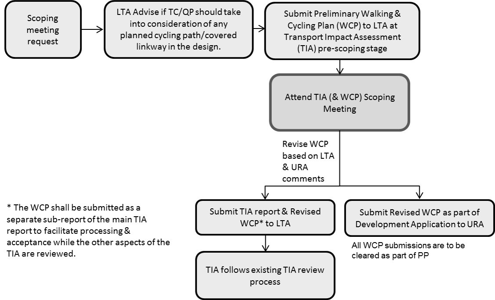

# Place of Worship

## **Advisory Notes**

The guidelines set out in this handbook for the various development
control parameters will generally be applied by URA in the consideration
of a development application. However, if the circumstances of a case or
the planning considerations relevant to a case so warrant, URA may in
its discretion decide to depart from these general guidelines. Persons
intending to carry out a development are advised to take this into
consideration in the conduct of their affairs and check with URA through
enquiries or development applications to confirm if their proposals can
be allowed.

The guidelines, principles and illustrations found in the handbook
series are not exhaustive in covering all possible site conditions and
building designs. In evaluating the development applications, URA
reserves the right to evaluate and impose conditions not covered in the
handbook in respond to the specific design of the development proposal
depending on merits.

## **Guidelines at a Glance: Place of Worship**

The table below is intended to provide an overview of the key guidelines
applicable for the development type. The full details of the guidelines
are stated in the relevant tabs of this handbook.

+----------------------+----------------------+----------------------+
| **Parameter**        | **Guideline**        |                      |
+----------------------+----------------------+----------------------+
| Gross Plot Ratio     | **Location**         | **GPR**              |
+----------------------+----------------------+----------------------+
|                      | Within landed and    | Up to 1.0            |
|                      | low-density housing  |                      |
|                      | areas with GPR less  |                      |
|                      | than or equal to 1.4 |                      |
+----------------------+----------------------+----------------------+
|                      | At the fringe of     | Up to 1.4            |
|                      | landed and           |                      |
|                      | low-density housing  |                      |
|                      | areas with GPR less  |                      |
|                      | than or equal to 1.4 |                      |
+----------------------+----------------------+----------------------+
|                      | Within HDB estates   | Up to 1.6            |
|                      | and in areas with    |                      |
|                      | GPR more than 1.4    |                      |
+----------------------+----------------------+----------------------+
|                      | Within or at the     | Up to 1.6            |
|                      | fringe of industrial |                      |
|                      | estates              |                      |
+----------------------+----------------------+----------------------+
|                      | Within Central Area  | Subject to           |
|                      | and within other     | evaluation and       |
|                      | commercial centres,  | localised urban      |
|                      | including party-wall | design guidelines.   |
|                      | developments such as |                      |
|                      | in Geylang area      |                      |
+----------------------+----------------------+----------------------+
| Storey Height        | **Location**         | **Storey Height**    |
+----------------------+----------------------+----------------------+
|                      | Within landed and    | Up to 2 or 3 storeys |
|                      | low-density housing  | based on the         |
|                      | areas with GPR less  | storey-height        |
|                      | than or equal to 1.4 | control of the       |
|                      |                      | landed housing       |
|                      |                      | estate               |
+----------------------+----------------------+----------------------+
|                      | At the fringe of     | Up to 4 storeys      |
|                      | landed and           |                      |
|                      | low-density housing  |                      |
|                      | areas with GPR less  |                      |
|                      | than or equal to 1.4 |                      |
+----------------------+----------------------+----------------------+
|                      | Within HDB estates   | For GPR less than or |
|                      | and in areas with    | equal to 1.4, up to  |
|                      | residential GPR more | 4 storeys            |
|                      | than 1.4             |                      |
+----------------------+----------------------+----------------------+
|                      |                      | For PWs of GPR more  |
|                      |                      | than 1.4 and less    |
|                      |                      | than or equal to     |
|                      |                      | 1.6, up to 5 storeys |
|                      |                      | within a 25m         |
|                      |                      | envelope control     |
|                      |                      | that includes the    |
|                      |                      | attic. An additional |
|                      |                      | height allowance of  |
|                      |                      | up to 5m may be      |
|                      |                      | granted if           |
|                      |                      | purpose-built        |
|                      |                      | above-ground car     |
|                      |                      | park floors are      |
|                      |                      | provided. The        |
|                      |                      | additional height    |
|                      |                      | allowance shall be   |
|                      |                      | designed sensitively |
|                      |                      | and shall be subject |
|                      |                      | to detailed          |
|                      |                      | evaluation.          |
+----------------------+----------------------+----------------------+
|                      | Within or at the     | For PWs of GPR less  |
|                      | fringe of industrial | than or equal to     |
|                      | estates              | 1.4, up to 4 storeys |
+----------------------+----------------------+----------------------+
|                      |                      | For PWs of GPR more  |
|                      |                      | than 1.4 and less    |
|                      |                      | than or equal to     |
|                      |                      | 1.6, up to 5 storeys |
|                      |                      | within a 25m         |
|                      |                      | envelope control     |
|                      |                      | that includes the    |
|                      |                      | attic. An additional |
|                      |                      | height allowance of  |
|                      |                      | up to 5m may be      |
|                      |                      | granted if           |
|                      |                      | purpose-built        |
|                      |                      | above-ground car     |
|                      |                      | park floors are      |
|                      |                      | provided. The        |
|                      |                      | additional height    |
|                      |                      | allowance shall be   |
|                      |                      | designed sensitively |
|                      |                      | and shall be subject |
|                      |                      | to detailed          |
|                      |                      | evaluation.          |
+----------------------+----------------------+----------------------+
|                      | Within Central Area  | Subject to           |
|                      | and within other     | evaluation and       |
|                      | commercial centres,  | localised urban      |
|                      | including party-wall | design guidelines.   |
|                      | developments such as |                      |
|                      | in Geylang area      |                      |
+----------------------+----------------------+----------------------+
| Building Height      | Subject to           |                      |
|                      | **technical height   |                      |
|                      | controls imposed by  |                      |
|                      | other authorities    |                      |
|                      | such as CAAS and     |                      |
|                      | DSTA or where there  |                      |
|                      | are conservation or  |                      |
|                      | urban design         |                      |
|                      | requirements**       |                      |
+----------------------+----------------------+----------------------+
| Floor-to-Floor       | Maximum 5.0m         |                      |
| Height               |                      |                      |
+----------------------+----------------------+----------------------+
| Religious Symbols    | -   No taller than   |                      |
|                      |     the allowable    |                      |
|                      |     number of        |                      |
|                      |     storeys          |                      |
|                      |                      |                      |
|                      | -   If mounted on    |                      |
|                      |     the roof, it     |                      |
|                      |     shall not be     |                      |
|                      |     higher than 5.0m |                      |
|                      |     from the roof    |                      |
|                      |     level            |                      |
+----------------------+----------------------+----------------------+
| RC Flat Roofs        | RC flat roofs shall  |                      |
|                      | remain inaccessible  |                      |
|                      | except for           |                      |
|                      | maintenance purposes |                      |
|                      | only. Activating the |                      |
|                      | rooftop for uses     |                      |
|                      | such as roof         |                      |
|                      | terraces may be      |                      |
|                      | allowed depending on |                      |
|                      | the merits of the    |                      |
|                      | proposal. No         |                      |
|                      | structures shall be  |                      |
|                      | allowed unless       |                      |
|                      | otherwise approved   |                      |
|                      | by URA. Where        |                      |
|                      | allowed, structures  |                      |
|                      | (including any       |                      |
|                      | safety barriers)     |                      |
|                      | shall comply with    |                      |
|                      | height controls and  |                      |
|                      | the following        |                      |
|                      | guidelines.          |                      |
+----------------------+----------------------+----------------------+
|                      | **Communal           |                      |
|                      | Pavilions**          |                      |
|                      |                      |                      |
|                      | Rooftop communal     |                      |
|                      | pavilions are not    |                      |
|                      | allowed in PW        |                      |
|                      | developments to      |                      |
|                      | minimise dis-amenity |                      |
|                      | to neighbouring      |                      |
|                      | developments         |                      |
+----------------------+----------------------+----------------------+
|                      | **Solar Panels**     |                      |
|                      |                      |                      |
|                      | Planning permission  |                      |
|                      | is not required      |                      |
|                      | except in the        |                      |
|                      | following locations  |                      |
|                      | and contexts:        |                      |
|                      |                      |                      |
|                      | -   Site is subject  |                      |
|                      |     to urban design  |                      |
|                      |     guidelines or    |                      |
|                      |     located within   |                      |
|                      |     Conservation     |                      |
|                      |     Areas;           |                      |
|                      |                      |                      |
|                      | -   Elevated^1^      |                      |
|                      |     solar panels;    |                      |
|                      |                      |                      |
|                      | -   Spaces under     |                      |
|                      |     solar panels are |                      |
|                      |     enclosed or put  |                      |
|                      |     to commercial    |                      |
|                      |     use.             |                      |
|                      |                      |                      |
|                      | ^1^ A solar panel is |                      |
|                      | deemed to be         |                      |
|                      | elevated if it is    |                      |
|                      | raised more than 1m  |                      |
|                      | from the roof level  |                      |
|                      | for landed housing   |                      |
|                      | developments or 1.8m |                      |
|                      | from the roof level  |                      |
|                      | for other            |                      |
|                      | developments.        |                      |
+----------------------+----------------------+----------------------+
| Road Buffer          | Category 1 --        | 15m (5m green        |
|                      | Expressway           | buffer)              |
+----------------------+----------------------+----------------------+
|                      | Category 2 -- Major  | 7.5m (3m green       |
|                      | Arterial A           | buffer)              |
+----------------------+----------------------+----------------------+
|                      | Category 3 -- Major  | 5m (3m green buffer) |
|                      | Arterial B           |                      |
+----------------------+----------------------+----------------------+
|                      | Category 4 & 5 --    | 5m (3m green buffer) |
|                      | Other Major Roads,   |                      |
|                      | Minor Roads & Slip   |                      |
|                      | Roads                |                      |
+----------------------+----------------------+----------------------+
| Building Setback     | Minimum 4.5m         |                      |
| from Boundary        | (including 2m        |                      |
|                      | planting strip)      |                      |
|                      | along common         |                      |
|                      | boundaries with      |                      |
|                      | other developments   |                      |
+----------------------+----------------------+----------------------+
|                      | No setback           |                      |
|                      | requirement along    |                      |
|                      | common boundary with |                      |
|                      | industrial           |                      |
|                      | development if the   |                      |
|                      | following conditions |                      |
|                      | are met:             |                      |
|                      |                      |                      |
|                      | -   The sites are    |                      |
|                      |     located well     |                      |
|                      |     within the       |                      |
|                      |     industrial       |                      |
|                      |     estate and not   |                      |
|                      |     next to          |                      |
|                      |     non-industrial   |                      |
|                      |     developments;    |                      |
|                      |                      |                      |
|                      | -   No openings      |                      |
|                      |     along common     |                      |
|                      |     boundary; and    |                      |
|                      |                      |                      |
|                      | -   No adverse       |                      |
|                      |     impact on the    |                      |
|                      |     surrounding      |                      |
|                      |     developments     |                      |
+----------------------+----------------------+----------------------+
| Basements            | Basements with       |                      |
|                      | protrusions of up to |                      |
|                      | 1.0m:                |                      |
|                      |                      |                      |
|                      | -   shall comply     |                      |
|                      |     with the road    |                      |
|                      |     buffer and       |                      |
|                      |     building         |                      |
|                      |     setback.         |                      |
|                      |                      |                      |
|                      | -   any basement     |                      |
|                      |     protrusions of   |                      |
|                      |     more than 1.0m   |                      |
|                      |     above the ground |                      |
|                      |     level are        |                      |
|                      |     treated as a     |                      |
|                      |     storey.          |                      |
|                      |                      |                      |
|                      | Sunken basements may |                      |
|                      | be built up to the   |                      |
|                      | road reserve line    |                      |
|                      | and lot boundary     |                      |
|                      | provided:            |                      |
|                      |                      |                      |
|                      | -   the portion      |                      |
|                      |     underneath the   |                      |
|                      |     green buffer is  |                      |
|                      |     submerged at     |                      |
|                      |     least 2m or more |                      |
|                      |     below the ground |                      |
|                      |     level.           |                      |
|                      |                      |                      |
|                      | -   there are no     |                      |
|                      |     technical        |                      |
|                      |     requirements.    |                      |
|                      |                      |                      |
|                      | -   it does not      |                      |
|                      |     cause any        |                      |
|                      |     adverse impact   |                      |
|                      |     to the adjoining |                      |
|                      |     property.        |                      |
+----------------------+----------------------+----------------------+
| Special and Detailed | [Special and         | Developments within  |
| Control Plans        | Detailed Control     | special control      |
| ~~Control Areas~~    | Plans]{.ul}          | areas may be subject |
|                      |                      | to screening         |
|                      | [Special Control     | requirements (to be  |
|                      | Area                 | confirmed upon       |
|                      | 1](https             | submission of a      |
|                      | ://www.ura.gov.sg/-/ | proposed             |
|                      | media/Corporate/Guid | development)         |
|                      | elines/Development-c |                      |
|                      | ontrol/Others/SCA_1) |                      |
|                      |                      |                      |
|                      | [Special Control     |                      |
|                      | Area                 |                      |
|                      | 2](https             |                      |
|                      | ://www.ura.gov.sg/-/ |                      |
|                      | media/Corporate/Guid |                      |
|                      | elines/Development-c |                      |
|                      | ontrol/Others/SCA_2) |                      |
+----------------------+----------------------+----------------------+
| Street Block Plans   | Refer to section on  |                      |
|                      | *Street Block Plans* |                      |
+----------------------+----------------------+----------------------+
| Developments         | Refer to section on  |                      |
| involving            | *Developments        |                      |
| Waterbodies          | involving            |                      |
|                      | Waterbodies*         |                      |
+----------------------+----------------------+----------------------+
| Ancillary Structures | Refer to section on  |                      |
|                      | *Ancillary           |                      |
|                      | Structures* for      |                      |
|                      | detailed setback     |                      |
|                      | requirements based   |                      |
|                      | on the type of       |                      |
|                      | ancillary structure  |                      |
+----------------------+----------------------+----------------------+
| Parking              | Parking standards    |                      |
|                      | and requirements are |                      |
|                      | prescribed by the    |                      |
|                      | Land Transport       |                      |
|                      | Authority (LTA)      |                      |
+----------------------+----------------------+----------------------+
| Use Quantum          | Based on overall     |                      |
|                      | proposed GFA:        |                      |
|                      |                      |                      |
|                      | -   Minimum 50%      |                      |
|                      |     praying area;    |                      |
|                      |                      |                      |
|                      | -   Maximum 50%      |                      |
|                      |     ancillary uses   |                      |
|                      |     (Maximum 10%     |                      |
|                      |     ancillary        |                      |
|                      |     non-religious    |                      |
|                      |     uses and Maximum |                      |
|                      |     20% columbarium  |                      |
|                      |     use)             |                      |
|                      |                      |                      |
|                      | Refer to section on  |                      |
|                      | *Use Quantum for     |                      |
|                      | Allowable Uses*      |                      |
+----------------------+----------------------+----------------------+
| Ancillary            | Location             |                      |
| Columbarium          |                      |                      |
|                      | -   Shall not be     |                      |
|                      |     stand-alone      |                      |
|                      |     structures and   |                      |
|                      |     shall be located |                      |
|                      |     inside the main  |                      |
|                      |     PW building or   |                      |
|                      |     abut the main    |                      |
|                      |     building;        |                      |
|                      |                      |                      |
|                      | -   For standalone   |                      |
|                      |     or independent   |                      |
|                      |     PW developments, |                      |
|                      |     basement         |                      |
|                      |     columbaria are   |                      |
|                      |     preferred, but   |                      |
|                      |     above-ground     |                      |
|                      |     columbaria may   |                      |
|                      |     be considered    |                      |
|                      |     subject to       |                      |
|                      |     complete         |                      |
|                      |     screening from   |                      |
|                      |     public view;     |                      |
|                      |                      |                      |
|                      | -   For party-wall   |                      |
|                      |     PW developments, |                      |
|                      |     the columbarium  |                      |
|                      |     shall be sited   |                      |
|                      |     in the basement. |                      |
+----------------------+----------------------+----------------------+
|                      | Quantum              |                      |
|                      |                      |                      |
|                      | -   Allowed up to    |                      |
|                      |     20% of the total |                      |
|                      |     building GFA.    |                      |
|                      |                      |                      |
|                      | -   Allowed up to    |                      |
|                      |     40% of total     |                      |
|                      |     building GFA if  |                      |
|                      |     the PW           |                      |
|                      |     development:     |                      |
|                      |                      |                      |
|                      | a.  is located at    |                      |
|                      |     the fringe of    |                      |
|                      |     industrial       |                      |
|                      |     estates; and     |                      |
|                      |                      |                      |
|                      | b.  Is not facing or |                      |
|                      |     near residential |                      |
|                      |     areas.           |                      |
+----------------------+----------------------+----------------------+
| Walking and Cycling  | Walking and Cycling  |                      |
| Plan                 | Plan submission may  |                      |
|                      | be required for PW   |                      |
|                      | developments. Refer  |                      |
|                      | to section on        |                      |
|                      | *Walking and Cycling |                      |
|                      | Plan*.               |                      |
+----------------------+----------------------+----------------------+
| Earthworks           | -   Earthworks are   |                      |
|                      |     not allowed      |                      |
|                      |     within the       |                      |
|                      |     building setback |                      |
|                      |     area.            |                      |
|                      |                      |                      |
|                      | -   Earthworks       |                      |
|                      |     within the       |                      |
|                      |     build-able area  |                      |
|                      |     are subject to   |                      |
|                      |     evaluation. If   |                      |
|                      |     earthfill of     |                      |
|                      |     more than 1m is  |                      |
|                      |     allowed, the     |                      |
|                      |     overall          |                      |
|                      |     aggregate        |                      |
|                      |     building height  |                      |
|                      |     measured from    |                      |
|                      |     the allowable    |                      |
|                      |     platform level   |                      |
|                      |     shall comply     |                      |
|                      |     with the maximum |                      |
|                      |     allowable        |                      |
|                      |     building height  |                      |
|                      |     control.         |                      |
|                      |                      |                      |
|                      | ```{=html}           |                      |
|                      | <!-- -->             |                      |
|                      | ```                  |                      |
|                      | -   Earthfill        |                      |
|                      |     involving the    |                      |
|                      |     entire           |                      |
|                      |     development site |                      |
|                      |     may only be      |                      |
|                      |     considered if    |                      |
|                      |     the proposed     |                      |
|                      |     earthworks are   |                      |
|                      |     required to meet |                      |
|                      |     the Minimum      |                      |
|                      |     Platform Level   |                      |
|                      |     (MPL) stipulated |                      |
|                      |     by PUB.          |                      |
+----------------------+----------------------+----------------------+
| Retaining and        | Maximum allowable    |                      |
| Boundary Walls       | height for boundary  |                      |
|                      | walls is 1.8m.       |                      |
|                      |                      |                      |
|                      | Erection of          |                      |
|                      | retaining walls are  |                      |
|                      | subject to           |                      |
|                      | evaluation. If       |                      |
|                      | retaining walls are  |                      |
|                      | allowed:             |                      |
|                      |                      |                      |
|                      | -   the height shall |                      |
|                      |     be less than     |                      |
|                      |     1.5m;            |                      |
|                      |                      |                      |
|                      | -   retaining walls  |                      |
|                      |     higher than 1.5m |                      |
|                      |     may be           |                      |
|                      |     considered       |                      |
|                      |     depending on     |                      |
|                      |     site constraints |                      |
|                      |     and the need for |                      |
|                      |     extensive        |                      |
|                      |     excavation;      |                      |
|                      |                      |                      |
|                      | -   the total        |                      |
|                      |     visible height   |                      |
|                      |     of the solid     |                      |
|                      |     bo               |                      |
|                      | undary-cum-retaining |                      |
|                      |     wall shall not   |                      |
|                      |     exceed 2.8m, of  |                      |
|                      |     which the solid  |                      |
|                      |     boundary wall    |                      |
|                      |     shall not exceed |                      |
|                      |     1.8m.            |                      |
+----------------------+----------------------+----------------------+

**\
**


## **Introduction**

Place of Worship developments are zoned PW (Place of Worship) in the
Master Plan. These sites are approved specifically for worshipping and
they may include purpose-built mosques, churches and temples. All PWs
are required to adhere to the development guidelines on the allowable
Gross Plot Ratio (GPR), use quantum, ancillary uses, number of storeys,
site coverage, building setback from road and common boundary.


## **Gross Plot Ratio**

The guideline on the allowable Gross Plot Ratio (GPR) for new PWs varies
depending on the location and the context of the surrounding area. The
allowable GPR in the table below is the upper bound. The actual
allowable GPR would depend on the site conditions, traffic situation,
impact of the PW on the nearby developments and other agencies'
requirements.

## **Allowable Gross Plot Ratio**

  **Location**                                                                                                         **Gross Plot Ratio Control**
  -------------------------------------------------------------------------------------------------------------------- --------------------------------------------------------------
  Within landed and low-density housing areas with GPR less than or equal to 1.4                                       Up to 1.0
  At the fringe of landed and low-density housing areas with GPR less than or equal to 1.4                             Up to 1.4
  Within HDB estates and in areas with GPR more than 1.4                                                               Up to 1.6
  Within or at the fringe of industrial estates                                                                        Up to 1.6
  Within Central Area and within other commercial centres, including party-wall developments such as in Geylang area   Subject to evaluation and localised urban design guidelines.

The area of the land required to be set aside for drainage
reserve^1^ (DR) and/or road reserve^2^ (RR) to be vested in the State
may be included in the site area to compute the gross floor area (GFA)
for a GPR -- see figure below.

^1^ **Drainage Reserve (DR)**: An area safeguarded for purposes of
building or widening a public drain

^2^ **Road Reserve**: The plot of land to be vested in the State as
required under the Street Works Act. It is demarcated by the line of
Road Reserve in the Road Line Plan and the site boundary.


*GPR for sites where vesting is required*

For redevelopment of existing approved PW developments or to carry out
major extensions to them, the proposed increase in GPR or Gross Floor
Area (GFA) is subject to planning consideration taking into account the
location of the PW, context of the surrounding area and requirements of
other government agencies such as LTA. Planning approval from URA shall
be obtained first before commencement of works.


## **Building Height**

{width="6.496062992125984in"
height="3.4498468941382328in"}

*Building Height*

## **Overall Building Height**

Unless otherwise stated, the overall building height^1^ of PW
developments is subject to compliance with the technical height
controls of the relevant agencies such as Civil Aviation Authority of
Singapore (CAAS) and the Defence Science and Technology Agency (DSTA).
~~These agencies require the building height to be given in m
AMSL (metres above Mean Sea Level).~~

^1^ ~~Submissions to other agencies may require the building height
based on the Singapore Height Datum (SHD). The SHD may be a positive or
negative value and it may be supplemented with a \"+\" or \"-\" sign for
clarity.~~ Building height is based on Singapore Height Datum (SHD).

## **Storey Height**

The allowable number of storeys for the PW shall take into account the
character of the surrounding area. As a guide, depending on the
allowable GPR, the corresponding number of storeys are shown in the
table below. The actual number of storeys allowed may vary, depending on
the site topography, site condition and the context of the surrounding
area.

## **Allowable Storey Height**

  ------------------------------------------------------------------------------------------------------------------------------------------------------------------------------------------------------------------------------------------------------------------------------------------------------------------------------------------------------------------------------------------------------------------------------------------------------------------------------------------
  **Location**                                                                                                         **Storey Height Control**
  -------------------------------------------------------------------------------------------------------------------- ---------------------------------------------------------------------------------------------------------------------------------------------------------------------------------------------------------------------------------------------------------------------------------------------------------------------------------------------------------------------
  Within landed and low-density housing areas with GPR less than or equal to 1.4                                       Up to 2 or 3 storeys based on the storey-height control of the landed housing estate

  At the fringe of landed and low-density housing areas with GPR less than or equal to 1.4                             Up to 4 storeys

  Within HDB estates and in areas with residential GPR more than 1.4                                                   For PWs of GPR less than or equal to 1.4, up to 4 storeys\
                                                                                                                       \
                                                                                                                       For PWs of GPR more than 1.4 and less than or equal to 1.6, up to 5 storeys within a 25m envelope control that includes the attic. An additional height allowance of up to 5m may be granted if purpose-built above-ground car park floors are provided. The additional height allowance shall be designed sensitively and shall be subject to detailed evaluation.

  Within or at the fringe of industrial estates                                                                        For PWs of GPR less than or equal to 1.4, up to 4 storeys\
                                                                                                                       \
                                                                                                                       For PWs of GPR more than 1.4 and less than or equal to 1.6, up to 5 storeys within a 25m envelope control that includes the attic. An additional height allowance of up to 5m may be granted if purpose-built above-ground car park floors are provided. The additional height allowance shall be designed sensitively and shall be subject to detailed evaluation.

  Within Central Area and within other commercial centres, including party-wall developments such as in Geylang area   Subject to evaluation and localised urban design guidelines.
  ------------------------------------------------------------------------------------------------------------------------------------------------------------------------------------------------------------------------------------------------------------------------------------------------------------------------------------------------------------------------------------------------------------------------------------------------------------------------------------------

## **Floor-to-Floor Height**

The maximum floor-to-floor height of PW developments is 5.0m.


## **Religious Symbols**


*Height of religious symbols*

Religious symbols like crosses, minarets or statues shall not be overly
large such that they become a dominant feature of the PW. It shall be
kept no taller than the allowable number of storeys. If it is mounted on
the roof, it shall not be higher than 5.0m from the roof level.


## **RC Flat Roofs**

RC flat roofs shall remain inaccessible except for maintenance purposes
only^1^. Activating the rooftop for uses such as roof terraces and
landscaped gardens may be allowed depending on the merits of the
proposal. No structures shall be allowed unless otherwise approved by
URA. Where allowed, structures (including any safety barriers) shall
comply with height controls^2^ and the following guidelines.

^1 ^RC flat roofs that are accessible via ladders for maintenance
purposes only are subject to agencies' requirements for safety barriers
to ensure the safety of maintenance personnel. Safety barriers shall not
exceed 1m in height.

^2^ Height controls applicable, include:

-   Absolute technical height constraints^@^ (e.g. Aviation paths
    restrictions, military and telecommunications installations).

-   Conservation guidelines (available at [URA
    SPACE](https://www.ura.gov.sg/maps/?service=STB))

-   Urban design height controls (available at [URA
    SPACE](https://www.ura.gov.sg/maps/?service=STB))

^@^ The absolute technical height (Based on Singapore Height Datum
\[SHD\]) shall take precedence if it is stricter than any of the other
height controls.

## **Communal Pavilions**

Rooftop pavilions are not allowed in PW developments to minimise
dis-amenity to neighbouring developments.

## **Solar Panels**

The installation of solar panels on RC flat roofs may be considered if
they meet the following criteria:

a.  Solar panels are installed between 10 to 15 degrees relative to the
    > horizontal plane to optimise the performance of solar panels and
    > minimise glare to the buildings in the vicinity; and

b.  The installation of solar panels shall not result in the removal of
    > any greenery approved under the Landscaping for Urban Spaces and
    > High-Rises (LUSH) Programme.

Installation of solar panels and M&E equipment such as inverters for the
solar panel system does not require planning permission except in
locations and contexts described below.

## **Planning Permission**

a.  **Areas subject to urban design guidelines and Conservation
    > Areas^1^ shall require planning permission due to their impact on
    > the roofscape.**

> ^1^ For Conservation Areas, installation of solar panels without any
> additional works are treated as localised works for the purpose of
> repair and maintenance and are considered Category 3 works for
> Conserved Buildings. Applications for such Category 3 works can be
> made by owners and contractors. Refer to the Conservation
> Guidelines [here](https://intranet.ura.gov.sg/Corporate/Guidelines/Development-Control/Non-Residential/PW/~/link.aspx?_id=6F28BA0B83114572ACA7DC1DFB84DBAC&_z=z) and
> information on submission
> procedure [here](https://intranet.ura.gov.sg/Corporate/Guidelines/Development-Control/Non-Residential/PW/~/link.aspx?_id=C2CDF8FDF76E401086C69F6F63B875B5&_z=z).

b.  **Elevated solar panels^2^ located in developments on the following
    > land use zones shall require planning permission:**

+----------------------------------+----------------------------------+
| -   Residential (landed housing, | -   White                        |
|     > flats and condominium      |                                  |
|     > housing developments)      | -   Residential / Institution    |
|                                  |                                  |
| -   Residential with Commercial  | -   Commercial / Institution     |
|     > at 1^st^Storey             |                                  |
|                                  | -   Educational Institution      |
| -   Mixed Commercial &           |                                  |
|     > Residential                | -   Place of Worship             |
|                                  |                                  |
| -   Commercial                   | -   Civic & Community            |
|                                  |     > Institution                |
| -   Hotel                        |                                  |
+----------------------------------+----------------------------------+

> ^2^ A solar panel is deemed to be elevated if it is raised more than
> 1m from the roof level for landed housing developments or 1.8m from
> the roof level for other developments.

c.  **Spaces under solar panels are enclosed or put to commercial use**

> Planning permission shall be required if the spaces under elevated or
> non-elevated solar panels are enclosed or put to commercial uses such
> as Outdoor Refreshment Areas. In such instances, the spaces shall be
> computed as GFA.

## **Assessment of Storey Height**

Elevated solar panels that require planning permission may be assessed
as an additional storey for storey height control purposes unless they
comply with the guidelines below:

## **Guidelines for Elevated Solar Panels**

  **Parameter**   **Guidelines**
  --------------- ---------------------------------------------------------------------
  Extent          Within the 45-degree line from the springing line of the roof level
  Height          Maximum 5m above roof level


*Extent and Height of Elevated Solar Panels*


## **Building Setback from Boundary**

{width="6.496062992125984in"
height="4.514879702537183in"}

*Setback Requirements*

All PWs shall be sufficiently set back from the road and common
boundary. The setback distance is measured from the road reserve^1^ line
or boundary line to the external wall of the buildings, excluding land
to be vested to the State for road or drainage or public purpose.

All PWs fronting a public road shall provide a road buffer, the width of
which depends on the hierarchy of the road. A green buffer shall be set
aside in the road buffer depending on the width of the road buffer.

The buffer requirements for the Road Categories 1 to 5 are in Table 1
below. The common boundary setback requirements are in Table 2 below.
Different setback requirements may apply for sites within the Geylang
area or the Central Area, both of which are guided by Urban Design
guidelines.

^1^ **Road Reserve**: The plot of land to be vested in the State as
required under the Street Works Act. It is demarcated by the line of
Road Reserve in the Road Line Plan and the site boundary.

## **Table 1: Road Buffer, Green Buffer**

  -------------------------------------------------------------------------
  **Road Category**   **Road Buffer\
                      (inclusive of Green Buffer indicated in brackets)**
  ------------------- -----------------------------------------------------
  Category 1          15m\
                      (5m)

  Category 2          7.5m\
                      (3m)

  Category 3          5m\
                      (3m)

  Category 4 & 5      5m\
                      (3m)
  -------------------------------------------------------------------------

## **Table 2: Common Boundary Setback & Planting Strip**

+----------------------------------+----------------------------------+
| **Type of Boundary**             | **Building Setback Requirement** |
+==================================+==================================+
| Common boundary with other       | Minimum 4.5m\                    |
| developments                     | (including 2m planting strip)    |
+----------------------------------+----------------------------------+
| Common boundary with an          | No setback (see note below) is   |
| industrial development           | required at the common boundary  |
|                                  | between an industrial            |
|                                  | development and a Place of       |
|                                  | Worship (PW) development subject |
|                                  | to the following conditions:     |
|                                  |                                  |
|                                  | -   The sites are located well   |
|                                  |     > within the industrial      |
|                                  |     > estate and not next to     |
|                                  |     > non-industrial             |
|                                  |     > developments;              |
|                                  |                                  |
|                                  | -   No openings along common     |
|                                  |     > boundary; and              |
|                                  |                                  |
|                                  | -   No adverse impact on the     |
|                                  |     > surrounding developments   |
|                                  |                                  |
|                                  | ***Note**: Where the building is |
|                                  | proposed to abut the common      |
|                                  | boundary, the applicant should   |
|                                  | put in place systems/measures to |
|                                  | facilitate down-stream building  |
|                                  | maintenance at the common        |
|                                  | boundary.*                       |
+----------------------------------+----------------------------------+

## **Table 3: Setback for Building Appendages**

  **Building Feature**                             **Within Road Buffer**                                **Within Setback from Common Boundaries**
  ------------------------------------------------ ----------------------------------------------------- ------------------------------------------------------------
  Roof eaves                                       Allowed, provided it is not within the green buffer   Allowed, provided it is not within the 2.0m planting strip
  Sun-shading devices & RC ledges (cantilevered)                                                         


## **Basements**

A basement storey refers to a storey of a building which may be
partially or wholly below the existing ground level. In so far as storey
height control is concerned, basement storeys that protrude more than
1.0m above ground level on any side shall be counted as a storey.


*Basement Setback and Vertical Openings*

The physical limit for which the basement may be built up to is shown in
the table below.

## **Basement Setback**

+----------------------+----------------------+----------------------+
| **Type of Basement** | **Setback from Road  | **Setback from Other |
|                      | Reserve Line**       | Boundaries**         |
+======================+======================+======================+
| Basement with        | Up to the road       | Up to the building   |
| protrusion           | buffer               | setback              |
+----------------------+----------------------+----------------------+
| Sunken basement      | Up to the road       | Up to the site lot   |
|                      | reserve^1^ line,     | boundary, provided:  |
|                      | provided the portion |                      |
|                      | underneath the green | -   the portion      |
|                      | buffer is submerged  |     > underneath the |
|                      | at least 2m or more  |     > 2m tree        |
|                      | below the ground     |     > planting strip |
|                      | level                |     > is submerged   |
|                      |                      |     > at least 2m or |
|                      |                      |     > more below the |
|                      |                      |     > ground level;  |
|                      |                      |                      |
|                      |                      | -   there are no     |
|                      |                      |     > technical      |
|                      |                      |     > requirements   |
|                      |                      |     > (eg sewerage,  |
|                      |                      |     > drainage) and  |
|                      |                      |     > the basement   |
|                      |                      |     > does not cause |
|                      |                      |     > any adverse    |
|                      |                      |     > impact to the  |
|                      |                      |     > adjoining      |
|                      |                      |     > property;      |
|                      |                      |                      |
|                      |                      | -   the side of a    |
|                      |                      |     > basement wall  |
|                      |                      |     > abutting any   |
|                      |                      |     > site boundary  |
|                      |                      |     > shall not have |
|                      |                      |     > any openings   |
|                      |                      |     > into the       |
|                      |                      |     > adjoining      |
|                      |                      |     > site.          |
+----------------------+----------------------+----------------------+

^1^ **Road Reserve**: The plot of land to be vested in the State as
required under the Street Works Act. It is demarcated by the line of
Road Reserve in the Road Line Plan and the site boundary.

Basements with vertical openings on the side walls may be allowed only
if they are required for natural ventilation and to meet the building
regulations. The guidelines are as follows:

-   While the protrusion measured from the level at the site boundary
    > shall not exceed 1.0m, basements may be exposed up to 2.0 m from
    > the point where the platform level meets the basement wall (ie the
    > earth around the basement wall may be cut to slope down to achieve
    > the 2.0m basement exposure with openings).

-   The extent of the slope within the green buffer or planting strip
    > shall have a gradient of 1:2.5.

-   Vertical cutting of the earth resulting in a trench around the
    > basement is not allowed.

-   The extent of the vertical openings or the types of cover over the
    > vertical openings shall be subject to the requirements of the
    > other technical departments.

-   Horizontal openings to the basement are allowed within the setback
    > distance outside the green buffer and planting strip, subject to
    > provision of effective screening to hide the view to the basement.


*Basement Horizontal Openings*


## **Special and Detailed Control Plans ~~Control Areas~~**

Special and Detailed Control Plans (SDCP) provide detailed guidelines
for specific areas. The SDCPs may be viewed here.

## **Special Control Areas**

The following areas may be subject to security requirements. URA will
confirm this upon submission of a proposed development.

{width="6.496062992125984in"
height="3.606201881014873in"}

*Special Control Area 1*

{width="6.496062992125984in"
height="3.3150820209973753in"}

*Special Control Area 2*

Qualified Persons (QPs) should consider the screening requirements in
the early stage of their planning and design to avoid abortive work
subsequently.

Where security screening is deemed necessary, it shall consist of
permanent fixtures that are difficult, if not impossible to remove. The
following screening measures may be considered:

## **Visual Screening**

Residential units and common areas may be screened where necessary with
blank walls, external concrete/metal fins, or the building may be
re-orientated such that the windows^1^/openings/balconies do not have
direct view towards the protected area.

^1^ **Window**: Raised openings that are at least 0.9m above the floor
slab. They are intended to provide ventilation and lighting, and not for
access. Full height windows and windows that are lower than 0.9m that
can potentially be used as access points will need to be highlighted in
the submission plans for URA's evaluation and approval.

## **Roof Screening**

The parapet wall at the rooftop shall be at least 3m high and access to
the rooftop from a public area shall be secured by a lockable
door/hatch. The door/hatch may be electronically linked to an alarm
system monitored by the building management, if available.


## **Street Block Plans**

Street block plans guide the detailed setback, storey height and
building height, for the following locations. Click on the reference
links to view the detailed street block plan.

  **Street Block**
  ----------------------------------------------------------------------------------------------------------------------------------------------------------------------------------------------------------------------------------------
  [Balestier Road Between Thomson Road and Moulmein Road](https://intranet.ura.gov.sg/-/media/Corporate/Guidelines/Development-control/Street-Block-Plans/Balestier%20Road%20Between%20Thomson%20Road%20and%20Moulmein%20Road.pdf?la=en)
  [Geylang Road, Sims Avenue, & Guillemard Road, bounded by Sims Way and Paya Lebar Road](https://intranet.ura.gov.sg/-/media/Corporate/Guidelines/Development-control/Street-Block-Plans/GUDG.pdf)
  [Mount Sophia Conservation Area](https://intranet.ura.gov.sg/Corporate/Data/circulars/Archive/2015/dec/dc15-10)
  [Race Course Road / Birch Road / Serangoon Road / Chander Road](https://intranet.ura.gov.sg/Corporate/Data/circulars/2016/Jun/dc16-02)
  [Yan Kit Road](https://intranet.ura.gov.sg/-/media/Corporate/Guidelines/Development-control/Street-Block-Plans/Yan%20Kit%20Road.gif?la=en)


## **Developments Involving Waterbodies**

To maintain the integrity and aesthetics of the waterfront areas so that
the public can have free and unrestricted access to enjoy these spaces,
developments at major waterbodies^1^ shall observe the design and
development application submission guidelines below.

^1^ Major waterbodies: rivers, canals of at least 17.5m width,
reservoirs, and seas.


*Developments at Major Waterbodies*

## **Design Guidelines**

1.  **Retaining Walls**

> Retaining walls along the waterbodies may be allowed subject to the
> following criteria:

a.  Retaining walls are less than 1.5m in height;

b.  Retaining walls are set back at least 300mm from the boundary;

c.  Retaining walls are covered with creepers.

```{=html}
<!-- -->
```
2.  **Boundary Walls/Fences**

> For non-industrial developments, proposed boundary fences shall be
> porous (eg chained-link, metal-grille, or timber fence).
>
> For industrial developments, the following may be allowed:

a.  Solid boundary walls not exceeding 1.8m in height. The walls shall
    > be aesthetically treated.

b.  Chain-linked fences not exceeding 1.8m in height with close planting
    > of shrubs/vegetation as screenings. A planting strip of 0.5m width
    > (minimum) shall be provided within the development.

```{=html}
<!-- -->
```
3.  **Slope**

> There shall be no abrupt change in slope gradient at the boundary
> between the development and the waterbody. The slope gradient shall
> not exceed 1:2.

4.  **Conservation of Vegetation**

> Mature vegetation along the waterbodies are to be saved and conserved,
> wherever possible.

## **Development Application Submission Guidelines**

In all waterbodies-related development application submissions to URA,
the following shall be provided, where applicable:

-   Site/Location Plan showing the width and alignment of Drainage
    > Reserve^2^/Waterbody/Coastal Profile;

-   Layout plans and cross-sections showing the area between the site
    > and the Drainage Reserve/Waterbody/Coastal Area including existing
    > and proposed ground levels;

-   Design details of integration with waterbody including slope,
    > retaining wall, and boundary wall/fencing (Height, Type,
    > Screening);

-   Contour lines extending to 1m beyond the side of development
    > fronting the Drainage Reserve/Waterbody/Sea;

-   [Checklist](https://intranet.ura.gov.sg/Corporate/Guidelines/Development-Control/Non-Residential/PW/-/media/1A4AADDAB0B54182A8299F543A0F3C97.ashx) for
    > Waterbodies-related proposals.

^2^ **Drainage Reserve (DR)**: An area safeguarded for purposes of
building or widening a public drain

## **Application of Guidelines**

The design guidelines listed above shall apply to all developments
adjacent to or with waterbodies except developments adjacent to or with
Drainage Reserves less than 17.5m.

All proposals involving waterbodies shall comply with the development
application submission guidelines listed above.

**Additional Guidelines for Use of Foreshore by Developments with a
Frontage to the Sea**

For land use planning and development control purposes, the
foreshore^3^ and the area within 15m on both the landward and seaward
side of the foreshore line^4^ shall be kept free of structures. Some
structures such as ramps may be permitted if they are constructed in
connection with an approved development (eg marine industries,
refineries, and pleasure-boat storage complex). These structures are
subject to planning evaluation depending on merits.

^3^ The area between the high water mark of the Spring Tide or the top
of the seawall and the low water mark of the Spring Tide.


^4^ The high water mark of the Spring Tide; the top of the existing
seawall or revertment or river wall (where appropriate) for controlling
landward development.


## **Ancillary Structures**


*Setback Requirements for Ancillary Structures*

Ancillary structures are minor structures erected to support the main
use of the site. The building setback distance and height control for
ancillary structures are shown in the table below.

Ancillary structures located within the green buffer may be assessed in
accordance with NPARKS\' guidelines --
see [here](https://www.nparks.gov.sg/partner-us/development-plan-submission/guidelines-on-greenery-provision-and-tree-conservation-for-developments).

Ancillary structures located within the physical buffer and building
setback that exceed the requirements in the table below, but are below
6m in height, shall be evaluated depending on the merits of the design
and function.

## **Setback and Height Control for Ancillary Structures**

  ---------------------------------------------------------------------------------------------------------------------------------------------------------------------------------------------------------------------
  **Type of Ancillary Structures**   **Required Setback from the Road**                                                                           **Required Setback from the Other Boundaries**   **Height Control**
  ---------------------------------- ------------------------------------------------------------------------------------------------------------ ------------------------------------------------ --------------------
  Electrical Substation              5m from Category 1 road\                                                                                     2m                                               6m
                                     \                                                                                                                                                             
                                     3m from Category 2 -- 5 roads                                                                                                                                 

  Sunken Swimming Pool                                                                                                                                                                             Not applicable

  Raised Swimming Pool               Follow road buffer standards                                                                                                                                  

  Water Tank & Pump                                                                                                                                                                                

  Meter Compartment                  Subject to evaluation                                                                                        1.8m if located within the green buffer          

  Bin Point                                                                                                                                                                                        

  Guardhouse                                                                                                                                      2.6m if located within the green buffer          

  Generator Set                      Subject to evaluation\                                                                                                                                        
                                     Adequate setback may have to be provided to minimise glare and noise disturbance to adjoining developments                                                    

  Tennis Court                                                                                                                                                                                     
  ---------------------------------------------------------------------------------------------------------------------------------------------------------------------------------------------------------------------


## **Parking**

LTA prescribes the parking provision standards and requirements for
motor vehicles and bicycles. The requirements are usually based on the
quantum of the gross floor area or the number of units of the
development uses.

## **Car and Motor-Cycle Parking**

Under LTA's Range-based Parking Provision Standards (RPPS), developments
are subject to car and motor-cycle^1^ parking provision requirements.

Unless explicitly approved as private parking lots in the approved
plans, all car and motor-cycle parking lots shall be treated as common
property.

^1^ Motor-cycle parking provision is mandatory in all non-residential
developments.

## **Range-based Car Parking Standards (RPPS)**

The RPPS allows developments to provide any level of car and motor-cycle
parking provision within a specified range, defined by a lower bound and
an upper bound -- see figure below. The range varies according to
location zones and land uses. Details may be found in [LTA's Code of
Practice for Vehicle Parking Provision in
Developments](https://www.lta.gov.sg/content/ltaweb/en/industry-matters/development-and-building-and-construction-and-utility-works/vehicle-parking.html).


*Range-based Parking Provision Standards*

New PW developments shall be subject to a process of waiver evaluation
by LTA, if one wishes to provide surplus car and motor-cycle parking
lots, ie parking provision above the upper bound based on the new RPPS.

## **Bicycle Parking**

To promote a car-lite society, PW developments may be required to
provide bicycle parking facilities within the developments. Refer to
LTA's Code of Practice for Vehicle Parking Provision in Developments
here for the list of requirements.

Unless explicitly approved as private parking lots in the approved
plans, all bicycle parking lots shall be treated as common property.

Bicycle parking lots provided according to LTA's new standards are
exempted from GFA computation. Surplus provision of bicycle parking lots
may be exempted from GFA computation depending on merits and context of
the development.


## **Use Quantum & Allowable Uses**

Minimally, 50% of the total proposed GFA shall be used for praying area
only. The remaining 50% GFA may be used for ancillary activities, up to
10% of which may only be used for non-religious ancillary activities
like meeting/conference room, library, computer room, childcare centre
or kindergarten. Independent offices and shops shall not be allowed.
Refer to Tables 1 and 2 below for the use quantum control, and a list of
allowable ancillary uses within PWs.

## **Table 1: Use Quantum Control**

+----------------+----------------+----------------+----------------+
| *              | **Ancillary**  |                |                |
| *Predominant** |                |                |                |
+================+================+================+================+
| Minimum 50%    | Maximum 50%    |                |                |
+----------------+----------------+----------------+----------------+
| \-             | Ancillary      | Ancillary      | > Columbarium  |
|                | Non-Religious  | Religious      |                |
+----------------+----------------+----------------+----------------+
| \-             | Maximum 10% of | Remaining GFA  | > Maximum 20%  |
|                | total GFA      |                | > of total GFA |
+----------------+----------------+----------------+----------------+

## **Table 2: Allowable Ancillary Uses**

+------------------------------------------+--------------------------+
| **Ancillary Non-Religious**              | **Ancillary Religious**  |
+==========================================+==========================+
| Childcare Centre (CCC)                   | Religious Classrooms     |
|                                          |                          |
| -   Up to 500sqm\                        |                          |
|     > ***Note**: CCCs larger than 300sqm |                          |
|     > will require ECDA's endorsement.*  |                          |
+------------------------------------------+--------------------------+
| Kindergarten                             | ~~Columbarium~~          |
|                                          |                          |
| -   Up to 300sqm only                    |                          |
+------------------------------------------+--------------------------+
| Conference Room                          | Priest/Caretakers' Rooms |
+------------------------------------------+--------------------------+
| Library                                  |                          |
+------------------------------------------+--------------------------+
| Meeting Rooms                            |                          |
+------------------------------------------+--------------------------+


## **Ancillary Columbarium**

Ancillary columbaria use may be allowed within PWs subject to planning
consideration taking into account the location of the PW, site
constraints and its impact on the surrounding area, traffic conditions,
and requirements of other government agencies. An ancillary columbarium
in a PW shall adhere to the following requirements.

## **Location**

-   Proposed ancillary columbaria shall be located inside the main PW
    > building and shall not be stand-alone structures. Proposed new
    > building extensions for columbarium use shall abut the main
    > building and be fully integrated with it.

-   For standalone or independent PW developments, basement columbaria
    > are preferred, but above-ground columbaria may be considered
    > subject to complete screening from public view.

-   For party-wall PW developments, the columbarium shall be sited in
    > the basement.

## **Allowable Types of Ancillary Columbarium**


[\](https://intranet.ura.gov.sg/Corporate/Guidelines/Development-Control/Non-Residential/PW/Ancillary-Columbarium#Not-Allowable)

## **Types of Ancillary Columbarium that cannot be allowed**

{width="6.496062992125984in"
height="4.378169291338582in"}

## **Quantum**

-   Proposed ancillary columbaria are allowed up to 20% of the total
    > building GFA.

-   Up to 40% of total building GFA may be allowed for ancillary
    > columbaria if the PW development:

    a.  is located at the fringe of industrial estates; and

    b.  is not facing or near residential areas.


## **Walking and Cycling Plan (WCP)**

## **Submission of WCP**

PW developments with expected high pedestrian and cyclist traffic are
required to provide a WCP as part of the Development Application. As a
guide, development types listed in the table below are subject to WCP
requirement.

## **Development Types that require WCP as part of TIA^1^**

+----------------------------------+----------------------------------+
| **Development Type**             | **Scale**                        |
+==================================+==================================+
| 1.  [Residential]{.ul}           | 1.1 ≥ 700 units\                 |
|                                  | 1.2 ≥ 1,000 units                |
| > 1.1 Landed properties/         |                                  |
| > Condominiums/Executive         |                                  |
| > Condominiums\                  |                                  |
| > 1.2 HDB housing^2^             |                                  |
+----------------------------------+----------------------------------+
| 2.  [Commercial]{.ul}            | 2.1 ≥ 10,000sqm GFA\             |
|                                  | 2.2 ≥ 20,000sqm GFA\             |
| > 2.1 Shopping centres/ Retail   | 2.3 ≥ 700 rooms                  |
| > uses\                          |                                  |
| > 2.2 Office development\        |                                  |
| > 2.3 Hotel                      |                                  |
+----------------------------------+----------------------------------+
| 3.  [Industrial]{.ul}            | 3.1 ≥ 60,000sqm GFA\             |
|                                  | 3.2 ≥ 50,000sqm GFA\             |
| > 3.1 Light/General Industry^3^\ | 3.3 ≥ 40,000sqm GFA              |
| > 3.2                            |                                  |
| > Warehousing/Distribution^3^\   |                                  |
| > 3.3 Science park/High tech     |                                  |
| > park/Business park             |                                  |
+----------------------------------+----------------------------------+
| 4.  [Educational]{.ul}           | 4.1 ≥ 1,500 students             |
|                                  | (single-session) or ≥ 2,000      |
| > 4.1 Primary school\            | students (double-session)\       |
| > 4.2 Secondary school\          | 4.2 ≥ 2,000 students\            |
| > 4.3 International school\      | 4.3 ≥ 2,000 students\            |
| > 4.4 Junior college\            | 4.4 ≥ 2,000 students\            |
| > 4.5 University, polytechnic,   | 4.5 TIA Required                 |
| > ITE campus                     |                                  |
+----------------------------------+----------------------------------+
| 5.  [Medical]{.ul}               | ≥ 40,000sqm GFA or ≥ 320 Beds    |
|                                  | (whichever is triggered first)   |
| > Hospital                       |                                  |
+----------------------------------+----------------------------------+
| 6.  [Recreational]{.ul}          | ≥ 30,000sqm GFA                  |
|                                  |                                  |
| > Exhibition centre & major      |                                  |
| > tourist attraction             |                                  |
+----------------------------------+----------------------------------+

While PW developments are not listed in the table above, they may also
be required to submit a WCP if they fall under the following criteria:

-   Developments located in car-lite precincts^4^; or

-   Developments located within 400m of major transport nodes, ie within
    > Zone 2^5^; or

-   Retail, Office, Mixed Use developments.

Applicants of developments meeting the above criteria are strongly
encouraged to check in early with LTA for the requirement of a WCP. See
the diagram below for the submission flowchart to LTA and URA.

{width="6.496062992125984in"
height="3.941910542432196in"}

*Submission Flowchart*

^1^ Developments that have a master developer, and consist of two or
more plots that staged at different time will also be required to submit
a WCP at the concept design stage.

^2^ LTA and URA will work with HDB on the WCP requirements.

^3^ Only industrial developments located within car-lite precincts or
400m of major transport nodes ie within Zone 2, will be required to
submit a WCP.

^4^ The five car-lite precincts are Bayshore, Jurong Lake District,
Kampong Bugis, Marina South and Woodlands North.

^5^ Zone 2 as defined in the Zonal Car Parking requirement in the Code
of Practice on Vehicle Parking Provision in Development proposals.
Please refer to [LTA\'s
website](https://www.lta.gov.sg/content/ltaweb/en/industry-matters/development-and-building-and-construction-and-utility-works/vehicle-parking.html) for
more details.

## **Design of WCP**

The WCP shall consider the safety, convenience, and accessibility of
pedestrians and cyclists, and incorporate the following elements in the
design of the development:

-   Provision of convenient and direct access from nearby public
    > transport facilities and adjacent developments;

-   Provision of measures to minimise conflicts between pedestrians,
    > cyclists and motor vehicles at locations such as the vehicular
    > ingress/egress, car park entrances, and drop-off points;

-   Provision of sufficient and conveniently located bicycle parking
    > spaces and supporting amenities such as shower facilities and
    > lockers;

-   Provision of way-finding signage to public transport facilities and
    > amenities for cyclists; and

-   Provision of barrier-free access and routes for children, elderly
    > and the mobility challenged groups.

The detailed guidelines on WCP and submission requirements are
summarised in LTA's Code of Practice[ "Street Work Proposals Relating to
Development
Works"](https://www.lta.gov.sg/content/ltaweb/en/industry-matters/development-and-building-and-construction-and-utility-works/street-proposals.html).

To provide assistance on developing active mobility-related
infrastructure in a holistic manner, a Walking & Cycling Design Guide
has been produced as a supplement to the respective agencies' prevailing
COPs, engineering and development standards. The Guide can be
downloaded [here](https://www.lta.gov.sg/content/ltaweb/en/walk-cycle-ride/WCP.html).


## **Earthworks, Retaining Walls, and Boundary Walls**

## **Earthworks**

Earthworks are defined as any operations or works in, on, or over land
which result in substantial modification to the existing ground terrain,
land form, or slope. These include excavation, formation of a new slope
or embankment, and cut and fill operations.

Extensive earthworks are discouraged as it may change the existing
terrain. Earthworks may also result in the building of high retaining
walls that mar the streetscape and have adverse impacts on the
surrounding areas. Earthworks on any development site, where necessary,
shall be minimised.

Planning permission is required if earthworks involve more than 2,000sqm
of land or change in the level of the land of more than 1.5m anywhere in
the development site or relative to the neighbouring land.

The guidelines for earthworks are dependent on where the earthworks are
carried out.


*Location of Allowable Earthworks*

## **Earthworks within the building setback area**

Earthworks may not be allowed within the building setback area, except
in the following circumstances:

-   When the proposed earthworks are to match the existing platform
    > levels of the neighbouring sites;

-   When the sites are on undulating or sloping terrain, with large
    > differences in platform levels within the site, or between the
    > site and the road;

-   When the earthcut is necessary to build a fully submerged basement.
    > The area within the building setback shall be reinstated to the
    > original platform level upon the completion of the basement.

**Earthworks within the build-able area (ie outside the building setback
area)**

Earthworks within the build-able area of more than 1m are subject to
evaluation depending on merits. If the earthfill of more than 1m is
allowed, the earthfilled area shall not be counted as an additional
storey provided the overall aggregate building height complies with the
maximum allowable building height measured from the allowable platform
level.

## **Earthworks within the entire development site**

Earthfill involving the entire development site may only be considered
if the proposed earthworks are required to meet the technical
requirements of PUB. Such earthfill may be allowed up to the Minimum
Platform Level (MPL)^1^ stipulated by PUB.

^1^ **Minimum Platform Level (MPL)**: The minimum 1^st^ storey level to
be provided within the site. The MPL is determined by the Public
Utilities Board (PUB).

## **Retaining & Boundary Walls**


*Allowable Height of Retaining and Boundary Walls*

The maximum allowable height for boundary walls is 1.8m.

High retaining walls shall be avoided wherever possible, particularly
for small in-fill plots. If they have to be built and can be allowed,
they shall meet the following requirements:

-   the height shall be less than 1.5m;

-   retaining walls higher than 1.5m may be considered due to site
    > constraints and the need for extensive excavation;

-   the total visible height of the solid boundary-cum-retaining wall
    > shall not exceed 2.8m, of which the solid boundary wall shall not
    > exceed 1.8m.

If the retaining walls are to meet the MPL requirement stipulated by PUB
for drainage purposes, the retaining walls along the site boundaries
(except along boundaries that abut foreshore, roads, or waterbodies with
drainage reserve equal to or more than 17.5m wide) need not be tiered as
these are transitory, pending the redevelopment of the neighbouring land
to the same MPL.
