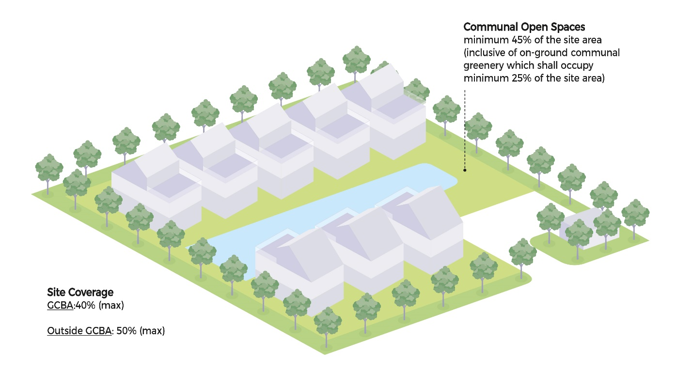
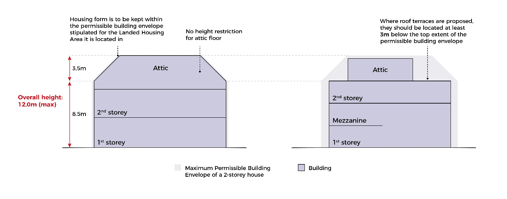
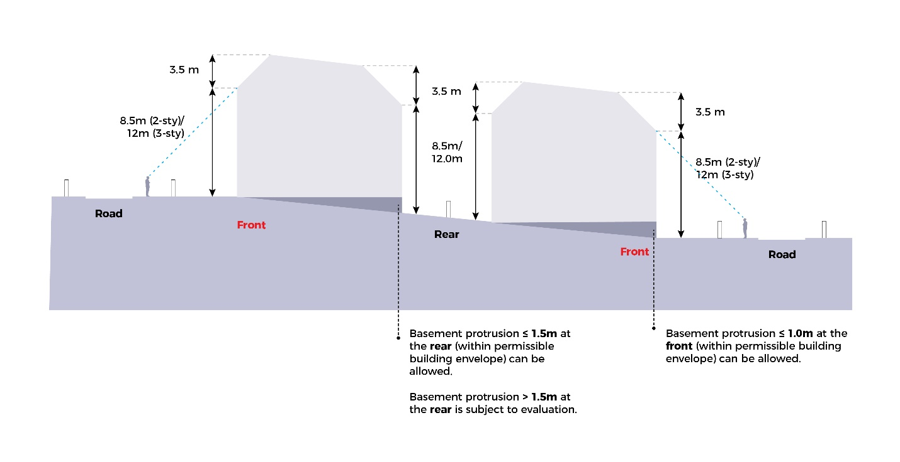

# Strata Landed Housing

**Advisory Notes**

The guidelines set out in this handbook for the various development
control parameters will generally be applied by URA in the consideration
of a development application. However, if the circumstances of a case or
the planning considerations relevant to a case so warrant, URA may in
its discretion decide to depart from these general guidelines. Persons
intending to carry out a development are advised to take this into
consideration in the conduct of their affairs and check with URA through
enquiries or development applications to confirm if their proposals can
be allowed.

The guidelines, principles and illustrations found in the handbook
series are not exhaustive in covering all possible site conditions and
building designs. In evaluating the development applications, URA
reserves the right to evaluate and impose conditions not covered in the
handbook in respond to the specific design of the development proposal
depending on merits.

**Guidelines at a Glance: Strata Landed Housing**

The table below is intended to provide an overview of the key guidelines
applicable for the development type. The full details of the guidelines
are stated in the relevant tabs of this handbook.

+----------------------+----------------------+----------------------+
| **Parameter**        | **Guidelines**       |                      |
+======================+======================+======================+
| Number of Units      | **Maximu             |                      |
|                      | m number of strata l |                      |
|                      | anded units (within  |                      |
|                      | GCBA)** {#maximum-nu |                      |
|                      | mber-of-strata-lande |                      |
|                      | d-units-within-gcba} |                      |
|                      | ---------------      |                      |
|                      | -------------------- |                      |
|                      | -------------------- |                      |
|                      |                      |                      |
|                      | No. of units = 35%   |                      |
|                      | of site area /       |                      |
|                      | 500sqm               |                      |
|                      |                      |                      |
|                      | The number of units  |                      |
|                      | will be rounded down |                      |
|                      | to the nearest whole |                      |
|                      | number.              |                      |
+----------------------+----------------------+----------------------+
|                      | **Maximum num        |                      |
|                      | ber of strata landed |                      |
|                      |  units (Outside GCBA |                      |
|                      | ) -- single housing  |                      |
|                      | form** {#maximum-num |                      |
|                      | ber-of-strata-landed |                      |
|                      | -units-outside-gcba- |                      |
|                      | single-housing-form} |                      |
|                      | -------------------  |                      |
|                      | -------------------- |                      |
|                      | -------------------- |                      |
|                      | -------------------- |                      |
|                      |                      |                      |
|                      | No. of bungalow      |                      |
|                      | units = 40% of site  |                      |
|                      | area / 200sqm        |                      |
|                      |                      |                      |
|                      | No. of terrace OR    |                      |
|                      | No. of semi-detached |                      |
|                      | housing units = 40%  |                      |
|                      | of site area /       |                      |
|                      | 100sqm               |                      |
|                      |                      |                      |
|                      | The number of units  |                      |
|                      | will be rounded down |                      |
|                      | to the nearest whole |                      |
|                      | number.              |                      |
+----------------------+----------------------+----------------------+
|                      | **Ma                 |                      |
|                      | ximum number of stra |                      |
|                      | ta landed housing un |                      |
|                      | its (Outside GCBA) - |                      |
|                      |  mix of terrace, sem |                      |
|                      | i-detached and detac |                      |
|                      | hed housing forms**  |                      |
|                      |  {#maximum-number-of |                      |
|                      | -strata-landed-housi |                      |
|                      | ng-units-outside-gcb |                      |
|                      | a---mix-of-terrace-s |                      |
|                      | emi-detached-and-det |                      |
|                      | ached-housing-forms} |                      |
|                      | ---                  |                      |
|                      | -------------------- |                      |
|                      | -------------------- |                      |
|                      | -------------------- |                      |
|                      | -------------------- |                      |
|                      | -------------------- |                      |
|                      | -------------------- |                      |
|                      |                      |                      |
|                      | (No. of Bungalow     |                      |
|                      | units x 200sqm) +    |                      |
|                      | (No. of              |                      |
|                      | Semi-detached units  |                      |
|                      | x 100sqm) + (No. of  |                      |
|                      | Terrace units x      |                      |
|                      | 100sqm) less than or |                      |
|                      | equal to 40% of site |                      |
|                      | area                 |                      |
|                      |                      |                      |
|                      | The number of units  |                      |
|                      | will be rounded down |                      |
|                      | to the nearest whole |                      |
|                      | number.              |                      |
+----------------------+----------------------+----------------------+
| Gross Floor Area     | **Gross Floor Ar     |                      |
|                      | ea (individual units |                      |
|                      | )** {#gross-floor-ar |                      |
|                      | ea-individual-units} |                      |
|                      | -------------------  |                      |
|                      | -------------------- |                      |
|                      |                      |                      |
|                      | The gross floor area |                      |
|                      | for each individual  |                      |
|                      | strata landed        |                      |
|                      | housing unit is      |                      |
|                      | resultant of the     |                      |
|                      | building form and    |                      |
|                      | envelope.            |                      |
|                      |                      |                      |
|                      | **                   |                      |
|                      | Gross Floor Area (ov |                      |
|                      | erall development)** |                      |
|                      |  {#gross-floor-area- |                      |
|                      | overall-development} |                      |
|                      | --                   |                      |
|                      | -------------------- |                      |
|                      | -------------------- |                      |
|                      |                      |                      |
|                      | For developments     |                      |
|                      | comprising strata    |                      |
|                      | landed housing only, |                      |
|                      | the overall gross    |                      |
|                      | floor area is        |                      |
|                      | resultant of the     |                      |
|                      | number of strata     |                      |
|                      | landed units         |                      |
|                      | allowed.             |                      |
|                      |                      |                      |
|                      | For residential      |                      |
|                      | developments with a  |                      |
|                      | mix of strata landed |                      |
|                      | housing and flat     |                      |
|                      | units, the overall   |                      |
|                      | Gross Floor Area is  |                      |
|                      | controlled by the    |                      |
|                      | Master Plan Gross    |                      |
|                      | Plot Ratio for the   |                      |
|                      | site.                |                      |
+----------------------+----------------------+----------------------+
| Site Coverage        | -   Outside Good     |                      |
|                      |     Class Bungalow   |                      |
|                      |     Areas (GCBA):    |                      |
|                      |     50%              |                      |
|                      |                      |                      |
|                      | -   Within Good      |                      |
|                      |     Class Bungalow   |                      |
|                      |     Areas (GCBA):    |                      |
|                      |     40%              |                      |
+----------------------+----------------------+----------------------+
| Communal Open Space  | Minimum 45% of the   |                      |
| (COS)                | nett site area^1^.   |                      |
|                      |                      |                      |
|                      | -   Of the 45%, at   |                      |
|                      |     least 25% (as %  |                      |
|                      |     of nett site     |                      |
|                      |     area) shall be   |                      |
|                      |     set aside for    |                      |
|                      |     communal,        |                      |
|                      |     on-ground        |                      |
|                      |     greenery.        |                      |
|                      |                      |                      |
|                      | -   COS areas shall  |                      |
|                      |     not be included  |                      |
|                      |     in the boundary  |                      |
|                      |     of the           |                      |
|                      |     individual       |                      |
|                      |     strata plots.    |                      |
|                      |                      |                      |
|                      | ^1^ The nett site    |                      |
|                      | area excludes land   |                      |
|                      | to be set aside for  |                      |
|                      | road widening &      |                      |
|                      | drainage reserve.    |                      |
+----------------------+----------------------+----------------------+
| Semi-Outdoor Spaces  | **Private Enclosed   |                      |
|                      | Spaces (PES)**       |                      |
|                      |                      |                      |
|                      | -   PES which form   |                      |
|                      |     part of the      |                      |
|                      |     strata area      |                      |
|                      |     shall not be     |                      |
|                      |     located within   |                      |
|                      |     the 45% COS, 2m  |                      |
|                      |     planting strips  |                      |
|                      |     and green        |                      |
|                      |     buffers.         |                      |
|                      |                      |                      |
|                      | **Private Roof       |                      |
|                      | Terrace (PRT)**      |                      |
|                      |                      |                      |
|                      | -   PRT shall be     |                      |
|                      |     orientated to    |                      |
|                      |     face away from   |                      |
|                      |     any Good Class   |                      |
|                      |     Bungalow Area.   |                      |
+----------------------+----------------------+----------------------+
| Vehicular Access and | **Vehicular Access** |                      |
| Car Parking          |                      |                      |
|                      | -   Vehicular access |                      |
|                      |     to any strata    |                      |
|                      |     unit within the  |                      |
|                      |     development      |                      |
|                      |     shall be taken   |                      |
|                      |     only from the    |                      |
|                      |     common driveway. |                      |
|                      |                      |                      |
|                      | -   Individual       |                      |
|                      |     strata units     |                      |
|                      |     shall not have   |                      |
|                      |     direct vehicular |                      |
|                      |     access from      |                      |
|                      |     public roads.    |                      |
|                      |                      |                      |
|                      | **Parking**          |                      |
|                      |                      |                      |
|                      | Each strata unit can |                      |
|                      | have up to 2 private |                      |
|                      | car park lots. These |                      |
|                      | shall be contiguous  |                      |
|                      | with the respective  |                      |
|                      | strata unit.         |                      |
+----------------------+----------------------+----------------------+
| Building Setbacks    | **Road Buffer/ Green |                      |
|                      | Buffer**             |                      |
|                      |                      |                      |
|                      | Cat 1 Road: 24m      |                      |
|                      | (incl. 5m green      |                      |
|                      | buffer)              |                      |
|                      |                      |                      |
|                      | Cat 2 Road: 12m      |                      |
|                      | (incl. 5m green      |                      |
|                      | buffer)              |                      |
|                      |                      |                      |
|                      | Cat 3-5 Road: 7.5m   |                      |
|                      | (incl. 3m green      |                      |
|                      | buffer)              |                      |
+----------------------+----------------------+----------------------+
|                      | **Setback from       |                      |
|                      | common boundaries    |                      |
|                      | with Good Class      |                      |
|                      | Bungalow Areas**     |                      |
|                      |                      |                      |
|                      | **1-2 storeys:** 3m  |                      |
|                      | (incl. 2m planting   |                      |
|                      | strip)               |                      |
|                      |                      |                      |
|                      | **3 storeys**: 25m   |                      |
|                      | (incl. 2m planting   |                      |
|                      | strip)               |                      |
|                      |                      |                      |
|                      | **Setback from       |                      |
|                      | common boundaries    |                      |
|                      | with all other       |                      |
|                      | developments**       |                      |
|                      |                      |                      |
|                      | **1-2 storeys:** 3m  |                      |
|                      | (incl. 2m planting   |                      |
|                      | strip)               |                      |
|                      |                      |                      |
|                      | **3 storeys**: 3m    |                      |
|                      | (incl. 2m planting   |                      |
|                      | strip)               |                      |
+----------------------+----------------------+----------------------+
| Ancillary Structures | Refer to *Ancillary  |                      |
|                      | Structures* in the   |                      |
|                      | Setbacks section for |                      |
|                      | detailed setback     |                      |
|                      | requirements based   |                      |
|                      | on the type of       |                      |
|                      | ancillary structure  |                      |
+----------------------+----------------------+----------------------+
| Spacing between      | Owners/developers    |                      |
| Units                | and QPs are free to  |                      |
|                      | decide the suitable  |                      |
|                      | front, side and rear |                      |
|                      | spacing between      |                      |
|                      | individual strata    |                      |
|                      | landed units within  |                      |
|                      | the site             |                      |
+----------------------+----------------------+----------------------+
| Building Appendages  | **Within GCBA**      | **Outside GCBA**     |
| (maximum projection  |                      |                      |
| into setbacks)       |                      |                      |
+----------------------+----------------------+----------------------+
|                      | **Main roof eaves**  | **Main roof eaves**  |
|                      |                      |                      |
|                      | Into road buffer: 2m | Into road buffer: 2m |
|                      |                      |                      |
|                      | Into common boundary | Into common boundary |
|                      | setback: 1.4m        | setback: 1m          |
|                      |                      |                      |
|                      | **Cantilevered       | **Cantilevered       |
|                      | ledges/ lightweight  | ledges/ lightweight  |
|                      | awnings:**           | awnings:**           |
|                      |                      |                      |
|                      | Into road Buffer:    | Into road Buffer: 1m |
|                      | 1.4m                 |                      |
|                      |                      | Into common boundary |
|                      | Into common boundary | setback: 1m          |
|                      | setback: 1.4m        |                      |
|                      |                      | **Horizontal         |
|                      | **Horizontal         | sun-shading devices  |
|                      | sun-shading devices  | or vertical fins     |
|                      | or vertical fins     | (without supports),  |
|                      | (without supports),  | planter boxes:**     |
|                      | planter boxes:**     |                      |
|                      |                      | Into road buffer:    |
|                      | Into road buffer:    | 0.5m                 |
|                      | 0.5m                 |                      |
|                      |                      | Into common boundary |
|                      | Into common boundary | setback: Not allowed |
|                      | setback: 0.5m        |                      |
|                      |                      | **Bay windows**      |
|                      | **Bay windows**      |                      |
|                      |                      | Into road buffer:    |
|                      | Into road buffer:    | Not allowed          |
|                      | Not allowed          |                      |
|                      |                      | Into common boundary |
|                      | Into common boundary | setback: Not allowed |
|                      | setback: Not allowed |                      |
|                      |                      | The prevailing GCBA  |
|                      | While the building   | setback requirements |
|                      | appendages may be    | (ie 3m and 1.6m)     |
|                      | within the           | shall apply to a     |
|                      | permissible building | landed housing plot  |
|                      | envelope, such       | if it abuts a Good   |
|                      | features may require | Class Bungalow Area. |
|                      | further evaluation   |                      |
|                      | depending on the     | While the building   |
|                      | site context.        | appendages may be    |
|                      |                      | within the           |
|                      |                      | permissible building |
|                      |                      | envelope, such       |
|                      |                      | features may require |
|                      |                      | further evaluation   |
|                      |                      | depending on the     |
|                      |                      | site context.        |
+----------------------+----------------------+----------------------+
| RC Flat Roofs        | RC flat roofs shall  |                      |
|                      | remain inaccessible  |                      |
|                      | except for           |                      |
|                      | maintenance purposes |                      |
|                      | only. Activating the |                      |
|                      | rooftop for uses     |                      |
|                      | such as roof         |                      |
|                      | terraces may be      |                      |
|                      | allowed depending on |                      |
|                      | the merits of the    |                      |
|                      | proposal. No         |                      |
|                      | structures shall be  |                      |
|                      | allowed unless       |                      |
|                      | otherwise approved   |                      |
|                      | by URA. Where        |                      |
|                      | allowed, structures  |                      |
|                      | (including any       |                      |
|                      | safety barriers)     |                      |
|                      | shall comply with    |                      |
|                      | height controls and  |                      |
|                      | the following        |                      |
|                      | guidelines.          |                      |
|                      |                      |                      |
|                      | **Solar Panels**     |                      |
|                      |                      |                      |
|                      | Planning permission  |                      |
|                      | is not required      |                      |
|                      | except in the        |                      |
|                      | following locations  |                      |
|                      | and contexts:        |                      |
|                      |                      |                      |
|                      | -   Site is subject  |                      |
|                      |     to urban design  |                      |
|                      |     guidelines or    |                      |
|                      |     located within   |                      |
|                      |     Conservation     |                      |
|                      |     Areas;           |                      |
|                      |                      |                      |
|                      | -   Elevated solar   |                      |
|                      |     panels, ie       |                      |
|                      |     raised more than |                      |
|                      |     1m from the roof |                      |
|                      |     level;           |                      |
|                      |                      |                      |
|                      | -   Spaces under     |                      |
|                      |     solar panels are |                      |
|                      |     enclosed or put  |                      |
|                      |     to commercial    |                      |
|                      |     use.             |                      |
+----------------------+----------------------+----------------------+
| Envelope Control     | Strata landed        |                      |
| Guidelines           | housing is           |                      |
|                      | controlled by the    |                      |
|                      | envelope control     |                      |
|                      | guidelines. This     |                      |
|                      | defines an allowable |                      |
|                      | building envelope    |                      |
|                      | for each strata      |                      |
|                      | landed unit based on |                      |
|                      | the setbacks, storey |                      |
|                      | height and external  |                      |
|                      | platform level.      |                      |
|                      |                      |                      |
|                      | The building         |                      |
|                      | footprint of each    |                      |
|                      | strata landed unit   |                      |
|                      | shall have minimum   |                      |
|                      | ground contact of    |                      |
|                      | 50sqm.               |                      |
|                      |                      |                      |
|                      | The permissible      |                      |
|                      | building envelopes   |                      |
|                      | for 2 and 3-storey   |                      |
|                      | landed housing is    |                      |
|                      | shown below.         |                      |
+----------------------+----------------------+----------------------+
| Minimum Building     | 50sqm                |                      |
| Footprint (per unit) |                      |                      |
+----------------------+----------------------+----------------------+
| Strata Subdivision   | The upper storeys    |                      |
|                      | and basement of each |                      |
|                      | strata unit shall    |                      |
|                      | not be subdivided    |                      |
|                      | into separate strata |                      |
|                      | units.               |                      |
|                      |                      |                      |
|                      | Common areas shall   |                      |
|                      | not be strata        |                      |
|                      | subdivided into a    |                      |
|                      | separate strata      |                      |
|                      | unit.                |                      |
+----------------------+----------------------+----------------------+
| Special and Detailed | [Special and         |                      |
| Control Plans        | Detailed Control     |                      |
|                      | Plans]{.ul}          |                      |
| ~~Control Areas~~    |                      |                      |
|                      | [Special Control     |                      |
|                      | Area                 |                      |
|                      | 1](https             |                      |
|                      | ://www.ura.gov.sg/-/ |                      |
|                      | media/Corporate/Guid |                      |
|                      | elines/Development-c |                      |
|                      | ontrol/Others/SCA_1) |                      |
|                      |                      |                      |
|                      | [Special Control     |                      |
|                      | Area                 |                      |
|                      | 2](https             |                      |
|                      | ://www.ura.gov.sg/-/ |                      |
|                      | media/Corporate/Guid |                      |
|                      | elines/Development-c |                      |
|                      | ontrol/Others/SCA_2) |                      |
|                      |                      |                      |
|                      | Developments within  |                      |
|                      | the special control  |                      |
|                      | areas may be subject |                      |
|                      | to screening         |                      |
|                      | requirements.        |                      |
+----------------------+----------------------+----------------------+
| Earthworks           | -   Earthworks are   |                      |
|                      |     not allowed      |                      |
|                      |     within the       |                      |
|                      |     building setback |                      |
|                      |     area.            |                      |
|                      |                      |                      |
|                      | -   Earthworks       |                      |
|                      |     within the       |                      |
|                      |     build-able area  |                      |
|                      |     are subject to   |                      |
|                      |     evaluation. If   |                      |
|                      |     earthfill of     |                      |
|                      |     more than 1m is  |                      |
|                      |     allowed, the     |                      |
|                      |     overall          |                      |
|                      |     aggregate        |                      |
|                      |     building height  |                      |
|                      |     measured from    |                      |
|                      |     the allowable    |                      |
|                      |     platform level   |                      |
|                      |     shall comply     |                      |
|                      |     with the maximum |                      |
|                      |     allowable        |                      |
|                      |     building height  |                      |
|                      |     control.         |                      |
|                      |                      |                      |
|                      | -   Earthfill        |                      |
|                      |     involving the    |                      |
|                      |     entire           |                      |
|                      |     development site |                      |
|                      |     may only be      |                      |
|                      |     considered if    |                      |
|                      |     the proposed     |                      |
|                      |     earthworks are   |                      |
|                      |     required to meet |                      |
|                      |     the Minimum      |                      |
|                      |     Platform Level   |                      |
|                      |     (MPL) stipulated |                      |
|                      |     by the Public    |                      |
|                      |     Utilities Board  |                      |
|                      |     (PUB).           |                      |
+----------------------+----------------------+----------------------+
| Retaining and        | **Retaining Walls**  |                      |
|                      |                      |                      |
| Boundary walls       | Outward facing       |                      |
|                      | retaining walls are  |                      |
|                      | not encouraged. If   |                      |
|                      | allowed, they shall  |                      |
|                      | not be more than 1m  |                      |
|                      | high.                |                      |
|                      |                      |                      |
|                      | **Boundary walls**   |                      |
|                      |                      |                      |
|                      | Boundary walls shall |                      |
|                      | not exceed 1.8m.     |                      |
|                      |                      |                      |
|                      | **Bo                 |                      |
|                      | undary-cum-retaining |                      |
|                      | wall**               |                      |
|                      |                      |                      |
|                      | The combined height  |                      |
|                      | of                   |                      |
|                      | bo                   |                      |
|                      | undary-cum-retaining |                      |
|                      | wall shall not       |                      |
|                      | exceed 2.8m, of      |                      |
|                      | which solid wall     |                      |
|                      | shall not exceed     |                      |
|                      | 1.8m.                |                      |
+----------------------+----------------------+----------------------+

**Introduction**

*Illustration of a Strata Landed Housing Development*

A strata landed housing comprises strata-titled landed housing units
occupying a common development site with shared communal facilities and
a single vehicular access point.

Any of the following three basic types of landed housing form can be
built as strata landed housing:

-   Strata bungalows (detached houses);

-   Strata semi-detached houses (houses defined by their partial
    > attachment on one side to another unit);

-   Strata terrace houses (houses that are attached along a common
    > boundary party wall and are part of a row of at least three
    > units).

A strata landed development site may have a mix of bungalows,
semi-detached houses and terrace houses occupying a common development
site with shared communal facilities and a single vehicular access
point. The building footprint of each strata landed unit shall have
minimum ground contact of 50sqm. All other requirements are guided by
the envelope control guidelines and respective parameters for the
relevant landed housing type.

Strata landed houses may be allowed within a flats development
site. [Such hybrid developments are not accorded condominium
status]{.ul}. They are not allowed in designated landed housing areas.

The number of strata landed housing units allowable depends on the type
of landed housing forms proposed apart from a minimum communal open
space provision requirement. This is to safeguard amenity for strata
landed housing residents, and maintain compatibility of the strata
landed housing development with surrounding landed housing estates.

**Locational Criteria**

**Safeguarded Landed Housing Areas**

**Allowable landed housing estate locations for strata landed housing
forms**

+--------------------------------+------------------------------------+
| **Strata Landed Housing Form** | **Type of Safeguarded Landed       |
|                                | Housing Area** \                   |
|                                | *Please refer to [[URA             |
|                                | SPACE]{.ul}](https://www.          |
|                                | ura.gov.sg/maps2/?service=LHA) for |
|                                | the locations of the safeguarded   |
|                                | landed housing estates.*           |
+================================+====================================+
| Strata Detached (Bungalow)     | -   Bungalow areas (including      |
|                                |     > GCBA)                        |
|                                |                                    |
|                                | -   Semi-detached areas            |
|                                |                                    |
|                                | -   Mixed landed housing areas     |
+--------------------------------+------------------------------------+
| Strata Semi-Detached           | -   Semi-detached areas            |
|                                |                                    |
|                                | -   Mixed landed housing areas     |
+--------------------------------+------------------------------------+
| Strata Terrace                 | Mixed landed housing areas         |
+--------------------------------+------------------------------------+
| Mixed Strata Landed            | Mixed landed housing areas         |
+--------------------------------+------------------------------------+

**Landed Housing guided by Street Block Plans**

Where there is a street block plan to guide landed housing development,
the planning guidelines and requirements stipulated in the street block
plan shall apply.

Conservation guidelines shall also apply for landed housing gazetted for
conservation, such as in the residential historic districts of Blair
Plain, Cairnhill and Emerald Hill.

  **Street Block Plans**
  -------------------------------------------------------------------------------------------------------------------------------------------------------------------------------------------------------------------------------------------------------------------------------------------------------------------------------------------------------------------
  [[Boon Teck Road/Jalan Kemamam (Novena Planning Area)]{.ul}](https://intranet.ura.gov.sg/Corporate/Guidelines/Development-Control/Residential/Strata-Landed-Housing/-/media/168D3AFE46D044D087B7354090ED021C.ashx)
  [[Cashew Terrace (Bukit Panjang Planning Area)]{.ul}](https://intranet.ura.gov.sg/Corporate/Guidelines/Development-Control/Residential/Strata-Landed-Housing/-/media/7CBC4F55A9B84097BBA4DC2535FA6940.ashx)
  [[Changi Heights (Pasir Ris Planning Area)]{.ul}](https://intranet.ura.gov.sg/Corporate/Guidelines/Development-Control/Residential/Strata-Landed-Housing/-/media/C3B4C4B75FF9444C915E197AE66FDAD0.ashx)
  [[Cheng Soon Garden \[no. 1 to 73 (odd numbers)\] / Kismis Avenue \[no. 2 to 68 (odd numbers)\] (Bukit Timah Planning Area)]{.ul}](https://intranet.ura.gov.sg/Corporate/Guidelines/Development-Control/Residential/Strata-Landed-Housing/-/media/2FA4FF644AAA4F12A42D687AA6C15F92.ashx)
  [[Clementi Green Estate (Bukit Timah Planning Area)]{.ul}](https://intranet.ura.gov.sg/Corporate/Guidelines/Development-Control/Residential/Strata-Landed-Housing/-/media/5F859AEA44104401ABF76DB33C4C0E92.ashx)
  [[Dido Street/ Dafne Street/ Aida Street (Bedok Planning Area)]{.ul}](https://intranet.ura.gov.sg/Corporate/Guidelines/Development-Control/Residential/Strata-Landed-Housing/-/media/41710949136143F6852415BB64E01B46.ashx)
  [[Emerald Hill Road \[no. 87 to 107\] / Saunders Road \[no. 32 to 56 (even numbers)\] (Emerald Hill Conservation Area / Newton Planning Area)]{.ul}](https://intranet.ura.gov.sg/Corporate/Guidelines/Development-Control/Residential/Strata-Landed-Housing/-/media/1817A65869764800A93A199124A6B369.ashx)
  [[Ernani Street \[no. 2 to 38 (even)\]/ Rienzi Street House \[no. 1 to 41 (odd & even)\] / Norma Terrace \[no. 1 to 41 (odd)\] (Bedok Planning Area)]{.ul}](https://intranet.ura.gov.sg/Corporate/Guidelines/Development-Control/Residential/Strata-Landed-Housing/-/media/E937B6DFA0BB4B93AE82673FFE3E437F.ashx)
  [[Everitt Road (Geylang Planning Area)]{.ul}](https://intranet.ura.gov.sg/Corporate/Guidelines/Development-Control/Residential/Strata-Landed-Housing/-/media/F673AE34EFAC4723859FFCF2C9231683.ashx)
  [[Ford Avenue (Bukit Timah Planning Area)]{.ul}](https://intranet.ura.gov.sg/Corporate/Guidelines/Development-Control/Residential/Strata-Landed-Housing/-/media/692C50C2F5D34ECD9ECE90FE7E7669AB.ashx)
  [[Hillcrest Road \[no. 104 - 114 and 132 -- 190\] (Bukit Timah Planning Area)]{.ul}](https://intranet.ura.gov.sg/Corporate/Guidelines/Development-Control/Residential/Strata-Landed-Housing/-/media/B17EFB7E6D5E4A5E82CDECF6CE7AF156.ashx)
  [[Hong Leong Garden Estate (Clementi Planning Area)]{.ul}](https://intranet.ura.gov.sg/Corporate/Guidelines/Development-Control/Residential/Strata-Landed-Housing/-/media/9BB28810EF01492487E98CA5C53B5513.ashx)
  [[Jalan Jelita / Jalan Istimewa / Jalan Tenang / Holland Road \[no. 263 to 289 (odd numbers)\] (Bukit Timah Planning Area)]{.ul}](https://intranet.ura.gov.sg/Corporate/Guidelines/Development-Control/Residential/Strata-Landed-Housing/-/media/0A0FDECB7F4D4C4FBAF0B8A91DA1034B.ashx)
  [[Jalan Limbok (no. 1 to 35) / Yio Chu Kang Road (no. 183 to 205)(Hougang Planning Area)]{.ul}](https://intranet.ura.gov.sg/Corporate/Guidelines/Development-Control/Residential/Strata-Landed-Housing/-/media/F421A8946DD645FB9624D9942CF87D00.ashx)
  [[Jalan Salang \[no. 57 -- 87\] (Sembawang Planning Area)]{.ul}](https://intranet.ura.gov.sg/Corporate/Guidelines/Development-Control/Residential/Strata-Landed-Housing/-/media/FE616B9BEC044FE583587214FF86C7E4.ashx)
  [[Jalan Wangi \[no. 11 to 69 \[odd numbers)\] (Toa Payoh Planning Area)]{.ul}](https://intranet.ura.gov.sg/Corporate/Guidelines/Development-Control/Residential/Strata-Landed-Housing/-/media/40DE211062BC47CC8466A941ECE991AF.ashx)
  [[Jasmine Road \[no. 2 to 2P\] / Gardenia Road \[no. 2 to 30\] (Bishan Planning Area)]{.ul}](https://intranet.ura.gov.sg/Corporate/Guidelines/Development-Control/Residential/Strata-Landed-Housing/-/media/DF2FF075EB264A388477D7859C35014C.ashx)
  [[Jasmine Road (Bishan Planning Area)]{.ul}](https://intranet.ura.gov.sg/Corporate/Guidelines/Development-Control/Residential/Strata-Landed-Housing/-/media/EFAE68C36A0F4356905371D36488E790.ashx)
  [[Lasia Avenue (Bukit Timah Planning Area)]{.ul}](https://intranet.ura.gov.sg/Corporate/Guidelines/Development-Control/Residential/Strata-Landed-Housing/-/media/98FB0A64F2524DD29D73DA645D6A9EA4.ashx)
  [[Li Hwan Walk / Li Hwan Close / Li Hwan Terrace / Li Hwan Place / Li Hwan Drive (Serangoon Planning Area)]{.ul}](https://intranet.ura.gov.sg/Corporate/Guidelines/Development-Control/Residential/Strata-Landed-Housing/-/media/21D504F6FB194516AEB50E94D491B420.ashx)
  [[Lowland Road (Hougang Planning Area)]{.ul}](https://intranet.ura.gov.sg/Corporate/Guidelines/Development-Control/Residential/Strata-Landed-Housing/-/media/C9208BA95B584B06B1054D0A2DCF1202.ashx)
  [[Pang Seng Road / Wan Tho Avenue \[no. 27 to 27J\] (Toa Payoh Planning Area)]{.ul}](https://intranet.ura.gov.sg/Corporate/Guidelines/Development-Control/Residential/Strata-Landed-Housing/-/media/84079376B9A5493CBA53DB4D3111F7D4.ashx)
  [[Paya Lebar Gardens (Hougang Planning Area)]{.ul}](https://intranet.ura.gov.sg/Corporate/Guidelines/Development-Control/Residential/Strata-Landed-Housing/-/media/9CBF9BC9F6B64B06A1DCEBC91D53B4CA.ashx)
  [[Peach Garden (Marine Parade Planning Area)]{.ul}](https://intranet.ura.gov.sg/Corporate/Guidelines/Development-Control/Residential/Strata-Landed-Housing/-/media/EE6EA17F131E4E0C8E8E3ACA0087297E.ashx)
  [[Pheng Geck Avenue/Wan Tho Avenue/Puay Hee Avenue (Toa Payoh Planning Area)]{.ul}](https://intranet.ura.gov.sg/Corporate/Guidelines/Development-Control/Residential/Strata-Landed-Housing/-/media/B33AF76C33404CD7B74AA71E5B8E0BE7.ashx)
  [[Richards Place/Richards Avenue (Hougang Planning Area)]{.ul}](https://intranet.ura.gov.sg/Corporate/Guidelines/Development-Control/Residential/Strata-Landed-Housing/-/media/216E2367B87B4260B9C1A09023106858.ashx)
  [[Seletar Road from Jalan Lebat Daun/Jalan Joran to Seletar Close (Serangoon Planning Area)]{.ul}](https://intranet.ura.gov.sg/Corporate/Guidelines/Development-Control/Residential/Strata-Landed-Housing/-/media/BF1ECA8DCEF04ACBB335BDFEE9CEDD78.ashx)
  [[The Inglewood (Bishan Planning Area)]{.ul}](https://intranet.ura.gov.sg/Corporate/Guidelines/Development-Control/Residential/Strata-Landed-Housing/~/link.aspx?_id=FFCE8BA0C66C47F8B93DBD7443E6AD5F&_z=z)
  [[Watten Drive \[no. 1 to 73 (odd numbers) and no. 2 to 24 (even numbers)\] / Watten Close \[no. 2 to 28 (even numbers)\] / Watten Estate \[no. 49 to 61 (odd numbers)\] (Bukit Timah Planning Area)]{.ul}](https://intranet.ura.gov.sg/Corporate/Guidelines/Development-Control/Residential/Strata-Landed-Housing/-/media/4EE75EC1E0E94B39A347C69FB3263515.ashx)
  [[Watten Rise House \[no. 5 to 41 (odd numbers) and no. 2 to 18 (even numbers)\] / Watten Drive \[no. 26 to 60 (even numbers)\] (Bukit Timah Planning Area)]{.ul}](https://intranet.ura.gov.sg/Corporate/Guidelines/Development-Control/Residential/Strata-Landed-Housing/-/media/2764242C890A4170A72D5CFC1B0F276A.ashx)
  [[Yan Kit Road (Outram Planning Area)]{.ul}](https://intranet.ura.gov.sg/Corporate/Guidelines/Development-Control/Residential/Strata-Landed-Housing/-/media/DF790651DD8549D69DF07D2DCDB1B3B8.ashx)
  [[Yuk Tong Avenue \[no. 88, 88A, 90, 90A, 92 & 92A\] (Bukit Timah Planning Area)]{.ul}](https://intranet.ura.gov.sg/Corporate/Guidelines/Development-Control/Residential/Strata-Landed-Housing/-/media/27DC58D39AE94C18A1C679AE1791ABD5.ashx)

**Landed Housing in Other Areas**

Other sites zoned for residential use in the prevailing Master Plan may
be considered for landed housing developments, depending on site context
and conditions. Landed houses outside Designated Landed Housing Areas
and not guided by the street block plans are subject to a 3-storey
height control. The prevailing landed housing planning guidelines and
requirements shall also apply.

### Special and Detailed Control Plans 

Special and Detailed Control Plans (SDCP) provide detailed guidelines
for specific areas. The SDCPs may be viewed [here]{.ul}.

**Special Control Areas**

The following areas may be subject to security screening requirements.
URA will confirm this upon submission of a proposed development.

{width="6.496062992125984in"
height="3.60621062992126in"}

*Special Control Area 1*

{width="6.496062992125984in"
height="3.3169400699912512in"}

*Special Control Area 2*

Qualified Persons (QPs) should consider the screening requirements in
the early stage of their planning and design to avoid abortive work
subsequently.

Where security screening is deemed necessary, it shall consist of
permanent fixtures that are difficult, if not impossible to remove. The
following screening measures may be considered:

#### **Visual Screening**

Residential units and common areas may be screened where necessary with
blank walls, external concrete/metal fins, or the building may be
re-orientated such that the windows^1^/openings/balconies do not have
direct view towards the protected area.

^1^ **Window**: Raised openings that are at least 0.9m above the floor
slab. They are intended to provide ventilation and lighting, and not for
access. Full height windows and windows that are lower than 0.9m that
can potentially be used as access points will need to be highlighted in
the submission plans for URA's evaluation and approval.

#### **Roof Screening**

The parapet wall at the rooftop shall be at least 3m high and access to
the rooftop from a public area shall be secured by a lockable
door/hatch. The door/hatch may be electronically linked to an alarm
system monitored by the building management.**\
**

**Number of Units**

**Maximum number of strata landed units**

*Dwelling Unit Cap and Maximum GFA*

The cap on the number of allowable units in strata landed housing
developments shall be based on the typical footprint of the conventional
landed housing form used and the development\'s location.

The formulae to compute the maximum number of allowable units in the
various types of strata landed housing developments are shown in the
table below.

The number of units shall be rounded down to the nearest whole number.
Where necessary, URA may impose stricter controls on the allowable
number of strata landed units for developments in localised areas of
concern (eg severe infrastructural capacity issues), in consultation
with other agencies.

**Formulae for computing maximum number of strata landed units**

+----------------------------------+----------------------------------+
| **Location of Strata Landed      | **Formulae to calculate maximum  |
| Housing Developments**           | number of DUs allowed**          |
+==================================+==================================+
| Within GCBAs                     | 35% of site area / Y2 \          |
|                                  | \                                |
|                                  | Where **Y2** = Typical footprint |
|                                  | for a Good Class Bungalow        |
|                                  | (500sqm)                         |
+----------------------------------+----------------------------------+
| Outside GCBAs (single form of    | 40% of site area / Y1 \          |
| landed housing)                  | \                                |
|                                  | Where **Y1** = Typical footprint |
|                                  | for the relevant conventional    |
|                                  | landed housing form, as          |
|                                  | follows:                         |
|                                  |                                  |
|                                  | -   Other Bungalows: 200sqm      |
|                                  |                                  |
|                                  | -   Terrace and Semi-Detached    |
|                                  |     > housing: 100sqm            |
+----------------------------------+----------------------------------+
| Outside GCBAs (mix of landed     | (B × Y) + (SD × Y1) + (T × Y1) ≤ |
| housing form eg a mix of         | 40% of site area\                |
| terrace, semi-detached and       | \                                |
| detached housing units           | Where: \                         |
|                                  | **B** = Number of detached       |
|                                  | housing units \                  |
|                                  | **SD** = Number of semi-detached |
|                                  | housing units \                  |
|                                  | **T** = Number of terrace        |
|                                  | housing units \                  |
|                                  | **Y1** = Typical footprint for   |
|                                  | the relevant conventional landed |
|                                  | housing form                     |
+----------------------------------+----------------------------------+

**Gross Floor Area (Individual Units)**

The gross floor area for each individual strata landed housing unit is
the resultant of the building form and envelope.

**Gross Floor Area (Overall Development)**

For developments comprising strata landed housing only, the overall
gross floor area is the resultant of the number of strata landed units
allowed. Refer to section above.

For residential developments with a mix of strata landed housing and
flat units, the overall Gross Floor Area shall be controlled by the
Master Plan Gross Plot Ratio for the site.

**Commercial Quantum**

Commercial uses are not allowed within strata landed housing
developments.

**Site Coverage**

*Site Coverage and Communal Open Space*

-   For strata landed housing developments outside Good Class Bungalow
    > Areas, the maximum site coverage is 50%.

-   For strata landed housing developments within Good Class Bungalow
    > Areas, the maximum site coverage is 40%.

**Communal Open Spaces**

To safeguard the living environment of strata landed developments,
minimum 45% of the nett site area^1^ of the strata landed housing
development shall be set aside for Communal Open Space (COS).

^1^ The nett site area shall exclude land to be set aside for road
widening & drainage reserve.

COS are communal recreational spaces provided for residents' enjoyment.
Examples of COS are in the table below:

**Examples of COS**

+----------------------------------+----------------------------------+
| **Examples of spaces that        | **Examples of spaces that do not |
| qualify as COS**                 | qualify as COS**                 |
+==================================+==================================+
| Recreational facilities that are | Buildings and other ancillary    |
| uncovered and raised no more     | structures (eg substations) that |
| than 1m above ground level such  | are already computed as site     |
| as:                              | coverage                         |
|                                  |                                  |
| -   Exercise equipment and       |                                  |
|     structures in fitness areas; |                                  |
|                                  |                                  |
| -   Game courts for tennis,      |                                  |
|     basketball etc;              |                                  |
|                                  |                                  |
| -   Swimming pool; wading pool.  |                                  |
+----------------------------------+----------------------------------+
| Structures that form part of     | Driveways and parking lots       |
| landscaping features such as:    |                                  |
|                                  |                                  |
| -   Art sculptures;              |                                  |
|                                  |                                  |
| -   Fountains.                   |                                  |
+----------------------------------+----------------------------------+
|                                  | Fire-engine hard-standing        |
|                                  | ground/access and other service  |
|                                  | areas                            |
+----------------------------------+----------------------------------+
|                                  | Voids at ground level            |
|                                  | overlooking basements            |
+----------------------------------+----------------------------------+

Of the 45% COS, at least 25% (as a percentage of site area) shall be set
aside for communal on-ground greenery.

Areas classified as COS shall not be included in the boundary of the
individual strata plots. For instance, the 2m planting strips and green
buffers which form part of the minimum 45% COS provision, shall not
contain any Private Enclosed Spaces (PES).

**Semi-Outdoor Spaces**

**Private Enclosed Spaces**

-   The Private Enclosed Spaces (PES) which forms part of the strata
    area shall not be located within the 45% COS, 2m planting strips and
    green buffers.

-   [PES shall be physically demarcated from common areas]{.ul}. Any PES
    fencing that defines the extent of the PES shall not exceed 1m in
    height. This is to ensure the open and semi-outdoor nature of the
    PES is maintained.

-   A 1.8m screen wall may be proposed between PES adjoining each other
    for privacy purposes. Full height separating walls between adjoining
    PES may be allowed if they are to meet FSSD's requirements.

**Private Roof Terrace**

-   For strata landed housing developments near GCBA, Private Roof
    Terraces (PRT) shall be orientated to face away from the Good Class
    Bungalows.

**Vehicular Access and Parking**

**Vehicular Access**

Vehicular access to any strata unit within the development shall be
taken only from the common driveway.

Individual strata units shall not have direct vehicular access from
public roads.

**Car Park Provision**

The overall car park provision for the development shall comply with
LTA's car parking standards.

-   Each strata unit can have up to 2 private car park lots. These shall
    be contiguous with the respective strata unit.

-   These private car park lots may be excluded from gross floor area
    computation. They shall not be subsequently converted to other uses.

### 

### Building Setback from Boundary

*Building Setback*

These guidelines are applicable to residential developments comprising
strata landed housing only.

**Road Buffer and Green Buffer**

The building setback controls of strata landed housing developments from
public roads shall be determined by the road buffer as shown in the
table below. Where the strata landed housing development site fronts two
or more public roads, the buffer requirements from the roads shall be
applied to all boundaries fronting roads.

**Road Buffer and Green Buffer requirements**

  ------------------------------------------------------
  **Road Category**   **Road Buffer and Green Buffer**
  ------------------- ----------------------------------
  Category 1          24m\
                      (including 5m green buffer)

  Category 2          12m\
                      (including 5m green buffer)

  Category 3 - 5      7.5m\
                      (including 3m green buffer)
  ------------------------------------------------------

**Common Boundaries Setback and Planting Strip**

Any strata unit within the development site shall be set back 3m
(minimum) from the common site boundary with another development.

A wider setback shall be required for 3-storey strata landed housing
sharing a common boundary with

Good Class Bungalow Areas (GCBA).

**Setback of Strata Landed Housing from Common Boundaries**

  ------------------------------------------------------------------------------------------------------------------------------------------------
  **Strata Landed Housing Storey Height**   **Minimum Setback from Common Boundary with GCBA Plots**   **Minimum Setback from Common Boundaries\
                                                                                                       (All other developments)**
  ----------------------------------------- ---------------------------------------------------------- -------------------------------------------
  1 -- 2 storeys\*                          3m (including 2m green planting strip)                     3m (including 2m green planting strip)

  3 storeys                                 25m (including 2m green planting strip)                    3m (including 2m green planting strip)
  ------------------------------------------------------------------------------------------------------------------------------------------------

\*Roof terrace(s), if proposed, shall be orientated to face away from
the GCBA.

**Ancillary Structures**

*Setback Requirements for Ancillary Structures*

Ancillary structures are minor structures erected to support the main
use of the site. The building setback distance and height control for
ancillary structures shown in the table below.

Ancillary structures located within the green buffer and tree-planting
strip may be assessed in accordance with the objective-based guidelines
administered by NParks --
see [here](https://www.nparks.gov.sg/partner-us/development-plan-submission/guidelines-on-greenery-provision-and-tree-conservation-for-developments).

Ancillary structures located within the physical buffer and building
setback that exceed the requirements in the table above, but are below
6m in height, shall be evaluated depending on the merits of the design
and function.

**Minimum Setback Requirements for Ancillary Structures**

  -----------------------------------------------------------------------------------------------------------------------------------------------------------------------------------------------------------------------------------------------
  **Type of Ancillary Structure**   **Required Setback from Road**                                                                               **Required Setback from Other Boundaries**                                  **Height Control**
  --------------------------------- ------------------------------------------------------------------------------------------------------------ --------------------------------------------------------------------------- --------------------
  Electric Substation               Category 1 & 2 roads: 5m\                                                                                    Outside GCBA: 2m\                                                           6m
                                    \                                                                                                            \                                                                           
                                    Category 3 -- 5 roads: 3m                                                                                    Within GCBA or with GCBA plots: 3m                                          

  Sunken Swimming Pool                                                                                                                                                                                                       Not applicable

  Raised Swimming Pool              Follow road buffer standards                                                                                                                                                             

  Water Tank & Pump                                                                                                                                                                                                          

  Meter Compartment                 Subject to evaluation                                                                                        If these are located within the green buffer or tree planting strip, 1.8m   

  Bin Point                                                                                                                                                                                                                  

  Guardhouse                                                                                                                                     If this is located within the green buffer or tree planting strip, 2.6m     

  Generator Set                     Subject to evaluation\                                                                                                                                                                   
                                    Adequate setback may have to be provided to minimise glare and noise disturbance to adjoining developments                                                                               
  -----------------------------------------------------------------------------------------------------------------------------------------------------------------------------------------------------------------------------------------------

**Minor Building Appendages**

**Maximum allowable protrusion into road buffer and common boundary
setbacks**

+----------------------+----------------------+----------------------+
| **Appendages**       | **Within GCBA**      | **Outside GCBA**     |
+======================+======================+======================+
| While the building   |                      |                      |
| appendages may be    |                      |                      |
| within the           |                      |                      |
| permissible building |                      |                      |
| envelope, such       |                      |                      |
| features may require |                      |                      |
| further evaluation   |                      |                      |
| depending on the     |                      |                      |
| site context, to     |                      |                      |
| ensure that they do  |                      |                      |
| not substantially    |                      |                      |
| add to building      |                      |                      |
| bulk.                |                      |                      |
+----------------------+----------------------+----------------------+
| **Main roof          | Into road buffer:    | Into road buffer:    |
| eaves^1^**\          | 2m \                 | 2m \                 |
| \                    | \                    | \                    |
| ^1^ Secondary roof   | Into common boundary | Into common boundary |
| eaves may only       | setback: 1.4m        | setback: 1m          |
| extend 1m beyond the |                      |                      |
| permissible building |                      |                      |
| envelope.            |                      |                      |
+----------------------+----------------------+----------------------+
| **Ledges or          | Into road buffer:    | Into road buffer:    |
| cantilevered         | 1.4m \               | 1m \                 |
| awnings^2^ (without  | \                    | \                    |
| vertical supports)** | Into common boundary | Into common boundary |
|                      | setback: 1.4m        | setback: 1m          |
| ^2^ The maximum      |                      |                      |
| projection (i.e. 1m  |                      |                      |
| or 1.4m) into the    |                      |                      |
| road buffer or into  |                      |                      |
| the common boundary  |                      |                      |
| setback applies to   |                      |                      |
| retractable awnings  |                      |                      |
| when they are fully  |                      |                      |
| stretched out (i.e.  |                      |                      |
| not when the awnings |                      |                      |
| are in their         |                      |                      |
| retracted positions) |                      |                      |
+----------------------+----------------------+----------------------+
| **Horizontal         | Into road buffer:    | Into road buffer:    |
| sun-shading devices, | 0.5m \               | 0.5m \               |
| vertical sun-shading | \                    | \                    |
| fins/ screens, other | Into common boundary | Not to encroach into |
| minor decorative     | setback: 0.5m        | common boundary      |
| features^3^, planter |                      | setback              |
| boxes^4^**\          |                      |                      |
| \                    |                      |                      |
| ^3^ includes light   |                      |                      |
| weight cantilevered  |                      |                      |
| screens spaced apart |                      |                      |
| for sun-shading      |                      |                      |
| purpose without      |                      |                      |
| vertical supports.   |                      |                      |
| All such structural  |                      |                      |
| projections shall    |                      |                      |
| not exceed 500mm in  |                      |                      |
| depth. \             |                      |                      |
| \                    |                      |                      |
| ^4^ **Planter        |                      |                      |
| boxes**:             |                      |                      |
| cantilevered box     |                      |                      |
| structures for       |                      |                      |
| planting purposes.   |                      |                      |
+----------------------+----------------------+----------------------+
| **Bay windows^5^**\  | Not to encroach into |                      |
| \                    | road buffer or       |                      |
| ^5^ **Bay Window**:  | common boundary      |                      |
| Raised windows not   | setback              |                      |
| exceeding one        |                      |                      |
| structural bay width |                      |                      |
| and cantilevered at  |                      |                      |
| least 0.5m high from |                      |                      |
| the floor.           |                      |                      |
+----------------------+----------------------+----------------------+

**Unit Spacing**

Owners/developers and Qualified Persons are free to decide the suitable
front, side and rear spacing between individual strata landed units
within the site.

**RC Flat Roofs**

RC flat roofs shall remain inaccessible except for maintenance purposes
only^1^. Activating the rooftop for uses such as roof terraces may be
allowed depending on the merits of the proposal. No structures shall be
allowed unless otherwise approved by URA. Where allowed, structures
(including any safety barriers) shall comply with height controls^2^ and
the following guidelines.

^1 ^RC flat roofs that are accessible via ladders for maintenance
purposes only are subject to agencies' requirements for safety barriers
to ensure the safety of maintenance personnel. Safety barriers shall not
exceed 1m in height and may be considered beyond the permissible
building envelope.

^2^ Height controls applicable, include:

-   Absolute technical height constraints^@^ (e.g. Aviation paths
    restrictions, military and telecommunications installations).

-   Conservation guidelines (available at [URA
    SPACE](https://www.ura.gov.sg/maps/?service=STB))

-   Urban design height controls (available at [URA
    SPACE](https://www.ura.gov.sg/maps/?service=STB))

^@^ The absolute technical height (Based on Singapore Height Datum
\[SHD\]) shall take precedence if it is stricter than any of the other
height controls.

**Solar Panels**

The installation of solar panels on RC flat roofs may be considered if
they meet the following criteria:

a.  Solar panels are installed between 10 to 15 degrees relative to the
    horizontal plane to optimise the performance of solar panels and
    minimise glare to the buildings in the vicinity.

Installation of solar panels and M&E equipment such as inverters for the
solar panel system does not require planning permission except in
locations and contexts described below.

**Planning Permission**

a.  **Areas subject to urban design guidelines and Conservation
    > Areas^1^ shall require planning permission due to their impact on
    > the roofscape. **

> ^1^ For Conservation Areas, installation of solar panels without any
> additional works are treated as localised works for the purpose of
> repair and maintenance and are considered Category 3 works for
> Conserved Buildings. Applications for such Category 3 works can be
> made by owners and contractors. Refer to the Conservation
> Guidelines [here](https://intranet.ura.gov.sg/Corporate/Guidelines/Development-Control/Residential/Strata-Landed-Housing/~/link.aspx?_id=6F28BA0B83114572ACA7DC1DFB84DBAC&_z=z) and
> information on submission
> procedure [here](https://intranet.ura.gov.sg/Corporate/Guidelines/Development-Control/Residential/Strata-Landed-Housing/~/link.aspx?_id=C2CDF8FDF76E401086C69F6F63B875B5&_z=z).

b.  **Elevated solar panels^2^ located in developments on the following
    > land use zones shall require planning permission:**

+----------------------------------+----------------------------------+
| -   Residential (landed housing, | -   White                        |
|     > flats and condominium      |                                  |
|     > housing developments)      | -   Residential / Institution    |
|                                  |                                  |
| -   Residential with Commercial  | -   Commercial / Institution     |
|     > at 1^st^Storey             |                                  |
|                                  | -   Educational Institution      |
| -   Mixed Commercial &           |                                  |
|     > Residential                | -   Place of Worship             |
|                                  |                                  |
| -   Commercial                   | -   Civic & Community            |
|                                  |     > Institution                |
| -   Hotel                        |                                  |
+----------------------------------+----------------------------------+

> ^2^ A solar panel is deemed to be elevated if it is raised more than
> 1m from the roof level for landed housing developments or 1.8m from
> the roof level for other developments.

c.  **Spaces under solar panels are enclosed or put to commercial use**

> Planning permission shall be required if the spaces under elevated or
> non-elevated solar panels are enclosed or put to commercial uses such
> as Outdoor Refreshment Areas. In such instances, the spaces shall be
> computed as GFA.

**Assessment of Storey Height**

Elevated solar panels that require planning permission may be assessed
as an additional storey for storey height control purposes unless they
comply with the guidelines below:

**Guidelines for Elevated Solar Panels**

  **Parameter**   **Guidelines**
  --------------- ---------------------------------------------------------------------
  Extent          Within the 45-degree line from the springing line of the roof level
  Height          Maximum 1m above roof level

*Extent and Height of Elevated Solar Panels*

### 

### Envelope Control Guidelines

{width="6.496062992125984in"
height="2.796327646544182in"}

*Envelope Control Guidelines*

From 11 May 2015, landed housing is controlled by the envelope control
guidelines. The guidelines define an allowable building envelope for
each landed housing unit based on the landed housing type, setbacks and
storey height.

-   The building footprint of each strata landed unit shall have minimum
    > ground contact of 50sqm;

-   Each unit shall not exceed the permissible building envelope for its
    > landed housing type^1^;

-   The building envelope is illustrated in the figures below.

For existing strata landed housing approved under previous landed
housing guidelines, new Additions and Alterations works shall comply
with the permissible building envelope in the Envelope Control
guidelines.

Where the existing building already exceeds the permissible building
envelope, the new Additions and Alterations shall not further increase
the building bulk. URA will assess such applications on a case-by-case
basis.

^1^ For more details on the allowable configurations for the
semi-detached and terrace landed housing types, refer to Semi-Detached
Housing and Terrace Housing sections respectively.

**Building Height**

Under the envelope control guidelines, the overall building height for
each strata landed housing unit shall be based on the allowable number
of storeys and the floor-to-floor height in metres. The figures below
show the building envelope and the relationship between storey height
and allowable building height in metres.

-   Strata landed housing shall not exceed the 2 or 3-storey height
    > control, or the prescribed storey height as shown in the
    > designated landed housing plan in the Master Plan, whichever is
    > lower. This is to ensure that the height of the development is
    > sympathetic to the existing neighbourhood character^2^.

-   The allowable building height is measured from the external platform
    > level. If there is an existing level difference within the site,
    > the allowable building envelope height may be taken separately
    > from the two distinct platform levels.

-   Lift overrun and safety barriers at RC flat roofs may be considered
    > up to 1m beyond the allowable building height.

{width="6.496062992125984in"
height="2.65787510936133in"}

*2-storey Envelope Control landed housing*

{width="6.496062992125984in"
height="3.032283464566929in"}

*3-storey Envelope Control landed housing*

^2^ Other height controls may also be applicable, such as:

-   Absolute technical height constraints^@^ (eg Aviation paths
    > restrictions, military and telecommunications installations).

-   Conservation guidelines (available at [URA
    > SPACE](https://www.ura.gov.sg/maps/?service=STB))

-   Urban design height controls (available at [URA
    > SPACE](https://www.ura.gov.sg/maps/?service=STB))

^@^ The absolute technical height ~~in terms of metres AMSL~~ (based on
Singapore Height Datum \[SHD\]) shall take precedence if it is stricter
than any the other height controls.

**Mezzanine Floors**

Mezzanine floors are no longer required to be kept to below 50% of a
typical floor plate, and there are no restrictions on window openings on
the front façade of the mezzanine floors.

Landed houses with mezzanine floors shall be designed within the
permissible building envelope stipulated for the landed housing estate
it is located in (ie maximum 12 m overall height for a designated
two-storey landed housing estate and 15.5 m for a designated
three-storey landed housing estate). The headroom proposed for each
floor shall promote good internal spatial quality for residential
living.

*Guidelines for Mezzanine Floor*

**Attics**

An attic is an incidental space that may be allowed within the
permissible two-storey and three-storey envelopes respectively. Where
roof terraces are proposed on attic roofs, they shall be located at
least 3m below the top extent of the permissible building envelope to
ensure future coverings by homeowners remain within the overall building
envelope. Roofs with less than 3m below the top extent of the
permissible building envelope shall be proposed as RC flat roofs that
are non-accessible except for maintenance purposes.

*Attic Guidelines (view high-res illustration [here](https://intranet.ura.gov.sg/Corporate/Guidelines/Development-Control/Residential/Strata-Landed-Housing/-/media/F44E85AD43544AF8995D6B7EE186A83B.ashx))*

**Basements**

Basements may be built up to the limits shown in the table below.

**Basement Setbacks**

+----------------------+----------------------+----------------------+
| **Type of Basement** | **Setback from Road  | **Setback from other |
|                      | Reserve Line**       | Boundaries**         |
+======================+======================+======================+
| Basement with        | Up to the road       | Up to the building   |
| protrusion           | buffer               | setback              |
+----------------------+----------------------+----------------------+
| Fully submerged      | Up to the road       | For plots outside    |
| basement             | reserve^3^ line,     | GCBA, up to the site |
|                      | provided the portion | lot boundary,        |
|                      | underneath the green | provided: \          |
|                      | buffer is submerged  |                      |
|                      | at least 2m or more  |                      |
|                      | below the ground     | -   the portion      |
|                      | level                |     > underneath the |
|                      |                      |     > 2m tree        |
|                      |                      |     > planting strip |
|                      |                      |     > is submerged   |
|                      |                      |     > at least 2m or |
|                      |                      |     > more below the |
|                      |                      |     > ground level;  |
|                      |                      |                      |
|                      |                      | -   there are no     |
|                      |                      |     > technical      |
|                      |                      |     > requirements   |
|                      |                      |     > (eg sewerage,  |
|                      |                      |     > drainage) and  |
|                      |                      |     > the basement   |
|                      |                      |     > does not cause |
|                      |                      |     > any adverse    |
|                      |                      |     > impact to the  |
|                      |                      |     > adjoining      |
|                      |                      |     > property;      |
|                      |                      |                      |
|                      |                      | -   the side of a    |
|                      |                      |     > basement wall  |
|                      |                      |     > abutting any   |
|                      |                      |     > site boundary  |
|                      |                      |     > shall not have |
|                      |                      |     > any openings   |
|                      |                      |     > into the       |
|                      |                      |     > adjoining      |
|                      |                      |     > site.          |
|                      |                      |                      |
|                      |                      | For plots within     |
|                      |                      | GCBA, fully          |
|                      |                      | submerged basements  |
|                      |                      | shall be setback 2m  |
|                      |                      | from the boundary    |
|                      |                      | lines.               |
+----------------------+----------------------+----------------------+

^3^ **Road Reserve**: The plot of land to be vested in the State as
required under the Street Works Act. It is demarcated by the line of
Road Reserve in the Road Line Plan and the site boundary.

**Basements in Low-lying Areas**

For sites in low lying landed housing areas, internal areas below the
Minimum Platform Level (MPL)^4^ shall be treated as a basement storey
and shall not count as an additional storey, subject to:

-   Any building structures or internal living areas proposed below the
    > MPL shall be fully sealed with no external openings^5^.

-   Overall allowable height (based on the envelope control guidelines
    > for landed houses) shall be measured from the MPL applicable for
    > the site. The car porch roof shall be kept to maximum of 4.5m
    > above the external ground level.

Where the MPL requirement is significantly higher than the existing
levels of adjacent sites or roads, and the existing ground levels shall
be retained, any building structures/internal spaces that are below the
MPL but above the existing ground levels shall comply fully with the
main building road buffer and setback requirements. They shall not be
allowed to be built up to the site lot boundary.

^4^ **Minimum Platform Level (MPL)**: The minimum 1^st^ storey level to
be provided within the site. The MPL is determined by the Public
Utilities Board (PUB).

^5^ If external openings are proposed, additional requirements from PUB
shall be complied with, as follows:

-   The internal finished floor level shall be at least 300mm above the
    > adjacent road level; and

-   Only entrance driveways, bin centres, turfed compound area, car
    > porches or any other areas as may be approved by PUB may be
    > permitted below the MPL. Bedrooms and M&E installations shall be
    > located above the MPL.

**Basements on Sloping Sites**

For plots with sloping ground, exposed basement protrusion above
existing ground level may be considered as shown in the figure above as
long as the allowable basement protrusion is kept within the permissible
Envelope Control building height.

{width="6.496062992125984in"
height="3.3421281714785653in"}

*Basement Protrusion for Sloping Sites*

**~~Special Control Areas~~**

~~Subject to the proposed storey height, developments in the following
areas may be subject to security screening requirements. URA will
confirm this upon submission of a proposed development.~~

*~~Special Control Area 1~~*

*~~Special Control Area 2~~*

~~The general guidelines on screening within the special control areas
are illustrated below. Qualified Persons (QPs) are strongly advised to
consider the screening requirements in the early stage of their planning
and design to avoid abortive work subsequently.~~

**Earthworks**

Earthworks are defined as any operations or works in, on, or over land
which result in substantial modification to the existing ground terrain,
land form, or slope. These include excavation, formation of a new slope
or embankment, and cut and fill operations.

Earthworks involving earthcut or earthfill shall be minimised to avoid
excessive changes to the existing terrain. The scale of earthworks
allowed depends on the location and purpose of the proposed earthworks.
All proposed earthworks shall be evaluated to ensure they are sensitive
to the wider site context and its impact to the surrounding
developments.

*Allowable Earthworks*

**Earthworks for the entire development site**

Earthworks to raise the existing platform level of the entire
development site are generally not allowed. This is to avoid creating
new retaining walls.

^1^ **Minimum Platform Level (MPL)**: The minimum 1^st^ storey level to
be provided within the site. The MPL is determined by the Public
Utilities Board (PUB).

**Earthworks within the building setback area**

Earthworks are not allowed within the road buffer/building setbacks. Any
proposed earthworks shall be assessed based on site context. Where
allowed, they shall not exceed 1m.

Earthworks of more than 1m to meet PUB minimum platform level (MPL)
shall be assessed on the merits of the proposal. Refer to earthworks in
low-lying areas sub-section.

Earthworks may be considered to:

-   Create a vehicular access of maximum **4m** wide;

-   Match the existing platform levels of the neighbouring sites;

-   Create a workable platform level to mitigate level differences
    within an undulating or sloping site, or between the site and road;

-   Facilitate building of a fully submerged basement. The area within
    the building setback distances shall be reinstated to the original
    platform level upon the completion of the basement.

**Earthworks within the buildable area (ie outside the building setback
areas)**

The proposed earthworks shall be evaluated in relation to the
permissible building envelope under the Envelope Control guidelines.

**Earthworks in low-lying areas**

For low-lying sites that need to meet PUB's Minimum Platform Level
(MPL):

-   Only the building structures or internal living areas and side/rear
    setback areas shall be raised to meet the stipulated MPL.

-   The road buffer area of the development site need not be raised to
    the required MPL. For flood protection purposes, the road buffer
    area has to be 300mm above the adjacent road level, or not lower
    than the existing ground level, whichever is higher.

-   Any common retaining-cum-boundary walls or fences shall be designed
    sensitively, as these may be higher than the existing levels of
    adjacent houses or land parcels.

-   The following condition shall be annotated on plans: *"The
    Developer/Owner is fully aware that he shall raise the
    structures/areas built to lower platform levels, to or above the
    recommended Minimum Platform Level as and when the adjacent
    grounds/roads are raised in future and comply with any other
    conditions deemed necessary by PUB."*

Refer
to [[Basements]{.ul}](https://intranet.ura.gov.sg/Corporate/Guidelines/Development-Control/Residential/Strata-Landed-Housing/~/link.aspx?_id=295085003C1D47D5BD8A1A7A3CEE420D&_z=z) section
for more information on the treatment of internal areas below the MPL.

**Retaining and Boundary Walls**

*Height of Retaining and Boundary Walls*

**Retaining Walls**

Outward facing retaining walls are not encouraged as they tend to mar
the streetscape. If allowed, retaining walls shall:

-   Not be more than 1m high. Retaining walls more than 1m high may be
    considered along the common boundaries and shall be suitably tiered
    and planted with adequate greenery if alternative measures are
    impractical.

-   Be terraced at minimum 300mm apart, and planted to give an adequate
    greenery effect, if fronting a road or street. 

**Boundary Walls**

Boundary walls shall not exceed 1.8m.

The combined height of retaining and boundary wall shall not exceed
2.8m, of which solid wall shall not exceed 1.8m. Where a boundary wall
is proposed on top of the retaining wall, only porous material (eg
fencing) shall be used for the boundary wall.

Full-height wall along the common boundary between 2 semi-detached
houses abutting the car porch/patio area can be allowed. This may also
be considered for terrace houses if site context allows for it (eg where
the car porches are paired and aligned) or if it is to meet FSSD's
requirements.
