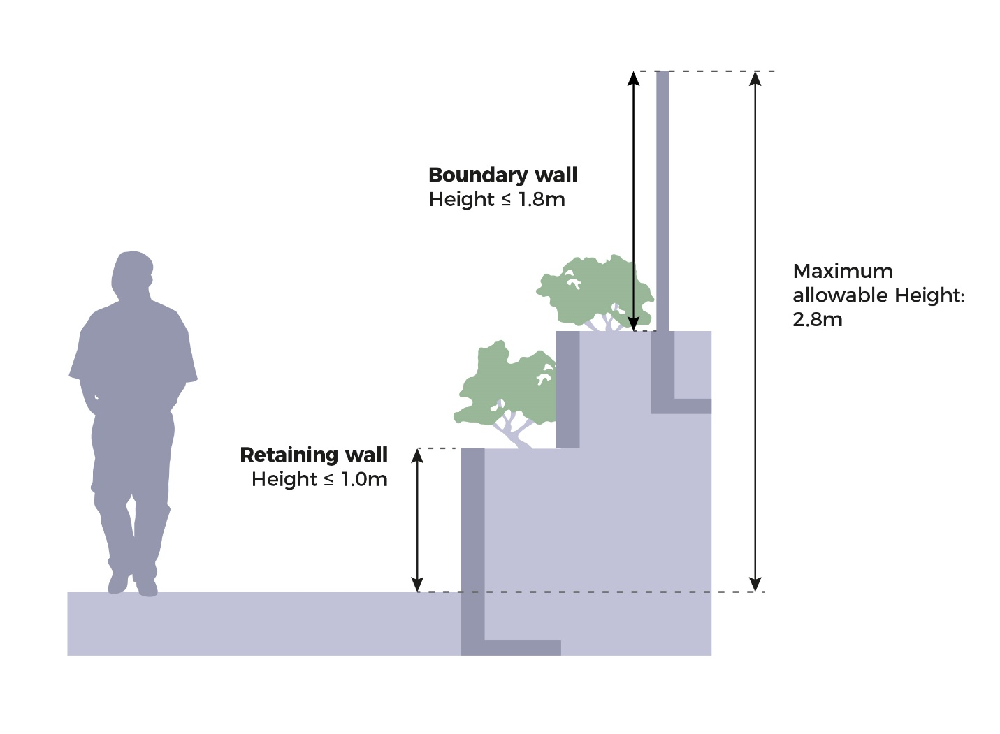
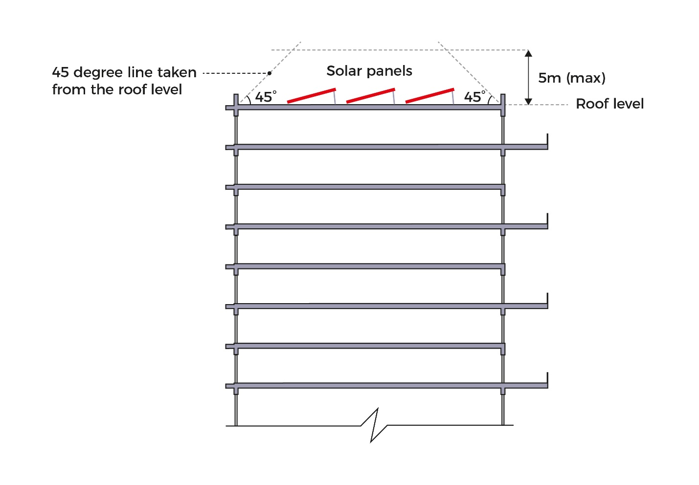

# Terrace Houses

**Advisory Notes**

The guidelines set out in this handbook for the various development
control parameters will generally be applied by URA in the consideration
of a development application. However, if the circumstances of a case or
the planning considerations relevant to a case so warrant, URA may in
its discretion decide to depart from these general guidelines. Persons
intending to carry out a development are advised to take this into
consideration in the conduct of their affairs and check with URA through
enquiries or development applications to confirm if their proposals can
be allowed.

The guidelines, principles and illustrations found in the handbook
series are not exhaustive in covering all possible site conditions and
building designs. In evaluating the development applications, URA
reserves the right to evaluate and impose conditions not covered in the
handbook in respond to the specific design of the development proposal
depending on merits.

**Guidelines at a Glance: Terrace Houses**

The table below is intended to provide an overview of the key guidelines
applicable for the development type. The full details of the guidelines
are stated in the relevant tabs of this handbook.

+----------------------+----------------------+----------------------+
| **Parameter**        | **Terrace Type I**   | **Terrace Type II**  |
+======================+======================+======================+
| Plot Size and Width  | [Intermediate]{.ul}  | [Intermediate]{.ul}  |
| (minimum)            |                      |                      |
|                      | Size: 150sqm         | Size: 80sqm          |
|                      |                      |                      |
|                      | Width: 6m            | Width: 6 m           |
|                      |                      |                      |
|                      | [Corner]{.ul}        | [Corner]{.ul}        |
|                      |                      |                      |
|                      | Size: 200sqm         | Size: 80sqm          |
|                      |                      |                      |
|                      | Width: 8m            | Width: 8m            |
+----------------------+----------------------+----------------------+
| Building Setbacks    | **Road Buffer/Green  |                      |
|                      | Buffer**             |                      |
+----------------------+----------------------+----------------------+
|                      | [Main                | [Main building,      |
|                      | building]{.ul}:      | Patio, Terrace, Car  |
|                      |                      | porch roof           |
|                      | Cat 1 Road: 24m      | eaves]{.ul}:         |
|                      | (incl. 5m green      |                      |
|                      | buffer)              | 2m                   |
|                      |                      |                      |
|                      | Cat 2 Road: 12m      |                      |
|                      | (incl. 5m green      |                      |
|                      | buffer)              |                      |
|                      |                      |                      |
|                      | Cat 3 & 4 Road: 7.5m |                      |
|                      | (incl. 3m green      |                      |
|                      | buffer)              |                      |
|                      |                      |                      |
|                      | Cat 5 Road: 7.5m (no |                      |
|                      | need for green       |                      |
|                      | buffer)              |                      |
|                      |                      |                      |
|                      | [Patio/Terrace/Car   |                      |
|                      | porch roof           |                      |
|                      | eaves]{.ul}:         |                      |
|                      |                      |                      |
|                      | Cat 1-2 Road:        |                      |
|                      | Maximum depth of car |                      |
|                      | porch protrusion     |                      |
|                      | into the road buffer |                      |
|                      | shall not exceed 5m. |                      |
|                      |                      |                      |
|                      | Cat 3-5 Road: 2.4m   |                      |
+----------------------+----------------------+----------------------+
|                      | **Setback from       |                      |
|                      | common boundaries    |                      |
|                      | (side/rear)**        |                      |
+----------------------+----------------------+----------------------+
|                      | [Main                |                      |
|                      | building]{.ul}: 2m   |                      |
|                      |                      |                      |
|                      | [Main roof eaves,    |                      |
|                      | car porch roof       |                      |
|                      | eaves,               |                      |
|                      | patio/terrace]{.ul}: |                      |
|                      | 1m                   |                      |
+----------------------+----------------------+----------------------+
|                      | Refer to *Building   |                      |
|                      | Appendages* and      |                      |
|                      | *Ancillary           |                      |
|                      | Structures*          |                      |
+----------------------+----------------------+----------------------+
| Building Appendages  | **Main roof eaves**  |                      |
|                      |                      |                      |
| (maximum projection  | Into road buffer: 2m |                      |
| into setback areas)  |                      |                      |
|                      | Into common boundary |                      |
|                      | setback (rear): 1m   |                      |
|                      |                      |                      |
|                      | **Cantilevered       |                      |
|                      | ledges/ lightweight  |                      |
|                      | awnings:**           |                      |
|                      |                      |                      |
|                      | Into road Buffer: 1m |                      |
|                      |                      |                      |
|                      | Into common boundary |                      |
|                      | setback (rear): 1m   |                      |
|                      |                      |                      |
|                      | **Horizontal         |                      |
|                      | sun-shading devices  |                      |
|                      | or vertical fins     |                      |
|                      | (without supports),  |                      |
|                      | planter boxes:**     |                      |
|                      |                      |                      |
|                      | Into road buffer:    |                      |
|                      | 0.5m                 |                      |
|                      |                      |                      |
|                      | Into common boundary |                      |
|                      | setback (rear): Not  |                      |
|                      | allowed              |                      |
|                      |                      |                      |
|                      | **Bay windows**      |                      |
|                      |                      |                      |
|                      | Into road buffer:    |                      |
|                      | Not allowed          |                      |
|                      |                      |                      |
|                      | Into common boundary |                      |
|                      | setback: Not allowed |                      |
|                      |                      |                      |
|                      | A 3m setback         |                      |
|                      | requirement shall    |                      |
|                      | apply to the landed  |                      |
|                      | housing plot if it   |                      |
|                      | abuts a Good Class   |                      |
|                      | Bungalow Area        |                      |
|                      | (GCBA).              |                      |
|                      |                      |                      |
|                      | While the building   |                      |
|                      | appendages may be    |                      |
|                      | within the           |                      |
|                      | permissible building |                      |
|                      | envelope, such       |                      |
|                      | features may require |                      |
|                      | further evaluation   |                      |
|                      | depending on the     |                      |
|                      | site context.        |                      |
+----------------------+----------------------+----------------------+
| Access Point         | **Vehicular Access** |                      |
|                      |                      |                      |
|                      | -   Only one         |                      |
|                      |     vehicular access |                      |
|                      |     point shall be   |                      |
|                      |     allowed per      |                      |
|                      |     plot.            |                      |
|                      |                      |                      |
|                      | -   All new          |                      |
|                      |     vehicular access |                      |
|                      |     points shall be  |                      |
|                      |     paired except    |                      |
|                      |     for sites with   |                      |
|                      |     plot width of    |                      |
|                      |     more than 10m.   |                      |
|                      |                      |                      |
|                      | -   Do not separate  |                      |
|                      |     existing paired  |                      |
|                      |     vehicular access |                      |
|                      |     points.          |                      |
|                      |                      |                      |
|                      | **Entrance to a      |                      |
|                      | Landed House**       |                      |
|                      |                      |                      |
|                      | Only one main        |                      |
|                      | entrance door for a  |                      |
|                      | single residential   |                      |
|                      | unit for family      |                      |
|                      | dwelling purposes.   |                      |
+----------------------+----------------------+----------------------+
| RC Flat Roofs        | RC flat roofs shall  |                      |
|                      | remain inaccessible  |                      |
|                      | except for           |                      |
|                      | maintenance purposes |                      |
|                      | only. Activating the |                      |
|                      | rooftop for uses     |                      |
|                      | such as roof         |                      |
|                      | terraces may be      |                      |
|                      | allowed depending on |                      |
|                      | the merits of the    |                      |
|                      | proposal. No         |                      |
|                      | structures shall be  |                      |
|                      | allowed unless       |                      |
|                      | otherwise approved   |                      |
|                      | by URA. Where        |                      |
|                      | allowed, structures  |                      |
|                      | (including any       |                      |
|                      | safety barriers)     |                      |
|                      | shall comply with    |                      |
|                      | height controls and  |                      |
|                      | the following        |                      |
|                      | guidelines.          |                      |
|                      |                      |                      |
|                      | **Solar Panels**     |                      |
|                      |                      |                      |
|                      | Planning permission  |                      |
|                      | is not required      |                      |
|                      | except in the        |                      |
|                      | following locations  |                      |
|                      | and contexts:        |                      |
|                      |                      |                      |
|                      | -   Site is subject  |                      |
|                      |     to urban design  |                      |
|                      |     guidelines or    |                      |
|                      |     located within   |                      |
|                      |     Conservation     |                      |
|                      |     Areas;           |                      |
|                      |                      |                      |
|                      | -   Elevated solar   |                      |
|                      |     panels, ie       |                      |
|                      |     raised more than |                      |
|                      |     1m from the roof |                      |
|                      |     level;           |                      |
|                      |                      |                      |
|                      | -   Spaces under     |                      |
|                      |     solar panels are |                      |
|                      |     enclosed or put  |                      |
|                      |     to commercial    |                      |
|                      |     use.             |                      |
+----------------------+----------------------+----------------------+
| Envelope Control     | The permissible      |                      |
| Guidelines           | building envelope    |                      |
|                      | for a 2-storey or a  |                      |
|                      | 3-storey landed      |                      |
|                      | house is controlled  |                      |
|                      | by the envelope      |                      |
|                      | control guidelines.  |                      |
|                      | This defines an      |                      |
|                      | allowable building   |                      |
|                      | envelope based on    |                      |
|                      | the setbacks, storey |                      |
|                      | height and external  |                      |
|                      | platform level.      |                      |
|                      |                      |                      |
|                      | {width=" |                      |
|                      | 4.724409448818897in" |                      |
|                      | height="1.           |                      |
|                      | 9329975940507436in"} |                      |
|                      |                      |                      |
|                      | {width=" |                      |
|                      | 4.724409448818897in" |                      |
|                      | height="2.           |                      |
|                      | 2053510498687663in"} |                      |
+----------------------+----------------------+----------------------+
| Special and Detailed | [Special and         |                      |
| Control Plans        | Detailed Control     |                      |
|                      | Plans]{.ul}          |                      |
| ~~Control Areas~~    |                      |                      |
|                      | [Special Control     |                      |
|                      | Area                 |                      |
|                      | 1](https             |                      |
|                      | ://www.ura.gov.sg/-/ |                      |
|                      | media/Corporate/Guid |                      |
|                      | elines/Development-c |                      |
|                      | ontrol/Others/SCA_1) |                      |
|                      |                      |                      |
|                      | [Special Control     |                      |
|                      | Area                 |                      |
|                      | 2](https             |                      |
|                      | ://www.ura.gov.sg/-/ |                      |
|                      | media/Corporate/Guid |                      |
|                      | elines/Development-c |                      |
|                      | ontrol/Others/SCA_2) |                      |
|                      |                      |                      |
|                      | Developments within  |                      |
|                      | the special control  |                      |
|                      | areas may be subject |                      |
|                      | to screening         |                      |
|                      | requirements.        |                      |
+----------------------+----------------------+----------------------+
| Earthworks           | -   Earthworks       |                      |
|                      |     within the       |                      |
|                      |     build-able area  |                      |
|                      |     are subject to   |                      |
|                      |     evaluation. If   |                      |
|                      |     earthfill of     |                      |
|                      |     more than 1m is  |                      |
|                      |     allowed, the     |                      |
|                      |     overall          |                      |
|                      |     aggregate        |                      |
|                      |     building height  |                      |
|                      |     measured from    |                      |
|                      |     the allowable    |                      |
|                      |     platform level   |                      |
|                      |     shall comply     |                      |
|                      |     with the maximum |                      |
|                      |     allowable        |                      |
|                      |     building height  |                      |
|                      |     control.         |                      |
|                      |                      |                      |
|                      | ```{=html}           |                      |
|                      | <!-- -->             |                      |
|                      | ```                  |                      |
|                      | -   Earthworks are   |                      |
|                      |     not allowed      |                      |
|                      |     within the       |                      |
|                      |     building setback |                      |
|                      |     area, except to: |                      |
|                      |                      |                      |
|                      | ```{=html}           |                      |
|                      | <!-- -->             |                      |
|                      | ```                  |                      |
|                      | -   Accommodate a    |                      |
|                      |     vehicular access |                      |
|                      |     of maximum       |                      |
|                      |     **4m** wide;     |                      |
|                      |                      |                      |
|                      | -   Match the        |                      |
|                      |     existing         |                      |
|                      |     platform levels  |                      |
|                      |     of the           |                      |
|                      |     neighbouring     |                      |
|                      |     sites.           |                      |
|                      |                      |                      |
|                      | -   Create a         |                      |
|                      |     workable         |                      |
|                      |     platform level   |                      |
|                      |     to mitigate      |                      |
|                      |     level            |                      |
|                      |     differences      |                      |
|                      |     within a site,   |                      |
|                      |     or between the   |                      |
|                      |     site and road.   |                      |
|                      |                      |                      |
|                      | -   Facilitate       |                      |
|                      |     building of a    |                      |
|                      |     fully submerged  |                      |
|                      |     basement. The    |                      |
|                      |     area within the  |                      |
|                      |     building setback |                      |
|                      |     distance shall   |                      |
|                      |     be reinstated to |                      |
|                      |     the original     |                      |
|                      |     platform level   |                      |
|                      |     upon completion  |                      |
|                      |     of the basement. |                      |
+----------------------+----------------------+----------------------+
|                      | **[Low-lying areas   |                      |
|                      | that need to meet    |                      |
|                      | PUB's minimum        |                      |
|                      | platform level       |                      |
|                      | (MPL)]{.ul}**        |                      |
|                      |                      |                      |
|                      | Only the building    |                      |
|                      | structures or        |                      |
|                      | internal living      |                      |
|                      | areas and common     |                      |
|                      | boundary setback     |                      |
|                      | areas may be raised  |                      |
|                      | to meet the          |                      |
|                      | stipulated MPL.      |                      |
|                      |                      |                      |
|                      | The road buffer area |                      |
|                      | may be 300mm above   |                      |
|                      | the adjacent road    |                      |
|                      | level, or not lower  |                      |
|                      | than the existing    |                      |
|                      | ground level,        |                      |
|                      | whichever is higher. |                      |
|                      |                      |                      |
|                      | Refer to *Building   |                      |
|                      | Envelope --          |                      |
|                      | Basements* for more  |                      |
|                      | information on the   |                      |
|                      | treatment of         |                      |
|                      | internal areas below |                      |
|                      | the MPL.             |                      |
+----------------------+----------------------+----------------------+
| Retaining and        | **Retaining Walls**  |                      |
| Boundary walls       |                      |                      |
|                      | Outward facing       |                      |
|                      | retaining walls are  |                      |
|                      | not encouraged. If   |                      |
|                      | allowed, they shall  |                      |
|                      | not be more than 1m  |                      |
|                      | high.                |                      |
|                      |                      |                      |
|                      | Retaining walls more |                      |
|                      | than 1m high may be  |                      |
|                      | considered if        |                      |
|                      | suitably tiered and  |                      |
|                      | planted.             |                      |
|                      |                      |                      |
|                      | **Boundary walls**   |                      |
|                      |                      |                      |
|                      | Boundary walls shall |                      |
|                      | not exceed 1.8m.     |                      |
|                      |                      |                      |
|                      | **The common         |                      |
|                      | boundary walls       |                      |
|                      | abutting the car     |                      |
|                      | porch / patio area   |                      |
|                      | between intermediate |                      |
|                      | terrace houses may   |                      |
|                      | be allowed up to the |                      |
|                      | 1st storey ceiling   |                      |
|                      | height.**            |                      |
|                      |                      |                      |
|                      | **Bo                 |                      |
|                      | undary-cum-retaining |                      |
|                      | wall**               |                      |
|                      |                      |                      |
|                      | The combined height  |                      |
|                      | of                   |                      |
|                      | bo                   |                      |
|                      | undary-cum-retaining |                      |
|                      | wall shall not       |                      |
|                      | exceed 2.8m, of      |                      |
|                      | which solid wall     |                      |
|                      | shall not exceed     |                      |
|                      | 1.8m.                |                      |
+----------------------+----------------------+----------------------+

**Introduction**


*Illustration of a Terrace House*

A terrace house is a dwelling house with its own land title^1^ that
forms part of a row of at least 3 dwelling houses abutting the common
boundary party walls. Terrace houses can be built in designated mixed
landed housing areas, if the development site area meets the minimum
plot size and width requirements. At the individual plot level, a
terrace house shall adhere to the applicable storey height and envelope
control guidelines and building setback requirements. The permissible
Gross Floor Area (GFA) for such landed housing is resultant of the
allowable building height and permissible building envelope under the
envelope control guidelines.

There are 2 types of terrace house typology - Terrace Type I and Terrace
Type II. These are differentiated by their setback requirements.

For Terrace Type I houses, the setback from the road is based on
standard road buffer requirements.

For Terrace Type II houses, the required setback from the road is
standardised as 2m and 1m for building wall and roof eaves respectively.
Terrace II houses shall also be sited within their own enclave (refer
to [[Locational
Criteria]{.ul}](https://intranet.ura.gov.sg/Corporate/Guidelines/Development-Control/Residential/Terrace/Locational-Criteria) for
more information).

^1^ Terrace houses may also be strata-titled when approved as strata
terrace houses -- See [[Strata Landed
Housing]{.ul}](https://intranet.ura.gov.sg/Corporate/Guidelines/Development-Control/Residential/Strata-Landed-Housing) for
guidelines and requirements.

### 

### Redeveloping to Other Landed Housing Forms

**Redevelopment of Existing Terrace House to Bungalow, Semi-detached and
Corner Terrace**

+----------------------------------+----------------------------------+
| {width="6.181102362204724in" |                                  |
| height="1.862924321959755in"}\   |                                  |
| \                                |                                  |
| {width="6.181102362204724in" |                                  |
| height="1.862924321959755in"}    |                                  |
+==================================+==================================+
| **Allowed**                      | The left-behind Plot D has       |
|                                  | sufficient plot size and plot    |
|                                  | width for a corner terrace       |
|                                  | house. House E may redevelop     |
|                                  | into a bungalow or a pair of     |
|                                  | semi-detached house. \           |
|                                  | \                                |
|                                  | Owner of House E shall be        |
|                                  | required to comply with the      |
|                                  | following conditions:            |
|                                  |                                  |
|                                  | 1.  Plaster and paint the        |
|                                  |     > exposed blank wall and     |
|                                  |     > neaten any exposed roof of |
|                                  |     > the remaining house as     |
|                                  |     > soon as the existing       |
|                                  |     > building(s) on the subject |
|                                  |     > site is demolished;        |
|                                  |                                  |
|                                  | 2.  Allow the owner of the       |
|                                  |     > adjacent house access to   |
|                                  |     > the subject site to        |
|                                  |     > maintain or repair the     |
|                                  |     > roof and the exposed blank |
|                                  |     > wall of the remaining      |
|                                  |     > house; and                 |
|                                  |                                  |
|                                  | 3.  Submit to BCA an engineer's  |
|                                  |     > certification of the       |
|                                  |     > structural stability of    |
|                                  |     > the remaining house.       |
|                                  |                                  |
|                                  | House E may also redevelop into  |
|                                  | an intermediate terrace and      |
|                                  | corner terrace.                  |
+----------------------------------+----------------------------------+

     
  ------------------------------------------------------------------------------------------------------------------------------------------------------------------------------------------------------------------------ -----------------------------------------------------------------------------------------------------------------------------------------------------------------
  **Not Allowed**                                                                                                                                                                                                          The left-behind Plot D does not have sufficient plot size and plot width for a corner terrace house. House E shall not be allowed to redevelop into a bungalow.

+----------------------------------+----------------------------------+
| {width="6.181102362204724in" |                                  |
| height="1.862924321959755in"}    |                                  |
+==================================+==================================+
| **Allowed**                      | Plot D may redevelop into a      |
|                                  | corner terrace house as it has   |
|                                  | sufficient plot size and plot    |
|                                  | width and Plot E has sufficient  |
|                                  | plot size and plot width to      |
|                                  | redevelop into a bungalow or a   |
|                                  | pair of semi-detached houses. \  |
|                                  | \                                |
|                                  | Owner of House D shall be        |
|                                  | required to comply with the      |
|                                  | following conditions:            |
|                                  |                                  |
|                                  | 1.  Plaster and paint the        |
|                                  |     > exposed blank wall and     |
|                                  |     > neaten any exposed roof of |
|                                  |     > the remaining house as     |
|                                  |     > soon as the existing       |
|                                  |     > building(s) on the subject |
|                                  |     > site is demolished;        |
|                                  |                                  |
|                                  | 2.  Allow the owner of the       |
|                                  |     > adjacent house access to   |
|                                  |     > the subject site to        |
|                                  |     > maintain or repair the     |
|                                  |     > roof and the exposed blank |
|                                  |     > wall of the remaining      |
|                                  |     > house; and                 |
|                                  |                                  |
|                                  | 3.  Submit to BCA an engineer's  |
|                                  |     > certification of the       |
|                                  |     > structural stability of    |
|                                  |     > the remaining house.       |
+----------------------------------+----------------------------------+

**Treatment of Existing Party Walls**

The creation of a new blank party wall at the common boundary upon
redevelopment is generally not allowed.

For all redevelopments that involve detaching from an existing unit,
resulting in a bare and exposed party wall at the existing unit, the
person undertaking the redevelopment shall do the following:

-   Submit to the Building and Construction Authority (BCA), an
    > engineer's certification of the structural stability of the
    > remaining unit;

-   Plaster and paint the exposed blank wall and neaten any exposed roof
    > of the remaining semi-detached house or terrace house as soon as
    > the existing building(s) on the subject site is demolished; and

-   Allow the adjacent owner access to the site to maintain or repair
    > the roof and the exposed blank wall of the remaining semi-detached
    > house or terrace house. This is not required if part of the party
    > wall within the subject site is retained.

After the adjoining unit is redeveloped, the remaining terrace unit may
remain as approved.

**Additions and Alterations to Landed Housing**

Proposals shall meet the following criteria to qualify as an Additions &
Alterations (A&A) proposal:

-   Proposed additional gross floor area shall not exceed 50% of the
    > approved gross floor area;

-   External walls that are to be removed and replaced with new walls
    > shall not exceed 50% of the approved external walls;

-   Structural changes to the existing landed dwelling house (eg
    > replacing or constructing new columns/beams and reconstructing
    > existing floor slabs) shall not exceed 50% of existing building;

-   Changes/replacement of entire roof (with/without resultant increase
    > in height) shall not involve an additional storey;

-   Where an attic is added, the increase in GFA shall be less than 50%.

Proposals that do not comply with the above criteria for Additions &
Alterations shall be considered as **Reconstruction** proposals. Works
resulting in the following outcomes shall also be deemed as
reconstruction, [regardless of whether the works exceed 50% of the
existing building GFA]{.ul}:

-   Increase in storey height (including changes/replacement of any part
    > of the roof involving an additional storey)

-   Change in landed dwelling housing form (for example, from
    > semi-detached house to detached house).

For existing landed housing approved under previous landed housing
guidelines, new Additions and Alterations works shall comply with the
permissible building envelope in the Envelope Control guidelines.

Where the existing building already exceeds the permissible building
envelope, the new Additions and Alterations shall not further increase
the building bulk. URA will assess such applications on the merits of
the proposal to ensure that the outcome is not worse off.

**Retaining Existing Non-Conforming Structures in Additions and
Alterations Proposals**

URA may consider allowing landed houses undergoing Additions &
Alterations (A&A) works or reconstruction to retain non-conforming
structures^1^, subject to the following requirements:

-   At least 25% of the existing floor plate shall be retained,
    comprising an integrated wing of existing columns, beams, floor slab
    and external walls that includes the non-conforming portion of the
    house;

-   Submission of a Professional Engineer's (PE) certification to
    confirm that structures to be retained are structurally sound, can
    accommodate the new works proposed, and that appropriate
    construction methods will be used to ensure that they will not be
    damaged.

-   For a house with an existing deficient front setback, there shall be
    a minimum absolute 2.4m setback distance provided from the front
    boundary. The setback is measured from the boundary of the external
    wall/glass of the bay window.

URA shall be notified immediately if any of the non-conforming
structures approved to be retained are demolished. The Qualified Person
appointed by the owner shall make an amendment application for the new
works to comply with prevailing DC guidelines, before any new works are
carried out on site.

^1^ **Non-conforming Structures**: Structures within the existing house
that were approved and built in the past, but do not comply with the
prevailing development control guidelines.

**Locational Criteria**

**Safeguarded Landed Housing Areas**

An island-wide map titled [[Designated Landed Housing Area
Plan]{.ul}](https://www.ura.gov.sg/maps/?service=LHA) is available on
URA SPACE. Terrace houses may be built within Mixed Landed Housing Areas
only.

**For Terrace Type II houses, these are to be located within their own
enclaves.**

-   [Within existing estates]{.ul}: If the site is located within an
    existing landed housing estate, the Terrace Type II house shall be
    part of an existing enclave. Alternatively, a new Terrace Type II
    enclave may be considered if it does not adversely impact the
    surrounding developments.

-   [For new estates]{.ul}: New estates, like a government sale site for
    landed housing developments, may provide Terrace Type II landed
    housing provided they are developed comprehensively as a distinct
    Terrace Type II estate.

**Landed Housing guided by Street Block Plans**

Where there is a street block plan to guide landed housing development,
the planning guidelines and requirements stipulated in the street block
plan shall apply.

Conservation guidelines shall also apply for landed housing gazetted for
conservation, such as in the residential historic districts of Blair
Plain, Cairnhill and Emerald Hill.

  **Street Block Plans**
  -----------------------------------------------------------------------------------------------------------------------------------------------------------------------------------------------------------------------------------------------------------------------------------------------------------------------------------------------------
  [[Boon Teck Road/Jalan Kemamam (Novena Planning Area)]{.ul}](https://intranet.ura.gov.sg/Corporate/Guidelines/Development-Control/Residential/Terrace/-/media/168D3AFE46D044D087B7354090ED021C.ashx)
  [[Cashew Terrace (Bukit Panjang Planning Area)]{.ul}](https://intranet.ura.gov.sg/Corporate/Guidelines/Development-Control/Residential/Terrace/-/media/7CBC4F55A9B84097BBA4DC2535FA6940.ashx)
  [[Changi Heights (Pasir Ris Planning Area)]{.ul}](https://intranet.ura.gov.sg/Corporate/Guidelines/Development-Control/Residential/Terrace/-/media/C3B4C4B75FF9444C915E197AE66FDAD0.ashx)
  [[Cheng Soon Garden \[no. 1 to 73 (odd numbers)\] / Kismis Avenue \[no. 2 to 68 (odd numbers)\] (Bukit Timah Planning Area)]{.ul}](https://intranet.ura.gov.sg/Corporate/Guidelines/Development-Control/Residential/Terrace/-/media/2FA4FF644AAA4F12A42D687AA6C15F92.ashx)
  [[Clementi Green Estate (Bukit Timah Planning Area)]{.ul}](https://intranet.ura.gov.sg/Corporate/Guidelines/Development-Control/Residential/Terrace/-/media/5F859AEA44104401ABF76DB33C4C0E92.ashx)
  [[Dido Street/ Dafne Street/ Aida Street (Bedok Planning Area)]{.ul}](https://intranet.ura.gov.sg/Corporate/Guidelines/Development-Control/Residential/Terrace/-/media/41710949136143F6852415BB64E01B46.ashx)
  [[Emerald Hill Road \[no. 87 to 107\] / Saunders Road \[no. 32 to 56 (even numbers)\] (Emerald Hill Conservation Area / Newton Planning Area)]{.ul}](https://intranet.ura.gov.sg/Corporate/Guidelines/Development-Control/Residential/Terrace/-/media/1817A65869764800A93A199124A6B369.ashx)
  [[Ernani Street \[no. 2 to 38 (even)\]/ Rienzi Street House \[no. 1 to 41 (odd & even)\] / Norma Terrace \[no. 1 to 41 (odd)\] (Bedok Planning Area)]{.ul}](https://intranet.ura.gov.sg/Corporate/Guidelines/Development-Control/Residential/Terrace/-/media/E937B6DFA0BB4B93AE82673FFE3E437F.ashx)
  [[Everitt Road (Geylang Planning Area)]{.ul}](https://intranet.ura.gov.sg/Corporate/Guidelines/Development-Control/Residential/Terrace/-/media/F673AE34EFAC4723859FFCF2C9231683.ashx)
  [[Ford Avenue (Bukit Timah Planning Area)]{.ul}](https://intranet.ura.gov.sg/Corporate/Guidelines/Development-Control/Residential/Terrace/-/media/692C50C2F5D34ECD9ECE90FE7E7669AB.ashx)
  [[Greenridge Crescent \[no. 12 to 24, 42 to 48 (even numbers)\] (Bukit Timah Planning Area)]{.ul}](https://intranet.ura.gov.sg/Corporate/Guidelines/Development-Control/Residential/Terrace/~/link.aspx?_id=ED3657EC28294105B6CEEC13B434D040&_z=z)
  [[Hillcrest Road \[no. 104 - 114 and 132 -- 190\] (Bukit Timah Planning Area)]{.ul}](https://intranet.ura.gov.sg/Corporate/Guidelines/Development-Control/Residential/Terrace/-/media/B17EFB7E6D5E4A5E82CDECF6CE7AF156.ashx)
  [[Hong Leong Garden Estate (Clementi Planning Area)]{.ul}](https://intranet.ura.gov.sg/Corporate/Guidelines/Development-Control/Residential/Terrace/-/media/9BB28810EF01492487E98CA5C53B5513.ashx)
  [[Jalan Jelita / Jalan Istimewa / Jalan Tenang / Holland Road \[no. 263 to 289 (odd numbers)\] (Bukit Timah Planning Area)]{.ul}](https://intranet.ura.gov.sg/Corporate/Guidelines/Development-Control/Residential/Terrace/-/media/0A0FDECB7F4D4C4FBAF0B8A91DA1034B.ashx)
  [[Jalan Limbok (no. 1 to 35) / Yio Chu Kang Road (no. 183 to 205)(Hougang Planning Area)]{.ul}](https://intranet.ura.gov.sg/Corporate/Guidelines/Development-Control/Residential/Terrace/-/media/F421A8946DD645FB9624D9942CF87D00.ashx)
  [[Jalan Salang \[no. 57 -- 87\] (Sembawang Planning Area)]{.ul}](https://intranet.ura.gov.sg/Corporate/Guidelines/Development-Control/Residential/Terrace/-/media/FE616B9BEC044FE583587214FF86C7E4.ashx)
  [[Jalan Wangi \[no. 11 to 69 \[odd numbers)\] (Toa Payoh Planning Area)]{.ul}](https://intranet.ura.gov.sg/Corporate/Guidelines/Development-Control/Residential/Terrace/-/media/40DE211062BC47CC8466A941ECE991AF.ashx)
  [[Jasmine Road \[no. 2 to 2P\] / Gardenia Road \[no. 2 to 30\] (Bishan Planning Area)]{.ul}](https://intranet.ura.gov.sg/Corporate/Guidelines/Development-Control/Residential/Terrace/-/media/DF2FF075EB264A388477D7859C35014C.ashx)
  [[Jasmine Road (Bishan Planning Area)]{.ul}](https://intranet.ura.gov.sg/Corporate/Guidelines/Development-Control/Residential/Terrace/-/media/EFAE68C36A0F4356905371D36488E790.ashx)
  [[Lasia Avenue (Bukit Timah Planning Area)]{.ul}](https://intranet.ura.gov.sg/Corporate/Guidelines/Development-Control/Residential/Terrace/-/media/98FB0A64F2524DD29D73DA645D6A9EA4.ashx)
  [[Li Hwan Walk / Li Hwan Close / Li Hwan Terrace / Li Hwan Place / Li Hwan Drive (Serangoon Planning Area)]{.ul}](https://intranet.ura.gov.sg/Corporate/Guidelines/Development-Control/Residential/Terrace/-/media/21D504F6FB194516AEB50E94D491B420.ashx)
  [[Lowland Road (Hougang Planning Area)]{.ul}](https://intranet.ura.gov.sg/Corporate/Guidelines/Development-Control/Residential/Terrace/-/media/C9208BA95B584B06B1054D0A2DCF1202.ashx)
  [[Pang Seng Road / Wan Tho Avenue \[no. 27 to 27J\] (Toa Payoh Planning Area)]{.ul}](https://intranet.ura.gov.sg/Corporate/Guidelines/Development-Control/Residential/Terrace/-/media/84079376B9A5493CBA53DB4D3111F7D4.ashx)
  [[Paya Lebar Gardens (Hougang Planning Area)]{.ul}](https://intranet.ura.gov.sg/Corporate/Guidelines/Development-Control/Residential/Terrace/-/media/9CBF9BC9F6B64B06A1DCEBC91D53B4CA.ashx)
  [[Peach Garden (Marine Parade Planning Area)]{.ul}](https://intranet.ura.gov.sg/Corporate/Guidelines/Development-Control/Residential/Terrace/-/media/EE6EA17F131E4E0C8E8E3ACA0087297E.ashx)
  [[Pheng Geck Avenue/Wan Tho Avenue/Puay Hee Avenue (Toa Payoh Planning Area)]{.ul}](https://intranet.ura.gov.sg/Corporate/Guidelines/Development-Control/Residential/Terrace/-/media/B33AF76C33404CD7B74AA71E5B8E0BE7.ashx)
  [[Richards Place/Richards Avenue (Hougang Planning Area)]{.ul}](https://intranet.ura.gov.sg/Corporate/Guidelines/Development-Control/Residential/Terrace/-/media/216E2367B87B4260B9C1A09023106858.ashx)
  [[Seletar Road from Jalan Lebat Daun/Jalan Joran to Seletar Close (Serangoon Planning Area)]{.ul}](https://intranet.ura.gov.sg/Corporate/Guidelines/Development-Control/Residential/Terrace/-/media/BF1ECA8DCEF04ACBB335BDFEE9CEDD78.ashx)
  [[The Inglewood (Bishan Planning Area)]{.ul}](https://intranet.ura.gov.sg/Corporate/Guidelines/Development-Control/Residential/Terrace/~/link.aspx?_id=FFCE8BA0C66C47F8B93DBD7443E6AD5F&_z=z)
  [[Watten Drive \[no. 1 to 73 (odd numbers) and no. 2 to 24 (even numbers)\] / Watten Close \[no. 2 to 28 (even numbers)\] / Watten Estate \[no. 49 to 61 (odd numbers)\] (Bukit Timah Planning Area)]{.ul}](https://intranet.ura.gov.sg/Corporate/Guidelines/Development-Control/Residential/Terrace/-/media/4EE75EC1E0E94B39A347C69FB3263515.ashx)
  [[Watten Rise House \[no. 5 to 41 (odd numbers) and no. 2 to 18 (even numbers)\] / Watten Drive \[no. 26 to 60 (even numbers)\] (Bukit Timah Planning Area)]{.ul}](https://intranet.ura.gov.sg/Corporate/Guidelines/Development-Control/Residential/Terrace/-/media/2764242C890A4170A72D5CFC1B0F276A.ashx)
  [[Yan Kit Road (Outram Planning Area)]{.ul}](https://intranet.ura.gov.sg/Corporate/Guidelines/Development-Control/Residential/Terrace/-/media/DF790651DD8549D69DF07D2DCDB1B3B8.ashx)
  [[Yuk Tong Avenue \[no. 88, 88A, 90, 90A, 92 & 92A\] (Bukit Timah Planning Area)]{.ul}](https://intranet.ura.gov.sg/Corporate/Guidelines/Development-Control/Residential/Terrace/-/media/27DC58D39AE94C18A1C679AE1791ABD5.ashx)

**Landed Housing In Other Areas**

Other sites zoned for residential use in the prevailing Master Plan may
be considered for landed housing developments, depending on site context
and conditions. Landed houses outside [[Designated Landed Housing
Areas]{.ul}](https://www.ura.gov.sg/maps/?service=LHA) and not guided by
the street block plans are subject to a 3-storey height control. The
prevailing landed housing planning guidelines and requirements shall
also apply.

### Special and Detailed Control Plans 

Special and Detailed Control Plans (SDCP) provide detailed guidelines
for specific areas. The SDCPs may be viewed [here]{.ul}.

**Special Control Areas**

The following areas may be subject to security screening requirements.
URA will confirm this upon submission of a proposed development.


*Special Control Area 1*


*Special Control Area 2*

Qualified Persons (QPs) should consider the screening requirements in
the early stage of their planning and design to avoid abortive work
subsequently.

Where security screening is deemed necessary, it shall consist of
permanent fixtures that are difficult, if not impossible to remove. The
following screening measures may be considered:

#### **Visual Screening**

Residential units and common areas may be screened where necessary with
blank walls, external concrete/metal fins, or the building may be
re-orientated such that the windows^1^/openings/balconies do not have
direct view towards the protected area.

^1^ **Window**: Raised openings that are at least 0.9m above the floor
slab. They are intended to provide ventilation and lighting, and not for
access. Full height windows and windows that are lower than 0.9m that
can potentially be used as access points will need to be highlighted in
the submission plans for URA's evaluation and approval.

#### **Roof Screening**

The parapet wall at the rooftop shall be at least 3m high and access to
the rooftop from a public area shall be secured by a lockable
door/hatch. The door/hatch may be electronically linked to an alarm
system monitored by the building management.

**Open Space Provision**

The National Parks Board (NParks) requires new landed housing
development clusters of a certain total Gross Floor Area (GFA) to set
aside an open space plot at a rate of 45sqm of open space for every
56sqm of gross floor area^1^. While the minimum open space plot size
required is 1,000sqm (ie a landed housing development with total gross
floor area of about 13,800sqm would be required to make such provision),
NParks may require a smaller open space plot based on the same
computation rate depending on the adequacy of open space in the nearby
area.

The open space plot shall be vested in the State before the Building &
Construction Authority (BCA) issues a Certificate of Statutory
Completion (CSC). The open space shall be free from encumbrances, unless
otherwise specified, before it can be vested in the State.

The open space provided shall be:

-   Suitably located within the proposed development, such that it is
    > conveniently accessible to the public;

-   A single plot of a regular shape, and not fragmented (eg by road,
    > drain or other reserves);

-   Generally flat terrain that is neither low lying nor subject to
    > flooding.

Where the landed housing development cluster abuts an expressway or
major arterial road, part of the open space provision may double up as
part of the buffer zone provided the:

-   Depth of the open space plot is 3m (minimum); and

-   Configuration or the open space plot is reasonably regular.

^1^ The Open Space Provision requirements are not applicable for Strata
Landed Housing developments. See Strata Landed Housing Communal Open
Space and greenery provision requirements.

**Plot Size and Width**

**Terrace I**


*Plot Size and Width for Terrace Type I House*

**Plot Size and Width Requirements for Terrace Type I Houses**

  **Terrace House Type**   **Plot Size (Minimum)**   **Plot Width (Minimum)**
  ------------------------ ------------------------- --------------------------
  Type I (Intermediate)    150sqm                    6m
  Type I (Corner)          200sqm                    8m

There is no site coverage control for either Terrace Type I or Type II
houses.

**Terrace II**

**Plot Size and Width Requirements for Terrace Type II Houses**

  **Terrace House Type**   **Plot Size (Minimum)**   **Plot Width (Minimum)**
  ------------------------ ------------------------- --------------------------
  Type II (Intermediate)   80sqm                     6m
  Type II (Corner)         80sqm                     8m

There is no site coverage control for either Terrace Type I or Type II
houses.

**Plot Width for Irregular Plots**

For corner or intermediate terrace plots of irregular shape within
existing landed housing estates, slight deficiency in plot width may be
considered provided:

-   The average width of the site remains at least 8m for a corner
    terrace plot, and 6m for an intermediate terrace plot, so as to
    allow for a meaningful building footprint and internal layout;

-   The absolute minimum plot width at its narrowest shall be 4m;

-   The plot shall fully comply with the minimum plot size control and
    all other development control guidelines eg setback, road buffer,
    etc.

The deficiency in plot width, if allowed, shall be restricted to one
residual plot per development (ie all other plots within the same
multi-unit development shall comply fully with the minimum plot width).

**Access Points**

**Vehicular Access to Terrace plot**

Only one single vehicular access point shall be allowed per landed
housing plot.


*Vehicular Access Points*

The position of vehicular access point for terrace houses shall consider
roadside planting and kerbside parking space provision. For example:

-   All vehicular access points for new landed housing developments
    shall preferably be paired to provide for a sufficiently wide space
    (at least 6m) between 2 access points.

-   Existing vehicular access points already in a paired arrangement
    today shall not be separated unless there is a separation space of
    at least 6m.

-   Sites with plot width of more than 10m need not pair up their access
    point with the adjacent unit, if the full continuous 6m planting
    verge can be provided within the plot width of the site.

**Entrance to a Landed House**

Only one main entrance door for a single residential unit for family
dwelling purposes shall be allowed in a landed house.

**Building Setback from Boundary**


*Building Setback of Terrace Type I Houses*

**Road Buffer and Green Buffer**

  ---------------------------------------------------------------------------------------------------------------------------------------------------------------------------------------
  **Road Category**   **Road Buffer\                                                                                                                                
                      (Inclusive of Green Buffer indicated in brackets)**                                                                                           
  ------------------- --------------------------------------------------------------------------------------------------------------------------------------------- ---------------------
                      **Terrace Type I**                                                                                                                            **Terrace Type II**

  Category 1          Main building: 24m (incl. 5m green buffer)^@^             \                                                                                   2m
                      \                                                                                                                                             
                      Car Porch/Terrace/Patio: Maximum depth of the car porch \[to outermost roof eave line\] protruding into the road buffer is 5m.                

  Category 2          Main building: 12m (incl. 5m green buffer)^@^            \                                                                                    2m
                      \                                                                                                                                             
                      Car Porch/Terrace/Patio: Maximum depth of the car porch \[to outermost roof eave line\] protruding into the road buffer is 5m.                

  Categories 3 & 4    Main building: 7.5m (incl. 3m green buffer)^@^            \                                                                                   2m
                      \                                                                                                                                             
                      Car Porch \[to outermost roof eave line\]: 2.4m^\#^            \                                                                              
                      \                                                                                                                                             
                      Terrace/Patio: 2.4m                                                                                                                           

  Category 5          Main building: 7.5m (no green buffer)^@^            \                                                                                         2m
                      \                                                                                                                                             
                      Car Porch \[to outermost roof eave line\]: 2.4m^\#^            \                                                                              
                      \                                                                                                                                             
                      Terrace/Patio: 2.4m                                                                                                                           
  ---------------------------------------------------------------------------------------------------------------------------------------------------------------------------------------

^@^ While the roof eaves may be within the permissible building
envelope, such features may require further evaluation depending on the
site context. Refer to [[Building
Appendages]{.ul}](https://intranet.ura.gov.sg/Corporate/Guidelines/Development-Control/Residential/Terrace/~/link.aspx?_id=D4DA83ED72A840129AE094F4E7276498&_z=z) section.

^\#^ The 2.4m setback applies only to the 3m (maximum) car porch width
(measured column to column). Beyond this 3m, other car porch setbacks
shall follow the terrace/patio setback requirements. A wider car porch
may be considered on the merits of the proposal.

Refer to Ancillary Structures sub-section for the setback requirement
for minor
structures, [[Basements]{.ul}](https://intranet.ura.gov.sg/Corporate/Guidelines/Development-Control/Residential/Terrace/~/link.aspx?_id=6175D0156CE043D4AA3A2CBBA73EA45A&_z=z) section
for basement setbacks, and [[Building
Appendages]{.ul}](https://intranet.ura.gov.sg/Corporate/Guidelines/Development-Control/Residential/Terrace/~/link.aspx?_id=D4DA83ED72A840129AE094F4E7276498&_z=z) section
for allowable encroachment of minor building features into the setback
areas.

**Setbacks from Common Boundaries**

  --------------------------------------------------------------------------------------------------------------------------------------------------------------------------------------------------------------------------------------------------------------
  **Structure**                                    **Terrace Type I**                                                                                     **Terrace Type II**
  ------------------------------------------------ ------------------------------------------------------------------------------------------------------ ------------------------------------------------------------------------------------------------------
  Main Building\                                   Main building: 2m\                                                                                     2m \
  \                                                \                                                                                                      \
  Car Porch columns\                               ***Note**: The 3m GCBA common boundary setback requirements shall apply if the plot abuts a GCBA.*     ***Note**: The 3m GCBA common boundary setback requirements shall apply if the plot abuts a GCBA.*
  \                                                                                                                                                       
  Terrace/Patio                                                                                                                                           

  Roof Eaves (including car porch roof eaves)^1^   Roof eaves\*: 1m\                                                                                      1m\
                                                   \                                                                                                      \
                                                   ***Note**: The 1.6m GCBA common boundary setback requirements shall apply if the plot abuts a GCBA.*   ***Note**: The 1.6m GCBA common boundary setback requirements shall apply if the plot abuts a GCBA.*
  --------------------------------------------------------------------------------------------------------------------------------------------------------------------------------------------------------------------------------------------------------------

^1^ While the roof eaves may be within the permissible building
envelope, such features may require further evaluation depending on the
site context. Refer to [[Building
Appendages]{.ul}](https://intranet.ura.gov.sg/Corporate/Guidelines/Development-Control/Residential/Terrace/~/link.aspx?_id=D4DA83ED72A840129AE094F4E7276498&_z=z) section.

Refer to Ancillary Structures sub-section for the setback requirement
for minor
structures, [[Basements]{.ul}](https://intranet.ura.gov.sg/Corporate/Guidelines/Development-Control/Residential/Terrace/~/link.aspx?_id=6175D0156CE043D4AA3A2CBBA73EA45A&_z=z) section
for basement setbacks, and [[Building
Appendages]{.ul}](https://intranet.ura.gov.sg/Corporate/Guidelines/Development-Control/Residential/Terrace/~/link.aspx?_id=D4DA83ED72A840129AE094F4E7276498&_z=z) section
for allowable encroachment of minor building appendages into the setback
areas.

**Setbacks for existing irregular or odd-shaped plots (excluding newly
created plots)**

For already existing irregular or odd-shaped plots (excluding newly
created ones), the standard 7.5m building setback from a road shall
apply for a width of 8m, measured from the common boundary line with the
adjoining neighbour. Beyond the 8m width, a reduced 2m building setback
may be allowed, except for the car porch where a minimum 2.4m setback is
required.


*Setbacks for corner terrace houses on irregular or odd-shaped plots*

A plot is deemed irregular or odd-shaped if:

-   It is an [existing]{.ul} plot configuration and not newly created
    through subdivision,

-   The an odd-shaped site is fronting a minor road (ie category 4 or
    5),

-   The resultant building footprint cannot achieve a meaningful layout
    after complying with the standard 7.5m road buffer requirement.

**Examples where Reduced Setbacks do not apply**

  
  --------------------------------------------------------------------------------------------------------------------------------------------------------------------------------------------------------------------------
  B1 & B2 are newly created constrained plots. Such new subdivisions are not eligible to apply the reduced front setback guideline.

  ---------------------------------------------------------------------------------------------------------------------------------------------------------------------------------------------------------------------------------------
  
  ---------------------------------------------------------------------------------------------------------------------------------------------------------------------------------------------------------------------------------------
  Plots C1, C2 and C3 are newly created plots and may not apply the reduced front setback guideline. \
  \
  They shall comply with the standard Road Buffer and Common Boundary Setbacks.

  ---------------------------------------------------------------------------------------------------------------------------------------------------------------------------------------------------------------------------------------

**Rear Setback for Terrace Houses Abutting Existing Back Lanes**

The 1^st^ storey rear extension of terrace houses may be allowed to abut
existing back lanes. Such back lanes (with widths of between 4 to 6m)
would provide adequate setback between 2 rows of houses.



*Rear setback for terrace houses abutting existing back lanes*

All such rear extensions shall comply with the following requirements:

-   The height of the rear extension shall not exceed that of the
    floor-to-floor height of first storey.

-   No structure or roof eave shall encroach into the back lane.

-   For houses abutting state owned back lanes, new door and
    window openings may be allowed at the walls or boundary walls
    abutting the back lanes.

-   For houses abutting privately owned back lanes, existing door or
    window openings may remain, but they shall not be enlarged or
    shifted. New openings or enlargement of existing openings along
    privately owned back lanes shall not be allowed unless the applicant
    has prior written consent from the back lane owner.

-   Any new openings, where allowed, shall open inwards.

-   A planning condition may be imposed requiring the closure of any
    openings along the back lane, in the event the back lane is
    redeveloped.

**Rear Garden Landed Housing**

"Rear garden" landed housing allows for a larger garden at the rear,
with a narrower setback from the road. This orientation is a reversal of
conventional guidelines which require landed housing developments to be
setback 7.5m from the road reserve^2^ line. Houses with rear gardens
shall be sited within their own enclave, and segregated from the rest of
the estate with their own access road.

Rear garden landed housing may be allowed within new landed housing
enclaves that are designated for such a layout. Otherwise, the
guidelines are generally applicable within the existing estates
of [[Hong Leong
Garden]{.ul}](https://intranet.ura.gov.sg/Corporate/Guidelines/Development-Control/Residential/Terrace/-/media/9BB28810EF01492487E98CA5C53B5513.ashx) (PDF,
1.22 MB), [[Clementi Green
Estate]{.ul}](https://intranet.ura.gov.sg/Corporate/Guidelines/Development-Control/Residential/Terrace/-/media/5F859AEA44104401ABF76DB33C4C0E92.ashx) (PDF,
1.05 MB), [[Changi
Heights]{.ul}](https://intranet.ura.gov.sg/Corporate/Guidelines/Development-Control/Residential/Terrace/-/media/C3B4C4B75FF9444C915E197AE66FDAD0.ashx) (PDF,
1.25 MB), [[Lasia
Avenue]{.ul}](https://intranet.ura.gov.sg/Corporate/Guidelines/Development-Control/Residential/Terrace/-/media/98FB0A64F2524DD29D73DA645D6A9EA4.ashx) (PDF,
1.15 MB), [[Peach
Garden]{.ul}](https://intranet.ura.gov.sg/Corporate/Guidelines/Development-Control/Residential/Terrace/-/media/EE6EA17F131E4E0C8E8E3ACA0087297E.ashx) (PDF,
1.18 MB), [[The
Inglewood]{.ul}](https://intranet.ura.gov.sg/Corporate/Guidelines/Development-Control/Residential/Terrace/-/media/D7523DAB6AF4493A88F64D3942365435.ashx) (part)
(PDF, 134 KB), [[Ford
Avenue]{.ul}](https://intranet.ura.gov.sg/Corporate/Guidelines/Development-Control/Residential/Terrace/-/media/692C50C2F5D34ECD9ECE90FE7E7669AB.ashx) (PDF,
1.11 MB) and [[Yuk Tong
Avenue]{.ul}](https://intranet.ura.gov.sg/Corporate/Guidelines/Development-Control/Residential/Terrace/-/media/27DC58D39AE94C18A1C679AE1791ABD5.ashx) (PDF,
1.04 MB). All other relevant landed housing guidelines (eg site
coverage, envelope control guidelines) shall apply. Refer to the
relevant street block plans for the existing estates above in the
Locational Criteria section.

The setback controls for Rear Garden housing are as follows:

**Rear Garden Landed Housing Setbacks**

  ---------------------------------------------------------------------------------------------------------------------------
                              **From Road Reserve Line\                     **From Rear Boundary**   **From Side Boundary**
                              (Front Boundary)**                                                     
  --------------------------- --------------------------------------------- ------------------------ ------------------------
  **Main Building**           3m                                            7.5m                     2m

  **Car Porch**               3m                                            \-                       \-

  **Covered Terrace/Patio**   \-                                            5.1m                     \-

  **Roof Eaves**              1m (applies to roof eaves of the main roof)   \-                       \-
  ---------------------------------------------------------------------------------------------------------------------------


*Setback Requirements for Rear Garden Landed Housing*

All other relevant landed housing guidelines (eg envelope control
height) shall apply.

^2^ **Road Reserve**: The plot of land to be vested in the State as
required under the Street Works Act. It is demarcated by the line of
Road Reserve in the Road Line Plan and the site boundary.

**Ancillary Structures**

Ancillary structures shall adhere to the required setbacks as shown in
the table below.

**Minimum Setback Requirements for Ancillary Structures**

  ------------------------------------------------------------------------------------------------------------------------------------------------------------------------------------------------------------------------------------------------------------------------------------------------------------------
  **Other Ancillary Structures**                                                                                              **Setback from Road Reserve Line (Minimum)**            **Setback from Common Boundary (Minimum)**
  --------------------------------------------------------------------------------------------------------------------------- ------------------------------------------------------- ------------------------------------------------------------------------------------------------------------------------------
  Raised Swimming Pool                                                                                                        Follow road buffer standards for main building          2m

  Sunken Swimming Pool                                                                                                        Category 1 -- 4 road: Follow green buffer standards \   None
                                                                                                                              Category 5 road: None                                   

  Water Tank                                                                                                                  Category 1 -- 5 road: Follow road buffer standards      None\
                                                                                                                                                                                      \
                                                                                                                                                                                      Water tanks (without pumps) may abut boundary walls if its height does not exceed the boundary wall height of 1.8m (maximum)

  Water Pump                                                                                                                  Subject to evaluation                                   2m

  Letter Boxes                                                                                                                None                                                    None

  Meter Compartment                                                                                                           None                                                    None

  Setback requirement for ancillary structures not mentioned in this table shall be assessed on the merits of the proposal.                                                           
  ------------------------------------------------------------------------------------------------------------------------------------------------------------------------------------------------------------------------------------------------------------------------------------------------------------------

**Building Appendages**

-   All structures shall generally be confined within the envelope. The
    > car porch and patio/terrace area are subject to the setback
    > guidelines shown in the [[Building
    > Setbacks]{.ul}](https://intranet.ura.gov.sg/Corporate/Guidelines/Development-Control/Residential/Terrace/Setbacks-from-boundaries) section.

-   Minor building appendages that do not increase the building bulk may
    > be allowed to encroach slightly into the road buffer and setback
    > areas, as shown in the table below. While the building appendages
    > may be within the permissible building envelope, such features may
    > require further evaluation depending on the site context, to
    > ensure that they do not substantially add to building bulk.

-   Allowable protrusion into the setbacks for other building appendages
    > not covered in the table shall be assessed on the merits of the
    > proposal.

**Car Porch**

The height of the car porch shall not exceed 4.5m.

The car porch roof may be used as a balcony or garden, but it shall
remain open-to-sky and unenclosed.

The required setback for the accessible car porch roof area, when used
as open balcony/ garden from the common boundaries, shall follow the
requisite side/rear setbacks of the main building.

Where one side of the car porch abuts the neighbour's boundary, a 1.8m
high light-weight screen wall shall be built along the common boundary
of the car porch roof to provide the neighbour with some privacy, unless
the adjoining neighbour agrees to do without the screen wall. Examples
of light-weight screens include angled louvres or slanted vertical
panels.

Only the following may be allowed on the car porch roof:

-   A maximum 1m high parapet wall around the perimeter of the car porch
    roof, constructed of visually porous material (eg tempered glass and
    railing);

-   A maximum 1m wide sun shading canopy, cantilevered from the building
    wall to provide weather protection for the opening to the car porch
    roof;

-   Planters for landscaping.

**Minor Building Appendages**

**Maximum allowable protrusion of minor building appendages into road
buffer and common boundary setbacks**

+----------------------+----------------------+----------------------+
| **Appendage**        | **Terrace Type I**   | **Terrace Type II**  |
+======================+======================+======================+
|                      | While the building   |                      |
|                      | appendages may be    |                      |
|                      | within the           |                      |
|                      | permissible building |                      |
|                      | envelope, such       |                      |
|                      | features may require |                      |
|                      | further evaluation   |                      |
|                      | depending on the     |                      |
|                      | site context, to     |                      |
|                      | ensure that they do  |                      |
|                      | not substantially    |                      |
|                      | add to building      |                      |
|                      | bulk.                |                      |
+----------------------+----------------------+----------------------+
| **Main roof          | Into road buffer:    | Into road buffer:    |
| eaves^1^**\          | 2m \                 | 1m \                 |
| \                    | \                    | \                    |
| ^1^ Secondary roof   | Into common boundary | Into common boundary |
| eaves may only       | setback: 1m          | setback: 1m          |
| extend 1m beyond the |                      |                      |
| permissible building |                      |                      |
| envelope.            |                      |                      |
+----------------------+----------------------+----------------------+
| **Ledges or          | Into road buffer:    | Into road buffer:    |
| cantilevered         | 1m \                 | 1m \                 |
| awnings^2^ (without  | \                    | \                    |
| vertical supports)** | Into common boundary | Into common boundary |
|                      | setback: 1m          | setback: 1m          |
| ^2^ The maximum      |                      |                      |
| projection (i.e. 1m) |                      |                      |
| into the road buffer |                      |                      |
| or into the common   |                      |                      |
| boundary setback     |                      |                      |
| applies to           |                      |                      |
| retractable awnings  |                      |                      |
| when they are fully  |                      |                      |
| stretched out (i.e.  |                      |                      |
| not when the awnings |                      |                      |
| are in their         |                      |                      |
| retracted positions) |                      |                      |
+----------------------+----------------------+----------------------+
| **Horizontal         | Into road buffer:    | Into road buffer:    |
| sun-shading devices, | 0.5m \               | 0.5m \               |
| vertical sun-shading | \                    | \                    |
| fins/ screens, other | Not to encroach into | Not to encroach into |
| minor decorative     | common boundary      | common boundary      |
| features^3^, planter | setback              | setback              |
| boxes^4^**\          |                      |                      |
| \                    |                      |                      |
| ^3^ for example,     |                      |                      |
| fins or light weight |                      |                      |
| cantilevered screens |                      |                      |
| spaced apart for     |                      |                      |
| sun-shading purpose  |                      |                      |
| without vertical     |                      |                      |
| supports. All such   |                      |                      |
| structural           |                      |                      |
| projections shall    |                      |                      |
| not exceed 500mm in  |                      |                      |
| depth.\              |                      |                      |
| \                    |                      |                      |
| ^4^ **Planter        |                      |                      |
| Boxes**:             |                      |                      |
| cantilevered box     |                      |                      |
| structures for       |                      |                      |
| planting purposes.   |                      |                      |
+----------------------+----------------------+----------------------+
| **Bay windows^5^**\  | Not to encroach into |                      |
| \                    | road buffer or       |                      |
| ^5^ **Bay Windows**: | common boundary      |                      |
| Raised windows not   | setback              |                      |
| exceeding one        |                      |                      |
| structural bay width |                      |                      |
| and cantilevered at  |                      |                      |
| least 0.5m high from |                      |                      |
| the floor.           |                      |                      |
+----------------------+----------------------+----------------------+

***Note**:*

-   If the plot abuts a GCBA plot, the minimum setback is 3m.

-   These standards are based on Cat 3-5 roads. Setback requirement for
    other building features not covered under the table shall be
    assessed on the merits of the proposal.

**RC Flat Roofs**

RC flat roofs shall remain inaccessible except for maintenance purposes
only^1^. Activating the rooftop for uses such as roof terraces may be
allowed depending on the merits of the proposal. No structures shall be
allowed unless otherwise approved by URA. Where allowed, structures
(including any safety barriers) shall comply with height controls^2^ and
the following guidelines.

^1 ^RC flat roofs that are accessible via ladders for maintenance
purposes only are subject to agencies' requirements for safety barriers
to ensure the safety of maintenance personnel. Safety barriers shall not
exceed 1m in height and may be considered beyond the permissible
building envelope.

^2^ Height controls applicable, include:

-   Absolute technical height constraints^@^ (e.g. Aviation paths
    restrictions, military and telecommunications installations).

-   Conservation guidelines (available at [URA
    SPACE](https://www.ura.gov.sg/maps/?service=STB))

-   Urban design height controls (available at [URA
    SPACE](https://www.ura.gov.sg/maps/?service=STB))

^@^ The absolute technical height (Based on Singapore Height Datum
\[SHD\]) shall take precedence if it is stricter than any of the other
height controls.

**Solar Panels**

The installation of solar panels on RC flat roofs may be considered if
they meet the following criteria:

a.  Solar panels are installed between 10 to 15 degrees relative to the
    horizontal plane to optimise the performance of solar panels and
    minimise glare to the buildings in the vicinity.

Installation of solar panels and M&E equipment such as inverters for the
solar panel system does not require planning permission except in
locations and contexts described below.

**Planning Permission**

a.  **Areas subject to urban design guidelines and Conservation
    > Areas^1^ shall require planning permission due to their impact on
    > the roofscape.**

> ^1^ For Conservation Areas, installation of solar panels without any
> additional works are treated as localised works for the purpose of
> repair and maintenance and are considered Category 3 works for
> Conserved Buildings. Applications for such Category 3 works can be
> made by owners and contractors. Refer to the Conservation
> Guidelines [here](https://intranet.ura.gov.sg/Corporate/Guidelines/Development-Control/Residential/Terrace/~/link.aspx?_id=6F28BA0B83114572ACA7DC1DFB84DBAC&_z=z) and
> information on submission
> procedure [here](https://intranet.ura.gov.sg/Corporate/Guidelines/Development-Control/Residential/Terrace/~/link.aspx?_id=C2CDF8FDF76E401086C69F6F63B875B5&_z=z).

b.  **Elevated solar panels^2^ located in developments on the following
    > land use zones shall require planning permission:**

+----------------------------------+----------------------------------+
| -   Residential (landed housing, | -   White                        |
|     > flats and condominium      |                                  |
|     > housing developments)      | -   Residential / Institution    |
|                                  |                                  |
| -   Residential with Commercial  | -   Commercial / Institution     |
|     > at 1^st^Storey             |                                  |
|                                  | -   Educational Institution      |
| -   Mixed Commercial &           |                                  |
|     > Residential                | -   Place of Worship             |
|                                  |                                  |
| -   Commercial                   | -   Civic & Community            |
|                                  |     > Institution                |
| -   Hotel                        |                                  |
+----------------------------------+----------------------------------+

> ^2^ A solar panel is deemed to be elevated if it is raised more than
> 1m from the roof level for landed housing developments or 1.8m from
> the roof level for other developments.

c.  **Spaces under solar panels are enclosed or put to commercial use**

> Planning permission shall be required if the spaces under elevated or
> non-elevated solar panels are enclosed or put to commercial uses such
> as Outdoor Refreshment Areas. In such instances, the spaces shall be
> computed as GFA.

**Assessment of Storey Height**

Elevated solar panels that require planning permission may be assessed
as an additional storey for storey height control purposes unless they
comply with the guidelines below:

**Guidelines for Elevated Solar Panels**

  **Parameter**   **Guidelines**
  --------------- ---------------------------------------------------------------------
  Extent          Within the 45-degree line from the springing line of the roof level
  Height          Maximum 1m above roof level


*Extent and Height of Elevated Solar Panels*

**Envelope Control Guidelines**


*Envelope Control Guidelines*

From 11 May 2015, all landed housing shall follow the envelope control
guidelines which define an allowable building envelope based on storey
height and building setbacks. The development shall not exceed the
permissible building envelope as illustrated in the figure above.

For existing landed housing approved under previous landed housing
guidelines, new Additions and Alterations works should comply with the
permissible building envelope in the Envelope Control guidelines.

Where the existing building already exceeds the permissible building
envelope, the new Additions and Alterations shall not further increase
the building bulk. URA will assess such applications on the merits of
the proposal.

**Building Height**

Under the envelope control guidelines, the overall building height is
based on the allowable number of storeys and the floor-to-floor
height in metres. The figures above show the building envelope and the
relationship between storey height and allowable building height in
metres.

-   Landed housing shall not exceed the 2-storey or 3-storey height
    control, or the prescribed storey height as shown in the designated
    landed housing plan in the Master Plan, whichever is lower. This is
    to ensure that the height of the development is sympathetic to the
    existing neighbourhood character^1^.

-   The allowable building height is measured from the external platform
    level. If there is an existing level difference within the site, the
    allowable building envelope height may be taken separately from the
    two distinct platform levels.

-   Lift overrun and safety barriers at RC flat roofs may be considered
    up to 1m beyond the allowable building height.


*2-storey Envelope Control landed housing*


*3-storey Envelope Control landed housing*

^1^ Other height controls may also be applicable, such as:

-   Absolute technical height constraints^@^ (e.g. Aviation paths
    restrictions, military and telecommunications installations).

-   Conservation guidelines (available at [[URA
    SPACE]{.ul}](https://www.ura.gov.sg/maps/?service=STB))

-   Urban design height controls (available at [[URA
    SPACE]{.ul}](https://www.ura.gov.sg/maps/?service=STB))

^@^ The absolute technical height ~~in terms of metres AMSL~~ (based on
Singapore Height Datum \[SHD\]) shall take precedence if it is stricter
than any the other height controls.

**Mezzanine Floors**

Mezzanine floors are no longer required to be kept to below 50% of a
typical floor plate, and there are no restrictions on window openings on
the front façade of the mezzanine floors.

Landed houses with mezzanine floors shall be designed within the
permissible building envelope stipulated for the landed housing estate
it is located in (ie maximum 12 m overall height for a designated
two-storey landed housing estate and 15.5 m for a designated
three-storey landed housing estate). The headroom proposed for each
floor shall promote good internal spatial quality for residential
living.


*Guidelines for Mezzanine Floor*

**Attics**

An attic is an incidental space that may be allowed within the
permissible two-storey and three-storey envelopes respectively. Where
roof terraces are proposed on attic roofs, they shall be located at
least 3m below the top extent of the permissible building envelope to
ensure future coverings by homeowners remain within the overall building
envelope. Roofs with less than 3m below the top extent of the
permissible building envelope shall be proposed as RC flat roofs that
are non-accessible except for maintenance purposes.


*Attic Guidelines (view high-res
illustration [[here]{.ul}](https://intranet.ura.gov.sg/Corporate/Guidelines/Development-Control/Residential/Terrace/-/media/F44E85AD43544AF8995D6B7EE186A83B.ashx))*

**Basements**

Basements may be built up to the limits shown in the table below.

**Basement Setbacks**

+----------------------+----------------------+----------------------+
| **Type of Basement** | **Setback from Road  | **Setback from other |
|                      | Reserve Line**       | Boundaries**         |
+======================+======================+======================+
| Basement with        | Up to the road       | Up to the building   |
| protrusion           | buffer               | setback              |
+----------------------+----------------------+----------------------+
| Fully submerged      | Up to the road       | Up to the site lot   |
| basement             | reserve^2^ line,     | boundary, provided:  |
|                      | provided the portion |                      |
|                      | underneath the green | -   the portion      |
|                      | buffer is submerged  |     > underneath the |
|                      | at least 2m or more  |     > 2m tree        |
|                      | below the ground     |     > planting strip |
|                      | level                |     > is submerged   |
|                      |                      |     > at least 2m or |
|                      |                      |     > more below the |
|                      |                      |     > ground level;  |
|                      |                      |                      |
|                      |                      | -   there are no     |
|                      |                      |     > technical      |
|                      |                      |     > requirements   |
|                      |                      |     > (eg sewerage,  |
|                      |                      |     > drainage) and  |
|                      |                      |     > the basement   |
|                      |                      |     > does not cause |
|                      |                      |     > any adverse    |
|                      |                      |     > impact to the  |
|                      |                      |     > adjoining      |
|                      |                      |     > property;      |
|                      |                      |                      |
|                      |                      | -   the side of a    |
|                      |                      |     > basement wall  |
|                      |                      |     > abutting any   |
|                      |                      |     > site boundary  |
|                      |                      |     > shall not have |
|                      |                      |     > any openings   |
|                      |                      |     > into the       |
|                      |                      |     > adjoining      |
|                      |                      |     > site.          |
+----------------------+----------------------+----------------------+

^2^ **Road Reserve**: The plot of land to be vested in the State as
required under the Street Works Act. It is demarcated by the line of
Road Reserve in the Road Line Plan and the site boundary.

**Basements in Low-lying Areas**

For sites in low lying landed housing areas, internal areas below the
minimum platform level (MPL)^3^ shall be treated as a basement storey
and shall not count as an additional storey, subject to:

-   Any building structures or internal living areas proposed below the
    > MPL shall be fully sealed with no external openings^4^.

-   Overall allowable height (based on the envelope control guidelines
    > for landed houses) shall be measured from the MPL applicable for
    > the site. The car porch roof shall be kept to maximum of 4.5m
    > above the external ground level.

Where the MPL requirement is significantly higher than the existing
levels of adjacent sites or roads, and the existing ground levels shall
be retained, any building structures/internal spaces that are below the
MPL but above the existing ground levels shall comply fully with the
main building road buffer and setback requirements. They shall not be
allowed to be built up to the site lot boundary.



*Basement guidelines for low-lying sites*

^3^ **Minimum Platform Level (MPL)**: The minimum 1^st^ storey level to
be provided within the site. The MPL is determined by the Public
Utilities Board (PUB).

^4^ If external openings are proposed, additional requirements from PUB
shall be complied with, as follows:

-   The internal finished floor level shall be at least 300mm above the
    > adjacent road level; and

-   Only entrance driveways, bin centres, turfed compound area, car
    > porches or any other areas as may be approved by PUB may be
    > permitted below the MPL. Bedrooms and M&E installations shall be
    > located above the MPL.

**Basements on Sloping Sites**


*Basement Protrusion for Sloping Sites*

For plots with sloping ground, exposed basement protrusion above
existing ground level may be considered as shown in the figure above as
long as the allowable basement protrusion is kept within the permissible
Envelope Control building height.

[**~~Special Control
Areas~~**](https://intranet.ura.gov.sg/Corporate/Guidelines/Development-Control/Residential/Terrace/EC#SCA)

~~Subject to the proposed storey height, developments in the following
areas may be subject to security screening requirements. URA will
confirm this upon submission of a proposed development.~~


*~~Special Control Area 1~~*


*~~Special Control Area 2~~*

~~The general guidelines on screening within the special control areas
are illustrated below. Qualified Persons (QPs) are strongly advised to
consider the screening requirements in the early stage of their planning
and design to avoid abortive work subsequently.~~

**Earthworks**

Earthworks are defined as any operations or works in, on, or over land
which result in substantial modification to the existing ground terrain,
land form, or slope. These include excavation, formation of a new slope
or embankment, and cut and fill operations.

Earthworks involving earthcut or earthfill shall be minimised to avoid
excessive changes to the existing terrain. The scale of earthworks
allowed depends on the location and purpose of the proposed earthworks.
All proposed earthworks shall be evaluated to ensure they are sensitive
to the wider site context and its impact to the surrounding
developments.


*Allowable Earthworks*

**Earthworks for the entire development site**

Earthworks to raise the existing platform level of the entire
development site are generally not allowed. This is to avoid creating
new retaining walls.

**Earthworks within the building setback area**

Earthworks are generally not allowed within the road buffer/building
setbacks. Any proposed earthworks shall be assessed based on site
context. Where allowed, they shall not exceed 1m.

Earthworks of more than 1m to meet PUB MPL^1^ shall be assessed on the
merits of the proposal. Refer to earthworks in low-lying areas
sub-section.

Earthworks may also be considered to:

-   Create a vehicular access of maximum **4m** wide;

-   Match the existing platform levels of the neighbouring sites.

-   Create a workable platform level to mitigate level differences
    within an undulating or sloping site, or between the site and road.

-   Facilitate building of a fully submerged basement. The area within
    the building setback distances shall be reinstated to the original
    platform level upon the completion of the basement.

^1^ **Minimum Platform Level (MPL)**: The minimum 1^st^ storey level to
be provided within the site. The MPL is determined by the Public
Utilities Board (PUB).

**Earthworks within the buildable area (ie outside the building setback
areas)**

The proposed works shall be evaluated in relation to the permissible
building envelope under the [[Envelope Control
guidelines]{.ul}](https://intranet.ura.gov.sg/Corporate/Guidelines/Development-Control/Residential/Terrace/~/link.aspx?_id=6175D0156CE043D4AA3A2CBBA73EA45A&_z=z).

**Earthworks in low-lying areas**

For low-lying sites that need to meet PUB's Minimum Platform Level
(MPL):

-   Only the building structures or internal living areas and side/rear
    setback areas shall be raised to meet the stipulated MPL.

-   The road buffer area of the development site need not be raised to
    the required MPL. For flood protection purposes, the road buffer
    area has to be 300mm above the adjacent road level, or not lower
    than the existing ground level, whichever is higher.

-   Any common retaining-cum-boundary walls or fences shall be designed
    sensitively, as these may be higher than the existing levels of
    adjacent houses or land parcels.

-   The following condition shall be annotated on plans: *"The
    Developer/Owner is fully aware that he shall raise the
    structures/areas built to lower platform levels, to or above the
    recommended Minimum Platform Level as and when the adjacent
    grounds/roads are raised in future and comply with any other
    conditions deemed necessary by PUB."*

Refer
to [[Basements]{.ul}](https://intranet.ura.gov.sg/Corporate/Guidelines/Development-Control/Residential/Terrace/~/link.aspx?_id=6175D0156CE043D4AA3A2CBBA73EA45A&_z=z) section
for more information on the treatment of internal areas below the MPL.

**Retaining and Boundary Walls**


*Height of Retaining and Boundary Walls*

**Retaining Walls**

Outward facing retaining walls are not encouraged as they tend to mar
the streetscape. If allowed, retaining walls shall:

-   Not be more than 1m high. Retaining walls more than 1m high may be
    considered along the common boundaries and shall be suitably tiered
    and planted with adequate greenery if alternative measures are
    impractical.

-   Be terraced at minimum 300mm apart, and planted to give an adequate
    greenery effect, if fronting a road or street.

**Boundary Walls**

Boundary walls shall not exceed 1.8m high.

The combined height of retaining and boundary wall shall not exceed
2.8m, of which solid wall shall not exceed 1.8m. Where a boundary wall
is proposed on top of the retaining wall, only porous material (eg
fencing) shall be used for the boundary wall.

Full-height walls at the car porch/patio areas along the common boundary
between terrace houses may be allowed, if:

-   Site context permits (eg where the car porches are paired and
    aligned), or

-   To meet FSSD's requirements for fire separation walls.


*Full-height fire separation walls between adjacent car porches for
terrace housing*
